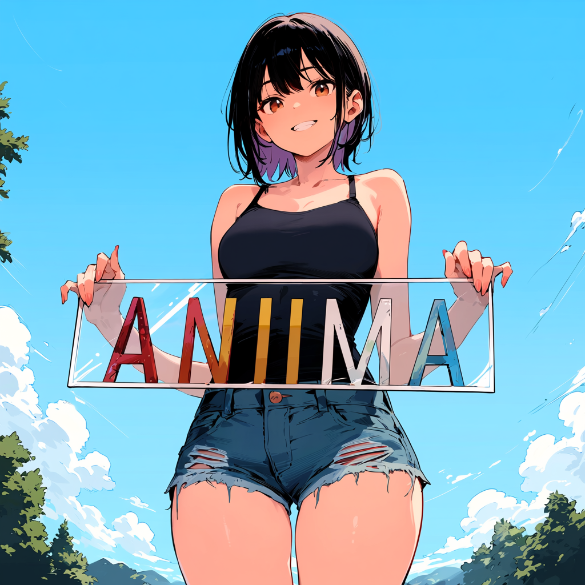
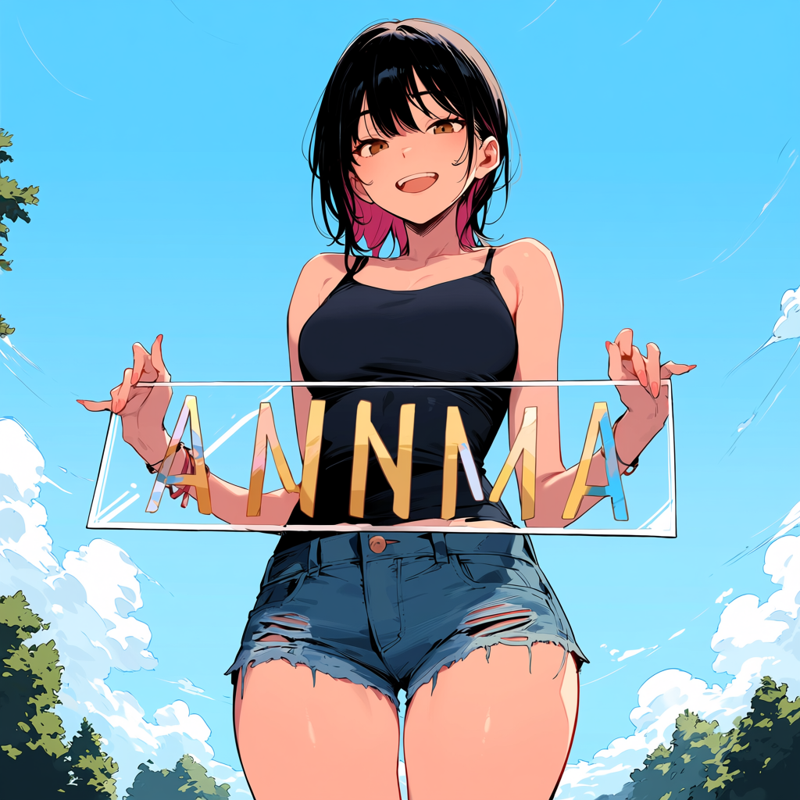

# anima_lora WebUI

[한국어](README.ko.md) · 📖 [Windows 초보자용 한국어 가이드북](docs/guidelines/가이드북.md)
这是面向 [Anima](https://huggingface.co/circlestone-labs/Anima) 的 LoRA / T-LoRA 训练项目。
当前分支基于(https://github.com/sorryhyun/anima_lora#)构建的提供 WebUI前端
：配置编辑、数据集路径管理、多数据集重复次数、预处理、训练任务监控、历史任务和预览图查看。
后端内容基本没动“实验性支持lokr”


## 先部署并启动 WebUI

推荐先按下面步骤把 WebUI 跑起来，再在页面里配置模型路径、数据集路径和训练参数。不要把系统 Python、Conda base 和项目虚拟环境混用；本项目默认让 `uv sync` 在项目内创建 `.venv/`。

### 通用准备

部署前先确认这些条件：

- NVIDIA 显卡驱动可用，命令行执行 `nvidia-smi` 能看到显卡。
- 网络可以访问 GitHub、PyPI / PyTorch wheel 源、Hugging Face。
- Hugging Face 账号已同意 Anima 模型权重许可，并准备好可登录的 token。
- 磁盘预留足够空间给 `.venv/`、`models/`、数据集缓存和训练输出。

本项目默认模型路径是：

```text
models/diffusion_models/anima-base-v1.0.safetensors
models/text_encoders/qwen_3_06b_base.safetensors
models/vae/qwen_image_vae.safetensors
```

如果你已经在别处下载了模型，可以在 WebUI 的“基础模型路径”里改成实际路径；否则按下面步骤用 `tasks.py download-models` 下载到默认目录。

### Linux 分支

Linux 默认使用 Python 3.13、torch 2.12 nightly、CUDA 13.2 和预构建 Flash Attention 2 wheel。

1. 安装系统依赖：

```bash
sudo apt update
sudo apt install -y \
  git git-lfs curl wget build-essential \
  python3 python3-venv python3-pip \
  libgl1 libglib2.0-0
git lfs install
```

2. 安装 `uv`：

```bash
curl -LsSf https://astral.sh/uv/install.sh | sh
source "$HOME/.local/bin/env"
uv --version
```

3. 克隆仓库并进入项目目录：

```bash
git clone https://github.com/scvxzf1/anima_lora_webui.git anima_lora
cd anima_lora
git lfs pull
```

4. 创建项目环境并检查 CUDA：

```bash
uv sync
.venv/bin/python --version
.venv/bin/python -c "import torch; print(torch.__version__); print(torch.version.cuda); print(torch.cuda.is_available())"
```

`torch.cuda.is_available()` 应该输出 `True`。如果是 `False`，先修 NVIDIA 驱动或 CUDA wheel/驱动兼容问题。

5. 登录 Hugging Face 并下载模型：

```bash
.venv/bin/hf auth login
.venv/bin/python tasks.py download-models
```

下载后建议确认文件存在：

```bash
ls models/diffusion_models/anima-base-v1.0.safetensors
ls models/text_encoders/qwen_3_06b_base.safetensors
ls models/vae/qwen_image_vae.safetensors
```

6. 启动 WebUI：

```bash
.venv/bin/python -m web --host 127.0.0.1 --port 20103
```

浏览器打开：

```text
http://127.0.0.1:20103/
```

如果 `20103` 已经有训练任务或 WebUI 页面在运行，不要动它，换一个端口：

```bash
.venv/bin/python -m web --host 127.0.0.1 --port 20104
```

需要局域网访问时，把 host 改成 `0.0.0.0`：

```bash
.venv/bin/python -m web --host 0.0.0.0 --port 20103
```

注意：`0.0.0.0` 会把 WebUI 暴露到当前网络，请确认防火墙和访问环境安全。

更完整的 Linux 部署、后台运行、systemd 和故障排查见 [docs/guidelines/linux-deployment.zh.md](docs/guidelines/linux-deployment.zh.md)。

### Windows 分支

Windows 默认使用 Python 3.13、torch 2.11 stable、CUDA 13.0 和对应的 Flash Attention 2 wheel。建议在 PowerShell 里执行：

1. 安装基础工具：

- 安装 [NVIDIA 驱动](https://www.nvidia.com/Download/index.aspx)，确认 PowerShell 中 `nvidia-smi` 可用。
- 安装 [Git for Windows](https://git-scm.com/download/win)，安装时勾选 Git LFS 或安装后执行 `git lfs install`。
- 安装 `uv`：

```powershell
powershell -ExecutionPolicy ByPass -c "irm https://astral.sh/uv/install.ps1 | iex"
uv --version
git lfs install
```

如果 `uv` 命令找不到，关闭 PowerShell 后重新打开，或把 `%USERPROFILE%\.local\bin` 加入 PATH。

2. 克隆仓库并进入项目目录：

```powershell
git clone https://github.com/scvxzf1/anima_lora_webui.git anima_lora
cd anima_lora
git lfs pull
```

3. 创建项目环境并检查 CUDA：

```powershell
uv sync
.\.venv\Scripts\python.exe --version
.\.venv\Scripts\python.exe -c "import torch; print(torch.__version__); print(torch.version.cuda); print(torch.cuda.is_available())"
```

`torch.cuda.is_available()` 应该输出 `True`。默认 Windows 依赖走 torch 2.11 + CUDA 13.0；如果驱动太旧或依赖解析失败，先更新显卡驱动再重试。

4. 登录 Hugging Face 并下载模型：

```powershell
.\.venv\Scripts\hf.exe auth login
.\.venv\Scripts\python.exe tasks.py download-models
```

下载后建议确认文件存在：

```powershell
Test-Path .\models\diffusion_models\anima-base-v1.0.safetensors
Test-Path .\models\text_encoders\qwen_3_06b_base.safetensors
Test-Path .\models\vae\qwen_image_vae.safetensors
```

5. 启动 WebUI：

```powershell
.\.venv\Scripts\python.exe -m web --host 127.0.0.1 --port 20103
```

浏览器打开：

```text
http://127.0.0.1:20103/
```

如果 PowerShell 禁止激活脚本，不需要激活环境，直接使用上面的 `.\.venv\Scripts\python.exe` 命令即可。如果 `uv sync` 编译或安装依赖失败，再安装 Visual Studio Build Tools 2019/2022 的 C++ build tools 和 Windows SDK。想切换到 CUDA 13.2 + torch 2.12 nightly 的 Windows 高级配置，按 [docs/optimizations/cuda132.md](docs/optimizations/cuda132.md) 修改 `pyproject.toml` 中的 `cuda132 opt-in` 依赖后重新 `uv sync`。

### 启动前检查清单

启动 WebUI 前建议至少确认：

```bash
# Linux
.venv/bin/python -c "import torch, aiohttp, accelerate, toml; print('ok', torch.cuda.is_available())"

# Windows PowerShell
.\.venv\Scripts\python.exe -c "import torch, aiohttp, accelerate, toml; print('ok', torch.cuda.is_available())"
```

还要确认默认模型文件存在，或者已经准备在 WebUI 中改成自己的模型路径。只打开 WebUI 不一定立刻加载模型；预处理、训练、推理预览才会真正依赖这些文件。

### 训练数据准备

默认原始数据集目录是 `image_dataset/`，建议每张图片配一个同名 `.txt` caption：

```text
image_dataset/
├── 0001.png
├── 0001.txt
├── 0002.jpg
├── 0002.txt
└── ...
```

WebUI 的“数据集设置”里填写原始数据集路径后，可以用“自动填入缩放图和缓存目录”生成：

```text
post_image_dataset/resized/
post_image_dataset/lora/
```

训练通常读取缩放图目录和 LoRA 缓存目录；换图片、caption、分辨率或分桶参数后，需要重新预处理并重建缓存。

### WebUI 基本使用顺序

1. 打开“配置”页，选择一个可训练方法变体，例如 LoRA、LoKr、T-LoRA 或 HydraLoRA。
2. 在“基础模型路径”确认 DiT、Qwen3 文本编码器和 VAE 路径。
3. 在“数据集设置”填写原始数据集路径，使用“自动填入缩放图和缓存目录”生成对应路径。
4. 保存配置后先运行预处理，再开始训练。
5. 在“训练任务”和“预览图”里查看日志、loss、GPU 状态、历史样张和输出目录。

### 常见漏项

- `nvidia-smi` 不可用：先修显卡驱动，不要继续折腾 Python。
- `torch.cuda.is_available()` 是 `False`：驱动或 torch/CUDA wheel 不匹配，训练会走不了 GPU。
- Hugging Face 下载失败：确认已登录、已同意模型许可、网络能访问 Hugging Face。
- 找不到模型：检查上面的三个默认模型路径，或在 WebUI 中改成真实路径。
- 找不到图片：确认原始数据集目录存在，并先完成预处理。
- 端口被占用：把 `20103` 换成 `20104` 或其他端口。
- Windows 安装依赖失败：安装 Visual Studio Build Tools C++ 工具链后重新 `uv sync`。

### 常用 CLI 入口

WebUI 是推荐入口；需要命令行时可用这些命令：

```bash
# Linux
.venv/bin/python tasks.py web --host 127.0.0.1 --port 20103
.venv/bin/python tasks.py lora-gui lora
.venv/bin/python tasks.py lora-gui lokr

# Windows PowerShell
.\.venv\Scripts\python.exe tasks.py web --host 127.0.0.1 --port 20103
.\.venv\Scripts\python.exe tasks.py lora-gui lora
.\.venv\Scripts\python.exe tasks.py lora-gui lokr
```

配置合并顺序为：

```text
configs/base.toml -> configs/presets.toml[当前预设] -> configs/gui-methods/<变体>.toml -> WebUI/CLI 覆盖项
```

## 项目概览与研究内容

LoRA / T-LoRA training and inference engine for the [Anima](https://huggingface.co/circlestone-labs/Anima) diffusion model (DiT-based, flow-matching).

Four things this repo aims to do well:

1. **Fast LoRA training** on consumer GPUs — full-model `torch.compile` with CUDAGraph capture, end to end.
2. **Solid conventional implementations** — LoRA, OrthoLoRA, and T-LoRA stack together and bake losslessly into a standalone DiT checkpoint.
3. **Recent methods, engineered for Anima** — Spectrum inference, DCW calibrator, OrthoHydraLoRA, and modulation guidance, each implemented end-to-end against Anima's compile/CUDAGraph contract rather than dropped in as a toy port.
4. **A broad experimental surface** — ReFT, postfix/prefix tuning, IP-Adapter, EasyControl, embedding inversion, img2emb, GRAFT.

> **At-a-glance diagrams** for every method (DiT internals, LoRA, OrthoLoRA, T-LoRA, HydraLoRA, ReFT, Spectrum, modulation, compile optimizations) live in [`docs/structure_images/`](docs/structure_images/) — paired with prose walkthroughs in [`docs/structure/`](docs/structure/).

---

## 1. Fast training

**13.4 GB peak VRAM · 1.1 s/step** on a single RTX 5060 Ti while **rank=32 1MP resolution lora training** — achieved by co-designing the data pipeline, attention, and compiler stack so Dynamo sees one static shape for the whole run.

| Lever | Summary |
|---|---|
| Constant-token bucketing | All buckets target `(H/16)×(W/16) ≈ 4096` patches; batches zero-pad to exactly 4096. One static shape, no compile recompilation. |
| Max-padded text encoder | Text outputs padded to 512 and zero-filled — the pretrained DiT uses zero keys as cross-attn sinks, so trimming breaks it. Also gives the compiler another fixed dim. |
| Per-block `torch.compile` (default) | Each DiT block compiled independently with Inductor. Combined with static tokens this eliminates guard recompilation. |
| Full-model compile + CUDAGraph (opt-in) | Set `compile_mode = "full"` + `compile_inductor_mode = "reduce-overhead"` and Inductor sees the whole 28-block stack while `cudagraph_trees` captures one graph that replays every step — no per-block kernel boundary, no per-step launch overhead. Forces the static-shape contract end to end; incompatible with `gradient_checkpointing` and `blocks_to_swap`. See [full_model_cudagraph.md](docs/optimizations/full_model_cudagraph.md). |
| Compile-friendly hot path | Audited every forward for patterns dynamo can't trace cleanly — `einops.rearrange` replaced with explicit `.unflatten()/.permute()` chains, `torch.autocast` context managers replaced with direct `.to(dtype)` casts, dict `.items()` loops hoisted out of compiled regions, FA4 wrapped in `@torch.compiler.disable` for clean graph breaks. |
| Flash Attention 2 | `flash_attn` 2.x with SDPA fallback. FA4 evaluated and removed — see [fa4.md](docs/optimizations/fa4.md). |

Compile pipeline details in [docs/optimizations/for_compile.md](docs/optimizations/for_compile.md); full-model + CUDAGraph design in [docs/optimizations/full_model_cudagraph.md](docs/optimizations/full_model_cudagraph.md).

---

## 2. Solid conventional implementations

The default training config stacks **LoRA + OrthoLoRA + T-LoRA** together. All three fold losslessly into a standalone DiT checkpoint via thin-SVD export at save time, so you can ship ComfyUI-compatible `*_merged.safetensors` with no adapter loader dependency.

| Variant | Pitch | Details |
|---|---|---|
| **LoRA** | Classic low-rank, rank 16–32. | — |
| **OrthoLoRA** | SVD-parameterized with orthogonality regularization; exports as plain LoRA. | [psoft-integrated-ortholora.md](docs/methods/psoft-integrated-ortholora.md) |
| **T-LoRA** | Timestep-dependent rank masking — low rank at high noise, full rank at low noise. Training-only mask, so merge is bit-equivalent. | [timestep_mask.md](docs/methods/timestep_mask.md) |

**Side-by-side** — same prompt, `er_sde` 30 steps, `cfg=4.0`, 1024². Each LoRA trained at rank 16 for 2 epochs on a 20% subset with training seed 42; inference seeds `{41, 42, 43}`. Reproduce with `python archive/bench_methods.py`.

|  | **LoRA** | **OrthoLoRA + T-LoRA** |
|:---:|:---:|:---:|
| seed 41 |  |  |
| seed 42 |  |  |
| seed 43 |  |  |

<details>
<summary>Base model and individual variants (plain, OrthoLoRA, T-LoRA)</summary>

|  | **plain (base)** | **OrthoLoRA** | **T-LoRA** |
|:---:|:---:|:---:|:---:|
| seed 41 |  |  |  |
| seed 42 |  |  |  |
| seed 43 |  |  |  |

</details>

**Merging**:

```bash
make merge                                  # bake latest LoRA at multiplier 1.0
make merge ADAPTER_DIR=output/ckpt MULTIPLIER=0.8
```

Refuses non-linear-delta variants (ReFT / HydraLoRA `_moe` / postfix / prefix) by default; `--allow-partial` drops those and bakes only the LoRA portion.

---

## 3. Recent methods, engineered for Anima

Four recent papers picked up, implemented against Anima end-to-end, and shipped with the engineering they need to be actually usable — not toy reimplementations.

| Method | What it is | Engineering notes | Doc |
|---|---|---|---|
| **Spectrum inference** | Training-free ~3.75× speedup via Chebyshev polynomial feature forecasting (Han et al., CVPR 2026). On cached steps every transformer block is skipped — only `t_embedder` + `final_layer` + `unpatchify` run. | `register_forward_pre_hook` on `final_layer` captures block outputs without monkey-patching the model; adaptive window schedule concentrates real forwards on early high-noise steps. Stable ComfyUI node in a separate repo: [ComfyUI-Spectrum-KSampler](https://github.com/sorryhyun/ComfyUI-Spectrum-KSampler). | [spectrum.md](docs/methods/spectrum.md) |
| **DCW calibrator** | Sampler-level SNR-t bias correction (Yu et al., CVPR 2026) — mixes each Euler step's `prev_sample` toward the model's `x0_pred` along the LL Haar band. Two modes: scalar `λ` (offline-tuned) and **v4 learnable** per-prompt calibrator with online observation. | v4 head conditions on `(aspect, prompt, observed prefix gap)` and fires after `k=7` warmup steps. Bias direction characterized as **(CFG × aspect)-dependent** on Anima — paper-direction at CFG=4 non-square, paper-opposite at CFG=1 / 1024². Trained per-checkpoint via `make dcw`. | [dcw.md](docs/methods/dcw.md) |
| **OrthoHydraLoRA** | MoE-style multi-head LoRA with orthogonalized experts and layer-local routing — shared `lora_down`, per-expert `lora_up_i`, learned per-sample router. Targets multi-style training without the cross-style bleed a single low-rank subspace produces. Original paper: [arXiv:2605.03252](https://arxiv.org/abs/2605.03252). | Saves two side-by-side files: `anima_hydra.safetensors` (baked-down LoRA, ComfyUI drop-in) and `anima_hydra_moe.safetensors` (full multi-head). Live routing in ComfyUI via the bundled **Anima Adapter Loader** node (`custom_nodes/comfyui-hydralora/`), which installs per-Linear forward hooks reproducing `HydraLoRAModule.forward`. | [hydra-lora.md](docs/methods/hydra-lora.md) |
| **Modulation guidance** | Distill a `pooled_text_proj` MLP that steers AdaLN modulation coefficients toward quality-positive directions (Starodubcev et al., ICLR 2026). Teacher sees real cross-attention; student sees zeroed cross-attention but receives pooled text through modulation. | Trained with `make distill-mod` against the frozen DiT. Inference applies the projection at AdaLN time so it composes with any LoRA variant; `make test-mod` runs a sample with it enabled. | [mod-guidance.md](docs/methods/mod-guidance.md) |

---

## 4. Experimental surface

Each ships with a doc — see the link for usage, flags, and caveats.

| Feature | What it is | Doc |
|---|---|---|
| **ReFT** | Block-level residual-stream intervention (LoReFT, NeurIPS 2024). Composes with any LoRA variant. | [reft.md](docs/methods/reft.md) |
| **Postfix (cond+ortho)** | Caption-conditional postfix vectors with structural orthogonality (Cayley-rotated frozen SVD basis). DiT frozen; only `cond_mlp` trains. | [postfix.md](docs/experimental/postfix.md) |
| **IP-Adapter** | Decoupled image cross-attention (Ye et al. 2023). DiT frozen; trains Perceiver resampler + per-block `to_k_ip`/`to_v_ip`. | [ip-adapter.md](docs/experimental/ip-adapter.md) |
| **EasyControl** | Extended self-attention image conditioning. DiT frozen; trains per-block cond LoRA on self-attn + FFN + scalar `b_cond` gate. | [easycontrol.md](docs/experimental/easycontrol.md) |
| **Embedding inversion** | Optimize a text embedding to match a target image through the frozen DiT. | [invert.md](docs/methods/invert.md) |
| **img2emb resampler** | Learn a reference-image → embedding mapping via TIPSv2-L/14 features + anchor injection. | [archive/img2emb/README.md](archive/img2emb/README.md) |
| **GRAFT** | Rejection-sampling fine-tuning — train, generate, curate survivors, retrain. | [graft-guideline.md](docs/guidelines/graft-guideline.md) |

> **Want to contribute?** Two areas where outside help would have outsized impact: **IP-Adapter productionization** (tests, public reference checkpoint, lighter vision encoder) and **EasyControl adapters** (canny / depth / pose / … — each control type is one self-contained PR). See [CONTRIBUTING.md → Priority areas](CONTRIBUTING.md#priority-areas).

---

## CLI Training

```bash
make preprocess           # VAE-compatible resize & validation
make lora                 # or: PRESET=fast_16gb make lora / PRESET=low_vram make lora / make exp-postfix
make test                 # sample generation with the latest trained LoRA
```

Traditional CLI training is still available for automation and experiments. `make` forwards to `python tasks.py`, so Windows users can run the same targets through `python tasks.py <target>`.

CLI config chain: `configs/base.toml → configs/presets.toml[<preset>] → configs/methods/<method>.toml → CLI args`. Override with `PRESET=low_vram make lora` or `--network_dim 32 --max_train_epochs 64`. Full flag reference in [docs/guidelines/training.md](docs/guidelines/training.md) and [docs/guidelines/inference.md](docs/guidelines/inference.md).

---

## Documentation

| Doc | Contents |
|-----|----------|
| [guidelines/training.md](docs/guidelines/training.md) | Training flags, LoRA variants, caption shuffle, masked loss, dataset config |
| [guidelines/inference.md](docs/guidelines/inference.md) | Inference flags, P-GRAFT, prompt files, LoRA format conversion |
| [guidelines/graft-guideline.md](docs/guidelines/graft-guideline.md) | GRAFT curation workflow |
| [optimizations/](docs/optimizations/) | Compile pipeline, FA4 post-mortem, CUDA 13.2 |
| [methods/](docs/methods/) | One doc per method — HydraLoRA, ReFT, Spectrum, inversion, mod guidance, postfix/prefix, T-LoRA, OrthoLoRA |

---

## License

Toolkit code: [MIT](LICENSE).

Anima / CircleStone **base model weights** ship under the **CircleStone Labs Non-Commercial License v1.0** and are not relicensed by this repo. Any LoRA, fine-tune, or merged checkpoint trained from those weights is a Derivative and inherits the non-commercial terms. See [NOTICE](NOTICE).
