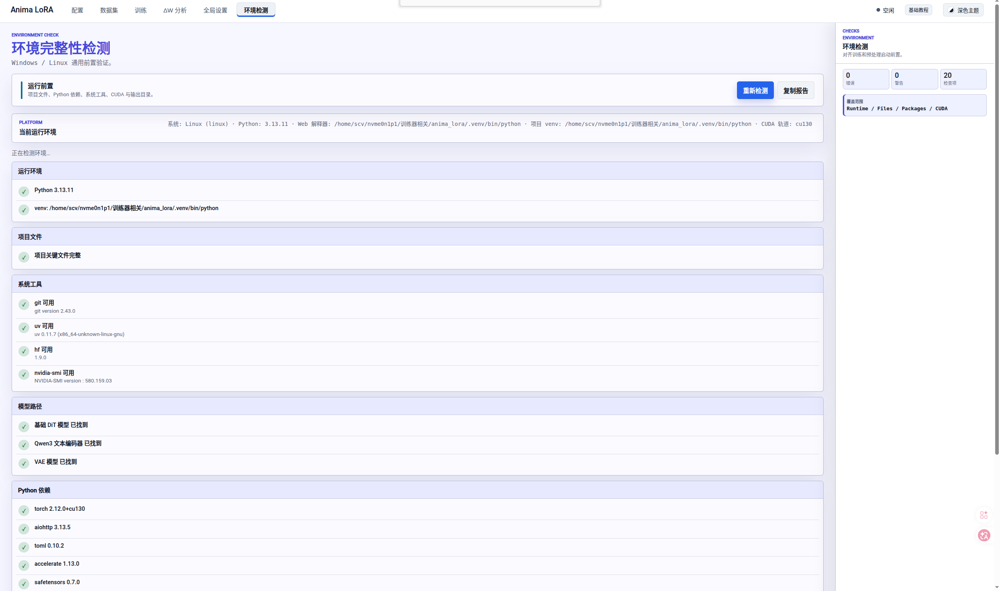
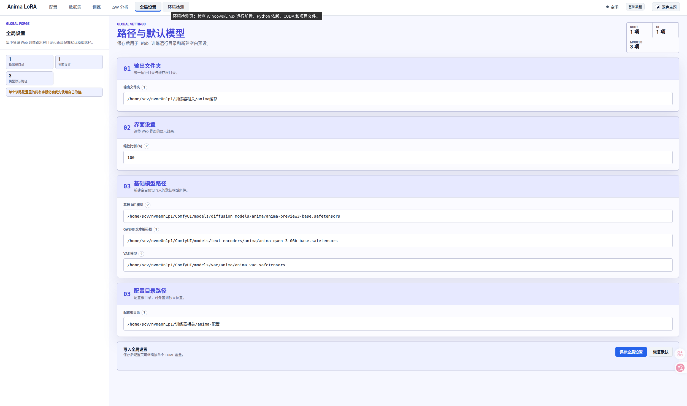
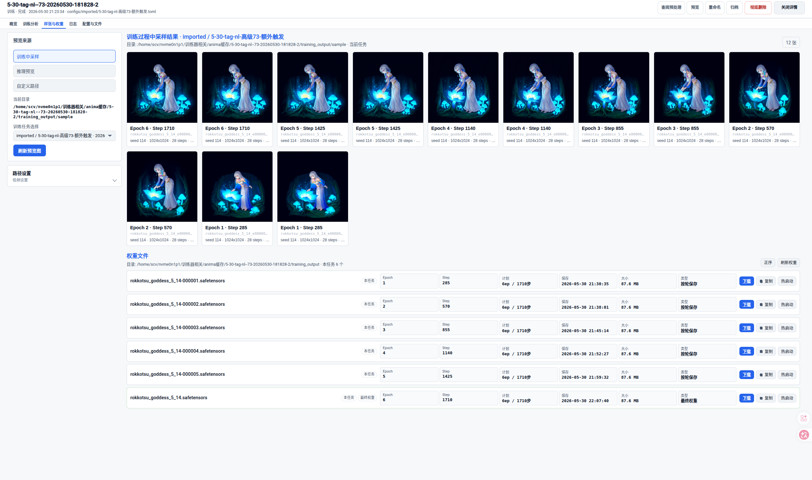
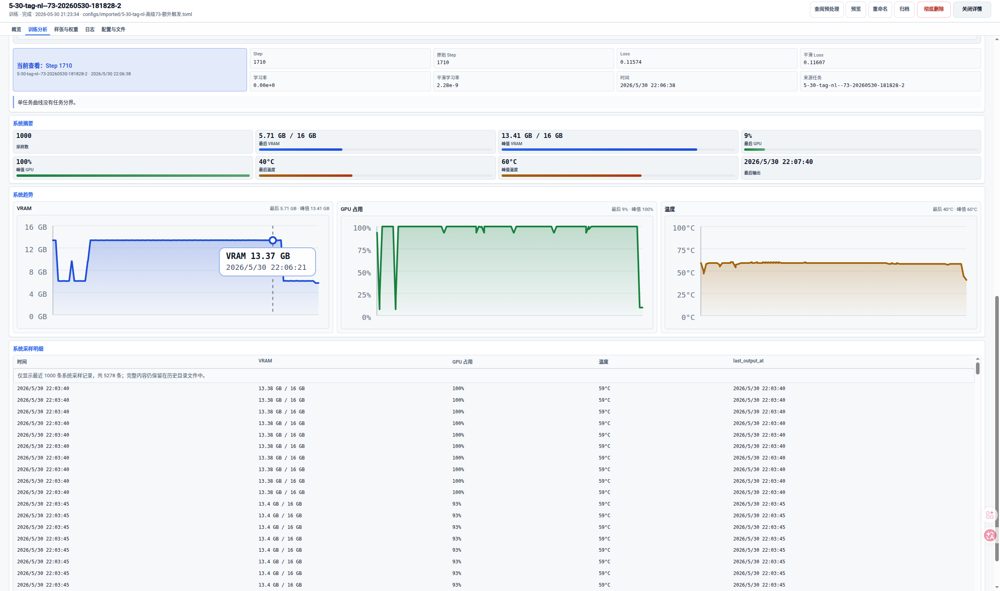
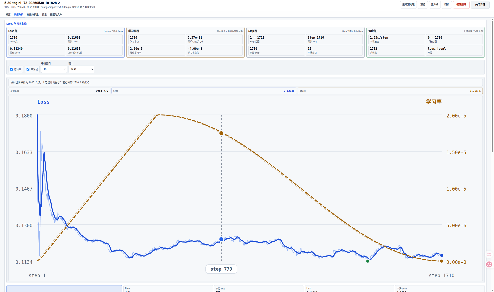
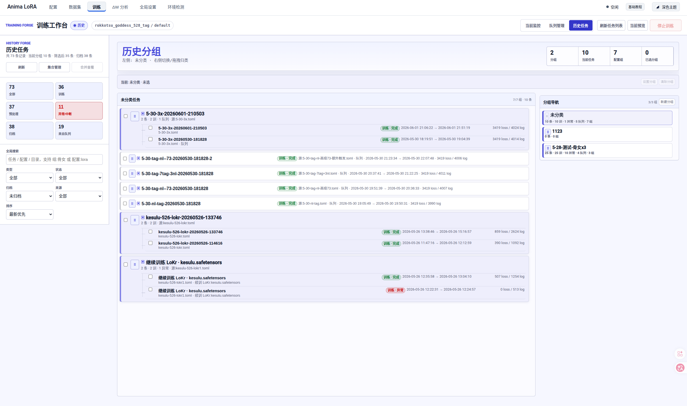
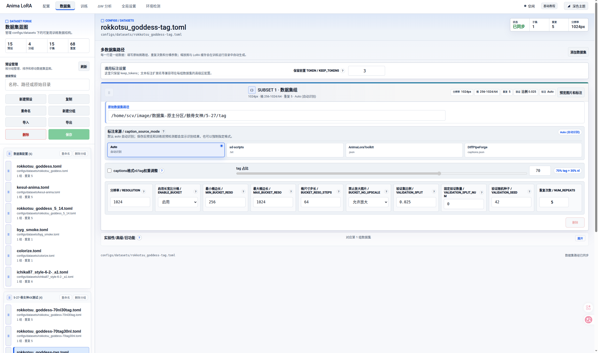
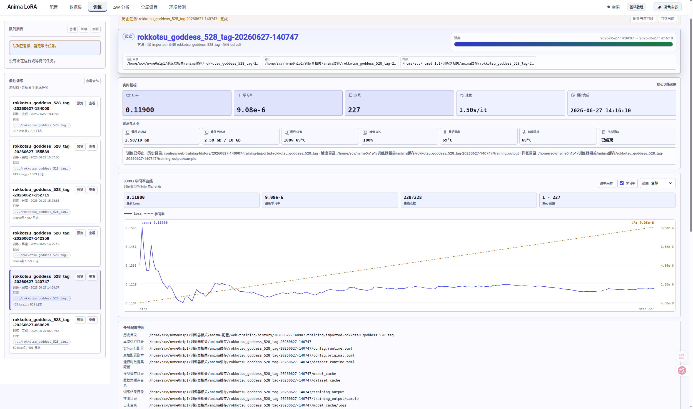
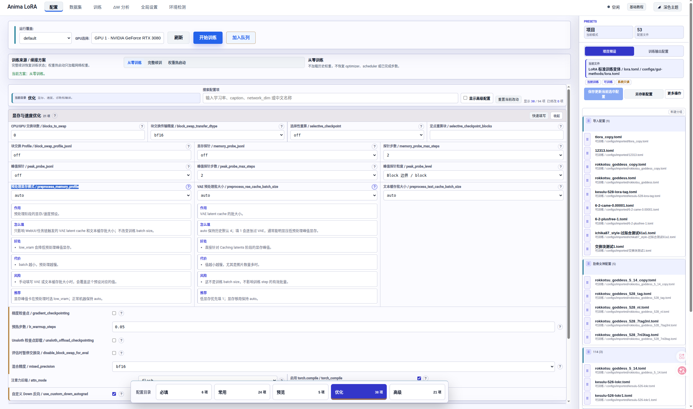

# Anima LoRA WebUI

这是一个面向 Anima 模型的 训练的 WebUI 项目，基于 [sorryhyun/anima_lora](https://github.com/sorryhyun/anima_lora#) 的 WebUI 前端扩展项目

感谢你选择我们的全绊屎山项目。它一定不优雅，但目标也不一定明确，项目尽量还能跑通，喜欢折腾，每天都在debug。

源码部署目前还没发行版，下面截图使用的预览锚点是“4ea68b3”。当前代码会继续向前维护，谨慎更新 pull，随时做好回滚的准备。

交流QQ群:1104879801

后端会和欧巴的有些变动不完全对齐，作者偶尔会发挥主观能动性加点小巧思进来。

## 文档入口

完整文档从 [docs/README.md](docs/README.md) 进入；这里会按“安装使用、训练推理、方法说明、实验记录、配置、归档”分好路。

常用入口：

- 新手部署和 WebUI 使用：[Linux 部署启动](#linux-部署启动)、[Windows 部署启动](#windows-部署启动)
- Linux 部署：[docs/guidelines/linux-deployment.zh.md](docs/guidelines/linux-deployment.zh.md)
- 训练参考：[docs/guidelines/training.md](docs/guidelines/training.md)
- 推理参考：[docs/guidelines/inference.md](docs/guidelines/inference.md)
- 文档归档：[docs/archive-index.md](docs/archive-index.md)

## 项目内容物预览：锚点 `4ea68b3`

以下截图来自稳态锚点附近的 WebUI 状态，用于快速预览主要页面和功能入口。

<table>
  <tr>
    <td width="33%">
      
      <br><sub>环境完整性检测</sub>
    </td>
    <td width="33%">
      
      <br><sub>路径与模型配置</sub>
    </td>
    <td width="33%">
      
      <br><sub>训练结果预览</sub>
    </td>
  </tr>
  <tr>
    <td width="33%">
      
      <br><sub>运行监控面板</sub>
    </td>
    <td width="33%">
      
      <br><sub>Loss 与学习率曲线</sub>
    </td>
    <td width="33%">
      
      <br><sub>历史任务分组</sub>
    </td>
  </tr>
  <tr>
    <td width="33%">
      
      <br><sub>数据集配置</sub>
    </td>
    <td width="33%">
      
      <br><sub>训练任务详情</sub>
    </td>
    <td width="33%">
      
      <br><sub>训练方法配置</sub>
    </td>
  </tr>
</table>

## 大概有哪些能力

1. 训练 LoRA、LoKr、 这两个主要在维护的。“也不一定就是好的”
2. “LoHa、OrthoLoRA、T-LoRA、HydraLoRA、FeRA、ReFT、ChimeraHydra、”这一窝没啥精力维护给我正义切割了，后端没删前端大部分没给配置项给了的也不一定可用。
3. 在 WebUI 里管理训练方法、硬件预设、数据集配置、模型路径和 sample prompts。
4. 支持图片 resize、VAE latent 缓存、文本编码缓存、PE 特征缓存和 caption index 构建。
5. 支持训练队列、任务日志、历史任务分组、失败/中断任务续训和运行状态查看。
6. 支持训练结果预览、权重选择、prompt 预览和基础推理测试。
7. 保留命令行入口，适合自动化训练、实验方法验证和批处理。
8. 附带 ComfyUI custom nodes、实验 bench、结构文档和 pytest 测试。

## 致谢 / “抄袭”列表

不会做还不会抄吗？问题不大的啦：

- [sorryhyun/anima_lora](https://github.com/sorryhyun/anima_lora#)：当前项目的主要基础，WebUI 前端和 Anima LoRA 训练管线都基于它继续扩展。
  [WhitecrowAurora](https://github.com/WhitecrowAurora) ：本项目的大部分的算法优化来源，多出来的优化都是这么来的。
  [MonadForge](https://github.com/LingyeSoul/MonadForge)：lokr换血优化，提升450%速度，伟大的G8炉。
- [Moeblack/AnimaLoraToolkit](https://github.com/Moeblack/AnimaLoraToolkit)：参考了 Anima LoRA 训练工具链、lokr支持，配置组织和使用体验。
- [huggingface/peft](https://github.com/huggingface/peft)：loha兼容支持。
  [DNPMBHC/DiffPipeForge](https://github.com/DNPMBHC/DiffPipeForge) :dpf的一个分支,从中抄袭了块交换缓存和环境检测
- [TianDongL/DiffPipeForge](https://github.com/TianDongL/DiffPipeForge)：参考了数据处理、训练流程和部分工程组织思路。
- [LoganBooker/prodigy-plus-schedule-free](https://github.com/LoganBooker/prodigy-plus-schedule-free)：用于 Prodigy Plus Schedule-Free 优化器支持。
- [kozistr/pytorch_optimizer](https://github.com/kozistr/pytorch_optimizer)：用于 CAME 等 `pytorch-optimizer` 优化器支持。

## Linux 部署启动

建议使用 NVIDIA 显卡，并先确认驱动可用：

```bash
nvidia-smi
```

安装基础工具：

```bash
sudo apt update
sudo apt install -y git git-lfs curl wget build-essential python3 python3-venv python3-pip libgl1 libglib2.0-0
git lfs install
```

安装 `uv`：

```bash
curl -LsSf https://astral.sh/uv/install.sh | sh
source "$HOME/.local/bin/env"
uv --version
```

克隆项目并安装依赖：

```bash
git clone https://github.com/scvxzf1/anima_lora_webui.git
cd anima_lora_webui
git lfs pull
uv sync
```

检查 CUDA：

```bash
.venv/bin/python -c "import torch; print(torch.__version__); print(torch.version.cuda); print(torch.cuda.is_available())"
```

登录 Hugging Face 并下载默认模型：

```bash
.venv/bin/hf auth login
.venv/bin/python tasks.py download-models
```

启动 WebUI：

```bash
.venv/bin/python tasks.py web --host 127.0.0.1 --port 20102
```

浏览器打开：

```text
http://127.0.0.1:20102/
```

需要局域网访问时：

```bash
.venv/bin/python tasks.py web --host 0.0.0.0 --port 20102
```

## Windows 部署启动

建议使用 PowerShell。先安装：

- NVIDIA 显卡驱动，并确认 `nvidia-smi` 可用。
- Git for Windows，安装后执行 `git lfs install`。
- Python 不需要手动单独管理，项目依赖优先交给 `uv`。

安装 `uv`：

```powershell
powershell -ExecutionPolicy ByPass -c "irm https://astral.sh/uv/install.ps1 | iex"
uv --version
```

克隆项目并安装依赖：

```powershell
git clone https://github.com/scvxzf1/anima_lora_webui.git
cd anima_lora_webui
git lfs pull
uv sync
```

检查 CUDA：

```powershell
.\.venv\Scripts\python.exe -c "import torch; print(torch.__version__); print(torch.version.cuda); print(torch.cuda.is_available())"
```

登录 Hugging Face 并下载默认模型：

```powershell
.\.venv\Scripts\hf.exe auth login
.\.venv\Scripts\python.exe tasks.py download-models
```

启动 WebUI：

```powershell
.\.venv\Scripts\python.exe tasks.py web --host 127.0.0.1 --port 20102
```

浏览器打开：

```text
http://127.0.0.1:20102/
```

如果 PowerShell 禁止激活脚本，不需要激活虚拟环境，直接使用上面的 `.\.venv\Scripts\python.exe` 命令即可。

## 启动后怎么用

1. 在 WebUI 里确认基础模型、文本编码器和 VAE 路径。
2. 导入或创建数据集配置。
3. 先执行预处理，生成训练缓存。
4. 选择训练方法和硬件预设。
5. 加入训练队列或直接启动训练。
6. 在历史任务里查看日志、曲线、预览图和续训入口。

默认模型路径：

```text
models/diffusion_models/anima-base-v1.0.safetensors
models/text_encoders/qwen_3_06b_base.safetensors
models/vae/qwen_image_vae.safetensors
```

如果模型放在别处，可以在 WebUI 的全局设置里改成实际路径。
