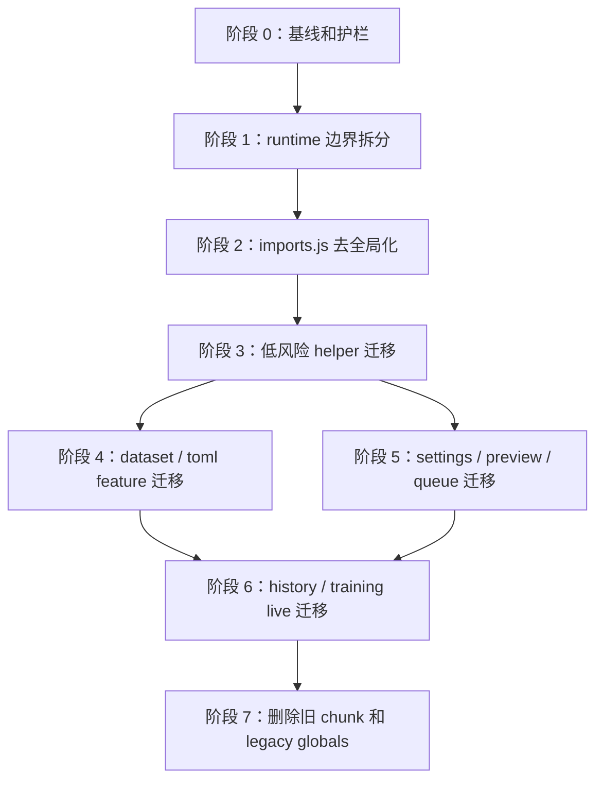

# Anima App 去 globalThis 分层迁移提案

状态：已归档（阶段 0-3 已落地，进入收尾阶段）
适用版本：当前 main
入口命令：无，本文是 `web/static/js/features/anima-app/` 的重构计划
基线日期：2026-07-07
相关代码：
- `web/static/js/features/anima-app/index.js`
- `web/static/js/features/anima-app/runtime.js`
- `web/static/js/features/anima-app/legacy-globals.js`
- `web/static/js/features/anima-app/imports.js`（第七轮已删除）
- `web/static/js/features/anima-app/chunks/*.js`
- `web/static/js/features/anima-app/helpers/*.js`
- `web/static/js/features/anima-app/state/*.js`
- `web/static/js/features/{preview,queue,history-detail,weight-analysis,environment-check,image-test,live-training}/`
- `tests/test_training_frontend_state.py`
- `tests/test_web_config_service.py`
- `tests/test_preview_service.py`
- `tests/test_training_queue.py`

## 核心结论

一句话：先把 `globalThis` 从默认协作方式降级成兼容桥，再把 41 个 chunk 迁到显式 runtime 和 feature 模块。

当前 `anima-app` 已经从单文件迁成模块加载形态，但很多模块仍然通过
`globalThis` 读写状态和互相调用。这样会带来几个问题：

- 依赖关系藏在全局变量里，改一个 chunk 很难判断会影响谁。
- `imports.js` 和 `legacy-globals.js` 把新模块重新挂回全局，导致迁移没有真正收口。
- 41 个 chunk 总计约 19977 行，`globalThis.` 基线 1075 次，碎片很多但边界不清。
- 测试只能验证结果，很难约束“新代码继续往全局塞东西”。

本轮目标不是重写前端，而是做搬家型重构：保持页面行为不变，把隐式全局依赖逐步换成显式 `runtime`、`state`、`api`、`dom` 和 feature contract。

## 实施边界

一句话：本计划只处理 `anima-app` 的模块边界和全局状态，不顺手改产品交互和后端接口。

本轮允许触碰：

- `web/static/js/features/anima-app/index.js`
- `web/static/js/features/anima-app/runtime.js`
- `web/static/js/features/anima-app/legacy-globals.js`
- `web/static/js/features/anima-app/imports.js`
- `web/static/js/features/anima-app/chunks/*.js`
- `web/static/js/features/anima-app/state/*.js`
- 必要的新目录，例如 `web/static/js/features/anima-app/runtime/`、`helpers/`、`features/`
- 相关前端测试和本文档

本轮默认不触碰：

- 后端 API 行为和接口路径
- `web/static/index.html` 的 DOM id 契约，除非先查全 selector 和测试
- CSS 视觉重做
- 训练队列、历史任务、输出目录和用户配置数据
- `train.py`、`library/`、`networks/` 等训练核心代码

如果某阶段必须改 DOM id、后端 payload 或可见交互，需要单独写明影响面、回滚方式和补充测试。

## 迁移不变量

一句话：每一步都要让旧页面继续工作，只减少隐式全局依赖，不改业务语义。

- `createAnimaApp(ctx)` 仍是应用入口。
- `runtime.ctx` 仍承接后端模板注入的上下文对象。
- `legacy-globals.js` 短期保留，但只作为旧 chunk 的兼容桥。
- 新增模块默认不得写 `globalThis.xxx`，除非明确放在兼容桥内。
- 老 chunk 迁移时优先改成 `export function createX(runtime)` 或纯函数 export。
- 状态读写优先走 `runtime.state.<domain>`，不要新建隐式全局状态总线。
- DOM 访问优先走 runtime dom helper 或局部传参，不在模块顶层缓存易失 DOM 节点。
- API 调用优先走 runtime api helper，不在各 chunk 复制 fetch 包装。
- 每轮迁移都要让 `rg "globalThis\\." web/static/js/features/anima-app` 数量下降或持平且有理由。
- `web/static/js/features/anima-app/chunks/` 是过渡层，新功能不继续往这里堆。

## 目标结构

一句话：目标是让入口只负责装配，让状态、API、DOM 和 feature 依赖都显式传递。

目标目录结构：

```text
web/static/js/features/anima-app/
  index.js                 # 应用入口：创建 runtime、注册 feature、启动 app
  runtime.js               # 兼容导出，逐步变薄
  runtime/
    create-runtime.js      # runtime 组装
    api.js                 # api / datasetPresetApi / 超时和错误处理
    dom.js                 # byId、selector、焦点、ARIA 小工具
    events.js              # 统一事件绑定和 cleanup
    feature-registry.js    # feature 注册、启动、销毁
  state/
    *.js                   # 领域状态工厂
  helpers/
    formatters.js
    config-parsing.js
    dataset-model.js
  features/
    dataset-editor/
    toml-manager/
    training-live/
    history-manager/
    global-settings/
  legacy-globals.js        # 只做旧 chunk 兼容桥，最终删除
  chunks/                  # 历史过渡层，逐步清空
```

目标调用形态：

```javascript
export function createDatasetEditorFeature(runtime) {
    const { state, api, dom } = runtime;
    return {
        render() {
            return renderDatasetRows(state.dataset.datasetEditorState, { api, dom });
        },
    };
}
```

## 依赖图

一句话：先建底座，再迁 helper，最后按 feature 收口。



## 阶段计划

一句话：每一阶段都只切一类依赖，避免把全局状态、DOM 和业务行为一起改。

| 阶段 | 目标 | 主要改动 | 验收重点 |
| --- | --- | --- | --- |
| 0 | 建基线和护栏 | 记录 `globalThis` 基线，补测试约束，明确新增代码规则 | 可以量化每轮下降 |
| 1 | 拆 runtime 边界 | 从 `runtime.js` 拆出 `runtime/api.js`、`dom.js`、`events.js`、`feature-registry.js` | 入口行为不变 |
| 2 | 收口 imports | 把 `imports.js` 中的工具函数改为显式 export / runtime 注入 | `imports.js` 不再批量 `Object.assign(globalThis, ...)` |
| 3 | 迁低风险 helper | 迁格式化、解析、纯 DOM 小工具、API wrapper | helper 无全局读写 |
| 4 | 迁 dataset / toml | 把 dataset editor、preset、toml manager 改成 feature 模块 | dataset/toml 流程测试通过 |
| 5 | 迁 settings / preview / queue | 把 global settings、preview、queue view 迁到显式 feature | preview/queue 测试通过 |
| 6 | 迁 history / training live | 处理历史拖拽、timeline、训练状态、日志和 websocket | 高交互路径不回退 |
| 7 | 清旧桥 | 删除空 chunk，收窄或删除 `legacy-globals.js` | `globalThis` 只剩浏览器原生必要使用 |

## 第一轮切片

一句话：第一轮只做可回滚的底座，不直接大规模改业务 chunk。

建议第一轮任务：

| task_id | role | objective | input_scope | output_format | acceptance_criteria | eta | write_scope | sandbox | risk_level |
| --- | --- | --- | --- | --- | --- | --- | --- | --- | --- |
| A0 | explorer | 统计当前全局依赖和 chunk 拓扑 | `web/static/js/features/anima-app/` | 基线清单 | 列出 top globalThis 文件和入口链 | 30m | 文档 | read-only | Low |
| A1 | worker | 拆 runtime API/DOM/events 骨架 | `runtime.js`、`index.js` | 小补丁 | 页面入口不变，测试通过 | 1h | `anima-app/runtime*` | workspace-write | Medium |
| A2 | worker | 加新增 `globalThis` 护栏测试 | `tests/test_training_frontend_state.py` | 测试补丁 | 禁止非桥接文件新增全局写入 | 1h | tests | workspace-write | Medium |
| A3 | reviewer | 复核兼容桥边界 | `legacy-globals.js`、`imports.js` | review 结论 | 明确哪些全局可留、哪些必须迁 | 30m | 文档 | read-only | Low |

第一轮不迁 dataset、history、training live 等高交互模块，只把后续搬迁的地基铺好。

## 第一轮落地记录

一句话：2026-07-07 已先落 runtime 底座和新增全局写入护栏，业务 chunk 暂不搬迁。

当前基线：

| 指标 | 数量 |
| --- | --- |
| `anima-app/chunks/*.js` | 41 个 |
| `chunks/` 总行数 | 19977 行 |
| `anima-app/**/*.js` | 55 个 |
| `anima-app/**/*.js` 总行数 | 20545 行 |
| `globalThis.` 出现次数 | 1075 次 |

已落地：

- `runtime.js` 改成 runtime 组装层。
- 新增 `runtime/api.js`，提供 `runtime.api()`、`runtime.api.request` 和 `runtime.api.datasetPresetApi()`。
- 新增 `runtime/dom.js`，统一承接 `ctx.dom`，给后续 feature 迁移提供显式 DOM helper。
- 新增 `runtime/events.js`，提供事件绑定 cleanup 池。
- 新增 `runtime/feature-registry.js`，提供 feature 注册、获取和销毁入口，同时兼容旧 `runtime.features.foo = ...` 写法。
- `tests/test_training_frontend_state.py` 已要求 runtime 子模块从生产入口可达，并把 `anima-app/runtime/`、`helpers/`、`features/` 纳入零 `globalThis` 写入护栏。

本轮刻意未迁：

- dataset、toml、history、training live 等高交互 chunk。
- `legacy-globals.js` 的旧状态代理。

兼容桥复核：

| 文件 | 当前角色 | 下一步 |
| --- | --- | --- |
| `legacy-globals.js` | 保留 `ctx`、runtime state proxy、image-test bridge、status polling bridge，并临时安装旧 imports 全局名 | 每迁走一个旧 chunk 后缩小桥接面 |
| `imports.js` | 已改成 `createAnimaImports(ctx)` 显式导出，不再写 `globalThis` | 阶段 2 后续继续把旧 chunk 改成直接 import / runtime 注入 |
| `index.js` | 仍按顺序加载 41 个 chunk，并最终调用 `globalThis.startAnimaApp()` | 后续按 feature 注册替代最终全局启动 |
| `chunks/36-setup-event-listeners.js` | 仍提供 `datasetPresetApi`、`api`、`val` 等全局旧入口 | 迁 dataset/toml 前先把这些入口映射到 `runtime.api` / `runtime.dom` |

## 第二轮落地记录

一句话：2026-07-07 已启动阶段 2，把 `imports.js` 从全局污染点改成显式 imports bundle。

当前阶段 2 基线：

| 指标 | 数量 |
| --- | --- |
| `globalThis.` 出现次数 | 1072 次 |
| `imports.js` 直接 `globalThis.xxx = ...` | 0 次 |
| `imports.js` `Object.assign(globalThis, ...)` | 0 次 |

已落地：

- `imports.js` 导出 `createAnimaImports(ctx)`，返回 split feature 工厂、sample prompt helper、toml group helper、history system formatter、`MetricsChart` 和 `formatLossValue`。
- `legacy-globals.js` 新增 `installLegacyImportGlobals(runtime, imports)`，临时把旧 chunk 仍需要的名字安装到全局。
- `index.js` 显式加载 `imports.js` 后调用 `installLegacyImportGlobals(runtime, importsModule.createAnimaImports(ctx))`。
- `tests/test_training_frontend_state.py` 已把 `imports.js` 的全局写入基线降到 `(0, 0)`，并断言 `imports.js` 不再包含 `globalThis.` / `Object.assign(globalThis, ...)`。

本轮仍未迁：

- 旧 chunk 中的裸全局引用，例如 `createPreviewFeature(...)`、`formatLossValue(...)`、`readTomlGroupState(...)`。
- `legacy-globals.js` 中用于兼容旧 chunk 的动态全局安装。

## 第三轮落地记录

一句话：2026-07-07 继续把旧 API/DOM helper 入口从业务 chunk 挪到 runtime 和兼容桥。

已落地：

- `runtime/api.js` 承接 `datasetPresetApi()` 的 `timeoutMs` 逻辑，继续复用 `ctx.api`。
- `legacy-globals.js` 新增 `installLegacyRuntimeGlobals(runtime)`，临时安装旧 chunk 仍依赖的 `api`、`datasetPresetApi`、`val`、`populateSelect`。
- `index.js` 在加载任何旧 chunk 前调用 `installLegacyRuntimeGlobals(runtime)`。
- `chunks/36-setup-event-listeners.js` 不再定义 `api`、`datasetPresetApi`、`val`、`populateSelect` 四个全局入口。
- `tests/test_training_frontend_state.py` 已把 `chunks/36-setup-event-listeners.js` 的全局写入基线从 `(7, 0)` 降到 `(3, 0)`，并检查 `datasetPresetApi` timeout 逻辑位于 `runtime/api.js`。

当前阶段 2 / 3 过渡状态：

| 指标 | 数量 |
| --- | --- |
| `globalThis.` 出现次数 | 1072 次 |
| `imports.js` 直接全局写入 | 0 次 |
| `chunks/36-setup-event-listeners.js` 直接全局写入 | 3 次 |

## 第四轮落地记录

一句话：2026-07-07 开始阶段 3，把 network args 纯 helper 从业务 chunk 迁到 `helpers/`。

已落地：

- 新增 `helpers/network-args.js`，导出 `parseNetworkArgEntry()`、`stripNetworkArgQuotes()`、`coerceNetworkArgValue()`、`parseBooleanNetworkArg()`。
- `legacy-globals.js` 新增 `installLegacyNetworkArgGlobals()`，在旧 chunk 迁完前临时把上述 4 个旧全局名代理到 helper。
- `index.js` 在加载旧 chunk 前调用 `installLegacyNetworkArgGlobals()`。
- `chunks/03-parse-network-arg-entry.js` 不再定义这 4 个 helper，也移除了未使用的 `const ctx = globalThis.ctx`。
- 前端模块 cache token 已同步 bump 到 `module-bootstrap-20260707-3`。
- `tests/test_training_frontend_state.py` 新增 Node 合同测试，验证 helper 导出和旧全局桥接行为。

当前阶段 3 过渡状态：

| 指标 | 数量 |
| --- | --- |
| `globalThis.` 出现次数 | 1071 次 |
| `imports.js` 直接全局写入 | 0 次 |
| `helpers/network-args.js` 直接全局写入 | 0 次 |
| `chunks/03-parse-network-arg-entry.js` 直接全局写入 | 27 次 |
| `chunks/36-setup-event-listeners.js` 直接全局写入 | 3 次 |

本轮验证：

```bash
git diff --check -- web/static docs/proposal tests/test_training_frontend_state.py
timeout 60 .venv/bin/python -m pytest tests/test_training_frontend_state.py
timeout 60 .venv/bin/python -m pytest tests/test_preview_service.py tests/test_training_queue.py
```

## 第五轮落地记录

一句话：2026-07-07 继续阶段 3，把表单值解析和 network args 格式化 helper 从业务 chunk 收到 `helpers/`。

已落地：

- 新增 `helpers/form-values.js`，导出 `parseNumberValue()`、`parseArrayValue()`、`valuesEqual()`、`isBooleanLikeValue()`、`normalizeBooleanLikeValue()`、`isNumberLikeValue()`、`normalizeMultilineText()`。
- `helpers/network-args.js` 继续承接 `formatNetworkArg()` 和 `formatNetworkArgValue()`。
- `legacy-globals.js` 新增 `installLegacyFormValueGlobals()`，并扩展 `installLegacyNetworkArgGlobals()`，旧 chunk 仍能通过旧全局名调用这些 helper。
- `index.js` 在加载旧 chunk 前调用 `installLegacyFormValueGlobals()`。
- `chunks/18-delete-dataset-preset-group.js` 不再定义上述 9 个纯 helper。
- 前端模块 cache token 已同步 bump 到 `module-bootstrap-20260707-4`。
- `tests/test_training_frontend_state.py` 新增 Node 合同测试，验证 form value helper 导出和旧全局桥接行为。

当前阶段 3 过渡状态：

| 指标 | 数量 |
| --- | --- |
| `globalThis.` 出现次数 | 1071 次 |
| `helpers/network-args.js` 直接全局写入 | 0 次 |
| `helpers/form-values.js` 直接全局写入 | 0 次 |
| `chunks/03-parse-network-arg-entry.js` 直接全局写入 | 27 次 |
| `chunks/18-delete-dataset-preset-group.js` 直接全局写入 | 23 次 |
| `chunks/36-setup-event-listeners.js` 直接全局写入 | 3 次 |

说明：本轮原始 `globalThis.` 总数持平，是因为旧全局名暂时集中到了 `legacy-globals.js`，业务 chunk 的直接全局写入已经下降。后续迁完调用点后再缩小兼容桥。

本轮验证：

```bash
git diff --check -- web/static docs/proposal tests/test_training_frontend_state.py
timeout 60 .venv/bin/python -m pytest tests/test_training_frontend_state.py
timeout 60 .venv/bin/python -m pytest tests/test_preview_service.py tests/test_training_queue.py
```

## 第六轮落地记录

一句话：2026-07-07 继续缩小 `legacy-globals.js`，让已抽出的纯 helper 由旧 chunk 直接 import。

已落地：

- `chunks/02-ensure-history-detail-feature.js` 直接 import `helpers/network-args.js` 和 `helpers/form-values.js`。
- `chunks/14-lora-adapter-kind-from-config.js` 直接 import `helpers/form-values.js`。
- `chunks/18-delete-dataset-preset-group.js` 直接 import `helpers/network-args.js` 和 `helpers/form-values.js`。
- `legacy-globals.js` 删除 `installLegacyNetworkArgGlobals()` 和 `installLegacyFormValueGlobals()`，不再把 network/form helper 暴露成旧全局名。
- `index.js` 删除对应 legacy helper 安装调用。
- 前端模块 cache token 已同步 bump 到 `module-bootstrap-20260707-5`。
- `tests/test_training_frontend_state.py` 改为验证 helper 直接 export 行为，并断言 legacy bridge 不再包含 network/form helper 全局名。

当前阶段 3 过渡状态：

| 指标 | 数量 |
| --- | --- |
| `globalThis.` 出现次数 | 1058 次 |
| `legacy-globals.js` 直接全局写入 | 8 次 |
| `helpers/network-args.js` 直接全局写入 | 0 次 |
| `helpers/form-values.js` 直接全局写入 | 0 次 |
| `chunks/02-ensure-history-detail-feature.js` 直接全局写入 | 32 次 |
| `chunks/14-lora-adapter-kind-from-config.js` 直接全局写入 | 38 次 |
| `chunks/18-delete-dataset-preset-group.js` 直接全局写入 | 23 次 |

本轮验证：

```bash
git diff --check -- web/static docs/proposal tests/test_training_frontend_state.py
timeout 60 .venv/bin/python -m pytest tests/test_training_frontend_state.py
timeout 60 .venv/bin/python -m pytest tests/test_preview_service.py tests/test_training_queue.py
```

## 第七轮落地记录

一句话：2026-07-07 删除 `imports.js` 动态全局桥，让旧 chunk 直接 import 已拆分模块。

已落地：

- 删除 `web/static/js/features/anima-app/imports.js`。
- `index.js` 不再动态 import `imports.js`，也不再调用 `installLegacyImportGlobals()`。
- `legacy-globals.js` 删除 `installLegacyImportGlobals()`，不再通过 `globalThis[key] = value` 批量挂载 split feature 和 helper。
- `chunks/01-scope-state.js` 直接 import preview、queue、environment-check、weight-analysis feature 工厂。
- `chunks/01a-image-test-feature.js` 直接 import image-test feature 工厂。
- `chunks/02-ensure-history-detail-feature.js` 直接 import history-detail feature、app-shell controllers 和 `MetricsChart`。
- `chunks/03`、`15`、`25`、`34` 直接 import history-detail formatter / system helper。
- `chunks/14`、`18` 直接 import sample-prompts helper。
- `chunks/20` 直接 import toml group state helper。
- 前端模块 cache token 已同步 bump 到 `module-bootstrap-20260707-6`。
- `tests/test_training_frontend_state.py` 已改为断言 `imports.js` 不再在生产模块图里，且文件已不存在。

当前阶段 3 过渡状态：

| 指标 | 数量 |
| --- | --- |
| `globalThis.` 出现次数 | 1057 次 |
| `legacy-globals.js` 直接全局写入 | 8 次 |
| `imports.js` | 已删除 |
| `helpers/network-args.js` 直接全局写入 | 0 次 |
| `helpers/form-values.js` 直接全局写入 | 0 次 |

本轮验证：

```bash
git diff --check -- web/static docs/proposal tests/test_training_frontend_state.py
timeout 60 .venv/bin/python -m pytest tests/test_training_frontend_state.py
timeout 60 .venv/bin/python -m pytest tests/test_preview_service.py tests/test_training_queue.py
```

## 第八轮落地记录

一句话：2026-07-07 继续缩小 live-training helper 的旧全局桥，改成旧 chunk 直接 import。

已落地：

- `chunks/02-ensure-history-detail-feature.js` 直接 import `formatLr()` 和 `lastValue()`。
- `chunks/03-parse-network-arg-entry.js` 直接 import `formatLr()`。
- `chunks/24-show-preflight-pending-dialog.js` 直接 import `parseMetricsFromProgressLine()`。
- `chunks/34-show-history-collection-select-dialog.js` 直接 import `formatLr()`、`lastValue()` 和 `readConfigNumber()`。
- `chunks/35-render-config-group-timeline.js` 直接 import `formatLr()`、`lastValue()` 和 `parseMetricsFromProgressLine()`。
- `chunks/25-update-progress.js` 删除 live-training helper 的 `Object.assign(globalThis, ...)` 批量桥，只 import 自己实际使用的 `calculateTrainingEtaMetricInfo()`、`formatLr()` 和 `parseProgressRateSeconds()`。
- 前端模块 cache token 已同步 bump 到 `module-bootstrap-20260707-7`。
- `tests/test_training_frontend_state.py` 把 `chunks/25-update-progress.js` 的全局写入基线降到 `(18, 0)`，并让 REST fallback 测试直接读取 `live-training/index.js` 里的 metrics parser。

当前阶段 3 过渡状态：

| 指标 | 数量 |
| --- | --- |
| `globalThis.` 出现次数 | 1057 次 |
| `legacy-globals.js` 直接全局写入 | 8 次 |
| `chunks/25-update-progress.js` `Object.assign(globalThis, ...)` | 0 次 |
| 旧 cache token `module-bootstrap-20260707-6` | 0 处 |

说明：本轮移除的是 `Object.assign(globalThis, ...)` 批量桥，不是 `globalThis.` 点号写法，所以 `globalThis.` 总数保持不变，但新增全局桥面继续缩小。

本轮验证：

```bash
git diff --check -- web/static docs/proposal tests/test_training_frontend_state.py
timeout 60 .venv/bin/python -m pytest tests/test_training_frontend_state.py
timeout 60 .venv/bin/python -m pytest tests/test_preview_service.py tests/test_training_queue.py
```

## 第九轮落地记录

一句话：2026-07-07 删除 `ctx.catalog` 的全局批量桥，让旧 chunk 直接 import catalog 常量。

已落地：

- `chunks/01-scope-state.js` 删除 `Object.assign(globalThis, ctx.catalog)`。
- 18 个旧 chunk 直接 import `web/static/js/config/catalog.js` 中实际使用的常量和 helper。
- 前端模块 cache token 已同步 bump 到 `module-bootstrap-20260707-8`。
- `tests/test_training_frontend_state.py` 把 `chunks/01-scope-state.js` 的全局写入基线降到 `(31, 0)`，并断言旧容器不再出现 `Object.assign(globalThis, ctx.catalog)`。

当前阶段 3 过渡状态：

| 指标 | 数量 |
| --- | --- |
| `globalThis.` 出现次数 | 1057 次 |
| `legacy-globals.js` 直接全局写入 | 8 次 |
| `chunks/01-scope-state.js` `Object.assign(globalThis, ...)` | 0 次 |
| `anima-app` 生产代码 `Object.assign(globalThis, ...)` | 0 处 |
| 旧 cache token `module-bootstrap-20260707-7` | 0 处 |

说明：本轮把 catalog 依赖从隐式全局改成显式 import，`globalThis.` 总数没有明显下降，但批量全局污染点已经清零。

本轮验证：

```bash
git diff --check -- web/static docs/proposal tests/test_training_frontend_state.py
timeout 60 .venv/bin/python -m pytest tests/test_training_frontend_state.py
timeout 60 .venv/bin/python -m pytest tests/test_preview_service.py tests/test_training_queue.py
```

## 第十轮落地记录

一句话：2026-07-07 把 `01-scope-state.js` 里的只读常量搬到显式 helper，继续减少旧全局状态。

已落地：

- 新增 `helpers/app-constants.js`，承接资源预设、无数据集正则化预设、拖拽 MIME、历史未分类 key、dataset preset localStorage key、sample prompts 默认路径等只读常量。
- `chunks/01-scope-state.js` 删除 25 个常量的 `globalThis.xxx = ...` 写入，只保留旧 feature 确保函数桥。
- 使用这些常量的旧 chunk 改成直接 import `../helpers/app-constants.js`。
- 前端模块 cache token 已同步 bump 到 `module-bootstrap-20260707-9`。
- `tests/test_training_frontend_state.py` 把 `chunks/01-scope-state.js` 的全局写入基线降到 `(6, 0)`，并断言 `helpers/app-constants.js` 从生产模块图可达。

当前阶段 3 过渡状态：

| 指标 | 数量 |
| --- | --- |
| `globalThis.` 出现次数 | 1032 次 |
| `chunks/01-scope-state.js` 直接全局写入 | 6 次 |
| `helpers/app-constants.js` 直接全局写入 | 0 次 |
| `anima-app` 生产代码 `Object.assign(globalThis, ...)` | 0 处 |
| 旧 cache token `module-bootstrap-20260707-8` | 0 处 |

说明：本轮减少的是只读常量全局写入，未改 feature 创建函数的旧桥；下一步可以继续把 `ensure*Feature` 迁成 runtime feature registry。

本轮验证：

```bash
git diff --check -- web/static docs/proposal tests/test_training_frontend_state.py
timeout 60 .venv/bin/python -m pytest tests/test_training_frontend_state.py
timeout 60 .venv/bin/python -m pytest tests/test_preview_service.py tests/test_training_queue.py
```

## 第十轮落地记录

一句话：2026-07-07 继续缩小 `01-scope-state.js`，把 history artifact URL 纯 helper 从全局函数迁到显式 import。

已落地：

- 新增 `helpers/history-artifacts.js`，导出 `makeHistoryArtifactUrl()`。
- `chunks/02-ensure-history-detail-feature.js` 直接 import `makeHistoryArtifactUrl()`，继续把它作为 `historyArtifactUrl` contract 注入 history-detail feature。
- `chunks/01-scope-state.js` 删除 `globalThis.makeHistoryArtifactUrl = ...`。
- `tests/test_training_frontend_state.py` 把 `chunks/01-scope-state.js` 全局写入基线从 `(6, 0)` 降到 `(5, 0)`，并新增 helper URL 编码 / download 参数合同测试。
- 前端模块 cache token 已同步 bump 到 `module-bootstrap-20260707-10`。

当前阶段 3 过渡状态：

| 指标 | 数量 |
| --- | --- |
| `globalThis.` 出现次数 | 1031 次 |
| `chunks/01-scope-state.js` 直接全局写入 | 5 次 |
| `helpers/history-artifacts.js` 直接全局写入 | 0 次 |
| `anima-app` 生产代码 `Object.assign(globalThis, ...)` | 0 处 |
| 旧 cache token `module-bootstrap-20260707-9` | 0 处 |

说明：本轮迁的是纯 URL helper，未改 history-detail feature 的外部 contract；下一步适合继续迁 `isLiveRunningState()`，但它横跨 status polling、progress、toml action 和 training source，需要先把调用点集中到一个 live-training runtime/helper。

本轮验证：

```bash
git diff --check -- web/static docs/proposal tests/test_training_frontend_state.py
timeout 60 .venv/bin/python -m pytest tests/test_training_frontend_state.py
timeout 60 .venv/bin/python -m pytest tests/test_preview_service.py tests/test_training_queue.py
```

## 第十一轮落地记录

一句话：2026-07-07 把训练运行态判断从 `01-scope-state.js` 全局函数迁到 live-training 显式 helper。

已落地：

- `live-training/index.js` 新增导出 `isLiveRunningState(state)`，只做纯状态判断。
- `chunks/22-update-toml-action-state.js`、`23-move-current-toml-to-group.js`、`24-show-preflight-pending-dialog.js`、`25-update-progress.js`、`26a-status-polling.js`、`37-config-training-source.js` 改成直接 import 该 helper。
- 原来无参依赖全局默认值的调用已改为显式传入 `trainingRuntime.state` 或 status payload state。
- `chunks/01-scope-state.js` 删除 `globalThis.isLiveRunningState = ...`。
- `tests/test_training_frontend_state.py` 把 `chunks/01-scope-state.js` 全局写入基线从 `(5, 0)` 降到 `(4, 0)`，并给 `isLiveRunningState()` 增加 helper 合同测试。
- 前端模块 cache token 已同步 bump 到 `module-bootstrap-20260707-11`。

当前阶段 3 过渡状态：

| 指标 | 数量 |
| --- | --- |
| `globalThis.` 出现次数 | 1030 次 |
| `chunks/01-scope-state.js` 直接全局写入 | 4 次 |
| `live-training/index.js` 直接全局写入 | 0 次 |
| `anima-app` 生产代码 `Object.assign(globalThis, ...)` | 0 处 |
| 旧 cache token `module-bootstrap-20260707-10` | 0 处 |

说明：本轮减少的是旧状态判断全局桥，未迁 `ensure*Feature()` 创建函数；下一步可以优先收口 `ensureWeightAnalysisFeature()` 或 `ensureEnvironmentCheckFeature()`，它们引用面比 preview/queue 小。

本轮验证：

```bash
git diff --check -- web/static docs/proposal tests/test_training_frontend_state.py
timeout 60 .venv/bin/python -m pytest tests/test_training_frontend_state.py
timeout 60 .venv/bin/python -m pytest tests/test_preview_service.py tests/test_training_queue.py
timeout 60 .venv/bin/python -m pytest tests/test_training_resume.py
```

## 第十二轮落地记录

一句话：2026-07-07 继续缩小 `01-scope-state.js`，把 weight analysis 和 environment check 的 feature 创建桥迁到显式 helper。

已落地：

- 新增 `helpers/feature-ensurers.js`，导出 `ensureWeightAnalysisFeature(ctx, holder)` 和 `ensureEnvironmentCheckFeature(ctx, holder)`。
- `chunks/36-setup-event-listeners.js` 直接 import helper，并显式传入 `ctx` 和当前旧状态 holder。
- `chunks/02-ensure-history-detail-feature.js` 给 `createTabController()` 注入无参 wrapper，内部转到新 helper。
- `chunks/01-scope-state.js` 删除 `globalThis.ensureWeightAnalysisFeature = ...` 和 `globalThis.ensureEnvironmentCheckFeature = ...`，现在只剩 preview/queue 两个较大的旧 feature 创建桥。
- `tests/test_training_frontend_state.py` 把 `chunks/01-scope-state.js` 全局写入基线从 `(4, 0)` 降到 `(2, 0)`，并断言新 helper 从生产模块图可达。
- 前端模块 cache token 已同步 bump 到 `module-bootstrap-20260707-12`。

当前阶段 3 过渡状态：

| 指标 | 数量 |
| --- | --- |
| `globalThis.` 出现次数 | 1028 次 |
| `chunks/01-scope-state.js` 直接全局写入 | 2 次 |
| `helpers/feature-ensurers.js` 直接全局写入 | 0 次 |
| `anima-app` 生产代码 `Object.assign(globalThis, ...)` | 0 处 |
| 旧 cache token `module-bootstrap-20260707-11` | 0 处 |

说明：本轮迁的是引用面较小的 feature 创建桥。`01-scope-state.js` 剩余的 `ensureQueueFeature()` 和 `ensurePreviewFeature()` 依赖较多旧全局函数，下一步要拆时建议先搬 queue 或 preview 的依赖对象组装，而不是直接整段搬走。

本轮验证：

```bash
git diff --check -- web/static docs/proposal tests/test_training_frontend_state.py
timeout 60 .venv/bin/python -m pytest tests/test_training_frontend_state.py
timeout 60 .venv/bin/python -m pytest tests/test_weight_analysis_service.py
timeout 60 .venv/bin/python -m pytest tests/test_preview_service.py tests/test_training_queue.py
```

## 第十三轮落地记录

一句话：2026-07-07 把 queue feature 创建桥从 `01-scope-state.js` 迁到显式 helper，`01-scope-state.js` 只剩 preview 桥。

已落地：

- `helpers/feature-ensurers.js` 新增 `configureQueueFeatureEnsurer(ctx, holder, deps)` 和 `ensureQueueFeature()`。
- `chunks/01-scope-state.js` 不再写 `globalThis.ensureQueueFeature = ...`，改为一次性注册 queue deps。
- `chunks/23-move-current-toml-to-group.js`、`26-load-global-settings.js`、`35-render-config-group-timeline.js`、`36-setup-event-listeners.js` 改成直接 import `ensureQueueFeature()`。
- `tests/test_training_frontend_state.py` 把 `chunks/01-scope-state.js` 全局写入基线从 `(2, 0)` 降到 `(1, 0)`，并断言 `globalThis.ensureQueueFeature` 不再出现。
- 前端模块 cache token 已同步 bump 到 `module-bootstrap-20260707-13`。

当前阶段 3 过渡状态：

| 指标 | 数量 |
| --- | --- |
| `globalThis.` 出现次数 | 1027 次 |
| `chunks/01-scope-state.js` 直接全局写入 | 1 次 |
| `helpers/feature-ensurers.js` 直接全局写入 | 0 次 |
| `anima-app` 生产代码 `Object.assign(globalThis, ...)` | 0 处 |
| 旧 cache token `module-bootstrap-20260707-12` | 0 处 |

说明：本轮只搬 queue 创建桥，不改 queue feature 内部行为。`01-scope-state.js` 剩余唯一全局写入是 `ensurePreviewFeature()`；下一轮可用同样的配置器方式迁 preview。

本轮验证：

```bash
git diff --check -- web/static docs/proposal tests/test_training_frontend_state.py
timeout 60 .venv/bin/python -m pytest tests/test_training_frontend_state.py
timeout 60 .venv/bin/python -m pytest tests/test_training_queue.py
timeout 60 .venv/bin/python -m pytest tests/test_training_resume.py
timeout 60 .venv/bin/python -m pytest tests/test_preview_service.py
```

## 第十四轮落地记录

一句话：2026-07-07 把 preview feature 创建桥从 `01-scope-state.js` 迁到显式 helper，`01-scope-state.js` 直接全局写入归零。

已落地：

- `helpers/feature-ensurers.js` 新增 `configurePreviewFeatureEnsurer(ctx, holder, deps)` 和 `ensurePreviewFeature()`。
- `chunks/01-scope-state.js` 不再写 `globalThis.ensurePreviewFeature = ...`，改为一次性注册 preview deps。
- `chunks/01a-image-test-feature.js`、`25-update-progress.js`、`26-load-global-settings.js`、`34-show-history-collection-select-dialog.js` 改成直接 import `ensurePreviewFeature()`。
- `tests/test_training_frontend_state.py` 把 `chunks/01-scope-state.js` 全局写入基线从 `(1, 0)` 降到 `(0, 0)`，并断言 `globalThis.ensurePreviewFeature` 不再出现。
- 前端模块 cache token 已同步 bump 到 `module-bootstrap-20260707-14`。
- Node DOM fixture 使用同一个 `feature-ensurers.js?v=module-bootstrap-20260707-14` 实例配置 preview helper，避免测试配置写入另一份 query-string module instance。

当前阶段 3 过渡状态：

| 指标 | 数量 |
| --- | --- |
| `globalThis.` 出现次数 | 1025 次 |
| `chunks/01-scope-state.js` 直接全局写入 | 0 次 |
| `helpers/feature-ensurers.js` 直接全局写入 | 0 次 |
| `anima-app` 生产代码 `Object.assign(globalThis, ...)` | 0 处 |
| 旧 cache token `module-bootstrap-20260707-13` | 0 处 |

说明：`01-scope-state.js` 已经没有直接业务全局写入，但旧 chunk 里仍有大量函数和状态依赖 `globalThis`。下一轮应继续从引用面小、依赖清晰的旧 chunk 拆 helper 或 feature-local module，暂时不要删除 `legacy-globals.js`。

本轮验证：

```bash
git diff --check -- web/static docs/proposal tests/test_training_frontend_state.py
timeout 60 .venv/bin/python -m pytest tests/test_training_frontend_state.py
timeout 60 .venv/bin/python -m pytest tests/test_preview_service.py
timeout 60 .venv/bin/python -m pytest tests/test_training_queue.py
timeout 60 .venv/bin/python -m pytest tests/test_training_resume.py
```

## 第十五轮落地记录

一句话：2026-07-07 把事件绑定入口从隐式全局函数改成显式 module export/import，`36-setup-event-listeners.js` 直接全局写入归零。

已落地：

- `chunks/36-setup-event-listeners.js` 改为 export `SETUP_EVENT_DOM_CONTRACT`、`setupEventListeners()`、`installBeginnerTooltips()`。
- `chunks/02-ensure-history-detail-feature.js` 显式 import `setupEventListeners()`，启动时不再依赖 `globalThis.setupEventListeners`。
- `tests/test_training_frontend_state.py` 把 `chunks/36-setup-event-listeners.js` 全局写入基线从 `(3, 0)` 降到 `(0, 0)`，并断言 DOM contract 和事件入口通过 export 暴露。
- 前端模块 cache token 已同步 bump 到 `module-bootstrap-20260707-15`。

当前阶段 3 过渡状态：

| 指标 | 数量 |
| --- | --- |
| `globalThis.` 出现次数 | 1022 次 |
| `chunks/36-setup-event-listeners.js` 直接全局写入 | 0 次 |
| `chunks/01-scope-state.js` 直接全局写入 | 0 次 |
| `anima-app` 生产代码 `Object.assign(globalThis, ...)` | 0 处 |
| 旧 cache token `module-bootstrap-20260707-14` | 0 处 |

说明：本轮只改事件入口的暴露方式，没有拆事件绑定内部的大量旧闭包依赖。下一轮可优先处理当前直接全局写入较少的 `11-create-dataset-editor-row.js`，或继续把启动桥里的函数按 feature 拆到显式模块。

本轮验证：

```bash
timeout 60 .venv/bin/python -m pytest tests/test_training_frontend_state.py
timeout 60 .venv/bin/python -m pytest tests/test_web_config_service.py -k "dataset_preset_save_read_preserves_nl_tag_mix or dataset_preset_save_read_preserves_trigger_clone or dataset_preset_save_read_preserves_subset_filter"
```

## 第十六轮落地记录

一句话：2026-07-07 把 dataset row 编辑器从隐式全局函数改成显式 export/import，并把 caption source 纯函数拆到 helper。

已落地：

- 新增 `helpers/caption-source.js`，集中 `normalizeCaptionSourceMode()` 和 `captionSourceModeLabel()`。
- `chunks/11-create-dataset-editor-row.js` 改为 export 数据集行编辑器相关函数，不再写 `globalThis.createDatasetEditorRow` 等 11 个旧全局函数。
- `chunks/10-create-dataset-config-input.js` 显式 import `createDatasetEditorRow()` 和 `createDatasetExperimentalFeaturesEditor()`。
- `chunks/10a-dataset-inline-help.js` 的高级面板改为通过 deps 接收 dataset row 编辑器函数，不再反向读 `globalThis.createDataset*`。
- `chunks/12-create-dataset-row-caption-source-mode-editor.js` 改为 export `createDatasetRowCaptionSourceModeEditor()`，并复用 caption source helper。
- `chunks/21-update-toml-selection-ui.js` 显式 import `captionSourceModeLabel()`。
- `tests/test_training_frontend_state.py` 把 `chunks/11-create-dataset-editor-row.js` 全局写入基线从 `(11, 0)` 降到 `(0, 0)`，把 `chunks/12-create-dataset-row-caption-source-mode-editor.js` 从 `(22, 0)` 降到 `(21, 0)`。
- 前端模块 cache token 已同步 bump 到 `module-bootstrap-20260707-16`。

当前阶段 3 过渡状态：

| 指标 | 数量 |
| --- | --- |
| `globalThis.` 出现次数 | 1006 次 |
| `chunks/11-create-dataset-editor-row.js` 直接全局写入 | 0 次 |
| `chunks/12-create-dataset-row-caption-source-mode-editor.js` 直接全局写入 | 21 次 |
| `anima-app` 生产代码 `Object.assign(globalThis, ...)` | 0 处 |
| 旧 cache token `module-bootstrap-20260707-15` | 0 处 |

说明：本轮没有重写数据集编辑器行为，只把 row factory、caption source mode 这层依赖改成显式模块关系。下一轮可以继续沿 `12-create-dataset-row-caption-source-mode-editor.js` 拆 dataset preview / normalization helper，或处理直接写入 15 次的 `17-apply-selected-dataset-preset-to-current-config.js`。

本轮验证：

```bash
timeout 60 .venv/bin/python -m pytest tests/test_training_frontend_state.py
```

## 第十七轮落地记录

一句话：2026-07-07 把数据集标准化纯函数从 `12-create-dataset-row-caption-source-mode-editor.js` 迁到显式 helper，`globalThis.` 总量降到三位数。

已落地：

- 新增 `helpers/dataset-values.js`，集中 `normalizeNlTagMix()`、`nlTagMixSummary()`、`normalizeTriggerClone()`、`normalizeDatasetEditorRows()`、`datasetRowsForPayload()`、`normalizeDatasetRowSettings()`、`normalizeDatasetDefaults()`。
- `chunks/03-parse-network-arg-entry.js`、`09-setup-config-group-drop-target.js`、`10-create-dataset-config-input.js`、`11-create-dataset-editor-row.js`、`12-create-dataset-row-caption-source-mode-editor.js`、`13-update-dataset-editor-rows-setting-value.js`、`17-apply-selected-dataset-preset-to-current-config.js`、`18-delete-dataset-preset-group.js`、`21-update-toml-selection-ui.js` 改成显式 import 数据集标准化 helper。
- `chunks/12-create-dataset-row-caption-source-mode-editor.js` 删除 7 个数据标准化类 `globalThis.*` 写入，只保留仍和 DOM/状态更新强绑定的 dataset preview 与 update helper。
- `tests/test_training_frontend_state.py` 把 `chunks/12-create-dataset-row-caption-source-mode-editor.js` 全局写入基线从 `(21, 0)` 降到 `(14, 0)`。
- 前端模块 cache token 已同步 bump 到 `module-bootstrap-20260707-17`。

当前阶段 3 过渡状态：

| 指标 | 数量 |
| --- | --- |
| `globalThis.` 出现次数 | 999 次 |
| `chunks/12-create-dataset-row-caption-source-mode-editor.js` 直接全局写入 | 14 次 |
| `helpers/dataset-values.js` 直接全局写入 | 0 次 |
| `anima-app` 生产代码 `Object.assign(globalThis, ...)` | 0 处 |
| 旧 cache token `module-bootstrap-20260707-16` | 0 处 |

说明：本轮只迁纯数据标准化和 payload 转换，不改保存接口、不改预览弹窗、不改数据集 DOM 更新。下一轮可继续把 `12-create-dataset-row-caption-source-mode-editor.js` 里的 dataset preview helper 拆成显式模块，或者处理 `17-apply-selected-dataset-preset-to-current-config.js`。

本轮验证：

```bash
timeout 60 .venv/bin/python -m pytest tests/test_training_frontend_state.py
```

## 第十八轮落地记录

一句话：2026-07-07 把 dataset preview 的两个纯 helper 从 chunk 全局写入迁到显式 helper。

已落地：

- 新增 `helpers/dataset-preview.js`，导出 `datasetPreviewValidationText()` 和 `datasetPreviewImageToPreviewImage()`。
- `chunks/11-create-dataset-editor-row.js` 改为显式 import `datasetPreviewValidationText()`，不再通过 `12` 号 chunk 的隐式全局函数读取验证集文案。
- `chunks/12-create-dataset-row-caption-source-mode-editor.js` 改为显式 import dataset preview helper，并删除 2 个 `globalThis.*` 写入。
- `tests/test_training_frontend_state.py` 把 `chunks/12-create-dataset-row-caption-source-mode-editor.js` 全局写入基线从 `(14, 0)` 降到 `(12, 0)`。
- 前端模块 cache token 已同步 bump 到 `module-bootstrap-20260707-18`。

当前阶段 3 过渡状态：

| 指标 | 数量 |
| --- | --- |
| `globalThis.` 出现次数 | 997 次 |
| `chunks/12-create-dataset-row-caption-source-mode-editor.js` 直接全局写入 | 12 次 |
| `helpers/dataset-preview.js` 直接全局写入 | 0 次 |
| `anima-app` 生产代码 `Object.assign(globalThis, ...)` | 0 处 |
| 旧 cache token `module-bootstrap-20260707-17` | 0 处 |

说明：本轮只迁纯文案和预览图片数据转换，不改预览弹窗 DOM、不改加载流程、不改数据集更新行为。下一轮可以继续拆 `createDatasetPreviewCard()` / `copyDatasetCaptionText()`，或者先为 `openDatasetPreview()` / `loadDatasetPreviewImages()` 设计显式 deps。

本轮验证：

```bash
timeout 60 .venv/bin/python -m pytest tests/test_training_frontend_state.py
```

## 第十九轮落地记录

一句话：2026-07-07 把数据集行 UI 的低风险小 helper 从全局挂载改成显式模块函数。

已落地：

- `chunks/12-create-dataset-row-caption-source-mode-editor.js` 将 `createDatasetRowSettingInput()`、`createDatasetPathField()` 改成 named export。
- `chunks/11-create-dataset-editor-row.js` 改为从 `12` 号 chunk 显式 import `createDatasetRowSettingInput()` 和 `createDatasetPathField()`。
- `chunks/12-create-dataset-row-caption-source-mode-editor.js` 将 `copyDatasetCaptionText()` 改成模块内本地函数，不再写入 `globalThis`。
- `tests/test_training_frontend_state.py` 把 `chunks/12-create-dataset-row-caption-source-mode-editor.js` 全局写入基线从 `(12, 0)` 降到 `(9, 0)`。
- 前端模块 cache token 已同步 bump 到 `module-bootstrap-20260707-19`。

当前阶段 3 过渡状态：

| 指标 | 数量 |
| --- | --- |
| `globalThis.` 出现次数 | 994 次 |
| `chunks/12-create-dataset-row-caption-source-mode-editor.js` 直接全局写入 | 9 次 |
| `chunks/11-create-dataset-editor-row.js` 行数 | 598 行 |
| `anima-app` 生产代码 `Object.assign(globalThis, ...)` | 0 处 |
| 旧 cache token `module-bootstrap-20260707-18` | 0 处 |

说明：本轮没有碰 dataset preview 的加载/渲染主链路，也没有改数据集状态更新语义。下一轮更适合先为剩余 preview 主链设计显式 deps，再迁 `openDatasetPreview()` / `loadDatasetPreviewImages()` / `renderDatasetPreviewDialog()`。

本轮验证：

```bash
timeout 60 .venv/bin/python -m pytest tests/test_training_frontend_state.py
```

## 第二十轮落地记录

一句话：2026-07-07 将 `12` 号数据集预览与更新函数从全局挂载清零，改为显式模块导入。

已落地：

- `chunks/12-create-dataset-row-caption-source-mode-editor.js` 将 `openDatasetPreview()`、`loadDatasetPreviewImages()` 改成 named export。
- `chunks/12-create-dataset-row-caption-source-mode-editor.js` 将 `renderDatasetPreviewDialog()`、`renderDatasetPreviewDetails()`、`createDatasetPreviewCard()` 改成模块内本地函数，不再写入 `globalThis`。
- `chunks/10-create-dataset-config-input.js` 显式 import `updateDatasetDefault()`。
- `chunks/10a-dataset-inline-help.js` 显式 import `updateDatasetEditorRow()` 和 `updateDatasetEditorRowSettingValue()`。
- `chunks/11-create-dataset-editor-row.js` 显式 import `openDatasetPreview()` 和 `updateDatasetEditorRow()`。
- `chunks/36-setup-event-listeners.js` 显式 import `loadDatasetPreviewImages()`。
- `chunks/12-create-dataset-row-caption-source-mode-editor.js` 将最后 4 个 dataset update 函数改成 export 或本地函数，直接全局写入清零。
- `tests/test_training_frontend_state.py` 把 `chunks/12-create-dataset-row-caption-source-mode-editor.js` 全局写入基线从 `(9, 0)` 降到 `(0, 0)`。
- 前端模块 cache token 已同步 bump 到 `module-bootstrap-20260707-21`。

当前阶段 3 过渡状态：

| 指标 | 数量 |
| --- | --- |
| `globalThis.` 出现次数 | 985 次 |
| `chunks/12-create-dataset-row-caption-source-mode-editor.js` 直接全局写入 | 0 次 |
| `chunks/11-create-dataset-editor-row.js` 行数 | 598 行 |
| `anima-app` 生产代码 `Object.assign(globalThis, ...)` | 0 处 |
| 旧 cache token `module-bootstrap-20260707-19` / `module-bootstrap-20260707-20` | 0 处 |

说明：本轮只改变模块依赖方式，保留 dataset preview、caption 复制、默认值更新和行更新行为不变。下一轮可以转向 `13-update-dataset-editor-rows-setting-value.js` 的 dataset update 批量函数，或继续处理 `17-apply-selected-dataset-preset-to-current-config.js`。

本轮验证：

```bash
timeout 60 .venv/bin/python -m pytest tests/test_training_frontend_state.py
```

## 第二十一轮落地记录

一句话：2026-07-07 将 `13` 号 dataset 批量更新入口的前 4 个函数改为显式 export/import。

已落地：

- `chunks/13-update-dataset-editor-rows-setting-value.js` 将 `updateDatasetEditorRowsSettingValue()`、`updateDatasetEditorRowNlTagMix()`、`updateDatasetEditorRowsNlTagMix()`、`updateDatasetEditorRowTriggerClone()` 改成 named export。
- `chunks/11-create-dataset-editor-row.js` 显式 import dataset 批量更新和 trigger clone 更新函数。
- `chunks/12-create-dataset-row-caption-source-mode-editor.js` 显式 import `updateDatasetEditorRowsSettingValue()`。
- `tests/test_training_frontend_state.py` 把 `chunks/13-update-dataset-editor-rows-setting-value.js` 全局写入基线从 `(36, 0)` 降到 `(32, 0)`。
- 前端模块 cache token 已同步 bump 到 `module-bootstrap-20260707-22`。

当前阶段 3 过渡状态：

| 指标 | 数量 |
| --- | --- |
| `globalThis.` 出现次数 | 981 次 |
| `chunks/13-update-dataset-editor-rows-setting-value.js` 直接全局写入 | 32 次 |
| `chunks/11-create-dataset-editor-row.js` 行数 | 599 行 |
| `anima-app` 生产代码 `Object.assign(globalThis, ...)` | 0 处 |
| 旧 cache token `module-bootstrap-20260707-21` | 0 处 |

说明：本轮只迁 dataset 批量更新的小入口，暂不碰 `13` 号文件中混在一起的 scope、排序、dirty、choice guide 和 network helper。下一轮可以优先把 dataset scope/sort/dirty 这组继续拆成显式模块函数。

本轮验证：

```bash
timeout 60 .venv/bin/python -m pytest tests/test_training_frontend_state.py
```

## 第二十二轮落地记录

一句话：2026-07-07 继续收敛 `13` 号 dataset scope、排序和 dirty helper 的全局挂载。

已落地：

- `chunks/13-update-dataset-editor-rows-setting-value.js` 将 `datasetExperimentalScopeIndices()`、`setDatasetExperimentalScopeIndices()`、`datasetValidTargetIndices()` 改成 named export，并将 `datasetExperimentalScopeKey()` 改成本地函数。
- `chunks/13-update-dataset-editor-rows-setting-value.js` 将 `moveDatasetEditorRow()`、`moveDatasetEditorRowToIndex()`、`markDatasetEditorDirty()` 改成 named export，并将 `setDatasetEditorRowsAfterSort()` 改成本地函数。
- `chunks/09-setup-config-group-drop-target.js` 显式 import `datasetValidTargetIndices()`。
- `chunks/10-create-dataset-config-input.js` 显式 import dataset 行拖拽排序函数。
- `chunks/11-create-dataset-editor-row.js` 显式 import dataset scope 函数。
- `chunks/12-create-dataset-row-caption-source-mode-editor.js` 显式 import `markDatasetEditorDirty()`。
- `tests/test_training_frontend_state.py` 把 `chunks/13-update-dataset-editor-rows-setting-value.js` 全局写入基线从 `(32, 0)` 降到 `(24, 0)`。
- 前端模块 cache token 已同步 bump 到 `module-bootstrap-20260707-23`。

当前阶段 3 过渡状态：

| 指标 | 数量 |
| --- | --- |
| `globalThis.` 出现次数 | 973 次 |
| `chunks/13-update-dataset-editor-rows-setting-value.js` 直接全局写入 | 24 次 |
| `chunks/11-create-dataset-editor-row.js` 行数 | 599 行 |
| `anima-app` 生产代码 `Object.assign(globalThis, ...)` | 0 处 |
| 旧 cache token `module-bootstrap-20260707-22` | 0 处 |

说明：本轮仍限定在 dataset 编辑器的 scope/sort/dirty 依赖，不改渲染和保存行为。下一轮可以继续处理 `13` 号文件剩余的 add/remove/sync/field/selection helper，或者把 choice guide 相关函数移到独立 helper。

本轮验证：

```bash
timeout 60 .venv/bin/python -m pytest tests/test_training_frontend_state.py
```

## 第二十三轮落地记录

一句话：2026-07-07 将 `13` 号中 add/remove/sync/setField 这组表单 helper 改为显式模块函数。

已落地：

- `chunks/13-update-dataset-editor-rows-setting-value.js` 将 `addDatasetEditorRow()`、`removeDatasetEditorRow()`、`syncDatasetEditorToCompatFields()`、`setFieldInputValue()` 改成 named export。
- `chunks/05-create-stage-resolution-summary.js` 和 `chunks/05a-no-dataset-regularization-mode.js` 显式 import `setFieldInputValue()`。
- `chunks/09-setup-config-group-drop-target.js` 显式 import `addDatasetEditorRow()`。
- `chunks/11-create-dataset-editor-row.js` 显式 import `removeDatasetEditorRow()`。
- `chunks/12-create-dataset-row-caption-source-mode-editor.js` 显式 import `setFieldInputValue()`。
- `chunks/18-delete-dataset-preset-group.js` 显式 import `syncDatasetEditorToCompatFields()`。
- `tests/test_training_frontend_state.py` 把 `chunks/13-update-dataset-editor-rows-setting-value.js` 全局写入基线从 `(24, 0)` 降到 `(20, 0)`。
- 前端模块 cache token 已同步 bump 到 `module-bootstrap-20260707-24`。

当前阶段 3 过渡状态：

| 指标 | 数量 |
| --- | --- |
| `globalThis.` 出现次数 | 969 次 |
| `chunks/13-update-dataset-editor-rows-setting-value.js` 直接全局写入 | 20 次 |
| `chunks/05-create-stage-resolution-summary.js` 行数 | 600 行 |
| `anima-app` 生产代码 `Object.assign(globalThis, ...)` | 0 处 |
| 旧 cache token `module-bootstrap-20260707-23` | 0 处 |

说明：本轮仍只改显式依赖，不改数据集行增删、兼容字段同步或快速预设填写行为。下一轮应避免继续增加 `05-create-stage-resolution-summary.js` 行数，优先处理 `escapeHtml()` 或 training source/choice guide 函数时同步考虑拆 helper。

本轮验证：

```bash
timeout 60 .venv/bin/python -m pytest tests/test_training_frontend_state.py
```

## 第二十四轮落地记录

一句话：2026-07-07 将 `13` 号中的通用转义和输出运行配置定位 helper 改成显式模块函数。

已落地：

- `chunks/13-update-dataset-editor-rows-setting-value.js` 将 `escapeHtml()` 改成 named export。
- `chunks/03-parse-network-arg-entry.js`、`07-render-config-dataset-picker-dialog.js`、`09-setup-config-group-drop-target.js`、`11-create-dataset-editor-row.js`、`34-show-history-collection-select-dialog.js` 显式 import `escapeHtml()`。
- `chunks/13-update-dataset-editor-rows-setting-value.js` 将 `outputRunRuntimeFile()` 改成 named export。
- `chunks/24-show-preflight-pending-dialog.js` 显式 import `outputRunRuntimeFile()`。
- `tests/test_training_frontend_state.py` 把 `chunks/13-update-dataset-editor-rows-setting-value.js` 全局写入基线从 `(20, 0)` 降到 `(18, 0)`。
- 前端模块 cache token 已同步 bump 到 `module-bootstrap-20260707-26`。

当前阶段 3 过渡状态：

| 指标 | 数量 |
| --- | --- |
| `globalThis.` 出现次数 | 967 次 |
| `chunks/13-update-dataset-editor-rows-setting-value.js` 直接全局写入 | 18 次 |
| `chunks/05-create-stage-resolution-summary.js` 行数 | 600 行 |
| `anima-app` 生产代码 `Object.assign(globalThis, ...)` | 0 处 |
| 旧 cache token `module-bootstrap-20260707-25` | 0 处 |

说明：本轮只迁无状态/单职责 helper，不增加 `05-create-stage-resolution-summary.js` 行数。下一轮建议把 training source、selection snapshot 和 choice guide 这组函数整体拆成独立 helper，避免继续让 `13` 号文件混合数据集编辑器和配置引导职责。

本轮验证：

```bash
timeout 60 .venv/bin/python -m pytest tests/test_training_frontend_state.py
```

## 第二十五轮落地记录

一句话：2026-07-07 将 `13` 号中的配置值归一 helper 拆到零全局写入模块。

已落地：

- 新增 `helpers/config-values.js`，导出 `isTruthy()` 和 `normalizeLoraAdapterKind()`。
- `chunks/02-ensure-history-detail-feature.js`、`13-update-dataset-editor-rows-setting-value.js`、`14-lora-adapter-kind-from-config.js`、`15-append-sample-prompt-row.js` 显式 import 这两个配置值 helper。
- `chunks/13-update-dataset-editor-rows-setting-value.js` 删除 `globalThis.isTruthy` 和 `globalThis.normalizeLoraAdapterKind` 两个旧挂载。
- `tests/test_training_frontend_state.py` 把 `chunks/13-update-dataset-editor-rows-setting-value.js` 全局写入基线从 `(18, 0)` 降到 `(16, 0)`，并补了 `helpers/config-values.js` 的导出行为测试。
- 前端模块 cache token 已同步 bump 到 `module-bootstrap-20260707-29`。

当前阶段 3 过渡状态：

| 指标 | 数量 |
| --- | --- |
| `globalThis.` 出现次数 | 965 次 |
| `chunks/13-update-dataset-editor-rows-setting-value.js` 直接全局写入 | 16 次 |
| `chunks/05-create-stage-resolution-summary.js` 行数 | 600 行 |
| `anima-app` 生产代码 `Object.assign(globalThis, ...)` | 0 处 |
| 旧 cache token `module-bootstrap-20260707-28` | 0 处 |

说明：本轮只迁纯值归一函数，没有改配置表单、历史详情或 sample prompt 的业务行为。下一轮建议把 training source、selection snapshot 和 choice guide 这组函数整体拆成独立 helper，不再把配置引导职责留在 `13` 号数据集编辑器文件里。

本轮验证：

```bash
timeout 60 .venv/bin/python -m pytest tests/test_training_frontend_state.py
```

## 第二十六轮落地记录

一句话：2026-07-07 将 `13` 号中的 choice guide 默认文案和行渲染 helper 拆成显式模块。

已落地：

- 新增 `helpers/choice-guide.js`，导出 `choiceLine()`、`defaultMethodGuide()`、`defaultVariantGuide()`、`defaultPresetGuide()`。
- `chunks/13-update-dataset-editor-rows-setting-value.js` 显式 import 这些 helper，并删除对应 4 个 `globalThis` 挂载。
- `tests/test_training_frontend_state.py` 把 `chunks/13-update-dataset-editor-rows-setting-value.js` 全局写入基线从 `(16, 0)` 降到 `(12, 0)`。
- 前端模块 cache token 已同步 bump 到 `module-bootstrap-20260707-30`。

当前阶段 3 过渡状态：

| 指标 | 数量 |
| --- | --- |
| `globalThis.` 出现次数 | 961 次 |
| `chunks/13-update-dataset-editor-rows-setting-value.js` 直接全局写入 | 12 次 |
| `chunks/02-ensure-history-detail-feature.js` 行数 | 597 行 |
| `chunks/05-create-stage-resolution-summary.js` 行数 | 600 行 |
| `anima-app` 生产代码 `Object.assign(globalThis, ...)` | 0 处 |
| 旧 cache token `module-bootstrap-20260707-29` | 0 处 |

说明：`createChoiceCard()` 暂时留在 `13` 号文件，因为它仍依赖 `choiceGuideHintSeq` 这类运行时状态；本轮只搬不带状态写入的 helper，避免扩大行为面。

本轮验证：

```bash
timeout 60 .venv/bin/python -m pytest tests/test_training_frontend_state.py
```

## 第二十七轮落地记录

一句话：2026-07-07 将 `13` 号中的方法识别函数改成显式模块导出。

已落地：

- `chunks/13-update-dataset-editor-rows-setting-value.js` 将 `activeMethodKey()` 和 `inferMethodFromConfig()` 改成 named export。
- `chunks/02-ensure-history-detail-feature.js` 显式 import `activeMethodKey()`，不再依赖隐式全局函数。
- `tests/test_training_frontend_state.py` 把 `chunks/13-update-dataset-editor-rows-setting-value.js` 全局写入基线从 `(12, 0)` 降到 `(10, 0)`。
- 前端模块 cache token 已同步 bump 到 `module-bootstrap-20260707-31`。

当前阶段 3 过渡状态：

| 指标 | 数量 |
| --- | --- |
| `globalThis.` 出现次数 | 959 次 |
| `chunks/13-update-dataset-editor-rows-setting-value.js` 直接全局写入 | 10 次 |
| `chunks/02-ensure-history-detail-feature.js` 行数 | 598 行 |
| `chunks/05-create-stage-resolution-summary.js` 行数 | 600 行 |
| `chunks/14-lora-adapter-kind-from-config.js` 行数 | 596 行 |
| `anima-app` 生产代码 `Object.assign(globalThis, ...)` | 0 处 |
| 旧 cache token `module-bootstrap-20260707-30` | 0 处 |

说明：本轮没有把方法识别逻辑拆成纯 helper，因为它仍读取 `currentTrainingSource` 和当前下拉值；先用 named export 收窄依赖面，后续再配合状态拆分做纯函数化。

本轮验证：

```bash
timeout 60 .venv/bin/python -m pytest tests/test_training_frontend_state.py
```

## 第二十八轮落地记录

一句话：2026-07-07 将 `13` 号中的训练源设置函数改成显式模块导出。

已落地：

- `chunks/13-update-dataset-editor-rows-setting-value.js` 将 `setCurrentTrainingSourceFromVariant()` 和 `clearCurrentTrainingSource()` 改成 named export。
- `chunks/02-ensure-history-detail-feature.js`、`23-move-current-toml-to-group.js`、`36-setup-event-listeners.js` 显式 import 训练源设置函数。
- `tests/test_training_frontend_state.py` 把 `chunks/13-update-dataset-editor-rows-setting-value.js` 全局写入基线从 `(10, 0)` 降到 `(8, 0)`。
- 前端模块 cache token 已同步 bump 到 `module-bootstrap-20260707-32`。

当前阶段 3 过渡状态：

| 指标 | 数量 |
| --- | --- |
| `globalThis.` 出现次数 | 957 次 |
| `chunks/13-update-dataset-editor-rows-setting-value.js` 直接全局写入 | 8 次 |
| `chunks/02-ensure-history-detail-feature.js` 行数 | 598 行 |
| `chunks/05-create-stage-resolution-summary.js` 行数 | 600 行 |
| `chunks/14-lora-adapter-kind-from-config.js` 行数 | 596 行 |
| `anima-app` 生产代码 `Object.assign(globalThis, ...)` | 0 处 |
| 旧 cache token `module-bootstrap-20260707-31` | 0 处 |

说明：本轮仍保留 `currentTrainingSource` 的旧状态位置，只把跨 chunk 调用改成显式 import；真正状态拆分留到后续阶段处理。

本轮验证：

```bash
timeout 60 .venv/bin/python -m pytest tests/test_training_frontend_state.py
```

## 第二十九轮落地记录

一句话：2026-07-07 将 `13` 号中的选择快照和切换确认函数改成显式模块导出。

已落地：

- `chunks/13-update-dataset-editor-rows-setting-value.js` 将 `rememberSelectionSnapshot()`、`restoreSelectionSnapshot()`、`confirmBeforeConfigSelectionChange()` 改成 named export。
- `chunks/02-ensure-history-detail-feature.js`、`16-load-output-run-config.js`、`22-update-toml-action-state.js`、`36-setup-event-listeners.js` 显式 import 选择快照和切换确认函数。
- `tests/test_training_frontend_state.py` 把 `chunks/13-update-dataset-editor-rows-setting-value.js` 全局写入基线从 `(8, 0)` 降到 `(5, 0)`。
- 前端模块 cache token 已同步 bump 到 `module-bootstrap-20260707-33`。

当前阶段 3 过渡状态：

| 指标 | 数量 |
| --- | --- |
| `globalThis.` 出现次数 | 954 次 |
| `chunks/13-update-dataset-editor-rows-setting-value.js` 直接全局写入 | 5 次 |
| `chunks/02-ensure-history-detail-feature.js` 行数 | 598 行 |
| `chunks/05-create-stage-resolution-summary.js` 行数 | 600 行 |
| `chunks/14-lora-adapter-kind-from-config.js` 行数 | 596 行 |
| `anima-app` 生产代码 `Object.assign(globalThis, ...)` | 0 处 |
| 旧 cache token `module-bootstrap-20260707-32` | 0 处 |

说明：本轮只把跨 chunk 调用显式化，没有移动 `selectionSnapshot` 状态；下一轮可继续处理 `updateChoiceGuide()` 及其 guide 生成函数。

本轮验证：

```bash
timeout 60 .venv/bin/python -m pytest tests/test_training_frontend_state.py
```

## 第三十轮落地记录

一句话：2026-07-07 将 `13` 号最后一组 choice guide 函数改成显式模块导出。

已落地：

- `chunks/13-update-dataset-editor-rows-setting-value.js` 将 `updateChoiceGuide()`、`createChoiceCard()`、`methodGuideFromConfig()`、`configGuideFromCurrentSource()`、`presetGuideFromConfig()` 改成 named export。
- `chunks/02-ensure-history-detail-feature.js`、`14-lora-adapter-kind-from-config.js`、`26-load-global-settings.js`、`36-setup-event-listeners.js` 显式 import `updateChoiceGuide()`。
- `tests/test_training_frontend_state.py` 把 `chunks/13-update-dataset-editor-rows-setting-value.js` 全局写入基线从 `(5, 0)` 降到 `(0, 0)`。
- 前端模块 cache token 已同步 bump 到 `module-bootstrap-20260707-34`。

当前阶段 3 过渡状态：

| 指标 | 数量 |
| --- | --- |
| `globalThis.` 出现次数 | 949 次 |
| `chunks/13-update-dataset-editor-rows-setting-value.js` 直接全局写入 | 0 次 |
| `chunks/02-ensure-history-detail-feature.js` 行数 | 598 行 |
| `chunks/05-create-stage-resolution-summary.js` 行数 | 600 行 |
| `chunks/14-lora-adapter-kind-from-config.js` 行数 | 597 行 |
| `chunks/26-load-global-settings.js` 行数 | 592 行 |
| `anima-app` 生产代码 `Object.assign(globalThis, ...)` | 0 处 |
| 旧 cache token `module-bootstrap-20260707-33` | 0 处 |

说明：本轮完成 `13` 号文件直接 `globalThis` 写入清零，但函数本身仍在旧 chunk 内；后续可以按职责继续把 choice guide、training source 和 selection snapshot 拆入独立模块。

本轮验证：

```bash
timeout 60 .venv/bin/python -m pytest tests/test_training_frontend_state.py
```

## 第三十一轮落地记录

一句话：2026-07-07 将 `14` 号中的 optimizer 参数归一 helper 拆到零全局写入模块。

已落地：

- 新增 `helpers/optimizer-values.js`，导出 `normalizeOptimizerType()`、`optimizerArgEntryKey()`、`optimizerArgEntryValue()`、`normalizeOptimizerArgArray()`、`cameBetasNeedPatch()`、`normalizeCameOptimizerArgs()`。
- `chunks/14-lora-adapter-kind-from-config.js` 显式 import `normalizeOptimizerType()` 和 `normalizeCameOptimizerArgs()`，并删除对应 6 个 `globalThis` 挂载。
- `tests/test_training_frontend_state.py` 把 `chunks/14-lora-adapter-kind-from-config.js` 全局写入基线从 `(38, 0)` 降到 `(32, 0)`，并补了 optimizer helper 导出行为测试。
- 前端模块 cache token 已同步 bump 到 `module-bootstrap-20260707-35`。

当前阶段 3 过渡状态：

| 指标 | 数量 |
| --- | --- |
| `globalThis.` 出现次数 | 943 次 |
| `chunks/13-update-dataset-editor-rows-setting-value.js` 直接全局写入 | 0 次 |
| `chunks/14-lora-adapter-kind-from-config.js` 直接全局写入 | 32 次 |
| `chunks/14-lora-adapter-kind-from-config.js` 行数 | 549 行 |
| `anima-app` 生产代码 `Object.assign(globalThis, ...)` | 0 处 |
| 旧 cache token `module-bootstrap-20260707-34` | 0 处 |

说明：本轮优先拆 `14` 号里不依赖 DOM 和运行时状态的纯 optimizer helper；后续可继续拆 precision、LoRA adapter patch 或字段渲染相关函数。

本轮验证：

```bash
timeout 60 .venv/bin/python -m pytest tests/test_training_frontend_state.py
```

## 第三十二轮落地记录

一句话：2026-07-07 将 `14` 号中的配置字段展示 helper 拆到零全局写入模块。

已落地：

- 新增 `helpers/config-field-display.js`，导出 `compactList()`、`formatChoiceValue()`、`valueDetail()`、`flagDetail()`、`formatFieldName()`、`shouldRenderSelectInput()`。
- `chunks/04-create-config-group-entry.js`、`13-update-dataset-editor-rows-setting-value.js`、`14-lora-adapter-kind-from-config.js`、`21-update-toml-selection-ui.js` 显式 import 展示 helper。
- `tests/test_training_frontend_state.py` 把 `chunks/14-lora-adapter-kind-from-config.js` 全局写入基线从 `(32, 0)` 降到 `(26, 0)`，并把 select input 护栏锚点同步到新 helper。
- 前端模块 cache token 已同步 bump 到 `module-bootstrap-20260707-36`。

当前阶段 3 过渡状态：

| 指标 | 数量 |
| --- | --- |
| `globalThis.` 出现次数 | 937 次 |
| `chunks/13-update-dataset-editor-rows-setting-value.js` 直接全局写入 | 0 次 |
| `chunks/14-lora-adapter-kind-from-config.js` 直接全局写入 | 26 次 |
| `chunks/14-lora-adapter-kind-from-config.js` 行数 | 523 行 |
| `anima-app` 生产代码 `Object.assign(globalThis, ...)` | 0 处 |
| 旧 cache token `module-bootstrap-20260707-35` | 0 处 |

说明：本轮继续优先搬纯展示 helper，没有改字段渲染、表单草稿或 select 严格选项行为；下一轮可考虑 precision 或 LoRA adapter 三轴 helper。

本轮验证：

```bash
timeout 60 .venv/bin/python -m pytest tests/test_training_frontend_state.py
```

## 第三十三轮落地记录

一句话：2026-07-07 将 `14` 号中的 precision preference 纯函数迁入配置值 helper。

已落地：

- `helpers/config-values.js` 新增 `normalizePrecisionPreference()`、`precisionPreferenceFromConfig()`、`precisionPreferencePatch()`。
- `chunks/14-lora-adapter-kind-from-config.js` 删除 precision 相关 3 个 `globalThis` 挂载，并显式 import 配置值 helper。
- `chunks/01a-image-test-feature.js` 不再读取 `globalThis.precisionPreferenceFromConfig`，改为显式 import。
- `chunks/02-ensure-history-detail-feature.js`、`13-update-dataset-editor-rows-setting-value.js`、`15-append-sample-prompt-row.js`、`18-delete-dataset-preset-group.js` 显式 import precision helper。
- `tests/test_training_frontend_state.py` 把 `chunks/14-lora-adapter-kind-from-config.js` 全局写入基线从 `(26, 0)` 降到 `(23, 0)`，并把 precision helper 源码断言同步到 `helpers/config-values.js`。
- 前端模块 cache token 已同步 bump 到 `module-bootstrap-20260707-37`。

当前阶段 3 过渡状态：

| 指标 | 数量 |
| --- | --- |
| `globalThis.` 出现次数 | 933 次 |
| `chunks/13-update-dataset-editor-rows-setting-value.js` 直接全局写入 | 0 次 |
| `chunks/14-lora-adapter-kind-from-config.js` 直接全局写入 | 23 次 |
| `chunks/14-lora-adapter-kind-from-config.js` 行数 | 499 行 |
| `chunks/02-ensure-history-detail-feature.js` 行数 | 598 行 |
| `anima-app` 生产代码 `Object.assign(globalThis, ...)` | 0 处 |
| 旧 cache token `module-bootstrap-20260707-36` | 0 处 |

说明：本轮只搬纯 precision 映射逻辑，没有改 mixed precision、full_fp16/full_bf16 兼容补丁行为；下一轮可继续处理 LoRA adapter kind/flags 或表单字段渲染函数。

本轮验证：

```bash
timeout 60 .venv/bin/python -m pytest tests/test_training_frontend_state.py
```

## 第三十四轮落地记录

一句话：2026-07-07 将 `14` 号中的 LoRA adapter kind/flags 纯函数迁入配置值 helper。

已落地：

- `helpers/config-values.js` 新增 `loraAdapterKindFromConfig()`、`loraAdapterFlagsForKind()`、`loraAdapterFlagsMatchConfig()`。
- `chunks/14-lora-adapter-kind-from-config.js` 删除 LoRA adapter kind/flags 相关 3 个 `globalThis` 挂载，并显式 import 配置值 helper。
- `chunks/02-ensure-history-detail-feature.js` 显式 import `loraAdapterKindFromConfig()` 和 `loraAdapterFlagsMatchConfig()`。
- `tests/test_training_frontend_state.py` 把 `chunks/14-lora-adapter-kind-from-config.js` 全局写入基线从 `(23, 0)` 降到 `(20, 0)`，并把 LoRA flags helper 源码断言同步到 `helpers/config-values.js`。
- 前端模块 cache token 已同步 bump 到 `module-bootstrap-20260707-38`。

当前阶段 3 过渡状态：

| 指标 | 数量 |
| --- | --- |
| `globalThis.` 出现次数 | 930 次 |
| `chunks/13-update-dataset-editor-rows-setting-value.js` 直接全局写入 | 0 次 |
| `chunks/14-lora-adapter-kind-from-config.js` 直接全局写入 | 20 次 |
| `chunks/14-lora-adapter-kind-from-config.js` 行数 | 476 行 |
| `chunks/02-ensure-history-detail-feature.js` 行数 | 598 行 |
| `anima-app` 生产代码 `Object.assign(globalThis, ...)` | 0 处 |
| 旧 cache token `module-bootstrap-20260707-37` | 0 处 |

说明：本轮只搬 LoRA adapter 类型和 flag 映射纯函数，没有改草稿状态、DoRA 自动关闭或 LoKr/VeRA 默认字段补丁行为。

本轮验证：

```bash
timeout 60 .venv/bin/python -m pytest tests/test_training_frontend_state.py
```

## 第三十五轮落地记录

一句话：2026-07-07 将 `14` 号中跨 chunk 调用的 LoRA/optimizer 操作函数改成显式模块导出。

已落地：

- `chunks/14-lora-adapter-kind-from-config.js` 将 `applyLoraAdapterDraft()`、`readLiveLoraAdapterKind()`、`applyLoraAdapterPatch()`、`applyOptimizerCompatibilityPatch()` 改成 named export。
- `chunks/02-ensure-history-detail-feature.js` 显式 import `applyLoraAdapterDraft()` 和 `applyOptimizerCompatibilityPatch()`。
- `chunks/18-delete-dataset-preset-group.js` 显式 import `applyLoraAdapterPatch()`、`applyOptimizerCompatibilityPatch()`、`readLiveLoraAdapterKind()`。
- `tests/test_training_frontend_state.py` 把 `chunks/14-lora-adapter-kind-from-config.js` 全局写入基线从 `(20, 0)` 降到 `(16, 0)`。
- 前端模块 cache token 已同步 bump 到 `module-bootstrap-20260707-39`。

当前阶段 3 过渡状态：

| 指标 | 数量 |
| --- | --- |
| `globalThis.` 出现次数 | 926 次 |
| `chunks/13-update-dataset-editor-rows-setting-value.js` 直接全局写入 | 0 次 |
| `chunks/14-lora-adapter-kind-from-config.js` 直接全局写入 | 16 次 |
| `chunks/14-lora-adapter-kind-from-config.js` 行数 | 476 行 |
| `chunks/02-ensure-history-detail-feature.js` 行数 | 599 行 |
| `anima-app` 生产代码 `Object.assign(globalThis, ...)` | 0 处 |
| 旧 cache token `module-bootstrap-20260707-38` | 0 处 |

说明：本轮没有移动这些函数内部依赖的表单草稿状态，只把跨 chunk 的隐式函数依赖改成显式 import/export。

本轮验证：

```bash
timeout 60 .venv/bin/python -m pytest tests/test_training_frontend_state.py
```

## 第三十六轮落地记录

一句话：2026-07-07 将 `14` 号中仅内部使用的表单/采样提示词 helper 改成本地函数。

已落地：

- `chunks/14-lora-adapter-kind-from-config.js` 将 12 个只在本文件内部调用的函数从 `globalThis.xxx = function` 改成本地 `function`：
  - `focusConfigFieldInput()`
  - `updateChoiceGuideFromLiveForm()`
  - `liveConfigFromForm()`
  - `createFieldInput()`
  - `createSamplePromptsPathInput()`
  - `createSamplePromptsEditor()`
  - `createSamplePromptAddButton()`
  - `createSamplePromptTextModeButton()`
  - `updateSamplePromptModeButtonState()`
  - `renderSamplePromptRows()`
  - `switchSamplePromptsEditorToTextMode()`
  - `switchSamplePromptsEditorToTableMode()`
- `tests/test_training_frontend_state.py` 把 `chunks/14-lora-adapter-kind-from-config.js` 全局写入基线从 `(16, 0)` 降到 `(4, 0)`。
- 前端模块 cache token 已同步 bump 到 `module-bootstrap-20260707-40`。

当前阶段 3 过渡状态：

| 指标 | 数量 |
| --- | --- |
| `globalThis.` 出现次数 | 914 次 |
| `chunks/13-update-dataset-editor-rows-setting-value.js` 直接全局写入 | 0 次 |
| `chunks/14-lora-adapter-kind-from-config.js` 直接全局写入 | 4 次 |
| `chunks/14-lora-adapter-kind-from-config.js` 行数 | 476 行 |
| `chunks/02-ensure-history-detail-feature.js` 行数 | 599 行 |
| `anima-app` 生产代码 `Object.assign(globalThis, ...)` | 0 处 |
| 旧 cache token `module-bootstrap-20260707-39` | 0 处 |

说明：`14` 号剩余 4 个全局写入都是外部 chunk 仍在调用的桥函数：`createFieldRow()`、`handleFormFieldChange()`、`setSamplePromptsEditorContent()`、`markSamplePromptsEditorTouched()`。后续迁移需要同步处理 `05`/`05a`/`06`/`15`/`19` 等调用点，尤其注意 `05-create-stage-resolution-summary.js` 当前 600 行的行数护栏。

本轮验证：

```bash
timeout 60 .venv/bin/python -m pytest tests/test_training_frontend_state.py
```

## 第三十七轮落地记录

一句话：2026-07-07 将 `14` 号中 3 个外部表单/采样提示词桥改成显式模块导出。

已落地：

- `chunks/14-lora-adapter-kind-from-config.js` 将 `createFieldRow()`、`setSamplePromptsEditorContent()`、`markSamplePromptsEditorTouched()` 改成 named export。
- `chunks/06-stronger-selective-checkpoint-value.js` 显式 import `createFieldRow()`。
- `chunks/15-append-sample-prompt-row.js` 显式 import `markSamplePromptsEditorTouched()`。
- `chunks/19-current-sample-prompt-text.js` 显式 import `setSamplePromptsEditorContent()`。
- `tests/test_training_frontend_state.py` 把 `chunks/14-lora-adapter-kind-from-config.js` 全局写入基线从 `(4, 0)` 降到 `(1, 0)`。
- 前端模块 cache token 已同步 bump 到 `module-bootstrap-20260707-41`。

当前阶段 3 过渡状态：

| 指标 | 数量 |
| --- | --- |
| `globalThis.` 出现次数 | 911 次 |
| `chunks/13-update-dataset-editor-rows-setting-value.js` 直接全局写入 | 0 次 |
| `chunks/14-lora-adapter-kind-from-config.js` 直接全局写入 | 1 次 |
| `chunks/14-lora-adapter-kind-from-config.js` 行数 | 476 行 |
| `chunks/05-create-stage-resolution-summary.js` 行数 | 600 行 |
| `anima-app` 生产代码 `Object.assign(globalThis, ...)` | 0 处 |
| 旧 cache token `module-bootstrap-20260707-40` | 0 处 |

说明：`handleFormFieldChange()` 暂时保留为 `14` 号最后一个全局桥。直接让 `05a-no-dataset-regularization-mode.js` import 它会和 `14` 号当前的 `updateNoDatasetRegularizationModePanel` import 形成循环；下一轮应先拆 `handleFormFieldChange` 的依赖或调整 no-dataset 面板边界，再清掉最后一个桥。

本轮验证：

```bash
timeout 60 .venv/bin/python -m pytest tests/test_training_frontend_state.py
```

## 第三十八轮落地记录

一句话：2026-07-07 将 `14` 号最后一个 `handleFormFieldChange()` 全局桥改成显式模块导出。

已落地：

- `chunks/14-lora-adapter-kind-from-config.js` 将 `handleFormFieldChange()` 改成 named export，直接全局写入清零。
- `chunks/05-create-stage-resolution-summary.js`、`05a-no-dataset-regularization-mode.js`、`06-stronger-selective-checkpoint-value.js`、`15-append-sample-prompt-row.js` 显式 import `handleFormFieldChange()`。
- `chunks/14-lora-adapter-kind-from-config.js` 不再直接 import `updateNoDatasetRegularizationModePanel()`，改为导出 `configureNoDatasetRegularizationModePanelUpdater()`。
- `chunks/05a-no-dataset-regularization-mode.js` 在模块末尾注册 `updateNoDatasetRegularizationModePanel()`，避免 `05a` 和 `14` 互相 import 形成循环。
- `tests/test_training_frontend_state.py` 把 `chunks/14-lora-adapter-kind-from-config.js` 全局写入基线从 `(1, 0)` 降到 `(0, 0)`。
- 前端模块 cache token 已同步 bump 到 `module-bootstrap-20260707-42`。

当前阶段 3 过渡状态：

| 指标 | 数量 |
| --- | --- |
| `globalThis.` 出现次数 | 910 次 |
| `chunks/13-update-dataset-editor-rows-setting-value.js` 直接全局写入 | 0 次 |
| `chunks/14-lora-adapter-kind-from-config.js` 直接全局写入 | 0 次 |
| `chunks/05-create-stage-resolution-summary.js` 行数 | 600 行 |
| `chunks/14-lora-adapter-kind-from-config.js` 行数 | 480 行 |
| `anima-app` 生产代码 `Object.assign(globalThis, ...)` | 0 处 |
| 旧 cache token `module-bootstrap-20260707-41` | 0 处 |

说明：本轮完成 `14` 号文件直接 `globalThis` 写入清零。下一轮可继续转向 `02`、`03`、`04`、`06` 等仍有较多全局桥的旧 chunk，同时保持 600 行护栏。

本轮验证：

```bash
timeout 60 .venv/bin/python -m pytest tests/test_training_frontend_state.py
```

## 第三十九轮落地记录

一句话：2026-07-07 开始收敛 `03` 号训练仪表盘 helper，把第一组 metric/toolbar 函数改成显式导出。

已落地：

- `chunks/03-parse-network-arg-entry.js` 将 7 个训练仪表盘 helper 从 `globalThis.xxx = function` 改成 named export：
  - `setText()`
  - `metricValueIsEmpty()`
  - `setMetricText()`
  - `setEtaMetricText()`
  - `updateDashboardProgressIdleState()`
  - `setTrainingDashboardHeadState()`
  - `updateTrainingToolbarState()`
- `chunks/25-update-progress.js`、`34-show-history-collection-select-dialog.js`、`35-render-config-group-timeline.js` 显式 import 上述 helper，不再依赖这些旧全局名。
- `tests/test_training_frontend_state.py` 把 `chunks/03-parse-network-arg-entry.js` 全局写入基线从 `(27, 0)` 降到 `(20, 0)`。
- 前端模块 cache token 已同步 bump 到 `module-bootstrap-20260707-43`。

当前阶段 3 过渡状态：

| 指标 | 数量 |
| --- | --- |
| `globalThis.` 出现次数 | 903 次 |
| `chunks/03-parse-network-arg-entry.js` 直接全局写入 | 20 次 |
| `chunks/03-parse-network-arg-entry.js` 行数 | 511 行 |
| `chunks/13-update-dataset-editor-rows-setting-value.js` 直接全局写入 | 0 次 |
| `chunks/14-lora-adapter-kind-from-config.js` 直接全局写入 | 0 次 |
| `anima-app` 生产代码 `Object.assign(globalThis, ...)` | 0 处 |
| 旧 cache token `module-bootstrap-20260707-42` | 0 处 |

说明：本轮先避开 `02-ensure-history-detail-feature.js` 的 599 行护栏，没有迁 `resetLiveMetricPlaceholders()`、`syncLossChartEmptyState()`、`syncLiveChartControls()` 和 `renderLiveChartPanel()` 这组 chart 启动 helper。下一轮可继续在 `03` 内迁 chart helper，或先把 `02` 的启动依赖拆成更小的 feature 入口。

本轮验证：

```bash
git diff --check -- web/static docs/proposal tests/test_training_frontend_state.py
timeout 60 .venv/bin/python -m pytest tests/test_training_frontend_state.py
```

## 第四十轮落地记录

一句话：2026-07-07 继续收敛 `03` 号，把仅本文件内部使用的 dataset/chart helper 从全局桥改成本地函数。

已落地：

- `chunks/03-parse-network-arg-entry.js` 将 6 个只在本文件内部调用的函数从 `globalThis.xxx = function` 改成本地 `function`：
  - `liveDatasetRowsForEstimate()`
  - `renderStepDatasetBreakdown()`
  - `liveChartVisiblePoints()`
  - `setLiveChartStat()`
  - `liveChartStepRangeText()`
  - `formatStepLabel()`
- 本轮没有新增跨文件 import，没有触碰 `02-ensure-history-detail-feature.js` 和 `05-create-stage-resolution-summary.js`。
- `tests/test_training_frontend_state.py` 把 `chunks/03-parse-network-arg-entry.js` 全局写入基线从 `(20, 0)` 降到 `(14, 0)`。
- 前端模块 cache token 已同步 bump 到 `module-bootstrap-20260707-44`。

当前阶段 3 过渡状态：

| 指标 | 数量 |
| --- | --- |
| `globalThis.` 出现次数 | 897 次 |
| `chunks/03-parse-network-arg-entry.js` 直接全局写入 | 14 次 |
| `chunks/03-parse-network-arg-entry.js` 行数 | 511 行 |
| `chunks/02-ensure-history-detail-feature.js` 行数 | 599 行 |
| `chunks/05-create-stage-resolution-summary.js` 行数 | 600 行 |
| `anima-app` 生产代码 `Object.assign(globalThis, ...)` | 0 处 |
| 旧 cache token `module-bootstrap-20260707-43` | 0 处 |

说明：`03` 号剩余全局写入主要分两类：一类是数据集/步数加载入口，仍被多个旧 chunk 间接依赖；另一类是 chart 启动桥，迁移时会碰到 `02` 的启动代码。下一轮较稳的选择是把 `readLiveNumber()`、`readNonnegativeLiveNumber()`、`readOptionalLiveNumber()` 拆到小 helper，并同步 `37-config-training-source.js` 的可选调用。

本轮验证：

```bash
git diff --check -- web/static docs/proposal tests/test_training_frontend_state.py
timeout 60 .venv/bin/python -m pytest tests/test_training_frontend_state.py
```

## 第四十一轮落地记录

一句话：2026-07-07 把 `03` 号中的 live form 数值读取器迁到显式 helper，并同步 `37` 的训练续跑时长读取。

已落地：

- 新增 `helpers/live-form-values.js`，导出：
  - `readLiveNumber()`
  - `readNonnegativeLiveNumber()`
  - `readOptionalLiveNumber()`
- `chunks/03-parse-network-arg-entry.js` 显式 import 上述 helper，不再写这 3 个旧全局函数。
- `chunks/37-config-training-source.js` 显式 import `readNonnegativeLiveNumber()` / `readOptionalLiveNumber()`，并删除可选调用兜底。
- `tests/test_training_frontend_state.py` 把 `chunks/03-parse-network-arg-entry.js` 全局写入基线从 `(14, 0)` 降到 `(11, 0)`。
- 前端模块 cache token 已同步 bump 到 `module-bootstrap-20260707-45`。

当前阶段 3 过渡状态：

| 指标 | 数量 |
| --- | --- |
| `globalThis.` 出现次数 | 894 次 |
| `chunks/03-parse-network-arg-entry.js` 直接全局写入 | 11 次 |
| `helpers/live-form-values.js` 直接全局写入 | 0 次 |
| `chunks/03-parse-network-arg-entry.js` 行数 | 493 行 |
| `chunks/02-ensure-history-detail-feature.js` 行数 | 599 行 |
| `chunks/05-create-stage-resolution-summary.js` 行数 | 600 行 |
| `anima-app` 生产代码 `Object.assign(globalThis, ...)` | 0 处 |
| 旧 cache token `module-bootstrap-20260707-44` | 0 处 |

说明：`03` 号剩余 11 个全局写入主要是数据集/步数加载入口和 live chart 启动桥。继续迁 chart 桥会触碰 `02` 的启动代码；继续迁数据集/步数入口则要先盘点 `04/06/07/09/12/13/14/17/18/36` 等旧 chunk 的调用顺序。

本轮验证：

```bash
git diff --check -- web/static docs/proposal tests/test_training_frontend_state.py
timeout 60 .venv/bin/python -m pytest tests/test_training_frontend_state.py
```

## 第四十二轮落地记录

一句话：2026-07-07 将 `03` 号中的 live chart / metric 启动桥改成显式导出，并让调用方直接 import。

已落地：

- `chunks/03-parse-network-arg-entry.js` 将 4 个旧全局桥改成 named export：
  - `resetLiveMetricPlaceholders()`
  - `syncLossChartEmptyState()`
  - `syncLiveChartControls()`
  - `renderLiveChartPanel()`
- `chunks/02-ensure-history-detail-feature.js` 显式 import 训练 dashboard 启动需要的 chart helper。
- `chunks/25-update-progress.js`、`34-show-history-collection-select-dialog.js`、`35-render-config-group-timeline.js`、`36-setup-event-listeners.js` 显式 import 自己使用的 chart/metric helper。
- `tests/test_training_frontend_state.py` 把 `chunks/03-parse-network-arg-entry.js` 全局写入基线从 `(11, 0)` 降到 `(7, 0)`。
- 前端模块 cache token 已同步 bump 到 `module-bootstrap-20260707-46`。

当前阶段 3 过渡状态：

| 指标 | 数量 |
| --- | --- |
| `globalThis.` 出现次数 | 890 次 |
| `chunks/03-parse-network-arg-entry.js` 直接全局写入 | 7 次 |
| `chunks/03-parse-network-arg-entry.js` 行数 | 483 行 |
| `chunks/02-ensure-history-detail-feature.js` 行数 | 600 行 |
| `chunks/05-create-stage-resolution-summary.js` 行数 | 600 行 |
| `chunks/37-config-training-source.js` 行数 | 620 行 |
| `anima-app` 生产代码 `Object.assign(globalThis, ...)` | 0 处 |
| 旧 cache token `module-bootstrap-20260707-45` | 0 处 |

说明：本轮让 `02` 正好到 600 行上限，后续如果还需要碰 `02`，应先压缩 import 或拆出更小启动 helper。`03` 剩余 7 个全局写入已经集中到数据集/步数加载入口：`loadStepEstimate()`、`loadDatasetEditor()`、`loadDatasetPresets()`、`loadDatasetPreset()`、`createStepEstimatePanel()`、`scheduleStepEstimatePanelRefresh()`、`updateStepEstimatePanel()`。

本轮验证：

```bash
git diff --check -- web/static docs/proposal tests/test_training_frontend_state.py
timeout 60 .venv/bin/python -m pytest tests/test_training_frontend_state.py
```

## 第四十三轮落地记录

一句话：2026-07-07 将 `03` 号最后 7 个数据集/步数入口改成显式导出，完成 `03` 号直接全局写入清零。

已落地：

- `chunks/03-parse-network-arg-entry.js` 将最后 7 个旧全局桥改成 named export：
  - `loadStepEstimate()`
  - `loadDatasetEditor()`
  - `loadDatasetPresets()`
  - `loadDatasetPreset()`
  - `createStepEstimatePanel()`
  - `scheduleStepEstimatePanelRefresh()`
  - `updateStepEstimatePanel()`
- `chunks/02/04/06/07/09/12/13/14/17/18/36` 显式 import 自己使用的数据集/步数入口。
- `tests/test_training_frontend_state.py` 把 `chunks/03-parse-network-arg-entry.js` 全局写入基线从 `(7, 0)` 降到 `(0, 0)`。
- 前端模块 cache token 已同步 bump 到 `module-bootstrap-20260707-47`。

当前阶段 3 过渡状态：

| 指标 | 数量 |
| --- | --- |
| `globalThis.` 出现次数 | 883 次 |
| `chunks/03-parse-network-arg-entry.js` 直接全局写入 | 0 次 |
| `chunks/03-parse-network-arg-entry.js` 行数 | 483 行 |
| `chunks/02-ensure-history-detail-feature.js` 行数 | 600 行 |
| `chunks/05-create-stage-resolution-summary.js` 行数 | 600 行 |
| `chunks/37-config-training-source.js` 行数 | 620 行 |
| `anima-app` 生产代码 `Object.assign(globalThis, ...)` | 0 处 |
| 旧 cache token `module-bootstrap-20260707-46` | 0 处 |

说明：`03` 号已经成为零直接全局写入 chunk。后续应转向 `04/06/07/08/09/10/15/16/17/18/19/20/21/22/23/24/25/26/27/28/29/30/31/32/33/34/35/37` 等仍有直接全局写入的旧 chunk，并优先避开已经到行数上限的 `02/05/37`。

本轮验证：

```bash
git diff --check -- web/static docs/proposal tests/test_training_frontend_state.py
timeout 60 .venv/bin/python -m pytest tests/test_training_frontend_state.py
```

## 第四十四轮落地记录

一句话：2026-07-07 继续瘦 `04` 号 chunk，把配置表单内部 helper 收回模块本地，并把 sticky 目录交互改成显式 import。

已落地：

- `chunks/04-create-config-group-entry.js` 将只在本文件内部使用的配置表单 helper 改成普通本地函数：
  - `normalizeConfigSearch()`
  - `configCategoryVisible()`
  - `normalizeConfigActiveCategory()`
  - `scrollConfigFormContentToTop()`
  - `updateConfigStickyDirectory()`
  - `createConfigFormControls()`
  - `createConfigScopeStatus()`
  - `filterConfigGroupEntry()`
  - `configFieldMatchesSearch()`
  - `configTextMatches()`
  - `createConfigFormEmpty()`
  - `configCategoryIsAdvanced()`
  - `configGroupIsCollapsed()`
  - `createGroup()`
  - `createOpenStageResolutionDialogButton()`
  - `openStageResolutionDialog()`
- `chunks/04-create-config-group-entry.js` 将 `selectConfigCategory()` 和 `updateConfigStickyPlacement()` 改成 named export。
- `chunks/15-append-sample-prompt-row.js`、`36-setup-event-listeners.js` 显式 import `updateConfigStickyPlacement()`；`36` 也显式 import `selectConfigCategory()`。
- `tests/test_training_frontend_state.py` 把 `chunks/04-create-config-group-entry.js` 全局写入基线从 `(24, 0)` 降到 `(6, 0)`。
- 前端模块 cache token 已同步 bump 到 `module-bootstrap-20260707-49`。

当前阶段 3 过渡状态：

| 指标 | 数量 |
| --- | --- |
| `globalThis.` 出现次数 | 865 次 |
| `chunks/04-create-config-group-entry.js` 直接全局写入 | 6 次 |
| `chunks/04-create-config-group-entry.js` 行数 | 573 行 |
| `chunks/02-ensure-history-detail-feature.js` 行数 | 600 行 |
| `chunks/05-create-stage-resolution-summary.js` 行数 | 600 行 |
| `chunks/37-config-training-source.js` 行数 | 620 行 |
| `anima-app` 生产代码 `Object.assign(globalThis, ...)` | 0 处 |
| 旧 cache token `module-bootstrap-20260707-48` | 0 处 |

说明：`04` 号还保留 `createConfigGroupEntry()`、`appendConfigGroupsByCategory()` 和 stage resolution 相关旧全局桥。下一轮若继续瘦 `04`，可把 `createConfigGroupEntry()` / `appendConfigGroupsByCategory()` 改为 named export 并压缩 `02` 的 import 区；stage resolution 相关桥建议等 `05` 号行数压力先解除后再动。

本轮验证：

```bash
git diff --check -- web/static docs/proposal tests/test_training_frontend_state.py
timeout 60 .venv/bin/python -m pytest tests/test_training_frontend_state.py
```

## 第四十五轮落地记录

一句话：2026-07-07 把 `04` 号配置分组构建入口从旧全局桥改成显式导出，`04` 号只剩 stage resolution 旧桥。

已落地：

- `chunks/04-create-config-group-entry.js` 将 `createConfigGroupEntry()` 和 `appendConfigGroupsByCategory()` 改成 named export。
- `chunks/02-ensure-history-detail-feature.js` 显式 import 上述两个配置分组构建入口。
- `chunks/02-ensure-history-detail-feature.js` 同步压缩 import 区，行数从 600 降到 598，避免继续顶住 600 行上限。
- `tests/test_training_frontend_state.py` 把 `chunks/04-create-config-group-entry.js` 全局写入基线从 `(6, 0)` 降到 `(4, 0)`。
- 前端模块 cache token 已同步 bump 到 `module-bootstrap-20260707-50`。

当前阶段 3 过渡状态：

| 指标 | 数量 |
| --- | --- |
| `globalThis.` 出现次数 | 863 次 |
| `chunks/04-create-config-group-entry.js` 直接全局写入 | 4 次 |
| `chunks/04-create-config-group-entry.js` 行数 | 573 行 |
| `chunks/02-ensure-history-detail-feature.js` 行数 | 598 行 |
| `chunks/05-create-stage-resolution-summary.js` 行数 | 600 行 |
| `chunks/37-config-training-source.js` 行数 | 620 行 |
| `anima-app` 生产代码 `Object.assign(globalThis, ...)` | 0 处 |
| 旧 cache token `module-bootstrap-20260707-49` | 0 处 |

说明：`04` 号剩余的直接全局写入都属于 stage resolution：`normalizedStageResolutionStages()`、`stageResolutionMetrics()`、`stageResolutionStatus()`、`renderStageResolutionDialog()`。这些函数被 `05` 号大量使用；下一步应先给 `05` 腾出行数空间，再把 stage resolution 入口改成 named export/import。

本轮验证：

```bash
git diff --check -- web/static docs/proposal tests/test_training_frontend_state.py
timeout 60 .venv/bin/python -m pytest tests/test_training_frontend_state.py
```

## 第四十六轮落地记录

一句话：2026-07-07 清掉 `04` 号最后 4 个 stage resolution 旧全局桥，让 `04` 号直接全局写入归零。

已落地：

- `chunks/04-create-config-group-entry.js` 将最后 4 个 stage resolution 入口改成 named export：
  - `normalizedStageResolutionStages()`
  - `stageResolutionMetrics()`
  - `stageResolutionStatus()`
  - `renderStageResolutionDialog()`
- `chunks/05-create-stage-resolution-summary.js` 显式 import 上述 stage resolution 入口。
- `chunks/05-create-stage-resolution-summary.js` 压缩 app-constants import，行数从 600 降到 598。
- `tests/test_training_frontend_state.py` 把 `chunks/04-create-config-group-entry.js` 全局写入基线从 `(4, 0)` 降到 `(0, 0)`。
- 前端模块 cache token 已同步 bump 到 `module-bootstrap-20260707-51`。

当前阶段 3 过渡状态：

| 指标 | 数量 |
| --- | --- |
| `globalThis.` 出现次数 | 859 次 |
| `chunks/04-create-config-group-entry.js` 直接全局写入 | 0 次 |
| `chunks/04-create-config-group-entry.js` 行数 | 573 行 |
| `chunks/05-create-stage-resolution-summary.js` 行数 | 598 行 |
| `chunks/02-ensure-history-detail-feature.js` 行数 | 598 行 |
| `chunks/37-config-training-source.js` 行数 | 620 行 |
| `anima-app` 生产代码 `Object.assign(globalThis, ...)` | 0 处 |
| 旧 cache token `module-bootstrap-20260707-50` | 0 处 |

说明：`04` 号已经成为零直接全局写入 chunk。下一轮可以转向 `05` 号自身的 stage resolution helper，优先把只在 `05` 内部使用的函数改成本地函数，继续避免触碰 `02/37` 的行数压力。

本轮验证：

```bash
git diff --check -- web/static docs/proposal tests/test_training_frontend_state.py
timeout 60 .venv/bin/python -m pytest tests/test_training_frontend_state.py
```

## 第四十七轮落地记录

一句话：2026-07-07 继续瘦 `05` 号，把只在 `05` 内部互相调用的 stage resolution 和快速预设 helper 收回模块本地。

已落地：

- `chunks/05-create-stage-resolution-summary.js` 将 18 个 stage resolution 内部 helper 改成普通本地函数：
  - `createStageResolutionEnableControl()`
  - `setStageResolutionEnabled()`
  - `createStageResolutionInput()`
  - `createStageResolutionReadonly()`
  - `createStageResolutionRepeats()`
  - `createStageResolutionTableRow()`
  - `stageResolutionTableInputCell()`
  - `stageResolutionTableCell()`
  - `stageResolutionStatusCell()`
  - `stageResolutionActionCell()`
  - `stageResolutionActionButton()`
  - `updateSelectedStageResolutionField()`
  - `updateStageResolutionStage()`
  - `addStageResolutionPoint()`
  - `deleteStageResolutionPoint()`
  - `moveStageResolutionPoint()`
  - `selectStageResolutionPoint()`
  - `selectStageResolutionPointFromCanvas()`
- `chunks/05-create-stage-resolution-summary.js` 将 6 个快速预设内部 helper 改成本地函数：
  - `createConfigQuickPresetsButton()`
  - `createConfigQuickPresetPanel()`
  - `applyResourceQuickPreset()`
  - `resourceQuickPresetPatch()`
  - `resourceQuickPresetValue()`
  - `applyNoDatasetRegularizationQuickPreset()`
- `tests/test_training_frontend_state.py` 把 `chunks/05-create-stage-resolution-summary.js` 全局写入基线从 `(34, 0)` 降到 `(10, 0)`。
- 前端模块 cache token 已同步 bump 到 `module-bootstrap-20260707-52`。

当前阶段 3 过渡状态：

| 指标 | 数量 |
| --- | --- |
| `globalThis.` 出现次数 | 835 次 |
| `chunks/05-create-stage-resolution-summary.js` 直接全局写入 | 10 次 |
| `chunks/05-create-stage-resolution-summary.js` 行数 | 598 行 |
| `chunks/04-create-config-group-entry.js` 直接全局写入 | 0 次 |
| `chunks/02-ensure-history-detail-feature.js` 行数 | 598 行 |
| `chunks/37-config-training-source.js` 行数 | 620 行 |
| `anima-app` 生产代码 `Object.assign(globalThis, ...)` | 0 处 |
| 旧 cache token `module-bootstrap-20260707-51` | 0 处 |

说明：`05` 号剩余 10 个旧全局桥主要是 `04` 号仍在调用的 stage resolution/render/quick preset 入口。下一轮若继续清 `05`，要先处理 `04` 对这些入口的依赖，避免直接制造 `04 <-> 05` 的显式循环 import。

本轮验证：

```bash
git diff --check -- web/static docs/proposal tests/test_training_frontend_state.py
timeout 60 .venv/bin/python -m pytest tests/test_training_frontend_state.py
```

## 第四十八轮落地记录

一句话：2026-07-07 将 `05` 号剩余 10 个被 `04` 调用的旧全局桥改成 named export，让 `05` 号直接全局写入归零。

已落地：

- `chunks/05-create-stage-resolution-summary.js` 将剩余 10 个旧全局桥改成 named export：
  - `createStageResolutionSummary()`
  - `createStageResolutionChartPanel()`
  - `createStageResolutionEditor()`
  - `createStageResolutionTable()`
  - `drawStageResolutionChart()`
  - `createFillGlobalModelPathsButton()`
  - `createResourceQuickPresetsButton()`
  - `createResourceQuickPresetPanel()`
  - `createNoDatasetRegularizationQuickPresetsButton()`
  - `createNoDatasetRegularizationQuickPresetPanel()`
- `chunks/04-create-config-group-entry.js` 显式 import 上述入口，不再依赖 `05` 号提前挂到 `globalThis`。
- `tests/test_training_frontend_state.py` 把 `chunks/05-create-stage-resolution-summary.js` 全局写入基线从 `(10, 0)` 降到 `(0, 0)`。
- 前端模块 cache token 已同步 bump 到 `module-bootstrap-20260707-53`。

当前阶段 3 过渡状态：

| 指标 | 数量 |
| --- | --- |
| `globalThis.` 出现次数 | 825 次 |
| `chunks/05-create-stage-resolution-summary.js` 直接全局写入 | 0 次 |
| `chunks/04-create-config-group-entry.js` 直接全局写入 | 0 次 |
| `chunks/05-create-stage-resolution-summary.js` 行数 | 598 行 |
| `chunks/04-create-config-group-entry.js` 行数 | 585 行 |
| `chunks/02-ensure-history-detail-feature.js` 行数 | 598 行 |
| `chunks/37-config-training-source.js` 行数 | 620 行 |
| `anima-app` 生产代码 `Object.assign(globalThis, ...)` | 0 处 |
| 旧 cache token `module-bootstrap-20260707-52` | 0 处 |

说明：这一步把旧隐式全局依赖改成 `04 <-> 05` 的显式模块依赖。它仍是过渡态；后续应把 stage resolution 和 quick preset 入口抽到独立 feature/helper，拆掉这个显式循环。

本轮验证：

```bash
git diff --check -- web/static docs/proposal tests/test_training_frontend_state.py
timeout 60 .venv/bin/python -m pytest tests/test_training_frontend_state.py
```

## 第四十九轮落地记录

一句话：2026-07-07 继续瘦 `06` 号，把紧凑字段网格和数据集当前摘要这些内部 helper 收回模块本地。

已落地：

- `chunks/06-stronger-selective-checkpoint-value.js` 将 5 个只在本文件内部使用的 helper 改成普通本地函数：
  - `appendCompactGridFillers()`
  - `createCompactGridFiller()`
  - `compactGridColumnCount()`
  - `normalizeCompactGridColumns()`
  - `createConfigDatasetCurrentSummary()`
- `tests/test_training_frontend_state.py` 把 `chunks/06-stronger-selective-checkpoint-value.js` 全局写入基线从 `(26, 0)` 降到 `(21, 0)`。
- 前端模块 cache token 已同步 bump 到 `module-bootstrap-20260707-54`。

当前阶段 3 过渡状态：

| 指标 | 数量 |
| --- | --- |
| `globalThis.` 出现次数 | 820 次 |
| `chunks/06-stronger-selective-checkpoint-value.js` 直接全局写入 | 21 次 |
| `chunks/04-create-config-group-entry.js` 直接全局写入 | 0 次 |
| `chunks/05-create-stage-resolution-summary.js` 直接全局写入 | 0 次 |
| `chunks/06-stronger-selective-checkpoint-value.js` 行数 | 538 行 |
| `chunks/37-config-training-source.js` 行数 | 620 行 |
| `anima-app` 生产代码 `Object.assign(globalThis, ...)` | 0 处 |
| 旧 cache token `module-bootstrap-20260707-53` | 0 处 |

说明：`06` 号剩余全局桥主要分成三组：配置表单资源/数据集入口、数据集选择弹窗入口、继续训练来源入口。下一轮可以优先把 `appendFieldRows()`、`createConfigDatasetPicker()` 这类被 `04/05a` 使用的入口改成 named export/import。

本轮验证：

```bash
git diff --check -- web/static docs/proposal tests/test_training_frontend_state.py
timeout 60 .venv/bin/python -m pytest tests/test_training_frontend_state.py
```

## 第五十轮落地记录

一句话：2026-07-07 继续瘦 `06` 号，把被其他 chunk 复用的配置表单入口改成显式 export/import。

已落地：

- `chunks/06-stronger-selective-checkpoint-value.js` 将 5 个旧全局桥改成 named export：
  - `strongerSelectiveCheckpointValue()`
  - `resourceQuickCurrentValue()`
  - `fillGlobalModelPathsIntoConfigForm()`
  - `appendFieldRows()`
  - `createConfigDatasetPicker()`
- `openUnnamedDatasetDialog()` 已从旧全局桥收成本文件本地函数。
- `chunks/04-create-config-group-entry.js`、`chunks/05-create-stage-resolution-summary.js` 和 `chunks/05a-no-dataset-regularization-mode.js` 改为显式 import 这些入口。
- `tests/test_training_frontend_state.py` 把 `chunks/06-stronger-selective-checkpoint-value.js` 全局写入基线从 `(21, 0)` 降到 `(15, 0)`。
- 前端模块 cache token 已同步 bump 到 `module-bootstrap-20260707-55`。

当前阶段 3 过渡状态：

| 指标 | 数量 |
| --- | --- |
| `globalThis.` 出现次数 | 814 次 |
| `chunks/06-stronger-selective-checkpoint-value.js` 直接全局写入 | 15 次 |
| `chunks/04-create-config-group-entry.js` 直接全局写入 | 0 次 |
| `chunks/05-create-stage-resolution-summary.js` 直接全局写入 | 0 次 |
| `chunks/06-stronger-selective-checkpoint-value.js` 行数 | 538 行 |
| `chunks/37-config-training-source.js` 行数 | 620 行 |
| `anima-app` 生产代码 `Object.assign(globalThis, ...)` | 0 处 |
| 旧 cache token `module-bootstrap-20260707-54` | 0 处 |

说明：`06` 号剩余全局桥主要集中在数据集选择弹窗入口和继续训练来源入口。下一轮可以优先把 `renderConfigDatasetPicker()`、`openConfigDatasetPickerDialog()`、`continueTrainingRequestPayload()` 这一组拆成显式模块入口。

本轮验证：

```bash
git diff --check -- web/static docs/proposal tests/test_training_frontend_state.py
git diff --check --no-index /dev/null docs/proposal/anima-app-deglobalization.md
timeout 60 .venv/bin/python -m pytest tests/test_training_frontend_state.py
```

## 第五十一轮落地记录

一句话：2026-07-07 把 `06` 的权重热启动基础入口交给 `37` 显式 import，减少旧全局桥。

已落地：

- `chunks/06-stronger-selective-checkpoint-value.js` 将 3 个旧全局桥改成 named export：
  - `clearContinueTrainingSource()`
  - `selectContinueLoraWeight()`
  - `refreshContinueTrainingSourceCompatibility()`
- `chunks/37-config-training-source.js` 显式 import 这 3 个基础入口，再继续对外挂增强后的兼容入口。
- `tests/test_training_frontend_state.py` 把 `chunks/06-stronger-selective-checkpoint-value.js` 全局写入基线从 `(15, 0)` 降到 `(12, 0)`。
- 前端模块 cache token 已同步 bump 到 `module-bootstrap-20260707-56`。

当前阶段 3 过渡状态：

| 指标 | 数量 |
| --- | --- |
| `globalThis.` 出现次数 | 808 次 |
| `chunks/06-stronger-selective-checkpoint-value.js` 直接全局写入 | 12 次 |
| `chunks/04-create-config-group-entry.js` 直接全局写入 | 0 次 |
| `chunks/05-create-stage-resolution-summary.js` 直接全局写入 | 0 次 |
| `chunks/06-stronger-selective-checkpoint-value.js` 行数 | 538 行 |
| `chunks/37-config-training-source.js` 行数 | 619 行 |
| `anima-app` 生产代码 `Object.assign(globalThis, ...)` | 0 处 |
| 旧 cache token `module-bootstrap-20260707-55` | 0 处 |

说明：`06` 号剩余全局桥仍分成两组：数据集选择器入口，以及权重热启动弹窗渲染/检查入口。下一轮较稳的做法是继续让 `37` 显式接管 `requestContinueLoraInspection()`，同时评估 `02` 的 history-detail 回调是否能改成 import，避免继续靠可选全局读取。

本轮验证：

```bash
git diff --check -- web/static docs/proposal tests/test_training_frontend_state.py
git diff --check --no-index /dev/null docs/proposal/anima-app-deglobalization.md
timeout 60 .venv/bin/python -m pytest tests/test_training_frontend_state.py
```

## 第五十二轮落地记录

一句话：2026-07-07 把权重检查请求入口从 `globalThis` 改成 `02 -> 06` 的显式 import。

已落地：

- `chunks/06-stronger-selective-checkpoint-value.js` 将 `requestContinueLoraInspection()` 从旧全局桥改成 named export。
- `chunks/02-ensure-history-detail-feature.js` 显式 import `requestContinueLoraInspection()`，history-detail 权重检查回调不再读取 `globalThis.requestContinueLoraInspection`。
- `tests/test_training_frontend_state.py` 把 `chunks/06-stronger-selective-checkpoint-value.js` 全局写入基线从 `(12, 0)` 降到 `(11, 0)`。
- 前端模块 cache token 已同步 bump 到 `module-bootstrap-20260707-57`。

当前阶段 3 过渡状态：

| 指标 | 数量 |
| --- | --- |
| `globalThis.` 出现次数 | 806 次 |
| `chunks/06-stronger-selective-checkpoint-value.js` 直接全局写入 | 11 次 |
| `chunks/02-ensure-history-detail-feature.js` 行数 | 596 行 |
| `chunks/06-stronger-selective-checkpoint-value.js` 行数 | 538 行 |
| `chunks/37-config-training-source.js` 行数 | 619 行 |
| `anima-app` 生产代码 `Object.assign(globalThis, ...)` | 0 处 |
| 旧 cache token `module-bootstrap-20260707-56` | 0 处 |

说明：`06` 号剩余全局桥还剩数据集选择器入口、权重热启动弹窗渲染入口，以及 `37` 会最终覆盖的 `renderContinueTrainingSource()` / `continueTrainingRequestPayload()`。下一轮可以优先让 `36` 显式 import `openContinueLoraDialog()` 和 `loadContinueLoraWeights()`，减少事件绑定对隐式全局的依赖。

本轮验证：

```bash
git diff --check -- web/static docs/proposal tests/test_training_frontend_state.py
git diff --check --no-index /dev/null docs/proposal/anima-app-deglobalization.md
timeout 60 .venv/bin/python -m pytest tests/test_training_frontend_state.py
```

## 第五十三轮落地记录

一句话：2026-07-07 把权重热启动弹窗事件入口改成 `36 -> 06` 显式 import，并收回内部渲染 helper。

已落地：

- `chunks/06-stronger-selective-checkpoint-value.js` 将 2 个事件入口改成 named export：
  - `openContinueLoraDialog()`
  - `loadContinueLoraWeights()`
- `chunks/36-setup-event-listeners.js` 显式 import 这 2 个入口，事件绑定不再依赖同名全局查找。
- `chunks/06-stronger-selective-checkpoint-value.js` 将 3 个只在本文件内部使用的 helper 收成本地函数：
  - `renderContinueLoraHistoryTasks()`
  - `renderContinueLoraWeights()`
  - `setContinueLoraStatus()`
- `tests/test_training_frontend_state.py` 把 `chunks/06-stronger-selective-checkpoint-value.js` 全局写入基线从 `(11, 0)` 降到 `(6, 0)`。
- 前端模块 cache token 已同步 bump 到 `module-bootstrap-20260707-58`。

当前阶段 3 过渡状态：

| 指标 | 数量 |
| --- | --- |
| `globalThis.` 出现次数 | 801 次 |
| `chunks/06-stronger-selective-checkpoint-value.js` 直接全局写入 | 6 次 |
| `chunks/02-ensure-history-detail-feature.js` 行数 | 596 行 |
| `chunks/06-stronger-selective-checkpoint-value.js` 行数 | 538 行 |
| `chunks/36-setup-event-listeners.js` 行数 | 539 行 |
| `chunks/37-config-training-source.js` 行数 | 619 行 |
| `anima-app` 生产代码 `Object.assign(globalThis, ...)` | 0 处 |
| 旧 cache token `module-bootstrap-20260707-57` | 0 处 |

说明：`06` 号剩余 6 个直接全局桥已经只剩两组：数据集选择器入口，以及会被 `37` 最终覆盖的 `renderContinueTrainingSource()` / `continueTrainingRequestPayload()`。下一轮应优先拆数据集选择器和 `03/07/17/36` 的显式依赖，或者把训练来源桥整体迁入 `37`。

本轮验证：

```bash
git diff --check -- web/static docs/proposal tests/test_training_frontend_state.py
git diff --check --no-index /dev/null docs/proposal/anima-app-deglobalization.md
timeout 60 .venv/bin/python -m pytest tests/test_training_frontend_state.py
```

## 第五十四轮落地记录

一句话：2026-07-07 把数据集选择器入口从 `06` 的旧全局桥改成显式 import/export。

已落地：

- `chunks/06-stronger-selective-checkpoint-value.js` 将 3 个数据集选择器入口改成 named export：
  - `renderConfigDatasetPicker()`
  - `isConfigDatasetPickerDialogOpen()`
  - `closeConfigDatasetPickerDialog()`
- `openConfigDatasetPickerDialog()` 已收成本文件本地函数。
- `chunks/03-parse-network-arg-entry.js` 显式 import `renderConfigDatasetPicker()` / `isConfigDatasetPickerDialogOpen()`。
- `chunks/07-render-config-dataset-picker-dialog.js` 和 `chunks/17-apply-selected-dataset-preset-to-current-config.js` 显式 import `renderConfigDatasetPicker()`。
- `chunks/36-setup-event-listeners.js` 显式 import `closeConfigDatasetPickerDialog()`。
- `tests/test_training_frontend_state.py` 把 `chunks/06-stronger-selective-checkpoint-value.js` 全局写入基线从 `(6, 0)` 降到 `(2, 0)`。
- 前端模块 cache token 已同步 bump 到 `module-bootstrap-20260707-59`。

当前阶段 3 过渡状态：

| 指标 | 数量 |
| --- | --- |
| `globalThis.` 出现次数 | 797 次 |
| `chunks/06-stronger-selective-checkpoint-value.js` 直接全局写入 | 2 次 |
| `chunks/03-parse-network-arg-entry.js` 行数 | 484 行 |
| `chunks/06-stronger-selective-checkpoint-value.js` 行数 | 538 行 |
| `chunks/07-render-config-dataset-picker-dialog.js` 行数 | 524 行 |
| `chunks/17-apply-selected-dataset-preset-to-current-config.js` 行数 | 500 行 |
| `chunks/36-setup-event-listeners.js` 行数 | 539 行 |
| `chunks/37-config-training-source.js` 行数 | 619 行 |
| `anima-app` 生产代码 `Object.assign(globalThis, ...)` | 0 处 |
| 旧 cache token `module-bootstrap-20260707-58` | 0 处 |

说明：`06` 号现在只剩 `renderContinueTrainingSource()` 和 `continueTrainingRequestPayload()` 两个直接全局桥；它们会被 `37` 的训练来源增强层最终覆盖。下一轮应把这两个入口整体迁入 `37` 或改成 `37` 显式接管的兼容桥，避免再让 `06` 承担训练来源 UI。

本轮验证：

```bash
git diff --check -- web/static docs/proposal tests/test_training_frontend_state.py
git diff --check --no-index /dev/null docs/proposal/anima-app-deglobalization.md
timeout 60 .venv/bin/python -m pytest tests/test_training_frontend_state.py
```

## 第五十五轮落地记录

一句话：2026-07-07 清零 `06` 号直接全局写入，把训练来源 UI 旧桥交给 `37`。

已落地：

- `chunks/06-stronger-selective-checkpoint-value.js` 将 `renderContinueTrainingSource()` 收成本地函数。
- `chunks/06-stronger-selective-checkpoint-value.js` 删除已由 `chunks/37-config-training-source.js` 接管的旧 `continueTrainingRequestPayload()` 桥。
- `chunks/01-scope-state.js` 将 queue feature 的 `continueTrainingRequestPayload` 改成调用时再解析，避免早期配置阶段抓到旧训练来源入口。
- `tests/test_training_frontend_state.py` 把 `chunks/06-stronger-selective-checkpoint-value.js` 全局写入基线从 `(2, 0)` 降到 `(0, 0)`。
- 前端模块 cache token 已同步 bump 到 `module-bootstrap-20260707-60`。

当前阶段 3 过渡状态：

| 指标 | 数量 |
| --- | --- |
| `globalThis.` 出现次数 | 795 次 |
| `chunks/06-stronger-selective-checkpoint-value.js` 直接全局写入 | 0 次 |
| `chunks/01-scope-state.js` 行数 | 69 行 |
| `chunks/06-stronger-selective-checkpoint-value.js` 行数 | 529 行 |
| `chunks/37-config-training-source.js` 行数 | 619 行 |
| `anima-app` 生产代码 `Object.assign(globalThis, ...)` | 0 处 |
| 旧 cache token `module-bootstrap-20260707-59` | 0 处 |

说明：`06` 号已经完成直接全局写入清零；后续可继续处理 `07-render-config-dataset-picker-dialog.js`，它仍承担大量数据集弹窗全局桥。`37` 仍是训练来源增强层，短期继续对旧代码提供兼容入口。

本轮验证：

```bash
git diff --check -- web/static docs/proposal tests/test_training_frontend_state.py
git diff --check --no-index /dev/null docs/proposal/anima-app-deglobalization.md
timeout 60 .venv/bin/python -m pytest tests/test_training_frontend_state.py
```

## 第五十六轮落地记录

一句话：2026-07-07 开始瘦 `07` 号，把数据集选择弹窗内部 helper 收回模块本地。

已落地：

- `chunks/07-render-config-dataset-picker-dialog.js` 将 10 个只在本文件内部使用的入口从旧全局桥改成本地函数或删除无调用旧桥：
  - `datasetPresetOptionLabel()`
  - `createConfigDatasetPresetList()`
  - `createConfigDatasetPresetButton()`
  - `filteredConfigDatasetPresets()`
  - `createConfigDatasetPresetPreview()`
  - `createConfigDatasetPreviewImage()`
  - `createConfigDatasetSummary()`
  - `selectConfigDatasetPreset()`
  - `loadConfigDatasetPresetPreview()`
  - `renderConfigDatasetPreviewArea()`
- `tests/test_training_frontend_state.py` 把 `chunks/07-render-config-dataset-picker-dialog.js` 全局写入基线从 `(32, 0)` 降到 `(22, 0)`。
- 前端模块 cache token 已同步 bump 到 `module-bootstrap-20260707-61`。

当前阶段 3 过渡状态：

| 指标 | 数量 |
| --- | --- |
| `globalThis.` 出现次数 | 785 次 |
| `chunks/06-stronger-selective-checkpoint-value.js` 直接全局写入 | 0 次 |
| `chunks/07-render-config-dataset-picker-dialog.js` 直接全局写入 | 22 次 |
| `chunks/07-render-config-dataset-picker-dialog.js` 行数 | 515 行 |
| `chunks/37-config-training-source.js` 行数 | 619 行 |
| `anima-app` 生产代码 `Object.assign(globalThis, ...)` | 0 处 |
| 旧 cache token `module-bootstrap-20260707-60` | 0 处 |

说明：`07` 号剩余全局桥主要分成三组：跨模块数据集预设查询/摘要入口、数据集管理页渲染入口、通用 file-group 拖拽 helper。下一轮可以优先把 file-group 拖拽 helper 显式 import 到 `08/09`，这一组依赖边界较清晰。

本轮验证：

```bash
git diff --check -- web/static docs/proposal tests/test_training_frontend_state.py
git diff --check --no-index /dev/null docs/proposal/anima-app-deglobalization.md
timeout 60 .venv/bin/python -m pytest tests/test_training_frontend_state.py
```

## 第五十七轮落地记录

一句话：2026-07-07 把 file-group 拖拽基础 helper 从 `07` 的旧全局桥改成显式 export/import。

已落地：

- `chunks/07-render-config-dataset-picker-dialog.js` 将 file-group 拖拽 helper 改成 named export：
  - `eventTargetClosest()`
  - `removeFileGroupDragImage()`
  - `setFileGroupDragData()`
  - `canBeginFileGroupDrag()`
  - `beginFileGroupDrag()`
  - `createFileGroupPointerDragImage()`
  - `moveFileGroupPointerDragImage()`
  - `registerFileGroupDropTarget()`
- `createFileGroupDragImage()` 只在 `07` 内部使用，已收成本地函数。
- `chunks/08-origin-closest.js` 显式 import 拖拽基础 helper。
- `chunks/09-setup-config-group-drop-target.js` 显式 import `registerFileGroupDropTarget()`。
- `tests/test_training_frontend_state.py` 把 `chunks/07-render-config-dataset-picker-dialog.js` 全局写入基线从 `(22, 0)` 降到 `(13, 0)`。
- 前端模块 cache token 已同步 bump 到 `module-bootstrap-20260707-62`。

当前阶段 3 过渡状态：

| 指标 | 数量 |
| --- | --- |
| `globalThis.` 出现次数 | 776 次 |
| `chunks/07-render-config-dataset-picker-dialog.js` 直接全局写入 | 13 次 |
| `chunks/08-origin-closest.js` 直接全局写入 | 24 次 |
| `chunks/09-setup-config-group-drop-target.js` 直接全局写入 | 25 次 |
| `chunks/07-render-config-dataset-picker-dialog.js` 行数 | 515 行 |
| `chunks/08-origin-closest.js` 行数 | 491 行 |
| `chunks/09-setup-config-group-drop-target.js` 行数 | 523 行 |
| `chunks/37-config-training-source.js` 行数 | 619 行 |
| `anima-app` 生产代码 `Object.assign(globalThis, ...)` | 0 处 |
| 旧 cache token `module-bootstrap-20260707-61` | 0 处 |

说明：`07` 号剩余全局桥主要是跨模块数据集预设查询/摘要入口和数据集管理页渲染入口；`08` 仍承载更高层的 file-group 拖拽编排全局桥。下一轮可以继续拆 `07` 的数据集查询入口，或者转向 `08` 的拖拽编排。

本轮验证：

```bash
git diff --check -- web/static docs/proposal tests/test_training_frontend_state.py
git diff --check --no-index /dev/null docs/proposal/anima-app-deglobalization.md
timeout 60 .venv/bin/python -m pytest tests/test_training_frontend_state.py
```

## 第五十八轮落地记录

一句话：2026-07-07 把 `07` 的数据集 preset 查询/排序入口抽到 helper，并让调用点显式 import。

已落地：

- 新增 `helpers/dataset-presets.js`，集中承接数据集 preset 的无 DOM 副作用 helper：
  - `selectedDatasetConfigOverride()`
  - `datasetPresetByFile()`
  - `datasetPresetSummaryByFile()`
  - `datasetPresetGroupsForDisplay()`
  - `isUnfiledDatasetGroup()`
  - `sortDatasetPresetGroups()`
  - `orderDatasetPresetsForGroups()`
  - `datasetPresetMatchesSearch()`
- `chunks/02-ensure-history-detail-feature.js` 显式 import `datasetPresetSummaryByFile()`。
- `chunks/03-parse-network-arg-entry.js` 显式 import 数据集 override、summary 和分组排序入口。
- `chunks/06-stronger-selective-checkpoint-value.js` 显式 import `datasetPresetByFile()`。
- `chunks/07-render-config-dataset-picker-dialog.js` 删除上述 8 个旧全局桥写入，只保留弹窗和渲染入口。
- `chunks/09-setup-config-group-drop-target.js` 显式 import `datasetPresetByFile()` 和 `isUnfiledDatasetGroup()`。
- `chunks/17-apply-selected-dataset-preset-to-current-config.js` 显式 import preset 查找和 summary helper。
- `tests/test_training_frontend_state.py` 把 `chunks/07-render-config-dataset-picker-dialog.js` 全局写入基线从 `(13, 0)` 降到 `(5, 0)`。
- 前端模块 cache token 已同步 bump 到 `module-bootstrap-20260707-63`。

当前阶段 3 过渡状态：

| 指标 | 数量 |
| --- | --- |
| `globalThis.` 出现次数 | 768 次 |
| `chunks/07-render-config-dataset-picker-dialog.js` 直接全局写入 | 5 次 |
| `chunks/07-render-config-dataset-picker-dialog.js` 行数 | 419 行 |
| `helpers/dataset-presets.js` 行数 | 100 行 |
| `anima-app` 生产代码 `Object.assign(globalThis, ...)` | 0 处 |
| 旧 cache token `module-bootstrap-20260707-62` | 0 处 |

说明：`07` 号剩余全局桥只剩弹窗、预览、编辑器和数据集列表渲染入口；下一轮更适合继续拆 `renderDatasetPresetList()` / `updateDatasetPresetPageSummary()`，或把预览状态读取改成显式 helper。

本轮验证：

```bash
git diff --check -- web/static docs/proposal tests/test_training_frontend_state.py
git diff --check --no-index /dev/null docs/proposal/anima-app-deglobalization.md
timeout 60 .venv/bin/python -m pytest tests/test_training_frontend_state.py
```

## 第五十九轮落地记录

一句话：2026-07-07 继续缩小 `07` 的数据集管理桥，先拆不会引入循环的 editor/summary 入口。

已落地：

- `chunks/07-render-config-dataset-picker-dialog.js` 将 `createDatasetEditor()` 从旧全局写入改成 named export。
- `chunks/07-render-config-dataset-picker-dialog.js` 将 `updateDatasetPresetPageSummary()` 从旧全局写入改成 named export。
- `chunks/09-setup-config-group-drop-target.js` 显式 import `updateDatasetPresetPageSummary()`，数据集 header 刷新不再依赖 `07` 预先写入 `globalThis`。
- `tests/test_training_frontend_state.py` 把 `chunks/07-render-config-dataset-picker-dialog.js` 全局写入基线从 `(5, 0)` 降到 `(3, 0)`。
- 前端模块 cache token 已同步 bump 到 `module-bootstrap-20260707-64`。

当前阶段 3 过渡状态：

| 指标 | 数量 |
| --- | --- |
| `globalThis.` 出现次数 | 766 次 |
| `chunks/07-render-config-dataset-picker-dialog.js` 直接全局写入 | 3 次 |
| `chunks/07-render-config-dataset-picker-dialog.js` 行数 | 419 行 |
| `anima-app` 生产代码 `Object.assign(globalThis, ...)` | 0 处 |
| 旧 cache token `module-bootstrap-20260707-63` | 0 处 |

说明：`07` 号剩余 3 个旧全局桥是 `renderConfigDatasetPickerDialog()`、`ensureConfigDatasetPreview()` 和 `renderDatasetPresetList()`；它们分别被 `03` / `06` / `17` / `36` 调用，直接互 import 容易引入新的循环，下一轮建议优先抽一个数据集管理渲染模块或做显式 bridge 设计。

本轮验证：

```bash
git diff --check -- web/static docs/proposal tests/test_training_frontend_state.py
git diff --check --no-index /dev/null docs/proposal/anima-app-deglobalization.md
timeout 60 .venv/bin/python -m pytest tests/test_training_frontend_state.py
```

## 第六十轮落地记录

一句话：2026-07-07 用模块级 renderer bridge 替代 `07` 最后 3 个旧全局桥，避免新增显式循环。

已落地：

- 新增 `helpers/dataset-render-bridge.js`，提供模块级 renderer 注册和转发入口：
  - `configureDatasetRenderBridge()`
  - `renderConfigDatasetPickerDialog()`
  - `ensureConfigDatasetPreview()`
  - `renderDatasetPresetList()`
- `chunks/07-render-config-dataset-picker-dialog.js` 将最后 3 个旧全局写入改成本地函数，并通过 `configureDatasetRenderBridge()` 注册实现。
- `chunks/03-parse-network-arg-entry.js` 显式 import bridge 的 `renderDatasetPresetList()` / `renderConfigDatasetPickerDialog()`。
- `chunks/06-stronger-selective-checkpoint-value.js` 显式 import bridge 的 `renderConfigDatasetPickerDialog()` / `ensureConfigDatasetPreview()`。
- `chunks/17-apply-selected-dataset-preset-to-current-config.js` 显式 import bridge 的 `renderDatasetPresetList()`。
- `chunks/36-setup-event-listeners.js` 显式 import bridge 的 `renderDatasetPresetList()`。
- `tests/test_training_frontend_state.py` 把 `chunks/07-render-config-dataset-picker-dialog.js` 全局写入基线从 `(3, 0)` 降到 `(0, 0)`。
- 前端模块 cache token 已同步 bump 到 `module-bootstrap-20260707-65`。

当前阶段 3 过渡状态：

| 指标 | 数量 |
| --- | --- |
| `globalThis.` 出现次数 | 763 次 |
| `chunks/07-render-config-dataset-picker-dialog.js` 直接全局写入 | 0 次 |
| `chunks/07-render-config-dataset-picker-dialog.js` 行数 | 426 行 |
| `helpers/dataset-render-bridge.js` 行数 | 29 行 |
| `helpers/dataset-presets.js` 行数 | 100 行 |
| `anima-app` 生产代码 `Object.assign(globalThis, ...)` | 0 处 |
| 旧 cache token `module-bootstrap-20260707-64` | 0 处 |

说明：`07` 号直接全局写入已清零；下一轮可以转向 `08-origin-closest.js` 或 `09-setup-config-group-drop-target.js` 的 file-group / dataset 管理旧全局桥。

本轮验证：

```bash
git diff --check -- web/static docs/proposal tests/test_training_frontend_state.py
git diff --check --no-index /dev/null docs/proposal/anima-app-deglobalization.md
git diff --check --no-index /dev/null web/static/js/features/anima-app/helpers/dataset-render-bridge.js
git diff --check --no-index /dev/null web/static/js/features/anima-app/helpers/dataset-presets.js
timeout 60 .venv/bin/python -m pytest tests/test_training_frontend_state.py
```

## 第六十一轮落地记录

一句话：2026-07-07 先把 `08` 里只在本文件内部使用的 file-group 拖拽 helper 从旧全局桥收成本地函数。

已落地：

- `chunks/08-origin-closest.js` 将以下内部专用 helper 从 `globalThis.xxx = function` 改成本地函数：
  - `originClosest()`
  - `resolveFileGroupPointerDropTarget()`
  - `resolveNearestFileGroupDropTarget()`
  - `markResolvedFileGroupDropTarget()`
  - `removeFileGroupDropPreview()`
  - `ensureFileGroupDropPreview()`
  - `placeFileGroupDropPreview()`
  - `findScrollableFileGroupAncestor()`
  - `cleanupFileGroupPointerDrag()`
  - `finishFileGroupPointerDrag()`
  - `startFileGroupFallbackDrag()`
  - `startFileGroupPointerDrag()`
  - `startFileGroupMouseDrag()`
  - `clearFileGroupDropIndicators()`
  - `configFileDropIndex()`
- 跨模块仍在使用的拖拽公共入口暂时保留旧桥，例如 `createFileGroupDragHandle()`、`setupFileGroupRowDropTarget()`、`setupFileGroupListDropTarget()`、`setupFileGroupHeaderDropTarget()`。
- `tests/test_training_frontend_state.py` 把 `chunks/08-origin-closest.js` 全局写入基线从 `(24, 0)` 降到 `(9, 0)`。
- 前端模块 cache token 已同步 bump 到 `module-bootstrap-20260707-66`。

当前阶段 3 过渡状态：

| 指标 | 数量 |
| --- | --- |
| `globalThis.` 出现次数 | 748 次 |
| `chunks/08-origin-closest.js` 直接全局写入 | 9 次 |
| `chunks/08-origin-closest.js` 行数 | 491 行 |
| `anima-app` 生产代码 `Object.assign(globalThis, ...)` | 0 处 |
| 旧 cache token `module-bootstrap-20260707-65` | 0 处 |

说明：`08` 剩余 9 个旧全局桥主要是跨 `09` / `20` / `10` 复用的拖拽公共 API；下一轮可以继续把这些入口改成 named export/import 或拆到 file-group helper 模块。

本轮验证：

```bash
git diff --check -- web/static docs/proposal tests/test_training_frontend_state.py
git diff --check --no-index /dev/null docs/proposal/anima-app-deglobalization.md
git diff --check --no-index /dev/null web/static/js/features/anima-app/helpers/dataset-render-bridge.js
git diff --check --no-index /dev/null web/static/js/features/anima-app/helpers/dataset-presets.js
timeout 60 .venv/bin/python -m pytest tests/test_training_frontend_state.py
```

## 第六十二轮落地记录

一句话：2026-07-07 把 `08` 号剩余 file-group 拖拽公共入口从旧全局桥改成 named export/import。

已落地：

- `chunks/08-origin-closest.js` 将剩余 9 个跨模块拖拽入口从 `globalThis.xxx = function` 改成 `export function`：
  - `autoScrollFileGroupPointerDrag()`
  - `markFileGroupDropTarget()`
  - `createFileGroupDragHandle()`
  - `finishFileGroupDrag()`
  - `configGroupDropIndex()`
  - `fileGroupContainsRelatedTarget()`
  - `setupFileGroupRowDropTarget()`
  - `setupFileGroupListDropTarget()`
  - `setupFileGroupHeaderDropTarget()`
- `chunks/09-setup-config-group-drop-target.js` 显式 import 分组/文件拖拽入口，不再依赖 `08` 预先挂到 `globalThis`。
- `chunks/10-create-dataset-config-input.js` 显式 import 数据集编辑器拖拽滚动和 relatedTarget 判断入口。
- `chunks/20-can-drop-toml-file-to-group.js` 显式 import TOML 分组/文件拖拽入口。
- `tests/test_training_frontend_state.py` 把 `chunks/08-origin-closest.js` 全局写入基线从 `(9, 0)` 降到 `(0, 0)`。
- 前端模块 cache token 已同步 bump 到 `module-bootstrap-20260707-67`。

当前阶段 3 过渡状态：

| 指标 | 数量 |
| --- | --- |
| `globalThis.` 出现次数 | 739 次 |
| `chunks/08-origin-closest.js` 直接全局写入 | 0 次 |
| `chunks/08-origin-closest.js` 行数 | 491 行 |
| `anima-app` 生产代码 `Object.assign(globalThis, ...)` | 0 处 |
| 旧 cache token `module-bootstrap-20260707-66` | 0 处 |

说明：`08` 号直接全局写入已清零；下一轮可以继续转向 `09` / `10` / `20` 里仍保留的 file-group、dataset editor 和 TOML 管理旧全局桥。

本轮验证：

```bash
git diff --check -- web/static docs/proposal tests/test_training_frontend_state.py
git diff --check --no-index /dev/null docs/proposal/anima-app-deglobalization.md
git diff --check --no-index /dev/null web/static/js/features/anima-app/helpers/dataset-render-bridge.js
git diff --check --no-index /dev/null web/static/js/features/anima-app/helpers/dataset-presets.js
timeout 60 .venv/bin/python -m pytest tests/test_training_frontend_state.py
```

## 第六十三轮落地记录

一句话：2026-07-07 继续缩小 `09` 号数据集分组和编辑器旧桥，把内部专用 helper 收回模块本地。

已落地：

- `chunks/09-setup-config-group-drop-target.js` 将以下 16 个只在本文件内部使用的函数从 `globalThis.xxx = function` 改成本地 `function`：
  - `getSortableDatasetPresetGroups()`
  - `createDatasetPresetGroupDragHandle()`
  - `isDatasetPresetGroupDraggable()`
  - `isDatasetPresetFileDraggable()`
  - `datasetPresetCanDropToGroup()`
  - `datasetPresetDragOptions()`
  - `datasetPresetGroupDragOptions()`
  - `createDatasetPresetGroupActions()`
  - `createDatasetPresetGroupActionButton()`
  - `createDatasetPresetGroupFileRow()`
  - `writeDatasetPresetGroupState()`
  - `updateDatasetPresetActionState()`
  - `setActiveDatasetRows()`
  - `activeDatasetFileLabel()`
  - `activeDatasetDirty()`
  - `createDatasetDefaultsEditor()`
- `tests/test_training_frontend_state.py` 把 `chunks/09-setup-config-group-drop-target.js` 全局写入基线从 `(25, 0)` 降到 `(9, 0)`。
- 前端模块 cache token 已同步 bump 到 `module-bootstrap-20260707-68`。

当前阶段 3 过渡状态：

| 指标 | 数量 |
| --- | --- |
| `globalThis.` 出现次数 | 723 次 |
| `chunks/09-setup-config-group-drop-target.js` 直接全局写入 | 9 次 |
| `chunks/09-setup-config-group-drop-target.js` 行数 | 540 行 |
| `anima-app` 生产代码 `Object.assign(globalThis, ...)` | 0 处 |
| 旧 cache token `module-bootstrap-20260707-67` | 0 处 |

说明：`09` 号剩余 9 个旧桥都是跨模块入口，包括 `setupConfigGroupDropTarget()`、`createDatasetPresetGroupNode()`、`readDatasetPresetGroupState()`、`renderDatasetPresetHeader()`、`renderDatasetEditor()`、`refreshDatasetEditorItem()`、`refreshDatasetEditorItems()`、`datasetEditorStateForActivePanel()` 和 `isDatasetTabActive()`；下一轮适合按调用方显式 import 或拆到 dataset editor helper。

本轮验证：

```bash
git diff --check -- web/static docs/proposal tests/test_training_frontend_state.py
git diff --check --no-index /dev/null docs/proposal/anima-app-deglobalization.md
git diff --check --no-index /dev/null web/static/js/features/anima-app/helpers/dataset-render-bridge.js
git diff --check --no-index /dev/null web/static/js/features/anima-app/helpers/dataset-presets.js
timeout 60 .venv/bin/python -m pytest tests/test_training_frontend_state.py
```

## 第六十四轮落地记录

一句话：2026-07-07 先把 `09` 号中无循环风险的分组拖拽入口改成显式 export/import。

已落地：

- `chunks/09-setup-config-group-drop-target.js` 将 `setupConfigGroupDropTarget()` 从 `globalThis.xxx = function` 改成 `export function`。
- `chunks/20-can-drop-toml-file-to-group.js` 显式 import `setupConfigGroupDropTarget()`，TOML 分组拖拽不再依赖 `09` 预先挂到 `globalThis`。
- `tests/test_training_frontend_state.py` 把 `chunks/09-setup-config-group-drop-target.js` 全局写入基线从 `(9, 0)` 降到 `(8, 0)`。
- 前端模块 cache token 已同步 bump 到 `module-bootstrap-20260707-69`。

当前阶段 3 过渡状态：

| 指标 | 数量 |
| --- | --- |
| `globalThis.` 出现次数 | 722 次 |
| `chunks/09-setup-config-group-drop-target.js` 直接全局写入 | 8 次 |
| `chunks/09-setup-config-group-drop-target.js` 行数 | 540 行 |
| `anima-app` 生产代码 `Object.assign(globalThis, ...)` | 0 处 |
| 旧 cache token `module-bootstrap-20260707-68` | 0 处 |

说明：`09` 号剩余 8 个旧桥多数和 `07` / `03` / `13` 存在互相 import 风险；下一步更适合抽 dataset editor/render bridge，而不是直接互相 import。

本轮验证：

```bash
git diff --check -- web/static docs/proposal tests/test_training_frontend_state.py
git diff --check --no-index /dev/null docs/proposal/anima-app-deglobalization.md
git diff --check --no-index /dev/null web/static/js/features/anima-app/helpers/dataset-render-bridge.js
git diff --check --no-index /dev/null web/static/js/features/anima-app/helpers/dataset-presets.js
timeout 60 .venv/bin/python -m pytest tests/test_training_frontend_state.py
```

## 第六十五轮落地记录

一句话：2026-07-07 把 `10` 号数据集编辑器拖拽内部 helper 从旧全局桥收回模块本地。

已落地：

- `chunks/10-create-dataset-config-input.js` 将以下 20 个只在本文件内部使用的函数从 `globalThis.xxx = function` 改成本地 `function`：
  - `createDatasetConfigSwitch()`
  - `updateDatasetConfigValue()`
  - `datasetEditorDragRows()`
  - `datasetEditorCanDrag()`
  - `datasetEditorDragLabel()`
  - `createDatasetEditorDragImage()`
  - `removeDatasetEditorDragImage()`
  - `moveDatasetEditorDragImage()`
  - `beginDatasetEditorDrag()`
  - `clearDatasetEditorDropIndicators()`
  - `finishDatasetEditorDrag()`
  - `datasetEditorDropTargetFromPoint()`
  - `markDatasetEditorDropTarget()`
  - `datasetEditorEventPoint()`
  - `finishDatasetEditorPointerDrag()`
  - `startDatasetEditorFallbackDrag()`
  - `startDatasetEditorPointerDrag()`
  - `startDatasetEditorMouseDrag()`
  - `startDatasetEditorTouchDrag()`
  - `setupDatasetEditorItemDropTarget()`
- `tests/test_training_frontend_state.py` 把 `chunks/10-create-dataset-config-input.js` 全局写入基线从 `(25, 0)` 降到 `(5, 0)`。
- 前端模块 cache token 已同步 bump 到 `module-bootstrap-20260707-70`。

当前阶段 3 过渡状态：

| 指标 | 数量 |
| --- | --- |
| `globalThis.` 出现次数 | 702 次 |
| `chunks/10-create-dataset-config-input.js` 直接全局写入 | 5 次 |
| `chunks/10-create-dataset-config-input.js` 行数 | 437 行 |
| `anima-app` 生产代码 `Object.assign(globalThis, ...)` | 0 处 |
| 旧 cache token `module-bootstrap-20260707-69` | 0 处 |

说明：`10` 号剩余 5 个旧桥是跨 `09` / `11` / `12` 使用的入口：`createDatasetConfigInput()`、`datasetConfigLabel()`、`datasetConfigValue()`、`createDatasetEditorDragHandle()` 和 `createDatasetEditorItem()`；下一轮可以拆成 dataset config / dataset editor helper 后再显式 import。

本轮验证：

```bash
git diff --check -- web/static docs/proposal tests/test_training_frontend_state.py
git diff --check --no-index /dev/null docs/proposal/anima-app-deglobalization.md
git diff --check --no-index /dev/null web/static/js/features/anima-app/helpers/dataset-render-bridge.js
git diff --check --no-index /dev/null web/static/js/features/anima-app/helpers/dataset-presets.js
timeout 60 .venv/bin/python -m pytest tests/test_training_frontend_state.py
```

## 第六十六轮落地记录

一句话：2026-07-07 把 `10` 号剩余跨模块入口显式化，并抽出 dataset config 字段 helper。

已落地：

- 新增 `helpers/dataset-config-fields.js`，承接零全局写入的 `datasetConfigLabel()` 和 `datasetConfigValue()`。
- `chunks/09-setup-config-group-drop-target.js` 显式 import `datasetConfigLabel()`、`datasetConfigValue()`、`createDatasetConfigInput()` 和 `createDatasetEditorItem()`。
- `chunks/11-create-dataset-editor-row.js` 显式 import `datasetConfigLabel()`、`datasetConfigValue()` 和 `createDatasetEditorDragHandle()`。
- `chunks/12-create-dataset-row-caption-source-mode-editor.js` 显式 import `datasetConfigValue()`。
- `chunks/10-create-dataset-config-input.js` 将 `createDatasetConfigInput()`、`createDatasetEditorItem()` 和 `createDatasetEditorDragHandle()` 改成 named export，并删除 `datasetConfigLabel()` / `datasetConfigValue()` 的旧全局定义。
- `tests/test_training_frontend_state.py` 把 `chunks/10-create-dataset-config-input.js` 全局写入基线从 `(5, 0)` 降到 `(0, 0)`。
- 前端模块 cache token 已同步 bump 到 `module-bootstrap-20260707-72`。

当前阶段 3 过渡状态：

| 指标 | 数量 |
| --- | --- |
| `globalThis.` 出现次数 | 697 次 |
| `chunks/10-create-dataset-config-input.js` 直接全局写入 | 0 次 |
| `chunks/10-create-dataset-config-input.js` 行数 | 414 行 |
| `helpers/dataset-config-fields.js` 行数 | 24 行 |
| `anima-app` 生产代码 `Object.assign(globalThis, ...)` | 0 处 |
| 旧 cache token `module-bootstrap-20260707-70` / `module-bootstrap-20260707-71` | 0 处 |

说明：`10` 号直接全局写入已清零；下一轮可以继续处理 `09` 剩余 8 个 dataset render/editor 跨模块旧桥，优先考虑 helper/bridge，避免 `07` / `03` / `13` 之间直接形成难控循环。

本轮验证：

```bash
git diff --check -- web/static docs/proposal tests/test_training_frontend_state.py
git diff --check --no-index /dev/null docs/proposal/anima-app-deglobalization.md
git diff --check --no-index /dev/null web/static/js/features/anima-app/helpers/dataset-render-bridge.js
git diff --check --no-index /dev/null web/static/js/features/anima-app/helpers/dataset-presets.js
git diff --check --no-index /dev/null web/static/js/features/anima-app/helpers/dataset-config-fields.js
timeout 60 .venv/bin/python -m pytest tests/test_training_frontend_state.py
```

## 第六十七轮落地记录

一句话：2026-07-07 把 `09` 号剩余 dataset render/editor 旧桥收进显式 bridge。

已落地：

- 扩展 `helpers/dataset-render-bridge.js`，新增 dataset editor / preset header 相关桥接出口。
- `chunks/09-setup-config-group-drop-target.js` 将剩余 8 个 dataset render/editor 入口改成本地函数，并通过 `configureDatasetRenderBridge()` 注册。
- `chunks/02/03/07/10/10a/11/12/13/17/18` 显式 import 对应 bridge 函数，不再依赖旧全局名字解析。
- `tests/test_training_frontend_state.py` 把 `chunks/09-setup-config-group-drop-target.js` 全局写入基线从 `(8, 0)` 降到 `(0, 0)`。
- 前端模块 cache token 已同步 bump 到 `module-bootstrap-20260707-73`。

当前阶段 3 过渡状态：

| 指标 | 数量 |
| --- | --- |
| `globalThis.` 出现次数 | 689 次 |
| `chunks/09-setup-config-group-drop-target.js` 直接全局写入 | 0 次 |
| `chunks/10-create-dataset-config-input.js` 直接全局写入 | 0 次 |
| `chunks/08-origin-closest.js` 直接全局写入 | 0 次 |
| `chunks/09-setup-config-group-drop-target.js` 行数 | 557 行 |
| `chunks/11-create-dataset-editor-row.js` 行数 | 599 行 |
| `anima-app` 生产代码 `Object.assign(globalThis, ...)` | 0 处 |
| 旧 cache token `module-bootstrap-20260707-72` | 0 处 |

说明：`09` 号直接全局写入已清零，但它仍是 dataset editor 编排中心；下一轮适合继续把纯渲染或状态计算搬到 helper，避免后续调用链继续围着旧 chunk 旋转。

本轮验证：

```bash
git diff --check -- web/static docs/proposal tests/test_training_frontend_state.py
git diff --check --no-index /dev/null docs/proposal/anima-app-deglobalization.md
git diff --check --no-index /dev/null web/static/js/features/anima-app/helpers/dataset-render-bridge.js
git diff --check --no-index /dev/null web/static/js/features/anima-app/helpers/dataset-presets.js
git diff --check --no-index /dev/null web/static/js/features/anima-app/helpers/dataset-config-fields.js
timeout 60 .venv/bin/python -m pytest tests/test_training_frontend_state.py
```

## 第六十八轮落地记录

一句话：2026-07-07 把 `37` 号训练来源模式函数从直接全局写入迁到显式 bridge。

已落地：

- 新增 `helpers/training-source-bridge.js`，提供训练来源模式相关函数槽位和 named export 包装器。
- `chunks/37-config-training-source.js` 将训练来源业务函数改为 named export，并通过 `configureTrainingSourceBridge()` 注册。
- `chunks/01/02/22/23/24/26/36` 显式 import 训练来源 bridge 函数，不再依赖 `37` 号直接挂全局函数。
- `CONFIG_TRAINING_SOURCE_DOM_CONTRACT` 改为模块 export，不再写 `globalThis.CONFIG_TRAINING_SOURCE_DOM_CONTRACT`。
- `trainingSourceState` 暂时保留 1 个兼容状态桥，后续阶段再拆 runtime state。
- `tests/test_training_frontend_state.py` 把 `chunks/37-config-training-source.js` 全局写入基线从 `(19, 0)` 降到 `(1, 0)`。
- 前端模块 cache token 已同步 bump 到 `module-bootstrap-20260707-74`。

当前阶段 3 过渡状态：

| 指标 | 数量 |
| --- | --- |
| `globalThis.` 出现次数 | 670 次 |
| `chunks/37-config-training-source.js` 直接全局写入 | 1 次 |
| `helpers/training-source-bridge.js` 直接全局写入 | 0 次 |
| `chunks/37-config-training-source.js` 行数 | 613 行 |
| `helpers/training-source-bridge.js` 行数 | 95 行 |
| `anima-app` 生产代码 `Object.assign(globalThis, ...)` | 0 处 |
| 旧 cache token `module-bootstrap-20260707-73` | 0 处 |

说明：`37` 号现在只剩 `trainingSourceState` 兼容状态桥；下一轮可以继续处理训练启动链路里的 `23/24/22`，或单独拆 `trainingSourceState` 到 runtime state 访问器。

本轮验证：

```bash
node --check web/static/js/features/anima-app/chunks/37-config-training-source.js
node --check web/static/js/features/anima-app/helpers/training-source-bridge.js
git diff --check -- web/static docs/proposal tests/test_training_frontend_state.py
git diff --check --no-index /dev/null web/static/js/features/anima-app/helpers/training-source-bridge.js
timeout 60 .venv/bin/python -m pytest tests/test_training_frontend_state.py
```

## 第六十九轮落地记录

一句话：2026-07-07 清掉 `37` 号最后 1 个 `trainingSourceState` 直接全局写入。

已落地：

- `chunks/37-config-training-source.js` 不再执行 `globalThis.trainingSourceState = ...`。
- `ensureTrainingSourceState()` 改为读取 legacy state proxy 已暴露的 `trainingSourceState`，缺失时只用本地兜底对象。
- `tests/test_training_frontend_state.py` 把 `chunks/37-config-training-source.js` 全局写入基线从 `(1, 0)` 降到 `(0, 0)`。
- 前端模块 cache token 已同步 bump 到 `module-bootstrap-20260707-75`。

当前阶段 3 过渡状态：

| 指标 | 数量 |
| --- | --- |
| `globalThis.` 出现次数 | 668 次 |
| `chunks/37-config-training-source.js` 直接全局写入 | 0 次 |
| `helpers/training-source-bridge.js` 直接全局写入 | 0 次 |
| `chunks/37-config-training-source.js` 行数 | 610 行 |
| `helpers/training-source-bridge.js` 行数 | 95 行 |
| `anima-app` 生产代码 `Object.assign(globalThis, ...)` | 0 处 |
| 旧 cache token `module-bootstrap-20260707-74` | 0 处 |

说明：`37` 号直接全局写入已清零，但仍通过 legacy state proxy 读取 `globalThis.trainingSourceState` 和 `globalThis.continueTrainingSource`；后续可以继续把训练来源状态访问器下沉到 runtime/state helper。

本轮验证：

```bash
node --check web/static/js/features/anima-app/chunks/37-config-training-source.js
node --check web/static/js/features/anima-app/helpers/training-source-bridge.js
git diff --check -- web/static docs/proposal tests/test_training_frontend_state.py
git diff --check --no-index /dev/null web/static/js/features/anima-app/helpers/training-source-bridge.js
timeout 60 .venv/bin/python -m pytest tests/test_training_frontend_state.py
```

## 第七十轮落地记录

一句话：2026-07-07 把 `25` 号训练进度/状态渲染函数改为显式 export，并通过 live status bridge 收口旧调用。

已落地：

- 新增 `helpers/live-status-bridge.js`，提供训练状态、进度、指标、系统信息和运行摘要相关函数桥。
- `chunks/25-update-progress.js` 将 18 个训练状态函数改为 named export，并通过 `configureLiveStatusBridge()` 注册。
- `chunks/02/24/26a/34/35` 显式 import live status bridge，不再依赖 `25` 号直接挂全局函数。
- `tests/test_training_frontend_state.py` 把 `chunks/25-update-progress.js` 全局写入基线从 `(18, 0)` 降到 `(0, 0)`。
- 前端模块 cache token 已同步 bump 到 `module-bootstrap-20260707-76`。

当前阶段 3 过渡状态：

| 指标 | 数量 |
| --- | --- |
| `globalThis.` 出现次数 | 650 次 |
| `chunks/25-update-progress.js` 直接全局写入 | 0 次 |
| `helpers/live-status-bridge.js` 直接全局写入 | 0 次 |
| `chunks/25-update-progress.js` 行数 | 536 行 |
| `helpers/live-status-bridge.js` 行数 | 49 行 |
| `anima-app` 生产代码 `Object.assign(globalThis, ...)` | 0 处 |
| 旧 cache token `module-bootstrap-20260707-75` | 0 处 |

说明：`25` 号直接全局写入已清零；`26a` 的状态轮询仍可在测试中使用旧 `globalThis.update*` 桩，生产环境则走 `25` 注册进 bridge 的真实实现。

本轮验证：

```bash
node --check web/static/js/features/anima-app/chunks/25-update-progress.js
node --check web/static/js/features/anima-app/helpers/live-status-bridge.js
node --check web/static/js/features/anima-app/chunks/26a-status-polling.js
git diff --check -- web/static docs/proposal tests/test_training_frontend_state.py
git diff --check --no-index /dev/null web/static/js/features/anima-app/helpers/live-status-bridge.js
timeout 60 .venv/bin/python -m pytest tests/test_training_frontend_state.py
```

## 第七十一轮落地记录

一句话：2026-07-07 把 `33` 号历史任务卡片和任务动作函数改为显式 export，并通过 history task actions bridge 收口旧调用。

已落地：

- 新增 `helpers/history-task-actions-bridge.js`，提供历史任务卡片、按钮、批量动作、删除预览、重命名、归档和输入弹窗相关函数桥。
- `chunks/33-create-history-task-item.js` 将 22 个历史任务函数改为 named export，并通过 `configureHistoryTaskActionsBridge()` 注册。
- `chunks/01/02/10/17/22/26/27/31/32/36` 显式 import history task actions bridge，不再依赖 `33` 号直接挂全局函数。
- `tests/test_training_frontend_state.py` 把 `chunks/33-create-history-task-item.js` 全局写入基线从 `(22, 0)` 降到 `(0, 0)`。
- 前端模块 cache token 已同步 bump 到 `module-bootstrap-20260707-77`。

当前阶段 3 过渡状态：

| 指标 | 数量 |
| --- | --- |
| `globalThis.` 出现次数 | 628 次 |
| `chunks/33-create-history-task-item.js` 直接全局写入 | 0 次 |
| `helpers/history-task-actions-bridge.js` 直接全局写入 | 0 次 |
| `chunks/33-create-history-task-item.js` 行数 | 496 行 |
| `helpers/history-task-actions-bridge.js` 行数 | 57 行 |
| `anima-app` 生产代码 `Object.assign(globalThis, ...)` | 0 处 |
| 旧 cache token `module-bootstrap-20260707-76` | 0 处 |

说明：`33` 号直接全局写入已清零，但历史集合相关写入仍集中在 `27/31/32`；下一轮适合继续处理 `32-history-task-collection-label.js` 或 `30-start-history-collection-pointer-drag.js`，把历史集合动作继续收进 bridge 或独立 feature。

本轮验证：

```bash
node --check web/static/js/features/anima-app/chunks/33-create-history-task-item.js
node --check web/static/js/features/anima-app/helpers/history-task-actions-bridge.js
node --check web/static/js/features/anima-app/chunks/01-scope-state.js
node --check web/static/js/features/anima-app/chunks/02-ensure-history-detail-feature.js
node --check web/static/js/features/anima-app/chunks/10-create-dataset-config-input.js
node --check web/static/js/features/anima-app/chunks/17-apply-selected-dataset-preset-to-current-config.js
node --check web/static/js/features/anima-app/chunks/22-update-toml-action-state.js
node --check web/static/js/features/anima-app/chunks/26-load-global-settings.js
node --check web/static/js/features/anima-app/chunks/27-render-history-collections-workbench.js
node --check web/static/js/features/anima-app/chunks/31-create-history-collection-workbench-card.js
node --check web/static/js/features/anima-app/chunks/32-history-task-collection-label.js
node --check web/static/js/features/anima-app/chunks/36-setup-event-listeners.js
git diff --check -- web/static docs/proposal tests/test_training_frontend_state.py
git diff --check --no-index /dev/null docs/proposal/anima-app-deglobalization.md
git diff --check --no-index /dev/null web/static/js/features/anima-app/helpers/history-task-actions-bridge.js
timeout 60 .venv/bin/python -m pytest tests/test_training_frontend_state.py
```

## 第七十二轮落地记录

一句话：2026-07-07 把 `32` 号历史集合/配置组标签与分组 helper 改为显式 export，并通过 history collections bridge 收口旧调用。

已落地：

- 新增 `helpers/history-collections-bridge.js`，提供历史集合、配置组、任务标签、筛选、选择和分组动作相关函数桥。
- `chunks/32-history-task-collection-label.js` 将 46 个历史集合/任务标签函数改为 named export，并通过 `configureHistoryCollectionsBridge()` 注册。
- `chunks/01/02/06/26/27/28/29/30/31/33/34/36/37` 显式 import history collections bridge，不再依赖 `32` 号直接挂全局函数。
- `tests/test_training_frontend_state.py` 把 `chunks/32-history-task-collection-label.js` 全局写入基线从 `(46, 0)` 降到 `(0, 0)`。
- 前端模块 cache token 已同步 bump 到 `module-bootstrap-20260707-78`。

当前阶段 3 过渡状态：

| 指标 | 数量 |
| --- | --- |
| `globalThis.` 出现次数 | 582 次 |
| `chunks/32-history-task-collection-label.js` 直接全局写入 | 0 次 |
| `helpers/history-collections-bridge.js` 直接全局写入 | 0 次 |
| `chunks/32-history-task-collection-label.js` 行数 | 566 行 |
| `helpers/history-collections-bridge.js` 行数 | 105 行 |
| `chunks/02-ensure-history-detail-feature.js` 行数 | 600 行 |
| `anima-app` 生产代码 `Object.assign(globalThis, ...)` | 0 处 |
| 旧 cache token `module-bootstrap-20260707-77` | 0 处 |

说明：`32` 号直接全局写入已清零；历史集合链路还剩 `27/28/29/30/31/34/35` 等 chunk 的直接写入，下一轮可以继续处理 `30-start-history-collection-pointer-drag.js` 或 `31-create-history-collection-workbench-card.js`。

本轮验证：

```bash
node --check web/static/js/features/anima-app/chunks/32-history-task-collection-label.js
node --check web/static/js/features/anima-app/helpers/history-collections-bridge.js
node --check web/static/js/features/anima-app/chunks/01-scope-state.js
node --check web/static/js/features/anima-app/chunks/02-ensure-history-detail-feature.js
node --check web/static/js/features/anima-app/chunks/06-stronger-selective-checkpoint-value.js
node --check web/static/js/features/anima-app/chunks/26-load-global-settings.js
node --check web/static/js/features/anima-app/chunks/27-render-history-collections-workbench.js
node --check web/static/js/features/anima-app/chunks/28-history-collection-search-text.js
node --check web/static/js/features/anima-app/chunks/29-start-history-config-group-pointer-drag.js
node --check web/static/js/features/anima-app/chunks/30-start-history-collection-pointer-drag.js
node --check web/static/js/features/anima-app/chunks/31-create-history-collection-workbench-card.js
node --check web/static/js/features/anima-app/chunks/33-create-history-task-item.js
node --check web/static/js/features/anima-app/chunks/34-show-history-collection-select-dialog.js
node --check web/static/js/features/anima-app/chunks/36-setup-event-listeners.js
node --check web/static/js/features/anima-app/chunks/37-config-training-source.js
git diff --check -- web/static docs/proposal tests/test_training_frontend_state.py
git diff --check --no-index /dev/null docs/proposal/anima-app-deglobalization.md
git diff --check --no-index /dev/null web/static/js/features/anima-app/helpers/history-collections-bridge.js
timeout 60 .venv/bin/python -m pytest tests/test_training_frontend_state.py
```

## 第七十三轮落地记录

一句话：2026-07-07 把 `30` 号历史集合拖拽函数改为显式 export，并通过 history collection drag bridge 收口旧调用。

已落地：

- 新增 `helpers/history-collection-drag-bridge.js`，提供历史集合拖拽、排序、拖放弹窗和反馈函数桥。
- `chunks/30-start-history-collection-pointer-drag.js` 将 20 个历史集合拖拽相关函数改为 named export，并通过 `configureHistoryCollectionDragBridge()` 注册。
- `chunks/27/28/29/31/32` 显式 import history collection drag bridge，不再依赖 `30` 号直接挂全局函数。
- `tests/test_training_frontend_state.py` 把 `chunks/30-start-history-collection-pointer-drag.js` 全局写入基线从 `(20, 0)` 降到 `(0, 0)`。
- 前端模块 cache token 已同步 bump 到 `module-bootstrap-20260707-79`。

当前阶段 3 过渡状态：

| 指标 | 数量 |
| --- | --- |
| `globalThis.` 出现次数 | 562 次 |
| `chunks/30-start-history-collection-pointer-drag.js` 直接全局写入 | 0 次 |
| `helpers/history-collection-drag-bridge.js` 直接全局写入 | 0 次 |
| `chunks/30-start-history-collection-pointer-drag.js` 行数 | 497 行 |
| `helpers/history-collection-drag-bridge.js` 行数 | 53 行 |
| `chunks/02-ensure-history-detail-feature.js` 行数 | 600 行 |
| `anima-app` 生产代码 `Object.assign(globalThis, ...)` | 0 处 |
| 旧 cache token `module-bootstrap-20260707-78` | 0 处 |

说明：`30` 号直接全局写入已清零；历史集合链路还剩 `27/28/29/31/34/35` 等 chunk 的直接写入，下一轮可以继续处理 `31-create-history-collection-workbench-card.js` 或 `29-start-history-config-group-pointer-drag.js`。

本轮验证：

```bash
node --check web/static/js/features/anima-app/chunks/30-start-history-collection-pointer-drag.js
node --check web/static/js/features/anima-app/helpers/history-collection-drag-bridge.js
node --check web/static/js/features/anima-app/chunks/27-render-history-collections-workbench.js
node --check web/static/js/features/anima-app/chunks/28-history-collection-search-text.js
node --check web/static/js/features/anima-app/chunks/29-start-history-config-group-pointer-drag.js
node --check web/static/js/features/anima-app/chunks/31-create-history-collection-workbench-card.js
node --check web/static/js/features/anima-app/chunks/32-history-task-collection-label.js
git diff --check -- web/static docs/proposal tests/test_training_frontend_state.py
git diff --check --no-index /dev/null docs/proposal/anima-app-deglobalization.md
git diff --check --no-index /dev/null web/static/js/features/anima-app/helpers/history-collection-drag-bridge.js
timeout 60 .venv/bin/python -m pytest tests/test_training_frontend_state.py
```

## 第七十四轮落地记录

一句话：2026-07-07 把 `31` 号历史集合/配置组卡片与排序 helper 改为显式 export，并继续收口到 history collections bridge。

已落地：

- 扩展 `helpers/history-collections-bridge.js`，补入历史集合卡片、配置组卡片、集合排序、配置组排序和集合归一化相关函数桥。
- `chunks/31-create-history-collection-workbench-card.js` 将 18 个历史集合/配置组卡片与排序函数改为 named export，并通过 `configureHistoryCollectionsBridge()` 注册。
- `chunks/27/28/29/30/32/34` 显式 import history collections bridge，不再依赖 `31` 号直接挂全局函数。
- `tests/test_training_frontend_state.py` 把 `chunks/31-create-history-collection-workbench-card.js` 全局写入基线从 `(18, 0)` 降到 `(0, 0)`。
- 前端模块 cache token 已同步 bump 到 `module-bootstrap-20260707-80`。

当前阶段 3 过渡状态：

| 指标 | 数量 |
| --- | --- |
| `globalThis.` 出现次数 | 544 次 |
| `chunks/31-create-history-collection-workbench-card.js` 直接全局写入 | 0 次 |
| `helpers/history-collections-bridge.js` 直接全局写入 | 0 次 |
| `chunks/31-create-history-collection-workbench-card.js` 行数 | 583 行 |
| `helpers/history-collections-bridge.js` 行数 | 141 行 |
| `chunks/02-ensure-history-detail-feature.js` 行数 | 600 行 |
| `anima-app` 生产代码 `Object.assign(globalThis, ...)` | 0 处 |
| 旧 cache token `module-bootstrap-20260707-79` | 0 处 |

说明：`31` 号直接全局写入已清零，并为后续拆 `29-start-history-config-group-pointer-drag.js` 铺好了集合排序 helper 的显式 import；历史集合链路还剩 `27/28/29/34/35` 等 chunk 的直接写入，下一轮可以继续处理 `29` 或 `34`。

本轮验证：

```bash
node --check web/static/js/features/anima-app/chunks/31-create-history-collection-workbench-card.js
node --check web/static/js/features/anima-app/helpers/history-collections-bridge.js
node --check web/static/js/features/anima-app/chunks/27-render-history-collections-workbench.js
node --check web/static/js/features/anima-app/chunks/28-history-collection-search-text.js
node --check web/static/js/features/anima-app/chunks/29-start-history-config-group-pointer-drag.js
node --check web/static/js/features/anima-app/chunks/30-start-history-collection-pointer-drag.js
node --check web/static/js/features/anima-app/chunks/32-history-task-collection-label.js
node --check web/static/js/features/anima-app/chunks/34-show-history-collection-select-dialog.js
git diff --check -- web/static docs/proposal tests/test_training_frontend_state.py
git diff --check --no-index /dev/null docs/proposal/anima-app-deglobalization.md
timeout 60 .venv/bin/python -m pytest tests/test_training_frontend_state.py
```

## 第七十五轮落地记录

一句话：2026-07-07 把 `29` 号历史配置组拖拽与集合拖拽通用 helper 改为显式 export，并继续收口到 history collection drag bridge。

已落地：

- 扩展 `helpers/history-collection-drag-bridge.js`，补入配置组拖拽入口、任务拖入集合、拖拽目标状态、集合排序指针辅助和清理函数桥。
- `chunks/29-start-history-config-group-pointer-drag.js` 将 28 个配置组/集合拖拽相关函数改为 named export，并通过 `configureHistoryCollectionDragBridge()` 注册。
- `chunks/28/30/31` 显式 import history collection drag bridge，不再依赖 `29` 号直接挂全局函数。
- `tests/test_training_frontend_state.py` 把 `chunks/29-start-history-config-group-pointer-drag.js` 全局写入基线从 `(28, 0)` 降到 `(0, 0)`。
- 前端模块 cache token 已同步 bump 到 `module-bootstrap-20260707-81`。

当前阶段 3 过渡状态：

| 指标 | 数量 |
| --- | --- |
| `globalThis.` 出现次数 | 516 次 |
| `chunks/29-start-history-config-group-pointer-drag.js` 直接全局写入 | 0 次 |
| `helpers/history-collection-drag-bridge.js` 直接全局写入 | 0 次 |
| `chunks/29-start-history-config-group-pointer-drag.js` 行数 | 527 行 |
| `helpers/history-collection-drag-bridge.js` 行数 | 109 行 |
| `chunks/02-ensure-history-detail-feature.js` 行数 | 600 行 |
| `anima-app` 生产代码 `Object.assign(globalThis, ...)` | 0 处 |
| 旧 cache token `module-bootstrap-20260707-80` | 0 处 |

说明：`29` 号直接全局写入已清零；配置组拖拽链路还有一部分收尾函数留在 `28-history-collection-search-text.js`，下一轮可以继续处理 `28`，或者先处理更独立的 `34-show-history-collection-select-dialog.js`。

本轮验证：

```bash
node --check web/static/js/features/anima-app/chunks/29-start-history-config-group-pointer-drag.js
node --check web/static/js/features/anima-app/helpers/history-collection-drag-bridge.js
node --check web/static/js/features/anima-app/chunks/28-history-collection-search-text.js
node --check web/static/js/features/anima-app/chunks/30-start-history-collection-pointer-drag.js
node --check web/static/js/features/anima-app/chunks/31-create-history-collection-workbench-card.js
git diff --check -- web/static docs/proposal tests/test_training_frontend_state.py
git diff --check --no-index /dev/null docs/proposal/anima-app-deglobalization.md
timeout 60 .venv/bin/python -m pytest tests/test_training_frontend_state.py
```

## 第七十六轮落地记录

一句话：2026-07-07 把 `28` 号历史集合搜索、集合选择和配置组拖拽收尾 helper 改为显式 export，并按领域收口到两个 bridge。

已落地：

- 扩展 `helpers/history-collections-bridge.js`，补入历史集合搜索文本、集合列表、集合选择项、分组面板标题和工具按钮相关函数桥。
- 扩展 `helpers/history-collection-drag-bridge.js`，补入配置组拖拽任务 id、拖拽影子、配置组排序落点、指针拖拽收尾和拖入集合相关函数桥。
- `chunks/28-history-collection-search-text.js` 将 35 个历史集合搜索/配置组拖拽收尾函数改为 named export，并分别通过 `configureHistoryCollectionsBridge()` 和 `configureHistoryCollectionDragBridge()` 注册。
- `chunks/27/29/30/31/34` 显式 import 对应 bridge，不再依赖 `28` 号直接挂全局函数。
- `tests/test_training_frontend_state.py` 把 `chunks/28-history-collection-search-text.js` 全局写入基线从 `(35, 0)` 降到 `(0, 0)`。
- 前端模块 cache token 已同步 bump 到 `module-bootstrap-20260707-82`。

当前阶段 3 过渡状态：

| 指标 | 数量 |
| --- | --- |
| `globalThis.` 出现次数 | 481 次 |
| `chunks/28-history-collection-search-text.js` 直接全局写入 | 0 次 |
| `helpers/history-collections-bridge.js` 直接全局写入 | 0 次 |
| `helpers/history-collection-drag-bridge.js` 直接全局写入 | 0 次 |
| `chunks/28-history-collection-search-text.js` 行数 | 550 行 |
| `helpers/history-collections-bridge.js` 行数 | 163 行 |
| `helpers/history-collection-drag-bridge.js` 行数 | 157 行 |
| `chunks/02-ensure-history-detail-feature.js` 行数 | 600 行 |
| `anima-app` 生产代码 `Object.assign(globalThis, ...)` | 0 处 |
| 旧 cache token `module-bootstrap-20260707-81` | 0 处 |

说明：`28` 号直接全局写入已清零；历史集合链路的 `27/34/35` 还剩直接写入，下一轮可以继续处理 `34-show-history-collection-select-dialog.js` 或 `27-render-history-collections-workbench.js`。

本轮验证：

```bash
node --check web/static/js/features/anima-app/chunks/28-history-collection-search-text.js
node --check web/static/js/features/anima-app/helpers/history-collections-bridge.js
node --check web/static/js/features/anima-app/helpers/history-collection-drag-bridge.js
node --check web/static/js/features/anima-app/chunks/27-render-history-collections-workbench.js
node --check web/static/js/features/anima-app/chunks/29-start-history-config-group-pointer-drag.js
node --check web/static/js/features/anima-app/chunks/30-start-history-collection-pointer-drag.js
node --check web/static/js/features/anima-app/chunks/31-create-history-collection-workbench-card.js
node --check web/static/js/features/anima-app/chunks/34-show-history-collection-select-dialog.js
git diff --check -- web/static docs/proposal tests/test_training_frontend_state.py
git diff --check --no-index /dev/null docs/proposal/anima-app-deglobalization.md
timeout 60 .venv/bin/python -m pytest tests/test_training_frontend_state.py
```

## 第七十七轮落地记录

一句话：2026-07-07 把 `34` 号历史任务详情、集合选择和任务操作弹窗函数改为 named export，并通过任务操作 bridge 提供旧调用兼容。

已落地：

- 扩展 `helpers/history-task-actions-bridge.js`，补入历史任务详情、集合选择、任务弹窗、任务加载、配置组 timeline 和历史视图刷新相关函数桥。
- `chunks/34-show-history-collection-select-dialog.js` 将 24 个直接 `globalThis.xxx = function` 改为 named export，并通过 `configureHistoryTaskActionsBridge()` 注册。
- `chunks/01/02/20/21/23/26/27/31/32/33/35/36` 显式 import `34` 迁出的 bridge 函数，不再依赖这些旧全局名。
- `tests/test_training_frontend_state.py` 把 `chunks/34-show-history-collection-select-dialog.js` 全局写入基线从 `(24, 0)` 降到 `(0, 0)`。
- 前端模块 cache token 已同步 bump 到 `module-bootstrap-20260707-83`。

当前阶段 3 过渡状态：

| 指标 | 数量 |
| --- | --- |
| `globalThis.` 出现次数 | 457 次 |
| `chunks/34-show-history-collection-select-dialog.js` 直接全局写入 | 0 次 |
| `helpers/history-task-actions-bridge.js` 直接全局写入 | 0 次 |
| `chunks/34-show-history-collection-select-dialog.js` 行数 | 583 行 |
| `helpers/history-task-actions-bridge.js` 行数 | 105 行 |
| `chunks/02-ensure-history-detail-feature.js` 行数 | 600 行 |
| `anima-app` 生产代码 `Object.assign(globalThis, ...)` | 0 处 |
| 旧 cache token `module-bootstrap-20260707-82` | 0 处 |

说明：`34` 号直接全局写入已清零；历史详情/集合选择链路仍保留 bridge 作为旧 chunk 兼容层，下一轮可以继续处理 `27-render-history-collections-workbench.js` 或 `35-render-config-group-timeline.js`。

本轮验证：

```bash
node --check web/static/js/features/anima-app/chunks/34-show-history-collection-select-dialog.js
node --check web/static/js/features/anima-app/helpers/history-task-actions-bridge.js
node --check web/static/js/features/anima-app/chunks/01-scope-state.js
node --check web/static/js/features/anima-app/chunks/02-ensure-history-detail-feature.js
node --check web/static/js/features/anima-app/chunks/18-delete-dataset-preset-group.js
node --check web/static/js/features/anima-app/chunks/19-current-sample-prompt-text.js
node --check web/static/js/features/anima-app/chunks/20-can-drop-toml-file-to-group.js
node --check web/static/js/features/anima-app/chunks/21-update-toml-selection-ui.js
node --check web/static/js/features/anima-app/chunks/23-move-current-toml-to-group.js
node --check web/static/js/features/anima-app/chunks/26-load-global-settings.js
node --check web/static/js/features/anima-app/chunks/27-render-history-collections-workbench.js
node --check web/static/js/features/anima-app/chunks/31-create-history-collection-workbench-card.js
node --check web/static/js/features/anima-app/chunks/32-history-task-collection-label.js
node --check web/static/js/features/anima-app/chunks/33-create-history-task-item.js
node --check web/static/js/features/anima-app/chunks/35-render-config-group-timeline.js
node --check web/static/js/features/anima-app/chunks/36-setup-event-listeners.js
git diff --check -- web/static docs/proposal tests/test_training_frontend_state.py
git diff --check --no-index /dev/null docs/proposal/anima-app-deglobalization.md
timeout 60 .venv/bin/python -m pytest tests/test_training_frontend_state.py
```

## 第七十八轮落地记录

一句话：2026-07-07 把 `35` 号配置组 timeline、resume 面板和历史路径 helper 改为 named export，并用 timeline bridge 承接旧 chunk 调用。

已落地：

- 新增 `helpers/history-timeline-bridge.js`，补入配置组 timeline、历史状态文案、历史路径、resume 操作和历史日志格式化相关函数桥。
- `chunks/35-render-config-group-timeline.js` 将 29 个直接 `globalThis.xxx = function` 改为 named export，并通过 `configureHistoryTimelineBridge()` 注册。
- `chunks/01/02/23/24/25/26/27/31/32/33/34/36` 显式 import `35` 迁出的 timeline bridge 函数，不再依赖这些旧全局名。
- `tests/test_training_frontend_state.py` 把 `chunks/35-render-config-group-timeline.js` 全局写入基线从 `(29, 0)` 降到 `(0, 0)`。
- 前端模块 cache token 已同步 bump 到 `module-bootstrap-20260707-84`。

当前阶段 3 过渡状态：

| 指标 | 数量 |
| --- | --- |
| `globalThis.` 出现次数 | 428 次 |
| `chunks/35-render-config-group-timeline.js` 直接全局写入 | 0 次 |
| `helpers/history-timeline-bridge.js` 直接全局写入 | 0 次 |
| `chunks/35-render-config-group-timeline.js` 行数 | 451 行 |
| `helpers/history-timeline-bridge.js` 行数 | 71 行 |
| `chunks/02-ensure-history-detail-feature.js` 行数 | 600 行 |
| `anima-app` 生产代码 `Object.assign(globalThis, ...)` | 0 处 |
| 旧 cache token `module-bootstrap-20260707-83` | 0 处 |

说明：`35` 号直接全局写入已清零；history timeline 和 resume 相关调用仍通过 bridge 兼容旧 chunk，下一轮可以继续处理 `27-render-history-collections-workbench.js` 或更早的 toml/config chunk。

本轮验证：

```bash
node --check web/static/js/features/anima-app/chunks/35-render-config-group-timeline.js
node --check web/static/js/features/anima-app/helpers/history-timeline-bridge.js
node --check web/static/js/features/anima-app/chunks/01-scope-state.js
node --check web/static/js/features/anima-app/chunks/02-ensure-history-detail-feature.js
node --check web/static/js/features/anima-app/chunks/23-move-current-toml-to-group.js
node --check web/static/js/features/anima-app/chunks/24-show-preflight-pending-dialog.js
node --check web/static/js/features/anima-app/chunks/25-update-progress.js
node --check web/static/js/features/anima-app/chunks/26-load-global-settings.js
node --check web/static/js/features/anima-app/chunks/27-render-history-collections-workbench.js
node --check web/static/js/features/anima-app/chunks/31-create-history-collection-workbench-card.js
node --check web/static/js/features/anima-app/chunks/32-history-task-collection-label.js
node --check web/static/js/features/anima-app/chunks/33-create-history-task-item.js
node --check web/static/js/features/anima-app/chunks/34-show-history-collection-select-dialog.js
node --check web/static/js/features/anima-app/chunks/36-setup-event-listeners.js
git diff --check -- web/static docs/proposal tests/test_training_frontend_state.py
git diff --check --no-index /dev/null docs/proposal/anima-app-deglobalization.md
timeout 60 .venv/bin/python -m pytest tests/test_training_frontend_state.py
```

## 第七十九轮落地记录

一句话：2026-07-07 把 `27` 号历史集合 workbench 主渲染和筛选 helper 改为 named export，并继续通过 history collections bridge 兼容旧 chunk。

已落地：

- 扩展 `helpers/history-collections-bridge.js`，补入历史集合 workbench 渲染、历史管理统计、任务筛选、搜索匹配、排序、紧凑标签和行渲染相关函数桥。
- `chunks/27-render-history-collections-workbench.js` 将 25 个直接 `globalThis.xxx = function` 改为 named export，并通过 `configureHistoryCollectionsBridge()` 注册。
- `chunks/26/28/30/31` 显式 import `27` 迁出的 history collections bridge 函数，不再依赖 `27` 号直接挂全局函数。
- `tests/test_training_frontend_state.py` 把 `chunks/27-render-history-collections-workbench.js` 全局写入基线从 `(25, 0)` 降到 `(0, 0)`。
- 前端模块 cache token 已同步 bump 到 `module-bootstrap-20260707-85`。
- `chunks/31-create-history-collection-workbench-card.js` import 行已压缩，保持在 600 行护栏以内。

当前阶段 3 过渡状态：

| 指标 | 数量 |
| --- | --- |
| `globalThis.` 出现次数 | 403 次 |
| `chunks/27-render-history-collections-workbench.js` 直接全局写入 | 0 次 |
| `helpers/history-collections-bridge.js` 直接全局写入 | 0 次 |
| `chunks/27-render-history-collections-workbench.js` 行数 | 584 行 |
| `helpers/history-collections-bridge.js` 行数 | 213 行 |
| `chunks/31-create-history-collection-workbench-card.js` 行数 | 599 行 |
| `chunks/02-ensure-history-detail-feature.js` 行数 | 600 行 |
| `anima-app` 生产代码 `Object.assign(globalThis, ...)` | 0 处 |
| 旧 cache token `module-bootstrap-20260707-84` | 0 处 |

说明：`27` 号直接全局写入已清零；历史集合链路这一批 `27/28/29/30/31/32/33/34/35` 已基本通过 bridge 收敛。后续可以继续处理更早的 toml/config chunk，例如 `26-load-global-settings.js`、`24-show-preflight-pending-dialog.js` 或 `23-move-current-toml-to-group.js`。

本轮验证：

```bash
node --check web/static/js/features/anima-app/chunks/27-render-history-collections-workbench.js
node --check web/static/js/features/anima-app/helpers/history-collections-bridge.js
node --check web/static/js/features/anima-app/chunks/26-load-global-settings.js
node --check web/static/js/features/anima-app/chunks/28-history-collection-search-text.js
node --check web/static/js/features/anima-app/chunks/30-start-history-collection-pointer-drag.js
node --check web/static/js/features/anima-app/chunks/31-create-history-collection-workbench-card.js
git diff --check -- web/static docs/proposal tests/test_training_frontend_state.py
git diff --check --no-index /dev/null docs/proposal/anima-app-deglobalization.md
timeout 60 .venv/bin/python -m pytest tests/test_training_frontend_state.py
```

## 第八十轮落地记录

一句话：2026-07-07 把 `17` 号数据集预设操作函数改为 named export，并新增 dataset preset actions bridge 承接旧调用。

已落地：

- 新增 `helpers/dataset-preset-actions-bridge.js`，收口数据集预设保存、复制、导入、导出、删除、分组创建/重命名、状态提示和应用预设相关函数桥。
- `chunks/17-apply-selected-dataset-preset-to-current-config.js` 将 15 个直接 `globalThis.xxx = function` 改为 named export，并通过 `configureDatasetPresetActionsBridge()` 注册。
- `chunks/09/12/16/18/19/36` 显式 import dataset preset actions bridge，不再依赖 `17` 号直接挂全局函数。
- `tests/test_training_frontend_state.py` 把 `chunks/17-apply-selected-dataset-preset-to-current-config.js` 全局写入基线从 `(15, 0)` 降到 `(0, 0)`。
- 前端模块 cache token 已同步 bump 到 `module-bootstrap-20260707-86`。

当前阶段 3 过渡状态：

| 指标 | 数量 |
| --- | --- |
| `globalThis.` 出现次数 | 388 次 |
| `chunks/17-apply-selected-dataset-preset-to-current-config.js` 直接全局写入 | 0 次 |
| `helpers/dataset-preset-actions-bridge.js` 直接全局写入 | 0 次 |
| `chunks/17-apply-selected-dataset-preset-to-current-config.js` 行数 | 529 行 |
| `helpers/dataset-preset-actions-bridge.js` 行数 | 43 行 |
| `chunks/31-create-history-collection-workbench-card.js` 行数 | 599 行 |
| `chunks/02-ensure-history-detail-feature.js` 行数 | 600 行 |
| `anima-app` 生产代码 `Object.assign(globalThis, ...)` | 0 处 |
| 旧 cache token `module-bootstrap-20260707-85` | 0 处 |

说明：`17` 号直接全局写入已清零；剩余直接写入继续集中在 `02/15/16/18/19/20/21/22/23/24/26`。后续可以沿着 dataset preset actions bridge 继续处理 `18-delete-dataset-preset-group.js`，或转向 `16/19` 的保存链路。

本轮验证：

```bash
node --check web/static/js/features/anima-app/chunks/17-apply-selected-dataset-preset-to-current-config.js
node --check web/static/js/features/anima-app/helpers/dataset-preset-actions-bridge.js
node --check web/static/js/features/anima-app/chunks/09-setup-config-group-drop-target.js
node --check web/static/js/features/anima-app/chunks/12-create-dataset-row-caption-source-mode-editor.js
node --check web/static/js/features/anima-app/chunks/16-load-output-run-config.js
node --check web/static/js/features/anima-app/chunks/18-delete-dataset-preset-group.js
node --check web/static/js/features/anima-app/chunks/19-current-sample-prompt-text.js
node --check web/static/js/features/anima-app/chunks/36-setup-event-listeners.js
git diff --check -- web/static docs/proposal tests/test_training_frontend_state.py
git diff --check --no-index /dev/null docs/proposal/anima-app-deglobalization.md
timeout 60 .venv/bin/python -m pytest tests/test_training_frontend_state.py::test_frontend_module_graph_follows_production_entrypoint tests/test_training_frontend_state.py::test_anima_app_global_this_writes_do_not_grow tests/test_training_frontend_state.py::test_split_frontend_features_do_not_write_global_this tests/test_training_frontend_state.py::test_legacy_globals_is_the_only_new_global_bridge tests/test_training_frontend_state.py::test_frontend_module_cache_tokens_match_entrypoint tests/test_training_frontend_state.py::test_anima_app_replaces_legacy_container_with_small_modules tests/test_training_frontend_state.py::test_dataset_preset_manager_is_isolated_from_config_page tests/test_training_frontend_state.py::test_sample_prompts_save_uses_current_training_config_context tests/test_training_frontend_state.py::test_config_form_save_reload_and_launch_share_training_config_file
```

## 第八十一轮落地记录

一句话：2026-07-07 把 `18` 号数据集分组、表单 patch 和适配器状态 helper 改为 named export，并拆成 dataset preset actions bridge 与 config form bridge 两条兼容桥。

已落地：

- 新增 `helpers/config-form-bridge.js`，收口数据集编辑保存、表单变更收集、network args 合并、字段读取、LoKr/VeRA/DoRA 状态和 loss weighting 状态相关函数桥。
- 扩展 `helpers/dataset-preset-actions-bridge.js`，补入删除数据集分组、移动数据集分组、移动数据集预设文件 3 个函数桥。
- `chunks/18-delete-dataset-preset-group.js` 将 23 个直接 `globalThis.xxx = function` 改为 named export，并分别通过 `configureDatasetPresetActionsBridge()` 与 `configureConfigFormBridge()` 注册。
- `chunks/02/05a/06/09/14/16/19/21` 显式 import 对应 bridge，不再依赖 `18` 号直接挂全局函数。
- `tests/test_training_frontend_state.py` 把 `chunks/18-delete-dataset-preset-group.js` 全局写入基线从 `(23, 0)` 降到 `(0, 0)`。
- 前端模块 cache token 已同步 bump 到 `module-bootstrap-20260707-87`。

当前阶段 3 过渡状态：

| 指标 | 数量 |
| --- | --- |
| `globalThis.` 出现次数 | 365 次 |
| `chunks/18-delete-dataset-preset-group.js` 直接全局写入 | 0 次 |
| `helpers/config-form-bridge.js` 直接全局写入 | 0 次 |
| `helpers/dataset-preset-actions-bridge.js` 直接全局写入 | 0 次 |
| `chunks/18-delete-dataset-preset-group.js` 行数 | 522 行 |
| `helpers/config-form-bridge.js` 行数 | 53 行 |
| `helpers/dataset-preset-actions-bridge.js` 行数 | 49 行 |
| `chunks/02-ensure-history-detail-feature.js` 行数 | 600 行 |
| `chunks/31-create-history-collection-workbench-card.js` 行数 | 599 行 |
| `anima-app` 生产代码 `Object.assign(globalThis, ...)` | 0 处 |
| 旧 cache token `module-bootstrap-20260707-86` | 0 处 |

说明：`18` 号直接全局写入已清零；剩余直接写入继续集中在 `02/15/16/19/20/21/22/23/24/26`。后续可以继续沿 `config-form-bridge.js` 处理 `16-load-output-run-config.js` 或 `19-current-sample-prompt-text.js`。

本轮验证：

```bash
node --check web/static/js/features/anima-app/chunks/02-ensure-history-detail-feature.js
node --check web/static/js/features/anima-app/chunks/05a-no-dataset-regularization-mode.js
node --check web/static/js/features/anima-app/chunks/06-stronger-selective-checkpoint-value.js
node --check web/static/js/features/anima-app/chunks/09-setup-config-group-drop-target.js
node --check web/static/js/features/anima-app/chunks/14-lora-adapter-kind-from-config.js
node --check web/static/js/features/anima-app/chunks/16-load-output-run-config.js
node --check web/static/js/features/anima-app/chunks/18-delete-dataset-preset-group.js
node --check web/static/js/features/anima-app/chunks/19-current-sample-prompt-text.js
node --check web/static/js/features/anima-app/chunks/21-update-toml-selection-ui.js
node --check web/static/js/features/anima-app/helpers/config-form-bridge.js
node --check web/static/js/features/anima-app/helpers/dataset-preset-actions-bridge.js
git diff --check -- web/static docs/proposal tests/test_training_frontend_state.py
git diff --check --no-index /dev/null docs/proposal/anima-app-deglobalization.md
timeout 60 .venv/bin/python -m pytest tests/test_training_frontend_state.py::test_frontend_module_graph_follows_production_entrypoint tests/test_training_frontend_state.py::test_anima_app_global_this_writes_do_not_grow tests/test_training_frontend_state.py::test_split_frontend_features_do_not_write_global_this tests/test_training_frontend_state.py::test_legacy_globals_is_the_only_new_global_bridge tests/test_training_frontend_state.py::test_frontend_module_cache_tokens_match_entrypoint tests/test_training_frontend_state.py::test_anima_app_replaces_legacy_container_with_small_modules tests/test_training_frontend_state.py::test_config_form_uses_navigation_search_and_progressive_disclosure tests/test_training_frontend_state.py::test_precision_preference_ui_maps_to_training_precision_fields tests/test_training_frontend_state.py::test_config_form_save_reload_and_launch_share_training_config_file tests/test_training_frontend_state.py::test_dataset_preset_manager_is_isolated_from_config_page
```

## 第八十二轮落地记录

一句话：2026-07-07 把 `16` 号输出运行配置和 TOML 保存 helper 改为 named export，并新增 output run bridge 承接旧调用。

已落地：

- 新增 `helpers/output-run-bridge.js`，收口输出运行配置读取/渲染/复制/导出/另存，以及 TOML 选择、读取、保存和表单 patch 相关函数桥。
- `chunks/16-load-output-run-config.js` 将 22 个直接 `globalThis.xxx = function` 改为 named export，并通过 `configureOutputRunBridge()` 注册。
- `chunks/15/21/36` 显式 import output run bridge，不再依赖 `16` 号直接挂全局函数。
- `tests/test_training_frontend_state.py` 把 `chunks/16-load-output-run-config.js` 全局写入基线从 `(22, 0)` 降到 `(0, 0)`。
- 前端模块 cache token 已同步 bump 到 `module-bootstrap-20260707-88`。

当前阶段 3 过渡状态：

| 指标 | 数量 |
| --- | --- |
| `chunks/16-load-output-run-config.js` 直接全局写入 | 0 次 |
| `helpers/output-run-bridge.js` 直接全局写入 | 0 次 |
| `chunks/16-load-output-run-config.js` 行数 | 534 行 |
| `helpers/output-run-bridge.js` 行数 | 57 行 |
| `chunks/02-ensure-history-detail-feature.js` 行数 | 600 行 |
| `chunks/31-create-history-collection-workbench-card.js` 行数 | 599 行 |
| `anima-app` 生产代码 `Object.assign(globalThis, ...)` | 0 处 |
| 旧 cache token `module-bootstrap-20260707-87` | 0 处 |

说明：`16` 号直接全局写入已清零；剩余直接写入集中在 `02/15/19/20/21/22/23/24/26`。后续可以继续沿 output run bridge 处理 `15-append-sample-prompt-row.js`，或沿 config form bridge 处理 `19-current-sample-prompt-text.js`。

本轮验证：

```bash
node --check web/static/js/features/anima-app/chunks/15-append-sample-prompt-row.js
node --check web/static/js/features/anima-app/chunks/16-load-output-run-config.js
node --check web/static/js/features/anima-app/chunks/21-update-toml-selection-ui.js
node --check web/static/js/features/anima-app/chunks/36-setup-event-listeners.js
node --check web/static/js/features/anima-app/helpers/output-run-bridge.js
git diff --check -- web/static docs/proposal tests/test_training_frontend_state.py
git diff --check --no-index /dev/null docs/proposal/anima-app-deglobalization.md
timeout 60 .venv/bin/python -m pytest tests/test_training_frontend_state.py::test_frontend_module_graph_follows_production_entrypoint tests/test_training_frontend_state.py::test_anima_app_global_this_writes_do_not_grow tests/test_training_frontend_state.py::test_split_frontend_features_do_not_write_global_this tests/test_training_frontend_state.py::test_legacy_globals_is_the_only_new_global_bridge tests/test_training_frontend_state.py::test_frontend_module_cache_tokens_match_entrypoint tests/test_training_frontend_state.py::test_anima_app_replaces_legacy_container_with_small_modules tests/test_training_frontend_state.py::test_config_form_save_reload_and_launch_share_training_config_file tests/test_training_frontend_state.py::test_config_actions_are_de_noised_and_sticky_controls_are_wired
```

## 第八十三轮落地记录

一句话：2026-07-07 把 `15` 号采样提示词、配置字段 UI 和 TOML 管理入口改为 named export，并用两条 bridge 承接旧调用。

已落地：

- 新增 `helpers/config-field-ui-bridge.js`，收口采样提示词行、字段类型判断、select option 展示和 help content 相关函数桥。
- 新增 `helpers/toml-manager-bridge.js`，收口 TOML 列表、默认 TOML 加载、输出运行列表加载、配置页摘要和 TOML manager mode 相关函数桥。
- `chunks/15-append-sample-prompt-row.js` 将 26 个直接 `globalThis.xxx = function` 改为 named export，并分别通过 `configureConfigFieldUiBridge()` 与 `configureTomlManagerBridge()` 注册。
- `chunks/02/09/10a/11/14/16/18/19/20/22/23/26/36` 显式 import 对应 bridge，不再依赖 `15` 号直接挂全局函数。
- `tests/test_training_frontend_state.py` 把 `chunks/15-append-sample-prompt-row.js` 全局写入基线从 `(26, 0)` 降到 `(0, 0)`。
- 前端模块 cache token 已同步 bump 到 `module-bootstrap-20260707-89`。

当前阶段 3 过渡状态：

| 指标 | 数量 |
| --- | --- |
| `globalThis.` 出现次数 | 317 次 |
| `chunks/15-append-sample-prompt-row.js` 直接全局写入 | 0 次 |
| `helpers/config-field-ui-bridge.js` 直接全局写入 | 0 次 |
| `helpers/toml-manager-bridge.js` 直接全局写入 | 0 次 |
| `chunks/15-append-sample-prompt-row.js` 行数 | 593 行 |
| `helpers/config-field-ui-bridge.js` 行数 | 53 行 |
| `helpers/toml-manager-bridge.js` 行数 | 25 行 |
| `chunks/02-ensure-history-detail-feature.js` 行数 | 600 行 |
| `chunks/31-create-history-collection-workbench-card.js` 行数 | 599 行 |
| `anima-app` 生产代码 `Object.assign(globalThis, ...)` | 0 处 |
| 旧 cache token `module-bootstrap-20260707-88` | 0 处 |

说明：`15` 号直接全局写入已清零；剩余直接写入集中在 `02/19/20/21/22/23/24/26`。后续可以继续沿 `toml-manager-bridge.js` 处理 `19/20/22/23` 的 TOML 管理链路，或先拆 `26-load-global-settings.js` 这个最大剩余点。

本轮验证：

```bash
node --check web/static/js/features/anima-app/chunks/15-append-sample-prompt-row.js
node --check web/static/js/features/anima-app/helpers/config-field-ui-bridge.js
node --check web/static/js/features/anima-app/helpers/toml-manager-bridge.js
node --check web/static/js/features/anima-app/chunks/14-lora-adapter-kind-from-config.js
node --check web/static/js/features/anima-app/chunks/02-ensure-history-detail-feature.js
node --check web/static/js/features/anima-app/chunks/09-setup-config-group-drop-target.js
node --check web/static/js/features/anima-app/chunks/10a-dataset-inline-help.js
node --check web/static/js/features/anima-app/chunks/11-create-dataset-editor-row.js
node --check web/static/js/features/anima-app/chunks/16-load-output-run-config.js
node --check web/static/js/features/anima-app/chunks/18-delete-dataset-preset-group.js
node --check web/static/js/features/anima-app/chunks/19-current-sample-prompt-text.js
node --check web/static/js/features/anima-app/chunks/20-can-drop-toml-file-to-group.js
node --check web/static/js/features/anima-app/chunks/22-update-toml-action-state.js
node --check web/static/js/features/anima-app/chunks/23-move-current-toml-to-group.js
node --check web/static/js/features/anima-app/chunks/26-load-global-settings.js
node --check web/static/js/features/anima-app/chunks/36-setup-event-listeners.js
git diff --check -- web/static docs/proposal _archive/docs tests/test_training_frontend_state.py
git diff --check --no-index /dev/null docs/proposal/anima-app-deglobalization.md
timeout 60 .venv/bin/python -m pytest tests/test_training_frontend_state.py::test_frontend_module_graph_follows_production_entrypoint tests/test_training_frontend_state.py::test_anima_app_global_this_writes_do_not_grow tests/test_training_frontend_state.py::test_split_frontend_features_do_not_write_global_this tests/test_training_frontend_state.py::test_legacy_globals_is_the_only_new_global_bridge tests/test_training_frontend_state.py::test_frontend_module_cache_tokens_match_entrypoint tests/test_training_frontend_state.py::test_anima_app_replaces_legacy_container_with_small_modules tests/test_training_frontend_state.py::test_config_toml_manager_excludes_dataset_groups tests/test_training_frontend_state.py::test_sample_prompts_editor_preserves_raw_text_when_needed tests/test_training_frontend_state.py::test_block_swap_profile_uses_strict_select_options
```

## 第八十四轮落地记录

一句话：2026-07-07 把 `23` 号 TOML 操作和训练启动入口改为 named export，并拆成 TOML actions 与 training launch 两条 bridge。

已落地：

- 新增 `helpers/toml-actions-bridge.js`，收口移动/删除 TOML、删除分组、缺失文件处理和清空当前 TOML 选择相关函数桥。
- 新增 `helpers/training-launch-bridge.js`，收口开始训练、加入队列、preflight、训练启动确认、SPD Web 拦截、进入 live training 和 preflight dialog 相关函数桥。
- `chunks/23-move-current-toml-to-group.js` 将 24 个直接 `globalThis.xxx = function` / `globalThis.xxx = async function` 改为 named export，并通过两个 bridge 注册。
- `chunks/01/03/15/16/20/22/24/36/37` 显式 import 对应 bridge，不再依赖 `23` 号直接挂全局函数。
- `tests/test_training_frontend_state.py` 把 `chunks/23-move-current-toml-to-group.js` 全局写入基线从 `(24, 0)` 降到 `(0, 0)`。
- 前端模块 cache token 已同步 bump 到 `module-bootstrap-20260707-90`。

当前阶段 3 过渡状态：

| 指标 | 数量 |
| --- | --- |
| `globalThis.` 出现次数 | 293 次 |
| `chunks/23-move-current-toml-to-group.js` 直接全局写入 | 0 次 |
| `helpers/toml-actions-bridge.js` 直接全局写入 | 0 次 |
| `helpers/training-launch-bridge.js` 直接全局写入 | 0 次 |
| `chunks/23-move-current-toml-to-group.js` 行数 | 569 行 |
| `helpers/toml-actions-bridge.js` 行数 | 35 行 |
| `helpers/training-launch-bridge.js` 行数 | 39 行 |
| `chunks/02-ensure-history-detail-feature.js` 行数 | 600 行 |
| `chunks/31-create-history-collection-workbench-card.js` 行数 | 599 行 |
| `chunks/37-config-training-source.js` 行数 | 612 行 |
| `anima-app` 生产代码 `Object.assign(globalThis, ...)` | 0 处 |
| 旧 cache token `module-bootstrap-20260707-89` | 0 处 |

说明：`23` 号直接全局写入已清零；剩余直接写入集中在 `02/19/20/21/22/24/26`。后续可以继续沿 `toml-actions-bridge.js` 处理 `20/22`，或先拆 `19-current-sample-prompt-text.js`。

本轮验证：

```bash
node --check web/static/js/features/anima-app/chunks/23-move-current-toml-to-group.js
node --check web/static/js/features/anima-app/helpers/toml-actions-bridge.js
node --check web/static/js/features/anima-app/helpers/training-launch-bridge.js
node --check web/static/js/features/anima-app/chunks/01-scope-state.js
node --check web/static/js/features/anima-app/chunks/03-parse-network-arg-entry.js
node --check web/static/js/features/anima-app/chunks/15-append-sample-prompt-row.js
node --check web/static/js/features/anima-app/chunks/16-load-output-run-config.js
node --check web/static/js/features/anima-app/chunks/20-can-drop-toml-file-to-group.js
node --check web/static/js/features/anima-app/chunks/22-update-toml-action-state.js
node --check web/static/js/features/anima-app/chunks/24-show-preflight-pending-dialog.js
node --check web/static/js/features/anima-app/chunks/36-setup-event-listeners.js
node --check web/static/js/features/anima-app/chunks/37-config-training-source.js
git diff --check -- web/static docs/proposal _archive/docs tests/test_training_frontend_state.py
git diff --check --no-index /dev/null docs/proposal/anima-app-deglobalization.md
timeout 60 .venv/bin/python -m pytest tests/test_training_frontend_state.py::test_frontend_module_graph_follows_production_entrypoint tests/test_training_frontend_state.py::test_anima_app_global_this_writes_do_not_grow tests/test_training_frontend_state.py::test_split_frontend_features_do_not_write_global_this tests/test_training_frontend_state.py::test_legacy_globals_is_the_only_new_global_bridge tests/test_training_frontend_state.py::test_frontend_module_cache_tokens_match_entrypoint tests/test_training_frontend_state.py::test_anima_app_replaces_legacy_container_with_small_modules tests/test_training_frontend_state.py::test_new_training_launch_enters_live_monitoring tests/test_training_frontend_state.py::test_config_training_source_modes_are_audited_before_launch tests/test_training_frontend_state.py::test_config_toml_manager_excludes_dataset_groups
```

## globalThis 收敛规则

一句话：`globalThis` 不会一次清零，但必须从默认做法变成受控例外。

允许短期保留：

- `legacy-globals.js` 内为了兼容旧 chunk 暴露的状态和函数。
- `index.js` 内极少量启动桥接，且必须有迁移 TODO 或对应阶段。
- 浏览器原生对象访问，例如测试明确允许的 `globalThis.document` 等只读环境能力。

禁止新增：

- 在新 feature 模块里写 `globalThis.someBusinessFunction = ...`。
- 在新 helper 里通过 `const ctx = globalThis.ctx` 获取上下文。
- 把 runtime state 再镜像成新的全局变量。
- 通过 `Object.assign(globalThis, ...)` 批量挂载业务函数。

每次迁移建议记录：

```bash
rg -o "globalThis\\." web/static/js/features/anima-app | wc -l
rg -n "globalThis\\." web/static/js/features/anima-app | sort
```

## 验收命令

一句话：前端迁移每轮都要跑定向测试，文档和代码也要做基本格式检查。

基础验收：

```bash
git diff --check -- web/static docs/proposal _archive/docs
timeout 60 .venv/bin/python -m pytest tests/test_training_frontend_state.py
```

涉及配置、preview、queue 时追加：

```bash
timeout 60 .venv/bin/python -m pytest tests/test_web_config_service.py
timeout 60 .venv/bin/python -m pytest tests/test_preview_service.py
timeout 60 .venv/bin/python -m pytest tests/test_training_queue.py
```

涉及历史恢复和训练续跑入口时追加：

```bash
timeout 60 .venv/bin/python -m pytest tests/test_training_resume.py
```

不默认启动真实训练、不下载模型、不改用户队列和历史数据。

## 回滚策略

一句话：每一轮都要能把新模块接回旧桥，不能拆到一半只能硬修。

- 每阶段保持旧函数名短期可用，必要时由 `legacy-globals.js` 代理到新 feature。
- 若某个 feature 迁移失败，优先回退该 feature 的注册，不回退整个 runtime 底座。
- 新 helper 必须尽量纯函数化，回滚时只需恢复 import 调用点。
- 每轮提交范围控制在一个阶段或一个 feature，避免跨阶段混合提交。

## 完成定义

一句话：完成不是文件变多，而是旧全局桥能消失，chunk 目录不再承载新业务。

达到以下条件才算本计划完成：

- `legacy-globals.js` 删除，或只剩极少量清晰标注的浏览器兼容入口。
- `imports.js` 已删除，或保持不可达且不再批量污染 `globalThis`。
- `chunks/` 中历史过渡模块大部分迁入 `features/`、`helpers/` 或删除。
- 新增前端业务代码不依赖隐式全局状态。
- `tests/test_training_frontend_state.py` 覆盖新增全局写入护栏。
- 相关配置、preview、queue、history、training live 定向测试通过。
- `docs/proposal/README.md` 和本计划同步最终状态。


## 第八十五轮落地记录

- 新增 `helpers/toml-action-state-bridge.js`，收口 TOML 动作状态、锁定、显示名、状态提示、应用配置和分组锁定/创建相关函数桥。
- `chunks/22-update-toml-action-state.js` 将 22 个直接 `globalThis.xxx = function` / `globalThis.xxx = async function` 改为 named export，并通过 `toml-action-state-bridge` 注册。
- `chunks/20-can-drop-toml-file-to-group.js`、`21-update-toml-selection-ui.js`、`23-move-current-toml-to-group.js`、`36-setup-event-listeners.js` 等调用方改成显式 import bridge。
- `tests/test_training_frontend_state.py` 把 `chunks/22-update-toml-action-state.js` 全局写入基线从 `(22, 0)` 降到 `(0, 0)`。
- 前端模块 cache token 已同步 bump 到 `module-bootstrap-20260707-91`。

| 指标 | 结果 |
|---|---|
| `chunks/22-update-toml-action-state.js` 直接全局写入 | 0 次 |
| `helpers/toml-action-state-bridge.js` 直接全局写入 | 0 次 |
| `chunks/22-update-toml-action-state.js` 行数 | 555 行 |
| `helpers/toml-action-state-bridge.js` 行数 | 57 行 |

说明：`22` 号直接全局写入已清零；剩余直接写入集中在 `02/19/20/21/24/26`。后续可以继续沿 `toml-action-state-bridge.js` 处理 `20/21`，或先拆 `19-current-sample-prompt-text.js`。

```bash
node --check web/static/js/features/anima-app/chunks/22-update-toml-action-state.js
node --check web/static/js/features/anima-app/helpers/toml-action-state-bridge.js
```
