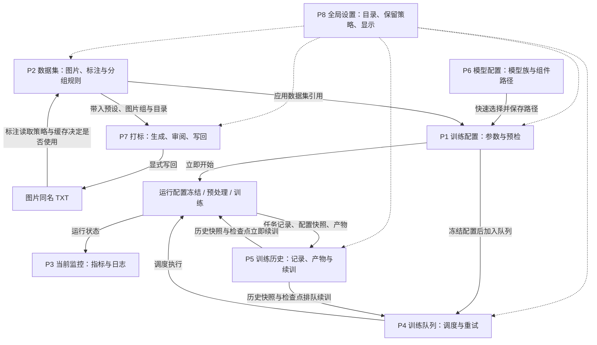

# Dragon UI 八个界面功能与关联图谱

状态：功能盘点，非改版方案
采集日期：2026-09-08
适用范围：本机 `http://127.0.0.1:20204/?ui=dragon` 运行界面及当日工作树源码
版本基线：`dev`，HEAD `2e96bd0ce3a7c2803d542e5b0b7dfeac77369d8b`，含未提交改动；不是该提交或线上版本的纯净快照。

## 1. 范围与阅读方式

本文回答三个问题：**每个界面能做什么、处理什么数据、与其他界面怎样关联。**
粒度为功能模块和关键动作，不逐条复述所有训练参数。

实际导航是 **7 个主业务入口 + 首页、全局设置两个快捷入口**，并非全站只有 8 个路由。
为对应“8 个界面”的需求，正文按 **7 个主业务页 + 全局设置** 编号；首页作为概览入口补充，
历史详情、打标子页和辅助工具归入所属模块，不再重复计数。

采集方式：

- 浏览器逐页读取上述 8 页，以及首页、一个历史任务详情、打标接入预设页。
- 对保存、启动、调度、续训、写回等有副作用动作，只检查源码，没有实际执行。
- 当前监控为空闲状态，训练队列为空；运行态指标和任务操作由源码补充核验。
- 没有修改训练配置、启动或停止任务、调用外部打标 API、下载模型、写回标注或删除产物。
- 不收录用户实际绝对路径、API 凭据、图片内容或具体任务名称。下文路径均为配置结构示例。

### 八页总览

以下 hash 接在同一服务地址 `/?ui=dragon` 后即可访问。

| 编号 | 导航名称 / 页面标题 | 路由 | 核心职责 | 主要输出 |
| --- | --- | --- | --- | --- |
| P1 | 训练配置 / 训练参数 | `#config/training-config` | 组织一次训练的模型、数据、方法、计划和资源 | 训练 TOML、预检结果、启动或排队请求 |
| P2 | 数据集 / 数据集蓝图 | `#dataset-editor` | 管理图片来源、标注读取、分组与训练数据规则 | 数据集 TOML、训练配置的数据集引用 |
| P3 | 当前监控 / 训练监控工作台 | `#page/live-training` | 观察当前任务的执行状态并处理运行异常 | 实时指标与日志视图、停止请求 |
| P4 | 训练队列 | `#page/queue` | 管理任务顺序、失败策略和重试 | 队列记录、调度状态、新执行任务 |
| P5 | 训练历史 / 历史任务 | `#history` | 检索、整理、回看任务，选择检查点续训 | 历史分组、产物访问、续训请求 |
| P6 | 模型配置 / 全局模型配置 | `#model-config` | 集中管理模型族与模型组件路径组合 | 全局模型配置库及默认项 |
| P7 | 打标 / 打标工作台 | `#page/captioning` | 为图片生成候选标注，经审阅后写回 | 打标任务、候选文本、图片同名 TXT |
| P8 | 全局设置 / 路径与界面 | `#global-settings` | 管理存储根、打标保留策略和界面显示 | 全局设置与有效路径 |

## 2. 整体关系

### 2.1 业务关系图

图中箭头表示数据或业务依赖，**不都代表页面会自动跳转**；具体动作见第 4 节。

不支持 Mermaid 的阅读器可按这一主线理解：

**全局设置和模型配置提供基础条件；数据集与打标准备输入；训练配置组织任务；
队列安排执行；当前监控观察过程；训练历史保存结果并形成续训闭环。**

### 2.2 四个层次

| 层次 | 界面 | 共同特点 |
| --- | --- | --- |
| 基础资源 | P6 模型配置、P8 全局设置 | 可被多个训练配置复用，不代表正在运行的任务 |
| 输入与实验设计 | P2 数据集、P7 打标、P1 训练配置 | 编辑未来任务的输入、标注和训练计划 |
| 执行控制 | P4 队列、P3 监控 | 前者关心“下一个执行什么”，后者关心“当前执行得怎样” |
| 结果与迭代 | P5 历史 | 以历史任务和快照为中心，而不是以当前表单为中心 |

## 3. 八个界面的功能清单

### P1. 训练配置

**定位：整个训练流程的编排入口。** 主体是参数工作区，配合运行工具栏和训练配置预设库。

| 功能模块 | 当前功能 |
| --- | --- |
| 当前运行上下文 | 选择训练配置、运行覆盖预设和 GPU 白名单；同一配置可搭配不同运行覆盖 |
| 预设库 | 新建、导入、导出、重命名、另存为、搜索、刷新；分组新建、重命名、删除、导出 ZIP 和拖动整理 |
| 输入准备 | 模型族及 DiT/Qwen3/VAE 路径；快速配置模型；数据集预设更换、预览、管理入口；Caption、遮罩、图片过滤和缓存策略 |
| 方法配置 | 网络模块、adapter 结构、权重热启动、秩与 Alpha、目标层、适用方法分支和网络额外参数 |
| 训练计划 | 输出名称、轮数/步数、batch、梯度累积、数据比例；学习率与优化器；时间步与损失；正则化；训练样张；权重与训练状态保存；日志和验证 |
| 资源与预检 | GPU 拓扑、精度、底模计算路径、attention、checkpoint、block swap、compile、预处理批大小、DataLoader 和诊断探针 |
| 参数定位 | 四阶段导航、全局参数搜索、显示层级、隐藏不可用项、查看全部候选；字段帮助、不可用原因、适用项/候选项计数 |
| 修改管理 | 未修改/已修改状态、查看修改、恢复默认、保存配置；只读配置不能直接覆盖 |
| 训练量反馈 | 随表单更新图片量、重复后样本、有效 batch、每轮/总步数估算，展开数据明细与公式 |
| 启动动作 | 训练前检查、开始训练、加入队列；模型与数据路径、能力兼容、预处理需求等由预检确认 |

**关键语义与关联：**

- P6 的“模型组合”通过快速选择器填入当前表单的 `model_family`、`pretrained_model_name_or_path`、`qwen3`、`vae`。这不是对模型库的持续动态绑定，仍需保存训练配置。
- 数据区显示 P2 的关联预设及同步状态；“管理数据集”进入 P2。参数数量随模型族、方法和显示条件变化，不把本次看到的字段数量当作全站固定数量。
- 样张提示词管理是本页工具，不是第九个主业务页。样张生成频率与提示词会影响后续训练产物，而非立即生成图片。
- **预检、开始和排队均先调用配置保存逻辑。** 因此“训练前检查”在存在草稿时并非绝对只读动作。
- “开始训练”经过确认后调用启动 API，成功转到 P3；“加入队列”请求携带 `start_paused: true`，成功后留在本页，适合继续准备其他任务，再到 P4 检查并继续调度。
- 模型族能被选择、参数出现在候选列表中，不等于所有方法、精度、compile 和推理组合都可运行；以当前能力校验和预检为准。

### P2. 数据集

**定位：管理可复用的数据蓝图，不直接运行训练。** 页面由当前上下文、通用规则、数据组编辑器和预设库组成。

| 功能模块 | 当前功能 |
| --- | --- |
| 上下文 | 显示当前训练配置、运行预设、数据集文件、关联与编辑状态 |
| 数据集预设库 | 搜索、刷新、新建、导入、导出、另存为、重命名、删除；分组管理和拖动排序 |
| 通用规则 | 分辨率、dataset batch、先验损失权重、验证集比例/数量/随机种子、分桶规则、标注扩展名、保留 token、标注来源与 JSON 优先级 |
| 数据集组 | 添加、移除、排序；指定原始图、缩放图、LoRA 缓存目录，检测图片数量；设置 repeats、普通/正则化用途、递归扫描与路径筛选 |
| 高级规则 | 分组分辨率与验证覆盖、caption 处理、标签混合、触发词复制、遮罩等子集规则 |
| 分阶段调度 | 配置不同训练阶段的数据使用计划；受数据用途和后端校验约束 |
| 图片预览 | 查看对应组的图片、caption 和路径，核对蓝图实际指向的数据 |
| 保存与应用 | 重新加载、保存数据集预设、另存为、应用到训练；只读项不能直接覆盖 |
| 打标入口 | “打开打标工作台”向 P7 带入所选数据集、图片组及目录上下文 |

**关键语义与关联：**

- “通用规则”是新建组的基线；修改基线不隐式覆盖已有组，必须显式“同步到所有组”。
- “保存数据集预设”写数据集 TOML；“应用到训练”则更新当前训练 TOML 的 `dataset_config` 引用。两者不是同一动作。应用时存在未保存修改会先保存。
- 多个训练配置可以引用同一数据集预设，因此修改蓝图可能影响这些配置的后续新任务；已冻结任务不应理解为继续读取该蓝图的最新版本。
- repeats、普通/正则化用途、batch 和阶段规则会进入训练估算与真实加载流程。正则化数据与分阶段调度的组合存在显式限制。
- 数据组内移除一行与删除图片文件不同；数据集预设删除与训练历史删除也不同。

### P3. 当前监控

**定位：观察当前运行任务，而不是修改训练参数或管理等待顺序。**

| 功能模块 | 当前功能 |
| --- | --- |
| 状态与上下文 | 当前任务、运行状态、步骤进度、训练轮次；空闲和异常状态有独立提示与后续入口 |
| 核心指标 | 实时 Loss、学习率、步数/总步数、进度、速度与 ETA |
| 趋势 | Loss 曲线、平滑度调节、采样点数量 |
| 硬件 | 显存及峰值、GPU 利用率及峰值、温度及高温提示 |
| 实时控制台 | 日志流、搜索、复制、下载、清空当前视图、自动滚屏；连接状态反馈 |
| 执行控制 | 停止当前训练的确认对话框；异常或连接失败时提供恢复观察入口 |
| 上下游摘要 | 查看队列、活动排队任务和最近历史入口；空闲时可返回训练配置创建任务 |

**关键语义与关联：**

- 状态、指标、日志与队列/历史摘要来自同一后端训练服务，实时推送配合快照读取；不是浏览器本地模拟训练。
- “停止训练”向训练进程发出停止请求，保留已有日志、样张和权重；不等于删除历史，也不能当作暂停整个队列。
- “清空视图”仅清理当前显示的日志，不删除服务端日志文件；关闭自动滚屏不暂停训练。
- P3 与 P5 是“当前运行状态”和“历史持久记录”两个视角，不能假定显示范围、采样窗口完全相同。
- 本次实际只看到空闲态；运行态功能按 `live-training-view.js` 与控制器核验，未启动任务验证数值刷新。

### P4. 训练队列

**定位：调度中心。** 接收 P1 的新训练与 P5 的续训，控制任务何时执行、失败后怎么办。

| 功能模块 | 当前功能 |
| --- | --- |
| 队列概览 | 调度状态，全部/等待/运行/异常/完成/取消统计与筛选，刷新 |
| 任务管理 | 查看任务状态、调整等待顺序、重试、取消运行或等待任务、移除已终结的队列记录 |
| 暂停/继续 | 暂停或恢复后续调度，不直接等同于停止当前训练进程 |
| 失败策略 | 失败后暂停等待处理，或继续后续任务 |
| 自动重试 | 是否对可恢复异常自动重试、最大尝试次数、重试间隔；尝试次数包含首次执行 |
| 批量操作 | 中止后续队列、强制中止队列、取消全部队列、取消全部等待、清理已完成、清理已取消 |

**操作影响必须区分：**

| 动作 | 当前运行任务 | 后续等待任务 / 记录 |
| --- | --- | --- |
| 暂停队列 | 继续当前执行 | 不再调度，等待项保留 |
| 取消全部等待 | 不受影响 | 等待项取消 |
| 中止后续队列 | 允许当前任务完成 | 队列暂停，后续等待项取消 |
| 取消全部队列 / 强制中止队列 | 停止或强制中止当前任务 | 等待项取消，队列暂停 |
| 清理已完成 / 已取消 | 不受影响 | 仅移除对应队列记录，不删运行目录、日志、权重或历史 |

**与 P1/P3/P5 的关联：**

- 入队时准备独立运行配置；修改原训练 TOML 不会追溯修改已经入队的冻结配置。
- “重试”克隆该项冻结的运行配置，不重新读取用户后来修改的源 TOML。
- 调度执行中的内容在 P3 观察；队列项通过 `history_task_ids` 关联执行阶段产生的历史记录，不宜把队列 ID 与历史任务 ID 当作同一个标识。
- 队列设置面板保存的是当前队列的运行覆盖策略，不是 P1 的训练算法参数，也不是 P8 的存储设置。

### P5. 训练历史

**定位：实验结果档案和续训入口。** 分为列表工作台和单任务详情。

| 功能模块 | 当前 Dragon 原生功能 |
| --- | --- |
| 统计与检索 | 全部、训练、预处理、异常/中断、归档、来自队列统计；全局搜索、类型/状态筛选与排序 |
| 高级筛选 | 模型族、训练变体、归档状态、任务来源、预处理精度、块交换精度、底模计算路径与精度倾向 |
| 历史分组 | 全部/未分类/自定义分组；新建、重命名、删除分组；选择任务设置或清除分组、拖动任务或配置组归类、分组排序 |
| 列表组织 | 同一来源配置的任务集展开/收起；任务详情返回时恢复列表上下文 |
| 概览 | 状态、最终 Loss、最后步数、学习率、运行时间与目录、相关预处理任务链接、检查点恢复入口 |
| 指标 | 历史训练指标曲线及系统指标；按实际记录展示 |
| 产物 | 样张预览及参数查看、权重列表、下载或复制路径 |
| 配置 | 查看该次运行的配置文件及快照，不等同于修改当前训练配置 |
| 日志 | 按需加载完整历史日志，配套查看、检索和下载 |
| 续训 | 选择可用 checkpoint，立即续训或加入队列；历史训练快照和训练状态必须可用 |

**续训闭环：**

1. 从 `#history/<task-id>` 进入任务。
2. 后端返回可恢复 checkpoint 与不可用原因；不存在有效训练状态或目标步数已达成时，不能把恢复按钮当作必然可用。
3. 立即续训调用 `/api/training/resume`，成功进入 P3；排队续训调用 `/api/training/queue/resume`，成功进入 P4。
4. 使用历史配置快照和所选训练状态创建**新的任务记录**，保留来源任务关联，不覆盖原记录。
5. 完整续训恢复优化器、调度器和已完成步数；P1 的 `network_weights` 热启动主要加载权重，两者不是同一种恢复方式。

**当前界面的边界：**

- “归档”在 Dragon 列表中可被检索、筛选，但本次源码未发现原生批量归档、取消归档、彻底删除任务按钮。
- “删除历史分组”使任务回到未分类，不删除历史记录和训练产物。
- “合并查看”实际切换到 classic 的训练界面；classic 再提供按选定任务聚合日志/Loss 的工具。它不是在 Dragon 内合并模型、合并配置或导入快照。
- 批量归档、取消归档、彻底删除属于 classic 的历史管理能力，不把共享后端已支持的动作自动算成 Dragon 原生功能。
- 训练与预处理均有历史记录；只有符合条件的训练任务可续训。历史条数不等于独立实验次数。

### P6. 模型配置

**定位：共享模型路径组合库，而非模型训练页或模型文件管理器。**

| 功能模块 | 当前功能 |
| --- | --- |
| 模型组合 | 为每项设置名称、模型格式、基础 DiT、Qwen3 文本编码器与 VAE 路径 |
| 模型格式 | 当前页面可选 Anima、Krea-2、Z-Image |
| 库管理 | 新建、删除非默认配置、搜索、选择；新建/重命名/删除分组；项目与分组排序、跨组整理 |
| 默认项 | 设为默认，默认模型族和组件路径同步到全局默认来源；默认项受删除保护 |
| 保存保护 | 未保存状态、还原修改、保存模型配置；revision 冲突检查避免覆盖另一个页面的新修改 |

**关键语义与关联：**

- 模型配置库和 P8 是两个功能页面；模型组件路径在这里维护，输出根和显示在 P8 维护。
- P1 快速选择器读取本库，把模型族和三条路径填入训练表单；既有训练 TOML 的显式路径不会因为默认项变化就被全部重写。
- 默认项还服务新建配置和旧兼容链路的路径回退，推理工具也复用模型设置。
- 删除配置或分组不是删除磁盘模型；本页不自动下载、移动或加载大模型。
- 模型格式存在于列表中不意味着该族支持所有训练方法或辅助生图能力。

### P7. 打标

**定位：训练输入标注的生成和审阅工作台。** 它有自己的任务系统，不属于训练队列。

| 功能模块 | 当前功能 |
| --- | --- |
| 图片来源 | 选择数据集预设、图片组、原始图/训练图目录；展开后扫描图片、选择待处理图片；返回数据集 |
| 打标配置 | 选择接入预设、提示词预设，编辑系统提示词和用户提示词；本地 ONNX 模式提示词不参与模型执行 |
| 任务运行 | 开始打标、观察任务进度、刷新、取消任务、查看最终结果和日志 |
| 结果审阅 | 按数据集和任务查看候选；Tag/原文模式、编辑标签及顺序、图片详情、保存候选修改 |
| 显式写回 | 写回选中项或全部候选，目标为图片同名 `.txt`；重新打标不自动覆盖 TXT |
| 提示词预设子页 | 管理可复用的打标提示词方案 |
| 接入预设子页 | 管理外部 OpenAI-compatible API 与本地 WD14/CLTagger ONNX 接入，测试接入、保存、设为当前 |
| 本地模型资源 | 资产安装状态、显式下载/取消下载、执行设备、指定 GPU、batch、阈值与 blacklist 等适用参数 |
| 标签翻译 | 基于本地中英标签词典切换标签显示；词典首次获取是额外的显式下载，不是默认外部翻译服务 |

子路由：`#page/captioning-prompts`、`#page/captioning-providers`、
`#page/captioning-results`、`#page/captioning-logs`。`tagging` 是保留别名，主入口使用 `captioning`。

**关键语义与关联：**

- P2 的入口带入一次性数据集上下文；也可从当前训练上下文读取关联数据集。它是显式上下文传递，不是持续的跨页文件监听。
- 外部接入会把图片及提示词发送到配置的服务端点；本地 ONNX 接入在本机子进程执行。二者的费用、隐私、硬件和依赖边界不同。
- “保存修改”只更新打标任务里的候选文本；“写回”才修改图片同名 TXT。已有结构化 caption 不被此流程擅自改写，受目标路径与冲突检查保护。
- 写回后的 TXT 只有在训练的 caption 读取策略选用它、相应文本缓存更新后，才会真正影响新训练。不能承诺写回会立即改变正在训练或已经排队的任务。
- 打标模型/接入预设不是 P6 的 DiT/Qwen3/VAE 组合库；不能用训练模型默认项代替打标 provider。
- 任务和候选审阅状态在当前 WebUI 进程内保留，重启不恢复；已写回 TXT 是磁盘文件。保留数量受 P8 的 `tagging_max_retained_jobs` 控制。
- 切换页面不取消后台打标；本地模型资源在任务完成、失败或取消后的 worker 退出阶段释放，不是离开页面时释放。

### P8. 全局设置

**定位：跨页面的存储与显示配置。** 当前是单页四组表单，不是四个独立设置子页。

| 设置组 | 关键功能与字段 | 主要关联 |
| --- | --- | --- |
| 存储路径 | `output_root`、`configs_root`、`history_root`、`queue_root`；显示实际解析目录；`tagging_max_retained_jobs` | 训练输出、配置和数据集库、历史、队列、打标任务保留 |
| 生图测试 | `image_test_save_root`、`image_test_allow_home_search` | 生图输出位置和权重扫描边界 |
| 界面显示 | Dragon 动效、参数帮助/标签常显、全局缩放和分页面缩放 | 训练配置、数据集、监控、模型配置及辅助页 |
| 历史页面缩放 | 历史概览、分析、预览、日志、配置文件区域的独立缩放 | P5 的不同详情区域 |

通用动作包括恢复默认、还原修改和保存全局设置；存在未保存草稿时有离开保护。

**关键语义与关联：**

- 显示设置保存后应用；路径设置影响之后读写哪套配置和运行数据，不能理解为批量迁移既有文件。
- `history_root`、`queue_root` 留空时跟随配置根；更换配置根可能让用户看到不同的模型库、数据集、历史或队列。
- 全局缩放有效范围为 25%–400%；分页面可跟随全局或单独设置。缩放不改变训练参数。
- 打标保留策略清理最旧的已结束任务，不删除图片、已写回 TXT 或模型，也不把活跃任务当成普通过期记录清理。
- 模型路径到 P6 修改，GPU 训练选择到 P1 修改，失败重试策略到 P4 修改，打标接入凭据到 P7 修改。

## 4. 页面之间到底共享什么

### 4.1 关联动作表

| 来源 → 目标 | 触发点 | 传递或修改的对象 | 是否自动执行目标业务 |
| --- | --- | --- | --- |
| P6 → P1 | 快速配置模型 | 模型族与三条组件路径进入草稿，再保存训练 TOML | 不启动训练，不保持动态绑定 |
| P2 → P1 | 应用到训练 / 数据集选择 | 训练 TOML 的 `dataset_config` 引用 | 不启动训练 |
| P1 → P2 | 管理数据集 | 当前训练上下文及关联数据集 | 仅打开编辑器 |
| P2 → P7 | 打开打标工作台 | 数据集预设、组号、图片目录上下文 | 不自动调用打标模型 |
| P7 → 数据文件 → P1 | 审阅后写回，再按新标注准备训练 | 图片同名 TXT、随后更新的文本缓存 | 不自动改训练参数或当前任务 |
| P1 → P3 | 开始训练并确认 | 已保存配置及运行选择，后端准备运行环境 | 是，真正创建并执行任务 |
| P1 → P4 | 加入队列并确认 | 独立冻结的运行配置、GPU 等上下文 | 入队不等于立即执行；当前入口要求暂停调度 |
| P4 → P3 | 队列调度 | 当前队列项的运行配置 | 是，监控展示实际运行状态 |
| P3/P4 → P5 | 查看最近任务 / 关联历史 | 历史任务 ID | 只读打开历史；记录由后端执行过程产生 |
| P5 → P3/P4 | 立即续训 / 加入队列 | 历史配置快照、checkpoint、来源任务 ID | 新建恢复任务或恢复队列项 |
| P8 → 多页 | 保存全局设置 | 根路径、显示参数、打标保留数量 | 不迁移旧产物，不重写已有任务快照 |

### 4.2 五类数据不能混淆

| 数据层 | 代表对象 | 生命周期与影响范围 |
| --- | --- | --- |
| 页面草稿 | 未保存的参数、数据组、模型配置、候选 caption | 页面内可见不等于落盘；不同页面各自维护保存状态 |
| 浏览器上下文 | 当前训练配置/运行预设/GPU；打标返回上下文；历史筛选 | 帮助跨页恢复选择，不是运行配置真相源，不会持续同步所有文件变化 |
| 可复用配置 | 训练 TOML、数据集 TOML、模型配置库、全局设置、样张提示词 | 为以后新建任务提供输入；多任务可以共享来源 |
| 执行快照 | `config.original.toml`、`config.runtime.toml`、`dataset.runtime.toml`、历史配置快照 | 记录本次运行如何准备；排队重试和历史续训各有冻结配置来源 |
| 真实数据与产物 | 原图、TXT、缓存、checkpoint、权重、样张、日志 | 有独立磁盘生命周期；删除 UI 分组/清理队列记录不自动等于删除这些文件 |

**快照边界：**冻结配置不等于对所有外部资源做不可变备份。原图、模型权重、
外部 caption 路径和共享缓存仍有自己的引用/复用策略；不要在任务等待或运行时任意替换这些文件，
也不要把“配置被冻结”理解成外部文件变化完全无影响。

**四种“分组”也互不等同：**训练配置预设库分组整理配置文件；数据集预设库分组整理蓝图文件；
蓝图内部的数据集组定义实际训练输入；历史分组整理任务记录。模型库另有自己的分组，
不存在跨这几种分组自动同步名称和成员的统一项目实体。

## 5. 典型使用流程

### 5.1 从数据准备到一次新训练

1. P8 确认配置、输出、历史、队列根目录。
2. P6 准备适合模型族的组件路径组合。
3. P2 组织原图目录、分组、repeats、caption 来源与缓存路径，保存蓝图。
4. 需要生成标注时，从 P2 进入 P7，选择图片和接入，生成候选、审阅、显式写回；随后确认训练使用的标注来源和文本缓存已更新。
5. P2 将数据集应用到目标训练配置；P1 选模型组合、训练方法、训练计划和设备，检查样张提示词。
6. P1 保存并预检，查看错误/警告与预处理需求，确认后开始训练。
7. P3 观察预处理/训练状态、Loss、资源和日志；P5 回看任务记录、样张、权重与配置快照。

### 5.2 连续安排多个实验

1. P1 另存不同训练配置，分别确认模型、数据、参数、GPU 和运行覆盖。
2. 每个实验预检后加入队列；继续留在 P1 准备下一个。
3. P4 核对冻结任务、顺序和失败策略，再继续调度。
4. P3 观察当前任务，P4 管理后续任务；P5 按来源配置或自定义历史分组整理结果。
5. 若参数需要修正，创建新任务，不假定修改源 TOML 会改写已有队列项。

### 5.3 中断后恢复

1. P5 找到原训练任务，查看日志并检查是否有有效训练状态。
2. 要恢复优化器和步数，选择 checkpoint 立即续训或排队续训。
3. 只想复用模型权重且重新设定计划，则到 P1 使用权重热启动，明确这是新训练。
4. 原任务保留，新任务通过来源关系追踪；不把续训当作覆盖原历史。

## 6. 首页和辅助工具

### 首页：训练中心

入口 `#dashboard`，属于概览页，不纳入正文 8 页计数。本次浏览器已查看。

- 汇总当前状态、Loss/速度/进度、显存/负载、当前运行配置与目录。
- 提供查看实时训练、调整训练配置、停止训练和最近历史入口。
- 与 P3/P5 共享后端状态和历史，不维护第二套训练任务。
- 首页的“当前配置”属于运行概览，不能据此认定 P1 的编辑上下文是否已选择配置。

### 额外路由

以下为当前源码注册的原生辅助工具，**本次只做源码核验，没有执行生成、上传、删除或分析任务**。
是否出现在当前导航布局中，与是否存在可访问路由是两个问题。

| 工具 | 路由 | 功能与关联 |
| --- | --- | --- |
| 预览工作区 | `#preview-workspace` | 按训练/推理/自定义来源、最新/任务/组范围浏览图片与权重；预览路径设置、复制权重路径、热启动入口、选图删除。删除图片是真实文件操作 |
| 生图测试 | `#image-test` | 配置提示词、尺寸、采样器、模型与 LoRA、设备和精度，查看推理日志及结果；共享模型设置和生图输出根。模型族支持范围由能力校验限制 |
| 权重分析 | `#weight-analysis` | 选择或上传权重进行检查、A/B 对比，查看静态权重分析并导出 JSON/PDF；不能重建静态增量的结构会标记不支持 |
| 环境检测 | `#environment` | 查看平台、Python、CUDA、路径及分组诊断，刷新和复制报告；为配置和运行故障排查提供基础信息 |
| 界面设置菜单 | 导航品牌按钮 | 主题、显示与 classic 兼容界面入口；不是训练模型族切换 |

## 7. 容易误解的边界

| 常见误解 | 当前正确理解 |
| --- | --- |
| 保存数据集就是给当前训练用了 | 保存蓝图与更新训练引用是两个动作 |
| 修改默认模型会替换所有训练底模 | 快速选择填入表单；默认回退不批量重写显式路径 |
| 训练前检查完全不写东西 | 有草稿时先执行保存，再预检 |
| 加入队列就立即训练 | 当前 P1 入队使用暂停标记，还要核对 P4 调度状态 |
| 暂停队列会暂停当前模型计算 | 主要暂停后续调度；停止当前训练是另一动作 |
| 重试会采用修改后的源配置 | 队列重试克隆冻结运行配置 |
| 历史分组删除会删权重 | 仅解除分组，任务回到未分类 |
| 清理队列记录等于彻底删除历史 | 历史、运行目录、日志和权重仍保留 |
| 合并查看会合并 LoRA 或配置 | 切到 classic 后聚合查看日志/Loss，不做模型融合 |
| 保存打标候选就已写入 TXT | 必须显式写回；重启前未写回候选存在丢失风险 |
| 写回 TXT 后现有任务自动采用 | 还受 caption 读取来源、任务快照和缓存策略影响 |
| 切换数据根目录会迁移所有旧数据 | 更改读写范围不等于迁移文件 |
| Dragon 和 classic 各有一套任务 | 两套前端共享后端数据，原生页面能力和入口不完全相同 |

## 8. 实现证据与维护入口

下表给出主要实现文件和符号，行号是采集日定位辅助，源码变化后可能漂移。

| 事实 | 源码入口 / 定位 |
| --- | --- |
| 七个主导航、两个快捷入口 | [nav.js](../../web/static/js/dragon-ui/nav.js)，`PRIMARY_NAV_ITEMS` / `NAV_SHORTCUTS` |
| 业务页与辅助页路由 | [page-loaders.js](../../web/static/js/dragon-ui/page-loaders.js)，`createDragonPageLoaders()` |
| 配置保存、模型值进入草稿 | [config-page.js](../../web/static/js/dragon-ui/pages/config-page.js)，约 1231、1294 行 |
| 保存后预检、入队暂停、启动跳转 | [training-controls.js](../../web/static/js/dragon-ui/pages/training-controls.js)，`runTrainingAction()`，约 236 行 |
| 数据蓝图保存和应用 | [dataset-editor.js](../../web/static/js/dragon-ui/pages/dataset-editor.js)，约 710 行；`/dataset-presets/apply` |
| 模型库的 revision 保存 | [model-config.js](../../web/static/js/dragon-ui/pages/model-config.js)，约 440 行 |
| 实时指标、日志工具与停止提示 | [live-training-view.js](../../web/static/js/dragon-ui/pages/live-training-view.js)，`renderLiveTrainingPage()` / `renderConsole()` |
| 队列操作的文件保留语义 | [queue.js](../../web/static/js/dragon-ui/pages/queue.js)，约 184、226、275 行；[queue_control.py](../../web/services/training/queue_control.py) |
| 入队冻结与运行蓝图 | [queue_enqueue.py](../../web/services/training/queue_enqueue.py)，`enqueue_training()`；[runtime_prepare.py](../../web/services/training/runtime_prepare.py)，约 196 行 |
| 历史合并查看切 classic | [history.js](../../web/static/js/dragon-ui/pages/history.js)，`data-history-classic` 处理器，约 84 行 |
| 删除历史分组不删任务 | [history-collections-controller.js](../../web/static/js/dragon-ui/pages/history-collections-controller.js)，`deleteCollection()`，约 244 行 |
| 历史续训使用快照和检查点 | [history-detail.js](../../web/static/js/dragon-ui/pages/history-detail.js)，约 230 行；[history_resume.py](../../web/services/training/history_resume.py) |
| 打标子流程与候选写回 | [tagging.js](../../web/static/js/dragon-ui/pages/tagging.js)、[tagging-results-page.js](../../web/static/js/dragon-ui/pages/tagging-results-page.js)；[storage.py](../../web/services/tagging/storage.py)，`image.with_suffix(".txt")` |
| 全局设置四组字段 | [global-settings.js](../../web/static/js/dragon-ui/pages/global-settings.js)，`SETTING_GROUPS` |

相关说明：

- [Dragon 界面与兼容回退](dragon-ui.md)
- [配置工作台](config-workbench.md)、[数据集编辑器](dataset-editor.md)
- [打标工作台](tagging-workbench.md)、[缓存复用](preprocess-cache-reuse.md)
- [训练队列](training-queue.md)、[历史任务与集合](history-collections.md)
- [全局模型配置](global-model-configs.md)、[全局设置](global-settings.md)、[多模型支持现状](../multi_model_support.md)

这些专题文档可能同时描述 classic 和 Dragon。本文对当前导航、历史原生操作和模型格式的判断以当日页面/源码为准，
不把旧文档中出现的功能入口无条件套用到当前 Dragon。

相关测试入口（便于后续改版回归，不代表本次全部执行）：

- `tests/test_dragon_next_training_config_acceptance.py`、`tests/test_dragon_training_data_frontend.py`
- `tests/test_dragon_dataset_editor_frontend.py`、`tests/test_web_config_datasets.py`
- `tests/test_dragon_monitor_system_frontend.py`、`tests/test_training_queue.py`
- `tests/test_dragon_history_detail_tabs_frontend.py`、`tests/test_dragon_history_state_runtime.py`
- `tests/test_global_model_config_frontend.py`、`tests/test_dragon_tagging_frontend.py`
- `tests/test_documentation_integrity.py`

### 本次文档验证

- 本次三个文档路径的 `git diff --check` 通过。
- `tests/test_documentation_integrity.py`：7 项通过，1 项失败。失败项为已有
  `docs/findings/anima_dual_gpu_parallel_probe_20260904.md` 缺少生命周期状态标签，未在本次任务中修改该无关文件。
- 本次未执行训练、续训、推理、打标或删除类端到端测试；对应功能按页面入口和源码契约记录。
