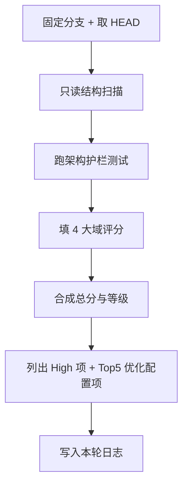

# WebUI 前端健康度评分卡

状态：稳定（维护用）  
适用版本：当前 `main` / 功能分支前端  
入口命令：

```bash
timeout 60 .venv/bin/python -m pytest \
  tests/test_training_frontend_modules.py \
  tests/test_training_frontend_dom.py \
  tests/test_training_frontend_state.py \
  -q
```

相关代码：

- `web/static/app.js`
- `web/static/js/features/**`
- `web/static/css/**`
- `tests/test_training_frontend_*.py`
- `docs/superpowers/specs/2026-07-11-five-round-auto-iteration-protocol.md`

---

## 1. 这是干什么的

一句话：给当前分支前端做“快速体检”，用固定打分表回答三件事——健康不健康、哪里最差、下一轮先改什么。

本评分卡用于：

- 日常 PR / 分支快速审核
- 五轮自动迭代每轮复评
- 判断“工程债”和“配置体验债”谁更该先还

本评分卡不用于：

- 替代真实用户验收
- 替代完整回归测试
- 给后端训练语义打分

---

## 1.1 五轮迭代冻结基线（2026-07-11）

| 项 | 值 |
|---|---|
| 分支 | `feat/frontend-five-round-iteration` |
| HEAD | 见迭代日志最新 Freeze 段 |
| 估计健康分 | **73 / C**（2026-07-11 `feat/frontend-ir1-ir5-rerun` 复跑实测；未达原 78 目标，见 fullstack log 复跑段） |
| 结构 | features 19 / chunks 45 / bridges 37 / dom_ids 449 / docs/features 9 |
| 已完成轮次 | IR1→IR5（C3/C4/T1/E1/E2/C1/C6/C5/E3/U1/E4/U2） |
| 残留 High | 无阻塞级；preflight matrix ImportError 为既有测试债；多 bridge silent legacyRoot 未全清；C5 status 仍可能覆盖其他消息 |

---

## 2. 快速审核流程（15–30 分钟）



### 2.1 必做命令

```bash
# 0) 分支与脏工作区
git status --short --branch
git rev-parse --short HEAD

# 1) 规模快照
python3 - <<'PY2'
from pathlib import Path
root = Path('web/static/js/features')
print('features', len([p for p in root.iterdir() if p.is_dir()]))
chunks = list(Path('web/static/js/features/anima-app/chunks').glob('*.js'))
bridges = list(Path('web/static/js/features/anima-app/helpers').glob('*-bridge.js'))
print('chunks', len(chunks), 'lines', sum(p.read_text(errors='ignore').count('\n')+1 for p in chunks))
print('bridges', len(bridges), 'lines', sum(p.read_text(errors='ignore').count('\n')+1 for p in bridges))
print('dom_ids', Path('web/static/index.html').read_text().count(' id="'))
PY2

# 2) 架构护栏（快速红灯）
timeout 60 .venv/bin/python -m pytest \
  tests/test_training_frontend_modules.py::test_frontend_module_graph_follows_production_entrypoint \
  tests/test_training_frontend_modules.py::test_frontend_module_cache_tokens_match_entrypoint \
  tests/test_training_frontend_modules.py::test_frontend_css_import_cache_tokens_match_entrypoint \
  tests/test_training_frontend_modules.py::test_anima_app_global_this_writes_do_not_grow \
  tests/test_training_frontend_modules.py::test_split_frontend_features_do_not_write_global_this \
  tests/test_training_frontend_dom.py \
  -q
```

### 2.2 必看文件

| 优先级 | 路径 | 看什么 |
|---|---|---|
| P0 | `web/static/app.js` | 是否仍只做 bootstrap |
| P0 | `web/static/js/features/anima-app/index.js` | chunk 串行加载 / bridge 装配顺序 |
| P0 | `web/static/js/features/anima-app/chunks/` | 是否继续堆新业务 |
| P0 | `web/static/js/features/anima-app/helpers/*-bridge.js` | `legacyRoot = globalThis` 是否还在 |
| P0 | `web/static/js/config/catalog/*` | 默认值、guide、命名是否可信 |
| P1 | `web/static/style.css` | import 顺序是否把 `90-responsive` 放对 |
| P1 | `web/static/index.html` | DOM id 契约有无大改 |
| P1 | `tests/frontend_test_support.py` | baseline / token 护栏是否漂移 |

---

## 3. 规范评分结构（100 分）

一句话：先按 4 个域打分，再加权合成总分；每个域都要写证据，不接受空口分数。

### 3.1 加权合成

| 域 | 权重 | 审计焦点 |
|---|---:|---|
| A. 结构与迁移 | 30% | feature 边界、chunks、bridge、依赖方向 |
| B. 测试与门禁 | 25% | 模块图、token、DOM 契约、行为仿真 |
| C. CSS / DOM / 交互壳 | 20% | tokens、import 顺序、响应式、DOM id |
| D. 配置体验表面 | 25% | 默认值来源、命名、兼容提示、快捷按钮 |

```text
总分 = round(A*0.30 + B*0.25 + C*0.20 + D*0.25)
```

等级：

| 等级 | 分数 | 含义 |
|---|---:|---|
| A | 90-100 | 可长期演进，过渡层受控 |
| B | 80-89 | 主路径稳，债可控 |
| C | 70-79 | 能用，但每轮必须还债 |
| D | 60-69 | 能跑，迁移/配置可信度不足 |
| F | <60 | 架构或契约风险过高，优先止血 |

### 3.2 A. 结构与迁移（100）

| 分项 | 满分 | 打分线索 |
|---|---:|---|
| 入口与模块边界 | 20 | `app.js` 是否薄；feature 目录是否真实承载业务 |
| chunks 退役度 | 25 | 重业务 chunk 数量、是否继续新增业务 |
| bridge / globalThis | 25 | `legacyRoot` 密度、未 configure 是否静默 no-op |
| 依赖方向 | 15 | feature 是否反向 import chunks |
| 体量预算 | 15 | 单文件 >20-30KB 热点、命名是否失真 |

### 3.3 B. 测试与门禁（100）

| 分项 | 满分 | 打分线索 |
|---|---:|---|
| 覆盖广度 | 25 | modules/dom/config/history/queue/live 是否均衡 |
| 护栏强度 | 25 | 模块图、cache token、globalThis baseline |
| 行为仿真 | 25 | Node fixture / 状态机断言是否存在 |
| 可回归性 | 15 | 60s 内可给信号、失败可定位 |
| 门禁完备度 | 10 | 是否有固定五轮硬门禁命令 |

### 3.4 C. CSS / DOM / 交互壳（100）

| 分项 | 满分 | 打分线索 |
|---|---:|---|
| 样式系统 | 25 | tokens、forge 重复度、断头 CSS |
| import / 层叠真相 | 20 | `style.css` 顺序、响应式是否兜底后挂页 |
| DOM 契约 | 30 | id 数量、contract 覆盖、改 id 风险 |
| 响应式 / a11y | 15 | 断点一致、label/for、叠层 z-index |
| 文档对齐 | 10 | `docs/features` 是否描述真实 UI |

### 3.5 D. 配置体验表面（100）

| 分项 | 满分 | 打分线索 |
|---|---:|---|
| 字段可理解性 | 25 | help/guide 是否准确、有无 ghost 变体 |
| 默认值可信度 | 30 | `FORM_UI_DEFAULTS` 是否伪装成 merge 值 |
| 兼容提示 | 20 | 表单 live 互斥 vs 仅 preflight |
| 命名分层 | 15 | preset / variant / 快捷按钮是否混称 |
| 与后端一致性 | 10 | provenance / compat matrix 是否被前端消费 |

---

## 4. 评分卡模板（直接复制）

````markdown
### 前端健康评分 — <branch> @ <shortsha> — <YYYY-MM-DD>

| 域 | 原始分 | 权重 | 加权 |
|---|---:|---:|---:|
| A 结构与迁移 |  | 0.30 |  |
| B 测试与门禁 |  | 0.25 |  |
| C CSS/DOM |  | 0.20 |  |
| D 配置体验 |  | 0.25 |  |
| **总分** |  |  | **/** |

等级：A/B/C/D/F

#### 证据
- A:
- B:
- C:
- D:

#### High（必须处理）
1.
2.

#### Medium
1.

#### Top5 下一优化配置项
| ID | 项 | 轨 | 风险 | 验收 |
|---|---|---|---|---|
|  |  | 工程/配置 |  |  |

#### 测试门禁
```bash
# 粘贴本轮实际命令与结果摘要
```

#### 下轮焦点
-
````

---

## 5. 2026-07-11 当前分支基线（docs/backend-config-optimization）

一句话：前端能用，但过渡层和配置可信度把总分压在 D 档。

| 域 | 原始分 | 加权贡献 | 关键判断 |
|---|---:|---:|---|
| A 结构与迁移 | 51 | 15.3 | chunks 仍是业务主仓；37 bridge + legacyRoot |
| B 测试与门禁 | 72 | 18.0 | 架构护栏强，行为仿真弱 |
| C CSS/DOM | 56 | 11.2 | 449 DOM id；`90-responsive` 顺序异常；shared-fields 断头 |
| D 配置体验 | 65 | 16.3 | help 多，但来源/命名/门禁不够硬 |
| **总分** |  | **61** | **D** |

### 5.1 规模快照

| 指标 | 数值 |
|---|---:|
| feature 目录 | 19 |
| anima-app 文件/行 | 111 / ~17833 |
| chunks | 45 / ~14401 行 |
| bridges | 37 / ~1915 行 |
| DOM id | 449（无重复） |
| frontend 测试 | 8 文件 / ~7.0k 行 / ~104 用例 |
| catalog defaults 键 | ~122 |

### 5.2 本基线 High 清单

1. chunks 继续承接新业务，过渡层永久化风险高
2. bridge 默认 `legacyRoot=globalThis`，未 configure 可静默 no-op
3. `FORM_UI_DEFAULTS` 与 merge chain 混层，默认值可信度不足
4. guide/variant 与 `configs/gui-methods/` 存在 ghost 项
5. CSS import 顺序 + `13-shared-fields.css` 断头
6. 测试偏静态字符串，行为级 debug 证据链不足

### 5.3 目标线

| 里程碑 | 目标总分 | 条件 |
|---|---:|---|
| 五轮文档冻结后可开工 | >=61 | 评分结构与任务队列冻结 |
| 实现轮 R1-R2 后 | >=70 | 护栏修复 + 配置命名/guide 同步 + CSS 止血 |
| 实现轮 R3-R5 后 | >=78 | provenance UI 起步 + bridge 收敛 + 行为门禁补强 |

---

## 6. 与五轮自动迭代的关系

- 每轮开始：用本评分卡复评
- 每轮结束：更新 `docs/superpowers/plans/2026-07-11-fullstack-auto-iteration-log.md`
- 详细执行任务：`docs/superpowers/plans/2026-07-11-frontend-config-optimization.md`
- 协议正文：`docs/superpowers/specs/2026-07-11-five-round-auto-iteration-protocol.md`

---

## 7. 维护规则

- 改前端架构 / 配置体验 / 测试护栏后，至少更新本页“当前基线”或迭代日志
- 分数必须附证据；没有测试命令结果，不得上调测试域分数
- 用户数据目录、训练输出、历史/队列文件不在本评分范围内，也不得为了提分去碰
