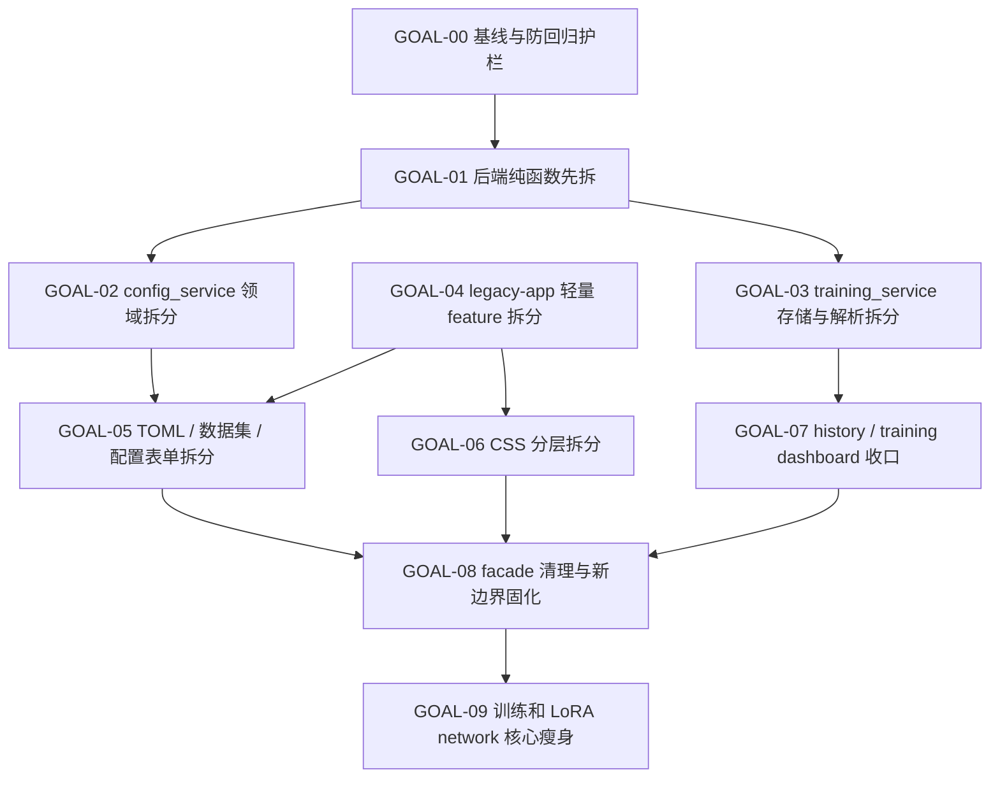

# 上帝文件拆解多段 GOAL 任务版

日期：2026-06-07
来源：`docs/findings/god_files_audit_20260607.md`
用途：把上帝文件治理拆成可分批执行、可验收、可回滚的维护任务。

## 总原则

- 每个 GOAL 都应能单独开一个任务执行。
- 优先做搬家型重构，保持用户可见行为不变。
- 保留旧 facade，先不强迫所有调用方一次性迁移。
- 前端新增业务不得继续塞进 `legacy-app.js`。
- 后端新增业务不得继续塞进 `training_service.py` / `config_service.py`。
- 每段任务都必须跑对应定向测试；如果未跑，最终说明原因。
- 不碰用户训练历史、队列、输出、模型、数据集内容。

## 总体依赖图



## GOAL-00：建立基线与防回归护栏

目标：在正式拆分前固定当前行为边界，让后续拆分有明确验收标准。

本轮执行记录：

- 基线行数：`legacy-app.js` 17882 行，`style.css` 15528 行，`training_service.py` 5635 行，`config_service.py` 4242 行。
- 现有测试依赖：`tests/test_training_frontend_state.py` 直接检查 `legacy-app.js` 的模块可达性、import token、DOM/样式静态钩子；`tests/test_training_gpu_selection.py`、`tests/test_training_queue.py`、`tests/test_training_resume.py` 仍从 `training_service.py` 导入兼容函数和 `TrainingService`；`tests/test_web_config_service.py`、`tests/test_gui_variants.py` 仍从 `config_service.py` 导入兼容 API。
- 新增护栏：`legacy-app.js` 只能作为过渡胶水，新增前端 feature 应从 `web/static/js/features/<feature>/index.js` 接入并保持从生产入口 `app.js` 可达；`app.js` 继续保持 bootstrap，不承载 `fetch`、DOM 查询或事件绑定业务。
- 后续拆分原则：旧 facade 暂时保留，测试优先覆盖新模块，同时验证旧路径仍可导入。

范围：

- 复查 `docs/findings/god_files_audit_20260607.md`。
- 列出当前四个重点文件的行数和职责边界。
- 确认现有测试中哪些依赖 `legacy-app.js`、`config_service.py`、`training_service.py` 的文本或导入路径。
- 增加或调整少量静态测试，防止新业务继续写回旧上帝文件。

建议改动：

- 在 `tests/test_training_frontend_state.py` 中加入软约束：新增 feature 应从 `web/static/js/features/` 独立模块接入。
- 在 WebUI 维护文档中补一句：`legacy-app.js` 只能作为过渡胶水。
- 如已有规则足够，不强行新增测试。

禁止事项：

- 不搬业务函数。
- 不重命名现有 API。
- 不调整 UI。

交付物：

- 一份简短基线说明或测试补丁。
- 明确后续 GOAL 的测试矩阵。

验收：

```bash
timeout 60 python -m pytest tests/test_training_frontend_state.py
timeout 60 python -m pytest tests/test_web_config_service.py tests/test_training_queue.py
```

## GOAL-01：后端低风险纯函数拆分

目标：先拆最不依赖运行态的后端工具函数，降低 `training_service.py` / `config_service.py` 的体积和测试耦合。

范围：

- 从 `training_service.py` 拆 GPU 相关纯函数。
- 从 `training_service.py` 拆 progress / metric 文本解析纯函数。
- 从 `config_service.py` 拆路径 normalize / safe resolve 等纯工具。
- 保留旧模块 re-export，保证现有调用不变。

建议新文件：

- `web/services/training/gpu.py`
- `web/services/training/progress_parser.py`
- `web/services/config/paths.py`

禁止事项：

- 不改 `TrainingService.start()` / `_launch_job()` 运行流程。
- 不改 queue/history/runtime 目录结构。
- 不改 HTTP 路由。

交付物：

- 新模块承接纯函数。
- 原模块保留兼容导入。
- 定向测试改为优先覆盖新模块，旧路径仍能导入。

验收：

```bash
timeout 60 python -m pytest tests/test_training_gpu_selection.py
timeout 60 python -m pytest tests/test_training_queue.py
timeout 60 python -m pytest tests/test_web_config_service.py
```

## GOAL-02：`config_service.py` 第一阶段领域拆分

目标：把配置服务中最独立的领域拆出去，让 `config_service.py` 从业务集合体变成 facade。

范围：

- 拆 method / variant / preset 列表逻辑。
- 拆 sample prompts 读写逻辑。
- 拆 output run config 浏览和另存逻辑。
- 拆 raw TOML 文件读写 / patch / delete 基础逻辑。

建议新文件：

- `web/services/config/methods.py`
- `web/services/config/sample_prompts.py`
- `web/services/config/output_runs.py`
- `web/services/config/files.py`

保留：

- `web/services/config_service.py` 中同名函数继续存在，内部转调新模块。
- `web/routes/config.py` 可暂时不迁移，避免同时改路由。

禁止事项：

- 不重写 TOML patch 语义。
- 不改变系统预设锁定行为。
- 不改变 sample prompts 分叉路径策略。

交付物：

- `config_service.py` 行数明显下降或开始成为 facade。
- sample prompts / raw file / output run 相关测试仍通过。

验收：

```bash
timeout 60 python -m pytest tests/test_web_config_service.py
timeout 60 python -m pytest tests/test_preview_service.py
```

## GOAL-03：`training_service.py` 存储层和解析层拆分

目标：把训练服务里的 queue/history/runtime 读写逻辑和运行流程解耦。

范围：

- 拆 queue.json 读写、backup、状态 normalize、item id。
- 拆 history task 读取、summary、artifact path、collection settings。
- 拆 JSON / JSONL 文件工具。
- 拆 runtime meta 和 auto probe path 解析。

建议新文件：

- `web/services/training/queue_store.py`
- `web/services/training/history_store.py`
- `web/services/training/json_store.py`
- `web/services/training/runtime_paths.py`

保留：

- `TrainingService` 仍负责调度和 WebSocket 广播。
- 原模块旧函数名暂时可 re-export。

禁止事项：

- 不改变 `configs/web-training-queue/queue.json` 格式。
- 不改变 `configs/web-training-history/` 格式。
- 不放宽 output root / runtime dir 安全检查。
- 不删除任何历史或队列数据。

交付物：

- 存储逻辑可独立测试。
- `TrainingService` 中 queue/history 方法变薄。

验收：

```bash
timeout 60 python -m pytest tests/test_training_queue.py
timeout 60 python -m pytest tests/test_training_resume.py
timeout 60 python -m pytest tests/test_preview_service.py
```

## GOAL-04：`legacy-app.js` 轻量 feature 先拆

目标：先拆最独立的前端功能，验证 feature 化模式，不碰复杂配置编辑器。

范围：

- 拆主题切换。
- 拆 GPU picker。
- 拆 standalone warning。
- 拆少量共享格式化 / DOM helper 到 `js/shared/`。

建议新文件：

- `web/static/js/features/theme/index.js`
- `web/static/js/features/gpu-picker/index.js`
- `web/static/js/features/standalone-warning.js`

接口约定：

- feature 统一导出 `createXFeature(ctx, options)`。
- feature 内部持有自己的局部 state。
- `legacy-app.js` 只负责创建 feature、转交必要回调。

禁止事项：

- 不拆配置表单。
- 不拆 TOML 管理。
- 不拆训练 WebSocket。
- 不改变 DOM id。

交付物：

- `legacy-app.js` 顶部状态变量减少。
- 新 feature 从 `app.js` 或 `legacy-app.js` 可达。
- import cache token 保持一致。

验收：

```bash
timeout 60 python -m pytest tests/test_training_frontend_state.py
```

浏览器手验：

- 主题切换。
- GPU 选择、保存、恢复。
- file:// standalone warning。

## GOAL-05：配置表单、数据集预设、TOML 管理拆分

目标：拆 `legacy-app.js` 中最大、最影响日常开发的 WebUI 配置区逻辑。

范围：

- 拆配置表单渲染和 draft 状态。
- 拆 network args 表单适配。
- 拆数据集 editor / preset list / preview。
- 拆 TOML 文件列表、编辑器、保存、锁定、导入导出。
- 拆 file group / dataset group 拖拽共用逻辑。

建议新文件：

- `web/static/js/features/config-form/index.js`
- `web/static/js/features/config-form/network-args.js`
- `web/static/js/features/dataset-presets/index.js`
- `web/static/js/features/dataset-presets/preview.js`
- `web/static/js/features/toml-manager/index.js`
- `web/static/js/features/toml-manager/file-groups.js`
- `web/static/js/shared/drag-sort.js`

依赖：

- GOAL-04 已完成。
- GOAL-02 至少拆出 config service facade，方便前后端概念对齐。

禁止事项：

- 不改配置保存语义。
- 不改 TOML patch 结果。
- 不改数据集预设 TOML 格式。
- 不复制 preview workspace DOM。

交付物：

- `legacy-app.js` 中配置区逻辑显著减少。
- 拖拽逻辑有共享模块。
- 配置、数据集、TOML 三个 feature 各自有局部 state。

验收：

```bash
timeout 60 python -m pytest tests/test_training_frontend_state.py
timeout 60 python -m pytest tests/test_web_config_service.py
```

浏览器手验：

- 切换训练变体后配置表单刷新。
- 修改字段后保存 TOML。
- 新建/导入/删除数据集预设。
- 数据集图片预览。
- 配置分组拖拽排序、锁定、导出。

## GOAL-06：`style.css` 分层拆分

目标：把单个 1.5 万行 CSS 拆成可维护的 base / component / feature 文件。

范围：

- 先按 section 原样搬运，不重命名选择器。
- `style.css` 使用 `@import` 聚合，保持 HTML 引用不变。
- 按 feature 对齐前端模块。

建议结构：

- `web/static/css/base/tokens.css`
- `web/static/css/base/reset.css`
- `web/static/css/components/buttons.css`
- `web/static/css/components/forms.css`
- `web/static/css/components/dialog.css`
- `web/static/css/components/drag-sort.css`
- `web/static/css/features/config.css`
- `web/static/css/features/datasets.css`
- `web/static/css/features/toml-manager.css`
- `web/static/css/features/training.css`
- `web/static/css/features/history.css`
- `web/static/css/features/preview.css`
- `web/static/css/features/weight-analysis.css`
- `web/static/css/responsive.css`

禁止事项：

- 不做视觉重设计。
- 不改主题变量语义。
- 不改 DOM class 名。
- 不引入构建工具。

交付物：

- `style.css` 变成聚合入口。
- 每个 feature CSS 有明确归属。
- 浅色主题覆盖不丢失。

验收：

```bash
timeout 60 python -m pytest tests/test_training_frontend_state.py
```

视觉检查：

- 桌面宽屏：配置页、训练页、历史页、预览页、权重分析页。
- 窄屏 900px、640px：配置页、训练页、预览页。
- 浅色/深色主题各检查一次。

## GOAL-07：训练面板、历史列表、队列状态收口

目标：把 `legacy-app.js` 剩余高耦合运行态 UI 拆到独立 feature，并和后端 training service 新边界对齐。

范围：

- 拆训练启动/停止、预处理、续训入口。
- 拆 WebSocket 和状态轮询封装。
- 拆训练指标、日志、图表面板。
- 拆历史列表、集合管理、历史拖拽。
- 继续复用已有 `queue/`、`preview/`、`history-detail/` 模块。

建议新文件：

- `web/static/js/features/training-dashboard/index.js`
- `web/static/js/features/training-dashboard/status.js`
- `web/static/js/features/training-dashboard/logs.js`
- `web/static/js/features/training-dashboard/metrics.js`
- `web/static/js/features/history-list/index.js`
- `web/static/js/features/history-list/collections.js`

依赖：

- GOAL-03 已完成或至少 queue/history store 已拆。
- GOAL-04 已建立 feature 接入模式。

禁止事项：

- 不改变历史集合模式，只保留现有 `collection` / `collections` 语义。
- 不把历史预览改成点击 preview tab。
- 不改变队列失败策略和运行顺序。
- 不复制已有 preview DOM。

交付物：

- `legacy-app.js` 中训练和历史逻辑大幅减少。
- WebSocket / polling 逻辑集中。
- 历史列表和历史详情边界清晰。

验收：

```bash
timeout 60 python -m pytest tests/test_training_frontend_state.py
timeout 60 python -m pytest tests/test_training_queue.py
timeout 60 python -m pytest tests/test_training_resume.py
```

浏览器手验：

- 启动预处理。
- 启动训练。
- 停止训练。
- 队列加入、暂停、重试、取消。
- 历史集合切换、拖拽、查看详情。

## GOAL-08：facade 清理与边界固化

目标：在主要拆分完成后，收紧旧入口，防止上帝文件反弹。

范围：

- `legacy-app.js` 只保留 bootstrap glue 和未迁移尾巴。
- `config_service.py` 只保留兼容 re-export，或让路由逐步直接导入新模块。
- `training_service.py` 只保留 `TrainingService` 高层编排。
- 文档更新模块边界和新增功能落点。
- 增加静态测试防止旧文件继续膨胀。

建议规则：

- 新前端 feature 不允许新增到 `legacy-app.js`。
- 新 CSS 不允许新增到 `style.css` 聚合入口之外的错误位置。
- 新 config API 不允许新增到 `config_service.py`，应进入 `web/services/config/`。
- 新 training API 不允许新增到 `training_service.py` 模块级 helper，应进入 `web/services/training/`。

禁止事项：

- 不为了“清爽”删除仍被外部调用的兼容函数。
- 不一次性改所有路由导入，除非测试覆盖足够。

交付物：

- 维护文档更新。
- 旧 facade 的职责说明。
- 静态防回归测试。

验收：

```bash
timeout 60 python -m pytest tests/test_training_frontend_state.py
timeout 60 python -m pytest tests/test_web_config_service.py
timeout 60 python -m pytest tests/test_training_queue.py tests/test_training_resume.py
timeout 60 python -m pytest tests/test_preview_service.py
```

## GOAL-09：训练入口和 LoRA network 核心瘦身

目标：在 WebUI 上帝文件治理完成后，继续处理核心训练和 network 大文件。

范围：

- 从 `train.py` 拆 sample preview / deferred sample decode。
- 从 `train.py` 拆 parser 剩余大块到 `library/training/cli_args.py`。
- 从 `networks/lora_anima/network.py` 拆 router metrics、grad stats、optimizer params、state io helper。

建议新文件：

- `library/training/samples.py`
- `library/training/parser.py` 或继续扩展 `library/training/cli_args.py`
- `networks/lora_anima/router_state.py`
- `networks/lora_anima/router_metrics.py`
- `networks/lora_anima/grad_stats.py`
- `networks/lora_anima/optimizer_params.py`
- `networks/lora_anima/state_io.py`

禁止事项：

- 不改变 checkpoint key。
- 不改变 metadata。
- 不改变 LoRA / Hydra / FeRA / Chimera 数值路径。
- 不改变现有 public import 路径，除非有兼容层。

交付物：

- `train.py` 继续作为入口，但业务块更薄。
- `LoRANetwork` 主类只保留生命周期和核心状态。
- 对 checkpoint/load/save/router 关键行为有测试兜底。

验收：

```bash
timeout 60 python -m pytest tests/test_training_bootstrap.py tests/test_deferred_sample_cleanup.py tests/test_progress_sink.py
timeout 60 python -m pytest tests/test_network_registry.py tests/test_network_cfg.py tests/test_factory_metadata_flow.py
timeout 60 python -m pytest tests/test_lora_custom_autograd.py tests/test_global_router.py tests/test_chimera_router_stats.py
```

## 可直接复制给代理的任务模板

```text
GOAL-XX：<标题>

请在 /home/scv/nvme0n1p1/训练器相关/anima_lora 中执行本 GOAL。

要求：
- 使用简体中文汇报。
- 先读 docs/findings/god_files_refactor_goals_20260607.md 中对应 GOAL。
- 只处理本 GOAL 范围，不顺手重构其他区域。
- 保持用户可见行为不变。
- 保留兼容 facade，除非本 GOAL 明确允许删除。
- 不删除用户历史、队列、输出、模型、数据集。

交付：
- 完成本 GOAL 的代码或文档改动。
- 说明改了哪些文件、为什么这样拆。
- 运行本 GOAL 指定测试；未运行必须说明原因。
- 如果发现本 GOAL 范围不足，先记录建议，不扩大改动。
```

## 推荐执行顺序

最稳顺序：

1. GOAL-00
2. GOAL-01
3. GOAL-02
4. GOAL-03
5. GOAL-04
6. GOAL-05
7. GOAL-06
8. GOAL-07
9. GOAL-08
10. GOAL-09

如果想更快看到收益，可以并行：

- GOAL-02 和 GOAL-03 可由两个代理分别做，但不能同时改同一个 service facade 的同一区域。
- GOAL-04 和 GOAL-06 可并行，但 CSS 拆分不要依赖尚未落地的新 class。
- GOAL-09 必须等 WebUI 主债务稳定后再做。

## 最终完成定义

当以下条件满足时，可以认为上帝文件治理第一轮完成：

- `legacy-app.js` 不再是新增前端业务入口。
- `style.css` 不再承载所有样式实现，只是聚合入口或明显变薄。
- `training_service.py` 的 queue/history/runtime/progress/GPU 逻辑有独立模块。
- `config_service.py` 的 dataset/files/groups/sample prompts/output runs 有独立模块。
- 所有旧路径仍兼容，用户 WebUI 行为不变。
- 关键测试矩阵通过。
