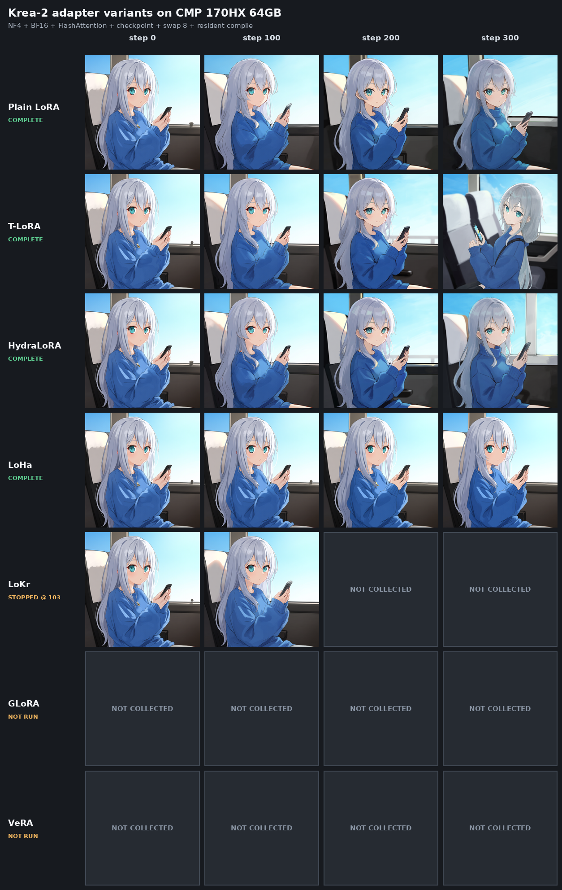

# Krea-2 adapter 变体：CMP 170HX 300-step 训练与预览对比

日期：2026-09-04

状态：部分完成；按用户要求在 LoKr step 103 中止剩余正式队列

适用版本：本地工作树（基础 commit `2e96bd0ce3a7c2803d542e5b0b7dfeac77369d8b`）

后续更新：DoRA / OrthoLoRA / ReFT 的修复和重新验证见
[2026-09-05 NF4 修复报告](krea2_nf4_adapter_repair_20260905.md)。下文失败记录保留为当时结果，不代表修复后的状态。

## 结论

本轮在 **NVIDIA CMP 170HX 64GB** 上，用实验 runner 临时放宽 Krea-2 的 adapter registry 后：

- **T-LoRA、HydraLoRA、LoHa** 完成 300/300 步，`NF4 + BF16 + flash + full checkpoint + block swap 8 + resident compile + fused AdamW` 组合未出现运行时错误，并成功生成 0/100/200/300 预览和最终 adapter checkpoint。
- **LoKr** 通过 1-step smoke，正式训练运行到 step 103；随后按用户要求停止，只有 step 0/100 预览，没有最终 checkpoint，不判定为 300-step 通过。
- **GLoRA、VeRA** 通过 1-step smoke，但在队列轮到它们前已停止，不得宣称长训通过。
- **DoRA、OrthoLoRA、ReFT** 在 smoke 阶段即失败，当前组合不兼容。
- plain LoRA 仅作 300-step 对照，不计入“LoRA 以外变体”。

这些结果只证明**临时放宽 registry 后的当前进程内训练、预览和保存路径**。生产 `MODEL_FAMILY_REGISTRY` 仍将 Krea-2 限制为 plain LoRA；本轮未验证最终 checkpoint 重新加载、resume 或独立推理，因此不应直接开放 WebUI/生产能力。

## 实验边界

实验入口为：

`output/runs/krea2-variant-300-20260904/krea_variant_probe_runner.py`

runner 只在当前 Python 进程中将 `krea2_raw` 的：

```python
supported_network_specs = None
plain_lora_only = False
```

其余 compatibility checks 和正常 `run_training_cli` 仍保留。这是隔离的 capability probe，没有修改生产 registry。

基础 commit 之上存在未提交工作树改动，因此 commit 不足以单独重建本次源码状态。原始 resolved TOML、runner、日志、预览和 checkpoint 已保留在实验目录。

## 固定协议

| 项目 | 值 |
| --- | --- |
| GPU | NVIDIA CMP 170HX 64GB，63.39 GiB，SM80 |
| PyTorch / CUDA / cuDNN | `2.12.0+cu130` / `13.0` / `92000` |
| Krea-2 权重 | `krea2_raw_nf4_self_contained.safetensors` |
| 权重 SHA256 | `ee2aedcce6a0f145584c90514a42ef202d9a814e22a30fcbd5f11cd8cd900338` |
| base compute / mixed precision | BF16 / BF16 |
| attention | `attn_mode="flash"` |
| checkpoint | `gradient_checkpointing=true`，`selective_checkpoint="off"` |
| block swap | `blocks_to_swap=8`，slab restore，BF16 transfer |
| compile | `torch_compile=true`，resident scope，fixed seq，Inductor default mode |
| optimizer | AdamW，`fused=True`，lr `2e-4`，constant，no warmup |
| adapter 基线 | rank 16，alpha 8，UNet/DiT only |
| dataset | 1024 bucket，batch 1，50 repeats，固定的本地 resized/cache 数据 |
| 正式训练 | seed 114，300 steps，顺序单 GPU 执行 |
| 预览 | step 0/100/200/300，1024x1024，Euler 28 steps，CFG 4.0，seed 114 |

日志确认 BF16 NF4 重建、`Krea-2 attention mode: flash`、swap 8、compile signature 和 fused AdamW。日志没有输出 FlashAttention 的具体 provider 名，因此本报告只按配置和 runtime 日志声明 `flash` mode，不对 provider 做更强外推。

固定 prompt：

```text
@velis mora, anime style, 1girl, solo, long hair, silver hair, aqua eyes, oversized blue sweater, sitting, holding smartphone, looking at viewer, from side, upper body, vehicle interior, window, blue sky, daylight, sunlight
```

## Smoke 结果

smoke 为同一基础配置下的 1-step 训练 gate，不含正式预览对比。

| 变体 | 变体配置 | Smoke | 记录 |
| --- | --- | --- | --- |
| DoRA | `dora_wd=true` | FAIL | NF4 `Params4bit.weight` 与 dense delta 相加时，`18874368 != 6144` |
| OrthoLoRA | `use_ortho=true` | FAIL | Cayley/compiled first forward 出现 `[16,16] X [1,1]` reduction mismatch |
| T-LoRA | timestep mask，min rank 4 | PASS | 进入正式队列 |
| HydraLoRA | shared-A，4 experts，per-layer sigma router | PASS | 进入正式队列 |
| LoHa | Hadamard-product | PASS | 进入正式队列 |
| LoKr | full-factor 8，Triton grouped delta/backward | PASS | 进入正式队列 |
| GLoRA | generalized LoRA | PASS | 用户停止前未进入正式训练 |
| VeRA | PRNG key 0，`d_initial=0.1` | PASS | 用户停止前未进入正式训练 |
| ReFT | rank 16，last 8 blocks | FAIL | Krea `SingleStreamBlock` 缺少 Anima ReFT 期望的 `x_dim` |

## 正式训练结果

`recent_s_per_step` 是进度记录中的近期训练步耗时，不含预览采样和进程启动时间。显存是 PyTorch CUDA peak，不是 NVML 全进程峰值。

| 变体 | 状态 | 最后观测 loss avg | recent s/step | peak alloc / reserved | 预览 | 最终 checkpoint |
| --- | --- | ---: | ---: | ---: | --- | --- |
| Plain LoRA | 300/300 PASS（对照） | 0.06117 | 3.197 | 11.14 / 12.38 GiB | 0/100/200/300 | 有 |
| T-LoRA | 300/300 PASS | 0.05949 | 3.201 | 11.14 / 12.34 GiB | 0/100/200/300 | 有 |
| HydraLoRA | 300/300 PASS | 0.05974 | 3.564 | 37.32 / 37.95 GiB | 0/100/200/300 | 有 |
| LoHa | 300/300 PASS | 0.09830 | 10.487 | 14.15 / 16.10 GiB | 0/100/200/300 | 有 |
| LoKr | USER STOPPED @ 103 | 0.09306 | 20.052 | 12.53 / 13.42 GiB | 0/100 | 无 |
| GLoRA | NOT RUN | - | - | - | - | - |
| VeRA | NOT RUN | - | - | - | - | - |

相对 plain LoRA，T-LoRA 近期步时基本持平（约 +0.1%）；HydraLoRA 约慢 11.5%，且四 expert 参数/优化器状态使 peak allocated 升到 37.32 GiB；LoHa 约为 3.28x 步时；LoKr 截止 step 103 约为 6.27x 步时。LoKr 未跑满，其 loss 与长训变体不可直接比较。

## Checkpoint 身份核验

| 变体 | 最终文件大小 | tensor keys | 变体证据 |
| --- | ---: | ---: | --- |
| Plain LoRA | 192,748,136 B | 588 | `ss_network_spec=lora`，196 个 `lora_up.weight`，无变体 key |
| T-LoRA | 192,748,264 B | 588 | `ss_use_timestep_mask=true`，`min_rank=4` |
| HydraLoRA | 484,731,328 B | 1,568 | `ss_network_spec=hydra`，392 router keys，784 expert-up keys |
| LoHa | 385,465,264 B | 980 | `ss_network_spec=loha`，784 `hada_*` keys |

T-LoRA 的 timestep mask 是 runtime 调度语义，没有独立 timestep tensor；其 metadata 已保留变体身份。HydraLoRA 训练日志中四个 expert 的 usage 和 gradient 均非零。因此上述三个非 plain 完成项都不是 silent plain-LoRA fallback。

LoKr 只有 resolved snapshot TOML，没有 `.safetensors`；GLoRA/VeRA 未执行正式训练。

## 预览对比



18 张已采集的原始预览 PNG 全部为 1024x1024 RGB，可完整解码，像素有限且非纯色。人工检查 contact sheet 未见黑图、白图、主体缺失或明显崩坏。

单 prompt 观察：

- T-LoRA step 300 相对自身 step 0 的构图变化最明显，人物缩小并向右移，座椅和车内空间占比增大。
- HydraLoRA 主体和风格稳定，step 200/300 的脸部角度和背景有中等变化。
- LoHa 到 step 300 仍最接近自身初始构图，与其更高的 loss 和更慢的步时一致地显示出较弱的 300-step 变化，但不能据此判定泛化质量。
- LoKr step 100 有效且未崩坏，但缺少 step 200/300，不能判定长训趋势。

以 0-255 RGB 像素 RMSE 作为只读描述量，各自最后已采集图相对 step 0 为：plain `41.81`、T-LoRA `57.55`、HydraLoRA `38.98`、LoHa `15.90`、LoKr step 100 `18.58`。同 seed 的 step 0 之间仍有 `0-6.06` RMSE，因此该值只用于描述构图变化，不是质量评分或确定性等价证据。

## 问题记录

### DoRA + NF4

smoke 失败：

```text
RuntimeError: The size of tensor a (18874368) must match the size of tensor b (6144) at non-singleton dimension 0
```

NF4 `Params4bit.weight` 使用打包/展平存储，当前 DoRA weight-decomposition 路径将它与 dense delta 直接相加，形状契约不成立。

### OrthoLoRA + compile

smoke 的首个 compiled forward 在 Cayley 路径失败：

```text
RuntimeError: a and b must have same reduction dim, but got [16, 16] X [1, 1].
```

错误由 TorchDynamo fake-tensor trace 报出，当前不能与本次 resident compile 协议并用。

### ReFT + Krea block

setup 阶段失败：

```text
ValueError: Block 20 (SingleStreamBlock) has no `x_dim`; cannot infer embed_dim for ReFT.
```

ReFT 当前依赖 Anima block 的 `x_dim` 属性，没有适配 Krea `SingleStreamBlock` 的维度获取契约。

## 能力判定

| 变体 | 当前最高可证明级别 | 进入生产前仍需 |
| --- | --- | --- |
| T-LoRA | 300-step 进程内训练/预览/保存 | checkpoint reload、resume、独立推理、registry/WebUI tests |
| HydraLoRA | 300-step 进程内训练/路由/预览/保存 | router reload、resume、独立推理、更低显存 profile |
| LoHa | 300-step 进程内训练/预览/保存 | reload/resume/inference，吞吐优化，多 seed 质量检查 |
| LoKr | 103-step 训练 + step 100 预览 | 重跑至 300，最终保存与 reload/resume/inference |
| GLoRA / VeRA | 1-step smoke | 300-step 长训、预览、保存与 reload |
| DoRA / OrthoLoRA / ReFT | 当前不兼容 | 先修复上述形状/维度契约并重跑 smoke |

在上述闭环完成前，保持生产 Krea-2 `plain_lora_only=True` 是正确边界。

## 原始产物

- 环境与停止原因：`output/runs/krea2-variant-300-20260904/environment.json`
- 分层配置：`output/runs/krea2-variant-300-20260904/configs/`
- smoke 状态：`output/runs/krea2-variant-300-20260904/smoke/status.tsv`
- 正式状态：`output/runs/krea2-variant-300-20260904/formal/status.tsv`
- 结构化汇总：`output/runs/krea2-variant-300-20260904/formal/summary.tsv`
- 预览像素指标：`output/runs/krea2-variant-300-20260904/formal/preview_metrics.tsv`
- 对比图：`output/runs/krea2-variant-300-20260904/formal/contact_sheet.png`
- 完整日志、checkpoint 和原图：`output/runs/krea2-variant-300-20260904/{smoke,formal}/`

整个 `output/` 树被 Git 忽略，不应为整理仓库而删除；本文所引 contact sheet 另存一份于 `docs/findings/assets/`。
