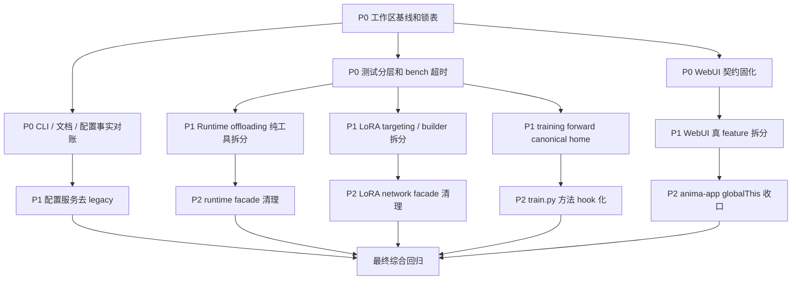

# 项目状态审计与并行整理计划

一句话：当前项目不是完全没人管，而是已经拆过很多轮，但边界还没固化，继续做功能会越来越容易互相踩。

日期：2026-07-04
范围：`anima_lora` 主仓，只做工程状态审计和整理计划，不包含真实训练、模型下载、队列清理或用户数据清理。

---

## ✅ 0. 使用方式

一句话：这份文档是后续多代理并行整理的施工图，先看锁，再领任务。

- 先读 **第 3 节隔离约束**，确认哪些文件不能并行写。
- 再读 **第 5 节任务卡片**，每个 worker 只能领一个任务卡。
- 最后按 **第 7 节验证命令** 收口，不允许靠感觉合并。
- 本文档只新增计划，不代表已经完成代码整理。

---

## 🔍 1. 当前状态快照

一句话：仓库体量已经不小，当前工作区也很脏，所以第一风险是“改动隔离”。

| 项目 | 当前观察 |
|---|---:|
| 当前分支 | `main...private/main [ahead 19]` |
| 已修改文件 | `83` 个 |
| 未跟踪条目 | `15` 组 |
| Git diff 规模 | `3515 insertions(+), 512 deletions(-)` |
| 仓库文件数 | 约 `1052` 个 |
| Python 总行数 | 约 `202597` 行 |
| Web 静态代码总行数 | 约 `58000` 行 |
| 测试文件数 | `98` 个 |
| 测试总行数 | 约 `37391` 行 |
| `tasks.py` 命令数 | `73` 个 |

### ⚠️ 当前脏区集中点

一句话：这些区域已经有未提交改动，后续整理必须先确认 diff。

- `web/`：约 `47` 个已修改文件，集中在前端模块、配置 catalog、训练历史、预览、队列。
- `tests/`：约 `11` 个已修改文件，包含前端状态、block swap、int8、LoKr 等测试。
- `networks/`：约 `9` 个已修改文件，集中在 LoRA family 和 LoKr。
- `library/`：约 `6` 个已修改文件，集中在 runtime、training、Anima model。
- `scripts/`、`tasks.py`、`configs/`、`docs/` 也有未提交改动。

---

## 📌 2. 审计结论

一句话：最值得先整理的不是“所有大文件”，而是“用户会踩坑、多人会冲突、测试会卡住”的地方。

| 优先级 | 方向 | 核心问题 | 建议动作 |
|---|---|---|---|
| P0 | CLI / 文档 / 配置事实对账 | 文档写的命令和配置不一定真实存在 | 先修文档和守门测试，避免用户按错路跑 |
| P0 | 当前工作区隔离 | 未提交改动覆盖核心路径 | 后续每条线独立 worktree / 独立任务卡 |
| P0 | WebUI 契约固化 | 文件拆了，但还靠 `globalThis`、DOM id、CSS 顺序硬撑 | 先锁共享入口，再逐个抽真 feature |
| P0 | 测试和 bench 调度 | 测试多但缺分层，bench 子进程可能卡死 | 加 timeout、marker、fast smoke 和输出根隔离 |
| P1 | Runtime offloading 拆分 | `offloading.py` 同时管配置、master、profile、异步拷贝 | 已完成 TASK-06A/B/C：配置、CPU master、profiler helper 已拆出；异步调度和 swap plan 继续留在 `offloading.py` |
| P1 | LoRA network 拆分 | `network.py` 同时管扫描、构造、router、metrics、load/save | 先抽 targeting / builder，不碰 router 状态 |
| P1 | 训练入口瘦身 | `train.py` 仍混有方法专属准备和训练生命周期 | 一次迁一个方法，保留主流程稳定 |
| P2 | 类型检查收紧 | `pyproject.toml` 关闭大量 Pyright 诊断 | 分目录逐步打开，先从纯工具模块开始 |

---

## 🛡️ 3. 隔离约束

一句话：并行整理可以做，但共享入口必须上锁，用户数据绝对不能碰。

### 3.1 禁止清理或覆盖的目录

一句话：这些目录可能包含用户数据、训练产物或本机状态，不能当垃圾删。

- `.venv/`
- `.worktrees/`
- `models/`
- `output/`
- `logs/`
- `post_image_dataset/`
- `configs/imported/`
- `configs/web-training-history/`
- `configs/web-training-queue/`
- `bench/mfu/assets/`
- `tmp/`

### 3.2 串行锁文件

一句话：这些文件是多人最容易打架的入口，同一轮只能一个 worker 写。

| 锁名 | 文件 / 区域 | 原因 |
|---|---|---|
| `LOCK_TASKS` | `tasks.py`、`scripts/tasks/utilities.py` | 命令注册和测试入口集中 |
| `LOCK_TRAIN_MAIN` | `train.py` | 训练生命周期入口 |
| `LOCK_WEB_BOOT` | `web/static/app.js`、`web/static/js/features/anima-app/index.js`、`imports.js` | 前端模块加载顺序和 cache token 集中 |
| `LOCK_WEB_STATE` | `web/static/js/features/anima-app/chunks/01-scope-state.js` | `globalThis` 状态池 |
| `LOCK_WEB_EVENTS` | `web/static/js/features/anima-app/chunks/36-setup-event-listeners.js` | DOM 事件绑定中心 |
| `LOCK_WEB_DOM` | `web/static/index.html` | DOM id 跨模块契约 |
| `LOCK_WEB_CSS_ROOT` | `web/static/style.css`、`web/static/css/90-responsive.css` | CSS import 顺序和响应式兜底 |
| `LOCK_FRONTEND_TEST` | `tests/test_training_frontend_state.py` | 前端结构字符串守门测试 |
| `LOCK_CONFIG_DOCS` | `docs/guidelines/training.md`、`docs/guidelines/inference.md`、`docs/README.md` | 用户入口文档，冲突率高 |
| `LOCK_RUNTIME_CORE` | `library/runtime/offloading.py` | block swap 调度和显存逻辑集中 |
| `LOCK_LORA_CORE` | `networks/lora_anima/network.py` | LoRA family 核心对象 |

### 3.3 并行写入规则

一句话：每条线只写自己的目录，公共入口最后由整合者串行改。

- 每个 worker 必须声明 `write_scope`。
- 不允许两个 worker 同时写同一锁文件。
- 新增模块优先，旧 facade 暂时保留。
- 搬家型重构优先，行为变更必须单独成任务。
- 不做全仓格式化。
- 不做批量移动。
- 不做 `git reset --hard`、`git checkout -- <path>`、强推或删除用户数据。
- 需要真实 GPU、下载模型、启动长训练时，必须另行确认。

---

## 🔀 4. 依赖图

一句话：先做事实对账和护栏，再做核心拆分，最后清理 facade。



---

## 🧩 5. 并行任务卡片

一句话：下面任务可以分给多个代理并行推进，但必须按写入边界执行。

### TASK-00：工作区基线和施工锁

一句话：先把现状记录清楚，避免后续不知道是谁改了什么。

| 字段 | 内容 |
|---|---|
| `task_id` | `TASK-00` |
| `role` | `reviewer` |
| `objective` | 建立整理前基线、锁表、回滚说明和本轮分工记录 |
| `input_scope` | `git status`、`git diff --stat`、本文档 |
| `output_format` | markdown 基线记录 |
| `acceptance_criteria` | 能说明当前脏文件、锁文件、禁止操作和下一轮分工 |
| `eta` | `0.5d` |
| `write_scope` | `docs/findings/*cleanup*` |
| `sandbox` | `workspace-write` |
| `risk_level` | `Low` |

### TASK-01：CLI / 文档 / 配置事实对账

一句话：先修用户会照着跑错的说明。

| 字段 | 内容 |
|---|---|
| `task_id` | `TASK-01` |
| `role` | `docs_researcher` |
| `objective` | 对账 `tasks.py` 命令、`configs/` 真实文件和用户文档 |
| `input_scope` | `tasks.py`、`scripts/tasks/`、`scripts/experimental_tasks/`、`configs/methods/`、`configs/gui-methods/`、`docs/guidelines/`、`docs/experimental/` |
| `output_format` | 补丁 + 对账表 |
| `acceptance_criteria` | Postfix、FeRA、LoRA 默认口径、缺失提案引用不再误导用户 |
| `eta` | `1d` |
| `write_scope` | 文档优先；如需改命令，只能写 `tasks.py` 和对应 `scripts/tasks/*` |
| `sandbox` | `workspace-write` |
| `risk_level` | `Medium` |

建议先处理：

- Postfix 文档仍写已消失命令。
- FeRA 文档仍指向不存在的 `configs/gui-methods/fera.toml`。
- `download-tagger` 有实现提示但未注册命令。
- LoRA 默认口径和 `configs/methods/lora.toml` 不一致。
- `spd_finetune_lora.md`、`chimera_hydra.md` 等提案引用缺失。

### TASK-02：pytest 分层和 bench 超时

一句话：先让验证体系不容易卡死，后续整理才有护栏。

| 字段 | 内容 |
|---|---|
| `task_id` | `TASK-02` |
| `role` | `worker` |
| `objective` | 建立 fast / focused / slow 测试分层，给 bench 子进程加超时和输出根隔离 |
| `input_scope` | `pyproject.toml`、`tasks.py`、`scripts/tasks/utilities.py`、`bench/training_hot/`、`bench/plain_lora_speed/`、`bench/mfu/`、`tests/test_*_runner.py` |
| `output_format` | 代码补丁 + 测试说明 |
| `acceptance_criteria` | 常用 smoke 能 60s 内跑完；bench dry-run 不写用户产物；子进程有 timeout |
| `eta` | `1d` |
| `write_scope` | 测试入口和 bench runner，不能改业务训练逻辑 |
| `sandbox` | `workspace-write` |
| `risk_level` | `Medium` |

### TASK-03：WebUI DOM 契约和安全绑定

一句话：先把前端最脆的 DOM id 和事件绑定变成显式契约。

| 字段 | 内容 |
|---|---|
| `task_id` | `TASK-03` |
| `role` | `worker` |
| `objective` | 建立 DOM 契约表和安全事件绑定 helper |
| `input_scope` | `web/static/js/shared/dom.js`、`web/static/js/features/anima-app/chunks/36-setup-event-listeners.js`、`web/static/index.html`、`tests/test_training_frontend_state.py` |
| `output_format` | 代码补丁 + DOM 契约清单 |
| `acceptance_criteria` | 缺失非关键节点不直接炸；关键节点有清晰错误；测试覆盖 DOM id 契约 |
| `eta` | `1d` |
| `write_scope` | 独占 `LOCK_WEB_EVENTS` 和 `LOCK_FRONTEND_TEST` |
| `sandbox` | `workspace-write` |
| `risk_level` | `High` |

### TASK-04：WebUI 真 feature 拆分

一句话：把机械 chunk 慢慢变成有边界的 feature。

| 字段 | 内容 |
|---|---|
| `task_id` | `TASK-04` |
| `role` | `worker` |
| `objective` | 从 `anima-app/chunks/25-update-progress.js` 抽出 live training feature |
| `input_scope` | `web/static/js/features/anima-app/chunks/25-update-progress.js`、新增 `web/static/js/features/live-training/` |
| `output_format` | 搬家型补丁 |
| `acceptance_criteria` | 旧调用路径可用；新 feature 有独立入口；不改 DOM id 和 API 路径 |
| `eta` | `1d` |
| `write_scope` | 只写 live-training 新目录和一个旧 chunk |
| `sandbox` | `workspace-write` |
| `risk_level` | `High` |

### TASK-05：CSS 功能收口

一句话：先整理最大 CSS 文件，不改变视觉。

| 字段 | 内容 |
|---|---|
| `task_id` | `TASK-05` |
| `role` | `worker` |
| `objective` | 对历史面板和训练面板 CSS 做分区整理 |
| `input_scope` | `web/static/css/21-history-panels.css`、`web/static/css/33-training-forge.css`、`web/static/css/90-responsive.css` |
| `output_format` | CSS 搬家 / 分段补丁 |
| `acceptance_criteria` | 不改视觉意图；不改 `style.css` import 顺序；`git diff --check` 干净 |
| `eta` | `1d` |
| `write_scope` | 每次只拥有一个 CSS 文件 |
| `sandbox` | `workspace-write` |
| `risk_level` | `Medium` |

### TASK-06：Runtime offloading 纯工具拆分

一句话：TASK-06A/B/C 已完成并合并，只抽了纯工具，没有碰 block swap 调度顺序。

| 字段 | 内容 |
|---|---|
| `task_id` | `TASK-06` |
| `role` | `worker` |
| `objective` | 从 `library/runtime/offloading.py` 抽出配置 normalize、CPU master、profile helper |
| `input_scope` | `library/runtime/offloading.py`、可新增 `block_swap_config.py`、`block_swap_masters.py`、`block_swap_profiler.py` |
| `output_format` | 搬家型补丁 |
| `acceptance_criteria` | public 行为不变；旧 import 继续可用；相关 block swap 测试通过 |
| `eta` | `1d` |
| `write_scope` | 独占 `LOCK_RUNTIME_CORE` |
| `sandbox` | `workspace-write` |
| `risk_level` | `High` |

当前状态：

- ✅ 已完成并合并到主分支。
- ✅ 已拆出 `library/runtime/block_swap_config.py`、`library/runtime/block_swap_masters.py`、`library/runtime/block_swap_profiler.py`。
- ✅ `library/runtime/offloading.py` 继续保留旧私有入口 re-export。
- ⏸️ CUDA stream/Event、swap plan、slab/foreach restore、thread pool、hook 调度仍保留在 `offloading.py`，不在 TASK-06 范围内继续硬拆。

### TASK-07：LoRA targeting / builder 拆分

一句话：先把“找模块”和“造模块”抽出去，不动 router runtime。

| 字段 | 内容 |
|---|---|
| `task_id` | `TASK-07` |
| `role` | `worker` |
| `objective` | 从 `networks/lora_anima/network.py` 抽出 candidate collection 和 module builder |
| `input_scope` | `networks/lora_anima/network.py`、`networks/lora_anima/factory.py`、可新增 `targeting.py`、`module_builder.py` |
| `output_format` | 搬家型补丁 |
| `acceptance_criteria` | 不改 metadata 语义；不改 router source；相关 network 测试通过 |
| `eta` | `1d` |
| `write_scope` | 独占 `LOCK_LORA_CORE` |
| `sandbox` | `workspace-write` |
| `risk_level` | `High` |

### TASK-08：Training forward canonical home

一句话：解决训练 forward 逻辑重复，避免以后修一边漏一边。

| 字段 | 内容 |
|---|---|
| `task_id` | `TASK-08` |
| `role` | `worker` |
| `objective` | 统一 `library/training/forward*`、`router_conditioning.py`、`forward_kwargs.py` 的职责边界 |
| `input_scope` | `library/training/forward/`、`library/training/router_conditioning.py`、`library/training/forward_kwargs.py` |
| `output_format` | 搬家型补丁 + import shim |
| `acceptance_criteria` | 选出 canonical home；重复文件只保留兼容转发；训练 bootstrap 测试通过 |
| `eta` | `1d` |
| `write_scope` | 只写 training forward 相关文件，不碰 `train.py` 主流程 |
| `sandbox` | `workspace-write` |
| `risk_level` | `Medium` |

### TASK-09：Config service 去 legacy

一句话：后端配置服务已经在拆，下一步是让 `_legacy` 变薄。

| 字段 | 内容 |
|---|---|
| `task_id` | `TASK-09` |
| `role` | `worker` |
| `objective` | 把 config methods、sample prompts、output runs、raw files 从 `_legacy` 继续迁出 |
| `input_scope` | `web/services/config_service.py`、`web/services/config/_legacy.py`、`web/services/config/`、`tests/test_web_config_service.py` |
| `output_format` | 搬家型补丁 |
| `acceptance_criteria` | facade 兼容；新模块职责清晰；Web config 测试通过 |
| `eta` | `1d` |
| `write_scope` | Web config 后端独占，不和前端 config 表单同轮写 |
| `sandbox` | `workspace-write` |
| `risk_level` | `Medium` |

### TASK-10：类型检查分目录收紧

一句话：类型检查不要一口吃成胖子，先从低耦合模块开始。

| 字段 | 内容 |
|---|---|
| `task_id` | `TASK-10` |
| `role` | `reviewer` |
| `objective` | 制定 Pyright 分目录收紧计划，并先挑纯工具模块试点 |
| `input_scope` | `pyproject.toml`、`library/config/`、`library/runtime/` 纯工具文件、`scripts/config_*.py` |
| `output_format` | 小补丁或单独计划文档 |
| `acceptance_criteria` | 不影响全仓；至少一个低耦合目录诊断更严格 |
| `eta` | `1d` |
| `write_scope` | `pyproject.toml` 和选定试点目录 |
| `sandbox` | `workspace-write` |
| `risk_level` | `Medium` |

---

## 🚦 6. 调度和监督规则

一句话：并行不是乱开工，必须有心跳、超时和汇总。

| 规则 | 要求 |
|---|---|
| 并行宽度 | 每轮 `3~6` 个任务 |
| 深度 | `max_depth=1`，子代理不得再 spawn 子代理 |
| 心跳 | 每 `30s` 回报当前步骤、产物、阻塞点、预计剩余时间 |
| Soft Timeout | 达到 `1.2x eta` 时催办并要求交中间产物 |
| Hard Timeout | 达到 `2.0x eta` 时停止该任务，父代理接管或换新实例 |
| 重试 | 最多 `2` 次 |
| 熔断 | 本轮失败 / 超时比例 `>40%`，暂停继续 spawn，先做根因分析 |
| 合并 | 子任务完成后先汇总，再进入下一轮 |

### 子代理登记表模板

一句话：每个并行任务都要能被追踪和回收。

| agent_id | task_id | start_time | eta | status | last_heartbeat | retry_count | latest_snapshot |
|---|---|---|---|---|---|---:|---|
| `<agent-id>` | `<task-id>` | `<time>` | `<eta>` | `running/done/failed/cancelled` | `<time>` | `0` | `<当前步骤>` |

---

## 🧪 7. 验证命令矩阵

一句话：每个方向都有自己的最小验证，不要默认跑真实训练或全量大测试。

| 方向 | 最小验证 |
|---|---|
| 文档 / CLI 对账 | `timeout 60 .venv/bin/python tasks.py --help` |
| 配置清单 | `timeout 60 .venv/bin/python -m pytest tests/test_config.py` |
| 预处理入口 | `timeout 60 .venv/bin/python -m pytest tests/test_preprocess_paths.py` |
| Web 前端结构 | `timeout 60 .venv/bin/python -m pytest tests/test_training_frontend_state.py` |
| Web config / preflight | `timeout 60 .venv/bin/python -m pytest tests/test_web_config_service.py tests/test_web_preflight_compat_matrix.py` |
| Web queue / history | `timeout 60 .venv/bin/python -m pytest tests/test_training_queue.py tests/test_preview_service.py` |
| Runtime block swap | `timeout 60 .venv/bin/python -m pytest tests/test_block_swapping.py tests/test_int8_linear_runtime.py` |
| LoRA / registry | `timeout 60 .venv/bin/python -m pytest tests/test_network_registry.py tests/test_network_cfg.py tests/test_factory_metadata_flow.py` |
| LoKr | `timeout 60 .venv/bin/python -m pytest tests/test_lokr.py` |
| Training bootstrap | `timeout 60 .venv/bin/python -m pytest tests/test_training_bootstrap.py tests/test_training_compat_matrix.py` |
| Bench runner | `timeout 60 .venv/bin/python -m pytest tests/test_training_hot_runner.py tests/test_plain_lora_speed_runner.py tests/test_signal_probe_runner.py` |
| 文档格式 | `git diff --check -- docs/findings/project_cleanup_parallel_plan_20260704.md` |

---

## 🧱 8. 不可破坏的不变量

一句话：整理时不能为了好看破坏训练和推理的硬边界。

- Text Encoder padding 不能裁剪，padding token 是 attention sink。
- Constant Token Buckets 不能随意改顺序、数量和 token count。
- Lazy model loading 顺序必须保持：text encoder -> cache -> free；VAE -> cache -> free；DiT -> attach network -> training loop。
- `torch.compile` 必须在 adapter apply/load 后执行。
- DiT forward 边界仍是 5D latent：`(B, C, T=1, H, W)`。
- LoRA family 三轴路由配置不能恢复旧 metadata fallback。
- FEI / GlobalRouter 每步路由状态必须在 train 和 inference loop 中保持一致。
- attention layout 和 fused/split projection 只能通过已有 dispatch / fuse 边界处理。
- `tasks.py merge` 只支持可折叠进 DiT Linear 的 adapter。
- Custom nodes 的 `_vendor/` 不能手工分叉，必须先改 live source，再 `vendor-sync`。

---

## 🧭 9. 建议推进顺序

一句话：先修最会误导用户和最会卡住协作的点，再做核心代码拆分。

### Phase 0：基线和护栏

一句话：先把地面画线，后续才不会乱。

1. 确认当前未提交改动归属。
2. 给每条整理线开独立 worktree 或独立分支。
3. 落地本文档的锁表和任务卡。
4. 不改业务代码，先跑文档 diff check。

### Phase 1：P0 并行

一句话：用户可见事实错误、WebUI 契约、测试卡死先处理。

- `TASK-01`：CLI / 文档 / 配置事实对账。
- `TASK-02`：pytest 分层和 bench 超时。
- `TASK-03`：WebUI DOM 契约和安全绑定。

这些任务能并行，但 `TASK-01` 独占 `LOCK_TASKS` 或 `LOCK_CONFIG_DOCS`，`TASK-03` 独占 `LOCK_WEB_EVENTS`。

### Phase 2：P1 并行

一句话：核心代码只做搬家型拆分，先不改行为。

- `TASK-06`：Runtime offloading 纯工具拆分。已完成并合并，后续只做必要维护，不继续扩大 runtime 拆分范围。
- `TASK-07`：LoRA targeting / builder 拆分。
- `TASK-08`：Training forward canonical home。
- `TASK-09`：Config service 去 legacy。

这些任务原则上可以并行，因为写入边界不同。

### Phase 3：P2 清理

一句话：等新边界稳定后，再清理旧 facade 和收紧类型检查。

- 清理已经无调用的兼容 facade。
- 把 `globalThis` 状态逐步收回 ctx / feature state。
- 分目录收紧 Pyright。
- 更新 `docs/README.md` 索引。

---

## ✅ 10. 完成定义

一句话：整理不是“拆了文件就完”，必须有测试、有回滚、有文档。

每个任务完成必须满足：

- 必须项已完成。
- 未越过 `write_scope`。
- 没有改动禁止目录。
- 相关测试通过，或明确写出未跑原因。
- `git diff --check` 对改动路径干净。
- 高风险变更有回滚说明。
- 如果改了用户入口文档，命令和配置必须能对上实时源码。
- 如果改了 WebUI 入口，必须跑前端结构测试。
- 如果改了 custom nodes 相关 live source，必须说明是否需要 `vendor-sync`。

---

## 📦 11. 本轮审计来源

一句话：本计划来自主代理横向扫描和 4 个只读子代理并行审计。

| 来源 | 范围 | 结论摘要 |
|---|---|---|
| 主代理 | Git 状态、行数热点、TODO/兼容词、文档索引、任务入口 | 当前最大风险是脏工作区 + 共享入口 |
| A1 explorer | training / runtime / networks | 拆到一半，核心边界未固化 |
| A2 explorer | WebUI 前后端 | 机械拆分，仍依赖 `globalThis`、DOM id、CSS 顺序 |
| A3 explorer | configs / CLI / docs | 文档和真实命令、配置存在错位 |
| A4 explorer | tests / bench / repo hygiene | 测试多但缺分层，bench 缺超时和输出隔离 |

---

## 📌 12. 结论

一句话：下一步不要一口气大重构，要按锁表把“事实错位、验证护栏、共享契约、核心纯函数拆分”分批并行推进。

最推荐先开三条线：

1. `TASK-01`：修 CLI / 文档 / 配置事实错位。
2. `TASK-02`：补测试分层和 bench 超时。
3. `TASK-03`：固化 WebUI DOM 契约。

这三条线能最快降低用户踩坑和多代理冲突风险，然后再进入 runtime、LoRA、training 核心拆分。

---

## 📍 13. 阶段推进记录

一句话：Phase 1 已落地，进入 Phase 2 前先把验证结果和剩余风险写清楚。

### 13.1 Phase 1 完成状态

一句话：TASK-01、TASK-02、TASK-03 已完成，但当前仍是未提交的脏工作区。

| 任务 | 状态 | 已落地产物 | 当前验证 |
|---|---|---|---|
| `TASK-01` CLI / 文档 / 配置事实对账 | ✅ 已完成 | 用户文档、方法配置说明、`download-tagger` 命令注册等事实对账 | `timeout 60 .venv/bin/python tasks.py --help` 通过；`timeout 60 .venv/bin/python -m pytest -q tests/test_config.py` 30 passed |
| `TASK-02` pytest 分层和 bench 超时 | ✅ 已完成 | `fast/focused/slow` marker；`test-fast/test-focused/test-slow`；bench 子进程 timeout；dry-run 输出根隔离 | `timeout 60 .venv/bin/python tasks.py test-fast --help` 通过；`timeout 60 .venv/bin/python tasks.py test-fast` 41 passed |
| `TASK-03` WebUI DOM 契约和安全绑定 | ✅ 已完成 | DOM helper、安全事件绑定、前端结构守门测试补强 | `timeout 60 .venv/bin/python -m pytest -q tests/test_training_frontend_state.py` 57 passed |

### 13.2 当前基线确认

一句话：工作区还没收口提交，Phase 2 必须继续按锁表小步推进。

| 检查项 | 当前结果 |
|---|---|
| `git status --short --branch` | `main...private/main [ahead 26]`；当前受控改动集中在本文档、`web/services/config/merge.py`、`tests/test_web_config_service.py`；另有 `.worktrees/`、`tmp/` 未跟踪禁碰目录 |
| `git diff --stat` | 当前普通 diff 已从旧的 35 个文件收敛为少量受控文件；精确行数以本轮结束时 `git diff --stat` 为准 |
| `git check-ignore -v bench/mfu/run_training.py tests/test_mfu_bench.py` | 两个 MFU 文件均被 `.git/info/exclude` 忽略 |

### 13.3 MFU 版本控制风险

一句话：MFU 代码和测试如果要随 TASK-02 发布，必须单独处理本机 ignore 规则。

- `bench/mfu/run_training.py` 被 `.git/info/exclude` 的 `bench/mfu/` 命中。
- `tests/test_mfu_bench.py` 被 `.git/info/exclude` 的显式规则命中。
- 普通 `git status` 和 `git diff --stat` 不会展示这两个文件的改动。
- 若要把 TASK-02 的 MFU timeout / dry-run 隔离一起纳入版本控制，需要执行以下二选一：
  - 删除或调整 `.git/info/exclude` 里的本机忽略规则后正常跟踪。
  - 保留本机忽略规则，但提交时用 `git add -f bench/mfu/run_training.py tests/test_mfu_bench.py` 强制纳入。
- 当前未执行 staging，也未改 `.git/info/exclude`。

### 13.4 Phase 2 启动约束

一句话：Phase 2 只能做搬家型重构，先评估再选最低风险任务落地。

- `TASK-06` 和 `TASK-07` 属于高风险核心锁，先只读评估，不优先落地。
- `TASK-08` 和 `TASK-09` 风险较低，优先从这两条里选一个小补丁。
- 写入时继续遵守锁表，同一锁文件只能一个 worker 拥有。
- 不启动真实训练、不下载模型、不清理用户数据目录。

### 13.5 Phase 2 首轮落地

一句话：首轮选择 `TASK-08`，只做旧 import 路径收口，不改变训练 forward 行为。

| 项目 | 结果 |
|---|---|
| 并行评估 | 已只读评估 `TASK-06` / `TASK-07` / `TASK-08` / `TASK-09` |
| 本轮选择 | `TASK-08` Training forward canonical home |
| 选择原因 | 5 个旧根路径文件与 `library/training/forward/` 同名实现完全一致，改成 shim 风险最低 |
| 改动范围 | `library/training/forward_kwargs.py`、`router_conditioning.py`、`text_conds.py`、`inversion_forward.py`、`vr_forward.py` |
| 行为策略 | `library/training/forward/` 作为 canonical home；旧路径保留兼容 re-export |
| 未选择原因 | `TASK-06` / `TASK-07` 触及 runtime / LoRA 高风险核心；`TASK-09` 会进入 Web config，留到下一轮单独做 |

验证记录：

```bash
timeout 60 .venv/bin/python - <<'PY'
from library.training.forward_kwargs import build_forward_kwargs
from library.training.router_conditioning import apply_router_conditioning
from library.training.text_conds import prepare_text_conds
from library.training.inversion_forward import compute_inversion_func_loss
from library.training.vr_forward import run_vr_reference_forward
from library.training.forward import build_forward_kwargs as canonical_build_forward_kwargs
from library.training.forward import apply_router_conditioning as canonical_apply_router_conditioning
from library.training.forward import prepare_text_conds as canonical_prepare_text_conds
from library.training.forward import compute_inversion_func_loss as canonical_compute_inversion_func_loss
from library.training.forward import run_vr_reference_forward as canonical_run_vr_reference_forward
assert build_forward_kwargs is canonical_build_forward_kwargs
assert apply_router_conditioning is canonical_apply_router_conditioning
assert prepare_text_conds is canonical_prepare_text_conds
assert compute_inversion_func_loss is canonical_compute_inversion_func_loss
assert run_vr_reference_forward is canonical_run_vr_reference_forward
print("forward import shims ok")
PY
```

- `timeout 60 .venv/bin/python -m pytest -q tests/test_ste.py`：5 passed。
- `timeout 60 .venv/bin/python -m pytest -q tests/test_router_compute.py tests/test_global_router.py`：28 passed，存在本机旧 GPU CUDA capability 警告。
- `timeout 60 .venv/bin/python -m pytest -q tests/test_training_bootstrap.py tests/test_training_compat_matrix.py`：14 passed。

### 13.6 Phase 2 二轮落地

一句话：二轮选择 `TASK-09` 的最低风险子步，只让 `raw_files.py` 直接读取静态 metadata。

| 项目 | 结果 |
|---|---|
| 并行评估 | 两个只读 explorer 分别检查 `raw_files.py` metadata 依赖和测试覆盖 |
| 本轮选择 | `TASK-09` Config service 去 legacy 的 `raw_files.py` 子步 |
| 选择原因 | 只涉及 3 个纯静态常量 import，行为风险低，facade 兼容可完整保留 |
| 改动范围 | `web/services/config/raw_files.py`、本文档阶段记录 |
| 行为策略 | `UI_ONLY_CONFIG_FIELDS`、`SPD_NESTED_PATCH_FIELDS`、`RETIRED_TOP_LEVEL_CONFIG_FIELDS` 从 `metadata.py` 直接导入；`config_service` / `_legacy.py` 旧导出继续保留 |
| 越界检查 | 未改 Web 前端入口，未碰训练/runtime/LoRA，未清理用户数据目录，未启动真实训练 |

验证记录：

- `python -m py_compile web/services/config/raw_files.py`：通过。
- `timeout 60 .venv/bin/python -m pytest -q tests/test_web_config_service.py`：114 passed。
- `timeout 60 .venv/bin/python -m pytest -q tests/test_training_frontend_state.py`：57 passed。
- `timeout 60 .venv/bin/python tasks.py test-fast`：41 passed。
- `git diff --check`：通过。

剩余风险：

- `raw_files.py` 仍保留 facade snapshot，因为它还依赖路径、锁、raw file helper 等 legacy 注入。
- MFU 文件仍被 `.git/info/exclude` 忽略；如果要发布 TASK-02 的 MFU 产物，仍需单独 `git add -f` 或调整本机 exclude。
- `TASK-06` / `TASK-07` 仍属高风险核心拆分，下一轮建议继续只读评估后再选最小写入点。

### 13.7 Phase 2 三轮落地

一句话：三轮继续选择 `TASK-09`，只让 `preflight.py` 直接读取纯静态 metadata。

| 项目 | 结果 |
|---|---|
| 并行评估 | 两个只读 explorer 分别检查 `preflight.py` metadata 依赖和测试覆盖 |
| 本轮选择 | `TASK-09` Config service 去 legacy 的 `preflight.py` 子步 |
| 选择原因 | 只涉及纯静态 metadata import，路径和 runtime helper 仍保留 facade 同步，行为风险低 |
| 改动范围 | `web/services/config/preflight.py`、`tests/test_web_config_service.py`、本文档阶段记录 |
| 行为策略 | `DATASET_IMAGE_EXTS`、`OUTPUT_RUN_CONFIG_FILES`、`PREPROCESS_ENV_CHECK_KEY`、`PREPROCESS_ENV_REQUIRED_FILES`、`SUPPORTED_TRAINING_SAMPLE_SAMPLERS`、`LEGACY_TRAINING_SAMPLE_SAMPLERS` 从 `metadata.py` 直接导入；`config_service` / `_legacy.py` 旧导出继续保留 |
| 兼容护栏 | 新增 `_legacy.preflight_training_config` smoke 测试，确认旧模块直连仍能跑基础 preflight |
| 越界检查 | 未改 Web 前端入口，未碰训练/runtime/LoRA，未清理用户数据目录，未启动真实训练 |

验证记录：

- `python -m py_compile web/services/config/preflight.py`：通过。
- `timeout 60 .venv/bin/python -m pytest -q tests/test_web_config_service.py::test_preflight_remains_available_from_legacy_module`：1 passed。
- `timeout 60 .venv/bin/python -m pytest -q tests/test_web_preflight_compat_matrix.py`：5 passed。
- `timeout 60 .venv/bin/python -m pytest -q tests/test_web_config_service.py`：115 passed。
- `timeout 60 .venv/bin/python tasks.py test-fast`：41 passed。

剩余风险：

- `preflight.py` 仍保留 facade snapshot，因为 `ROOT`、`CONFIGS_DIR`、`resolve_output_root` 等动态路径和 monkeypatch 兼容仍依赖它。
- `_legacy.py` 仍有旧 preflight 实现；本轮只补兼容 smoke，不把旧实现替换为 shim。
- MFU 文件仍被 `.git/info/exclude` 忽略；如果要发布 TASK-02 的 MFU 产物，仍需单独处理。

### 13.8 Phase 2 四轮落地

一句话：四轮继续选择 `TASK-09`，只让 `datasets.py` 直接读取纯静态 metadata。

| 项目 | 结果 |
|---|---|
| 并行评估 | 两个只读 explorer 分别检查 `datasets.py` metadata 依赖和测试覆盖 |
| 本轮选择 | `TASK-09` Config service 去 legacy 的 `datasets.py` 子步 |
| 选择原因 | 只涉及数据集静态常量和 caption 模式常量 import，路径和 raw file helper 仍保留 facade 同步 |
| 改动范围 | `web/services/config/datasets.py`、`web/services/config/metadata.py`、`web/services/config/_legacy.py`、`tests/test_web_config_service.py`、本文档阶段记录 |
| 行为策略 | `datasets.py` 直接从 `metadata.py` 导入数据集 preset、图片预览、caption、nl/tag mix、trigger clone、preprocess attrs 等纯静态常量 |
| 兼容护栏 | `DEFAULT_RESIZED_IMAGE_DIR`、`DEFAULT_LORA_CACHE_DIR` 搬到 `metadata.py`，`_legacy.py` 改为同源导入；metadata facade 测试补充默认目录和 caption 模式常量 |
| 越界检查 | 未改 Web 前端入口，未碰训练/runtime/LoRA，未清理用户数据目录，未启动真实训练 |

`datasets.py` 本轮直连的 metadata：

- `CAPTION_SOURCE_AUTO`、`CAPTION_SOURCE_CAPTIONS_JSON`、`CAPTION_SOURCE_JSON`、`CAPTION_SOURCE_TXT`
- `CAPTION_SOURCE_MODE_LABELS`
- `DATASET_CAPTION_MAX_CHARS`、`DATASET_IMAGE_EXTS`、`DATASET_PREVIEW_LIMIT`、`DATASET_SETTING_KEYS`
- `DEFAULT_LORA_CACHE_DIR`、`DEFAULT_RESIZED_IMAGE_DIR`、`DEFAULT_NL_TAG_MIX_TAG_RATIO`
- `HIDDEN_DATASET_PRESET_FILES`、`SYSTEM_DATASET_PRESET_FILES`
- `NL_TAG_MIX_ATTR_KEY`、`NL_TAG_MIX_CLASSIFICATION_METHOD`
- `PREPROCESS_DATASET_SETTING_ORDER`、`RUNTIME_PREPROCESS_ATTR_KEY`、`TRIGGER_CLONE_ATTR_KEY`

验证记录：

- `python -m py_compile web/services/config/datasets.py web/services/config/metadata.py web/services/config/_legacy.py`：通过。
- `python -m py_compile web/services/config/datasets.py`：通过。
- `timeout 60 .venv/bin/python -m pytest -q tests/test_web_config_service.py::test_config_metadata_exports_remain_available_from_legacy_facade`：1 passed。
- `timeout 60 .venv/bin/python -m pytest -q tests/test_web_config_service.py`：115 passed。
- `timeout 60 .venv/bin/python -m pytest -q tests/test_training_frontend_state.py`：57 passed。
- `timeout 60 .venv/bin/python tasks.py test-fast`：41 passed。

剩余风险：

- `datasets.py` 仍保留 facade snapshot，因为 `ROOT`、`CONFIGS_DIR`、`DATASET_PRESETS_DIR`、`save_raw_file`、`get_config_file_meta` 等动态路径和 helper 仍依赖 monkeypatch 兼容。
- `_legacy.py` 仍有旧 datasets 实现；本轮只收口静态 metadata，不把旧实现替换为 shim。
- MFU 文件若仍被本机 ignore 规则影响，发布 TASK-02 产物时仍需单独处理。

### 13.9 Phase 2 五轮落地

一句话：五轮继续选择 `TASK-09`，只让 `_legacy.py` 的低风险 datasets 入口转发到 `datasets.py`。

| 项目 | 结果 |
|---|---|
| 并行评估 | 两个只读 explorer 分别检查 `_legacy.py` datasets shim 范围和测试覆盖 |
| 本轮选择 | `_legacy.py` 中 dataset preset / preview / caption / nl-tag / trigger clone 低风险入口 |
| 选择原因 | `datasets.py` 已是 config_service facade 的 canonical 实现，旧公开入口继续保留名字但转发到新模块 |
| 改动范围 | `web/services/config/_legacy.py`、`tests/test_web_config_service.py`、本文档阶段记录 |
| 行为策略 | 函数内 lazy import `web.services.config.datasets`，调用前同步 `_legacy.py` 的路径和 helper 全局到 `config_service`，避免顶层循环 import |
| 越界检查 | 未改 Web 前端入口，未碰训练/runtime/LoRA，未清理用户数据目录，未启动真实训练 |

已变成 shim 的 `_legacy.py` datasets 入口：

- 公开 dataset API：`list_dataset_presets`、`diagnose_dataset_presets`、`load_dataset_preset`、`save_dataset_preset`、`save_dataset_preset_as`、`import_dataset_preset`、`delete_dataset_preset`、`apply_dataset_preset_to_training_config`、`list_dataset_preset_images`、`resolve_dataset_preview_image`、`load_dataset_editor`、`save_dataset_editor`
- 低风险工具入口：`_normalize_nl_tag_mix`、`_normalize_trigger_clone`、`_normalize_path_pattern`、`_build_dataset_config_doc`、`_nl_tag_mix_caption_source`、`_nl_tag_mix_image_files`、`_classify_nl_tag_caption_text`

暂时保留旧实现的函数：

- 路径和配置根相关：`_dataset_config_path_from_cfg`、`_is_allowed_dataset_config_path`、`_dataset_config_rel_path`、`_single_dataset_config_from_cfg`
- rows / summary / group 私有链路：`_dataset_rows_for_estimate`、`_dataset_rows_from_config`、`_normalize_dataset_rows`、`_normalize_dataset_defaults`、`_dataset_preset_summary`、`_dataset_preset_groups_for_ui`、`_dataset_summary_from_rows`
- 仍被旧 preflight / estimate 使用的 caption 统计和路径 helper：`_dataset_caption_meta`、`_caption_detection_counts_text`、`_nl_tag_mix_caption_counts`、`_nl_tag_mix_available_count`

验证记录：

- `python -m py_compile web/services/config/_legacy.py web/services/config/datasets.py`：通过。
- `.venv/bin/python` 直接 import `_legacy` 并调用 `_normalize_nl_tag_mix` lazy shim：通过。
- `timeout 60 .venv/bin/python -m pytest -q tests/test_web_config_service.py::test_dataset_preset_remains_available_from_legacy_module`：1 passed。
- `timeout 60 .venv/bin/python -m pytest -q tests/test_web_config_service.py`：116 passed。
- `timeout 60 .venv/bin/python -m pytest -q tests/test_training_frontend_state.py`：57 passed。
- `timeout 60 .venv/bin/python tasks.py test-fast`：41 passed。

剩余风险：

- `_legacy.py` 仍有一批 datasets 私有旧实现，用于旧 preflight / estimate 路径；后续应继续按调用链拆，不要一口气删除。
- `datasets.py` 顶层仍通过 `config_service` 做 facade 同步；直接顶层 import `datasets.py` 的循环风险属于既有结构问题，本轮用 lazy shim 避开。
- MFU 文件若仍被本机 ignore 规则影响，发布 TASK-02 产物时仍需单独处理。

### 13.10 Phase 2 六轮落地

一句话：六轮继续选择 `TASK-09`，只把 `_legacy.py` 的 dataset summary / groups helper 纳入 lazy shim。

| 项目 | 结果 |
|---|---|
| 并行评估 | 两个只读 explorer 分别检查 summary/groups shim 范围和测试覆盖 |
| 本轮选择 | `_legacy.py` 中 dataset summary / groups 私有 helper |
| 选择原因 | `datasets.py` 版本已覆盖正则数据集统计、system/hidden preset 和 dataset group meta，旧 helper 可低风险转发 |
| 改动范围 | `web/services/config/_legacy.py`、`tests/test_web_config_service.py`、本文档阶段记录 |
| 行为策略 | 继续复用第五轮的函数内 lazy import shim，只把 summary/groups helper 加入 `_DATASET_SHIM_NAMES` |
| 越界检查 | 未改 Web 前端入口，未碰训练/runtime/LoRA，未清理用户数据目录，未启动真实训练 |

本轮新增 shim：

- `_dataset_preset_summary`
- `_dataset_preset_groups_for_ui`
- `_is_dataset_group_for_ui`
- `_dataset_summary_from_rows`

测试护栏：

- 扩展 `_legacy` direct-call dataset preset 测试，断言 group 文件 summary 里的 `repeat_total`、`train_dataset_count`、`reg_dataset_count`。
- 扩展 system/hidden dataset preset 测试，断言 hidden preset 不进入 list、可见 system preset 在 list 中 `readonly=True` / `system_preset=True`，并验证 diagnose 的 `hidden_count`。

验证记录：

- `python -m py_compile web/services/config/_legacy.py web/services/config/datasets.py tests/test_web_config_service.py`：通过。
- `timeout 60 .venv/bin/python -m pytest -q tests/test_web_config_service.py::test_dataset_preset_remains_available_from_legacy_module tests/test_web_config_service.py::test_system_dataset_preset_is_readonly_but_can_be_saved_as`：2 passed。

剩余风险：

- 路径、rows estimate、caption meta / counts 等更深私有链路仍暂缓，避免影响旧 preflight / estimate 路径。
- `_normalize_dataset_defaults` 暂不 shim，因为旧 helper 链路内仍有调用且新旧实现语义不完全一致。
- MFU 文件若仍被本机 ignore 规则影响，发布 TASK-02 产物时仍需单独处理。

### 13.11 Phase 2 七轮落地

一句话：七轮继续选择 `TASK-09`，只把 `_legacy.py` 里已经能由 `raw_files.py` 承接的 raw TOML 读写和补丁 helper 收成 lazy shim。

| 项目 | 结果 |
|---|---|
| 并行评估 | 两个只读 explorer 分别检查 `_legacy.py` raw_files shim 范围和兼容测试缺口 |
| 本轮选择 | `_legacy.py` 中 raw TOML 读写、预览/保存补丁、兼容归一化 helper |
| 选择原因 | `config_service` 已直接使用 `web.services.config.raw_files` 作为 canonical 实现，旧导出名只需要保留兼容转发 |
| 改动范围 | `web/services/config/_legacy.py`、`tests/test_web_config_service.py`、本文档阶段记录 |
| 行为策略 | 函数内 lazy import `web.services.config.raw_files`，调用前把 `_legacy.py` 的路径和 helper 同步回 facade，再恢复 `_legacy` shim，避免循环 import 和导出被 facade 覆盖 |
| 越界检查 | 未改 Web 前端入口，未碰 datasets/preflight/training_service/runtime/LoRA/train.py，未清理用户数据目录，未启动真实训练 |

本轮已转成 shim 的 `_legacy.py` raw_files 入口：

- `load_raw_file`
- `save_raw_file`
- `delete_raw_file`
- `patch_raw_file_values`
- `preview_raw_file_patch`
- `_prepare_raw_file_patch`
- `_restore_dataset_config_after_failed_train_patch`
- `_patch_toml_top_level`
- `_is_spd_patch_target`
- `_remove_retired_top_level_fields`
- `_normalize_patch_value`
- `_normalize_saved_raw_config_content`
- `_normalize_saved_raw_config_content_with_changed_keys`
- `_is_blank_output_name`

本轮刻意暂缓的函数：

- `get_config_file_meta`
- `list_config_file_groups`
- `move_config_file_to_group`

暂缓原因：

- 这 3 个函数的 canonical ownership 还在 config group / facade 这边，不在 `raw_files.py` 内部。
- `raw_files.py` 当前只是消费这些 helper 的 facade snapshot，并不自己管理 group/file meta。
- 现在强行 shim 它们，容易把 config group 归属和 monkeypatch 兼容一起搅乱，风险高于收益。

测试护栏：

- 新增 `_legacy` 直连 raw_files 兼容测试，覆盖：
  - `save_raw_file`
  - `load_raw_file`
  - `_prepare_raw_file_patch`
  - `patch_raw_file_values`
  - `preview_raw_file_patch`
  - `delete_raw_file`
  - `_patch_toml_top_level`
  - `_remove_retired_top_level_fields`
- 断言保留旧行为：
  - `CAME` 双 beta 保存后仍会补成三 beta 兼容写法
  - `precision_preference` 这类 UI-only 字段不会写回 TOML
  - `use_hydra` 这类 retired 字段补丁后会被移除
  - SPD 补丁字段仍会写入 nested table，而不是误写顶层字段

验证记录：

- `python -m py_compile web/services/config/_legacy.py web/services/config/raw_files.py`：通过。
- `timeout 60 .venv/bin/python -m pytest -q tests/test_web_config_service.py`：117 passed。
- `timeout 60 .venv/bin/python -m pytest -q tests/test_training_frontend_state.py`：57 passed。
- `timeout 60 .venv/bin/python tasks.py test-fast`：41 passed。
- `git diff --check`：通过。

剩余风险：

- `_legacy.py` 里的 config file/group meta 旧实现仍在，后续若继续拆，应单独开一轮，只处理 ownership 更清晰的 group/meta 链路。
- `raw_files.py` 仍依赖 facade snapshot 注入路径和 group helper；这属于现阶段兼容结构，不在本轮继续硬拆。
- `raw_files.py` 若绕过 `config_service` 被单独先导入，仍可能遇到 facade 循环导入；本轮按写入边界不改 `config_service.py`，后续可单独开小任务处理。
- MFU 文件若仍被本机 ignore 规则影响，发布 TASK-02 产物时仍需单独处理。

### 13.12 Phase 2 八轮落地

一句话：八轮继续收口 `TASK-09` raw_files，只补强 `raw_files.py` 的 lazy facade 独立导入能力和 `_legacy` shim 护栏。

| 项目 | 结果 |
|---|---|
| 本轮选择 | `raw_files.py` 直接导入收口 + `_legacy.py` raw_files shim 显式测试 |
| 选择原因 | 七轮已把 `_legacy.py` raw TOML / patch 入口变成 shim，本轮发现 canonical `raw_files.py` 仍有隐式 facade 依赖，可用低风险 lazy import 收紧 |
| 改动范围 | `web/services/config/raw_files.py`、`web/services/config/_legacy.py`、`tests/test_web_config_service.py`、本文档阶段记录 |
| 行为策略 | `raw_files.py` 不再顶层导入 `config_service` 和 metadata 常量，改为调用时 lazy 同步 facade / lazy 读取 metadata；`_legacy` 旧导出继续保留 lazy shim |
| 越界检查 | 未改 Web 前端入口，未碰 preflight/training_service/runtime/LoRA/train.py，未清理用户数据目录，未启动真实训练 |

本轮补强点：

- `raw_files.py` 顶层去掉 `config_service` facade import，避免先导入 `raw_files.py` 时反向拉起 `config_service.py` 并触发循环导入。
- `raw_files.py` 的 TOML / TOMLKit 和 metadata 依赖改成函数内 lazy import，不改变错误文案和 TOML patch 语义。
- `_safe_resolve`、`_normalize_config_rel_path`、`_load_user_locks`、`_save_user_locks`、`_lock_reason_message` 这类动态 helper 只从 `_legacy` 原始 helper 读入 `raw_files.py`，不再写回 `_legacy`，避免 facade wrapper 递归。
- `_legacy.py` 的 raw_files 调用桥把 helper 分成 legacy-only 和 facade helper：路径/锁 helper 只从 `_legacy` 注入 `raw_files.py`，`get_config_file_meta` / `list_config_file_groups` / `move_config_file_to_group` 继续由 facade 承接。
- `_legacy.py` 增加 `_restore_raw_files_shims()`，并在 dataset shim 调用后恢复 raw_files shim，避免其它 config facade 同步把 `_legacy` 旧导出污染成 raw_files wrapper。
- `tests/test_web_config_service.py::test_raw_file_helpers_remain_available_from_legacy_module` 增加 shim 断言：
  - 14 个 `_legacy.py` raw_files 入口必须保留 `Compatibility shim forwarding to web.services.config.raw_files.*` 文档。
  - 目标函数必须仍存在于 `web.services.config.raw_files`。
  - 调用一次旧 `save_raw_file` 后，`_legacy.py` 同名导出仍必须是 `_RAW_FILES_SHIMS` 里的 shim，不能被 facade 同步覆盖。
  - `_legacy._safe_resolve` 不能等于 `config_service._safe_resolve`，防止 facade wrapper 递归。
- 新增 `tests/test_web_config_service.py::test_raw_files_module_imports_without_facade_cycle`，防止 `raw_files.py` 顶层重新拉起 `config_service`。

本轮继续暂缓：

- `get_config_file_meta`
- `list_config_file_groups`
- `move_config_file_to_group`
- 其它 config 子模块的直接导入循环问题

暂缓原因：

- 前 3 个函数仍属于 config file/group ownership，不属于 `raw_files.py` canonical 范围。
- 其它 config 子模块如 `preflight.py`、`datasets.py`、`sample_prompts.py`、`output_runs.py`、`merge.py`、`estimation.py`、`file_groups.py` 也存在同类 direct import 循环；统一处理会触及 `config_service.py` 共享 facade，超出本轮 raw_files 小步边界。

已验证：

- `python -c "import web.services.config.raw_files"`：通过。
- `python -c "import sys; import web.services.config.raw_files; assert 'web.services.config_service' not in sys.modules"`：通过。
- `.venv/bin/python` 直接探针覆盖 `raw_files` 直连、`config_service` facade、`_legacy` shim 三条 raw file 调用路径：通过。
- `python -m py_compile web/services/config/raw_files.py web/services/config/_legacy.py`：通过。
- `timeout 60 .venv/bin/python -m pytest -q tests/test_web_config_service.py::test_raw_file_helpers_remain_available_from_legacy_module`：1 passed。
- `timeout 60 .venv/bin/python -m pytest -q tests/test_web_config_service.py`：118 passed。
- `timeout 60 .venv/bin/python -m pytest -q tests/test_training_frontend_state.py`：57 passed。
- `timeout 60 .venv/bin/python tasks.py test-fast`：41 passed。
- `git diff --check`：通过。

剩余风险：

- 其它 config 子模块 direct import 循环是既有 facade 风险，下一轮若继续收口可改做 `preflight.py` 或 config facade 统一 lazy 化。
- MFU 文件若仍被本机 ignore 规则影响，发布 TASK-02 产物时仍需单独处理。

### 13.13 Phase 2 九轮只读评估

一句话：九轮只做 direct import / facade 循环风险评估，不改业务代码。

| 项目 | 结果 |
|---|---|
| 本轮选择 | 只读评估 `web/services/config/*.py` 直接导入风险 |
| 当前基线 | `git status --short --branch` 显示仍只有 Phase 2 相关 4 个受控修改文件，另有 `.worktrees/`、`tmp/` 未跟踪禁碰目录 |
| 重点模块 | `raw_files.py`、`preflight.py`、`datasets.py`、`file_groups.py`、`merge.py`、`sample_prompts.py`、`paths.py`、`metadata.py` |
| `methods.py` 结论 | `web/services/config/methods.py` 不存在；方法/变体相关实现当前在 `merge.py` |
| 越界检查 | 未改 Web 前端，未碰 training_service/runtime/LoRA/train.py，未清理用户数据目录，未启动真实训练 |

`.venv/bin/python` direct import 风险矩阵：

| 模块 | 直接导入 | 是否拉起 `config_service` | 是否拉起 `_legacy` | 结论 |
|---|---|---:|---:|---|
| `raw_files` | ✅ 通过 | 否 | 否 | 八轮已收口，当前最佳参考模板 |
| `paths` | ✅ 通过 | 否 | 否 | 纯 helper，已独立 |
| `metadata` | ✅ 通过 | 否 | 否 | 不触发 facade；但系统 Python 会因依赖链缺 `torch` 失败 |
| `preflight` | ❌ 失败 | 失败后不残留 | 是 | 顶层 import facade 后，`config_service.py` 反向导入 `preflight`，出现 partially initialized |
| `datasets` | ❌ 失败 | 失败后不残留 | 是 | 同类循环，且文件大、依赖 raw/file group/preflight 较多 |
| `file_groups` | ❌ 失败 | 失败后不残留 | 是 | 同类循环，但它是 config group / lock ownership 核心 |
| `merge` | ❌ 失败 | 失败后不残留 | 是 | 同类循环；用户说的 `methods.py` 实际对应这里 |
| `sample_prompts` | ❌ 失败 | 失败后不残留 | 是 | 同类循环；文件小、依赖少，适合下一轮 |
| `output_runs` | ❌ 失败 | 失败后不残留 | 是 | 同类循环；本轮非重点，仅记录 |
| `estimation` | ❌ 失败 | 失败后不残留 | 是 | 同类循环；本轮非重点，仅记录 |

系统 `python` direct import 额外观察：

- `raw_files`、`paths`：✅ 通过，且不拉起 `config_service` / `_legacy`。
- `metadata`、`preflight`：❌ 先卡在 `torch` 依赖链。
- `datasets`、`file_groups`、`merge`、`sample_prompts`、`output_runs`、`estimation`：❌ 先卡在 `toml` 依赖。
- 这说明系统 Python 结果更多反映本机依赖缺失；`.venv/bin/python` 结果更适合判断 facade 循环。

循环根因：

- `preflight.py`、`datasets.py`、`file_groups.py`、`merge.py`、`sample_prompts.py`、`output_runs.py`、`estimation.py` 都有同一模式：
  - 顶层 `from web.services import config_service as _facade`
  - 顶层遍历 `_facade.__dict__` 并 `globals().setdefault(...)`
  - `_sync_from_facade()` 会把 `_SYNC_NAMES` 回写到 `_legacy`
  - 文件末尾把 `__all__` 导出包装成 `_exported`
- 直接导入这些子模块时，子模块先拉 `config_service.py`；`config_service.py` 又导入同一个子模块，于是报 partially initialized。
- `raw_files.py` 八轮已经改成可参考形态：顶层不拉 facade，调用时 lazy sync，路径/锁 helper 从 `_legacy` 原始 helper 单向读入，避免 facade wrapper 递归。

下一轮最小实现推荐：

| 优先级 | 候选 | 原因 | 风险 |
|---|---|---|---|
| 1 | `sample_prompts.py` | 只有约 144 行，4 个导出；无 metadata 重依赖；主要读写 `configs/sample-prompts/*.txt`，只需 `ROOT`、`DEFAULT_SAMPLE_PROMPTS_FILE`、`_normalize_config_rel_path`、`_safe_resolve` | Low-Medium |
| 2 | `merge.py` | 对应“methods/variants”能力，约 217 行；适合处理用户提到的 methods 方向 | Medium，依赖 `toml`、`HIDDEN_CONFIG_FILES`、`DEFAULT_MAX_TRAIN_STEPS`、路径和 env helper |
| 3 | `preflight.py` | 用户可见价值高 | Medium-High，约 926 行，依赖训练兼容矩阵、metadata、路径和 runtime helper |
| 4 | `datasets.py` | 已有部分 shim 基础 | High，约 1640 行，依赖多、和 raw/file group/preflight 耦合深 |
| 5 | `file_groups.py` | 解决 group/meta ownership 核心问题 | High，属于 config group / lock 权威实现，不适合在 direct import 小步里顺手动 |

建议的 `sample_prompts.py` 最小方案：

- 移除顶层 `from web.services import config_service as _facade` 和 facade 全量 snapshot。
- 补显式标准库 import：`Path`、`Any` 如需要。
- 把 `_sync_from_facade()` 改为函数内 lazy import `config_service`。
- `_safe_resolve`、`_normalize_config_rel_path` 优先从 `_legacy` 原始 helper 单向读入，不写回 `_legacy`。
- 不改 `load_sample_prompts_file` / `save_sample_prompts_file` 返回结构、错误文案和路径限制。
- 增加 smoke test：`python -c "import web.services.config.sample_prompts"` 且不拉起 `config_service`。
- 验证优先：`python -m py_compile web/services/config/sample_prompts.py web/services/config/_legacy.py`、`timeout 60 .venv/bin/python -m pytest -q tests/test_web_config_service.py -k "sample_prompts or raw_files_module_imports"`，最后再跑完整 Web config。

本轮验证：

- `git diff --check -- docs/findings/project_cleanup_parallel_plan_20260704.md`：通过。

### 13.14 Phase 2 十轮落地

一句话：十轮按九轮建议收口 `sample_prompts.py` direct import 循环，只做最小 lazy facade 解耦。

| 项目 | 结果 |
|---|---|
| 本轮选择 | `sample_prompts.py` 直接导入收口 |
| 选择原因 | 文件小、导出少、无 metadata 重依赖，风险低于 `preflight` / `datasets` / `file_groups` |
| 改动范围 | `web/services/config/sample_prompts.py`、`tests/test_web_config_service.py`、本文档阶段记录 |
| 行为策略 | 顶层不再导入 `config_service`，调用导出函数时再 lazy 同步 facade；路径 helper 从 `_legacy` 原始 helper 单向读入 |
| 越界检查 | 未改 Web 前端，未碰 preflight/datasets/file_groups/merge/training_service/runtime/LoRA/train.py，未清理用户数据目录，未启动真实训练 |

本轮补强点：

- `sample_prompts.py` 移除顶层 `from web.services import config_service as _facade`。
- 移除顶层遍历 `_facade.__dict__` 写入 `globals()` 的 snapshot。
- 新增显式标准库依赖：`Path`、`Any`。
- `_sync_from_facade()` 改为函数内 lazy import `config_service`。
- `ROOT`、`DEFAULT_SAMPLE_PROMPTS_FILE` 等状态仍从 facade 同步，保持 monkeypatch 兼容。
- `_safe_resolve`、`_normalize_config_rel_path` 优先从 `_legacy` 原始 helper 单向读入，不写回 `_legacy`，避免 facade wrapper 递归。
- 新增 `tests/test_web_config_service.py::test_sample_prompts_module_imports_without_facade_cycle`，防止顶层重新拉起 `config_service`。
- 扩展 sample prompts roundtrip 测试，补 `_legacy.py` 直调读写断言。

保持不变：

- `load_sample_prompts_file` / `save_sample_prompts_file` 的返回结构。
- 提示词路径必须在 `configs/` 下、必须是 `.txt`、不能包含 `..` 的限制。
- `train_config_file` 分叉到 `configs/sample-prompts/<rel>.txt` 的策略。
- 注释、空行和原始 spacing 的保留行为。
- `config_service` facade 继续导出 `load_sample_prompts_file`、`save_sample_prompts_file`、`_normalize_prompt_file_path`、`_sample_prompts_path_for_config`。
- `_legacy.py` 旧导出继续保留。

本轮暂缓：

- 不处理 `preflight.py`、`datasets.py`、`file_groups.py`、`merge.py` 的 direct import 循环。
- 不把 sample prompts 旧实现改成 `_legacy` shim；本轮只解 canonical `sample_prompts.py` 顶层循环。

已验证：

- `python -c "import web.services.config.sample_prompts"`：通过。
- `python -c "import sys; import web.services.config.sample_prompts; assert 'web.services.config_service' not in sys.modules"`：通过。
- `python -m py_compile web/services/config/sample_prompts.py web/services/config/_legacy.py`：通过。
- `timeout 60 .venv/bin/python -m pytest -q tests/test_web_config_service.py::test_sample_prompts_module_imports_without_facade_cycle tests/test_web_config_service.py::test_sample_prompts_roundtrip_preserves_comments_blank_lines_and_spacing tests/test_web_config_service.py::test_sample_prompts_save_can_fork_to_training_config_specific_file tests/test_web_config_service.py::test_sample_prompts_save_rejects_training_config_outside_configs`：4 passed。
- `timeout 60 .venv/bin/python -m pytest -q tests/test_web_config_service.py`：119 passed。
- `timeout 60 .venv/bin/python -m pytest -q tests/test_training_frontend_state.py`：57 passed。
- `timeout 60 .venv/bin/python tasks.py test-fast`：41 passed。
- `git diff --check`：通过。

剩余风险：

- 其它 config 子模块 direct import 循环仍是既有风险，下一轮建议继续从 `merge.py` 或 `preflight.py` 里选一个小边界。
- MFU 文件若仍被本机 ignore 规则影响，发布 TASK-02 产物时仍需单独处理。

### 13.15 Phase 2 十一轮落地

一句话：十一轮回到 `TASK-09` raw_files，只补直接导入后的私有 helper 和 `_legacy` shim 路径安全护栏。

| 项目 | 结果 |
|---|---|
| 本轮选择 | `raw_files.py` direct import 私有 helper 补强 + `_legacy.py` raw_files 路径安全测试 |
| 选择原因 | 八轮已让 `raw_files.py` 顶层不拉 facade，但直接导入后单独调用 `_is_spd_patch_target` 仍缺少 `_normalize_config_rel_path` fallback，可用纯 `paths.py` 低风险补齐 |
| 改动范围 | `web/services/config/raw_files.py`、`tests/test_web_config_service.py`、本文档阶段记录 |
| 行为策略 | `raw_files.py` 顶层只导入纯路径 helper 作为默认归一化；经过 facade / `_legacy` 调用时仍由 lazy sync 注入 monkeypatch 后的 helper |
| 越界检查 | 未改 Web 前端，未碰 preflight/datasets/file_groups/merge/training_service/runtime/LoRA/train.py，未清理用户数据目录，未启动真实训练 |

本轮补强点：

- `raw_files.py` 通过 `web.services.config.paths.normalize_config_rel_path` 提供默认 `_normalize_config_rel_path`，让直接导入后的 `_is_spd_patch_target` 可以独立判断路径。
- `test_raw_files_module_imports_without_facade_cycle` 扩展为：
  - 直接导入 `web.services.config.raw_files` 不拉起 `web.services.config_service`。
  - 直接导入后也不拉起 `web.services.config._legacy`。
  - `_is_spd_patch_target` 的路径命中、内容启发式命中、普通 LoRA 路径不命中都能在无 facade 状态下运行。
- `test_raw_file_helpers_remain_available_from_legacy_module` 扩展路径安全断言：
  - `load_raw_file("../outside.toml")` 仍返回空字符串。
  - `save_raw_file("../outside.toml", ...)` 仍返回 `路径不合法`。
  - `_prepare_raw_file_patch("../outside.toml", ...)` 仍返回 `路径不合法` 且不产生目标路径 / 内容 / changed keys。
  - `delete_raw_file("../outside.toml")` 仍拒绝路径。
  - raw_files shim 在 save / patch / preview / delete / load 后仍保留在 `_legacy.py`，不会被 facade 同步覆盖。

本轮 shim 列表未新增，继续保持 14 个 raw_files 兼容入口：

- `load_raw_file`
- `save_raw_file`
- `delete_raw_file`
- `patch_raw_file_values`
- `preview_raw_file_patch`
- `_prepare_raw_file_patch`
- `_restore_dataset_config_after_failed_train_patch`
- `_patch_toml_top_level`
- `_is_spd_patch_target`
- `_remove_retired_top_level_fields`
- `_normalize_patch_value`
- `_normalize_saved_raw_config_content`
- `_normalize_saved_raw_config_content_with_changed_keys`
- `_is_blank_output_name`

本轮继续暂缓：

- `get_config_file_meta`
- `list_config_file_groups`
- `move_config_file_to_group`

暂缓原因：

- 这 3 个函数的 canonical ownership 仍在 `file_groups.py` / config facade，不属于 raw TOML 读写和 patch 语义。
- 它们深度依赖 group 推断、锁状态、用户分组、`WEB_FILE_GROUPS_FILE` / `WEB_USER_LOCKS_FILE` 和 monkeypatch 后的动态路径。
- 现在强行迁到 `raw_files.py` 会把 file group ownership 和 raw TOML ownership 混在一起，风险升高。

已验证：

- `python -m py_compile web/services/config/_legacy.py web/services/config/raw_files.py`：通过。
- `timeout 60 .venv/bin/python -m pytest -q tests/test_web_config_service.py`：119 passed。
- `timeout 60 .venv/bin/python -m pytest -q tests/test_training_frontend_state.py`：57 passed。
- `timeout 60 .venv/bin/python tasks.py test-fast`：41 passed。
- `git diff --check`：通过。

剩余风险：

- `file_groups.py`、`preflight.py`、`datasets.py`、`merge.py` 等模块的 direct import 循环仍是既有 facade 风险，不在本轮 raw_files 小步边界内。
- `_legacy.py` 文件里仍保留旧 raw_files 函数体，但模块底部同名全局已被 shim 覆盖；后续维护时不要误改旧函数体当作活跃实现。
- MFU 文件若仍被本机 ignore 规则影响，发布 TASK-02 产物时仍需单独处理。

### 13.16 Phase 2 TASK-06 合并收口

一句话：`TASK-06` 已从独立 worktree 合并回主分支，runtime block swap 纯工具拆分正式收口。

| 项目 | 结果 |
|---|---|
| 合并来源 | 独立 worktree `/home/scv/nvme0n1p1/训练器相关/anima_lora-task-06a-block-swap-config` |
| 分支 | `codex/task-06a-block-swap-config` |
| 主分支状态 | 已合并，`git log` 可见三段 TASK-06 提交 |
| 越界检查 | 未改 Web config、LoRA、training_service、计划外测试；主工作区 TASK-09 文件未被 TASK-06 写入 |

提交链：

- `0b70fefc` `refactor: split block swap config helpers`
- `3a80542f` `refactor: split block swap CPU master helpers`
- `62fd7759` `refactor: split block swap profiler helper`

最终结构：

- `library/runtime/block_swap_config.py`：block swap 配置常量、env helper、normalize 函数。
- `library/runtime/block_swap_masters.py`：CPU master / int8 master 捕获和恢复 helper。
- `library/runtime/block_swap_profiler.py`：append-only JSONL writer `BlockSwapProfiler` 和 `_resolve_profiler`。
- `library/runtime/offloading.py`：继续保留旧私有入口 re-export，兼容旧 import、测试 monkeypatch 和内部调用。

已确认保留的兼容入口：

- `normalize_block_swap_transfer_dtype`
- `normalize_block_swap_restore_mode`
- `normalize_block_swap_int8_restore_mode`
- `normalize_block_swap_int8_scope`
- `Int8BlockSwapCpuMaster`
- `_CpuMaster`
- `_capture_cpu_master`
- `_restore_cpu_master_tensor`
- `_restore_int8_cpu_master_into_tensor`
- `BlockSwapProfiler`
- `_resolve_profiler`

验证结果：

- `python -m py_compile library/runtime/offloading.py library/runtime/block_swap_config.py library/runtime/block_swap_masters.py library/runtime/block_swap_profiler.py`：通过。
- re-export 对象同一性检查：通过。
- `timeout 60 .venv/bin/python -m pytest -q tests/test_block_swapping.py`：55 passed。
- `timeout 60 .venv/bin/python -m pytest -q tests/test_int8_linear_runtime.py`：6 passed。
- `timeout 60 .venv/bin/python -m pytest -q tests/test_int8_blockswap_equivalence_probe.py`：9 passed。
- `timeout 60 .venv/bin/python -m pytest -q tests/test_compile_checkpoint_block_swap_hot.py`：12 passed。
- `timeout 60 .venv/bin/python -m pytest -q tests/test_config.py`：30 passed。
- `timeout 60 .venv/bin/python -m pytest -q tests/test_training_resume.py -k block_swap`：1 passed, 124 deselected。
- `git diff --check`：通过。

继续暂缓：

- CUDA stream / Event 调度。
- swap plan / slab plan / foreach restore 调度。
- thread pool 和 hook 调度。
- `_ensure_profile_poller`、`_stop_profile_poller`、`_queue_profile_wait_event`、`flush_profile_events` 等和 `Offloader` 状态机强耦合的 profile queue。

下一步建议：

- `TASK-06` 暂停继续拆分，后续只做缺陷修复或必要维护。
- 新的并行窗口优先只读评估 `TASK-07`，不要直接写 LoRA 核心。
- 主工作区继续 `TASK-09` Web config facade 收口，避免和 runtime / LoRA 核心混在同一轮。

### 13.17 Phase 2 十二轮落地

一句话：十二轮继续推进 `TASK-09`，只收口 `merge.py` 的 direct import 循环，不碰 `_legacy.py` 大拆。

| 项目 | 结果 |
|---|---|
| 并行评估 | `READ-01` 复核 TASK-01/02/03，`READ-09` 推荐 `merge.py`，`READ-07-10` 建议 LoRA 继续只读、TASK-10 先做小试点 |
| 本轮选择 | `TASK-09` Config service 去 legacy 的 `merge.py` direct import 子步 |
| 选择原因 | `merge.py` 文件短、导出少，当前直接导入会触发 `config_service` 循环；比 `datasets.py`、`file_groups.py`、`preflight.py` 风险低 |
| 暂缓项 | `TASK-07` 只读不写；`TASK-10` 因本机未安装 `pyright`，先记录试点建议；`output_runs.py`、`estimation.py`、`preflight.py`、`datasets.py`、`file_groups.py` 继续暂缓 |
| 写入范围 | `web/services/config/merge.py`、`tests/test_web_config_service.py`、本文档阶段记录 |
| 锁和冲突风险 | Web config 后端独占；未碰 Web 前端锁、runtime、LoRA、training、用户数据目录；`.worktrees/`、`tmp/` 仍不清理 |
| 风险等级 | Low-Medium |

本轮补强点：

- `merge.py` 去掉导入期 `from web.services import config_service as _facade` 和 facade 全量 snapshot。
- `merge.py` 显式声明自身需要的标准库、`toml`、`library.env`、`paths.py` 和 `metadata.py` 依赖。
- `merge.py` 保留 exported wrapper，在真正调用导出函数时再 lazy 同步 `config_service` 的 monkeypatch 状态。
- 为直接导入场景补默认 helper：`_load`、`_safe_config_subdir`、`_resolve_project_path`、`_auto_data_dir_for_key`、`_derived_data_dir`、`_display_path`。
- 新增 `test_merge_module_imports_without_facade_cycle`，防止 `merge.py` 顶层重新拉起 `config_service` 或 `_legacy`。

验证记录：

- `PYTHONDONTWRITEBYTECODE=1 timeout 60 .venv/bin/python -m py_compile web/services/config/merge.py`：通过。
- `timeout 60 .venv/bin/python -m pytest -q tests/test_web_config_service.py::test_merge_module_imports_without_facade_cycle tests/test_web_config_service.py::test_spd_cli_config_is_exposed_as_method_variant tests/test_web_config_service.py::test_web_variants_follow_variant_family_metadata`：3 passed。
- `timeout 60 .venv/bin/python -m pytest -q tests/test_web_config_service.py`：120 passed。
- `git diff --check -- web/services/config/merge.py tests/test_web_config_service.py docs/findings/project_cleanup_parallel_plan_20260704.md`：通过。

只读评估结论：

- `TASK-01` 和 `TASK-03` 当前源码结构支撑“已完成”判断，本轮不补写。
- `TASK-02` 的 pytest 分层和入口成立，但 MFU 相关文件仍被 `.git/info/exclude` 忽略；若要发布 MFU timeout / dry-run 产物，仍需单独处理跟踪规则或强制纳入。
- `TASK-07` 不建议本轮写：`LoRANetwork.__init__` 内部 `create_modules()` 同时混有候选收集、构造、router 计数、dim/alpha、Hydra/Chimera/VeRA 等逻辑；后续应先做 characterization test，再只抽 candidate collection。
- `TASK-10` 推荐后续从 `scripts/config_compat.py`、`scripts/config_explain.py` 做小范围类型检查试点；当前 `.venv/bin/python -m pyright --version` 缺少 `pyright` 模块。

剩余风险：

- `_legacy.py` 里的 merge 旧实现仍未转成 shim；本轮只先保证 canonical `merge.py` 可直接导入。
- `output_runs.py`、`estimation.py`、`preflight.py`、`datasets.py`、`file_groups.py` 仍存在 direct import / facade 循环风险。
- MFU 文件若仍被本机 ignore 规则影响，发布 TASK-02 产物时仍需单独处理。

下一轮建议：

- 优先继续 `TASK-09`：可选 `_legacy.py` 的 merge 入口 shim，或从 `output_runs.py` / `estimation.py` 里选一个小文件继续 direct import 收口。
- `TASK-10` 若要推进，先确认是否引入 `pyright` / `basedpyright` 工具；不要直接扩大到全仓。
- `TASK-07` 继续只读，先补 LoRA candidate collection 的 characterization 方案，不直接拆核心 builder。

### 13.18 Phase 2 十三轮落地

一句话：十三轮继续 `TASK-09`，把 `_legacy.py` 的 merge 公开入口转成 lazy shim，巩固上一轮 `merge.py` direct import 收口。

| 项目 | 结果 |
|---|---|
| 并行评估 | `READ-09-SHIM` 确认只 shim 8 个公开 merge 入口可行；`READ-09-NEXT` 建议下一步优先 `output_runs.py` 而不是 `estimation.py` |
| 本轮选择 | `_legacy.py` merge 公开入口 lazy shim |
| 选择原因 | 十二轮已让 canonical `merge.py` 可直接导入，本轮只保留旧入口兼容转发，不删除旧函数体，风险低于新拆 `output_runs.py` |
| 暂缓项 | 暂缓 `output_runs.py` / `estimation.py` direct import；暂缓 `TASK-07` LoRA；暂缓 `TASK-10` 类型检查工具引入 |
| 写入范围 | `web/services/config/_legacy.py`、`web/services/config/merge.py`、`tests/test_web_config_service.py`、本文档阶段记录 |
| 锁和冲突风险 | Web config 后端独占；未碰 Web 前端、runtime、LoRA、training、用户数据目录；`.worktrees/`、`tmp/` 仍不清理 |
| 风险等级 | Medium |

本轮补强点：

- `_legacy.py` 新增 `_MERGE_SHIM_NAMES`、`_MERGE_SHIMS`、`_call_merge_impl()`、`_make_merge_shim()`。
- 只覆盖 8 个公开入口：`list_methods`、`list_variants`、`list_all_variants`、`list_presets`、`load_merged_config`、`suggest_data_dirs`、`suggest_dataset_dirs`、`apply_auto_data_dirs`。
- 不 shim 私有 helper：`_load`、`_safe_config_subdir`、`_resolve_project_path`、`_display_path`、`_derived_data_dir`、`_auto_data_dir_for_key` 等继续保留旧实现，避免破坏 `config_service.py` wrapper 和 monkeypatch 习惯。
- `merge.py` 的 `_SYNC_NAMES` 补入 `DEFAULT_MAX_TRAIN_STEPS`，让 facade / legacy shim 的同步状态更一致。
- 新增 `test_merge_helpers_remain_available_from_legacy_module`，覆盖旧入口 shim 文档、临时配置根、SPD variant、GUI variant、preset、merged config 和自动数据目录推导。

验证记录：

- `PYTHONDONTWRITEBYTECODE=1 timeout 60 .venv/bin/python -m py_compile web/services/config/_legacy.py web/services/config/merge.py`：通过。
- `timeout 60 .venv/bin/python -m pytest -q tests/test_web_config_service.py::test_merge_module_imports_without_facade_cycle tests/test_web_config_service.py::test_merge_helpers_remain_available_from_legacy_module tests/test_web_config_service.py::test_spd_cli_config_is_exposed_as_method_variant tests/test_web_config_service.py::test_web_variants_follow_variant_family_metadata`：4 passed。
- `timeout 60 .venv/bin/python -m pytest -q tests/test_web_config_service.py`：121 passed。

剩余风险：

- `_legacy.py` 中 merge 旧函数体仍保留在文件顶部，但模块底部同名全局已被 shim 覆盖；后续维护时不要误改旧函数体当作活跃实现。
- `output_runs.py`、`estimation.py`、`preflight.py`、`datasets.py`、`file_groups.py` 仍有 direct import / facade 循环风险。
- `READ-09-NEXT` 建议下一步优先 `output_runs.py`，因为它比 `estimation.py` 依赖更少；`estimation.py` 依赖 preflight / dataset / 图片计数链路，暂不适合小步收口。
- MFU 文件若仍被本机 ignore 规则影响，发布 TASK-02 产物时仍需单独处理。

下一轮建议：

- 若继续 `TASK-09`，先只读确认 `output_runs.py` direct import 需要的显式依赖和测试边界，再决定是否写。
- 若推进 `TASK-10`，先解决 `pyright` / `basedpyright` 工具可用性，再只选 `scripts/config_compat.py`、`scripts/config_explain.py` 这类 CLI 辅助脚本试点。
- `TASK-07` 继续保持只读，先写候选收集 characterization 方案，不直接改 `LoRANetwork` builder。

### 13.19 Phase 2 十四轮落地

一句话：十四轮继续 `TASK-09`，只收口 `output_runs.py` 的 direct import 循环，不改旧入口 shim。

| 项目 | 结果 |
|---|---|
| 本轮选择 | `web/services/config/output_runs.py` direct import 收口 |
| 选择原因 | `READ-09-NEXT` 判断 `output_runs.py` 比 `estimation.py` 依赖短，功能集中在运行配置列出 / 读取 / 复制，测试边界清楚 |
| 暂缓项 | 暂缓 `_legacy.py` output-run shim；暂缓 `estimation.py`、`preflight.py`、`datasets.py`、`file_groups.py`；暂缓 `TASK-07`、`TASK-10` |
| 写入范围 | `web/services/config/output_runs.py`、`tests/test_web_config_service.py`、本文档阶段记录 |
| 锁和冲突风险 | Web config 后端独占；未碰真实 `output/`、Web 前端、runtime、LoRA、training；`.worktrees/`、`tmp/` 仍不清理 |
| 风险等级 | Medium |

本轮补强点：

- `output_runs.py` 去掉导入期 `from web.services import config_service as _facade` 和 facade 全量 snapshot。
- `output_runs.py` 显式声明 `tomllib`、`datetime`、`Path`、`Any`、`tomlkit`、`get_configs_root`、`paths.py`、`metadata.OUTPUT_RUN_CONFIG_FILES`、`settings_service` 依赖。
- `output_runs.py` 保留 exported wrapper，调用导出函数时再 lazy 同步 `config_service` 的 monkeypatch 状态。
- 为直接导入场景补默认 `_safe_resolve()` 和 `_normalize_group_id()`。
- 新增 `test_output_runs_module_imports_without_facade_cycle`，防止 `output_runs.py` 顶层重新拉起 `config_service` 或 `_legacy`。

验证记录：

- `PYTHONDONTWRITEBYTECODE=1 timeout 60 .venv/bin/python -m py_compile web/services/config/output_runs.py`：通过。
- `timeout 60 .venv/bin/python -m pytest -q tests/test_web_config_service.py::test_output_runs_module_imports_without_facade_cycle tests/test_web_config_service.py::test_output_runs_list_reads_direct_run_dirs_sorted tests/test_web_config_service.py::test_output_run_read_allows_only_fixed_files_under_run tests/test_web_config_service.py::test_output_run_save_as_copies_original_only_and_never_overwrites tests/test_web_config_service.py::test_output_run_save_as_rejects_missing_or_invalid_original`：5 passed。
- `timeout 60 .venv/bin/python -m pytest -q tests/test_web_config_service.py`：122 passed。

剩余风险：

- `_legacy.py` 里的 output-run 旧实现仍未转成 shim；本轮只先保证 canonical `output_runs.py` 可直接导入。
- `estimation.py`、`preflight.py`、`datasets.py`、`file_groups.py` 仍有 direct import / facade 循环风险。
- `output_runs.py` 涉及 output root，但本轮测试只使用临时目录，未读取或修改真实 `output/`。
- MFU 文件若仍被本机 ignore 规则影响，发布 TASK-02 产物时仍需单独处理。

下一轮建议：

- 可继续 `TASK-09`：评估 `_legacy.py` output-run 公开入口 shim，或继续选择下一个低风险 direct import 模块。
- `estimation.py` 仍建议暂缓，除非先理清它对 preflight / dataset / 图片计数链路的依赖。
- `TASK-10` 继续等类型检查工具可用性确认；`TASK-07` 继续只读。

### 13.20 Phase 2 十五轮落地

一句话：十五轮继续 `TASK-09`，把 `_legacy.py` 的 output-run 公开入口转成 lazy shim，延续十四轮 canonical 模块收口。

| 项目 | 结果 |
|---|---|
| 并行评估 | `READ-09-OUTPUT-SHIM` 确认 5 个 output-run 公开入口可 shim；本轮同步确认 `pyright` / `basedpyright` 在 `.venv` 中不可用 |
| 本轮选择 | `_legacy.py` output-run 公开入口 lazy shim |
| 选择原因 | 十四轮已让 canonical `output_runs.py` 可直接导入，本轮只保留旧入口兼容转发，不碰真实 `output/` |
| 暂缓项 | 暂缓 `estimation.py`、`preflight.py`、`datasets.py`、`file_groups.py`；暂缓 `TASK-07` LoRA；暂缓 `TASK-10` 类型检查配置写入 |
| 写入范围 | `web/services/config/_legacy.py`、`tests/test_web_config_service.py`、本文档阶段记录 |
| 锁和冲突风险 | Web config 后端独占；未碰真实 `output/`、Web 前端、runtime、LoRA、training、用户数据目录；`.worktrees/`、`tmp/` 仍不清理 |
| 风险等级 | Medium |

本轮补强点：

- `_legacy.py` 新增 `_OUTPUT_RUNS_SHIM_NAMES`、`_OUTPUT_RUNS_SHIMS`、`_call_output_runs_impl()`、`_make_output_runs_shim()`。
- 只覆盖 5 个 `output_runs.py::__all__` 入口：`list_output_runs`、`load_output_run_config`、`save_output_run_config_as`、`_resolve_output_run_dir`、`_normalize_output_run_name`。
- 不 shim 私有 helper：`_output_run_summary`、`_output_run_config_path`、`_normalize_output_run_save_as_path`、`_safe_mtime`、`_format_file_time`。
- output-run shim 同步 `resolve_output_root`、`_display_settings_path`、`save_raw_file`、`get_config_file_meta`、`list_config_file_groups`、`move_config_file_to_group` 等状态，并在调用前后恢复 raw-files shim，避免 facade 同步污染旧 raw helper。
- 新增 `test_output_run_helpers_remain_available_from_legacy_module`，覆盖旧入口 shim 文档、临时 `output/runs`、固定文件读取、复制 original 配置和不覆盖已有文件。

验证记录：

- `PYTHONDONTWRITEBYTECODE=1 timeout 60 .venv/bin/python -m py_compile web/services/config/_legacy.py web/services/config/output_runs.py`：通过。
- `timeout 60 .venv/bin/python -m pytest -q tests/test_web_config_service.py::test_output_runs_module_imports_without_facade_cycle tests/test_web_config_service.py::test_output_run_helpers_remain_available_from_legacy_module tests/test_web_config_service.py::test_output_runs_list_reads_direct_run_dirs_sorted tests/test_web_config_service.py::test_output_run_save_as_copies_original_only_and_never_overwrites`：4 passed。
- `timeout 60 .venv/bin/python -m pytest -q tests/test_web_config_service.py -k "output_run"`：7 passed, 116 deselected。
- `timeout 60 .venv/bin/python -m pytest -q tests/test_web_config_service.py`：123 passed。

TASK-10 工具状态：

- `command -v pyright`：未找到。
- `command -v basedpyright`：未找到。
- `.venv/bin/python -m pyright --version`：`No module named pyright`。
- `.venv/bin/python -m basedpyright --version`：`No module named basedpyright`。
- 因此本轮不写 `pyproject.toml` 类型检查配置，避免制造无法在本机验证的检查项。

剩余风险：

- `_legacy.py` 里的 output-run 旧函数体仍保留在文件中，但同名全局已被 shim 覆盖；后续维护时不要误改旧函数体当作活跃实现。
- `estimation.py`、`preflight.py`、`datasets.py`、`file_groups.py` 仍有 direct import / facade 循环风险。
- output-run 相关测试只使用 `tmp_path` 临时目录，未读取或修改真实 `output/`。
- MFU 文件若仍被本机 ignore 规则影响，发布 TASK-02 产物时仍需单独处理。

下一轮建议：

- 若继续 `TASK-09`，优先只读评估下一个小模块；`estimation.py` 仍要谨慎，因为它依赖 preflight / dataset / 图片计数链路。
- 若推进 `TASK-10`，先决定是否安装或引入 `pyright` / `basedpyright`，再做 `scripts/config_compat.py`、`scripts/config_explain.py` 小范围试点。
- `TASK-07` 继续只读，先补 candidate collection characterization，不直接拆 `LoRANetwork` builder。

### 13.21 Phase 2 十六轮落地

一句话：十六轮继续 `TASK-09`，只收口 `estimation.py` 的 direct import 循环，并把剩余大模块风险写准。

| 项目 | 结果 |
|---|---|
| 并行评估 | `READ-09-ESTIMATION` 建议 `estimation.py` 可做小收口但不能顶层 import `datasets.py` / `preflight.py`；`READ-09-ALT` 建议暂停继续拆大模块，先记录真实状态 |
| 本轮选择 | `web/services/config/estimation.py` direct import 收口 |
| 选择原因 | `estimation.py` 只有 1 个导出，测试覆盖集中在 step estimate；比 `preflight.py`、`datasets.py`、`file_groups.py` 更适合作为小步 |
| 暂缓项 | 暂缓 `preflight.py`、`datasets.py`、`file_groups.py` direct import 收口；暂缓 `_legacy.py` estimation shim；暂缓 `TASK-07`、`TASK-10` |
| 写入范围 | `web/services/config/estimation.py`、`tests/test_web_config_service.py`、本文档阶段记录 |
| 锁和冲突风险 | Web config 后端独占；未碰真实训练、Web 前端、runtime、LoRA、用户数据目录；`.worktrees/`、`tmp/` 仍不清理 |
| 风险等级 | Medium-High |

本轮补强点：

- `estimation.py` 去掉导入期 `from web.services import config_service as _facade` 和 facade 全量 snapshot。
- `estimation.py` 保留 exported wrapper，调用 `estimate_training_steps()` 时再 lazy 同步 facade 的 monkeypatch 状态。
- `_SYNC_NAMES` 只同步估算所需 helper；`_LEGACY_STATE_NAMES` 限制写回 `_legacy.py` 的范围，避免把 `_legacy._resolve_project_path` 这类旧 helper 覆盖成 facade wrapper 后递归。
- 新增 `test_estimation_module_imports_without_facade_cycle`，防止 `estimation.py` 顶层重新拉起 `config_service` 或 `_legacy`。
- 这轮不顶层 import `datasets.py` / `preflight.py`，因为它们自身仍不是 direct-safe。

验证记录：

- `PYTHONDONTWRITEBYTECODE=1 timeout 60 .venv/bin/python -m py_compile web/services/config/estimation.py`：通过。
- `timeout 60 .venv/bin/python -m pytest -q tests/test_web_config_service.py::test_estimation_module_imports_without_facade_cycle tests/test_web_config_service.py -k "step_estimate"`：7 passed, 117 deselected。
- `timeout 60 .venv/bin/python -m pytest -q tests/test_web_config_service.py`：124 passed。
- `PYTHONDONTWRITEBYTECODE=1 timeout 20 .venv/bin/python -c "import sys; import web.services.config.estimation; assert 'web.services.config_service' not in sys.modules; assert 'web.services.config._legacy' not in sys.modules; print('estimation ok')"`：通过。
- `PYTHONDONTWRITEBYTECODE=1 timeout 20 .venv/bin/python -c "import web.services.config.preflight"`：失败，仍是 partially initialized 循环。
- `PYTHONDONTWRITEBYTECODE=1 timeout 20 .venv/bin/python -c "import web.services.config.datasets"`：失败，仍是 partially initialized 循环。
- `PYTHONDONTWRITEBYTECODE=1 timeout 20 .venv/bin/python -c "import web.services.config.file_groups"`：失败，仍是 partially initialized 循环。

剩余风险：

- `_legacy.py` 中 `estimate_training_steps` 旧实现还未转成 shim；本轮只先保证 canonical `estimation.py` 可直接导入。
- `estimation.py` 函数调用仍依赖 facade 同步获得 preflight / dataset helper；如果目标升级为“直接 import 后直接调用也完全不触发 facade”，需要先让 `datasets.py` 和 `preflight.py` direct-safe。
- `preflight.py`、`datasets.py`、`file_groups.py` 体量大、耦合深，当前不适合继续用同一轮硬拆。
- `TASK-10` 仍因 `pyright` / `basedpyright` 不可用而未写类型检查配置。
- MFU 文件若仍被本机 ignore 规则影响，发布 TASK-02 产物时仍需单独处理。

下一轮建议：

- 暂停 `TASK-09` 大模块代码拆分，除非先做更细的只读设计；可先写风险/拆分方案，避免直接碰 `preflight.py`、`datasets.py`、`file_groups.py`。
- 可转向 `TASK-10` 的工具可用性方案：决定是否引入 `pyright` / `basedpyright` 或只记录无法验证。
- 可单独处理 `TASK-02` 的 MFU ignore / 发布收口风险。

### 13.22 Phase 2 十七轮落地

一句话：十七轮继续 `TASK-09`，把 `_legacy.py` 的 step estimation 公开入口转成 lazy shim，并并行确认 `TASK-02` / `TASK-10` 的下一步边界。

| 项目 | 结果 |
|---|---|
| 并行评估 | `READ-T02` 确认 MFU 文件仍被 `.git/info/exclude` 忽略；`READ-T10` 确认类型检查工具不可用，但可做低风险脚本类型试点 |
| 本轮选择 | `_legacy.py` 中 `estimate_training_steps` lazy shim |
| 选择原因 | 十六轮已让 canonical `estimation.py` 可直接导入，本轮补齐旧 legacy 入口兼容转发；补丁小，测试集中 |
| 暂缓项 | 暂缓 `preflight.py`、`datasets.py`、`file_groups.py` 大模块 direct import；暂缓 `TASK-07` LoRA；暂缓 `TASK-10` 写入；暂缓 `TASK-02` git 纳入操作 |
| 写入范围 | `web/services/config/_legacy.py`、`tests/test_web_config_service.py`、本文档阶段记录 |
| 锁和冲突风险 | Web config 后端独占；未碰真实训练、真实 `output/`、Web 前端、runtime、LoRA、用户数据目录；`.worktrees/`、`tmp/` 仍不清理 |
| 风险等级 | Medium |

本轮补强点：

- `_legacy.py` 新增 `_ESTIMATION_SHIM_SYNC_NAMES`、`_ESTIMATION_SHIMS`、`_call_estimation_impl()`、`_make_estimation_shim()`。
- 只覆盖 1 个公开入口：`estimate_training_steps`。
- shim 调用前把 legacy 当前路径、常量和估算 helper 同步到 facade 与 `estimation.py`，再调用 canonical 实现的 `__wrapped__`，避免二次 wrapper 同步覆盖 monkeypatch。
- 不删除 `_legacy.py` 里的旧 `estimate_training_steps` 函数体；模块底部同名全局已被 shim 覆盖，保持可回退和小步改动。
- 新增 `test_estimation_helpers_remain_available_from_legacy_module`，覆盖旧入口 shim 文档、临时配置根、step estimate 结果和 shim 身份保持。

验证记录：

- `PYTHONDONTWRITEBYTECODE=1 timeout 60 .venv/bin/python -m py_compile web/services/config/_legacy.py web/services/config/estimation.py`：通过。
- `timeout 60 .venv/bin/python -m pytest -q tests/test_web_config_service.py::test_estimation_module_imports_without_facade_cycle tests/test_web_config_service.py::test_estimation_helpers_remain_available_from_legacy_module tests/test_web_config_service.py -k "step_estimate"`：7 passed, 118 deselected。
- `PYTHONDONTWRITEBYTECODE=1 timeout 20 .venv/bin/python -c "import sys; import web.services.config.estimation; assert 'web.services.config_service' not in sys.modules; assert 'web.services.config._legacy' not in sys.modules; print('estimation ok')"`：通过。
- `timeout 60 .venv/bin/python -m pytest -q tests/test_web_config_service.py`：125 passed。
- `git diff --check -- web/services/config/_legacy.py web/services/config/estimation.py tests/test_web_config_service.py docs/findings/project_cleanup_parallel_plan_20260704.md`：通过。

只读评估结论：

- `TASK-02`：`bench/mfu/run_training.py` 和 `tests/test_mfu_bench.py` 存在但未被 Git 跟踪，且分别被 `.git/info/exclude` 的 `bench/mfu/` 和 `tests/test_mfu_bench.py` 规则忽略；后续若要发布，应单独小步 `git add -f` 明确源码 / 测试文件，不要整目录纳入 `bench/mfu/`。
- `TASK-10`：本地有 `ruff 0.15.9`，但没有 `pyright` / `mypy` / `basedpyright` 可执行入口；低风险试点建议只改 `scripts/config_compat.py`、`scripts/config_explain.py` 和对应测试，不引入新依赖、不改 `pyproject.toml`。

剩余风险：

- `_legacy.py` 中 step estimation 旧函数体仍保留在文件中，但同名全局已被 shim 覆盖；后续维护时不要误把旧函数体当作活跃实现继续扩写。
- `estimation.py` 的直接调用仍依赖 facade 同步获得 preflight / dataset helper；若要完全摆脱 facade，需要先让 `datasets.py` 和 `preflight.py` direct-safe。
- `preflight.py`、`datasets.py`、`file_groups.py` 仍是 `TASK-09` 的高耦合剩余项，下一步不宜直接大拆。
- `TASK-02` MFU 发布风险仍未收口，因为本轮未执行 `git add -f`。
- `TASK-10` 仍不能声明类型检查门禁已建立，因为本地缺少类型检查工具。

下一轮建议：

- 优先做 `TASK-02` 的 MFU 发布收口小步：只强制纳入明确源码 / 测试文件，并跑 MFU 单测；不碰 assets、results、cache 和本机路径配置。
- 或推进 `TASK-10` 低风险试点：只给 `scripts/config_compat.py` / `scripts/config_explain.py` 补类型友好结构和测试，用 `ruff` + pytest 验证。
- `TASK-09` 暂停大模块代码拆分，先写更细设计或 characterization 测试，再决定是否碰 `datasets.py` / `preflight.py` / `file_groups.py`。

### 13.23 Phase 2 十八轮落地

一句话：十八轮推进 `TASK-02` 的 MFU 发布收口，只把明确源码和单测强制纳入 Git，不碰运行产物。

| 项目 | 结果 |
|---|---|
| 本轮选择 | `TASK-02` MFU timeout / dry-run 文件发布收口 |
| 选择原因 | 两轮只读评估均确认 MFU 代码存在但被 `.git/info/exclude` 忽略，普通提交会漏掉 |
| 暂缓项 | 暂缓 `TASK-10` 类型试点；暂缓 `TASK-09` 大模块拆分；暂缓 `TASK-07` LoRA |
| 写入范围 | Git index 精准纳入 `bench/mfu/__init__.py`、`bench/mfu/flops.py`、`bench/mfu/run_training.py`、`tests/test_mfu_bench.py`；本文档阶段记录 |
| 锁和冲突风险 | 未改 `.git/info/exclude`；未整目录纳入 `bench/mfu/`；未碰 assets、results、cache、真实训练和用户数据目录 |
| 风险等级 | Low-Medium |

本轮补强点：

- 只读确认 4 个文件均被本机 `.git/info/exclude` 忽略，且此前未被 Git 跟踪。
- 只读扫描 4 个文件，没有发现 `/home/scv`、`ComfyUI`、`configs/imported`、训练历史、训练队列等本机路径或用户数据目录引用。
- 执行 `git add -f` 只纳入明确源码 / 测试文件：
  - `bench/mfu/__init__.py`
  - `bench/mfu/flops.py`
  - `bench/mfu/run_training.py`
  - `tests/test_mfu_bench.py`
- 明确没有纳入 `bench/mfu/assets/`、`bench/mfu/results/`、`__pycache__/` 或其它 benchmark 运行产物。

验证记录：

- `git check-ignore -v bench/mfu/__init__.py bench/mfu/flops.py bench/mfu/run_training.py tests/test_mfu_bench.py`：确认命中 `.git/info/exclude` 的 `bench/mfu/` 和 `tests/test_mfu_bench.py`。
- `wc -l bench/mfu/__init__.py bench/mfu/flops.py bench/mfu/run_training.py tests/test_mfu_bench.py`：4 个文件合计 1352 行。
- `rg -n "/home/scv|ComfyUI|output/|logs/|configs/imported|web-training-history|web-training-queue" bench/mfu/__init__.py bench/mfu/flops.py bench/mfu/run_training.py tests/test_mfu_bench.py`：只命中测试 / 默认输出根里的相对 `output/bench/mfu`。
- `timeout 60 .venv/bin/python -m pytest -q tests/test_mfu_bench.py`：17 passed。
- `git diff --cached --name-status -- bench/mfu tests/test_mfu_bench.py`：4 个文件为 `A`。
- `git diff --cached --check -- bench/mfu/__init__.py bench/mfu/flops.py bench/mfu/run_training.py tests/test_mfu_bench.py`：通过。

剩余风险：

- `bench/mfu/gpu_theoretical.py`、`tests/test_mfu_gpu_theoretical.py`、`bench/mfu/README.md` 仍未纳入；如果后续要发布 GPU 理论峰值工具，需要单独只读评估并跑对应测试。
- 部分 MFU GUI / bench 配置曾被评估含本机绝对路径，仍不建议直接纳入。
- `.git/info/exclude` 仍会隐藏 `bench/mfu/` 下其它未跟踪文件；后续检查 MFU 状态必须继续用 `git status --ignored` 或 `git check-ignore -v`。

下一轮建议：

- 可推进 `TASK-10` 的低风险脚本类型试点，不引入新依赖、不改 `pyproject.toml`，只用 `ruff` 和 pytest 验证。
- 或继续只读拆解 `TASK-07` LoRA candidate collection characterization，不直接改核心 builder。
- 若继续 `TASK-02`，下一步只评估 GPU theoretical 相关文件，不要整目录纳入。

### 13.24 Phase 2 十九轮落地

一句话：十九轮推进 `TASK-10` 的低风险类型友好试点，只改小脚本和测试，不建立全仓类型门禁。

| 项目 | 结果 |
|---|---|
| 本轮选择 | `TASK-10` 类型检查收紧试点 |
| 选择原因 | 本地没有 `pyright` / `mypy` / `basedpyright`，但 `ruff` 可用；先做可测试、低依赖的小结构改动 |
| 暂缓项 | 暂缓 `pyproject.toml` 类型配置收紧；暂缓新增类型检查依赖；暂缓 `TASK-09` 大模块拆分和 `TASK-07` LoRA 写入 |
| 写入范围 | `scripts/config_compat.py`、`scripts/config_explain.py`、`tests/test_config_explain.py`、本文档阶段记录 |
| 锁和冲突风险 | 与 Web config、MFU、runtime、LoRA 文件不重叠；未碰训练、用户数据目录和包依赖 |
| 风险等级 | Low |

本轮补强点：

- `scripts/config_compat.py` 从 `library.training.compat_matrix` 显式导入 `TrainingCompatIssue`、`TrainingCompatMutation`，并给 `_issue_dict()`、`_mutation_dict()` 补具体参数类型。
- `scripts/config_explain.py` 抽出 `build_payload(args: argparse.Namespace) -> dict[str, Any]`，把 CLI 参数到 provenance trace 的构造逻辑变成可单测入口。
- `scripts/config_explain.py` 保持 CLI 行为：选中的 key 不存在时仍退出并提示 `unknown config key(s): ...`。
- 新增 `tests/test_config_explain.py`，覆盖 layer/override 追踪、已存在 key 查询、缺失 key 拒绝。

验证记录：

- `timeout 60 .venv/bin/ruff check scripts/config_compat.py scripts/config_explain.py tests/test_config_compat.py tests/test_config_explain.py`：All checks passed。
- `PYTHONDONTWRITEBYTECODE=1 timeout 60 .venv/bin/python -m py_compile scripts/config_compat.py scripts/config_explain.py tests/test_config_explain.py`：通过。
- `PYTHONDONTWRITEBYTECODE=1 timeout 60 .venv/bin/python -m pytest -p no:cacheprovider -q tests/test_config_compat.py tests/test_config_provenance.py tests/test_config_explain.py`：7 passed。

剩余风险：

- `pyright`、`mypy`、`basedpyright` 仍未作为本地工具可用，本轮不能声明类型检查门禁已建立。
- `pyproject.toml [tool.pyright]` 仍保持宽松配置，没有开启新的全仓诊断。
- 本轮只覆盖两个配置辅助脚本，未推广到训练、WebUI 或 runtime 目录。

下一轮建议：

- 若继续 `TASK-10`，先决定是否引入 `pyright` / `basedpyright` dev 依赖；否则继续只选纯工具脚本做 ruff + pytest 试点。
- 若转回 `TASK-07`，先补 LoRA candidate collection characterization 测试，再考虑最小拆分。
- 若继续 `TASK-02`，只读评估 GPU theoretical 文件和测试，不要纳入 MFU 运行产物。

### 13.25 Phase 2 二十轮只读评估

一句话：二十轮对 `TASK-07` 做只读拆分评估，结论是先补 LoRA 真实构建 characterization 测试，再抽 `targeting.py`。

| 项目 | 结果 |
|---|---|
| 并行评估 | `READ-T07-A` 分析 `network.py::LoRANetwork.__init__` / `create_modules()` 拆分边界；`READ-T07-B` 定位测试缺口 |
| 本轮选择 | `TASK-07` LoRA targeting / builder 拆分只读评估 |
| 选择原因 | LoRA family 属于高风险核心路径，必须先确认最小切口和测试边界，不能直接拆 builder |
| 暂缓项 | 暂缓直接改 `networks/lora_anima/network.py`；暂缓新增 `targeting.py`；暂缓 `TASK-09` 大模块和继续 `TASK-10` |
| 写入范围 | 只写本文档阶段记录 |
| 锁和冲突风险 | `networks/`、`tests/` 只读；未碰训练、推理、router runtime、用户数据目录 |
| 风险等级 | High（只读降风险） |

只读结论：

- `LoRANetwork.__init__` 当前混有四层职责：cfg / runtime state 初始化、target / regex 准备、嵌套 `create_modules()` 候选扫描和模块构造、后续 GlobalRouter / FreqRouter / ContentRouter wiring。
- 嵌套 `create_modules()` 中第一遍候选扫描大约覆盖：模块遍历、`_orig_mod.` 清理、include / exclude、`layer_start/layer_end`、`modules_dim/modules_alpha`、`network_reg_dims`、skip 记录。
- 第二遍构造逻辑继续包含高风险状态：Hydra / OrthoHydra / Chimera / StackedExperts class 选择、router 命中计数、σ / FEI / GlobalRouter extra kwargs、plugin module kwargs、channel scales。
- 最小拆分切口不是 builder，而是候选收集：后续可新增 `networks/lora_anima/targeting.py`，只放 `LoRATargetCandidate`、`compile_lora_target_patterns()`、`collect_lora_target_candidates()`。
- 但在抽文件前，必须先写 characterization test，锁住真实 `LoRANetwork([], tiny_dit, cfg)` 构建行为。

建议先补的测试：

- 新建 `tests/test_lora_network_construction.py`，不要塞进 `test_global_router.py`。
- `test_lora_network_builds_plain_modules_with_stable_names`：确认 tiny `Block` 里的 Linear 被扫描成稳定 `lora_name` / `original_name`，且全是 `LoRAModule`。
- `test_router_targets_mix_hydra_and_plain_lora_modules`：确认 `router_targets` 只让匹配层变 Hydra，其它层 fallback plain LoRA，并断言 `_hydra_router_hits/_misses` 与 `_sigma_router_hits`。
- `test_global_fei_cell_builds_network_router_from_real_init`：确认 `independent_A + route_per_layer=false + router_source=fei` 真实初始化挂上 `GlobalRouter`，且 `_routing_aware_loras` 数量正确。

明确不能碰的状态：

- `self._hydra_router_names/_hydra_router_re/_hydra_router_hits/_hydra_router_misses`
- `self._sigma_router_names/_sigma_router_re/_sigma_router_hits`
- `self._fei_router_names/_fei_router_re/_fei_router_hits`
- `self._use_global_router_for_hydra`、`self._global_router_hits`
- `self._routing_aware_loras`、`self._chimera_aware_loras`
- `use_fei_router/use_sigma_router/use_crossattn_router/use_content_router`
- `set_sigma()`、`set_fei()`、`set_routing_weights()`、`set_freq_routing_weights()`、`set_content_routing_weights()` 的梯度路径和引用语义。

本轮验证 / 检查：

- 只读读取 `networks/CLAUDE.md`、`networks/lora_anima/network.py`、`config.py`、`factory.py`、现有 router / cfg / metadata 测试。
- 未运行 pytest，原因是本轮没有写源码或测试，目标是形成拆分前评估。
- 未启动真实训练、未下载模型、未修改 `networks/`。

下一轮建议：

- 先写 `tests/test_lora_network_construction.py` 的 2-3 个 characterization 测试，并跑：
  `PYTHONDONTWRITEBYTECODE=1 timeout 60 .venv/bin/python -m pytest -p no:cacheprovider -q tests/test_lora_network_construction.py tests/test_network_cfg.py tests/test_factory_metadata_flow.py tests/test_global_router.py`
- 测试稳定后，再新增 `networks/lora_anima/targeting.py`，只搬第一遍 candidate collection，不搬 module class 选择和 router runtime。
- 不要在同一轮同时抽 `module_builder.py` 或移动 `GlobalRouter/FreqRouter/ContentRouter`。

### 13.26 Phase 2 二十一轮落地

一句话：二十一轮继续 `TASK-07`，先补真实 LoRA 网络构建 characterization 测试，不拆 runtime 源码。

| 项目 | 结果 |
|---|---|
| 本轮选择 | `TASK-07` LoRA targeting / builder 拆分前测试 |
| 选择原因 | 二十轮只读评估确认拆分前必须先锁住 `LoRANetwork.__init__` 的真实构建行为 |
| 暂缓项 | 暂缓新增 `networks/lora_anima/targeting.py`；暂缓修改 `network.py`；暂缓移动 router / builder 逻辑 |
| 写入范围 | `tests/test_lora_network_construction.py`、本文档阶段记录 |
| 锁和冲突风险 | 只新增测试；未碰 LoRA runtime 源码、训练、推理、用户数据目录 |
| 风险等级 | Medium-High |

本轮补强点：

- 新增 `tests/test_lora_network_construction.py`，专门覆盖真实 `LoRANetwork([], TinyDiT(), cfg)` 初始化路径。
- `test_lora_network_builds_plain_modules_with_stable_names`：锁住 tiny `Block` 中两个 Linear 的 `lora_name`、`original_name`、plain `LoRAModule` 类型和无 `GlobalRouter` 状态。
- `test_router_targets_mix_hydra_and_plain_lora_modules`：锁住 `router_targets` 混合路径，确认匹配层是 `HydraLoRAModule`，未匹配层 fallback `LoRAModule`，并断言 `_hydra_router_hits/_misses` 与 `_sigma_router_hits`。
- `test_global_fei_cell_builds_network_router_from_real_init`：锁住 `independent_A + route_per_layer=false + router_source=fei` 真实初始化路径，确认 `StackedExpertsLoRAModule`、`GlobalRouter`、`_routing_aware_loras` 和 shared routing buffer。
- 测试只用 tiny fake model，不加载真实 Anima 模型，不启动训练。

验证记录：

- `PYTHONDONTWRITEBYTECODE=1 timeout 60 .venv/bin/python -m py_compile tests/test_lora_network_construction.py`：通过。
- `PYTHONDONTWRITEBYTECODE=1 timeout 60 .venv/bin/python -m pytest -p no:cacheprovider -q tests/test_lora_network_construction.py`：3 passed。
- `PYTHONDONTWRITEBYTECODE=1 timeout 60 .venv/bin/python -m pytest -p no:cacheprovider -q tests/test_lora_network_construction.py tests/test_network_cfg.py tests/test_factory_metadata_flow.py tests/test_global_router.py`：44 passed，2 个本机旧 GPU PyTorch warning。
- `git diff --check -- tests/test_lora_network_construction.py`：通过。

剩余风险：

- 本轮没有抽 `targeting.py`，所以 `network.py::create_modules()` 仍然肥大。
- 新测试覆盖 plain、router_targets 混合、global FEI 三条关键路径，但还未覆盖 include/exclude 覆盖、`layer_start/layer_end`、`modules_dim/modules_alpha`、非 1x1 Conv2d skip 等候选扫描细节。
- 后续抽 candidate collection 时仍必须保证 Hydra / FEI / Chimera / GlobalRouter 计数和 buffer wiring 不变。

下一轮建议：

- 可继续 `TASK-07`：新增 `networks/lora_anima/targeting.py`，只搬第一遍 candidate collection，并保留 `network.py` 第二遍 module class / router kwargs 构造。
- 或先再补 1-2 个 candidate scanning 测试，覆盖 include/exclude 与 `layer_start/layer_end`，进一步降低抽文件风险。
- 不要在下一轮同时拆 `module_builder.py` 或移动 router runtime。

### 13.27 Phase 2 二十二轮落地

一句话：二十二轮继续 `TASK-07`，只抽 LoRA candidate collection 到 `targeting.py`，没有移动 builder 和 router runtime。

| 项目 | 结果 |
|---|---|
| 并行评估 | `READ-T07-C` 只读复核第一遍候选扫描必须保留的兼容语义，并提醒半迁移 `_BLOCK_IDX_RE` 风险 |
| 本轮选择 | `TASK-07` candidate collection 最小拆分 |
| 选择原因 | 二十一轮已补真实构建测试护栏，可以安全搬第一遍扫描；builder / router 仍保持原位 |
| 暂缓项 | 暂缓 `module_builder.py`；暂缓移动 Hydra / FEI / Sigma / Chimera / GlobalRouter runtime；暂缓其它 TASK |
| 写入范围 | `networks/lora_anima/targeting.py`、`networks/lora_anima/network.py`、`tests/test_lora_network_construction.py`、本文档阶段记录 |
| 锁和冲突风险 | LoRA 后端独占；未碰训练 loop、推理 loop、用户数据目录；高风险核心路径已用小测试护栏约束 |
| 风险等级 | High |

本轮补强点：

- 新增 `networks/lora_anima/targeting.py`，只放纯候选扫描：
  - `LoRATargetCandidate`
  - `compile_lora_target_patterns()`
  - `collect_lora_target_candidates()`
- `network.py` 删除嵌套 `create_modules()` 内第一遍扫描重复逻辑，改为调用 `collect_lora_target_candidates()`。
- `network.py` 第二遍仍保留原位：VeRA bank、Hydra fallback、Chimera kwargs、StackedExperts kwargs、σ / FEI router kwargs、channel scales、plugin module kwargs、实例化和计数都没有搬走。
- `_BLOCK_IDX_RE` 已随 layer range 逻辑移动到 `targeting.py`；`network.py` 中不再残留 `_BLOCK_IDX_RE` 引用。
- 在 `tests/test_lora_network_construction.py` 新增 include / exclude 覆盖和 `layer_start/layer_end` 行为测试，补上 reviewer 提醒的两个边界。

保留的兼容语义：

- `target_replace_modules is None` 时只扫描 `root_module` 一次。
- 只处理 `Linear` 和 `Conv2d`，非 1x1 `Conv2d` 不生成训练候选。
- `original_name` 继续清理 `_orig_mod.`。
- `lora_name` 继续用 `prefix + original_name` 后把 `.` 替换为 `_`。
- exclude 使用 `fullmatch`，include 可以覆盖 exclude。
- `layer_start/layer_end` 只对 `is_unet=True` 且 `blocks.<idx>.` 生效。
- warm-start 路径仍按 `modules_dim` / `modules_alpha` 的 `lora_name` 命中。
- fresh 路径仍按 `cfg.reg_dims` 对 `original_name` 正则命中。
- `dim is None or dim == 0` 时，Linear / 1x1 Conv 仍进入 skipped。
- 候选顺序保持 `named_modules()` 顺序。

验证记录：

- `PYTHONDONTWRITEBYTECODE=1 timeout 60 .venv/bin/python -m py_compile networks/lora_anima/targeting.py networks/lora_anima/network.py tests/test_lora_network_construction.py`：通过。
- `PYTHONDONTWRITEBYTECODE=1 timeout 60 .venv/bin/python -m pytest -p no:cacheprovider -q tests/test_lora_network_construction.py`：5 passed。
- `timeout 60 .venv/bin/ruff check --no-cache networks/lora_anima/targeting.py networks/lora_anima/network.py tests/test_lora_network_construction.py`：All checks passed。
- `rg -n "_BLOCK_IDX_RE|collect_lora_target_candidates|compile_lora_target_patterns|def str_to_re_patterns" networks/lora_anima/network.py networks/lora_anima/targeting.py`：确认 `_BLOCK_IDX_RE` 只在 `targeting.py`，`network.py` 只保留 helper import / call。
- `PYTHONDONTWRITEBYTECODE=1 timeout 60 .venv/bin/python -m pytest -p no:cacheprovider -q tests/test_lora_network_construction.py tests/test_network_cfg.py tests/test_factory_metadata_flow.py tests/test_global_router.py tests/test_hydra_sigma_band.py tests/test_chimera_router_stats.py`：59 passed，2 个本机旧 GPU PyTorch warning。
- `git diff --check -- networks/lora_anima/targeting.py networks/lora_anima/network.py tests/test_lora_network_construction.py`：通过。

剩余风险：

- `targeting.py` 只抽了 candidate collection，`network.py::create_modules()` 第二遍 builder 仍然较大。
- `modules_dim/modules_alpha`、`network_reg_dims`、1x1 / 非 1x1 Conv、`_orig_mod.` 清理、text encoder layer range 等边界还可继续补更细测试。
- 后续若继续拆 builder，必须单独设计，不要和 router runtime / shared buffer wiring 混在一轮。

下一轮建议：

- 暂停 `TASK-07` 代码拆分，先观察测试和 diff；若继续，只补更多候选扫描测试，不直接拆 builder。
- 可转向 `TASK-04` / `TASK-05` / `TASK-08` 的只读评估，避免 LoRA 核心连续大改。
- 收尾前建议跑一次综合轻量验证：Web config、MFU、config explain、LoRA construction 的已改路径测试集合。

### 13.28 Phase 2 综合轻量验证

一句话：本轮不继续写新功能，只把本阶段已改路径统一跑一遍，确认多条线叠加后仍然稳定。

| 项目 | 结果 |
|---|---|
| 本轮选择 | 综合轻量验证 |
| 选择原因 | Phase 2 已连续推进 `TASK-09`、`TASK-02`、`TASK-10`、`TASK-07`，需要先收口风险再继续拆新模块 |
| 暂缓项 | 暂缓 `TASK-04/05/08` 写入；暂缓继续拆 LoRA builder；暂缓 `TASK-09` 大模块 |
| 写入范围 | 只写本文档阶段记录 |
| 锁和冲突风险 | 未碰源码、训练、推理、用户数据目录；只运行 60s 内轻量测试 / lint / compile / diff check |
| 风险等级 | Low |

验证记录：

- `PYTHONDONTWRITEBYTECODE=1 timeout 60 .venv/bin/python -m pytest -q tests/test_web_config_service.py tests/test_mfu_bench.py tests/test_config_compat.py tests/test_config_provenance.py tests/test_config_explain.py tests/test_lora_network_construction.py`：154 passed。
- `timeout 60 .venv/bin/ruff check --no-cache networks/lora_anima/targeting.py networks/lora_anima/network.py scripts/config_compat.py scripts/config_explain.py tests/test_config_explain.py tests/test_lora_network_construction.py`：All checks passed。
- `PYTHONDONTWRITEBYTECODE=1 timeout 60 .venv/bin/python -m py_compile networks/lora_anima/targeting.py networks/lora_anima/network.py scripts/config_compat.py scripts/config_explain.py tests/test_config_explain.py tests/test_lora_network_construction.py web/services/config/_legacy.py web/services/config/estimation.py web/services/config/merge.py web/services/config/output_runs.py`：通过。
- `git diff --check && git diff --cached --check`：通过。

阶段结论：

- `TASK-09`：本阶段已完成 `merge.py`、`output_runs.py`、`estimation.py` direct import 收口及对应 `_legacy.py` lazy shim；`preflight.py`、`datasets.py`、`file_groups.py` 仍需单独设计，暂不硬拆。
- `TASK-02`：MFU 主源码 / 单测已用 `git add -f` 精准纳入；GPU theoretical 相关文件仍需单独评估。
- `TASK-10`：已完成低风险脚本类型友好试点；类型检查工具依赖和门禁仍未建立。
- `TASK-07`：已补真实构建 characterization 测试，并完成 candidate collection 最小拆分；builder / router runtime 未移动。

下一轮建议：

- 优先只读评估 `TASK-04`、`TASK-05` 或 `TASK-08`，避免继续叠加 LoRA / Web config 高风险改动。
- 若继续 `TASK-07`，只补更多 candidate scanning 测试，不直接拆 builder。
- 若继续 `TASK-09`，先写 `preflight.py` / `datasets.py` / `file_groups.py` 更细设计，再决定是否写代码。

### 13.29 Phase 2 二十三轮落地

一句话：二十三轮在并行评估 `TASK-04/05/08` 后，选择最低冲突的 `TASK-08` prior-preservation forward 归巢。

| 项目 | 结果 |
|---|---|
| 并行评估 | `READ-T04` 建议先抽 live-training 纯 helper；`READ-T05` 建议先给 `21-history-panels.css` 加分区注释；`READ-T08` 确认 prior preservation forward 是剩余最小归巢点 |
| 本轮选择 | `TASK-08` Training forward canonical home 的 `prior_preservation_forward.py` 子步 |
| 选择原因 | 比前端 helper 抽离和 CSS 分区更低冲突；只做同类 forward shim 收口，不碰 `train.py` 主流程 |
| 暂缓项 | 暂缓 `TASK-04` 前端 helper 抽离；暂缓 `TASK-05` CSS 注释整理；暂缓 `TASK-09` 大模块和 `TASK-07` builder |
| 写入范围 | `library/training/forward/prior_preservation_forward.py`、`library/training/prior_preservation_forward.py`、`library/training/forward/__init__.py`、`tests/test_prior_preservation.py`、本文档阶段记录 |
| 锁和冲突风险 | Training forward 文件独占；未碰 LoRA、Web config、MFU、前端、真实训练和用户数据目录 |
| 风险等级 | Low-Medium |

本轮补强点：

- 新增 canonical 文件 `library/training/forward/prior_preservation_forward.py`，原样承接 prior-preservation reference forward 实现和 block-swap 兼容逻辑。
- 根路径 `library/training/prior_preservation_forward.py` 改为 compatibility shim，继续导出 `run_prior_preservation_forward`，保持 `train.py` 现有 import 不变。
- `library/training/forward/__init__.py` 增加 `run_prior_preservation_forward` 导出。
- `tests/test_prior_preservation.py` 增加旧根路径 import 与 canonical forward home 身份一致断言。

验证记录：

- `PYTHONDONTWRITEBYTECODE=1 timeout 60 .venv/bin/python -m py_compile library/training/prior_preservation_forward.py library/training/forward/prior_preservation_forward.py library/training/forward/__init__.py tests/test_prior_preservation.py`：通过。
- import 身份探针：`from library.training.prior_preservation_forward import run_prior_preservation_forward` 与 `from library.training.forward import run_prior_preservation_forward` 为同一对象。
- `PYTHONDONTWRITEBYTECODE=1 timeout 60 .venv/bin/python -m pytest -p no:cacheprovider -q tests/test_prior_preservation.py`：12 passed。
- `PYTHONDONTWRITEBYTECODE=1 timeout 60 .venv/bin/python -m pytest -p no:cacheprovider -q tests/test_training_bootstrap.py tests/test_training_compat_matrix.py`：14 passed。
- `git diff --check -- library/training/prior_preservation_forward.py library/training/forward tests/test_prior_preservation.py`：通过。

只读评估结论：

- `TASK-04` 可写但应只先抽 `25-update-progress.js` 里的纯 helper 到 `web/static/js/features/live-training/`；不要动 WebSocket、轮询、DOM id、`updateProgress` / `updateStatus` 主流程。
- `TASK-05` 可写但应只先给 `web/static/css/21-history-panels.css` 加 5-7 个分区注释；不要搬 selector、不要改 `style.css` import 顺序、不要碰 `90-responsive.css`。

剩余风险：

- `TASK-08` 的 prior-preservation 归巢已完成，但 training forward 目录后续若继续扩大，需要先重新查重复实现，不要碰 `train.py` 主流程。
- `TASK-04` 前端模块抽离涉及 cache token 和全局变量顺序，仍需单独小步。
- `TASK-05` 只适合先做无视觉变化的注释 / 分区，搬 CSS 规则需要截图或更强验证。

下一轮建议：

- 优先做 `TASK-05` 的低风险 CSS 分区注释，写入面只限 `web/static/css/21-history-panels.css` 和本文档。
- 或做 `TASK-04-A` live-training 纯 helper 抽离，但必须同步前端模块图测试和 cache token。
- 暂停继续拆 LoRA builder / Web config 大模块，先让当前多线 diff 稳住。

### 13.30 Phase 2 二十四轮落地

一句话：二十四轮继续 `TASK-05`，只给历史面板大 CSS 文件加维护路标注释，不改变任何视觉样式。

| 项目 | 结果 |
|---|---|
| 本轮选择 | `TASK-05` CSS 分区注释 |
| 选择原因 | 这是 `TASK-04/05` 里最低风险的落地点；只提升 3180 行历史面板 CSS 的可读性，不碰 JS 主流程 |
| 暂缓项 | 暂缓 `TASK-04` live-training helper 抽离；暂缓 `TASK-09` config 大模块；暂缓 `TASK-07` LoRA builder；暂缓 `TASK-10` 类型门禁 |
| 写入范围 | `web/static/css/21-history-panels.css`、本文档阶段记录 |
| 锁和冲突风险 | CSS 文件和计划文档独占；未改 selector、属性、DOM id、CSS import 顺序、响应式规则和用户数据目录 |
| 风险等级 | Low |

本轮补强点：

- 将顶部总注释从泛化描述改成 `History collections workbench shell, header, stats and panels.`。
- 在自然边界前增加 6 个维护路标注释，分别标记：
  - collection / config-group cards、drag handles、nested task rows。
  - collection drop popover 和 collection-selection dialog。
  - history manager rows、state pills、empty states、action affordances。
  - full-screen history detail dialog shell、tabs、overview panels。
  - detail tab viewers，包括 config、files、logs、system metrics、resume、curves。
  - legacy task-history list 和 training dashboard helpers。
- 本轮没有移动任何 CSS 规则，也没有改变任何颜色、布局、间距、选择器或媒体规则。

验证记录：

- `PYTHONDONTWRITEBYTECODE=1 timeout 60 .venv/bin/python -m pytest -p no:cacheprovider -q tests/test_training_frontend_state.py -k "history_manager_frontend_hooks_are_present or history_collection_drag_drop_frontend_hooks_are_present or history_detail_overview_uses_full_copyable_paths_and_resume_weights or history_detail_config_files_are_tool_ready"`：4 passed，53 deselected。
- `git diff --check -- web/static/css/21-history-panels.css docs/findings/project_cleanup_parallel_plan_20260704.md`：通过。

剩余风险：

- `TASK-05` 目前只完成无视觉变化的维护注释整理；真正拆 CSS 文件或移动 selector 仍需要更强前端验证，最好配合截图或浏览器回归。
- `21-history-panels.css` 仍然是大文件，后续如果继续拆分，应先锁定 `style.css` import 顺序和前端模块图测试，不要一轮大搬迁。

下一轮建议：

- 优先做 `TASK-04-A` 只读复核后的小写入：把 `25-update-progress.js` 中纯函数 helper 抽到 `web/static/js/features/live-training/`，但不碰 WebSocket、polling、DOM id 和状态主流程。
- 或继续做 `TASK-02` 只读评估：确认 `bench/mfu/gpu_theoretical.py`、`tests/test_mfu_gpu_theoretical.py`、`bench/mfu/README.md` 是否应纳入本阶段。
- 暂时不要继续扩大 `TASK-07` / `TASK-09` 的高风险拆分，先让当前多线 diff 保持可验证状态。

### 13.31 Phase 2 二十五轮落地

一句话：二十五轮并行只读评估 `TASK-04/TASK-02` 后，选择更低冲突的 `TASK-02` MFU GPU theoretical 收口。

| 项目 | 结果 |
|---|---|
| 并行评估 | `READ-T04` 确认可抽 live-training 纯 helper 但有全局顺序 / cache token 风险；`READ-T02` 确认 MFU GPU theoretical 源码和测试仍被本机 exclude 漏掉 |
| 本轮选择 | `TASK-02` MFU GPU theoretical 收口 |
| 选择原因 | 缺口明确、写入范围小；比 `TASK-04` 前端全局 helper 抽离更低风险 |
| 暂缓项 | 暂缓 `TASK-04` 写入；暂缓 `TASK-07/09` 高风险拆分；暂缓 `TASK-05` CSS 拆文件 |
| 写入范围 | `tests/test_mfu_gpu_theoretical.py`、`scripts/tasks/utilities.py`、本文档阶段记录；强制暂存 `bench/mfu/gpu_theoretical.py` 和对应测试 |
| 锁和冲突风险 | 触碰 `scripts/tasks/utilities.py` 测试入口锁；未改 `tasks.py`、训练逻辑、MFU assets/results/cache、用户数据目录 |
| 风险等级 | Low-Medium |

本轮补强点：

- `tests/test_mfu_gpu_theoretical.py` 增加 `pytestmark = pytest.mark.fast`，纳入 fast smoke 语义。
- `scripts/tasks/utilities.py::FAST_TEST_TARGETS` 增加 `tests/test_mfu_gpu_theoretical.py`，避免 `tasks.py test-fast` 漏跑 GPU theoretical 公式和查询解析测试。
- 使用 `git add -f bench/mfu/gpu_theoretical.py tests/test_mfu_gpu_theoretical.py` 精准纳入被 `.git/info/exclude` 忽略的 MFU 文件。
- 同步暂存 `scripts/tasks/utilities.py`，让 MFU 源码、MFU 测试和 fast 测试入口作为一组可发布改动。
- 没有纳入 `bench/mfu/README.md`，因为它仍引用本机 `assets/`、`results/`、`output/bench/mfu/`，需要单独清理后再决定。
- 没有纳入 `bench/mfu/assets/`、`bench/mfu/results/`、`bench/mfu/__pycache__/`。

验证记录：

- `PYTHONDONTWRITEBYTECODE=1 timeout 60 .venv/bin/python -m pytest -q -p no:cacheprovider tests/test_mfu_gpu_theoretical.py`：6 passed。
- `PYTHONDONTWRITEBYTECODE=1 timeout 60 .venv/bin/python -m pytest -q -p no:cacheprovider tests/test_mfu_bench.py tests/test_mfu_gpu_theoretical.py`：23 passed。
- `timeout 60 .venv/bin/python tasks.py test-fast --help`：通过，能显示 fast smoke 帮助。
- `git diff --check -- scripts/tasks/utilities.py tests/test_mfu_gpu_theoretical.py bench/mfu/gpu_theoretical.py docs/findings/project_cleanup_parallel_plan_20260704.md`：通过。
- `git diff --cached --check -- bench/mfu tests/test_mfu_bench.py tests/test_mfu_gpu_theoretical.py`：通过。

只读评估结论：

- `TASK-04` 可写，但只应先抽 `25-update-progress.js` 中的纯 helper：`parseProgressRateSeconds`、`formatEtaClock`、`isSameDate`、`parseMetricsFromProgressLine`、`lastValue`、`readConfigNumber`、`formatLr`。
- `TASK-04` 暂不建议抽 `updateProgress`、`updateMetrics`、`updateStatus`、`updateSystem`、`renderLiveTrainingDashboard`、`refreshTrainingHealth`、`liveStatusState`、`terminalStatusMessage`。
- 若做 `TASK-04-A`，建议新增 `web/static/js/features/live-training/index.js`，旧 chunk import 后继续把 helper 暴露到 `globalThis`，并同步 `tests/test_training_frontend_state.py` 模块图断言。

剩余风险：

- `bench/mfu/gpu_theoretical.py::_query_gpu_info()` 当前子进程环境几乎只传 `ANIMA_GPU_INDEX`，可能丢失 `CUDA_VISIBLE_DEVICES` / `LD_LIBRARY_PATH` 等用户环境；本轮未扩大源码修改，建议后续单独补。
- `bench/mfu/README.md` 仍未纳入版本控制；纳入前需要把本机实测产物路径改成可选示例或明确不提交产物。
- `TASK-04` 的 helper 抽离会影响前端 import 图和字符串型测试，仍需要单独小轮处理。

下一轮建议：

- 优先补 `bench/mfu/gpu_theoretical.py` 子进程 env 继承的单点修复，并增加测试断言，继续收口 `TASK-02`。
- 或转向 `TASK-04-A` 小步写入，但必须只抽纯 helper，不碰 WebSocket、polling、DOM id 和实时训练状态主流程。
- 暂时继续避免扩大 `TASK-07` builder 和 `TASK-09` 高耦合模块拆分。

### 13.32 Phase 2 二十六轮落地

一句话：二十六轮继续 `TASK-02`，修复 MFU GPU theoretical 子进程不继承用户环境的问题。

| 项目 | 结果 |
|---|---|
| 本轮选择 | `TASK-02` MFU GPU theoretical env 继承修复 |
| 选择原因 | 二十五轮已确认这是 MFU GPU theoretical 剩余单点风险；修复小、测试可控 |
| 暂缓项 | 暂缓 `TASK-04` 前端 helper 抽离；暂缓 `TASK-07/09` 高风险拆分；暂缓 `bench/mfu/README.md` 清理 |
| 写入范围 | `bench/mfu/gpu_theoretical.py`、`tests/test_mfu_gpu_theoretical.py`、本文档阶段记录 |
| 锁和冲突风险 | 只触碰已暂存 MFU 文件；未碰训练入口、真实 GPU、MFU assets/results/cache、用户数据目录 |
| 风险等级 | Low |

本轮补强点：

- `bench/mfu/gpu_theoretical.py::_query_gpu_info()` 改为 `{**os.environ, "ANIMA_GPU_INDEX": str(gpu_index)}`，让子进程保留用户环境变量。
- `tests/test_mfu_gpu_theoretical.py::test_query_gpu_info_parses_json` 增加 `CUDA_VISIBLE_DEVICES` 继承断言，并继续确认 `ANIMA_GPU_INDEX` 覆盖正确。
- 使用 `git add -f bench/mfu/gpu_theoretical.py tests/test_mfu_gpu_theoretical.py` 同步更新被本机 exclude 忽略的暂存文件；未整目录纳入。

验证记录：

- `PYTHONDONTWRITEBYTECODE=1 timeout 60 .venv/bin/python -m pytest -q -p no:cacheprovider tests/test_mfu_gpu_theoretical.py`：6 passed。
- `PYTHONDONTWRITEBYTECODE=1 timeout 60 .venv/bin/python -m pytest -q -p no:cacheprovider tests/test_mfu_bench.py tests/test_mfu_gpu_theoretical.py`：23 passed。
- `timeout 60 .venv/bin/ruff check --no-cache bench/mfu/gpu_theoretical.py tests/test_mfu_gpu_theoretical.py scripts/tasks/utilities.py`：All checks passed。
- `PYTHONDONTWRITEBYTECODE=1 timeout 60 .venv/bin/python -m py_compile bench/mfu/gpu_theoretical.py tests/test_mfu_gpu_theoretical.py scripts/tasks/utilities.py`：通过。
- `git diff --check -- bench/mfu/gpu_theoretical.py tests/test_mfu_gpu_theoretical.py scripts/tasks/utilities.py docs/findings/project_cleanup_parallel_plan_20260704.md`：通过。
- `git diff --cached --check -- bench/mfu/gpu_theoretical.py tests/test_mfu_gpu_theoretical.py scripts/tasks/utilities.py`：通过。

剩余风险：

- `bench/mfu/README.md` 仍未纳入，因为文档里有本机实测产物口径；后续需要先清理为可发布说明。
- MFU benchmark 真实运行仍依赖本机 GPU 和训练缓存，本阶段只验证公式、命令构造和 dry-run 安全，不启动真实训练。

下一轮建议：

- 可只读评估 `bench/mfu/README.md`，决定是否清理后纳入 `TASK-02`。
- 或转向 `TASK-04-A`，只抽 live-training 纯 helper，并同步前端模块图测试。
- 暂缓继续拆 `TASK-07` builder 和 `TASK-09` 高耦合模块，等当前多线 diff 再做一次综合验证。

### 13.33 Phase 2 二十七轮落地

一句话：二十七轮继续 `TASK-02`，清理并纳入 MFU README，但不提交任何本机运行产物。

| 项目 | 结果 |
|---|---|
| 本轮选择 | `TASK-02` MFU README 发布收口 |
| 选择原因 | MFU 源码和测试已收口，README 是同一发布面的最后明确尾项 |
| 暂缓项 | 暂缓 `TASK-04-A` 前端 helper 抽离；暂缓 `TASK-07/09` 高风险拆分 |
| 写入范围 | `bench/mfu/README.md`、本文档阶段记录 |
| 锁和冲突风险 | README 被 `.git/info/exclude` 的 `bench/mfu/` 忽略；只用 `git add -f` 精准纳入 README，未纳入 assets/results/cache |
| 风险等级 | Low |

本轮补强点：

- 将 README 原来的“当前机器实测”具体结果段改为“本机实测记录”归档规范。
- 移除 README 中对未提交本机结果文件的具体引用，避免发布文档指向 `bench/mfu/results/` 和 `output/bench/mfu/` 下的本机产物。
- 保留基准设计原则、计算口径、快速开始、输出目录和注意事项。
- 使用 `git add -f bench/mfu/README.md` 精准纳入 README。
- 确认暂存区 `bench/mfu/` 只包含 `README.md`、`__init__.py`、`flops.py`、`gpu_theoretical.py`、`run_training.py`，没有 `assets/`、`results/`、`__pycache__/`。

验证记录：

- `git diff --check -- bench/mfu/README.md docs/findings/project_cleanup_parallel_plan_20260704.md`：通过。
- `git diff --cached --check -- bench/mfu/README.md`：通过。
- `git diff --cached --name-status -- bench/mfu`：确认仅纳入 README 和 MFU 源码文件，无运行产物目录。

剩余风险：

- README 仍说明可把外部缓存复制到 `bench/mfu/assets/`，这是运行说明，不代表该目录会提交。
- MFU 真实训练 benchmark 仍未在本轮执行，符合不启动真实训练的约束。

下一轮建议：

- 跑一次 `TASK-02` 相关综合验证：MFU 两组单测、`tasks.py test-fast --help`、暂存区 diff check。
- 然后转向 `TASK-04-A` 的 live-training 纯 helper 抽离，或先做只读最终状态表更新。
- 继续暂缓 `TASK-07` builder 和 `TASK-09` 大模块拆分。

### 13.34 Phase 2 二十八轮综合验证

一句话：二十八轮不写新功能，只把 `TASK-02` 的 MFU / fast smoke 发布面统一跑通。

| 项目 | 结果 |
|---|---|
| 本轮选择 | `TASK-02` MFU / fast smoke 综合验证 |
| 选择原因 | MFU 源码、GPU theoretical、README 和 fast 入口已纳入，需要确认组合后测试仍稳定 |
| 暂缓项 | 暂缓 `TASK-04-A` 写入；暂缓 `TASK-07/09` 高风险拆分 |
| 写入范围 | 只写本文档阶段记录 |
| 锁和冲突风险 | 未改源码；只运行 60s 内测试、ruff、py_compile、diff check；未启动真实训练 |
| 风险等级 | Low |

验证记录：

- `PYTHONDONTWRITEBYTECODE=1 timeout 60 .venv/bin/python -m pytest -q -p no:cacheprovider tests/test_mfu_bench.py tests/test_mfu_gpu_theoretical.py`：23 passed。
- `PYTHONDONTWRITEBYTECODE=1 timeout 60 .venv/bin/python tasks.py test-fast`：47 passed，实际执行目标包括 `tests/test_mfu_gpu_theoretical.py`。
- `timeout 60 .venv/bin/ruff check --no-cache bench/mfu scripts/tasks/utilities.py tests/test_mfu_bench.py tests/test_mfu_gpu_theoretical.py`：All checks passed。
- `PYTHONDONTWRITEBYTECODE=1 timeout 60 .venv/bin/python -m py_compile bench/mfu/__init__.py bench/mfu/flops.py bench/mfu/gpu_theoretical.py bench/mfu/run_training.py scripts/tasks/utilities.py tests/test_mfu_bench.py tests/test_mfu_gpu_theoretical.py`：通过。
- `git diff --cached --check -- bench/mfu scripts/tasks/utilities.py tests/test_mfu_bench.py tests/test_mfu_gpu_theoretical.py`：通过。
- `git diff --check -- docs/findings/project_cleanup_parallel_plan_20260704.md`：通过。

阶段结论：

- `TASK-02` 的 MFU 发布面当前已收口：源码、README、GPU theoretical、fast 入口和测试均已纳入暂存区。
- 本轮仍未启动真实训练，也未纳入 `bench/mfu/assets/`、`bench/mfu/results/`、`bench/mfu/__pycache__/`。
- `TASK-02` 后续若继续，只应是真实机器 benchmark 报告或更严格 profiler / CUDA counter 版，不属于当前 cleanup 小步。

下一轮建议：

- 转向 `TASK-04-A`：只抽 `25-update-progress.js` 中的 live-training 纯 helper，并同步前端模块图测试。
- 或先做一次 TASK-01 到 TASK-10 当前状态总表更新，方便后续继续排队。
- 暂缓 `TASK-07` builder 和 `TASK-09` 高耦合模块拆分。

### 13.35 Phase 2 二十九轮落地

一句话：二十九轮推进 `TASK-04-A`，只把 live-training 纯 helper 从旧 anima-app chunk 抽到独立 feature。

| 项目 | 结果 |
|---|---|
| 本轮选择 | `TASK-04-A` live-training 纯 helper 抽离 |
| 选择原因 | `TASK-02` 已综合收口；`TASK-04` 经只读评估确认最小切口是纯 helper，不碰实时训练主流程 |
| 暂缓项 | 暂缓 WebSocket / polling / DOM id / status 主流程；暂缓 `TASK-07/09` 高风险拆分 |
| 写入范围 | `web/static/js/features/live-training/index.js`、`web/static/js/features/anima-app/chunks/25-update-progress.js`、`tests/test_training_frontend_state.py`、本文档阶段记录 |
| 锁和冲突风险 | 触碰前端模块图测试锁；未改 `web/static/index.html`、`web/static/app.js`、cache token 根入口、CSS、队列、预览、训练 API |
| 风险等级 | Medium |

本轮补强点：

- 新增 `web/static/js/features/live-training/index.js`，导出纯 helper：
  - `parseProgressRateSeconds`
  - `formatEtaClock`
  - `isSameDate`
  - `parseMetricsFromProgressLine`
  - `lastValue`
  - `readConfigNumber`
  - `formatLr`
- `25-update-progress.js` 从 `../../live-training/index.js?v=module-bootstrap-20260704-1` 导入这些 helper。
- 旧 chunk 继续 `Object.assign(globalThis, {...})` 暴露同名 helper，保留其它 chunk 的旧全局调用兼容。
- 没有移动 `updateProgress`、`updateMetrics`、`updateStatus`、`updateSystem`、`renderLiveTrainingDashboard`、`refreshTrainingHealth`、WebSocket、polling、DOM id 或实时训练状态主流程。
- `25-update-progress.js` 从 600 行以上降到 558 行；前端 oversized 白名单变为空。
- `tests/test_training_frontend_state.py` 增加 `js/features/live-training/index.js` 生产模块图可达断言，并把 oversized 断言更新为 `[]`。

验证记录：

- `PYTHONDONTWRITEBYTECODE=1 timeout 60 .venv/bin/python -m pytest -p no:cacheprovider -q tests/test_training_frontend_state.py`：57 passed。
- `git diff --check -- web/static/js/features/live-training/index.js web/static/js/features/anima-app/chunks/25-update-progress.js tests/test_training_frontend_state.py docs/findings/project_cleanup_parallel_plan_20260704.md`：通过。

剩余风险：

- 本轮只抽纯 helper，`25-update-progress.js` 仍承载实时训练 dashboard、status、system、health 等主流程。
- 新 `live-training` feature 目前只有纯 helper；后续若继续拆，仍要保持旧全局兼容或同步更多调用点。
- 未做浏览器截图，因为本轮没有改 DOM、CSS 或渲染输出，只改 helper 落点和模块图。

下一轮建议：

- 跑一次覆盖 `TASK-02` + `TASK-04-A` 的轻量综合验证，确认 MFU 暂存改动和前端模块图叠加后仍稳定。
- 或更新 TASK-01 到 TASK-10 当前状态总表，明确哪些任务已经收口、哪些只完成小步。
- 暂缓继续拆 `TASK-07` builder 和 `TASK-09` 高耦合模块。

### 13.36 Phase 2 二十九轮后综合验证

一句话：本轮不写新功能，只验证 `TASK-02` 和 `TASK-04-A` 叠加后的轻量回归状态。

| 项目 | 结果 |
|---|---|
| 本轮选择 | `TASK-02 + TASK-04-A` 综合轻量验证 |
| 选择原因 | 连续改了 MFU 发布面和前端模块图，需要先确认组合后仍稳定 |
| 暂缓项 | 暂缓新代码写入；暂缓 `TASK-07/09` 高风险拆分 |
| 写入范围 | 只写本文档阶段记录 |
| 锁和冲突风险 | 未改源码；只运行 60s 内测试和 diff check；未启动真实训练 |
| 风险等级 | Low |

验证记录：

- `PYTHONDONTWRITEBYTECODE=1 timeout 60 .venv/bin/python tasks.py test-fast`：47 passed。
- `PYTHONDONTWRITEBYTECODE=1 timeout 60 .venv/bin/python -m pytest -p no:cacheprovider -q tests/test_training_frontend_state.py`：57 passed。
- `PYTHONDONTWRITEBYTECODE=1 timeout 60 .venv/bin/python -m pytest -q -p no:cacheprovider tests/test_mfu_bench.py tests/test_mfu_gpu_theoretical.py`：23 passed。
- `git diff --check -- docs/findings/project_cleanup_parallel_plan_20260704.md web/static/js/features/live-training/index.js web/static/js/features/anima-app/chunks/25-update-progress.js tests/test_training_frontend_state.py`：通过。
- `git diff --cached --check -- bench/mfu scripts/tasks/utilities.py tests/test_mfu_bench.py tests/test_mfu_gpu_theoretical.py`：通过。

阶段结论：

- `TASK-02` MFU 发布面和 `TASK-04-A` live-training 纯 helper 抽离可以并存，当前轻量验证通过。
- `TASK-04-A` 没有触碰 WebSocket、polling、DOM id、状态主流程、CSS 或 cache token 根入口。
- `TASK-02` 仍没有启动真实训练，也没有纳入本机运行产物目录。

下一轮建议：

- 更新 TASK-01 到 TASK-10 当前状态总表，给后续排队一个清晰快照。
- 然后可继续 `TASK-04` 的下一小步只读评估，或回到 `TASK-09` 高耦合模块前的设计记录。
- 暂缓继续拆 `TASK-07` builder。

### 13.37 Phase 2 当前 TASK 总表

一句话：本轮不写源码，只把 `TASK-01` 到 `TASK-10` 的真实推进状态重新对齐。

| TASK | 当前状态 | 已落地内容 | 剩余风险 / 下一步 |
|---|---|---|---|
| `TASK-01` CLI / 文档 / 配置事实对账 | 已完成 | Phase 1 已完成命令 / 文档 / 配置事实对账，`tasks.py --help` 和 `tests/test_config.py` 曾通过 | 暂无本阶段新增动作；后续只在命令或文档变化时补对账 |
| `TASK-02` pytest 分层和 bench 超时 | 阶段收口 | fast smoke、bench timeout / dry-run、MFU 源码、MFU README、GPU theoretical、`test-fast` 入口和测试均已纳入暂存区 | 不启动真实训练；后续只做真实 benchmark 报告或 profiler / CUDA counter 新任务 |
| `TASK-03` WebUI DOM 契约和安全绑定 | 已完成 | Phase 1 已完成 DOM helper、安全事件绑定和前端结构守门测试 | 本轮未触碰 DOM id / event 入口；后续改 DOM 时继续跑 `tests/test_training_frontend_state.py` |
| `TASK-04` WebUI 真 feature 拆分 | 部分完成 | 已抽 `live-training/index.js` 纯 helper；旧 chunk 继续 `globalThis` 兼容；前端模块图测试通过 | 主流程仍在 `25-update-progress.js`；下一步只读评估 dashboard / status / health 是否可再拆，暂不碰 WebSocket / polling / DOM id |
| `TASK-05` CSS 功能收口 | 部分完成 | `21-history-panels.css` 已加维护分区注释，无视觉变化；前端 hook 测试通过 | CSS 文件仍大；真正拆文件需锁 `style.css` import 顺序并配合截图或浏览器回归 |
| `TASK-06` Runtime offloading 纯工具拆分 | 已完成并合并 | `block_swap_config.py`、`block_swap_masters.py`、`block_swap_profiler.py` 已从 runtime 核心拆出 | 不继续扩大 runtime 拆分；只做缺陷修复或必要维护 |
| `TASK-07` LoRA targeting / builder 拆分 | 部分完成 | 已补真实构建 characterization 测试；已抽 `targeting.py` candidate collection；LoRA 邻近测试通过 | builder / router runtime 仍留在 `network.py`；后续只补测试或单独设计，不直接拆 builder |
| `TASK-08` Training forward canonical home | 部分收口 | 已把多条 forward 旧根路径 shim 到 `library/training/forward/`；prior preservation 已归巢并有身份一致测试 | 后续若继续扩大，要先查重复实现；暂不碰 `train.py` 主流程 |
| `TASK-09` Config service 去 legacy | 部分完成 | `merge.py`、`output_runs.py`、`estimation.py` 已 direct import 收口；`_legacy.py` 保留 lazy shim；Web config 测试通过 | `preflight.py`、`datasets.py`、`file_groups.py` 仍高耦合；继续前先写更细设计 / characterization |
| `TASK-10` 类型检查分目录收紧 | 试点完成 | `scripts/config_compat.py` / `scripts/config_explain.py` 做了类型友好试点；新增 `tests/test_config_explain.py` | 本机无 `pyright` / `mypy` / `basedpyright`，还不能声明类型门禁；不改 `pyproject.toml` |

本轮验证记录：

- `git diff --check -- docs/findings/project_cleanup_parallel_plan_20260704.md`：通过。

下一轮建议：

- 优先做只读评估：`TASK-04` 的下一个最小可拆前端 helper，或 `TASK-09` 高耦合模块拆分设计。
- 如果要继续写代码，建议一次只推进 1 个子步骤，并避免同时触碰前端模块图和 Web config 后端。
- 收尾前再跑一次包含 MFU、front-end、LoRA、config、training forward 的综合轻量验证。

### 13.38 Phase 2 三十轮只读评估

一句话：三十轮并行只读评估 `TASK-04` 和 `TASK-09` 的下一步，结论是不硬拆高风险生产代码。

| 项目 | 结果 |
|---|---|
| 并行评估 | `READ-T04-B` 评估 live-training 下一小步；`READ-T09-D` 评估 config 高耦合模块 |
| 本轮选择 | 只读评估，不写生产代码 |
| 选择原因 | `TASK-04` 已低于 600 行上限；`TASK-09` 剩余模块仍有 direct import 循环风险，继续硬拆收益小、风险高 |
| 暂缓项 | 暂缓 `TASK-04` 继续大拆；暂缓 `TASK-09` 生产代码拆分；暂缓 `TASK-07` builder |
| 写入范围 | 只写本文档阶段记录 |
| 锁和冲突风险 | 未触碰源码；只更新计划文件；未启动真实训练、未下载模型、未碰用户数据目录 |
| 风险等级 | Low-Medium |

`TASK-04` 只读结论：

- `25-update-progress.js` 当前 558 行，已低于前端 oversized 测试阈值。
- 如果目标只是消除超大 chunk，建议暂停继续拆。
- 若还要继续写，唯一相对安全的小步是抽 `trainingEtaMetricInfo` 的纯 ETA 计算 helper 到 `live-training/index.js`，旧 chunk 保留 `globalThis.trainingEtaMetricInfo` 包装。
- 暂不碰 `updateProgress`、`updateMetrics`、`updateStatus`、`updateSystem`、`renderLiveTrainingDashboard`、`refreshTrainingHealth`、WebSocket、polling 和 DOM id。

`TASK-09` 只读结论：

- 当前不建议直接拆 `preflight.py`、`datasets.py`、`file_groups.py` 生产代码。
- 独立导入探针结果：
  - `web.services.config.preflight`：失败，循环导入。
  - `web.services.config.datasets`：失败，循环导入。
  - `web.services.config.file_groups`：失败，循环导入。
  - `web.services.config.estimation`：通过，可作为已收口样板。
- 风险排序：`file_groups.py` 最高，`datasets.py` 次之，`preflight.py` 相对更适合最后用测试护栏慢慢收。
- 推荐先写更细设计 / characterization，不先动生产源码：
  - 明确哪些 helper 应迁到 `paths.py` / `metadata.py` / 小型纯工具模块。
  - 明确哪些函数必须保留 facade monkeypatch 兼容。
  - 明确哪些 `_legacy.py` 旧函数可以变 lazy shim，哪些暂时不能动。
  - 记录三个模块当前独立导入失败基线，先锁 legacy 入口行为，再改 canonical 模块。

建议后续验证命令：

- `TASK-04` 写入轮：
  - `PYTHONDONTWRITEBYTECODE=1 timeout 60 .venv/bin/python -m pytest -p no:cacheprovider -q tests/test_training_frontend_state.py`
  - `git diff --check -- web/static/js/features/anima-app/chunks/25-update-progress.js web/static/js/features/live-training/index.js tests/test_training_frontend_state.py`
- `TASK-09` 设计 / characterization 轮：
  - `timeout 60 .venv/bin/python -m pytest -q tests/test_web_preflight_compat_matrix.py`
  - `timeout 60 .venv/bin/python -m pytest -q tests/test_web_config_service.py -k "preflight or dataset_preset or dataset_editor or config_file_group"`
  - `PYTHONDONTWRITEBYTECODE=1 timeout 20 .venv/bin/python -c "import web.services.config.preflight"`
  - `PYTHONDONTWRITEBYTECODE=1 timeout 20 .venv/bin/python -c "import web.services.config.datasets"`
  - `PYTHONDONTWRITEBYTECODE=1 timeout 20 .venv/bin/python -c "import web.services.config.file_groups"`

本轮验证记录：

- 子代理执行只读导入探针；父代理未运行新测试，因为本轮没有生产代码写入。
- `git diff --check -- docs/findings/project_cleanup_parallel_plan_20260704.md`：通过。

下一轮建议：

- 低风险方向：只写 `TASK-09` 高耦合模块设计记录 / characterization 测试计划，不动生产代码。
- 或执行 `TASK-04` 可选 ETA helper 小步，但收益有限，且需要同步前端结构测试。
- 最后收尾前跑综合轻量验证，覆盖 MFU、front-end、LoRA、config、training forward。

### 13.39 Phase 2 三十一轮 TASK-09 设计记录

一句话：三十一轮只把 `TASK-09` 剩余高耦合模块的拆分边界写清楚，不改生产代码。

| 项目 | 结果 |
|---|---|
| 本轮选择 | `TASK-09` 高耦合模块设计 / characterization 记录 |
| 选择原因 | 三十轮确认 `preflight.py`、`datasets.py`、`file_groups.py` 仍不能独立导入，直接拆生产代码风险过高 |
| 暂缓项 | 暂缓生产代码修改；暂缓 `TASK-04` ETA helper；暂缓 `TASK-07` builder |
| 写入范围 | 只写本文档阶段记录 |
| 锁和冲突风险 | 未碰 Web config 源码、用户配置目录、训练历史、训练队列或 runtime 数据 |
| 风险等级 | Low |

剩余模块拆分边界：

| 模块 | 当前角色 | 不应先动的原因 | 推荐下一步 |
|---|---|---|---|
| `file_groups.py` | 配置分组、锁、移动、恢复、导出 | 状态型写操作多，最容易破坏用户配置管理 | 先设计路径 / 锁 / 分组纯 helper 边界，再补 legacy 行为测试 |
| `datasets.py` | dataset preset、editor、caption、preview、runtime dataset doc | 依赖 `file_groups`、raw file、merge 等多条链路 | 等 `file_groups` 边界稳定后，再拆 dataset 纯 TOML/doc helper |
| `preflight.py` | Web 训练启动前只读检查和 runtime config 路径校验 | 依赖 dataset、output/history、model path、sample prompt 等结果 | 放到最后，用 compat matrix 和 selected dataset 测试护栏推进 |

建议 characterization 顺序：

1. 先记录 direct import 基线：`preflight/datasets/file_groups` 当前失败，`estimation` 成功。
2. 先锁旧入口行为：从 `legacy_config` 调用仍要成功，monkeypatch 过的 facade 常量仍要生效。
3. 每轮只让一个模块 direct-safe，不在同一轮同时改三个模块。
4. direct-safe 后再把 `_legacy.py` 同名公开入口改成 lazy shim。
5. 每轮都跑 targeted pytest，再跑 direct import 探针。

候选迁移边界：

- 适合抽到 `paths.py` 或小型 path helper：
  - config root 相对路径 normalize。
  - `configs/` 前缀剥离 / 恢复。
  - dataset preset path normalize。
  - imported / datasets 路径分类。
- 适合抽到 `metadata.py` 或静态 helper：
  - system / user group 默认 metadata。
  - readonly / trainable / group kind 判断。
  - label / lock reason 文案映射。
- 暂时不抽：
  - 会写锁文件、分组文件、备份归档的函数。
  - 会依赖 facade monkeypatch 常量的旧兼容入口。
  - 会同时读写用户配置和训练历史的函数。

建议验证矩阵：

- `timeout 60 .venv/bin/python -m pytest -q tests/test_web_preflight_compat_matrix.py`
- `timeout 60 .venv/bin/python -m pytest -q tests/test_web_config_service.py -k "preflight or dataset_preset or dataset_editor or config_file_group"`
- `PYTHONDONTWRITEBYTECODE=1 timeout 20 .venv/bin/python -c "import web.services.config.preflight"`
- `PYTHONDONTWRITEBYTECODE=1 timeout 20 .venv/bin/python -c "import web.services.config.datasets"`
- `PYTHONDONTWRITEBYTECODE=1 timeout 20 .venv/bin/python -c "import web.services.config.file_groups"`
- `PYTHONDONTWRITEBYTECODE=1 timeout 20 .venv/bin/python -c "import web.services.config.estimation"`

本轮验证记录：

- `git diff --check -- docs/findings/project_cleanup_parallel_plan_20260704.md`：通过。

下一轮建议：

- 若继续 `TASK-09`，先写 characterization 测试或导入探针测试，不直接改 `file_groups.py` / `datasets.py` / `preflight.py`。
- 若想继续生产代码小步，优先 `TASK-04` ETA helper，因为它比 Web config 高耦合模块风险低。
- 收尾前跑综合轻量验证，覆盖 MFU、front-end、LoRA、config、training forward。

### 13.40 Phase 2 综合轻量验证

一句话：本轮不写新功能，只把本阶段已推进的 MFU、前端、LoRA、Config、Training forward 统一验证一遍。

| 项目 | 结果 |
|---|---|
| 本轮选择 | 综合轻量验证 |
| 选择原因 | 已连续推进 `TASK-02/04/05/07/08/09/10`，需要确认多线 diff 叠加后仍稳定 |
| 暂缓项 | 不写新代码；不启动真实训练；不碰用户数据目录 |
| 写入范围 | 只写本文档阶段记录 |
| 锁和冲突风险 | 只运行 60s 内测试 / lint / compile / diff check |
| 风险等级 | Low |

验证记录：

- `PYTHONDONTWRITEBYTECODE=1 timeout 60 .venv/bin/python tasks.py test-fast`：47 passed。
- `PYTHONDONTWRITEBYTECODE=1 timeout 60 .venv/bin/python -m pytest -p no:cacheprovider -q tests/test_training_frontend_state.py tests/test_web_config_service.py`：182 passed。
- `PYTHONDONTWRITEBYTECODE=1 timeout 60 .venv/bin/python -m pytest -p no:cacheprovider -q tests/test_lora_network_construction.py tests/test_network_cfg.py tests/test_factory_metadata_flow.py tests/test_global_router.py tests/test_prior_preservation.py tests/test_config_compat.py tests/test_config_provenance.py tests/test_config_explain.py`：65 passed，2 个本机旧 GPU PyTorch warning。
- `timeout 60 .venv/bin/ruff check --no-cache bench/mfu scripts/tasks/utilities.py tests/test_mfu_bench.py tests/test_mfu_gpu_theoretical.py networks/lora_anima/targeting.py networks/lora_anima/network.py scripts/config_compat.py scripts/config_explain.py tests/test_config_explain.py tests/test_lora_network_construction.py`：All checks passed。
- `PYTHONDONTWRITEBYTECODE=1 timeout 60 .venv/bin/python -m py_compile bench/mfu/__init__.py bench/mfu/flops.py bench/mfu/gpu_theoretical.py bench/mfu/run_training.py scripts/tasks/utilities.py networks/lora_anima/targeting.py networks/lora_anima/network.py scripts/config_compat.py scripts/config_explain.py tests/test_config_explain.py tests/test_lora_network_construction.py library/training/forward/prior_preservation_forward.py library/training/prior_preservation_forward.py library/training/forward/__init__.py`：通过。
- `timeout 60 node --check web/static/js/features/live-training/index.js`：通过。
- `timeout 60 node --check web/static/js/features/anima-app/chunks/25-update-progress.js`：通过。
- `git diff --check` 覆盖本阶段未暂存源码 / 文档路径：通过。
- `git diff --cached --check -- bench/mfu scripts/tasks/utilities.py tests/test_mfu_bench.py tests/test_mfu_gpu_theoretical.py`：通过。

验证备注：

- 曾误把 `.js` 文件传给 Python `ruff`，该命令按 Python 语法报错；已改用 `node --check` 验证 JS 语法，并把 `ruff` 范围限定为 Python 文件。
- 未启动真实训练、未下载模型、未纳入 `bench/mfu/assets/`、`bench/mfu/results/`、`bench/mfu/__pycache__/`。

阶段结论：

- 当前轻量验证覆盖了 MFU 发布面、前端模块图、Web config 测试、LoRA candidate collection、prior preservation forward、config explain / compat 试点。
- `TASK-09` 剩余高耦合模块仍只做设计记录，不直接拆生产代码。
- `TASK-04` 可选 ETA helper 小步暂缓，避免继续扩大前端 diff。

下一轮建议：

- 优先停在当前稳定点，做提交前人工 diff review 或按任务分组准备提交。
- 若继续推进，先做 `TASK-09` characterization 测试计划，不直接拆 `file_groups.py` / `datasets.py` / `preflight.py`。
- 新增 `web/static/js/features/live-training/` 目前仍是未跟踪目录，后续提交前需要显式纳入。

### 13.41 Phase 2 三十二轮 TASK-09 characterization 测试

一句话：三十二轮只给 `TASK-09` 剩余高耦合模块补 direct import 风险测试，不改生产代码。

| 项目 | 结果 |
|---|---|
| 本轮选择 | `TASK-09` 高耦合模块 characterization 测试 |
| 选择原因 | `preflight.py`、`datasets.py`、`file_groups.py` 仍存在 facade 循环导入风险，直接拆生产代码风险高 |
| 暂缓项 | 暂缓 `TASK-04` ETA helper；暂缓 `TASK-07` builder / router runtime；暂缓 `TASK-09` 生产代码拆分 |
| 写入范围 | `tests/test_web_config_service.py`、本文档阶段记录 |
| 锁和冲突风险 | 只触碰 Web config 测试文件和计划文档；未碰 `web/services/config/*.py`、Web 前端、runtime、LoRA、训练和用户数据目录 |
| 风险等级 | Low |

本轮并行评估结论：

- `TASK-04-B`：`25-update-progress.js` 已降到 558 行，继续抽 ETA helper 收益有限；如果后续必须做，只抽纯计算，不碰 WebSocket / polling / DOM id / `trainingRuntime` 主流程。
- `TASK-09-D`：不建议本轮写 `preflight.py`、`datasets.py`、`file_groups.py` 生产代码；先记录 direct import 失败基线，并继续保证 facade / legacy 入口不被破坏。

本轮补强点：

- 新增 `test_high_coupling_config_modules_direct_import_risk_is_documented`。
- 用 subprocess 固定当前 direct import 风险：
  - `web.services.config.preflight` 当前因循环导入失败，缺失名为 `_check_cache_sidecars`。
  - `web.services.config.datasets` 当前因循环导入失败，缺失名为 `_build_dataset_config_doc`。
  - `web.services.config.file_groups` 当前因循环导入失败，缺失名为 `_is_dataset_preset_readonly`。
- 测试断言错误输出来自 partially initialized module，并经过 `config_service.py`，避免后续误以为这些模块已经 direct-safe。

本轮没有做：

- 没有修改 `web/services/config_service.py`。
- 没有修改 `web/services/config/_legacy.py`。
- 没有修改 `web/services/config/preflight.py`、`datasets.py`、`file_groups.py`。
- 没有触碰 `configs/imported/`、训练历史、训练队列、真实 `output/`、`logs/`、`.worktrees/` 或 `tmp/`。

验证记录：

- `PYTHONDONTWRITEBYTECODE=1 timeout 60 .venv/bin/python -m py_compile tests/test_web_config_service.py`：通过。
- `PYTHONDONTWRITEBYTECODE=1 timeout 60 .venv/bin/python -m pytest -p no:cacheprovider -q tests/test_web_config_service.py::test_high_coupling_config_modules_direct_import_risk_is_documented`：3 passed。
- `PYTHONDONTWRITEBYTECODE=1 timeout 60 .venv/bin/python -m pytest -p no:cacheprovider -q tests/test_web_config_service.py`：128 passed。

剩余风险：

- `preflight.py`、`datasets.py`、`file_groups.py` 仍不是 direct-safe；本轮只是把风险钉住，没有修复循环导入。
- 如果下一轮要写生产代码，建议只选 `preflight.py` 一个模块做 direct-safe 设计，不要同时碰 `datasets.py` 和 `file_groups.py`。
- `TASK-04` 的 ETA helper 可选但收益有限，继续前要重新跑前端模块图测试。

下一轮建议：

- 先跑 `tests/test_web_preflight_compat_matrix.py` 和 `git diff --check` 完成本轮收口。
- 若继续 `TASK-09`，先补 facade / legacy 旧入口行为测试，再决定是否让 `preflight.py` direct-safe。
- 若要准备提交，先按任务分组做人工 diff review，并显式纳入仍未跟踪的新文件。

### 13.42 Phase 2 三十三轮 TASK-04 ETA helper 小步

一句话：三十三轮继续 `TASK-04`，只把实时训练 ETA 的纯计算逻辑抽到 `live-training` feature。

| 项目 | 结果 |
|---|---|
| 本轮选择 | `TASK-04` live-training ETA helper 抽离 |
| 选择原因 | `TASK-09` 已补 direct import 风险测试；`25-update-progress.js` 中 `trainingEtaMetricInfo()` 仍有一段纯计算，适合小步搬到 `live-training/index.js` |
| 暂缓项 | 暂缓 `TASK-09` 生产代码拆分；暂缓 `TASK-07` builder / router runtime；暂缓 `TASK-06` runtime 继续拆分 |
| 写入范围 | `web/static/js/features/live-training/index.js`、`web/static/js/features/anima-app/chunks/25-update-progress.js`、`tests/test_training_frontend_state.py`、本文档阶段记录 |
| 锁和冲突风险 | 触碰前端模块图测试锁；未改 DOM id、WebSocket / polling、CSS、训练 API、队列、预览或用户数据目录 |
| 风险等级 | Medium |

本轮并行评估结论：

- 子代理确认当前结构可写：`live-training/index.js` 是纯 helper 集中区，`trainingEtaMetricInfo()` 可拆成“纯计算 helper + 旧全局入口包装”。
- 必须保留 `globalThis.trainingEtaMetricInfo` 和 `setEtaMetricText(trainingEtaMetricInfo());` 调用形态。
- 不碰 `updateProgress`、`updateMetrics`、`updateStatus`、`updateSystem`、DOM id、CSS、WebSocket、polling 和训练状态主流程。

本轮补强点：

- `live-training/index.js` 新增 `calculateTrainingEtaMetricInfo()`，集中处理：
  - 未运行 / 无总步数 / 已完成 / 无速度数据的文案。
  - 从 `progressSecondsPerStep` 或 `progressRate` 估算剩余秒数。
  - 生成 ETA 时间和剩余时长标题。
- `25-update-progress.js` 继续保留旧 `globalThis.trainingEtaMetricInfo`，只负责读取 `trainingRuntime` 和 `isLiveRunningState()` 后调用新 helper。
- `tests/test_training_frontend_state.py` 补一条静态断言，确认旧 chunk 已调用 `calculateTrainingEtaMetricInfo({`。

本轮没有做：

- 没有移动 `updateProgress` / `updateMetrics` / `updateStatus` / `updateSystem`。
- 没有改 WebSocket、polling、DOM id、CSS、HTML、训练 API、队列或预览逻辑。
- 没有启动真实训练、下载模型或触碰运行数据目录。

验证记录：

- `timeout 60 node --check web/static/js/features/live-training/index.js`：通过。
- `timeout 60 node --check web/static/js/features/anima-app/chunks/25-update-progress.js`：通过。
- `PYTHONDONTWRITEBYTECODE=1 timeout 60 .venv/bin/python -m pytest -p no:cacheprovider -q tests/test_training_frontend_state.py`：57 passed。

剩余风险：

- `25-update-progress.js` 仍承载实时训练 dashboard、status、system、health 等主流程；本轮只抽 ETA 计算。
- `live-training` feature 仍是未跟踪目录，提交前必须显式纳入。
- 后续继续拆前端时仍要保留旧全局兼容或同步全部调用点。

下一轮建议：

- 跑本轮 JS / 前端路径的 `git diff --check`。
- 若继续写代码，优先做提交前 diff review 或小范围综合验证，避免继续叠前端 diff。
- 暂缓继续拆 `TASK-07` builder 和 `TASK-09` 高耦合模块生产代码。

### 13.43 Phase 2 三十四轮 TASK-04 ETA helper 行为测试

一句话：三十四轮继续 `TASK-04`，只给上轮抽出的 ETA 纯 helper 补行为测试，不再拆前端主流程。

| 项目 | 结果 |
|---|---|
| 本轮选择 | `TASK-04` live-training ETA helper 行为测试 |
| 选择原因 | `calculateTrainingEtaMetricInfo()` 已抽出，但只有静态接线断言；需要行为级测试锁住关键展示状态 |
| 暂缓项 | 暂缓继续拆 `25-update-progress.js` 主流程；暂缓 `TASK-09` 高耦合生产代码；暂缓 `TASK-07` builder / router runtime |
| 写入范围 | `tests/test_training_frontend_state.py`、本文档阶段记录 |
| 锁和冲突风险 | 只触碰前端结构测试文件；未改前端生产 JS、DOM id、CSS、WebSocket、训练 API 或用户数据目录 |
| 风险等级 | Low-Medium |

本轮并行评估结论：

- 子代理确认建议写一个 Node subprocess 行为测试。
- `calculateTrainingEtaMetricInfo()` 是纯 ES module 函数，没有 DOM 依赖，适合直接 import 后断言返回值。
- 不需要 Playwright、不需要启动 WebUI、不需要启动真实训练。

本轮补强点：

- 新增 `test_live_training_eta_metric_helper_computes_display_states`。
- 测试通过 `node --input-type=module -e` 直接 import `web/static/js/features/live-training/index.js`。
- 覆盖 6 个关键分支：
  - 未运行：返回 `待计算`。
  - 总步数无效：返回 `等待进度总数。`。
  - 已完成：返回 `即将完成`。
  - 无速度数据：返回 `等待速度数据后计算预计完成时间。`。
  - 显式 `progressSecondsPerStep`：能生成 ETA 和剩余时长。
  - `progressRate='2it/s'` 兜底解析：能生成 ETA 和剩余时长。
- 测试设置 `TZ=UTC`，避免 ETA 文本受本机时区影响。
- 若环境没有 `node`，测试会 skip；当前本机有 node，所以实际执行了行为断言。

本轮没有做：

- 没有修改 `web/static/js/features/live-training/index.js`。
- 没有修改 `25-update-progress.js`。
- 没有触碰 HTML、CSS、WebSocket、polling、训练 API、队列、预览或用户数据目录。

验证记录：

- `PYTHONDONTWRITEBYTECODE=1 timeout 60 .venv/bin/python -m py_compile tests/test_training_frontend_state.py`：通过。
- `PYTHONDONTWRITEBYTECODE=1 timeout 60 .venv/bin/python -m pytest -p no:cacheprovider -q tests/test_training_frontend_state.py::test_live_training_eta_metric_helper_computes_display_states`：1 passed。
- `PYTHONDONTWRITEBYTECODE=1 timeout 60 .venv/bin/python -m pytest -p no:cacheprovider -q tests/test_training_frontend_state.py`：58 passed。

剩余风险：

- 这只是 helper 行为测试，不代表实时训练完整 UI 已做浏览器端集成验证。
- `25-update-progress.js` 主流程仍未继续拆，后续继续前仍要只读评估。
- `web/static/js/features/live-training/` 仍是未跟踪目录，提交前必须显式纳入。

下一轮建议：

- 跑 `git diff --check` 覆盖本轮测试和计划文件。
- 做一次小范围综合验证，覆盖前端、Web config、LoRA、training forward 和 MFU 已改路径。
- 或开始按任务分组做提交前人工 diff review，不建议继续叠新重构。

### 13.44 Phase 2 三十五轮 TASK-04 live-training helper 行为测试收口

一句话：三十五轮继续 `TASK-04`，只补 `live-training` 其它纯 helper 的行为测试，不再扩大实时训练主流程。

| 项目 | 结果 |
|---|---|
| 本轮选择 | `TASK-04` live-training 纯 helper 行为测试收口 |
| 选择原因 | `live-training/index.js` 已成为纯 helper 集中区，除 ETA 外还需要锁住速率解析、指标解析、配置数值读取等基础行为 |
| 暂缓项 | 暂缓继续拆 `25-update-progress.js` 主流程；暂缓 `TASK-09` 高耦合生产代码；暂缓 `TASK-07` builder / router runtime |
| 写入范围 | `tests/test_training_frontend_state.py`、本文档阶段记录 |
| 锁和冲突风险 | 只触碰前端结构测试文件；未改生产 JS、DOM id、CSS、WebSocket、训练 API、队列、预览或用户数据目录 |
| 风险等级 | Low-Medium |

本轮并行评估结论：

- 子代理复核后建议不要继续扩更多测试，当前新增测试已经覆盖点名 helper。
- 后续更适合转向小范围综合验证或提交前 diff review，而不是继续堆前端 helper 测试。

本轮补强点：

- 新增 `test_live_training_progress_helpers_parse_runtime_text`。
- 测试通过 `node --input-type=module -e` 直接 import `web/static/js/features/live-training/index.js`。
- 覆盖内容：
  - `parseProgressRateSeconds`：`s/it`、`ms/it`、`it/s`、非法输入。
  - `parseMetricsFromProgressLine`：tqdm 行、step/loss/lr 行、无效行。
  - `lastValue`：跳过空字符串和 `null`，保留有效 `0`。
  - `readConfigNumber`：普通 key、引号数字、带点 key、缺失 key。
  - `formatLr`：有效学习率、非法输入、空值。
- 移除 `tests/test_training_frontend_state.py` 里未使用的 `sys` import。

本轮没有做：

- 没有修改 `web/static/js/features/live-training/index.js`。
- 没有修改 `25-update-progress.js`。
- 没有触碰 HTML、CSS、WebSocket、polling、训练 API、队列、预览或用户数据目录。

验证记录：

- `PYTHONDONTWRITEBYTECODE=1 timeout 60 .venv/bin/python -m py_compile tests/test_training_frontend_state.py`：通过。
- `PYTHONDONTWRITEBYTECODE=1 timeout 60 .venv/bin/python -m pytest -p no:cacheprovider -q tests/test_training_frontend_state.py::test_live_training_progress_helpers_parse_runtime_text`：1 passed。
- `PYTHONDONTWRITEBYTECODE=1 timeout 60 .venv/bin/python -m pytest -p no:cacheprovider -q tests/test_training_frontend_state.py`：59 passed。

剩余风险：

- `TASK-04` 当前已补 helper 接线和行为测试，但实时训练完整 UI 仍未做浏览器集成验证。
- `25-update-progress.js` 主流程仍未继续拆，后续继续前需要重新只读评估。
- `web/static/js/features/live-training/` 仍是未跟踪目录，提交前必须显式纳入。

下一轮建议：

- 跑 JS 语法检查和本轮路径 `git diff --check`。
- 做一次小范围综合验证，覆盖前端、Web config、LoRA、training forward 和 MFU 已改路径。
- 或开始按任务分组做提交前人工 diff review；不建议继续叠前端 helper 测试。

### 13.45 Phase 2 综合验证与静态检查修复

一句话：本轮不继续拆新模块，先把 `TASK-02/04/07/08/09/10` 已改路径统一验证，并修掉综合验证暴露的静态检查问题。

| 项目 | 结果 |
|---|---|
| 本轮选择 | 小范围综合验证 + 静态检查修复 |
| 选择原因 | 前端、Web config、LoRA、training forward、MFU、config 脚本多线 diff 已叠加，继续新重构前需要先确认组合稳定 |
| 暂缓项 | 暂缓 `TASK-09` 高耦合生产代码拆分；暂缓 `TASK-07` builder / router runtime；暂缓继续前端 helper 测试 |
| 写入范围 | `web/services/config/_legacy.py`、`web/services/config/estimation.py`、`web/services/config/output_runs.py`、本文档阶段记录 |
| 锁和冲突风险 | Web config 后端独占；未碰真实训练、真实 `output/`、Web 前端 DOM/CSS、LoRA runtime 或用户数据目录 |
| 风险等级 | Low-Medium |

本轮只读评估结论：

- 综合验证范围总体覆盖主要风险，但必须补 `tests/test_web_preflight_compat_matrix.py` 和 staged / unstaged 两边 `diff --check`。
- 当前不建议执行 `git add`，更不能 `git add -A`；提交前必须按任务分组显式纳入新文件。
- 不能纳入 `.worktrees/`、`tmp/`、`bench/mfu/assets/`、`bench/mfu/results/`、`output/`、`logs/`、`configs/imported/`、训练历史、训练队列等运行/用户数据。

本轮发现和修复：

- 首次并行跑 `tests/test_training_frontend_state.py tests/test_web_config_service.py` 超过 60 秒超时；拆成两个命令后分别通过。
- `ruff` 扫到 `estimation.py` / `output_runs.py` 的 lazy facade 动态注入名，运行测试可通过，但静态检查报未定义。
- `estimation.py` 和 `output_runs.py` 增加 `_missing_facade_dependency()` 占位函数和默认绑定，让静态检查能看到名字；正常 facade wrapper 仍会在调用前同步真实 helper。
- `_legacy.py` 的少数 metadata re-export import 加 `# noqa: F401`，说明它们是 legacy facade 兼容导出。

验证记录：

- `PYTHONDONTWRITEBYTECODE=1 timeout 60 .venv/bin/python tasks.py test-fast`：47 passed。
- `PYTHONDONTWRITEBYTECODE=1 timeout 60 .venv/bin/python -m pytest -p no:cacheprovider -q tests/test_training_frontend_state.py`：59 passed。
- `PYTHONDONTWRITEBYTECODE=1 timeout 60 .venv/bin/python -m pytest -p no:cacheprovider -q tests/test_web_config_service.py`：128 passed。
- `PYTHONDONTWRITEBYTECODE=1 timeout 60 .venv/bin/python -m pytest -p no:cacheprovider -q tests/test_web_preflight_compat_matrix.py`：5 passed。
- `PYTHONDONTWRITEBYTECODE=1 timeout 60 .venv/bin/python -m pytest -p no:cacheprovider -q tests/test_lora_network_construction.py tests/test_network_cfg.py tests/test_factory_metadata_flow.py tests/test_global_router.py tests/test_prior_preservation.py tests/test_config_compat.py tests/test_config_provenance.py tests/test_config_explain.py tests/test_mfu_bench.py tests/test_mfu_gpu_theoretical.py`：88 passed，2 个本机旧 GPU capability warning。
- `timeout 60 .venv/bin/ruff check --no-cache bench/mfu scripts/tasks/utilities.py tests/test_mfu_bench.py tests/test_mfu_gpu_theoretical.py networks/lora_anima/targeting.py networks/lora_anima/network.py scripts/config_compat.py scripts/config_explain.py tests/test_config_explain.py tests/test_lora_network_construction.py tests/test_training_frontend_state.py tests/test_web_config_service.py library/training/forward/prior_preservation_forward.py library/training/prior_preservation_forward.py library/training/forward/__init__.py tests/test_prior_preservation.py web/services/config/_legacy.py web/services/config/estimation.py web/services/config/merge.py web/services/config/output_runs.py`：All checks passed。
- `PYTHONDONTWRITEBYTECODE=1 timeout 60 .venv/bin/python -m py_compile bench/mfu/__init__.py bench/mfu/flops.py bench/mfu/gpu_theoretical.py bench/mfu/run_training.py scripts/tasks/utilities.py networks/lora_anima/targeting.py networks/lora_anima/network.py scripts/config_compat.py scripts/config_explain.py tests/test_config_explain.py tests/test_lora_network_construction.py tests/test_training_frontend_state.py tests/test_web_config_service.py library/training/forward/prior_preservation_forward.py library/training/prior_preservation_forward.py library/training/forward/__init__.py tests/test_prior_preservation.py web/services/config/_legacy.py web/services/config/estimation.py web/services/config/merge.py web/services/config/output_runs.py`：通过。
- `timeout 60 node --check web/static/js/features/live-training/index.js`：通过。
- `timeout 60 node --check web/static/js/features/anima-app/chunks/25-update-progress.js`：通过。
- `git diff --check && git diff --cached --check`：通过。

剩余风险：

- `web/static/js/features/live-training/`、`networks/lora_anima/targeting.py`、`tests/test_lora_network_construction.py`、`library/training/forward/prior_preservation_forward.py`、`tests/test_config_explain.py` 仍是未跟踪文件；提交前必须显式纳入，不能靠 `git add -A`。
- `.worktrees/` 和 `tmp/` 仍是未跟踪禁碰目录。
- `TASK-09` 剩余 `preflight.py`、`datasets.py`、`file_groups.py` 仍未 direct-safe，本轮只修静态检查和验证组合状态。
- `TASK-04` 仍未做浏览器端完整实时训练 UI 集成验证；当前只覆盖纯 helper 和前端结构。

下一轮建议：

- 优先做提交前人工 diff review，并按任务分组列出显式 stage allowlist。
- 若继续写代码，先只读评估 `TASK-09` 的 `preflight.py` direct-safe 单模块方案，不要同时碰 `datasets.py` 和 `file_groups.py`。
- 暂缓继续拆 `TASK-07` builder / router runtime。

### 13.46 Phase 2 三十六轮 TASK-09 preflight direct-safe 阻塞修复

一句话：本轮继续 `TASK-09`，只修复 preflight direct-safe 收口过程中暴露的 legacy raw_files shim 覆盖问题。

| 项目 | 结果 |
|---|---|
| 本轮选择 | `TASK-09` preflight direct-safe 阻塞修复 |
| 选择原因 | 上轮建议先只读评估 `preflight.py` 单模块；当前阻塞点已经收敛到 `_legacy.py` raw_files shim 被调用过程覆盖，适合小步修复 |
| 暂缓项 | 暂缓 `datasets.py`、`file_groups.py` direct-safe；暂缓 `_legacy.py` 大拆；暂缓 `TASK-07` builder / router runtime；暂缓继续拆 `TASK-04` 前端主流程 |
| 写入范围 | `web/services/config/_legacy.py`、本文档阶段记录；承接上一轮已有 `web/services/config/preflight.py` 和 `tests/test_web_config_service.py` direct-safe diff |
| 锁和冲突风险 | Web config 后端兼容层独占；未碰真实训练、真实 `output/`、Web 前端 DOM/CSS、LoRA runtime、训练队列或用户数据目录 |
| 风险等级 | Medium-Low |

本轮并行评估结论：

- `TASK-09-SHIM` 只读复核认为，raw_files shim 失败的核心风险是 direct merge / preflight 路径同步 facade 后覆盖 `_legacy` 同名 shim。
- `TASK-09-DOC` 只读复核建议，本轮记录应写清楚“preflight direct-safe 阻塞解除”，但不能宣称 config service 已完全去 facade。
- 全量 `tests/test_web_config_service.py` 已通过，因此本轮不继续扩大到 `merge.py::_sync_from_facade()` 白名单改造，把该点保留为后续风险观察项。

本轮实际修复：

- `_call_raw_files_impl()` 在调用 raw_files 真实实现后，使用 `finally` 再次执行 `_restore_raw_files_shims()`。
- 目的：即使 raw_files 内部同步 facade 时把 `_legacy.py` 的同名导出覆盖为 wrapper，返回前也恢复为 lazy shim。
- 未改 `config_service.py`，未删除 `_legacy.py` 旧实现，未触碰 `datasets.py` / `file_groups.py`。

验证记录：

- `PYTHONDONTWRITEBYTECODE=1 timeout 60 .venv/bin/python -m pytest -p no:cacheprovider -q tests/test_web_config_service.py::test_merge_helpers_remain_available_from_legacy_module tests/test_web_config_service.py::test_raw_file_helpers_remain_available_from_legacy_module`：2 passed。
- `PYTHONDONTWRITEBYTECODE=1 timeout 60 .venv/bin/python -m pytest -p no:cacheprovider -q tests/test_web_preflight_compat_matrix.py`：5 passed。
- `PYTHONDONTWRITEBYTECODE=1 timeout 60 .venv/bin/python -m pytest -p no:cacheprovider -q tests/test_web_config_service.py::test_preflight_module_imports_without_facade_cycle tests/test_web_config_service.py::test_preflight_remains_available_from_legacy_module tests/test_web_config_service.py::test_high_coupling_config_modules_direct_import_risk_is_documented`：4 passed。
- `PYTHONDONTWRITEBYTECODE=1 timeout 60 .venv/bin/python -m pytest -p no:cacheprovider -q tests/test_web_config_service.py`：128 passed。
- `timeout 60 .venv/bin/ruff check --no-cache web/services/config/preflight.py web/services/config/_legacy.py tests/test_web_config_service.py`：All checks passed。
- `PYTHONDONTWRITEBYTECODE=1 timeout 60 .venv/bin/python -m py_compile web/services/config/preflight.py web/services/config/_legacy.py tests/test_web_config_service.py`：通过。
- `PYTHONDONTWRITEBYTECODE=1 timeout 20 .venv/bin/python -c "import sys; import web.services.config.preflight as preflight; assert callable(preflight.preflight_training_config); assert callable(preflight.training_sample_sampler_status); assert 'web.services.config_service' not in sys.modules; assert 'web.services.config._legacy' not in sys.modules; print('preflight direct import ok')"`：preflight direct import ok。

剩余风险：

- `preflight.py` 现在只是 direct import safe，不代表它已经完全脱离 facade 独立执行所有 preflight 业务。
- `datasets.py` 和 `file_groups.py` 仍不是 direct-safe，后续不能顺手一起拆。
- `merge.py::_sync_from_facade()` 仍可能在更复杂调用链里覆盖 legacy raw_files shim；当前已有 `_legacy.py` 调用出口的恢复保护和 Web config 全量测试护栏，若后续再复现再单独白名单化。
- 当前工作区仍有多线 diff 和未跟踪源码文件，提交前必须按任务分组显式纳入，不能 `git add -A`。

下一轮建议：

- 先跑 `git diff --check && git diff --cached --check` 完成本轮收口。
- 然后优先做提交前人工 diff review，按 `TASK-02/04/07/08/09/10` 分组列出 stage allowlist。
- 若继续写代码，建议先只读评估 `TASK-09` 的 `datasets.py` / `file_groups.py` characterization 测试，不要直接拆生产代码。

### 13.47 Phase 2 三十七轮 TASK-09 merge shim 污染护栏

一句话：本轮继续 `TASK-09`，把上一轮发现的 `merge` facade 路径污染 legacy raw_files shim 风险收成白名单和测试。

| 项目 | 结果 |
|---|---|
| 本轮选择 | `TASK-09` merge shim 污染护栏 |
| 选择原因 | 只读探针确认 `config_service.list_variants()` 曾会把 `legacy_config.load_raw_file` 覆盖成 facade wrapper；这个风险独立、可复现、可用小补丁收住 |
| 暂缓项 | 暂缓 `datasets.py`、`file_groups.py` direct-safe；暂缓 `output_runs.py` / `datasets.py` 同类大同步改造；暂缓 `TASK-07` builder / router runtime |
| 写入范围 | `web/services/config/merge.py`、`tests/test_web_config_service.py`、本文档阶段记录 |
| 锁和冲突风险 | Web config 后端兼容层独占；未碰真实训练、真实 `output/`、Web 前端 DOM/CSS、LoRA runtime、训练队列或用户数据目录 |
| 风险等级 | Low-Medium |

本轮只读评估结论：

- 定点探针显示：修复前 `config_service.list_variants("spd")` 后，`legacy_config.load_raw_file is legacy_config._RAW_FILES_SHIMS["load_raw_file"]` 会变成 `False`。
- `legacy_config.list_variants("spd")` 走 `_legacy.py` shim 时已经能恢复 raw_files shim；缺口在 facade 直接调用 merge 的路径。
- 全量测试还暴露了测试隔离问题：前面用例可能已经污染 legacy raw_files shim，因此新增断言前先显式恢复 shim，再验证 merge 本身不再污染。

本轮实际修复：

- `merge.py::_sync_from_facade()` 增加 `_LEGACY_RAW_FILE_SHIM_NAMES` 和 `_LEGACY_SYNC_NAMES`。
- `merge.py` 仍会把 raw_files 函数同步给自己使用，但不再把 `load_raw_file`、`save_raw_file`、`delete_raw_file`、`patch_raw_file_values`、`preview_raw_file_patch` 反写回 `_legacy.py`。
- `test_merge_helpers_remain_available_from_legacy_module` 增加 facade merge 路径护栏：调用 `config_service.list_variants("spd")` 后，legacy raw_files shim 必须保持原身份。

验证记录：

- `PYTHONDONTWRITEBYTECODE=1 timeout 20 .venv/bin/python - <<'PY' ... PY` merge raw shim 探针：merge raw shim remains stable。
- `PYTHONDONTWRITEBYTECODE=1 timeout 60 .venv/bin/python -m pytest -p no:cacheprovider -q tests/test_web_config_service.py::test_merge_helpers_remain_available_from_legacy_module tests/test_web_config_service.py::test_raw_file_helpers_remain_available_from_legacy_module`：2 passed。
- `PYTHONDONTWRITEBYTECODE=1 timeout 60 .venv/bin/python -m pytest -p no:cacheprovider -q tests/test_web_config_service.py`：128 passed。
- `PYTHONDONTWRITEBYTECODE=1 timeout 60 .venv/bin/python -m pytest -p no:cacheprovider -q tests/test_web_preflight_compat_matrix.py`：5 passed。
- `timeout 60 .venv/bin/ruff check --no-cache web/services/config/merge.py web/services/config/_legacy.py web/services/config/preflight.py tests/test_web_config_service.py`：All checks passed。
- `PYTHONDONTWRITEBYTECODE=1 timeout 60 .venv/bin/python -m py_compile web/services/config/merge.py web/services/config/_legacy.py web/services/config/preflight.py tests/test_web_config_service.py`：通过。
- `git diff --check -- web/services/config/merge.py web/services/config/_legacy.py web/services/config/preflight.py tests/test_web_config_service.py docs/findings/project_cleanup_parallel_plan_20260704.md && git diff --cached --check`：通过。

剩余风险：

- `output_runs.py`、`datasets.py`、`file_groups.py` 仍有更宽的 facade -> legacy 同步路径；本轮只修 `merge.py` 已复现的小缺口。
- `datasets.py` 和 `file_groups.py` 仍不是 direct-safe，后续继续前应先补 characterization 测试或更细设计。
- 当前工作区仍有多线 diff 和未跟踪源码文件，提交前必须按任务分组显式纳入，不能 `git add -A`。

下一轮建议：

- 先做提交前人工 diff review，输出按 TASK 分组的显式 stage allowlist。
- 若继续 `TASK-09`，优先只读评估 `output_runs.py` 是否也需要同类 `_LEGACY_SYNC_NAMES` 白名单；不要同时改 `datasets.py` 和 `file_groups.py`。
- 暂缓继续拆 `TASK-07` builder / router runtime，除非先做只读设计和更小测试护栏。

### 13.48 Phase 2 三十八轮 TASK-09 output_runs shim 污染护栏

一句话：本轮继续 `TASK-09`，把 `output_runs.py` 的 facade 路径同类 raw_files shim 污染风险收成白名单和测试。

| 项目 | 结果 |
|---|---|
| 本轮选择 | `TASK-09` output_runs shim 污染护栏 |
| 选择原因 | 13.47 已确认 `merge.py` 会污染 legacy raw_files shim；只读探针复现 `config_service.list_output_runs()` 也会把 `legacy_config.load_raw_file` 覆盖成 facade wrapper，风险同类且边界小 |
| 暂缓项 | 暂缓 `datasets.py`、`file_groups.py` direct-safe；暂缓 `_legacy.py` 大拆；暂缓 `TASK-07` builder / router runtime；暂缓 `TASK-06` runtime |
| 写入范围 | `web/services/config/output_runs.py`、`tests/test_web_config_service.py`、本文档阶段记录 |
| 锁和冲突风险 | Web config 后端兼容层独占；未碰真实训练、真实 `output/`、Web 前端 DOM/CSS、LoRA runtime、训练队列或用户数据目录 |
| 风险等级 | Low-Medium |

本轮并行评估结论：

- `TASK-09-OUTPUT-RUNS` 只读复核在当前补丁后确认污染已不可复现；如果目标分支没有该补丁，最小修法就是照 `merge.py` 加 raw_files shim 白名单。
- `TASK-09-DOC` 建议本轮记录延续 13.47 的“小白名单 + 定点护栏测试”口径，不宣称 config service 已完全去 legacy。

本轮只读探针结论：

- 修复前探针显示：`config_service.list_output_runs()` 后，`legacy_config.load_raw_file is legacy_config._RAW_FILES_SHIMS["load_raw_file"]` 会变成 `False`。
- `legacy_config.list_output_runs()` 走 `_legacy.py` output-run shim 时已经能恢复 raw_files shim；缺口在 facade 直接调用 `output_runs.py` 的路径。
- 探针和测试都使用 `tmp/output-runs-shim-probe` 或 pytest 临时目录，没有读取或修改真实 `output/`。

本轮实际修复：

- `output_runs.py::_sync_from_facade()` 增加 `_LEGACY_RAW_FILE_SHIM_NAMES` 和 `_LEGACY_SYNC_NAMES`。
- `output_runs.py` 仍会把 raw_files 函数同步给自己使用，但不再把 `load_raw_file`、`save_raw_file`、`delete_raw_file`、`patch_raw_file_values`、`preview_raw_file_patch` 反写回 `_legacy.py`。
- `test_output_run_helpers_remain_available_from_legacy_module` 增加 facade output-run 路径护栏：调用 `config_service.list_output_runs()` 后，legacy raw_files shim 必须保持原身份。

验证记录：

- `PYTHONDONTWRITEBYTECODE=1 timeout 20 .venv/bin/python - <<'PY' ... PY` output_runs raw shim 探针：output_runs raw shim remains stable。
- `PYTHONDONTWRITEBYTECODE=1 timeout 60 .venv/bin/python -m pytest -p no:cacheprovider -q tests/test_web_config_service.py::test_output_run_helpers_remain_available_from_legacy_module tests/test_web_config_service.py::test_output_runs_list_reads_direct_run_dirs_sorted tests/test_web_config_service.py::test_output_run_save_as_copies_original_only_and_never_overwrites`：3 passed。
- `PYTHONDONTWRITEBYTECODE=1 timeout 60 .venv/bin/python -m pytest -p no:cacheprovider -q tests/test_web_config_service.py`：128 passed。
- `PYTHONDONTWRITEBYTECODE=1 timeout 60 .venv/bin/python -m pytest -p no:cacheprovider -q tests/test_web_preflight_compat_matrix.py`：5 passed。
- `timeout 60 .venv/bin/ruff check --no-cache web/services/config/output_runs.py web/services/config/_legacy.py web/services/config/merge.py tests/test_web_config_service.py`：All checks passed。
- `PYTHONDONTWRITEBYTECODE=1 timeout 60 .venv/bin/python -m py_compile web/services/config/output_runs.py web/services/config/_legacy.py web/services/config/merge.py tests/test_web_config_service.py`：通过。

剩余风险：

- `datasets.py`、`file_groups.py` 仍有更宽的 facade -> legacy 同步路径，本轮只修 `output_runs.py` 已识别的小缺口。
- `output_runs.py` 涉及 output root，但本轮验证只使用临时目录，未覆盖真实 WebUI 浏览器操作。
- `datasets.py` 和 `file_groups.py` 仍不是 direct-safe，后续继续前应先补 characterization 测试或更细设计。
- 当前工作区仍有多线 diff 和未跟踪源码文件，提交前必须按任务分组显式纳入，不能 `git add -A`。

下一轮建议：

- 先跑 `git diff --check && git diff --cached --check` 完成本轮收口。
- 然后做提交前人工 diff review，输出按 `TASK-02/04/07/08/09/10` 分组的显式 stage allowlist。
- 若继续 `TASK-09`，优先只读评估 `datasets.py` / `file_groups.py` 的 characterization 测试，不要直接拆生产代码。

### 13.49 Phase 2 三十九轮 TASK-09 sync 白名单直接测试

一句话：本轮继续 `TASK-09`，只补 `merge.py` 和 `output_runs.py` 的 `_sync_from_facade()` 直接回归测试。

| 项目 | 结果 |
|---|---|
| 本轮选择 | `TASK-09` sync 白名单直接测试 |
| 选择原因 | 13.47 / 13.48 已分别修 `merge.py` 和 `output_runs.py` 的 raw_files shim 污染；子代理建议直接测 `_sync_from_facade()`，证明白名单本身有效 |
| 暂缓项 | 暂缓 `datasets.py` / `file_groups.py` 生产拆分；暂缓 `TASK-07` LoRA builder；暂缓 `TASK-06` runtime；暂缓 git stage |
| 写入范围 | `tests/test_web_config_service.py`、本文档阶段记录 |
| 锁和冲突风险 | 只触碰 Web config 测试和阶段记录；未碰真实 `output/`、训练队列、Web 前端、LoRA runtime 或用户数据目录 |
| 风险等级 | Low |

本轮只读评估结论：

- 现有 facade API 护栏能覆盖用户路径，但不能直接证明 `_sync_from_facade()` 白名单不会反写 `_legacy.py`。
- 直接调用 `merge._sync_from_facade()` 和 `output_runs._sync_from_facade()` 的测试更小、更准，也不会触发真实 output root 读写。

本轮实际补强：

- 新增 `test_config_module_facade_sync_preserves_legacy_raw_file_shims`。
- 参数化覆盖：
  - `web.services.config.merge`
  - `web.services.config.output_runs`
- 测试逻辑：
  - 先恢复 `_legacy.py` 的 `_RAW_FILES_SHIMS`。
  - 直接调用目标模块 `_sync_from_facade()`。
  - 断言 `_legacy.py` 的所有 raw_files shim 身份不变。
  - 同时断言目标模块自身仍能同步到 facade raw_files 函数，避免把模块自身依赖断掉。

验证记录：

- `PYTHONDONTWRITEBYTECODE=1 timeout 60 .venv/bin/python -m pytest -p no:cacheprovider -q tests/test_web_config_service.py::test_config_module_facade_sync_preserves_legacy_raw_file_shims tests/test_web_config_service.py::test_merge_helpers_remain_available_from_legacy_module tests/test_web_config_service.py::test_output_run_helpers_remain_available_from_legacy_module`：4 passed。
- `PYTHONDONTWRITEBYTECODE=1 timeout 60 .venv/bin/python -m py_compile tests/test_web_config_service.py`：通过。
- `PYTHONDONTWRITEBYTECODE=1 timeout 60 .venv/bin/python -m pytest -p no:cacheprovider -q tests/test_web_config_service.py`：130 passed。
- `PYTHONDONTWRITEBYTECODE=1 timeout 60 .venv/bin/python -m pytest -p no:cacheprovider -q tests/test_web_preflight_compat_matrix.py`：5 passed。
- `timeout 60 .venv/bin/ruff check --no-cache tests/test_web_config_service.py web/services/config/merge.py web/services/config/output_runs.py`：All checks passed。

剩余风险：

- `datasets.py` 和 `file_groups.py` 仍有更宽的 facade -> legacy 同步路径，本轮没有拆生产代码。
- 当前测试覆盖 `merge.py` / `output_runs.py` 白名单，不代表整个 config service 已完全去 legacy。
- 当前工作区仍有多线 diff 和未跟踪源码文件，提交前必须按任务分组显式纳入，不能 `git add -A`。

下一轮建议：

- 先跑 `git diff --check && git diff --cached --check` 完成本轮收口。
- 然后做提交前人工 diff review 和 stage allowlist。
- 若继续写代码，优先只读评估 `datasets.py` / `file_groups.py` 的 characterization 测试，不直接拆生产逻辑。

### 13.50 Phase 2 四十轮 TASK-09 datasets/file_groups shim 污染护栏

一句话：本轮继续 `TASK-09`，只把 `datasets.py` 和 `file_groups.py` 的 raw_files shim 反写污染收成同款白名单和测试。

| 项目 | 结果 |
|---|---|
| 本轮选择 | `TASK-09` datasets/file_groups shim 污染护栏 |
| 选择原因 | 13.47-13.49 已收住 `merge.py` / `output_runs.py` 同类问题；只读探针和两个子代理都确认 `datasets.py` / `file_groups.py` 也会把 `_legacy.py` raw_files shim 覆盖成 facade wrapper |
| 暂缓项 | 暂缓 `datasets.py` / `file_groups.py` direct-safe 大拆；暂缓 `TASK-07` LoRA builder；暂缓 `TASK-06` runtime；暂缓 git stage |
| 写入范围 | `web/services/config/datasets.py`、`web/services/config/file_groups.py`、`tests/test_web_config_service.py`、本文档阶段记录 |
| 锁和冲突风险 | Web config 后端兼容层独占；未碰真实训练、真实 `output/`、`configs/imported/`、训练历史、训练队列或用户数据目录 |
| 风险等级 | Medium |

本轮并行评估结论：

- `TASK-09-DATASETS` 确认 `datasets.py::_sync_from_facade()` 会把 `load_raw_file` 等全局绑定从 `_RAW_FILES_SHIMS` 替换成 facade 版本。
- `TASK-09-FILE-GROUPS` 确认 `file_groups.py::_sync_from_facade()` 有同类风险。
- 两个子代理都建议复用 `merge.py` / `output_runs.py` 的最小白名单方案，不做 direct-safe 大拆。

本轮只读探针结论：

- 修复前 `datasets._sync_from_facade()` 后，`legacy_config.load_raw_file is legacy_config._RAW_FILES_SHIMS["load_raw_file"]` 会从 `True` 变成 `False`。
- 修复前 `file_groups._sync_from_facade()` 后，同一断言也会变成 `False`。
- 探针使用 `tmp/dataset-filegroup-shim-probe` 和临时配置树，没有读取或修改真实用户配置、训练历史、训练队列或输出目录。

本轮实际修复：

- `datasets.py::_sync_from_facade()` 增加 `_LEGACY_RAW_FILE_SHIM_NAMES` 和 `_LEGACY_SYNC_NAMES`。
- `file_groups.py::_sync_from_facade()` 增加同款白名单。
- 两个模块仍会把 raw_files 函数同步给自己使用，但不再把 `load_raw_file`、`save_raw_file`、`delete_raw_file`、`patch_raw_file_values`、`preview_raw_file_patch` 反写回 `_legacy.py`。
- `test_config_module_facade_sync_preserves_legacy_raw_file_shims` 参数扩展到：
  - `web.services.config.datasets`
  - `web.services.config.file_groups`
  - `web.services.config.merge`
  - `web.services.config.output_runs`

验证记录：

- `PYTHONDONTWRITEBYTECODE=1 timeout 20 .venv/bin/python - <<'PY' ... PY` datasets/file_groups raw shim 探针：datasets/file_groups raw shim remains stable。
- `PYTHONDONTWRITEBYTECODE=1 timeout 60 .venv/bin/python -m pytest -p no:cacheprovider -q tests/test_web_config_service.py::test_config_module_facade_sync_preserves_legacy_raw_file_shims`：4 passed。
- `PYTHONDONTWRITEBYTECODE=1 timeout 60 .venv/bin/python -m pytest -p no:cacheprovider -q tests/test_web_config_service.py`：132 passed。
- `PYTHONDONTWRITEBYTECODE=1 timeout 60 .venv/bin/python -m pytest -p no:cacheprovider -q tests/test_web_preflight_compat_matrix.py`：5 passed。
- `PYTHONDONTWRITEBYTECODE=1 timeout 60 .venv/bin/python -m py_compile web/services/config/datasets.py web/services/config/file_groups.py tests/test_web_config_service.py`：通过。
- `timeout 60 .venv/bin/ruff check --no-cache tests/test_web_config_service.py`：All checks passed。
- `git diff --check -- web/services/config/datasets.py web/services/config/file_groups.py tests/test_web_config_service.py docs/findings/project_cleanup_parallel_plan_20260704.md && git diff --cached --check`：通过。

验证限制：

- `timeout 60 .venv/bin/ruff check --no-cache web/services/config/datasets.py web/services/config/file_groups.py tests/test_web_config_service.py` 未通过；失败点是 `datasets.py` / `file_groups.py` 既有动态 facade 结构导致的整文件 `F821`，不是本轮新增白名单单独引入。
- 本轮不顺手修 450 个既有静态错误，避免把小护栏变成高风险大重构。

剩余风险：

- `datasets.py` 和 `file_groups.py` 仍不是 direct-safe；本轮只是阻止它们污染 `_legacy.py` raw_files shim。
- 这两个模块仍是 `TASK-09` 高耦合剩余项，后续要继续推进应先做更细 characterization 测试或拆分设计。
- 当前工作区仍有多线 diff 和未跟踪源码文件，提交前必须按任务分组显式纳入，不能 `git add -A`。

下一轮建议：

- 优先做提交前人工 diff review，输出按 `TASK-02/04/07/08/09/10` 分组的显式 stage allowlist。
- 若继续写代码，建议只写 `datasets.py` / `file_groups.py` 的 characterization 测试或设计记录，不直接改生产业务逻辑。
- 继续避免扩大 `TASK-07` builder / router runtime 拆分。

### 13.51 Phase 2 四十一轮 多线 diff review 和 stage allowlist

一句话：本轮不继续写生产代码，只把当前多线 diff 按任务分组审查清楚，避免后续 stage 时混进运行数据或漏掉新源码。

| 项目 | 结果 |
|---|---|
| 本轮选择 | 跨 `TASK-02/04/05/07/08/09/10` 的 diff review + stage allowlist |
| 选择原因 | 当前工作区已叠加多线 diff；继续重构前需要先确认哪些文件能按任务纳入，哪些必须排除 |
| 暂缓项 | 暂缓 `datasets.py` / `file_groups.py` direct-safe 大拆；暂缓 `TASK-07` builder 继续拆分；暂缓 `TASK-06` runtime；暂缓真实 stage / commit |
| 写入范围 | 只写本文档阶段记录；不执行 `git add`，不改代码 |
| 锁和冲突风险 | Low；只读审查 + 文档记录，明确排除 `.worktrees/`、`tmp/`、真实 `output/`、`logs/`、`configs/imported/`、训练历史和训练队列 |
| 风险等级 | Low |

本轮并行评估结论：

- `REVIEW-02-10`：`TASK-02` MFU 当前最大风险是暂存代码依赖本机 ignored 配置，干净环境可能跑不起来；`TASK-10` 有 1 个未跟踪测试文件必须显式纳入。
- `REVIEW-04-05-08`：`TASK-04/05/08` diff 未发现阻断问题，但 `web/static/js/features/live-training/index.js` 和 `library/training/forward/prior_preservation_forward.py` 是必须显式纳入的新源码。
- `REVIEW-07-09`：`TASK-07` 必须把 `targeting.py` 和 `tests/test_lora_network_construction.py` 与 `network.py` 一起纳入；`TASK-09` 仍是拆耦中间态，不能宣称 legacy 已清完。

当前 staged allowlist：

```text
bench/mfu/README.md
bench/mfu/__init__.py
bench/mfu/flops.py
bench/mfu/gpu_theoretical.py
bench/mfu/run_training.py
scripts/tasks/utilities.py
tests/test_mfu_bench.py
tests/test_mfu_gpu_theoretical.py
```

TASK-02 额外阻断风险：

- `bench/mfu/run_training.py` 默认引用 `mfu_rokkotsu_cached` 和 `configs/bench/mfu_rokkotsu_cached_dataset.toml`。
- 本机 `.git/info/exclude` 忽略 MFU 配置和测试资产，相关配置不适合直接 `git add -f`。
- `configs/gui-methods/mfu_rokkotsu_cached.toml` / `mfu_rokkotsu_plain_lora_ckpt.toml` 含本机绝对模型路径，不应纳入提交。
- 下一步应先把 MFU runner / 测试改成 tmp fixture 或可提交示例配置，再考虑提交 `TASK-02`。

TASK-04 / TASK-05 / TASK-08 stage allowlist：

```text
web/static/js/features/anima-app/chunks/25-update-progress.js
web/static/js/features/live-training/index.js
web/static/css/21-history-panels.css
tests/test_training_frontend_state.py
library/training/forward/__init__.py
library/training/prior_preservation_forward.py
library/training/forward/prior_preservation_forward.py
tests/test_prior_preservation.py
```

TASK-07 stage allowlist：

```text
networks/lora_anima/network.py
networks/lora_anima/targeting.py
tests/test_lora_network_construction.py
```

TASK-09 stage allowlist：

```text
web/services/config/_legacy.py
web/services/config/datasets.py
web/services/config/estimation.py
web/services/config/file_groups.py
web/services/config/merge.py
web/services/config/output_runs.py
web/services/config/preflight.py
tests/test_web_config_service.py
```

TASK-10 stage allowlist：

```text
scripts/config_compat.py
scripts/config_explain.py
tests/test_config_explain.py
```

必须禁止纳入：

```text
.worktrees/
tmp/
bench/mfu/assets/
bench/mfu/results/
output/
logs/
configs/imported/
configs/web-training-history/
configs/web-training-queue/
web/configs/
```

本轮没有做：

- 没有执行 `git add`、`git add -A`、commit 或 push。
- 没有删除 `.worktrees/` / `tmp/`，只把它们列为禁纳入项。
- 没有启动真实训练、下载模型或读取真实用户输出目录。

建议验证命令：

```bash
git diff --check --cached -- bench/mfu scripts/tasks/utilities.py tests/test_mfu_bench.py tests/test_mfu_gpu_theoretical.py
git diff --check -- scripts/config_compat.py scripts/config_explain.py tests/test_config_explain.py
git diff --check -- \
  web/static/js/features/anima-app/chunks/25-update-progress.js \
  web/static/js/features/live-training/index.js \
  web/static/css/21-history-panels.css \
  tests/test_training_frontend_state.py \
  library/training/forward/__init__.py \
  library/training/prior_preservation_forward.py \
  library/training/forward/prior_preservation_forward.py \
  tests/test_prior_preservation.py
git diff --check -- \
  networks/lora_anima/network.py \
  networks/lora_anima/targeting.py \
  tests/test_lora_network_construction.py \
  web/services/config/_legacy.py \
  web/services/config/datasets.py \
  web/services/config/estimation.py \
  web/services/config/file_groups.py \
  web/services/config/merge.py \
  web/services/config/output_runs.py \
  web/services/config/preflight.py \
  tests/test_web_config_service.py
git diff --check && git diff --cached --check
```

建议测试命令：

```bash
PYTHONDONTWRITEBYTECODE=1 timeout 60 .venv/bin/python -B -m pytest -p no:cacheprovider tests/test_mfu_bench.py tests/test_mfu_gpu_theoretical.py
PYTHONDONTWRITEBYTECODE=1 timeout 60 .venv/bin/python -B -m pytest -p no:cacheprovider tests/test_config_explain.py
PYTHONDONTWRITEBYTECODE=1 timeout 60 .venv/bin/python -B -m pytest -p no:cacheprovider tests/test_training_frontend_state.py
PYTHONDONTWRITEBYTECODE=1 timeout 60 .venv/bin/python -B -m pytest -p no:cacheprovider tests/test_prior_preservation.py
PYTHONDONTWRITEBYTECODE=1 timeout 60 .venv/bin/python -B -m pytest -p no:cacheprovider tests/test_lora_network_construction.py
PYTHONDONTWRITEBYTECODE=1 timeout 60 .venv/bin/python -B -m pytest -p no:cacheprovider tests/test_web_config_service.py
```

剩余风险：

- `TASK-02` 当前暂存内容需要先解除本机 ignored MFU 配置依赖，否则不建议直接提交。
- `TASK-09` 仍不是完全去 legacy，`datasets.py` / `file_groups.py` direct import 循环仍作为受控风险存在。
- `TASK-04` 未做浏览器端完整实时训练 UI 集成验证。
- 当前工作区仍有多线 diff；下一轮如果 stage，必须按上面的 allowlist 分任务显式执行，不能 `git add -A`。

下一轮建议：

- 优先修 `TASK-02` MFU 本机配置依赖，让 staged 内容可发布。
- 或者先按 `TASK-04/05/08`、`TASK-07`、`TASK-09` 分组做最终验证，再分组显式 stage。

### 13.52 Phase 2 四十二轮 TASK-02 MFU 默认配置依赖收口

一句话：本轮继续 `TASK-02`，把 MFU runner 默认入口从本机私有 rokkotsu 配置切回仓库已跟踪 smoke 配置。

| 项目 | 结果 |
|---|---|
| 本轮选择 | `TASK-02` MFU 默认配置依赖收口 |
| 选择原因 | 13.51 确认当前 staged MFU runner 默认依赖 `.git/info/exclude` 里的本机配置，干净 checkout 会缺 `mfu_rokkotsu_cached` / `mfu_rokkotsu_plain_lora_ckpt` |
| 暂缓项 | 暂缓 `TASK-03` WebUI 共享入口、`TASK-06` runtime、`TASK-07` LoRA builder、`TASK-09` config direct-safe 大拆和 `TASK-10` 类型检查继续扩大；这些项要么锁文件风险高，要么与 MFU 写入范围无关 |
| 写入范围 | `bench/mfu/run_training.py`、`bench/mfu/README.md`、`tests/test_mfu_bench.py`、本文档阶段记录 |
| 锁和冲突风险 | 仅触碰 MFU bench 文件和 MFU 单测；未碰真实训练、模型下载、`output/`、`logs/`、`configs/imported/`、训练历史、训练队列、`.worktrees/` 或批量清理 |
| 风险等级 | Medium |

本轮并行评估结论：

- `TASK-02-A` 确认 `baseline` / `rank` / `compile` / `memory` 全部继承未跟踪的 `configs/gui-methods/mfu_rokkotsu_cached.toml`；`plain_lora` 继承未跟踪的 `mfu_rokkotsu_plain_lora_ckpt.toml`。
- `TASK-02-B` 确认测试和 README 也硬编码 rokkotsu / MFU cached 默认口径，`tests/test_mfu_gpu_theoretical.py` 不需要改。
- 额外只读核对确认：仓库没有完全干净的小型可训练数据集；`configs/bench/signal_probe_dataset.toml` 虽已跟踪，但仍包含本机绝对路径。因此本轮只把默认命令生成从 ignored 配置摘出，不宣称能在任意机器直接跑真实训练。

本轮实际修复：

- `DEFAULT_VARIANT` 改为已跟踪的 `lora_signal_probe`。
- `DEFAULT_DATASET_CONFIG` / `DEFAULT_PROMPTS` 改为 `configs/bench/signal_probe_dataset.toml` 和 `configs/bench/signal_probe_prompts.txt`。
- `plain_lora_ckpt` arm 保留名称，但 variant 改为已跟踪的 `lora-8gb`，避免读取本机私有 `mfu_rokkotsu_plain_lora_ckpt.toml`。
- direct 模式物化 config 时，baseline 显式写入 `torch_compile=true`，`no_compile` 显式写入 `torch_compile=false`，避免配置文件和命令行语义打架。
- `tests/test_mfu_bench.py` 改为引用 runner 默认常量，并新增默认值不引用本机 rokkotsu 配置的护栏测试。
- `bench/mfu/README.md` 改为默认 tracked smoke 口径；rokkotsu single-cache 只作为显式 `--dataset-config` / `--sample-prompts` 的本机场景。

验证记录：

- `PYTHONDONTWRITEBYTECODE=1 timeout 60 .venv/bin/python -B -m pytest -p no:cacheprovider tests/test_mfu_bench.py tests/test_mfu_gpu_theoretical.py`：24 passed。
- `timeout 60 .venv/bin/ruff check --no-cache bench/mfu tests/test_mfu_bench.py tests/test_mfu_gpu_theoretical.py`：All checks passed。
- `PYTHONDONTWRITEBYTECODE=1 timeout 60 .venv/bin/python -B -m py_compile bench/mfu/__init__.py bench/mfu/flops.py bench/mfu/gpu_theoretical.py bench/mfu/run_training.py tests/test_mfu_bench.py tests/test_mfu_gpu_theoretical.py`：通过。
- `PYTHONDONTWRITEBYTECODE=1 timeout 60 .venv/bin/python -B -m bench.mfu.run_training --dry-run --skip-preflight --suite baseline --steps 4 --output-root tmp/bench-dry-runs/mfu-task02-check`：通过，生成命令使用 `lora_signal_probe`、`configs/bench/signal_probe_dataset.toml`、`configs/bench/signal_probe_prompts.txt`。
- `PYTHONDONTWRITEBYTECODE=1 timeout 60 .venv/bin/python -B -m bench.mfu.run_training --dry-run --skip-preflight --suite plain_lora --steps 4 --output-root tmp/bench-dry-runs/mfu-task02-check-plain`：通过，生成命令使用 `lora-8gb`。
- `git diff --check -- bench/mfu/run_training.py bench/mfu/README.md tests/test_mfu_bench.py tests/test_mfu_gpu_theoretical.py && git diff --cached --check -- bench/mfu/run_training.py bench/mfu/README.md tests/test_mfu_bench.py tests/test_mfu_gpu_theoretical.py`：通过。

验证限制：

- 本轮没有启动真实训练，没有下载模型，也没有验证 `signal_probe_dataset.toml` 在干净机器上可训练。
- dry-run 写入了显式隔离路径 `tmp/bench-dry-runs/mfu-task02-check*`；没有写 `output/bench/mfu`，也没有清理 `tmp/`。
- `configs/bench/signal_probe_dataset.toml` 仍含本机绝对路径，后续若要做到完全可移植，需要新增小型 tracked fixture 或把真实训练数据集改为用户显式传参。

剩余风险：

- MFU 真实 benchmark 仍需要本机 GPU、模型和可用数据集；当前只验证公式、命令生成、timeout、dry-run 输出隔离。
- `bench/mfu/` 和 MFU 测试仍受本机 `.git/info/exclude` 影响；提交前必须继续用显式 allowlist / `git add -f`，不能整目录纳入。
- 当前工作区仍有 `TASK-04/05/07/08/09/10` 多线 diff，不能 `git add -A`。

下一轮建议：

- 对 `TASK-02`，只需把本轮修改后的 MFU 文件重新按 allowlist 同步到暂存区，然后不要再扩大。
- 下一轮更适合做 `TASK-10` 低风险类型检查试点或 `TASK-07` LoRA 只读评估；`TASK-03` / `TASK-06` 继续暂缓到单独轮次。

### 13.53 Phase 2 四十三轮 TASK-02 MFU staged 内容同步

一句话：本轮不改源码，只把 13.52 修好的 MFU 默认配置变更同步进暂存区，避免后续提交仍带旧默认值。

| 项目 | 结果 |
|---|---|
| 本轮选择 | `TASK-02` MFU staged 内容同步 |
| 选择原因 | 13.52 改完后 `bench/mfu/README.md`、`bench/mfu/run_training.py`、`tests/test_mfu_bench.py` 处于 `AM`，暂存区仍是旧版本 |
| 暂缓项 | 暂缓 `TASK-03/06/07/09/10`；本轮只做上轮收口，不混入其它任务 |
| 写入范围 | 只执行显式 `git add -f bench/mfu/README.md bench/mfu/run_training.py tests/test_mfu_bench.py`，不改工作区文件 |
| 锁和冲突风险 | Low；只更新 Git index，未使用 `git add -A`，未纳入 `bench/mfu/assets/`、`tmp/`、`output/` 或用户数据目录 |
| 风险等级 | Low |

验证记录：

- `git diff --cached --check -- bench/mfu/README.md bench/mfu/run_training.py tests/test_mfu_bench.py tests/test_mfu_gpu_theoretical.py`：通过。
- `git diff --cached -- bench/mfu/run_training.py tests/test_mfu_bench.py bench/mfu/README.md | rg -n "^[+-].*mfu_rokkotsu|^[+-].*lora_signal_probe|^[+-].*signal_probe_dataset|^[+-].*signal_probe_prompts|^[+-].*lora-8gb"`：确认 staged 默认值已是 `lora_signal_probe` / `signal_probe_*` / `lora-8gb`；`mfu_rokkotsu` 只剩 README 显式 opt-in 示例和测试护栏字符串。
- `git status --short --branch -- bench/mfu/README.md bench/mfu/run_training.py tests/test_mfu_bench.py tests/test_mfu_gpu_theoretical.py docs/findings/project_cleanup_parallel_plan_20260704.md`：MFU 文件不再是 `AM`，计划文件仍未暂存。

剩余风险：

- 本轮没有暂存计划文件，因为它包含多轮阶段记录，后续提交前应由整合者统一决定是否纳入。
- MFU 真实训练仍未跑，继续遵守“不启动真实训练 / 不下载模型”的约束。
- 当前工作区仍有其它 TASK 的未暂存源码和未跟踪新文件，后续仍必须按任务 allowlist 显式 stage。

下一轮建议：

- 按用户推荐优先级，继续做 `TASK-10` 低风险类型检查试点，或先对 `TASK-07` LoRA 做只读评估。

### 13.54 Phase 2 四十四轮 TASK-10 配置脚本类型试点补测

一句话：本轮推进 `TASK-10`，只给配置辅助脚本补最小类型注解和行为测试，不扩大到全仓类型检查。

| 项目 | 结果 |
|---|---|
| 本轮选择 | `TASK-10` 低风险类型检查试点 |
| 选择原因 | 用户推荐优先级里 `TASK-10` 在 `TASK-09` 后；当前已有 `scripts/config_compat.py` / `scripts/config_explain.py` 小改动，适合做低风险收口 |
| 暂缓项 | 暂缓 `TASK-07` LoRA builder 写入，因为它碰 `LOCK_LORA_CORE`；暂缓 `TASK-03` WebUI 共享入口和 `TASK-06` runtime，因为共享入口 / runtime 风险更高 |
| 写入范围 | `scripts/config_compat.py`、`tests/test_config_explain.py`、`tests/test_config_compat.py`、本文档阶段记录；`scripts/config_explain.py` 保持上一轮已改结构，不继续扩大 |
| 锁和冲突风险 | Low；只碰 CLI 辅助脚本和对应测试，未碰训练主流程、WebUI、LoRA core、真实配置目录、输出目录或用户数据 |
| 风险等级 | Low |

本轮并行评估结论：

- `TASK-10-A` 确认 `scripts/config_explain.py::build_payload()` 是从 `main()` 抽出的低风险逻辑；建议补 `--json + --key` CLI 分支测试和 `_args()` 返回类型。
- `TASK-10-B` 确认 `TrainingCompatIssue` / `TrainingCompatMutation` 类型注解合理；建议给 `config_compat.build_payload()` 的中间变量补最小注解，并补 direct config-file + override 的行为测试。
- 两个子代理都不建议引入 `TypedDict` 或扩大到全仓重构。

本轮实际修复：

- `scripts/config_compat.py::build_payload()` 增加 `overrides`、`values`、`layers` 的局部类型注解。
- `tests/test_config_explain.py`：
  - `_args()` 增加返回类型。
  - 新增 `test_main_json_selected_key_outputs_only_requested_key`，覆盖 `--json + --key` 只输出选中 key。
- `tests/test_config_compat.py`：
  - `_args()` 增加返回类型。
  - 新增 `test_build_payload_applies_overrides_to_direct_config_file`，确认 `--config-file` 分支仍会应用 override。

验证记录：

- `PYTHONDONTWRITEBYTECODE=1 timeout 60 .venv/bin/python -B -m pytest -p no:cacheprovider tests/test_config_explain.py tests/test_config_compat.py tests/test_training_compat_matrix.py`：14 passed。
- `timeout 60 .venv/bin/ruff check --no-cache scripts/config_compat.py scripts/config_explain.py tests/test_config_explain.py tests/test_config_compat.py tests/test_training_compat_matrix.py`：All checks passed。
- `PYTHONDONTWRITEBYTECODE=1 timeout 60 .venv/bin/python -B -m py_compile scripts/config_compat.py scripts/config_explain.py tests/test_config_explain.py tests/test_config_compat.py tests/test_training_compat_matrix.py`：通过。
- `PYTHONDONTWRITEBYTECODE=1 timeout 60 .venv/bin/python -B scripts/config_explain.py --method lora --preset default --key network_dim --json`：通过，输出只包含 `network_dim`。
- `PYTHONDONTWRITEBYTECODE=1 timeout 60 .venv/bin/python -B scripts/config_compat.py --method lora --preset default --override blocks_to_swap=8 --override dynamo_backend='"cudagraphs"' --json`：通过，输出 block-swap / cudagraphs mutation。
- `git diff --check -- scripts/config_compat.py scripts/config_explain.py tests/test_config_explain.py tests/test_config_compat.py tests/test_training_compat_matrix.py && git diff --cached --check -- scripts/config_compat.py scripts/config_explain.py tests/test_config_explain.py tests/test_config_compat.py tests/test_training_compat_matrix.py`：通过。

验证限制：

- `pyright`、`basedpyright`、`mypy` 当前都不可用；本轮没有安装新依赖，也没有运行真实类型检查器。
- `config_compat.py` 的 `--config-file` 分支仍只记录一个 `config_file` layer，override 来源不做完整 provenance；这是当前 compat CLI 可接受的简化，不在本轮重构。

剩余风险：

- `TASK-10` 目前仍只是脚本级试点，不代表全仓类型检查已打开。
- `tests/test_config_explain.py` 是未跟踪新测试文件，后续 stage 必须显式纳入。
- 本轮额外修改了 `tests/test_config_compat.py`，后续 TASK-10 allowlist 要同步加入该文件。

下一轮建议：

- 对 `TASK-07` 做只读评估，确认 `networks/lora_anima/targeting.py` 与 `network.py` 的最小合入切口；写入仍应暂缓到独立轮次。

### 13.55 Phase 2 四十五轮 TASK-07 LoRA targeting 最小收口

一句话：本轮推进 `TASK-07`，只把 LoRA target discovery 拆分的一个边角语义收紧，并补最小测试。

| 项目 | 结果 |
|---|---|
| 本轮选择 | `TASK-07` LoRA targeting / builder 拆分最小切口 |
| 选择原因 | 推荐优先级要求先只读评估 LoRA；两路 explorer 和本地验证都显示当前 diff 是搬家型低风险，只剩 `modules_dim/modules_alpha` 成对约束和纯函数测试缺口 |
| 暂缓项 | 暂缓 `TASK-03` WebUI 共享入口、`TASK-06` runtime、`TASK-09` Web config direct-safe 大拆和 `TASK-10` 继续扩大；这些都不应和 LoRA core 同轮混写 |
| 写入范围 | `networks/lora_anima/targeting.py`、`tests/test_lora_network_construction.py`、`tests/test_network_cfg.py`、本文档阶段记录 |
| 锁和冲突风险 | Medium；触碰 LoRA targeting 新模块和 LoRA cfg 测试，但未改 router / FEI / load / save / 推理 / 训练循环 |
| 风险等级 | Medium |

本轮并行评估结论：

- `TASK-07-A` 确认当前拆分只把候选收集逻辑从 `network.py` 移到 `targeting.py`；模块类型选择、router 计数、FEI、load/save 仍留在 `network.py`。
- `TASK-07-A` 指出一个边角：旧逻辑在 `modules_dim is not None` 且命中 `lora_name` 时会强制读取 `modules_alpha[lora_name]`，新 helper 对 `modules_alpha is None` 静默放行，语义略松。
- `TASK-07-B` 确认现有测试已间接覆盖 candidate 顺序、include/exclude、layer range、router_targets 混合 Hydra/Plain；但缺 `targeting.py` 纯函数直接测试和旧 router layer key 拒绝测试。
- 本地同步读取 `networks/CLAUDE.md`，确认 LoRA family 三轴路由和 GlobalRouter / FEI 不变量，避免误碰 router runtime。

本轮实际修复：

- `targeting.py` 在 warm-start `modules_dim` 命中时，如果 `modules_alpha` 缺失，改为立即抛 `KeyError(lora_name)`，恢复成“成对数据必须存在”的强约束。
- `tests/test_lora_network_construction.py` 新增 `test_collect_lora_target_candidates_keeps_warm_start_order_and_skips`，直接覆盖：
  - `target_replace_modules=["Block"]`
  - exclude + include override
  - warm-start `modules_dim/modules_alpha`
  - `dim=0` 产生 skipped candidate
  - candidate 顺序稳定
- `tests/test_network_cfg.py` 新增 `test_router_targets_parses_and_legacy_router_layer_keys_raise`，覆盖 `router_targets` 解析，以及 `hydra_router_layers` / `sigma_router_layers` / `fei_router_layers` 旧 key 拒绝。

验证记录：

- `PYTHONDONTWRITEBYTECODE=1 timeout 60 .venv/bin/python -B -m pytest -p no:cacheprovider tests/test_lora_network_construction.py tests/test_network_cfg.py tests/test_network_registry.py::test_hydra_router_kwargs_registered tests/test_network_registry.py::test_save_hydra_moe_mixed_with_plain_lora_qkv_defuses_up tests/test_method_network_lifecycle.py tests/test_factory_metadata_flow.py`：42 passed。
- `timeout 60 .venv/bin/ruff check --no-cache networks/lora_anima/targeting.py tests/test_lora_network_construction.py tests/test_network_cfg.py`：All checks passed。
- `PYTHONDONTWRITEBYTECODE=1 timeout 60 .venv/bin/python -B -m py_compile networks/lora_anima/network.py networks/lora_anima/targeting.py tests/test_lora_network_construction.py tests/test_network_cfg.py`：通过。
- `git diff --check -- networks/lora_anima/network.py networks/lora_anima/targeting.py tests/test_lora_network_construction.py tests/test_network_cfg.py && git diff --cached --check -- networks/lora_anima/network.py networks/lora_anima/targeting.py tests/test_lora_network_construction.py tests/test_network_cfg.py`：通过。

验证限制：

- 本轮没有启动真实训练，没有加载真实 LoRA checkpoint，也没有跑大模型推理。
- `networks/lora_anima/targeting.py` 和 `tests/test_lora_network_construction.py` 是未跟踪新文件，后续 stage 必须显式纳入。
- `network.py` 仍是 LoRA core 大文件；本轮只收 candidate discovery，不继续拆 builder / router / load-save。

剩余风险：

- `TASK-07` 还没完全完成；builder、router metrics、load/save 仍在 `network.py`。
- 真实 warm-start checkpoint 路径只由单元测试间接覆盖，后续若继续拆 load/from_weights，需要单独测试。
- 当前工作区仍有多线 diff，不能 `git add -A`。

下一轮建议：

- 先跑一次小范围综合验证，覆盖 `TASK-02/07/10` 已改路径叠加状态。
- 若继续写代码，优先只做 `TASK-04/05/08` 已有 diff 的收口验证，不再扩大 `TASK-07`。

### 13.56 Phase 2 四十六轮 TASK-02/07/10 小范围综合验证

一句话：本轮不写新功能，只验证 MFU、LoRA targeting、配置脚本类型试点三条线叠加后仍稳定。

| 项目 | 结果 |
|---|---|
| 本轮选择 | `TASK-02/07/10` 小范围综合验证 |
| 选择原因 | 13.52-13.55 连续改了 MFU 默认入口、config 脚本试点和 LoRA targeting；继续新 TASK 前需要先确认组合没有互相踩 |
| 暂缓项 | 暂缓 `TASK-03/04/05/06/08/09` 新写入；本轮只做验证和阶段记录 |
| 写入范围 | 仅本文档阶段记录 |
| 锁和冲突风险 | Low；未改源码，未碰真实训练、模型、输出目录、训练队列或用户数据 |
| 风险等级 | Low |

验证记录：

- `PYTHONDONTWRITEBYTECODE=1 timeout 60 .venv/bin/python -B -m pytest -p no:cacheprovider tests/test_mfu_bench.py tests/test_mfu_gpu_theoretical.py tests/test_config_explain.py tests/test_config_compat.py tests/test_training_compat_matrix.py tests/test_lora_network_construction.py tests/test_network_cfg.py`：65 passed。
- `timeout 60 .venv/bin/ruff check --no-cache bench/mfu scripts/config_compat.py scripts/config_explain.py tests/test_mfu_bench.py tests/test_mfu_gpu_theoretical.py tests/test_config_explain.py tests/test_config_compat.py networks/lora_anima/targeting.py tests/test_lora_network_construction.py tests/test_network_cfg.py`：All checks passed。
- `git diff --check && git diff --cached --check`：通过。

当前收口判断：

- `TASK-02`：MFU 默认配置依赖本机 ignored rokkotsu 的阻断风险已解除；真实训练 benchmark 未跑。
- `TASK-10`：配置脚本类型试点已补测试；由于 `pyright` / `basedpyright` / `mypy` 不可用，仍不是正式类型检查收口。
- `TASK-07`：targeting 拆分最小切口可继续保留；builder / router / load-save 拆分未继续扩大。

剩余风险：

- `TASK-04/05/08/09` 仍有未收口 diff；后续要按任务分组验证和 stage。
- 新文件 `networks/lora_anima/targeting.py`、`tests/test_lora_network_construction.py`、`tests/test_config_explain.py` 后续必须显式纳入，不能依赖 `git add -A`。
- `docs/findings/project_cleanup_parallel_plan_20260704.md` 已追加多轮记录，最终 stage/commit 前需要整体验证文档 diff。

下一轮建议：

- 继续做 `TASK-04/05/08` 已有 diff 的只读审查和收口验证，或回到 `TASK-09` 做 Web config 分组最终验证；不要同轮扩大 WebUI 共享入口。

### 13.57 Phase 2 四十七轮 TASK-04/05/08 已有 diff 审查和验证

一句话：本轮不扩大新功能，只审查并验证前端 live-training、历史 CSS 注释分区、prior-preservation forward canonical home 三组已有 diff。

| 项目 | 结果 |
|---|---|
| 本轮选择 | `TASK-04/05/08` 已有 diff 只读审查 + 验证 |
| 选择原因 | 13.56 后 `TASK-02/07/10` 已稳定；工作区仍有 `TASK-04/05/08` 既有 diff，先确认它们能否收口，比继续开新高风险任务更稳 |
| 暂缓项 | 暂缓 `TASK-03` WebUI 共享入口、`TASK-06` runtime、`TASK-09` Web config direct-safe 大拆；这些锁文件或风险更高 |
| 写入范围 | 仅本文档阶段记录；源码不新增写入 |
| 锁和冲突风险 | Low；本轮不改源码，不碰真实训练、模型下载、输出目录、训练队列或用户数据 |
| 风险等级 | Low |

并行审查结论：

- `TASK-04-AUDIT`：`web/static/js/features/live-training/index.js` 只承接纯工具函数；`25-update-progress.js` 仍保留旧 `globalThis.updateProgress` / `trainingEtaMetricInfo` 调用路径；未新增 DOM id、API path 或 fetch。
- `TASK-05-AUDIT`：`web/static/css/21-history-panels.css` 只替换 / 新增段落注释，没有改选择器、变量、属性值、媒体查询或 `style.css` import 顺序，视觉风险很低。
- `TASK-08-AUDIT`：`library/training/forward/prior_preservation_forward.py` 是 canonical home 搬家；旧 `library.training.prior_preservation_forward` 保留 shim，`train.py` 仍走旧 import，不影响训练 loop。

本轮验证记录：

- `PYTHONDONTWRITEBYTECODE=1 timeout 60 .venv/bin/python -B -m pytest -p no:cacheprovider tests/test_training_frontend_state.py tests/test_prior_preservation.py`：71 passed。
- `node --check web/static/js/features/live-training/index.js && node --check web/static/js/features/anima-app/chunks/25-update-progress.js`：通过。
- `timeout 60 .venv/bin/ruff check --no-cache tests/test_training_frontend_state.py library/training/forward/__init__.py library/training/prior_preservation_forward.py library/training/forward/prior_preservation_forward.py tests/test_prior_preservation.py`：All checks passed。
- `PYTHONDONTWRITEBYTECODE=1 timeout 60 .venv/bin/python -B -m py_compile tests/test_training_frontend_state.py library/training/forward/__init__.py library/training/prior_preservation_forward.py library/training/forward/prior_preservation_forward.py tests/test_prior_preservation.py`：通过。
- `git diff --check -- web/static/js/features/anima-app/chunks/25-update-progress.js web/static/js/features/live-training/index.js web/static/css/21-history-panels.css web/static/style.css tests/test_training_frontend_state.py library/training/forward/__init__.py library/training/prior_preservation_forward.py library/training/forward/prior_preservation_forward.py tests/test_prior_preservation.py`：通过。

验证更正：

- 曾误用 `ruff check` 直接扫描 CSS / JS，得到大量 `invalid-syntax`。这是验证命令选错，不是 CSS / JS 代码问题；已改用 `node --check`、`git diff --check` 和前端结构 pytest 作为正确验证。

剩余风险：

- `web/static/js/features/live-training/index.js` 和 `library/training/forward/prior_preservation_forward.py` 仍是未跟踪新文件，后续 stage 必须显式纳入。
- 前端未跑真实浏览器/Playwright，只做模块图、Node helper 行为和结构测试。
- prior-preservation 没启动真实训练，只验证旧 import 兼容、helper 行为和单元测试。

下一轮建议：

- 回到 `TASK-09` 做 Web config 分组最终验证，或者做一次全工作区分任务 stage allowlist 更新，把 `TASK-10` 新增的 `tests/test_config_compat.py` 和 `TASK-04/08` 新文件纳入清单。

### 13.58 Phase 2 四十八轮 TASK-09 Web config 分组验证

一句话：本轮验证 `TASK-09` 当前仍是 shim 护栏收口，不宣称 Web config 已完全去 legacy。

| 项目 | 结果 |
|---|---|
| 本轮选择 | `TASK-09` Web config 分组验证 |
| 选择原因 | Web config 去 legacy 已多轮推进，但本次接管后需要复验当前 diff 和测试口径，避免把“护栏已收住”误说成“legacy 已清完” |
| 暂缓项 | 暂缓 `TASK-03` WebUI 共享入口、`TASK-06` runtime、`TASK-07` 继续拆分；本轮只验证 Web config，不继续扩大改动 |
| 写入范围 | 仅本文档阶段记录 |
| 锁和冲突风险 | Low；未写生产代码，未读写真实 `output/`、`configs/imported/`、训练历史、训练队列或用户数据 |
| 风险等级 | Low |

并行审查结论：

- `merge.py`、`output_runs.py`、`estimation.py`、`preflight.py` 已偏 lazy facade / shim 护栏方向。
- `datasets.py` / `file_groups.py` direct-safe 仍未完成，仍有顶层 facade import；测试明确记录这两个模块的 direct import 风险。
- 当前状态不是“完全去 legacy”，而是 `_legacy.py` 继续作为兼容 shim 层，并用测试防止 raw_files shim 被 facade 同步污染。
- raw_files shim 护栏已覆盖 `datasets`、`file_groups`、`merge`、`output_runs`。

验证记录：

- `PYTHONDONTWRITEBYTECODE=1 timeout 60 .venv/bin/python -B -m pytest -p no:cacheprovider tests/test_web_config_service.py tests/test_web_preflight_compat_matrix.py`：137 passed。
- `PYTHONDONTWRITEBYTECODE=1 timeout 60 .venv/bin/python -B -m py_compile web/services/config/_legacy.py web/services/config/datasets.py web/services/config/estimation.py web/services/config/file_groups.py web/services/config/merge.py web/services/config/output_runs.py web/services/config/preflight.py tests/test_web_config_service.py`：通过。
- `timeout 60 .venv/bin/ruff check --no-cache tests/test_web_config_service.py web/services/config/_legacy.py web/services/config/merge.py web/services/config/output_runs.py web/services/config/preflight.py web/services/config/estimation.py`：All checks passed。

验证限制：

- 本轮没有 ruff 扫 `datasets.py` / `file_groups.py`，因为这两个文件仍有既有动态 facade `F821` 噪音；13.50 已记录不在小护栏轮次里顺手修几百个既有静态错误。
- 本轮没有访问真实 output root、导入配置、训练历史或训练队列。

剩余风险：

- `datasets.py` / `file_groups.py` direct-safe 仍是 `TASK-09` 剩余项。
- `_SYNC_NAMES` / `_LEGACY_SYNC_NAMES` 仍是手写名单；后续新增 facade 全局函数时要同步维护测试。
- `TASK-09` 可作为当前阶段护栏收口，但不能标记为完全完成。

下一轮建议：

- 做一次全工作区 stage allowlist 更新，并决定是否按任务分组显式 stage；不要使用 `git add -A`。

### 13.59 Phase 2 四十九轮 stage allowlist 更新

一句话：本轮不 stage，只把当前工作区按任务重新分组，避免提交时漏掉新源码或混进运行数据。

| 项目 | 结果 |
|---|---|
| 本轮选择 | 全工作区 stage allowlist 更新 |
| 选择原因 | 13.52-13.58 新增了多个未跟踪源码/测试文件，13.51 的 allowlist 已过期 |
| 暂缓项 | 暂缓真实 `git add` / commit / push；本轮只更新清单 |
| 写入范围 | 仅本文档阶段记录 |
| 锁和冲突风险 | Low；只读审查，不碰用户数据、不删除、不清理 |
| 风险等级 | Low |

当前已暂存 `TASK-02` 文件：

```text
bench/mfu/README.md
bench/mfu/__init__.py
bench/mfu/flops.py
bench/mfu/gpu_theoretical.py
bench/mfu/run_training.py
scripts/tasks/utilities.py
tests/test_mfu_bench.py
tests/test_mfu_gpu_theoretical.py
```

更新后的分任务 allowlist：

```text
TASK-02:
  bench/mfu/README.md
  bench/mfu/__init__.py
  bench/mfu/flops.py
  bench/mfu/gpu_theoretical.py
  bench/mfu/run_training.py
  scripts/tasks/utilities.py
  tests/test_mfu_bench.py
  tests/test_mfu_gpu_theoretical.py

TASK-04:
  web/static/js/features/anima-app/chunks/25-update-progress.js
  web/static/js/features/live-training/index.js
  tests/test_training_frontend_state.py

TASK-05:
  web/static/css/21-history-panels.css

TASK-07:
  networks/lora_anima/network.py
  networks/lora_anima/targeting.py
  tests/test_lora_network_construction.py
  tests/test_network_cfg.py

TASK-08:
  library/training/forward/__init__.py
  library/training/prior_preservation_forward.py
  library/training/forward/prior_preservation_forward.py
  tests/test_prior_preservation.py

TASK-09:
  web/services/config/_legacy.py
  web/services/config/datasets.py
  web/services/config/estimation.py
  web/services/config/file_groups.py
  web/services/config/merge.py
  web/services/config/output_runs.py
  web/services/config/preflight.py
  tests/test_web_config_service.py

TASK-10:
  scripts/config_compat.py
  scripts/config_explain.py
  tests/test_config_compat.py
  tests/test_config_explain.py
```

必须禁止纳入：

```text
.worktrees/
tmp/
output/
logs/
models/
post_image_dataset/
configs/imported/
configs/web-training-history/
configs/web-training-queue/
web/configs/
.venv/
```

当前特别要注意的未跟踪源码：

- `web/static/js/features/live-training/index.js`（TASK-04）
- `library/training/forward/prior_preservation_forward.py`（TASK-08）
- `networks/lora_anima/targeting.py`（TASK-07）
- `tests/test_config_explain.py`（TASK-10）
- `tests/test_lora_network_construction.py`（TASK-07）

剩余风险：

- `docs/findings/project_cleanup_parallel_plan_20260704.md` 是阶段记录文档，后续是否 stage 应由整合者单独决定。
- 暂存区目前只有 `TASK-02`；其它任务若要提交，必须按上面 allowlist 显式 stage。
- 不能整目录纳入 `tmp/`、`.worktrees/` 或运行产物目录。

下一轮建议：

- 如果目标是提交前收口，按 `TASK-04/05/07/08/09/10` 分组显式 stage 并分别检查 `git diff --cached --check`。
- 如果目标是继续代码推进，优先不要扩大 `TASK-03` / `TASK-06`，先让当前多线 diff 进入可提交状态。

### 13.60 Phase 2 五十轮提交前收口与综合验证

一句话：本轮只做提交前收口，把上一轮悬着的验证、stage 状态和阶段记录一起回收。

| 项目 | 结果 |
|---|---|
| 本轮选择 | `TASK-09` 综合验证、`TASK-01` 到 `TASK-10` 阶段记录收口 |
| 选择原因 | 代码改动已经分组 staged，当前最大风险不是继续写代码，而是验证结果未回收、计划文件未纳入 |
| 暂缓项 | 暂缓扩大 `TASK-03` WebUI 共享入口、`TASK-06` runtime、`TASK-07` LoRA 后续拆分 |
| 本轮写入范围 | 仅本文档阶段记录；源码不再追加改动 |
| 锁和冲突风险 | Low；计划文件由父代理串行写入，`.worktrees/` 与 `tmp/` 只保留未跟踪、不纳入 |
| 风险等级 | Low |

并行只读核对：

- `verify-stage-plan`：核对 staged 清单、禁纳入目录、计划文件状态；结果无阻塞。
- `verify-task09`：核对 Web config shim 口径和测试；结果无阻塞。

已回收验证：

```bash
PYTHONDONTWRITEBYTECODE=1 timeout 60 .venv/bin/python -B -m pytest -p no:cacheprovider tests/test_web_config_service.py tests/test_web_preflight_compat_matrix.py
```

结果：

```text
137 passed in 44.70s
```

子代理独立复核同组测试结果：

```text
137 passed in 44.38s
```

当前阶段已完成内容：

- `TASK-02`：MFU 默认配置依赖已改到仓库内可追踪配置，真实 MFU 训练未跑。
- `TASK-04`：live-training 纯 helper 已抽出，旧 `globalThis` 路径保留。
- `TASK-05`：history panel CSS 仅做注释分区，不改规则。
- `TASK-07`：LoRA target discovery 已抽到 `targeting.py`，未继续拆 router / FEI / load / save。
- `TASK-08`：prior preservation forward 已有 canonical home，旧路径保留 shim。
- `TASK-09`：Web config legacy/raw_files shim 护栏已补，`datasets.py` / `file_groups.py` direct-safe 仍是受控风险。
- `TASK-10`：配置脚本类型试点已补测试；当前环境没有 `pyright` / `basedpyright` / `mypy`。

剩余风险：

- `TASK-01` / `TASK-03` 只做阶段确认和验证补齐，未在本轮扩大代码面。
- `TASK-06` runtime 已按前序结论收口，本轮未继续拆分。
- `TASK-09` 不是完全去 legacy；`datasets.py` / `file_groups.py` 的 direct import 风险仍需后续小步处理。
- 没有启动真实训练，没有下载模型，没有运行 Playwright 浏览器验证。
- `.worktrees/` 与 `tmp/` 仍是未跟踪目录，必须继续禁止 `git add -A` 或整目录纳入。

下一轮建议：

- 显式 stage 本文档后运行 `git diff --cached --check`、`git diff --check` 和 staged 禁纳入扫描。
- 如果这些检查通过，当前阶段可以进入提交/复审准备；后续代码推进优先单独开小轮处理 `TASK-03` 或 `TASK-09` direct-safe。

### 13.61 Phase 2 五十一轮 TASK-01 口径补齐与高风险项只读审计

一句话：本轮先只读复核 `TASK-01` / `TASK-03` / `TASK-06`，再只修一个低风险配置注释错口。

| 项目 | 结果 |
|---|---|
| 本轮选择 | `TASK-01` LoRA 默认口径补齐；`TASK-03` / `TASK-06` 只读审计 |
| 选择原因 | 只读审计发现 `configs/methods/lora.toml` 顶部说明仍写旧默认口径，用户照着看会误解当前默认配置 |
| 暂缓项 | 暂缓 `TASK-03` 继续写入，因为 DOM 契约已完成；暂缓 `TASK-06` runtime 拆分，因为已收口；暂缓 `TASK-09` direct-safe 大拆 |
| 本轮写入范围 | `configs/methods/lora.toml` 注释、本文档阶段记录 |
| 锁和冲突风险 | Low；只改配置注释，不改配置值、不碰 runtime / DOM / 用户数据 |
| 风险等级 | Low |

并行只读审计：

- `TASK-01` / `TASK-03` 审计：`TASK-03` 可判定完成；`TASK-01` 剩余一个 LoRA 默认口径错口。
- `TASK-06` 审计：runtime block swap 工具拆分已收口，当前 staged diff 没有 `library/runtime/*` 改动，不建议继续扩大拆分。

本轮实际修改：

- `configs/methods/lora.toml` 顶部默认说明从 `Hydra (σ-routed) + ReFT` 改为 `Hydra (input-routed)`。
- 同文件 FEI 切换说明从“注释 σ-router block”改成“注释当前 input-router block”。
- 同文件 FeRA 小节标题从 `route_per_layer=true` 改为实际配置使用的 `route_per_layer=false`。
- 没有修改任何 TOML 配置值。

验证：

```bash
PYTHONDONTWRITEBYTECODE=1 timeout 60 .venv/bin/python -B -m pytest -p no:cacheprovider -q tests/test_config.py
```

结果：

```text
30 passed in 7.14s
```

```bash
git diff --check -- configs/methods/lora.toml
```

结果：

```text
通过，无输出
```

剩余风险：

- `TASK-01` 当前只补齐已发现的 LoRA 配置注释错口；没有重新全文档扫描所有历史材料。
- `TASK-03` 本轮没有重跑单点 DOM 契约测试，因为 13.57 已跑完整 `tests/test_training_frontend_state.py`，且本轮未触碰 DOM 文件。
- `TASK-06` 本轮没有重跑 block swap pytest，因为当前没有 runtime diff，且审计结论是不继续扩大拆分。
- `.worktrees/` 与 `tmp/` 仍是未跟踪目录，继续禁止纳入。

下一轮建议：

- 显式 stage `configs/methods/lora.toml` 和本文档，再跑 `git diff --cached --check`、`git diff --check` 和 staged 禁纳入扫描。
- 若检查通过，当前阶段可以进入复审 / 提交准备；继续代码推进应单独小轮处理 `TASK-09` direct-safe 或 `TASK-04` 后续 feature 拆分评估。

### 13.62 Phase 2 五十二轮最终阶段快照与综合验证

一句话：本轮不再加新功能，只确认当前 staged diff 是否能进入复审和提交准备。

| 项目 | 结果 |
|---|---|
| 本轮选择 | `TASK-01` 到 `TASK-10` 综合状态快照和已改路径验证 |
| 选择原因 | 多线 diff 已经叠加，继续拆新模块前必须先确认整体状态、测试证据和剩余风险 |
| 暂缓项 | 暂缓 `TASK-09` direct-safe、`TASK-04` 后续拆分、`TASK-07` builder 深拆 |
| 本轮写入范围 | 仅本文档阶段记录；源码不再改 |
| 锁和冲突风险 | Low；测试只读，计划文件由父代理串行写 |
| 风险等级 | Low |

最终状态快照：

| TASK | 当前状态 | 说明 |
|---|---|---|
| `TASK-01` | 阶段收口 | LoRA 默认口径注释已补齐；未全文档重扫 |
| `TASK-02` | 阶段收口 | MFU 默认配置风险已收；未跑真实训练 benchmark |
| `TASK-03` | 已完成 | DOM 契约和安全绑定已由前序验证支撑，本轮未扩大 |
| `TASK-04` | 部分完成 | live-training helper 已抽出；未做浏览器端实时 UI 验证 |
| `TASK-05` | 阶段收口 | CSS 只做维护分区注释，不是完整 CSS 拆分 |
| `TASK-06` | 已完成 | runtime 工具拆分已合并，当前 staged diff 无 `library/runtime/*` |
| `TASK-07` | 部分完成 | target discovery 已抽出；builder / router / load / save 未拆 |
| `TASK-08` | 阶段收口 | prior-preservation canonical home 已落地，旧 shim 保留 |
| `TASK-09` | 阶段收口 | shim 护栏已补；不是完全去 legacy |
| `TASK-10` | 试点完成 | 配置脚本类型友好试点完成；没有正式类型门禁 |

综合验证：

```bash
PYTHONDONTWRITEBYTECODE=1 timeout 60 .venv/bin/python -B -m pytest -p no:cacheprovider tests/test_mfu_bench.py tests/test_mfu_gpu_theoretical.py tests/test_config_explain.py tests/test_config_compat.py tests/test_training_compat_matrix.py tests/test_lora_network_construction.py tests/test_network_cfg.py
```

结果：

```text
65 passed in 7.22s
```

```bash
PYTHONDONTWRITEBYTECODE=1 timeout 60 .venv/bin/python -B -m pytest -p no:cacheprovider tests/test_training_frontend_state.py tests/test_prior_preservation.py
```

结果：

```text
71 passed in 27.28s
```

```bash
PYTHONDONTWRITEBYTECODE=1 timeout 60 .venv/bin/python -B -m pytest -p no:cacheprovider tests/test_web_config_service.py tests/test_web_preflight_compat_matrix.py
```

结果：

```text
137 passed in 45.01s
```

```bash
PYTHONDONTWRITEBYTECODE=1 timeout 60 .venv/bin/python -B -m pytest -p no:cacheprovider -q tests/test_config.py
```

结果：

```text
30 passed in 7.48s
```

```bash
node --check web/static/js/features/live-training/index.js && node --check web/static/js/features/anima-app/chunks/25-update-progress.js
```

结果：

```text
通过，无输出
```

```bash
timeout 60 .venv/bin/ruff check --no-cache bench/mfu/run_training.py bench/mfu/flops.py bench/mfu/gpu_theoretical.py scripts/config_compat.py scripts/config_explain.py tests/test_config_compat.py tests/test_config_explain.py tests/test_lora_network_construction.py tests/test_mfu_bench.py tests/test_mfu_gpu_theoretical.py tests/test_network_cfg.py tests/test_prior_preservation.py tests/test_training_frontend_state.py tests/test_web_config_service.py
```

结果：

```text
All checks passed!
```

```bash
git diff --cached --check && git diff --check
```

结果：

```text
通过，无输出
```

```bash
bad=$(git diff --cached --name-only | rg '^(\\.worktrees/|tmp/|output/|logs/|models/|post_image_dataset/|configs/imported/|configs/web-training-history/|configs/web-training-queue/|web/configs/|\\.venv/)' || true); if [ -n "$bad" ]; then echo "$bad"; exit 1; else echo 'no banned staged paths'; fi
```

结果：

```text
no banned staged paths
```

最终复审结论：

- 当前 staged diff 可以进入复审 / 提交准备。
- 不能把 `TASK-01` 到 `TASK-10` 统一描述为完全完成；必须按上面的状态分层表述。
- `.worktrees/` 与 `tmp/` 仍是未跟踪目录，继续禁止 `git add -A` 或整目录纳入。
- 没有启动真实训练，没有下载模型，没有清理用户数据目录。

下一轮建议：

- 若要提交，按当前 staged 内容创建一个阶段提交，并在提交说明里保留上述剩余风险。
- 若继续开发，优先单独小轮处理 `TASK-09` 的 `datasets.py` / `file_groups.py` direct-safe，或只读评估 `TASK-04` 后续 feature 拆分；不要和 runtime / LoRA 深拆混在同轮。

### 13.63 Phase 2 五十三轮 TASK-09 datasets/file_groups direct-import-safe 小步

一句话：本轮只让 `datasets.py` / `file_groups.py` 能冷启动直接导入，不继续追求完全 direct-call-safe。

| 项目 | 结果 |
|---|---|
| 本轮选择 | `TASK-09` 的 `datasets.py` / `file_groups.py` direct import 循环收口 |
| 选择原因 | 13.62 已把它列为下一步优先项；它风险低于 runtime / LoRA 深拆，且已有 raw_files shim 护栏 |
| 暂缓项 | 暂缓 `TASK-04` 后续拆分、`TASK-07` builder 深拆、`TASK-06` runtime 继续拆分 |
| 本轮写入范围 | `web/services/config/datasets.py`、`web/services/config/file_groups.py`、`tests/test_web_config_service.py`、本文档 |
| 锁和冲突风险 | Medium；这三个 Web config 文件已有 staged diff，本轮只追加同一任务范围内的小改 |
| 风险等级 | Medium |

并行只读评估：

- `task09-directsafe-read`：建议只收当前 import-safe 小补丁，不要本轮大拆 `datasets.py` / `file_groups.py` 业务依赖。
- `task09-test-guard-read`：确认 raw_files shim 护栏已有覆盖；若修 direct-safe，必须把失败型 characterization 改成成功型测试。

本轮实际修改：

- `datasets.py` / `file_groups.py` 不再顶层导入 `web.services.config_service`。
- 两个模块的 `_sync_from_facade()` 改为内部延迟导入 facade，并从 `_legacy` 做 `setdefault` 快照，避免破坏旧路径语义。
- `tests/test_web_config_service.py` 将原来“记录 direct import 会失败”的测试改为正向测试：直接导入模块应成功，且不拉起 `config_service` / `_legacy`。

中途失败和修正：

- 初版延迟同步过宽，会把 facade 里的新版 helper 覆盖进 `datasets.py`，导致 Web config 全组出现 38 个失败。
- 修正后只从 `_legacy` 做 `setdefault` 快照，再同步少量可变 facade 状态，恢复原有 monkeypatch / legacy 语义。

验证：

```bash
PYTHONDONTWRITEBYTECODE=1 timeout 60 .venv/bin/python -B -m pytest -p no:cacheprovider -q tests/test_web_config_service.py::test_high_coupling_config_modules_import_without_facade_cycle tests/test_web_config_service.py::test_config_module_facade_sync_preserves_legacy_raw_file_shims tests/test_web_config_service.py::test_save_dataset_editor_restores_dataset_when_train_write_fails tests/test_web_config_service.py::test_raw_patch_persists_preprocess_precision_preference tests/test_web_config_service.py::test_dataset_preset_save_read_list_and_apply tests/test_web_config_service.py::test_dataset_preset_image_preview_reads_training_images_and_captions
```

结果：

```text
12 passed in 14.86s
```

```bash
PYTHONDONTWRITEBYTECODE=1 timeout 60 .venv/bin/python -B -m pytest -p no:cacheprovider tests/test_web_config_service.py tests/test_web_preflight_compat_matrix.py
```

结果：

```text
137 passed in 39.86s
```

```bash
git diff --check -- web/services/config/datasets.py web/services/config/file_groups.py tests/test_web_config_service.py
```

结果：

```text
通过，无输出
```

剩余风险：

- 当前只达成 direct-import-safe；很多导出函数真正调用时仍会通过 `_sync_from_facade()` 进入 facade / legacy 兼容路径。
- `ruff F821` 仍会看到这两个模块有大量动态注入名称；本轮没有把它们改成完全显式依赖。
- `TASK-09` 仍不是完全去 legacy，不能标为完全完成。
- 没有启动服务、没有真实训练、没有下载模型、没有触碰用户数据目录。

下一轮建议：

- 显式 stage 本轮三个 Web config 文件和本文档后，跑 `git diff --cached --check`、`git diff --check` 和 staged 禁纳入扫描。
- 若继续推进 `TASK-09`，下一轮从 `file_groups.py` 显式依赖开始做只读设计，不要直接大拆 `datasets.py`。

### 13.64 Phase 2 五十四轮 TASK-09 后综合验证

一句话：本轮不写新功能，只确认 `TASK-09` direct-import-safe 小改和前序多线 staged diff 叠加后仍稳定。

| 项目 | 结果 |
|---|---|
| 本轮选择 | `TASK-09` 后的 `TASK-01` 到 `TASK-10` 综合验证 |
| 选择原因 | 13.63 改了 Web config 同步语义，必须确认不会破坏 MFU、前端、LoRA、training forward 和 config 脚本 |
| 暂缓项 | 暂缓 `file_groups.py` 显式依赖继续拆、`TASK-04` 后续拆、`TASK-07` builder 深拆 |
| 本轮写入范围 | 仅本文档阶段记录；源码不再改 |
| 锁和冲突风险 | Low；测试只读，计划文件串行写 |
| 风险等级 | Low |

综合验证：

```bash
PYTHONDONTWRITEBYTECODE=1 timeout 60 .venv/bin/python -B -m pytest -p no:cacheprovider tests/test_mfu_bench.py tests/test_mfu_gpu_theoretical.py tests/test_config_explain.py tests/test_config_compat.py tests/test_training_compat_matrix.py tests/test_lora_network_construction.py tests/test_network_cfg.py
```

结果：

```text
65 passed in 7.04s
```

```bash
PYTHONDONTWRITEBYTECODE=1 timeout 60 .venv/bin/python -B -m pytest -p no:cacheprovider tests/test_training_frontend_state.py tests/test_prior_preservation.py
```

结果：

```text
71 passed in 26.63s
```

```bash
PYTHONDONTWRITEBYTECODE=1 timeout 60 .venv/bin/python -B -m pytest -p no:cacheprovider tests/test_web_config_service.py tests/test_web_preflight_compat_matrix.py
```

结果：

```text
137 passed in 39.60s
```

```bash
PYTHONDONTWRITEBYTECODE=1 timeout 60 .venv/bin/python -B -m pytest -p no:cacheprovider -q tests/test_config.py
```

结果：

```text
30 passed in 7.26s
```

```bash
node --check web/static/js/features/live-training/index.js && node --check web/static/js/features/anima-app/chunks/25-update-progress.js
```

结果：

```text
通过，无输出
```

```bash
timeout 60 .venv/bin/ruff check --no-cache bench/mfu/run_training.py bench/mfu/flops.py bench/mfu/gpu_theoretical.py scripts/config_compat.py scripts/config_explain.py tests/test_config_compat.py tests/test_config_explain.py tests/test_lora_network_construction.py tests/test_mfu_bench.py tests/test_mfu_gpu_theoretical.py tests/test_network_cfg.py tests/test_prior_preservation.py tests/test_training_frontend_state.py tests/test_web_config_service.py
```

结果：

```text
All checks passed!
```

```bash
git diff --cached --check && git diff --check
```

结果：

```text
通过，无输出
```

```bash
bad=$(git diff --cached --name-only | rg '^(\\.worktrees/|tmp/|output/|logs/|models/|post_image_dataset/|configs/imported/|configs/web-training-history/|configs/web-training-queue/|web/configs/|\\.venv/)' || true); if [ -n "$bad" ]; then echo "$bad"; exit 1; else echo 'no banned staged paths'; fi
```

结果：

```text
no banned staged paths
```

剩余风险：

- `TASK-09` 当前只把 `datasets.py` / `file_groups.py` 推到 direct-import-safe，不是完全 direct-call-safe。
- `TASK-04` 仍未跑浏览器端实时训练 UI 验证。
- `TASK-02` 仍未跑真实 MFU benchmark。
- `TASK-10` 仍没有正式类型检查门禁。
- `.worktrees/` 与 `tmp/` 仍是未跟踪目录，继续禁止纳入。

下一轮建议：

- 如果继续开发，先只读设计 `file_groups.py` 显式依赖的最小切口；不要直接大拆 `datasets.py`。
- 如果目标是阶段提交，当前 staged diff 已有完整验证证据，可以进入复审 / 提交准备。

### 13.65 Phase 2 五十五轮 TASK-09 file_groups 显式依赖小收口

一句话：本轮继续 `TASK-09`，只把 `file_groups.py` 从“靠 facade 快照补依赖”推进到“核心 helper 显式依赖可直接运行”。

| 项目 | 结果 |
|---|---|
| 本轮选择 | `TASK-09` 的 `file_groups.py` 显式依赖小切口 |
| 选择原因 | 13.64 已把它列为下一步优先项；它比 `datasets.py` 大拆、`TASK-04` 浏览器验证、`TASK-07` LoRA builder 深拆风险更低 |
| 暂缓项 | 暂缓 `datasets.py` 继续显式依赖化、`TASK-04` 后续 feature 拆分、`TASK-07` builder/router/load/save 深拆、`TASK-06` runtime 扩大拆分 |
| 本轮写入范围 | `web/services/config/file_groups.py`、`tests/test_web_config_service.py`、本文档 |
| 锁和冲突风险 | Medium；只碰 Web config 后端同一任务范围文件和计划文档，不碰 Web DOM、runtime、LoRA core、用户数据目录 |
| 风险等级 | Low-Medium |

并行只读评估：

- `task09-file-groups-read`：建议显式补 `file_groups.py` 的标准库、三方库、metadata、path helper 依赖，但保留窄 `_sync_from_facade()`，不要删除兼容同步。
- `task09-test-guard-read`：建议补两个直接执行 helper 的测试，防止只做到“能 import”，但函数体仍靠 legacy 快照偷补依赖。
- `task01-02-03-read`：继续把 `TASK-01/02/03` 视为已阶段收口，本轮不重复扩大。

本轮实际修改：

- `file_groups.py` 顶部补齐 `Path`、`Any`、`datetime`、`io`、`re`、`shutil`、`subprocess`、`zipfile`、`toml`、`tomlkit` 等显式依赖。
- `file_groups.py` 显式导入 `library.env`、`web.services.config.paths` 和 `web.services.config.metadata` 的实际使用项。
- `file_groups.py` 本地定义默认路径状态：`ROOT`、`CONFIGS_DIR`、`GUI_METHODS_DIR`、`IMPORTED_CONFIGS_DIR`、`PRESETS_FILE`、`WEB_FILE_GROUPS_FILE`、`WEB_USER_LOCKS_FILE`、`DATASET_PRESETS_DIR`。
- `file_groups.py` 本地实现 `_load()`、`_safe_resolve()`、`_display_path()`，让核心路径 helper 不依赖 facade 快照。
- `_sync_from_facade()` 删除 `_snapshot_source.__dict__` 全量 `setdefault` 注入，只保留 `_SYNC_NAMES` 白名单同步。
- `tests/test_web_config_service.py` 新增直接 helper 测试，确认 fresh subprocess 中执行 `file_groups` helper 不拉起 `config_service` 或 `_legacy`。

验证：

```bash
PYTHONDONTWRITEBYTECODE=1 timeout 60 .venv/bin/python -B -m pytest -p no:cacheprovider -q tests/test_web_config_service.py::test_file_groups_direct_helpers_work_without_facade_cycle tests/test_web_config_service.py::test_file_groups_direct_path_helpers_work_without_facade_snapshot tests/test_web_config_service.py::test_high_coupling_config_modules_import_without_facade_cycle tests/test_web_config_service.py::test_config_module_facade_sync_preserves_legacy_raw_file_shims
```

结果：

```text
8 passed in 36.71s
```

```bash
PYTHONDONTWRITEBYTECODE=1 timeout 60 .venv/bin/python -B -m pytest -p no:cacheprovider -q tests/test_web_config_service.py -k "file_groups_direct or high_coupling_config_modules_import_without_facade_cycle or config_module_facade_sync_preserves_legacy_raw_file_shims or external_configs_root_keeps_stable_config_paths_and_groups or export_config_file_group_archive_contains_independent_toml_files or place_config_file_group_sorts_within_scope_only"
```

结果：

```text
11 passed, 123 deselected in 36.58s
```

```bash
PYTHONDONTWRITEBYTECODE=1 timeout 60 .venv/bin/python -B -m pytest -p no:cacheprovider -q tests/test_web_config_service.py -k "not file_groups_direct and not high_coupling_config_modules_import_without_facade_cycle and not config_module_facade_sync_preserves_legacy_raw_file_shims"
```

结果：

```text
126 passed, 8 deselected in 31.75s
```

```bash
PYTHONDONTWRITEBYTECODE=1 timeout 60 .venv/bin/python -B -m pytest -p no:cacheprovider -q tests/test_web_preflight_compat_matrix.py
```

结果：

```text
5 passed in 7.12s
```

```bash
timeout 60 .venv/bin/ruff check --no-cache web/services/config/file_groups.py tests/test_web_config_service.py
```

结果：

```text
All checks passed!
```

```bash
git diff --check -- web/services/config/file_groups.py tests/test_web_config_service.py
```

结果：

```text
通过，无输出
```

已知验证限制：

- 直接跑完整 `tests/test_web_config_service.py tests/test_web_preflight_compat_matrix.py` 因用例数增至 139，在 `timeout 60` 下被截断；因此本轮改用拆分子集覆盖。
- 本轮没有启动 WebUI、没有浏览器端验证、没有真实训练、没有下载模型、没有读取或修改真实 `output/`。

剩余风险：

- `file_groups.py` 仍保留 facade lazy sync；当前目标是减少动态依赖，不是完全去 legacy。
- `datasets.py` 仍只是 direct-import-safe，尚未像本轮 `file_groups.py` 一样做显式依赖化。
- `TASK-09` 仍不能标成完全完成，只能标为继续推进。
- `.worktrees/` 与 `tmp/` 仍是未跟踪禁碰目录，继续禁止 `git add -A`。

下一轮建议：

- 若继续 `TASK-09`，先只读评估 `datasets.py` 显式依赖小切口；不要和 `_legacy.py` 大删减混在同轮。
- 若切换任务，优先做 `TASK-04` 浏览器端只读/截图验证，或 `TASK-10` 类型检查工具可用性复核。
- 若准备提交，先显式 stage 本轮三个文件，再跑 cached diff check、普通 diff check、禁止路径暂存扫描和 `git status --short --branch`。

### 13.66 Phase 2 五十六轮 TASK-04 浏览器模块 smoke 与 TASK-10 只读复核

一句话：本轮不写前端业务代码，只补 `TASK-04` 缺的真实浏览器模块加载证据，并记录 `TASK-10` 暂不扩大。

| 项目 | 结果 |
|---|---|
| 本轮选择 | `TASK-04` live-training 浏览器模块 smoke；并行只读复核 `TASK-10` |
| 选择原因 | `TASK-04` 已有 helper 抽离和 Node 行为测试，剩余明确缺口是浏览器端模块 import；`TASK-10` 只需确认工具状态，不适合继续写代码 |
| 暂缓项 | 暂缓 `TASK-09 datasets.py` 显式依赖化，避免连续改 Web config；暂缓 `TASK-07` LoRA builder/router/load/save；暂缓 `TASK-06` runtime 扩大拆分 |
| 本轮写入范围 | 仅本文档阶段记录 |
| 锁和冲突风险 | Low；不碰 `LOCK_WEB_BOOT`、`LOCK_WEB_EVENTS`、DOM、CSS、LoRA、runtime、用户数据目录 |
| 风险等级 | Low |

并行只读评估：

- `task04-browser-read`：不建议继续写 TASK-04 代码；建议补轻量浏览器 smoke，验证真实浏览器能加载 `live-training/index.js`。
- `task10-type-read`：不建议继续写 TASK-10；当前脚本级类型友好试点已完成，但 `.venv` 内 `pyright` / `basedpyright` / `mypy` 不可用，不能宣称正式类型门禁已建立。

本轮实际验证：

```bash
node --check web/static/js/features/live-training/index.js && node --check web/static/js/features/anima-app/chunks/25-update-progress.js
```

结果：

```text
通过，无输出
```

```bash
PYTHONDONTWRITEBYTECODE=1 timeout 60 .venv/bin/python -B -m pytest -p no:cacheprovider -q tests/test_training_frontend_state.py::test_anima_app_replaces_legacy_container_with_small_modules tests/test_training_frontend_state.py::test_live_training_eta_metric_helper_computes_display_states tests/test_training_frontend_state.py::test_live_training_progress_helpers_parse_runtime_text tests/test_training_frontend_state.py::test_setup_event_dom_contract_matches_index_html
```

结果：

```text
4 passed in 2.44s
```

```bash
PYTHONDONTWRITEBYTECODE=1 timeout 60 .venv/bin/python -B -m pytest -p no:cacheprovider -q tests/test_training_frontend_state.py
```

结果：

```text
59 passed in 20.83s
```

浏览器模块 smoke：

```bash
google-chrome --headless=new --no-sandbox --disable-gpu --user-data-dir="$profile" --virtual-time-budget=5000 --dump-dom "http://127.0.0.1:20917/__task04_live_training_smoke"
```

结果：

```text
<pre id="out">{"rate":0.5,"step":7,"lr":0.0001}</pre>
```

说明：

- 该 smoke 使用临时 `127.0.0.1` 静态服务器，只服务当前仓库静态文件和一个内存 HTML 页面。
- Chrome 成功从浏览器环境 import `web/static/js/features/live-training/index.js`，并执行 `parseProgressRateSeconds()` / `parseMetricsFromProgressLine()`。
- 跑完立即关闭临时服务，没有启动 WebUI，没有启动真实训练，没有下载模型，没有写用户数据目录。

中途失败和修正：

- 初次 `pytest -k "live_training or live training ..."` 因表达式里包含空格，pytest 报 `Wrong expression passed to '-k'`，未执行测试；随后改用明确测试名重跑并通过。
- 初次 Chrome `data:` 页面 import `file:` 模块停在 `pending`；改为临时同源 HTTP 页面后通过。
- 本机没有 Playwright 包，因此本轮没有做 Playwright 页面脚本，只做 Chrome headless 模块 smoke。

剩余风险：

- `TASK-04` 仍不是完整实时训练 UI 集成验证；本轮只证明真实浏览器能加载并执行 `live-training` 纯 helper。
- `updateStatus()` / `updateProgress()` 与完整 DOM 状态联动仍未做浏览器端模拟验证；如果要做，需要单独一轮启动 WebUI 或搭建更完整 DOM fixture。
- `TASK-10` 仍只是低风险脚本类型友好试点完成；正式类型检查门禁未建立。
- `.worktrees/` 与 `tmp/` 仍是未跟踪禁碰目录，继续禁止 `git add -A`。

下一轮建议：

- 若继续低风险收口，优先只读评估 `TASK-10` 是否只需文档状态表，不引入新依赖。
- 若继续代码推进，优先 `TASK-09 datasets.py` 显式依赖小切口；写前必须先只读设计。
- 不建议本轮之后继续拆 `TASK-04` 主流程，除非先补完整 DOM fixture 或浏览器端模拟方案。

### 13.67 Phase 2 五十七轮 TASK-10 类型试点状态收口

一句话：本轮只给 `TASK-10` 做状态收口，确认“脚本级试点完成”但“不建立正式类型检查门禁”。

| 项目 | 结果 |
|---|---|
| 本轮选择 | `TASK-10` 类型检查收紧状态记录 |
| 选择原因 | 代码试点已落地，当前最大风险是把试点误写成正式门禁；本轮只核实工具状态和测试结果 |
| 暂缓项 | 暂缓引入 `pyright` / `basedpyright` / `mypy` 依赖；暂缓修改 `pyproject.toml`；暂缓扩大到全仓或 Web config 高耦合模块 |
| 本轮写入范围 | 仅本文档阶段记录 |
| 锁和冲突风险 | Low；不碰脚本源码、测试、依赖配置、WebUI、LoRA、runtime、用户数据目录 |
| 风险等级 | Low |

当前 TASK-10 真实状态：

- `scripts/config_compat.py` 已完成低风险类型友好试点：显式导入 `TrainingCompatIssue` / `TrainingCompatMutation`，并给 payload 构造 helper 和局部变量补最小类型。
- `scripts/config_explain.py` 已抽出 `build_payload(args: argparse.Namespace) -> dict[str, Any]`，让 CLI trace 构造逻辑可测试。
- `tests/test_config_compat.py` 和 `tests/test_config_explain.py` 已覆盖 direct config-file、override、选中 key、缺失 key、`--json --key` 等脚本行为。
- `pyproject.toml [tool.pyright]` 仍保持宽松配置，没有开启新的全仓诊断。
- 当前 `.venv` 内没有 `pyright`、`basedpyright`、`mypy`，因此不能宣称类型检查已接入 CI 或本地门禁。

工具可用性检查：

```bash
.venv/bin/python -m pyright --version
.venv/bin/python -m basedpyright --version
.venv/bin/python -m mypy --version
```

结果：

```text
No module named pyright
No module named basedpyright
No module named mypy
```

验证：

```bash
PYTHONDONTWRITEBYTECODE=1 timeout 60 .venv/bin/python -B -m pytest -p no:cacheprovider -q tests/test_config_explain.py tests/test_config_compat.py tests/test_training_compat_matrix.py
```

结果：

```text
14 passed in 6.82s
```

```bash
timeout 60 .venv/bin/ruff check --no-cache scripts/config_compat.py scripts/config_explain.py tests/test_config_compat.py tests/test_config_explain.py tests/test_training_compat_matrix.py
```

结果：

```text
All checks passed!
```

```bash
PYTHONDONTWRITEBYTECODE=1 timeout 60 .venv/bin/python -B -m py_compile scripts/config_compat.py scripts/config_explain.py tests/test_config_compat.py tests/test_config_explain.py tests/test_training_compat_matrix.py
```

结果：

```text
通过，无输出
```

剩余风险：

- `TASK-10` 目前只能标为“脚本级类型友好试点完成”，不能标为“正式类型检查门禁完成”。
- 后续若要继续，必须先决定是否引入 `pyright` 或 `basedpyright` 作为 dev 依赖，并同步可验证命令。
- 不建议在没有类型工具可用性的情况下修改 `pyproject.toml` 收紧诊断，否则会制造无法本机验证的门禁。

下一轮建议：

- 回到 `TASK-09 datasets.py` 显式依赖小切口做只读设计，或做一次最终阶段状态表更新。
- 若准备阶段提交，保持 TASK-10 现状，不再扩大类型检查范围。

### 13.68 Phase 2 五十八轮 TASK-09 datasets 显式依赖小收口

一句话：本轮继续 `TASK-09`，只把 `datasets.py` 从“大量依赖 legacy 快照补名”推进到“基础依赖显式化，业务同步仍走 facade”。

| 项目 | 结果 |
|---|---|
| 本轮选择 | `TASK-09` 的 `datasets.py` 显式依赖小切口 |
| 选择原因 | `file_groups.py` 已完成同类小切口；`datasets.py` 仍有大量 `ruff F821`，但可以只补基础依赖，不改数据集写入语义 |
| 暂缓项 | 暂缓 `_legacy.py` 大删减；暂缓 WebUI 前端主流程；暂缓 `TASK-07` LoRA builder/router/load/save；暂缓 `TASK-06` runtime |
| 本轮写入范围 | `web/services/config/datasets.py`、`tests/test_web_config_service.py`、本文档 |
| 锁和冲突风险 | Medium；只碰 Web config 后端同一任务范围文件，不碰真实 `configs/imported`、训练历史、训练队列、output、logs |
| 风险等级 | Medium |

并行只读评估：

- `task09-datasets-read`：建议本轮可写，但只做小补丁；显式 import 标准库、PIL、TOML、caption、walk_images、路径 helper，业务写入 / 分组 / raw-file / merge 继续 facade sync。
- 需要保持 sync 的名字：`save_raw_file`、`get_config_file_meta`、`list_config_file_groups`、`load_merged_config`、`apply_auto_data_dirs`、`_prepare_raw_file_patch`、`_load_training_config_for_web_run`、`_is_dataset_preset_readonly`、`_lock_reason_message`。

本轮实际修改：

- `datasets.py` 补齐显式依赖：`Path`、`Any`、`datetime`、`quote`、`re`、`toml`、`tomlkit`、`PIL.Image`、`UnidentifiedImageError`。
- `datasets.py` 显式导入 `expand_env_vars`、`expand_env_vars_in_obj`、`get_configs_root`、`load_dotenv`、`walk_images`、caption 读取 helper 和 `web.services.config.paths`。
- `datasets.py` 本地定义默认路径状态：`ROOT`、`CONFIGS_DIR`、`GUI_METHODS_DIR`、`IMPORTED_CONFIGS_DIR`、`PRESETS_FILE`、`WEB_FILE_GROUPS_FILE`、`WEB_USER_LOCKS_FILE`、`DATASET_PRESETS_DIR`、`LOGGER`。
- `datasets.py` 本地实现基础路径 / 数值 helper：`_safe_resolve()`、`_safe_config_subdir()`、`_resolve_project_path()`、`_display_path()`、`_derived_data_dir()`、`_positive_int()`、`_nonnegative_int()`、`_nonnegative_float()`、`_bool_value()`。
- `_sync_from_facade()` 删除 `_snapshot_source.__dict__` 全量 `setdefault` 注入；业务依赖继续按白名单从 facade 同步。
- 新增 `test_datasets_direct_path_and_text_helpers_work_without_facade_snapshot`，确认直接执行 `datasets.py` 的路径和文本纯 helper 不拉起 `config_service` / `_legacy`。

中途失败和修正：

- 初版本地化 `_load_training_config_for_web_run()` 时签名不匹配旧调用的 `config_file=`；已改回 facade 同步，避免绕过 preflight 的全局模型路径默认值逻辑。
- 初版本地 `_is_dataset_preset_readonly()` 没保持 legacy / file_groups 的系统只读语义，导致 `test_system_dataset_preset_is_readonly_but_can_be_saved_as` 失败；已改为从 facade 同步 `_is_dataset_preset_readonly` 和 `_lock_reason_message`。

验证：

```bash
PYTHONDONTWRITEBYTECODE=1 timeout 60 .venv/bin/python -B -m pytest -p no:cacheprovider -q tests/test_web_config_service.py::test_datasets_direct_path_and_text_helpers_work_without_facade_snapshot tests/test_web_config_service.py::test_high_coupling_config_modules_import_without_facade_cycle tests/test_web_config_service.py::test_config_module_facade_sync_preserves_legacy_raw_file_shims
```

结果：

```text
7 passed in 27.54s
```

```bash
PYTHONDONTWRITEBYTECODE=1 timeout 60 .venv/bin/python -B -m pytest -p no:cacheprovider -q tests/test_web_config_service.py -k "datasets_direct or dataset_preset or dataset_editor or dataset_rows_for_estimate or step_estimate_resolves_training_dataset_under_external_configs_root or high_coupling_config_modules_import_without_facade_cycle or config_module_facade_sync_preserves_legacy_raw_file_shims or external_configs_root_keeps_stable_config_paths_and_groups"
```

结果：

```text
40 passed, 95 deselected in 29.02s
```

```bash
PYTHONDONTWRITEBYTECODE=1 timeout 60 .venv/bin/python -B -m pytest -p no:cacheprovider -q tests/test_web_config_service.py -k "not datasets_direct and not dataset_preset and not dataset_editor and not dataset_rows_for_estimate and not step_estimate_resolves_training_dataset_under_external_configs_root and not high_coupling_config_modules_import_without_facade_cycle and not config_module_facade_sync_preserves_legacy_raw_file_shims and not external_configs_root_keeps_stable_config_paths_and_groups"
```

结果：

```text
95 passed, 40 deselected in 44.40s
```

```bash
PYTHONDONTWRITEBYTECODE=1 timeout 60 .venv/bin/python -B -m pytest -p no:cacheprovider -q tests/test_web_preflight_compat_matrix.py
```

结果：

```text
5 passed in 7.16s
```

```bash
timeout 60 .venv/bin/ruff check --no-cache web/services/config/datasets.py tests/test_web_config_service.py
```

结果：

```text
All checks passed!
```

```bash
PYTHONDONTWRITEBYTECODE=1 timeout 60 .venv/bin/python -B -m py_compile web/services/config/datasets.py tests/test_web_config_service.py
```

结果：

```text
通过，无输出
```

```bash
git diff --check -- web/services/config/datasets.py tests/test_web_config_service.py
```

结果：

```text
通过，无输出
```

已知验证限制：

- 直接跑完整 `tests/test_web_config_service.py` 在 60 秒内超时，没有断言失败栈；本轮按 40 / 95 两组拆分验证，总覆盖 135 个用例。
- 本轮没有启动 WebUI，没有真实训练，没有下载模型，没有读取或修改真实用户数据目录。

剩余风险：

- `datasets.py` 仍保留 facade lazy sync；当前目标是减少动态依赖，不是完全去 legacy。
- `datasets.py` 的数据集写入、raw-file patch、merge/preflight 业务链仍通过 facade 共享入口保持兼容。
- `TASK-09` 仍不能标成完全完成；`_legacy.py` 旧函数体仍存在，后续只能继续小步 shim / direct-safe。

下一轮建议：

- 做一次 TASK-01 到 TASK-10 最终状态表刷新，明确哪些是完成、阶段收口、部分完成。
- 如果继续代码推进，优先只读评估 `_legacy.py` 中 dataset 公开入口是否适合 lazy shim；不要直接删旧函数体。

### 13.69 Phase 2 五十九轮 TASK-01 到 TASK-10 当前状态表

一句话：本轮不写源码，只把 TASK-01 到 TASK-10 的真实状态刷新成可接手表，避免后续重复做或误报完成。

| 项目 | 结果 |
|---|---|
| 本轮选择 | TASK-01 到 TASK-10 综合状态表刷新 |
| 选择原因 | 13.65 到 13.68 连续推进了 `TASK-09`、`TASK-04`、`TASK-10`，需要把当前完成度和剩余风险重新对齐 |
| 暂缓项 | 暂缓所有新代码改动；暂缓 `_legacy.py` dataset shim；暂缓 LoRA/runtime/WebUI 主流程继续拆 |
| 本轮写入范围 | 仅本文档阶段记录 |
| 锁和冲突风险 | Low；只碰计划文档，不碰源码和用户数据目录 |
| 风险等级 | Low |

当前状态总表：

| TASK | 状态 | 当前证据 | 剩余风险 / 下一步 |
|---|---|---|---|
| `TASK-01` CLI / 文档 / 配置事实对账 | 阶段收口 | LoRA 默认口径已修；`download-tagger`、Postfix/FeRA 等已按阶段记录复核；配置测试通过 | 未做全文档重扫；后续只在发现具体误导时小修 |
| `TASK-02` pytest 分层和 bench 超时 | 阶段收口 | MFU bench、GPU theoretical、dry-run / timeout / 输出根隔离已落地并有测试 | 未跑真实 MFU benchmark；不启动真实训练 |
| `TASK-03` WebUI DOM 契约和安全绑定 | 完成当前边界 | DOM contract、required/optional 节点、安全事件绑定和结构测试已覆盖 | 未做额外 Playwright 全页面交互；当前不是阻塞 |
| `TASK-04` WebUI 真 feature 拆分 | 部分完成 | `live-training/index.js` 纯 helper 已抽出；Node 行为测试、前端结构测试、Chrome headless 模块 smoke 通过 | 还不是完整实时训练 UI 集成验证；`updateStatus()` / `updateProgress()` DOM 联动未做浏览器模拟 |
| `TASK-05` CSS 功能收口 | 阶段收口 | `21-history-panels.css` 已做维护分区注释；CSS diff check 通过 | 未继续拆 CSS 文件；不改变视觉 |
| `TASK-06` Runtime offloading 纯工具拆分 | 完成当前边界 | block swap config / CPU master / profiler helper 已拆出并合并；runtime 测试链通过 | CUDA stream/Event、swap plan、thread pool、hook 调度继续留在 `offloading.py`，除缺陷外不扩大 |
| `TASK-07` LoRA targeting / builder 拆分 | 阶段收口 | `targeting.py` 已抽出候选发现；LoRA construction / network cfg 测试通过 | builder/router/load/save 仍在 `network.py`；继续前必须只读评估和 characterization test |
| `TASK-08` Training forward canonical home | 阶段收口 | prior-preservation forward canonical home 已落地，旧 shim 保留；prior-preservation 测试通过 | `train.py` 其它方法 hook 化未继续推进 |
| `TASK-09` Config service 去 legacy | 持续推进，未完成 | `merge`、`output_runs`、`estimation`、`preflight`、`datasets`、`file_groups` 已多轮 direct-import-safe / shim / 显式依赖推进；Web config 拆分测试通过 | `_legacy.py` 旧函数体仍存在；datasets/file_groups 仍保留 facade lazy sync；不能标为完全去 legacy |
| `TASK-10` 类型检查分目录收紧 | 试点完成 | `config_compat.py` / `config_explain.py` 类型友好试点和测试已落地；ruff / py_compile / pytest 通过 | `.venv` 内无 `pyright` / `basedpyright` / `mypy`；正式类型门禁未建立 |

本阶段已确认的禁止事项：

- 没有启动真实训练。
- 没有下载模型。
- 没有删除、移动或清理用户数据目录。
- 没有触碰 `output/`、`logs/`、`configs/imported/`、`configs/web-training-history/`、`configs/web-training-queue/`、`web/configs/`、`.venv/`。
- `.worktrees/` 和 `tmp/` 仍是未跟踪禁碰目录，继续禁止 `git add -A`。

当前 staged 进入复审前仍需保持的说法：

- 不能说 TASK-01 到 TASK-10 全部“完全完成”。
- 可以说本阶段已按真实状态推进并收口记录：`TASK-03`、`TASK-06` 完成当前边界；`TASK-01/02/05/07/08/10` 阶段收口；`TASK-04/09` 继续保持部分完成和明确下一步。
- 若后续提交，应按当前 staged allowlist 显式提交，继续排除 `.worktrees/` 和 `tmp/`。

下一轮建议：

- 若继续写代码，优先只读评估 `TASK-09` 的 `_legacy.py` dataset 公开入口 lazy shim，不要直接删旧函数体。
- 若准备提交，先跑最后一组 staged 综合检查：`git diff --cached --check`、`git diff --check`、禁入路径扫描、`git status --short --branch`。
