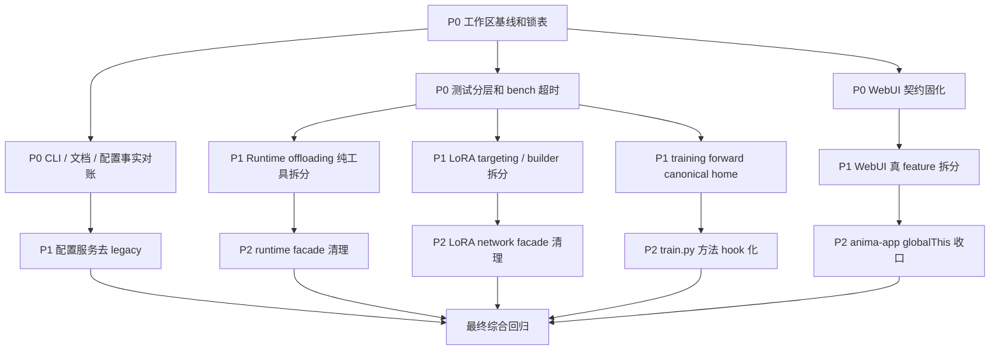

# 项目状态审计与并行整理计划

一句话：当前项目不是完全没人管，而是已经拆过很多轮，但边界还没固化，继续做功能会越来越容易互相踩。

日期：2026-07-04
范围：`anima_lora` 主仓，只做工程状态审计和整理计划，不包含真实训练、模型下载、队列清理或用户数据清理。

---

## ✅ 0. 使用方式

一句话：这份文档是后续多代理并行整理的施工图，先看锁，再领任务。

- 先读 **第 3 节隔离约束**，确认哪些文件不能并行写。
- 再读 **第 5 节任务卡片**，每个 worker 只能领一个任务卡。
- 最后按 **第 7 节验证命令** 收口，不允许靠感觉合并。
- 本文档只新增计划，不代表已经完成代码整理。

---

## 🔍 1. 当前状态快照

一句话：仓库体量已经不小，当前工作区也很脏，所以第一风险是“改动隔离”。

| 项目 | 当前观察 |
|---|---:|
| 当前分支 | `main...private/main [ahead 19]` |
| 已修改文件 | `83` 个 |
| 未跟踪条目 | `15` 组 |
| Git diff 规模 | `3515 insertions(+), 512 deletions(-)` |
| 仓库文件数 | 约 `1052` 个 |
| Python 总行数 | 约 `202597` 行 |
| Web 静态代码总行数 | 约 `58000` 行 |
| 测试文件数 | `98` 个 |
| 测试总行数 | 约 `37391` 行 |
| `tasks.py` 命令数 | `73` 个 |

### ⚠️ 当前脏区集中点

一句话：这些区域已经有未提交改动，后续整理必须先确认 diff。

- `web/`：约 `47` 个已修改文件，集中在前端模块、配置 catalog、训练历史、预览、队列。
- `tests/`：约 `11` 个已修改文件，包含前端状态、block swap、int8、LoKr 等测试。
- `networks/`：约 `9` 个已修改文件，集中在 LoRA family 和 LoKr。
- `library/`：约 `6` 个已修改文件，集中在 runtime、training、Anima model。
- `scripts/`、`tasks.py`、`configs/`、`docs/` 也有未提交改动。

---

## 📌 2. 审计结论

一句话：最值得先整理的不是“所有大文件”，而是“用户会踩坑、多人会冲突、测试会卡住”的地方。

| 优先级 | 方向 | 核心问题 | 建议动作 |
|---|---|---|---|
| P0 | CLI / 文档 / 配置事实对账 | 文档写的命令和配置不一定真实存在 | 先修文档和守门测试，避免用户按错路跑 |
| P0 | 当前工作区隔离 | 未提交改动覆盖核心路径 | 后续每条线独立 worktree / 独立任务卡 |
| P0 | WebUI 契约固化 | 文件拆了，但还靠 `globalThis`、DOM id、CSS 顺序硬撑 | 先锁共享入口，再逐个抽真 feature |
| P0 | 测试和 bench 调度 | 测试多但缺分层，bench 子进程可能卡死 | 加 timeout、marker、fast smoke 和输出根隔离 |
| P1 | Runtime offloading 拆分 | `offloading.py` 同时管配置、master、profile、异步拷贝 | 先抽纯函数和 dataclass，不碰调度顺序 |
| P1 | LoRA network 拆分 | `network.py` 同时管扫描、构造、router、metrics、load/save | 先抽 targeting / builder，不碰 router 状态 |
| P1 | 训练入口瘦身 | `train.py` 仍混有方法专属准备和训练生命周期 | 一次迁一个方法，保留主流程稳定 |
| P2 | 类型检查收紧 | `pyproject.toml` 关闭大量 Pyright 诊断 | 分目录逐步打开，先从纯工具模块开始 |

---

## 🛡️ 3. 隔离约束

一句话：并行整理可以做，但共享入口必须上锁，用户数据绝对不能碰。

### 3.1 禁止清理或覆盖的目录

一句话：这些目录可能包含用户数据、训练产物或本机状态，不能当垃圾删。

- `.venv/`
- `.worktrees/`
- `models/`
- `output/`
- `logs/`
- `post_image_dataset/`
- `configs/imported/`
- `configs/web-training-history/`
- `configs/web-training-queue/`
- `bench/mfu/assets/`
- `tmp/`

### 3.2 串行锁文件

一句话：这些文件是多人最容易打架的入口，同一轮只能一个 worker 写。

| 锁名 | 文件 / 区域 | 原因 |
|---|---|---|
| `LOCK_TASKS` | `tasks.py`、`scripts/tasks/utilities.py` | 命令注册和测试入口集中 |
| `LOCK_TRAIN_MAIN` | `train.py` | 训练生命周期入口 |
| `LOCK_WEB_BOOT` | `web/static/app.js`、`web/static/js/features/anima-app/index.js`、`imports.js` | 前端模块加载顺序和 cache token 集中 |
| `LOCK_WEB_STATE` | `web/static/js/features/anima-app/chunks/01-scope-state.js` | `globalThis` 状态池 |
| `LOCK_WEB_EVENTS` | `web/static/js/features/anima-app/chunks/36-setup-event-listeners.js` | DOM 事件绑定中心 |
| `LOCK_WEB_DOM` | `web/static/index.html` | DOM id 跨模块契约 |
| `LOCK_WEB_CSS_ROOT` | `web/static/style.css`、`web/static/css/90-responsive.css` | CSS import 顺序和响应式兜底 |
| `LOCK_FRONTEND_TEST` | `tests/test_training_frontend_state.py` | 前端结构字符串守门测试 |
| `LOCK_CONFIG_DOCS` | `docs/guidelines/training.md`、`docs/guidelines/inference.md`、`docs/README.md` | 用户入口文档，冲突率高 |
| `LOCK_RUNTIME_CORE` | `library/runtime/offloading.py` | block swap 调度和显存逻辑集中 |
| `LOCK_LORA_CORE` | `networks/lora_anima/network.py` | LoRA family 核心对象 |

### 3.3 并行写入规则

一句话：每条线只写自己的目录，公共入口最后由整合者串行改。

- 每个 worker 必须声明 `write_scope`。
- 不允许两个 worker 同时写同一锁文件。
- 新增模块优先，旧 facade 暂时保留。
- 搬家型重构优先，行为变更必须单独成任务。
- 不做全仓格式化。
- 不做批量移动。
- 不做 `git reset --hard`、`git checkout -- <path>`、强推或删除用户数据。
- 需要真实 GPU、下载模型、启动长训练时，必须另行确认。

---

## 🔀 4. 依赖图

一句话：先做事实对账和护栏，再做核心拆分，最后清理 facade。



---

## 🧩 5. 并行任务卡片

一句话：下面任务可以分给多个代理并行推进，但必须按写入边界执行。

### TASK-00：工作区基线和施工锁

一句话：先把现状记录清楚，避免后续不知道是谁改了什么。

| 字段 | 内容 |
|---|---|
| `task_id` | `TASK-00` |
| `role` | `reviewer` |
| `objective` | 建立整理前基线、锁表、回滚说明和本轮分工记录 |
| `input_scope` | `git status`、`git diff --stat`、本文档 |
| `output_format` | markdown 基线记录 |
| `acceptance_criteria` | 能说明当前脏文件、锁文件、禁止操作和下一轮分工 |
| `eta` | `0.5d` |
| `write_scope` | `docs/findings/*cleanup*` |
| `sandbox` | `workspace-write` |
| `risk_level` | `Low` |

### TASK-01：CLI / 文档 / 配置事实对账

一句话：先修用户会照着跑错的说明。

| 字段 | 内容 |
|---|---|
| `task_id` | `TASK-01` |
| `role` | `docs_researcher` |
| `objective` | 对账 `tasks.py` 命令、`configs/` 真实文件和用户文档 |
| `input_scope` | `tasks.py`、`scripts/tasks/`、`scripts/experimental_tasks/`、`configs/methods/`、`configs/gui-methods/`、`docs/guidelines/`、`docs/experimental/` |
| `output_format` | 补丁 + 对账表 |
| `acceptance_criteria` | Postfix、FeRA、LoRA 默认口径、缺失提案引用不再误导用户 |
| `eta` | `1d` |
| `write_scope` | 文档优先；如需改命令，只能写 `tasks.py` 和对应 `scripts/tasks/*` |
| `sandbox` | `workspace-write` |
| `risk_level` | `Medium` |

建议先处理：

- Postfix 文档仍写已消失命令。
- FeRA 文档仍指向不存在的 `configs/gui-methods/fera.toml`。
- `download-tagger` 有实现提示但未注册命令。
- LoRA 默认口径和 `configs/methods/lora.toml` 不一致。
- `spd_finetune_lora.md`、`chimera_hydra.md` 等提案引用缺失。

### TASK-02：pytest 分层和 bench 超时

一句话：先让验证体系不容易卡死，后续整理才有护栏。

| 字段 | 内容 |
|---|---|
| `task_id` | `TASK-02` |
| `role` | `worker` |
| `objective` | 建立 fast / focused / slow 测试分层，给 bench 子进程加超时和输出根隔离 |
| `input_scope` | `pyproject.toml`、`tasks.py`、`scripts/tasks/utilities.py`、`bench/training_hot/`、`bench/plain_lora_speed/`、`bench/mfu/`、`tests/test_*_runner.py` |
| `output_format` | 代码补丁 + 测试说明 |
| `acceptance_criteria` | 常用 smoke 能 60s 内跑完；bench dry-run 不写用户产物；子进程有 timeout |
| `eta` | `1d` |
| `write_scope` | 测试入口和 bench runner，不能改业务训练逻辑 |
| `sandbox` | `workspace-write` |
| `risk_level` | `Medium` |

### TASK-03：WebUI DOM 契约和安全绑定

一句话：先把前端最脆的 DOM id 和事件绑定变成显式契约。

| 字段 | 内容 |
|---|---|
| `task_id` | `TASK-03` |
| `role` | `worker` |
| `objective` | 建立 DOM 契约表和安全事件绑定 helper |
| `input_scope` | `web/static/js/shared/dom.js`、`web/static/js/features/anima-app/chunks/36-setup-event-listeners.js`、`web/static/index.html`、`tests/test_training_frontend_state.py` |
| `output_format` | 代码补丁 + DOM 契约清单 |
| `acceptance_criteria` | 缺失非关键节点不直接炸；关键节点有清晰错误；测试覆盖 DOM id 契约 |
| `eta` | `1d` |
| `write_scope` | 独占 `LOCK_WEB_EVENTS` 和 `LOCK_FRONTEND_TEST` |
| `sandbox` | `workspace-write` |
| `risk_level` | `High` |

### TASK-04：WebUI 真 feature 拆分

一句话：把机械 chunk 慢慢变成有边界的 feature。

| 字段 | 内容 |
|---|---|
| `task_id` | `TASK-04` |
| `role` | `worker` |
| `objective` | 从 `anima-app/chunks/25-update-progress.js` 抽出 live training feature |
| `input_scope` | `web/static/js/features/anima-app/chunks/25-update-progress.js`、新增 `web/static/js/features/live-training/` |
| `output_format` | 搬家型补丁 |
| `acceptance_criteria` | 旧调用路径可用；新 feature 有独立入口；不改 DOM id 和 API 路径 |
| `eta` | `1d` |
| `write_scope` | 只写 live-training 新目录和一个旧 chunk |
| `sandbox` | `workspace-write` |
| `risk_level` | `High` |

### TASK-05：CSS 功能收口

一句话：先整理最大 CSS 文件，不改变视觉。

| 字段 | 内容 |
|---|---|
| `task_id` | `TASK-05` |
| `role` | `worker` |
| `objective` | 对历史面板和训练面板 CSS 做分区整理 |
| `input_scope` | `web/static/css/21-history-panels.css`、`web/static/css/33-training-forge.css`、`web/static/css/90-responsive.css` |
| `output_format` | CSS 搬家 / 分段补丁 |
| `acceptance_criteria` | 不改视觉意图；不改 `style.css` import 顺序；`git diff --check` 干净 |
| `eta` | `1d` |
| `write_scope` | 每次只拥有一个 CSS 文件 |
| `sandbox` | `workspace-write` |
| `risk_level` | `Medium` |

### TASK-06：Runtime offloading 纯工具拆分

一句话：先抽纯工具，不碰 block swap 调度顺序。

| 字段 | 内容 |
|---|---|
| `task_id` | `TASK-06` |
| `role` | `worker` |
| `objective` | 从 `library/runtime/offloading.py` 抽出配置 normalize、CPU master、profile helper |
| `input_scope` | `library/runtime/offloading.py`、可新增 `block_swap_config.py`、`block_swap_masters.py`、`block_swap_profiler.py` |
| `output_format` | 搬家型补丁 |
| `acceptance_criteria` | public 行为不变；旧 import 继续可用；相关 block swap 测试通过 |
| `eta` | `1d` |
| `write_scope` | 独占 `LOCK_RUNTIME_CORE` |
| `sandbox` | `workspace-write` |
| `risk_level` | `High` |

### TASK-07：LoRA targeting / builder 拆分

一句话：先把“找模块”和“造模块”抽出去，不动 router runtime。

| 字段 | 内容 |
|---|---|
| `task_id` | `TASK-07` |
| `role` | `worker` |
| `objective` | 从 `networks/lora_anima/network.py` 抽出 candidate collection 和 module builder |
| `input_scope` | `networks/lora_anima/network.py`、`networks/lora_anima/factory.py`、可新增 `targeting.py`、`module_builder.py` |
| `output_format` | 搬家型补丁 |
| `acceptance_criteria` | 不改 metadata 语义；不改 router source；相关 network 测试通过 |
| `eta` | `1d` |
| `write_scope` | 独占 `LOCK_LORA_CORE` |
| `sandbox` | `workspace-write` |
| `risk_level` | `High` |

### TASK-08：Training forward canonical home

一句话：解决训练 forward 逻辑重复，避免以后修一边漏一边。

| 字段 | 内容 |
|---|---|
| `task_id` | `TASK-08` |
| `role` | `worker` |
| `objective` | 统一 `library/training/forward*`、`router_conditioning.py`、`forward_kwargs.py` 的职责边界 |
| `input_scope` | `library/training/forward/`、`library/training/router_conditioning.py`、`library/training/forward_kwargs.py` |
| `output_format` | 搬家型补丁 + import shim |
| `acceptance_criteria` | 选出 canonical home；重复文件只保留兼容转发；训练 bootstrap 测试通过 |
| `eta` | `1d` |
| `write_scope` | 只写 training forward 相关文件，不碰 `train.py` 主流程 |
| `sandbox` | `workspace-write` |
| `risk_level` | `Medium` |

### TASK-09：Config service 去 legacy

一句话：后端配置服务已经在拆，下一步是让 `_legacy` 变薄。

| 字段 | 内容 |
|---|---|
| `task_id` | `TASK-09` |
| `role` | `worker` |
| `objective` | 把 config methods、sample prompts、output runs、raw files 从 `_legacy` 继续迁出 |
| `input_scope` | `web/services/config_service.py`、`web/services/config/_legacy.py`、`web/services/config/`、`tests/test_web_config_service.py` |
| `output_format` | 搬家型补丁 |
| `acceptance_criteria` | facade 兼容；新模块职责清晰；Web config 测试通过 |
| `eta` | `1d` |
| `write_scope` | Web config 后端独占，不和前端 config 表单同轮写 |
| `sandbox` | `workspace-write` |
| `risk_level` | `Medium` |

### TASK-10：类型检查分目录收紧

一句话：类型检查不要一口吃成胖子，先从低耦合模块开始。

| 字段 | 内容 |
|---|---|
| `task_id` | `TASK-10` |
| `role` | `reviewer` |
| `objective` | 制定 Pyright 分目录收紧计划，并先挑纯工具模块试点 |
| `input_scope` | `pyproject.toml`、`library/config/`、`library/runtime/` 纯工具文件、`scripts/config_*.py` |
| `output_format` | 小补丁或单独计划文档 |
| `acceptance_criteria` | 不影响全仓；至少一个低耦合目录诊断更严格 |
| `eta` | `1d` |
| `write_scope` | `pyproject.toml` 和选定试点目录 |
| `sandbox` | `workspace-write` |
| `risk_level` | `Medium` |

---

## 🚦 6. 调度和监督规则

一句话：并行不是乱开工，必须有心跳、超时和汇总。

| 规则 | 要求 |
|---|---|
| 并行宽度 | 每轮 `3~6` 个任务 |
| 深度 | `max_depth=1`，子代理不得再 spawn 子代理 |
| 心跳 | 每 `30s` 回报当前步骤、产物、阻塞点、预计剩余时间 |
| Soft Timeout | 达到 `1.2x eta` 时催办并要求交中间产物 |
| Hard Timeout | 达到 `2.0x eta` 时停止该任务，父代理接管或换新实例 |
| 重试 | 最多 `2` 次 |
| 熔断 | 本轮失败 / 超时比例 `>40%`，暂停继续 spawn，先做根因分析 |
| 合并 | 子任务完成后先汇总，再进入下一轮 |

### 子代理登记表模板

一句话：每个并行任务都要能被追踪和回收。

| agent_id | task_id | start_time | eta | status | last_heartbeat | retry_count | latest_snapshot |
|---|---|---|---|---|---|---:|---|
| `<agent-id>` | `<task-id>` | `<time>` | `<eta>` | `running/done/failed/cancelled` | `<time>` | `0` | `<当前步骤>` |

---

## 🧪 7. 验证命令矩阵

一句话：每个方向都有自己的最小验证，不要默认跑真实训练或全量大测试。

| 方向 | 最小验证 |
|---|---|
| 文档 / CLI 对账 | `timeout 60 .venv/bin/python tasks.py --help` |
| 配置清单 | `timeout 60 .venv/bin/python -m pytest tests/test_config.py` |
| 预处理入口 | `timeout 60 .venv/bin/python -m pytest tests/test_preprocess_paths.py` |
| Web 前端结构 | `timeout 60 .venv/bin/python -m pytest tests/test_training_frontend_state.py` |
| Web config / preflight | `timeout 60 .venv/bin/python -m pytest tests/test_web_config_service.py tests/test_web_preflight_compat_matrix.py` |
| Web queue / history | `timeout 60 .venv/bin/python -m pytest tests/test_training_queue.py tests/test_preview_service.py` |
| Runtime block swap | `timeout 60 .venv/bin/python -m pytest tests/test_block_swapping.py tests/test_int8_linear_runtime.py` |
| LoRA / registry | `timeout 60 .venv/bin/python -m pytest tests/test_network_registry.py tests/test_network_cfg.py tests/test_factory_metadata_flow.py` |
| LoKr | `timeout 60 .venv/bin/python -m pytest tests/test_lokr.py` |
| Training bootstrap | `timeout 60 .venv/bin/python -m pytest tests/test_training_bootstrap.py tests/test_training_compat_matrix.py` |
| Bench runner | `timeout 60 .venv/bin/python -m pytest tests/test_training_hot_runner.py tests/test_plain_lora_speed_runner.py tests/test_signal_probe_runner.py` |
| 文档格式 | `git diff --check -- docs/findings/project_cleanup_parallel_plan_20260704.md` |

---

## 🧱 8. 不可破坏的不变量

一句话：整理时不能为了好看破坏训练和推理的硬边界。

- Text Encoder padding 不能裁剪，padding token 是 attention sink。
- Constant Token Buckets 不能随意改顺序、数量和 token count。
- Lazy model loading 顺序必须保持：text encoder -> cache -> free；VAE -> cache -> free；DiT -> attach network -> training loop。
- `torch.compile` 必须在 adapter apply/load 后执行。
- DiT forward 边界仍是 5D latent：`(B, C, T=1, H, W)`。
- LoRA family 三轴路由配置不能恢复旧 metadata fallback。
- FEI / GlobalRouter 每步路由状态必须在 train 和 inference loop 中保持一致。
- attention layout 和 fused/split projection 只能通过已有 dispatch / fuse 边界处理。
- `tasks.py merge` 只支持可折叠进 DiT Linear 的 adapter。
- Custom nodes 的 `_vendor/` 不能手工分叉，必须先改 live source，再 `vendor-sync`。

---

## 🧭 9. 建议推进顺序

一句话：先修最会误导用户和最会卡住协作的点，再做核心代码拆分。

### Phase 0：基线和护栏

一句话：先把地面画线，后续才不会乱。

1. 确认当前未提交改动归属。
2. 给每条整理线开独立 worktree 或独立分支。
3. 落地本文档的锁表和任务卡。
4. 不改业务代码，先跑文档 diff check。

### Phase 1：P0 并行

一句话：用户可见事实错误、WebUI 契约、测试卡死先处理。

- `TASK-01`：CLI / 文档 / 配置事实对账。
- `TASK-02`：pytest 分层和 bench 超时。
- `TASK-03`：WebUI DOM 契约和安全绑定。

这些任务能并行，但 `TASK-01` 独占 `LOCK_TASKS` 或 `LOCK_CONFIG_DOCS`，`TASK-03` 独占 `LOCK_WEB_EVENTS`。

### Phase 2：P1 并行

一句话：核心代码只做搬家型拆分，先不改行为。

- `TASK-06`：Runtime offloading 纯工具拆分。
- `TASK-07`：LoRA targeting / builder 拆分。
- `TASK-08`：Training forward canonical home。
- `TASK-09`：Config service 去 legacy。

这些任务原则上可以并行，因为写入边界不同。

### Phase 3：P2 清理

一句话：等新边界稳定后，再清理旧 facade 和收紧类型检查。

- 清理已经无调用的兼容 facade。
- 把 `globalThis` 状态逐步收回 ctx / feature state。
- 分目录收紧 Pyright。
- 更新 `docs/README.md` 索引。

---

## ✅ 10. 完成定义

一句话：整理不是“拆了文件就完”，必须有测试、有回滚、有文档。

每个任务完成必须满足：

- 必须项已完成。
- 未越过 `write_scope`。
- 没有改动禁止目录。
- 相关测试通过，或明确写出未跑原因。
- `git diff --check` 对改动路径干净。
- 高风险变更有回滚说明。
- 如果改了用户入口文档，命令和配置必须能对上实时源码。
- 如果改了 WebUI 入口，必须跑前端结构测试。
- 如果改了 custom nodes 相关 live source，必须说明是否需要 `vendor-sync`。

---

## 📦 11. 本轮审计来源

一句话：本计划来自主代理横向扫描和 4 个只读子代理并行审计。

| 来源 | 范围 | 结论摘要 |
|---|---|---|
| 主代理 | Git 状态、行数热点、TODO/兼容词、文档索引、任务入口 | 当前最大风险是脏工作区 + 共享入口 |
| A1 explorer | training / runtime / networks | 拆到一半，核心边界未固化 |
| A2 explorer | WebUI 前后端 | 机械拆分，仍依赖 `globalThis`、DOM id、CSS 顺序 |
| A3 explorer | configs / CLI / docs | 文档和真实命令、配置存在错位 |
| A4 explorer | tests / bench / repo hygiene | 测试多但缺分层，bench 缺超时和输出隔离 |

---

## 📌 12. 结论

一句话：下一步不要一口气大重构，要按锁表把“事实错位、验证护栏、共享契约、核心纯函数拆分”分批并行推进。

最推荐先开三条线：

1. `TASK-01`：修 CLI / 文档 / 配置事实错位。
2. `TASK-02`：补测试分层和 bench 超时。
3. `TASK-03`：固化 WebUI DOM 契约。

这三条线能最快降低用户踩坑和多代理冲突风险，然后再进入 runtime、LoRA、training 核心拆分。

---

## 📍 13. 阶段推进记录

一句话：Phase 1 已落地，进入 Phase 2 前先把验证结果和剩余风险写清楚。

### 13.1 Phase 1 完成状态

一句话：TASK-01、TASK-02、TASK-03 已完成，但当前仍是未提交的脏工作区。

| 任务 | 状态 | 已落地产物 | 当前验证 |
|---|---|---|---|
| `TASK-01` CLI / 文档 / 配置事实对账 | ✅ 已完成 | 用户文档、方法配置说明、`download-tagger` 命令注册等事实对账 | `timeout 60 .venv/bin/python tasks.py --help` 通过；`timeout 60 .venv/bin/python -m pytest -q tests/test_config.py` 30 passed |
| `TASK-02` pytest 分层和 bench 超时 | ✅ 已完成 | `fast/focused/slow` marker；`test-fast/test-focused/test-slow`；bench 子进程 timeout；dry-run 输出根隔离 | `timeout 60 .venv/bin/python tasks.py test-fast --help` 通过；`timeout 60 .venv/bin/python tasks.py test-fast` 41 passed |
| `TASK-03` WebUI DOM 契约和安全绑定 | ✅ 已完成 | DOM helper、安全事件绑定、前端结构守门测试补强 | `timeout 60 .venv/bin/python -m pytest -q tests/test_training_frontend_state.py` 57 passed |

### 13.2 当前基线确认

一句话：工作区还没收口提交，Phase 2 必须继续按锁表小步推进。

| 检查项 | 当前结果 |
|---|---|
| `git status --short --branch` | `main...private/main [ahead 20]`，存在 Phase 1 和其它未提交改动 |
| `git diff --stat` | 当前普通 diff 显示 35 个文件，约 680 insertions / 196 deletions |
| `git check-ignore -v bench/mfu/run_training.py tests/test_mfu_bench.py` | 两个 MFU 文件均被 `.git/info/exclude` 忽略 |

### 13.3 MFU 版本控制风险

一句话：MFU 代码和测试如果要随 TASK-02 发布，必须单独处理本机 ignore 规则。

- `bench/mfu/run_training.py` 被 `.git/info/exclude` 的 `bench/mfu/` 命中。
- `tests/test_mfu_bench.py` 被 `.git/info/exclude` 的显式规则命中。
- 普通 `git status` 和 `git diff --stat` 不会展示这两个文件的改动。
- 若要把 TASK-02 的 MFU timeout / dry-run 隔离一起纳入版本控制，需要执行以下二选一：
  - 删除或调整 `.git/info/exclude` 里的本机忽略规则后正常跟踪。
  - 保留本机忽略规则，但提交时用 `git add -f bench/mfu/run_training.py tests/test_mfu_bench.py` 强制纳入。
- 当前未执行 staging，也未改 `.git/info/exclude`。

### 13.4 Phase 2 启动约束

一句话：Phase 2 只能做搬家型重构，先评估再选最低风险任务落地。

- `TASK-06` 和 `TASK-07` 属于高风险核心锁，先只读评估，不优先落地。
- `TASK-08` 和 `TASK-09` 风险较低，优先从这两条里选一个小补丁。
- 写入时继续遵守锁表，同一锁文件只能一个 worker 拥有。
- 不启动真实训练、不下载模型、不清理用户数据目录。

### 13.5 Phase 2 首轮落地

一句话：首轮选择 `TASK-08`，只做旧 import 路径收口，不改变训练 forward 行为。

| 项目 | 结果 |
|---|---|
| 并行评估 | 已只读评估 `TASK-06` / `TASK-07` / `TASK-08` / `TASK-09` |
| 本轮选择 | `TASK-08` Training forward canonical home |
| 选择原因 | 5 个旧根路径文件与 `library/training/forward/` 同名实现完全一致，改成 shim 风险最低 |
| 改动范围 | `library/training/forward_kwargs.py`、`router_conditioning.py`、`text_conds.py`、`inversion_forward.py`、`vr_forward.py` |
| 行为策略 | `library/training/forward/` 作为 canonical home；旧路径保留兼容 re-export |
| 未选择原因 | `TASK-06` / `TASK-07` 触及 runtime / LoRA 高风险核心；`TASK-09` 会进入 Web config，留到下一轮单独做 |

验证记录：

```bash
timeout 60 .venv/bin/python - <<'PY'
from library.training.forward_kwargs import build_forward_kwargs
from library.training.router_conditioning import apply_router_conditioning
from library.training.text_conds import prepare_text_conds
from library.training.inversion_forward import compute_inversion_func_loss
from library.training.vr_forward import run_vr_reference_forward
from library.training.forward import build_forward_kwargs as canonical_build_forward_kwargs
from library.training.forward import apply_router_conditioning as canonical_apply_router_conditioning
from library.training.forward import prepare_text_conds as canonical_prepare_text_conds
from library.training.forward import compute_inversion_func_loss as canonical_compute_inversion_func_loss
from library.training.forward import run_vr_reference_forward as canonical_run_vr_reference_forward
assert build_forward_kwargs is canonical_build_forward_kwargs
assert apply_router_conditioning is canonical_apply_router_conditioning
assert prepare_text_conds is canonical_prepare_text_conds
assert compute_inversion_func_loss is canonical_compute_inversion_func_loss
assert run_vr_reference_forward is canonical_run_vr_reference_forward
print("forward import shims ok")
PY
```

- `timeout 60 .venv/bin/python -m pytest -q tests/test_ste.py`：5 passed。
- `timeout 60 .venv/bin/python -m pytest -q tests/test_router_compute.py tests/test_global_router.py`：28 passed，存在本机旧 GPU CUDA capability 警告。
- `timeout 60 .venv/bin/python -m pytest -q tests/test_training_bootstrap.py tests/test_training_compat_matrix.py`：14 passed。

### 13.6 Phase 2 二轮落地

一句话：二轮选择 `TASK-09` 的最低风险子步，只让 `raw_files.py` 直接读取静态 metadata。

| 项目 | 结果 |
|---|---|
| 并行评估 | 两个只读 explorer 分别检查 `raw_files.py` metadata 依赖和测试覆盖 |
| 本轮选择 | `TASK-09` Config service 去 legacy 的 `raw_files.py` 子步 |
| 选择原因 | 只涉及 3 个纯静态常量 import，行为风险低，facade 兼容可完整保留 |
| 改动范围 | `web/services/config/raw_files.py`、本文档阶段记录 |
| 行为策略 | `UI_ONLY_CONFIG_FIELDS`、`SPD_NESTED_PATCH_FIELDS`、`RETIRED_TOP_LEVEL_CONFIG_FIELDS` 从 `metadata.py` 直接导入；`config_service` / `_legacy.py` 旧导出继续保留 |
| 越界检查 | 未改 Web 前端入口，未碰训练/runtime/LoRA，未清理用户数据目录，未启动真实训练 |

验证记录：

- `python -m py_compile web/services/config/raw_files.py`：通过。
- `timeout 60 .venv/bin/python -m pytest -q tests/test_web_config_service.py`：114 passed。
- `timeout 60 .venv/bin/python -m pytest -q tests/test_training_frontend_state.py`：57 passed。
- `timeout 60 .venv/bin/python tasks.py test-fast`：41 passed。
- `git diff --check`：通过。

剩余风险：

- `raw_files.py` 仍保留 facade snapshot，因为它还依赖路径、锁、raw file helper 等 legacy 注入。
- MFU 文件仍被 `.git/info/exclude` 忽略；如果要发布 TASK-02 的 MFU 产物，仍需单独 `git add -f` 或调整本机 exclude。
- `TASK-06` / `TASK-07` 仍属高风险核心拆分，下一轮建议继续只读评估后再选最小写入点。

### 13.7 Phase 2 三轮落地

一句话：三轮继续选择 `TASK-09`，只让 `preflight.py` 直接读取纯静态 metadata。

| 项目 | 结果 |
|---|---|
| 并行评估 | 两个只读 explorer 分别检查 `preflight.py` metadata 依赖和测试覆盖 |
| 本轮选择 | `TASK-09` Config service 去 legacy 的 `preflight.py` 子步 |
| 选择原因 | 只涉及纯静态 metadata import，路径和 runtime helper 仍保留 facade 同步，行为风险低 |
| 改动范围 | `web/services/config/preflight.py`、`tests/test_web_config_service.py`、本文档阶段记录 |
| 行为策略 | `DATASET_IMAGE_EXTS`、`OUTPUT_RUN_CONFIG_FILES`、`PREPROCESS_ENV_CHECK_KEY`、`PREPROCESS_ENV_REQUIRED_FILES`、`SUPPORTED_TRAINING_SAMPLE_SAMPLERS`、`LEGACY_TRAINING_SAMPLE_SAMPLERS` 从 `metadata.py` 直接导入；`config_service` / `_legacy.py` 旧导出继续保留 |
| 兼容护栏 | 新增 `_legacy.preflight_training_config` smoke 测试，确认旧模块直连仍能跑基础 preflight |
| 越界检查 | 未改 Web 前端入口，未碰训练/runtime/LoRA，未清理用户数据目录，未启动真实训练 |

验证记录：

- `python -m py_compile web/services/config/preflight.py`：通过。
- `timeout 60 .venv/bin/python -m pytest -q tests/test_web_config_service.py::test_preflight_remains_available_from_legacy_module`：1 passed。
- `timeout 60 .venv/bin/python -m pytest -q tests/test_web_preflight_compat_matrix.py`：5 passed。
- `timeout 60 .venv/bin/python -m pytest -q tests/test_web_config_service.py`：115 passed。
- `timeout 60 .venv/bin/python tasks.py test-fast`：41 passed。

剩余风险：

- `preflight.py` 仍保留 facade snapshot，因为 `ROOT`、`CONFIGS_DIR`、`resolve_output_root` 等动态路径和 monkeypatch 兼容仍依赖它。
- `_legacy.py` 仍有旧 preflight 实现；本轮只补兼容 smoke，不把旧实现替换为 shim。
- MFU 文件仍被 `.git/info/exclude` 忽略；如果要发布 TASK-02 的 MFU 产物，仍需单独处理。

### 13.8 Phase 2 四轮落地

一句话：四轮继续选择 `TASK-09`，只让 `datasets.py` 直接读取纯静态 metadata。

| 项目 | 结果 |
|---|---|
| 并行评估 | 两个只读 explorer 分别检查 `datasets.py` metadata 依赖和测试覆盖 |
| 本轮选择 | `TASK-09` Config service 去 legacy 的 `datasets.py` 子步 |
| 选择原因 | 只涉及数据集静态常量和 caption 模式常量 import，路径和 raw file helper 仍保留 facade 同步 |
| 改动范围 | `web/services/config/datasets.py`、`web/services/config/metadata.py`、`web/services/config/_legacy.py`、`tests/test_web_config_service.py`、本文档阶段记录 |
| 行为策略 | `datasets.py` 直接从 `metadata.py` 导入数据集 preset、图片预览、caption、nl/tag mix、trigger clone、preprocess attrs 等纯静态常量 |
| 兼容护栏 | `DEFAULT_RESIZED_IMAGE_DIR`、`DEFAULT_LORA_CACHE_DIR` 搬到 `metadata.py`，`_legacy.py` 改为同源导入；metadata facade 测试补充默认目录和 caption 模式常量 |
| 越界检查 | 未改 Web 前端入口，未碰训练/runtime/LoRA，未清理用户数据目录，未启动真实训练 |

`datasets.py` 本轮直连的 metadata：

- `CAPTION_SOURCE_AUTO`、`CAPTION_SOURCE_CAPTIONS_JSON`、`CAPTION_SOURCE_JSON`、`CAPTION_SOURCE_TXT`
- `CAPTION_SOURCE_MODE_LABELS`
- `DATASET_CAPTION_MAX_CHARS`、`DATASET_IMAGE_EXTS`、`DATASET_PREVIEW_LIMIT`、`DATASET_SETTING_KEYS`
- `DEFAULT_LORA_CACHE_DIR`、`DEFAULT_RESIZED_IMAGE_DIR`、`DEFAULT_NL_TAG_MIX_TAG_RATIO`
- `HIDDEN_DATASET_PRESET_FILES`、`SYSTEM_DATASET_PRESET_FILES`
- `NL_TAG_MIX_ATTR_KEY`、`NL_TAG_MIX_CLASSIFICATION_METHOD`
- `PREPROCESS_DATASET_SETTING_ORDER`、`RUNTIME_PREPROCESS_ATTR_KEY`、`TRIGGER_CLONE_ATTR_KEY`

验证记录：

- `python -m py_compile web/services/config/datasets.py web/services/config/metadata.py web/services/config/_legacy.py`：通过。
- `python -m py_compile web/services/config/datasets.py`：通过。
- `timeout 60 .venv/bin/python -m pytest -q tests/test_web_config_service.py::test_config_metadata_exports_remain_available_from_legacy_facade`：1 passed。
- `timeout 60 .venv/bin/python -m pytest -q tests/test_web_config_service.py`：115 passed。
- `timeout 60 .venv/bin/python -m pytest -q tests/test_training_frontend_state.py`：57 passed。
- `timeout 60 .venv/bin/python tasks.py test-fast`：41 passed。

剩余风险：

- `datasets.py` 仍保留 facade snapshot，因为 `ROOT`、`CONFIGS_DIR`、`DATASET_PRESETS_DIR`、`save_raw_file`、`get_config_file_meta` 等动态路径和 helper 仍依赖 monkeypatch 兼容。
- `_legacy.py` 仍有旧 datasets 实现；本轮只收口静态 metadata，不把旧实现替换为 shim。
- MFU 文件若仍被本机 ignore 规则影响，发布 TASK-02 产物时仍需单独处理。

### 13.9 Phase 2 五轮落地

一句话：五轮继续选择 `TASK-09`，只让 `_legacy.py` 的低风险 datasets 入口转发到 `datasets.py`。

| 项目 | 结果 |
|---|---|
| 并行评估 | 两个只读 explorer 分别检查 `_legacy.py` datasets shim 范围和测试覆盖 |
| 本轮选择 | `_legacy.py` 中 dataset preset / preview / caption / nl-tag / trigger clone 低风险入口 |
| 选择原因 | `datasets.py` 已是 config_service facade 的 canonical 实现，旧公开入口继续保留名字但转发到新模块 |
| 改动范围 | `web/services/config/_legacy.py`、`tests/test_web_config_service.py`、本文档阶段记录 |
| 行为策略 | 函数内 lazy import `web.services.config.datasets`，调用前同步 `_legacy.py` 的路径和 helper 全局到 `config_service`，避免顶层循环 import |
| 越界检查 | 未改 Web 前端入口，未碰训练/runtime/LoRA，未清理用户数据目录，未启动真实训练 |

已变成 shim 的 `_legacy.py` datasets 入口：

- 公开 dataset API：`list_dataset_presets`、`diagnose_dataset_presets`、`load_dataset_preset`、`save_dataset_preset`、`save_dataset_preset_as`、`import_dataset_preset`、`delete_dataset_preset`、`apply_dataset_preset_to_training_config`、`list_dataset_preset_images`、`resolve_dataset_preview_image`、`load_dataset_editor`、`save_dataset_editor`
- 低风险工具入口：`_normalize_nl_tag_mix`、`_normalize_trigger_clone`、`_normalize_path_pattern`、`_build_dataset_config_doc`、`_nl_tag_mix_caption_source`、`_nl_tag_mix_image_files`、`_classify_nl_tag_caption_text`

暂时保留旧实现的函数：

- 路径和配置根相关：`_dataset_config_path_from_cfg`、`_is_allowed_dataset_config_path`、`_dataset_config_rel_path`、`_single_dataset_config_from_cfg`
- rows / summary / group 私有链路：`_dataset_rows_for_estimate`、`_dataset_rows_from_config`、`_normalize_dataset_rows`、`_normalize_dataset_defaults`、`_dataset_preset_summary`、`_dataset_preset_groups_for_ui`、`_dataset_summary_from_rows`
- 仍被旧 preflight / estimate 使用的 caption 统计和路径 helper：`_dataset_caption_meta`、`_caption_detection_counts_text`、`_nl_tag_mix_caption_counts`、`_nl_tag_mix_available_count`

验证记录：

- `python -m py_compile web/services/config/_legacy.py web/services/config/datasets.py`：通过。
- `.venv/bin/python` 直接 import `_legacy` 并调用 `_normalize_nl_tag_mix` lazy shim：通过。
- `timeout 60 .venv/bin/python -m pytest -q tests/test_web_config_service.py::test_dataset_preset_remains_available_from_legacy_module`：1 passed。
- `timeout 60 .venv/bin/python -m pytest -q tests/test_web_config_service.py`：116 passed。
- `timeout 60 .venv/bin/python -m pytest -q tests/test_training_frontend_state.py`：57 passed。
- `timeout 60 .venv/bin/python tasks.py test-fast`：41 passed。

剩余风险：

- `_legacy.py` 仍有一批 datasets 私有旧实现，用于旧 preflight / estimate 路径；后续应继续按调用链拆，不要一口气删除。
- `datasets.py` 顶层仍通过 `config_service` 做 facade 同步；直接顶层 import `datasets.py` 的循环风险属于既有结构问题，本轮用 lazy shim 避开。
- MFU 文件若仍被本机 ignore 规则影响，发布 TASK-02 产物时仍需单独处理。

### 13.10 Phase 2 六轮落地

一句话：六轮继续选择 `TASK-09`，只把 `_legacy.py` 的 dataset summary / groups helper 纳入 lazy shim。

| 项目 | 结果 |
|---|---|
| 并行评估 | 两个只读 explorer 分别检查 summary/groups shim 范围和测试覆盖 |
| 本轮选择 | `_legacy.py` 中 dataset summary / groups 私有 helper |
| 选择原因 | `datasets.py` 版本已覆盖正则数据集统计、system/hidden preset 和 dataset group meta，旧 helper 可低风险转发 |
| 改动范围 | `web/services/config/_legacy.py`、`tests/test_web_config_service.py`、本文档阶段记录 |
| 行为策略 | 继续复用第五轮的函数内 lazy import shim，只把 summary/groups helper 加入 `_DATASET_SHIM_NAMES` |
| 越界检查 | 未改 Web 前端入口，未碰训练/runtime/LoRA，未清理用户数据目录，未启动真实训练 |

本轮新增 shim：

- `_dataset_preset_summary`
- `_dataset_preset_groups_for_ui`
- `_is_dataset_group_for_ui`
- `_dataset_summary_from_rows`

测试护栏：

- 扩展 `_legacy` direct-call dataset preset 测试，断言 group 文件 summary 里的 `repeat_total`、`train_dataset_count`、`reg_dataset_count`。
- 扩展 system/hidden dataset preset 测试，断言 hidden preset 不进入 list、可见 system preset 在 list 中 `readonly=True` / `system_preset=True`，并验证 diagnose 的 `hidden_count`。

验证记录：

- `python -m py_compile web/services/config/_legacy.py web/services/config/datasets.py tests/test_web_config_service.py`：通过。
- `timeout 60 .venv/bin/python -m pytest -q tests/test_web_config_service.py::test_dataset_preset_remains_available_from_legacy_module tests/test_web_config_service.py::test_system_dataset_preset_is_readonly_but_can_be_saved_as`：2 passed。

剩余风险：

- 路径、rows estimate、caption meta / counts 等更深私有链路仍暂缓，避免影响旧 preflight / estimate 路径。
- `_normalize_dataset_defaults` 暂不 shim，因为旧 helper 链路内仍有调用且新旧实现语义不完全一致。
- MFU 文件若仍被本机 ignore 规则影响，发布 TASK-02 产物时仍需单独处理。

### 13.11 Phase 2 七轮落地

一句话：七轮继续选择 `TASK-09`，只把 `_legacy.py` 里已经能由 `raw_files.py` 承接的 raw TOML 读写和补丁 helper 收成 lazy shim。

| 项目 | 结果 |
|---|---|
| 并行评估 | 两个只读 explorer 分别检查 `_legacy.py` raw_files shim 范围和兼容测试缺口 |
| 本轮选择 | `_legacy.py` 中 raw TOML 读写、预览/保存补丁、兼容归一化 helper |
| 选择原因 | `config_service` 已直接使用 `web.services.config.raw_files` 作为 canonical 实现，旧导出名只需要保留兼容转发 |
| 改动范围 | `web/services/config/_legacy.py`、`tests/test_web_config_service.py`、本文档阶段记录 |
| 行为策略 | 函数内 lazy import `web.services.config.raw_files`，调用前把 `_legacy.py` 的路径和 helper 同步回 facade，再恢复 `_legacy` shim，避免循环 import 和导出被 facade 覆盖 |
| 越界检查 | 未改 Web 前端入口，未碰 datasets/preflight/training_service/runtime/LoRA/train.py，未清理用户数据目录，未启动真实训练 |

本轮已转成 shim 的 `_legacy.py` raw_files 入口：

- `load_raw_file`
- `save_raw_file`
- `delete_raw_file`
- `patch_raw_file_values`
- `preview_raw_file_patch`
- `_prepare_raw_file_patch`
- `_restore_dataset_config_after_failed_train_patch`
- `_patch_toml_top_level`
- `_is_spd_patch_target`
- `_remove_retired_top_level_fields`
- `_normalize_patch_value`
- `_normalize_saved_raw_config_content`
- `_normalize_saved_raw_config_content_with_changed_keys`
- `_is_blank_output_name`

本轮刻意暂缓的函数：

- `get_config_file_meta`
- `list_config_file_groups`
- `move_config_file_to_group`

暂缓原因：

- 这 3 个函数的 canonical ownership 还在 config group / facade 这边，不在 `raw_files.py` 内部。
- `raw_files.py` 当前只是消费这些 helper 的 facade snapshot，并不自己管理 group/file meta。
- 现在强行 shim 它们，容易把 config group 归属和 monkeypatch 兼容一起搅乱，风险高于收益。

测试护栏：

- 新增 `_legacy` 直连 raw_files 兼容测试，覆盖：
  - `save_raw_file`
  - `load_raw_file`
  - `_prepare_raw_file_patch`
  - `patch_raw_file_values`
  - `preview_raw_file_patch`
  - `delete_raw_file`
  - `_patch_toml_top_level`
  - `_remove_retired_top_level_fields`
- 断言保留旧行为：
  - `CAME` 双 beta 保存后仍会补成三 beta 兼容写法
  - `precision_preference` 这类 UI-only 字段不会写回 TOML
  - `use_hydra` 这类 retired 字段补丁后会被移除
  - SPD 补丁字段仍会写入 nested table，而不是误写顶层字段

验证记录：

- `python -m py_compile web/services/config/_legacy.py web/services/config/raw_files.py`：通过。
- `timeout 60 .venv/bin/python -m pytest -q tests/test_web_config_service.py`：117 passed。
- `timeout 60 .venv/bin/python -m pytest -q tests/test_training_frontend_state.py`：57 passed。
- `timeout 60 .venv/bin/python tasks.py test-fast`：41 passed。
- `git diff --check`：通过。

剩余风险：

- `_legacy.py` 里的 config file/group meta 旧实现仍在，后续若继续拆，应单独开一轮，只处理 ownership 更清晰的 group/meta 链路。
- `raw_files.py` 仍依赖 facade snapshot 注入路径和 group helper；这属于现阶段兼容结构，不在本轮继续硬拆。
- `raw_files.py` 若绕过 `config_service` 被单独先导入，仍可能遇到 facade 循环导入；本轮按写入边界不改 `config_service.py`，后续可单独开小任务处理。
- MFU 文件若仍被本机 ignore 规则影响，发布 TASK-02 产物时仍需单独处理。

### 13.12 Phase 2 八轮落地

一句话：八轮继续收口 `TASK-09` raw_files，只补强 `raw_files.py` 的 lazy facade 独立导入能力和 `_legacy` shim 护栏。

| 项目 | 结果 |
|---|---|
| 本轮选择 | `raw_files.py` 直接导入收口 + `_legacy.py` raw_files shim 显式测试 |
| 选择原因 | 七轮已把 `_legacy.py` raw TOML / patch 入口变成 shim，本轮发现 canonical `raw_files.py` 仍有隐式 facade 依赖，可用低风险 lazy import 收紧 |
| 改动范围 | `web/services/config/raw_files.py`、`web/services/config/_legacy.py`、`tests/test_web_config_service.py`、本文档阶段记录 |
| 行为策略 | `raw_files.py` 不再顶层导入 `config_service` 和 metadata 常量，改为调用时 lazy 同步 facade / lazy 读取 metadata；`_legacy` 旧导出继续保留 lazy shim |
| 越界检查 | 未改 Web 前端入口，未碰 preflight/training_service/runtime/LoRA/train.py，未清理用户数据目录，未启动真实训练 |

本轮补强点：

- `raw_files.py` 顶层去掉 `config_service` facade import，避免先导入 `raw_files.py` 时反向拉起 `config_service.py` 并触发循环导入。
- `raw_files.py` 的 TOML / TOMLKit 和 metadata 依赖改成函数内 lazy import，不改变错误文案和 TOML patch 语义。
- `_safe_resolve`、`_normalize_config_rel_path`、`_load_user_locks`、`_save_user_locks`、`_lock_reason_message` 这类动态 helper 只从 `_legacy` 原始 helper 读入 `raw_files.py`，不再写回 `_legacy`，避免 facade wrapper 递归。
- `_legacy.py` 的 raw_files 调用桥把 helper 分成 legacy-only 和 facade helper：路径/锁 helper 只从 `_legacy` 注入 `raw_files.py`，`get_config_file_meta` / `list_config_file_groups` / `move_config_file_to_group` 继续由 facade 承接。
- `_legacy.py` 增加 `_restore_raw_files_shims()`，并在 dataset shim 调用后恢复 raw_files shim，避免其它 config facade 同步把 `_legacy` 旧导出污染成 raw_files wrapper。
- `tests/test_web_config_service.py::test_raw_file_helpers_remain_available_from_legacy_module` 增加 shim 断言：
  - 14 个 `_legacy.py` raw_files 入口必须保留 `Compatibility shim forwarding to web.services.config.raw_files.*` 文档。
  - 目标函数必须仍存在于 `web.services.config.raw_files`。
  - 调用一次旧 `save_raw_file` 后，`_legacy.py` 同名导出仍必须是 `_RAW_FILES_SHIMS` 里的 shim，不能被 facade 同步覆盖。
  - `_legacy._safe_resolve` 不能等于 `config_service._safe_resolve`，防止 facade wrapper 递归。
- 新增 `tests/test_web_config_service.py::test_raw_files_module_imports_without_facade_cycle`，防止 `raw_files.py` 顶层重新拉起 `config_service`。

本轮继续暂缓：

- `get_config_file_meta`
- `list_config_file_groups`
- `move_config_file_to_group`
- 其它 config 子模块的直接导入循环问题

暂缓原因：

- 前 3 个函数仍属于 config file/group ownership，不属于 `raw_files.py` canonical 范围。
- 其它 config 子模块如 `preflight.py`、`datasets.py`、`sample_prompts.py`、`output_runs.py`、`merge.py`、`estimation.py`、`file_groups.py` 也存在同类 direct import 循环；统一处理会触及 `config_service.py` 共享 facade，超出本轮 raw_files 小步边界。

已验证：

- `python -c "import web.services.config.raw_files"`：通过。
- `python -c "import sys; import web.services.config.raw_files; assert 'web.services.config_service' not in sys.modules"`：通过。
- `.venv/bin/python` 直接探针覆盖 `raw_files` 直连、`config_service` facade、`_legacy` shim 三条 raw file 调用路径：通过。
- `python -m py_compile web/services/config/raw_files.py web/services/config/_legacy.py`：通过。
- `timeout 60 .venv/bin/python -m pytest -q tests/test_web_config_service.py::test_raw_file_helpers_remain_available_from_legacy_module`：1 passed。
- `timeout 60 .venv/bin/python -m pytest -q tests/test_web_config_service.py`：118 passed。
- `timeout 60 .venv/bin/python -m pytest -q tests/test_training_frontend_state.py`：57 passed。
- `timeout 60 .venv/bin/python tasks.py test-fast`：41 passed。
- `git diff --check`：通过。

剩余风险：

- 其它 config 子模块 direct import 循环是既有 facade 风险，下一轮若继续收口可改做 `preflight.py` 或 config facade 统一 lazy 化。
- MFU 文件若仍被本机 ignore 规则影响，发布 TASK-02 产物时仍需单独处理。

### 13.13 Phase 2 九轮只读评估

一句话：九轮只做 direct import / facade 循环风险评估，不改业务代码。

| 项目 | 结果 |
|---|---|
| 本轮选择 | 只读评估 `web/services/config/*.py` 直接导入风险 |
| 当前基线 | `git status --short --branch` 显示仍只有 Phase 2 相关 4 个受控修改文件，另有 `.worktrees/`、`tmp/` 未跟踪禁碰目录 |
| 重点模块 | `raw_files.py`、`preflight.py`、`datasets.py`、`file_groups.py`、`merge.py`、`sample_prompts.py`、`paths.py`、`metadata.py` |
| `methods.py` 结论 | `web/services/config/methods.py` 不存在；方法/变体相关实现当前在 `merge.py` |
| 越界检查 | 未改 Web 前端，未碰 training_service/runtime/LoRA/train.py，未清理用户数据目录，未启动真实训练 |

`.venv/bin/python` direct import 风险矩阵：

| 模块 | 直接导入 | 是否拉起 `config_service` | 是否拉起 `_legacy` | 结论 |
|---|---|---:|---:|---|
| `raw_files` | ✅ 通过 | 否 | 否 | 八轮已收口，当前最佳参考模板 |
| `paths` | ✅ 通过 | 否 | 否 | 纯 helper，已独立 |
| `metadata` | ✅ 通过 | 否 | 否 | 不触发 facade；但系统 Python 会因依赖链缺 `torch` 失败 |
| `preflight` | ❌ 失败 | 失败后不残留 | 是 | 顶层 import facade 后，`config_service.py` 反向导入 `preflight`，出现 partially initialized |
| `datasets` | ❌ 失败 | 失败后不残留 | 是 | 同类循环，且文件大、依赖 raw/file group/preflight 较多 |
| `file_groups` | ❌ 失败 | 失败后不残留 | 是 | 同类循环，但它是 config group / lock ownership 核心 |
| `merge` | ❌ 失败 | 失败后不残留 | 是 | 同类循环；用户说的 `methods.py` 实际对应这里 |
| `sample_prompts` | ❌ 失败 | 失败后不残留 | 是 | 同类循环；文件小、依赖少，适合下一轮 |
| `output_runs` | ❌ 失败 | 失败后不残留 | 是 | 同类循环；本轮非重点，仅记录 |
| `estimation` | ❌ 失败 | 失败后不残留 | 是 | 同类循环；本轮非重点，仅记录 |

系统 `python` direct import 额外观察：

- `raw_files`、`paths`：✅ 通过，且不拉起 `config_service` / `_legacy`。
- `metadata`、`preflight`：❌ 先卡在 `torch` 依赖链。
- `datasets`、`file_groups`、`merge`、`sample_prompts`、`output_runs`、`estimation`：❌ 先卡在 `toml` 依赖。
- 这说明系统 Python 结果更多反映本机依赖缺失；`.venv/bin/python` 结果更适合判断 facade 循环。

循环根因：

- `preflight.py`、`datasets.py`、`file_groups.py`、`merge.py`、`sample_prompts.py`、`output_runs.py`、`estimation.py` 都有同一模式：
  - 顶层 `from web.services import config_service as _facade`
  - 顶层遍历 `_facade.__dict__` 并 `globals().setdefault(...)`
  - `_sync_from_facade()` 会把 `_SYNC_NAMES` 回写到 `_legacy`
  - 文件末尾把 `__all__` 导出包装成 `_exported`
- 直接导入这些子模块时，子模块先拉 `config_service.py`；`config_service.py` 又导入同一个子模块，于是报 partially initialized。
- `raw_files.py` 八轮已经改成可参考形态：顶层不拉 facade，调用时 lazy sync，路径/锁 helper 从 `_legacy` 原始 helper 单向读入，避免 facade wrapper 递归。

下一轮最小实现推荐：

| 优先级 | 候选 | 原因 | 风险 |
|---|---|---|---|
| 1 | `sample_prompts.py` | 只有约 144 行，4 个导出；无 metadata 重依赖；主要读写 `configs/sample-prompts/*.txt`，只需 `ROOT`、`DEFAULT_SAMPLE_PROMPTS_FILE`、`_normalize_config_rel_path`、`_safe_resolve` | Low-Medium |
| 2 | `merge.py` | 对应“methods/variants”能力，约 217 行；适合处理用户提到的 methods 方向 | Medium，依赖 `toml`、`HIDDEN_CONFIG_FILES`、`DEFAULT_MAX_TRAIN_STEPS`、路径和 env helper |
| 3 | `preflight.py` | 用户可见价值高 | Medium-High，约 926 行，依赖训练兼容矩阵、metadata、路径和 runtime helper |
| 4 | `datasets.py` | 已有部分 shim 基础 | High，约 1640 行，依赖多、和 raw/file group/preflight 耦合深 |
| 5 | `file_groups.py` | 解决 group/meta ownership 核心问题 | High，属于 config group / lock 权威实现，不适合在 direct import 小步里顺手动 |

建议的 `sample_prompts.py` 最小方案：

- 移除顶层 `from web.services import config_service as _facade` 和 facade 全量 snapshot。
- 补显式标准库 import：`Path`、`Any` 如需要。
- 把 `_sync_from_facade()` 改为函数内 lazy import `config_service`。
- `_safe_resolve`、`_normalize_config_rel_path` 优先从 `_legacy` 原始 helper 单向读入，不写回 `_legacy`。
- 不改 `load_sample_prompts_file` / `save_sample_prompts_file` 返回结构、错误文案和路径限制。
- 增加 smoke test：`python -c "import web.services.config.sample_prompts"` 且不拉起 `config_service`。
- 验证优先：`python -m py_compile web/services/config/sample_prompts.py web/services/config/_legacy.py`、`timeout 60 .venv/bin/python -m pytest -q tests/test_web_config_service.py -k "sample_prompts or raw_files_module_imports"`，最后再跑完整 Web config。

本轮验证：

- `git diff --check -- docs/findings/project_cleanup_parallel_plan_20260704.md`：通过。

### 13.14 Phase 2 十轮落地

一句话：十轮按九轮建议收口 `sample_prompts.py` direct import 循环，只做最小 lazy facade 解耦。

| 项目 | 结果 |
|---|---|
| 本轮选择 | `sample_prompts.py` 直接导入收口 |
| 选择原因 | 文件小、导出少、无 metadata 重依赖，风险低于 `preflight` / `datasets` / `file_groups` |
| 改动范围 | `web/services/config/sample_prompts.py`、`tests/test_web_config_service.py`、本文档阶段记录 |
| 行为策略 | 顶层不再导入 `config_service`，调用导出函数时再 lazy 同步 facade；路径 helper 从 `_legacy` 原始 helper 单向读入 |
| 越界检查 | 未改 Web 前端，未碰 preflight/datasets/file_groups/merge/training_service/runtime/LoRA/train.py，未清理用户数据目录，未启动真实训练 |

本轮补强点：

- `sample_prompts.py` 移除顶层 `from web.services import config_service as _facade`。
- 移除顶层遍历 `_facade.__dict__` 写入 `globals()` 的 snapshot。
- 新增显式标准库依赖：`Path`、`Any`。
- `_sync_from_facade()` 改为函数内 lazy import `config_service`。
- `ROOT`、`DEFAULT_SAMPLE_PROMPTS_FILE` 等状态仍从 facade 同步，保持 monkeypatch 兼容。
- `_safe_resolve`、`_normalize_config_rel_path` 优先从 `_legacy` 原始 helper 单向读入，不写回 `_legacy`，避免 facade wrapper 递归。
- 新增 `tests/test_web_config_service.py::test_sample_prompts_module_imports_without_facade_cycle`，防止顶层重新拉起 `config_service`。
- 扩展 sample prompts roundtrip 测试，补 `_legacy.py` 直调读写断言。

保持不变：

- `load_sample_prompts_file` / `save_sample_prompts_file` 的返回结构。
- 提示词路径必须在 `configs/` 下、必须是 `.txt`、不能包含 `..` 的限制。
- `train_config_file` 分叉到 `configs/sample-prompts/<rel>.txt` 的策略。
- 注释、空行和原始 spacing 的保留行为。
- `config_service` facade 继续导出 `load_sample_prompts_file`、`save_sample_prompts_file`、`_normalize_prompt_file_path`、`_sample_prompts_path_for_config`。
- `_legacy.py` 旧导出继续保留。

本轮暂缓：

- 不处理 `preflight.py`、`datasets.py`、`file_groups.py`、`merge.py` 的 direct import 循环。
- 不把 sample prompts 旧实现改成 `_legacy` shim；本轮只解 canonical `sample_prompts.py` 顶层循环。

已验证：

- `python -c "import web.services.config.sample_prompts"`：通过。
- `python -c "import sys; import web.services.config.sample_prompts; assert 'web.services.config_service' not in sys.modules"`：通过。
- `python -m py_compile web/services/config/sample_prompts.py web/services/config/_legacy.py`：通过。
- `timeout 60 .venv/bin/python -m pytest -q tests/test_web_config_service.py::test_sample_prompts_module_imports_without_facade_cycle tests/test_web_config_service.py::test_sample_prompts_roundtrip_preserves_comments_blank_lines_and_spacing tests/test_web_config_service.py::test_sample_prompts_save_can_fork_to_training_config_specific_file tests/test_web_config_service.py::test_sample_prompts_save_rejects_training_config_outside_configs`：4 passed。
- `timeout 60 .venv/bin/python -m pytest -q tests/test_web_config_service.py`：119 passed。
- `timeout 60 .venv/bin/python -m pytest -q tests/test_training_frontend_state.py`：57 passed。
- `timeout 60 .venv/bin/python tasks.py test-fast`：41 passed。
- `git diff --check`：通过。

剩余风险：

- 其它 config 子模块 direct import 循环仍是既有风险，下一轮建议继续从 `merge.py` 或 `preflight.py` 里选一个小边界。
- MFU 文件若仍被本机 ignore 规则影响，发布 TASK-02 产物时仍需单独处理。

### 13.15 Phase 2 十一轮落地

一句话：十一轮回到 `TASK-09` raw_files，只补直接导入后的私有 helper 和 `_legacy` shim 路径安全护栏。

| 项目 | 结果 |
|---|---|
| 本轮选择 | `raw_files.py` direct import 私有 helper 补强 + `_legacy.py` raw_files 路径安全测试 |
| 选择原因 | 八轮已让 `raw_files.py` 顶层不拉 facade，但直接导入后单独调用 `_is_spd_patch_target` 仍缺少 `_normalize_config_rel_path` fallback，可用纯 `paths.py` 低风险补齐 |
| 改动范围 | `web/services/config/raw_files.py`、`tests/test_web_config_service.py`、本文档阶段记录 |
| 行为策略 | `raw_files.py` 顶层只导入纯路径 helper 作为默认归一化；经过 facade / `_legacy` 调用时仍由 lazy sync 注入 monkeypatch 后的 helper |
| 越界检查 | 未改 Web 前端，未碰 preflight/datasets/file_groups/merge/training_service/runtime/LoRA/train.py，未清理用户数据目录，未启动真实训练 |

本轮补强点：

- `raw_files.py` 通过 `web.services.config.paths.normalize_config_rel_path` 提供默认 `_normalize_config_rel_path`，让直接导入后的 `_is_spd_patch_target` 可以独立判断路径。
- `test_raw_files_module_imports_without_facade_cycle` 扩展为：
  - 直接导入 `web.services.config.raw_files` 不拉起 `web.services.config_service`。
  - 直接导入后也不拉起 `web.services.config._legacy`。
  - `_is_spd_patch_target` 的路径命中、内容启发式命中、普通 LoRA 路径不命中都能在无 facade 状态下运行。
- `test_raw_file_helpers_remain_available_from_legacy_module` 扩展路径安全断言：
  - `load_raw_file("../outside.toml")` 仍返回空字符串。
  - `save_raw_file("../outside.toml", ...)` 仍返回 `路径不合法`。
  - `_prepare_raw_file_patch("../outside.toml", ...)` 仍返回 `路径不合法` 且不产生目标路径 / 内容 / changed keys。
  - `delete_raw_file("../outside.toml")` 仍拒绝路径。
  - raw_files shim 在 save / patch / preview / delete / load 后仍保留在 `_legacy.py`，不会被 facade 同步覆盖。

本轮 shim 列表未新增，继续保持 14 个 raw_files 兼容入口：

- `load_raw_file`
- `save_raw_file`
- `delete_raw_file`
- `patch_raw_file_values`
- `preview_raw_file_patch`
- `_prepare_raw_file_patch`
- `_restore_dataset_config_after_failed_train_patch`
- `_patch_toml_top_level`
- `_is_spd_patch_target`
- `_remove_retired_top_level_fields`
- `_normalize_patch_value`
- `_normalize_saved_raw_config_content`
- `_normalize_saved_raw_config_content_with_changed_keys`
- `_is_blank_output_name`

本轮继续暂缓：

- `get_config_file_meta`
- `list_config_file_groups`
- `move_config_file_to_group`

暂缓原因：

- 这 3 个函数的 canonical ownership 仍在 `file_groups.py` / config facade，不属于 raw TOML 读写和 patch 语义。
- 它们深度依赖 group 推断、锁状态、用户分组、`WEB_FILE_GROUPS_FILE` / `WEB_USER_LOCKS_FILE` 和 monkeypatch 后的动态路径。
- 现在强行迁到 `raw_files.py` 会把 file group ownership 和 raw TOML ownership 混在一起，风险升高。

已验证：

- `python -m py_compile web/services/config/_legacy.py web/services/config/raw_files.py`：通过。
- `timeout 60 .venv/bin/python -m pytest -q tests/test_web_config_service.py`：119 passed。
- `timeout 60 .venv/bin/python -m pytest -q tests/test_training_frontend_state.py`：57 passed。
- `timeout 60 .venv/bin/python tasks.py test-fast`：41 passed。
- `git diff --check`：通过。

剩余风险：

- `file_groups.py`、`preflight.py`、`datasets.py`、`merge.py` 等模块的 direct import 循环仍是既有 facade 风险，不在本轮 raw_files 小步边界内。
- `_legacy.py` 文件里仍保留旧 raw_files 函数体，但模块底部同名全局已被 shim 覆盖；后续维护时不要误改旧函数体当作活跃实现。
- MFU 文件若仍被本机 ignore 规则影响，发布 TASK-02 产物时仍需单独处理。
