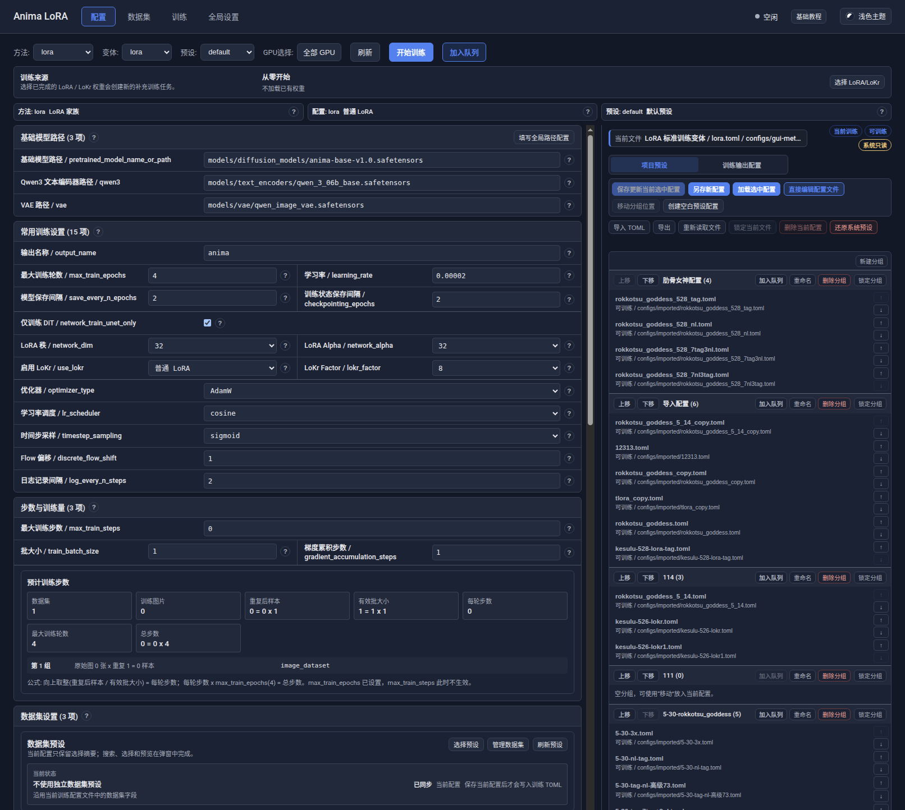
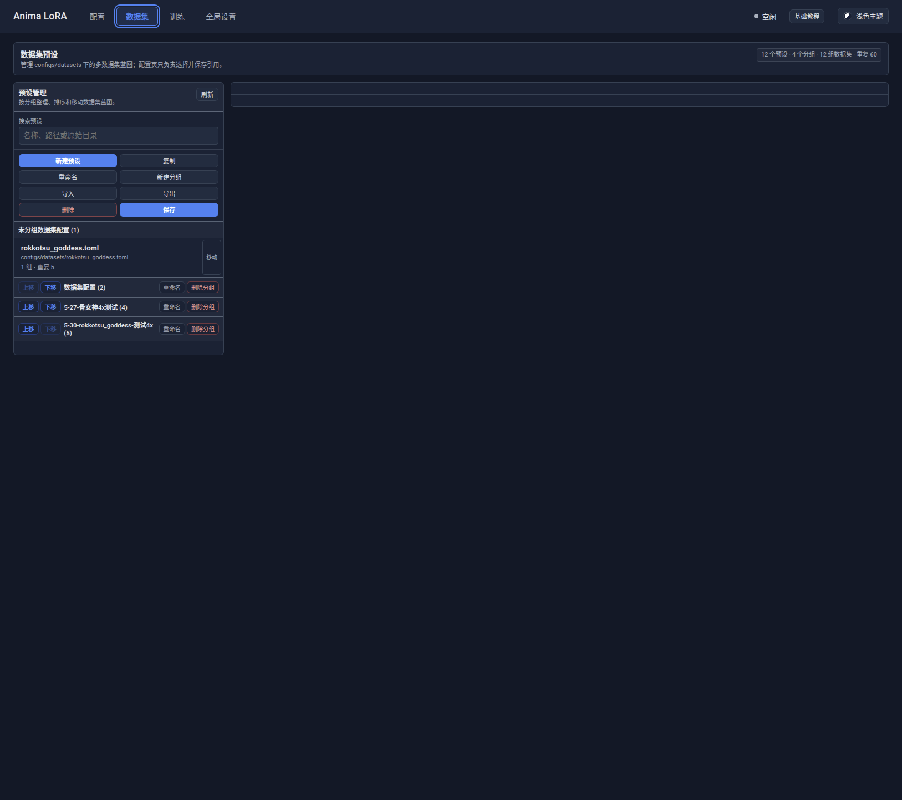
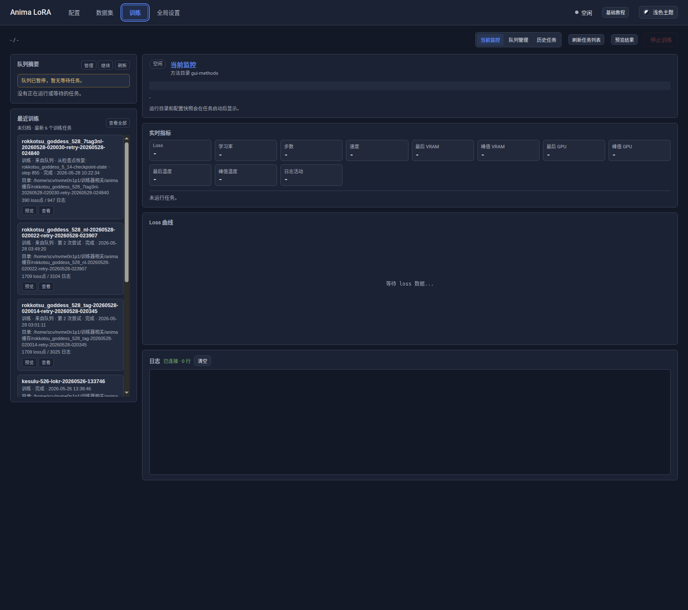
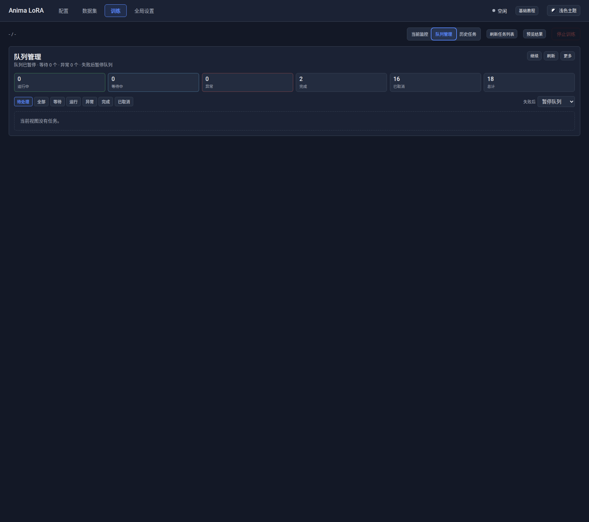
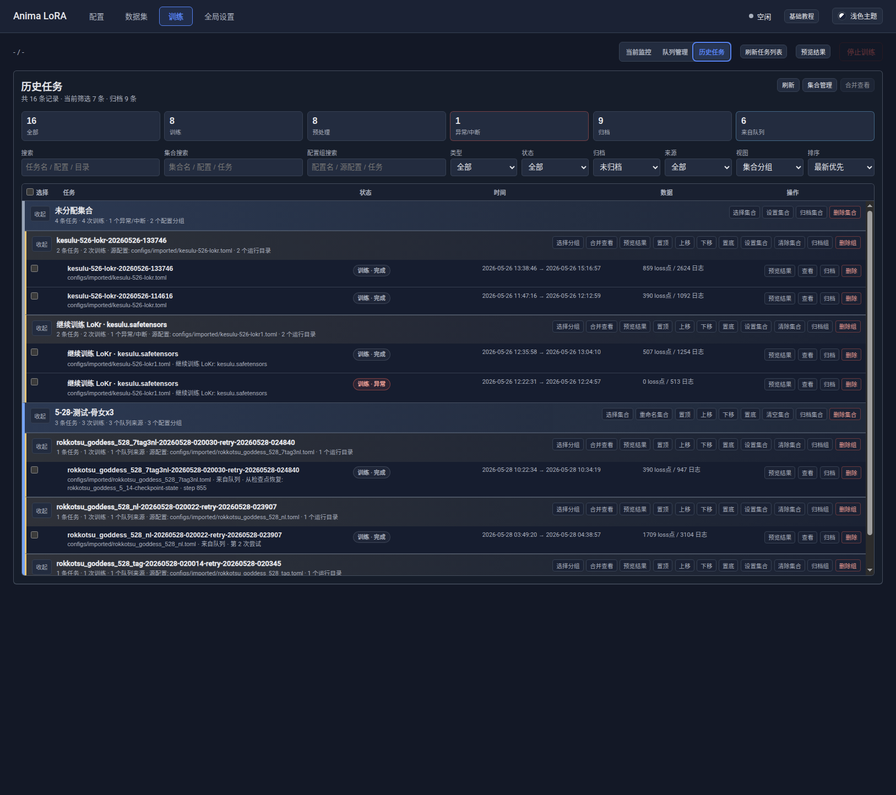
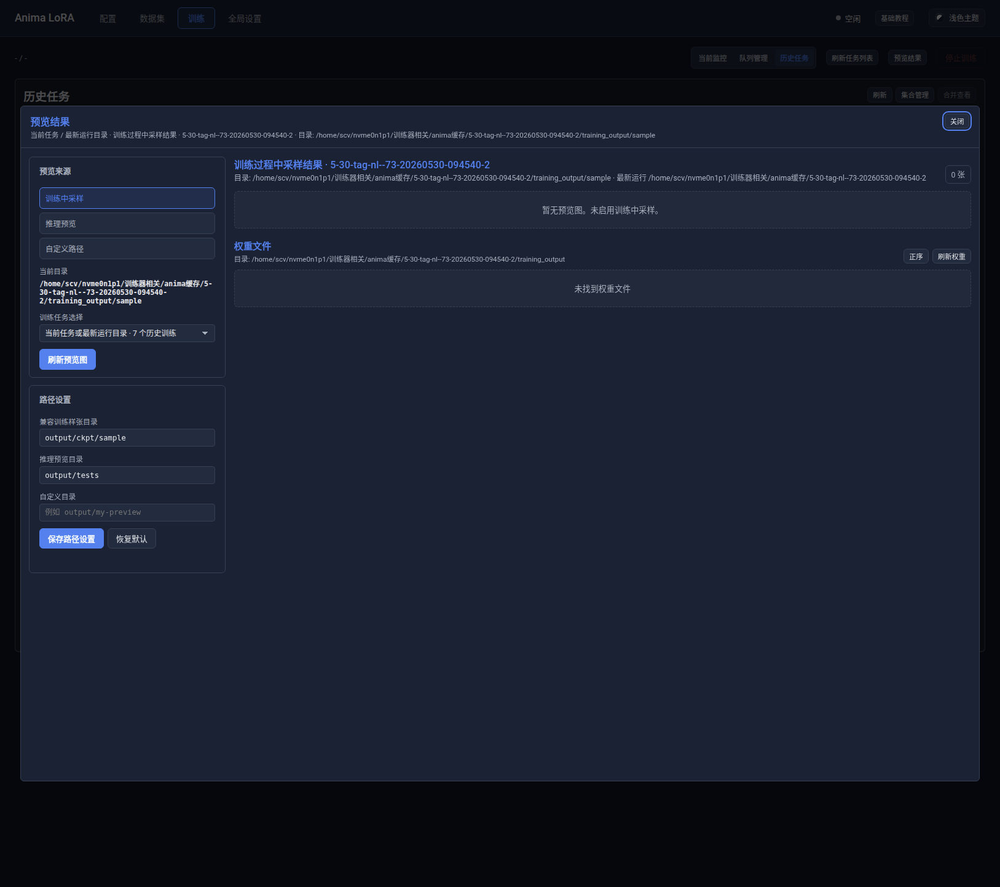
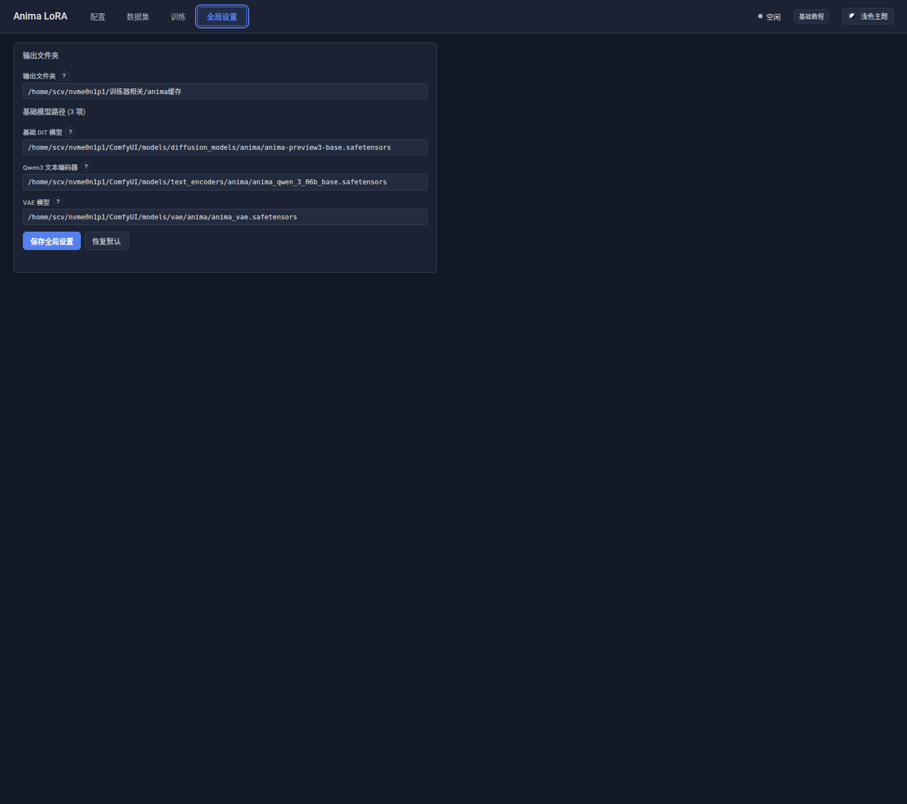

# Anima LoRA WebUI 前端可视化与操作逻辑调查报告

调查日期：2026-05-30
调查范围：`web/` aiohttp WebUI、`web/static/` 单页前端、相关配置/训练/预览服务
调查方式：源码只读分析、本地 WebUI 浏览器截图验证、定向测试验证


**✨ 核心结论**

Anima LoRA WebUI 是一个 aiohttp 后端 + 静态单页前端。

前端实际不是多页面应用，而是 `index.html` 中预置多个工作区，
再由 `app.js` 的闭包状态机驱动界面切换、表单渲染、训练控制、
队列、历史、预览弹窗和全局设置。

界面分布可以概括为：

1. 配置页：训练配置主入口，包含方法/变体/预设、GPU 选择、
   训练来源、动态配置表单和 TOML 管理。
2. 数据集页：独立维护 `configs/datasets/` 下的数据集蓝图预设。
3. 训练页：当前监控、队列管理、历史任务三套主视图。
4. 全局设置页：输出根目录和 3 个基础模型路径。
5. 预览结果：不是顶部导航页，而是隐藏工作区，通过训练页或历史任务弹窗挂载。

当前静态 DOM 规模：

- 顶层导航：4 个。
- 训练子视图：3 个。
- 预览来源：3 个。
- 历史详情子 Tab：7 个。
- 队列筛选项：7 个。
- 页面按钮：118 个。
- 输入框：19 个。
- 下拉框：15 个。
- 文本区：2 个。
- 弹窗：9 个。
- 主 `section`：33 个。
- 图表画布：1 个。


**🖼️ 可视化截图结果**

以下截图由本地 WebUI `http://127.0.0.1:20102/` 实际打开后采集。

配置页：



数据集页：



训练页 / 当前监控：



训练页 / 队列管理：



训练页 / 历史任务：



预览结果弹窗：



全局设置页：




**🧭 前端入口与页面骨架**

入口文件：

- `web/server.py`：注册 `/`、`/static/{path}`，并在启动时创建 `TrainingService`。
- `web/static/index.html`：全部页面 DOM 锚点、弹窗、导航按钮。
- `web/static/app.js`：前端状态机、动态渲染、API 调用、事件绑定。
- `web/static/style.css`：布局和响应式样式。
- `web/static/chart.js`：Loss 曲线图表。

顶层布局：

```text
[header]
├── Anima LoRA 标题
├── 配置 / 数据集 / 训练 / 全局设置
├── 状态指示器
├── 基础教程
└── 主题切换

[main]
├── tab-config
├── tab-datasets
├── tab-training
├── tab-preview    (hidden，供弹窗移动挂载)
└── tab-settings

[dialogs]
├── 训练前预检测
├── 基础教程
├── 预览结果面板
├── 预览图大图
├── 数据集预览
├── 配置页数据集选择
├── 继续训练权重选择
├── 历史任务操作
└── 历史任务详情
```

关键证据：

- `index.html:23` 起为 header 和主导航。
- `index.html:44` 起为配置页。
- `index.html:182` 起为数据集页。
- `index.html:224` 起为训练页。
- `index.html:536` 起为隐藏预览工作区。
- `index.html:614` 起为全局设置页。
- `index.html:734` 起为 9 个 dialog。


**🧩 配置页功能分布**

配置页是整个 WebUI 的主操作入口。

可视结构：

1. 顶部配置工具栏
   - 方法 `method-select`
   - 变体 `variant-select`
   - 预设 `preset-select`
   - GPU 选择器
   - 刷新
   - 开始训练
   - 加入队列

2. 训练来源区
   - 默认从零开始。
   - 可选择 LoRA / LoKr 权重进行补充训练。
   - 可清除继续训练来源。

3. 选择说明区
   - 根据方法、变体、预设动态渲染说明。
   - 目标是降低用户直接面对 TOML 字段的理解成本。

4. 左侧动态表单
   - `#config-form` 不在 HTML 里硬编码字段。
   - 字段由 `FORM_SECTION_DEFS`、当前 merged config 和 UI defaults 动态生成。

5. 右侧 TOML 管理区
   - 项目预设模式。
   - 训练输出配置模式。
   - 当前文件、只读/可训练/未保存状态徽标。
   - 保存、另存、加载、直接编辑、移动分组、创建空白预设。
   - 导入、导出、重新读取、锁定、删除、还原系统预设。
   - 可从输出运行目录复制 `config.original.toml` 为新项目预设。

配置表单共有 14 个功能组：

1. 基础模型路径
   - 基础 DiT、Qwen3、VAE。
   - 与全局设置联动，可从全局模型路径填入表单。

2. 常用训练设置
   - 输出命名、训练轮数、学习率、保存间隔。
   - LoRA rank / alpha、LoKr 开关、热启动权重。
   - 优化器、学习率调度、时间步采样、日志设置。

3. 步数与训练量
   - 最大步数、批大小、梯度累积、采样比例。
   - 会触发训练步数估算。

4. 数据集设置
   - 引用数据集预设。
   - 标题打乱、caption dropout、masked loss。

5. 训练中预览图
   - `sample_prompts`。
   - 按 epoch / step 采样。
   - 采样器和首次采样。

6. 显存与速度
   - `blocks_to_swap`。
   - gradient checkpointing。
   - Unsloth offload。
   - mixed precision。
   - attention backend。
   - torch compile 和 dataloader 相关项。

7. 缓存与预处理
   - VAE cache。
   - text cache。
   - LLM adapter output cache。
   - cache check。
   - IP feature cache。

8. 更多数据集配置
   - 路径匹配。
   - 低分辨率图片过滤。
   - 最低像素数。

9. SPD CLI 实验
   - 只用于查看/编辑 SPD 专用配置。
   - Web 普通训练入口会拦截 `methods/spd.toml`。

10. 输出格式与训练范围
   - safetensors / 保存精度。
   - weight decay。
   - CMMD。
   - IP diagnostics。

11. 方法内部与实验架构
   - `network_module`、`network_args`。
   - OrthoLoRA、T-LoRA、ReFT、REPA。
   - Hydra / FeRA / Chimera 路由参数。
   - IP-Adapter、EasyControl 开关。

12. Soft Tokens 参数
   - 层数、时间桶、初始化标准差。
   - 拼接位置。
   - 对比目标、负样本、AGSM、warmup 等。
   - 保存时写回 `network_args`。

13. IP-Adapter 高级参数
   - encoder、encoder_dim。
   - resampler 层数/头数。
   - IP scale、gate LR。
   - PE-LoRA 相关参数。
   - 保存时写回 `network_args`。

14. EasyControl 高级参数
   - 条件门控初值。
   - 条件强度。
   - FFN LoRA 开关。
   - 条件 token 数。
   - 保存时写回 `network_args`。

操作逻辑：

```text
选择方法
  → /api/methods/{method}/variants
  → 定位 configs/gui-methods/<variant>.toml
  → /api/config/merged
  → 渲染动态表单
  → /api/config/steps 估算训练量
  → 同步右侧 TOML 文件
```

保存逻辑：

```text
表单变化
  → collectChangedFormValues()
  → prepareFormPatchValues()
  → /api/config/raw PATCH
  → 如 sample_prompts 是独立文件，先保存 sample prompts
  → 如 dataset_config 有变更，调用 dataset preset apply
```

训练逻辑：

```text
点击开始训练
  → 检查未保存修改
  → 检查 SPD CLI-only 拦截
  → 检查继续训练权重兼容性
  → /api/training/preflight
  → 弹出预检测结果
  → 选择立即训练 / 加入队列 / 预处理后训练
  → /api/training/start 或 /api/training/preprocess
```


**🗂️ 数据集页功能分布**

数据集页负责维护可复用的数据集蓝图。

当前环境下 `configs/datasets/` 有 14 个 TOML 数据集预设。

可视结构：

1. 顶部摘要
   - 显示预设、分组、数据集数量和重复次数汇总。

2. 左侧预设管理
   - 搜索。
   - 刷新。
   - 新建预设。
   - 复制。
   - 重命名。
   - 新建分组。
   - 导入。
   - 导出。
   - 删除。
   - 保存。

3. 右侧数据集编辑器
   - 多数据集路径。
   - 通用标注设置。
   - 每组数据集路径和重复次数。
   - 每组分桶/验证/标注来源设置。
   - 实验性/高级/旧功能收纳区。

数据集行子选项：

1. 原始数据集路径
   - 从这里读取图片与 caption。
   - 预处理结果不写回原始目录。

2. 重复次数
   - 控制每轮中该数据集的等效权重。

3. 标注来源
   - `auto`：自动识别。
   - `txt`：sd-scripts 同名 `.txt`。
   - `json`：AnimaLoraToolkit 同名 `.json`。
   - `captions_json`：DiffPipeForge `captions.json`。

4. 分辨率与分桶
   - resolution。
   - enable_bucket。
   - min_bucket_reso。
   - max_bucket_reso。
   - bucket_reso_steps。
   - bucket_no_upscale。

5. 验证集
   - validation_split。
   - validation_split_num。
   - validation_seed。

6. 标注兼容项
   - caption_extension。
   - keep_tokens。

7. captions 格式 nl/tag 权重调整
   - 面向 DiffPipeForge `captions.json`。
   - 可调 tag 占比。

8. 实验生效范围
   - 对多数据集场景，可把高级设置同步写入多组数据集。

9. 触发提示词图像克隆
   - 在本次运行目录生成额外训练子集。
   - 不修改原始数据集。

10. 数据集预览
   - 只能在预设已保存且无脏修改时打开。
   - 扫描原始图和同名 caption。

操作逻辑：

```text
进入数据集页
  → /api/config/dataset-presets
  → 渲染分组和预设列表
  → 选择预设
  → /api/config/dataset-presets/read
  → 渲染多数据集编辑器
  → 保存
  → /api/config/dataset-presets PUT
```

配置页引用数据集预设时：

```text
配置页打开数据集选择弹窗
  → 搜索/过滤预设
  → 读取第一张原始图预览
  → 选择预设
  → 更新 selectedConfigDatasetFile
  → 重新估算训练步数
  → 保存配置时写入 dataset_config
```


**🏋️ 训练页功能分布**

训练页内部有三套主视图：

1. 当前监控。
2. 队列管理。
3. 历史任务。

顶部工具栏包含：

- 当前变体 / 预设显示。
- 当前监控、队列管理、历史任务子 Tab。
- 刷新任务列表。
- 预览结果。
- 停止训练。


**📡 当前监控视图**

主要可视区域：

1. 队列摘要
   - 当前运行任务。
   - 下一个等待任务。
   - 暂停/继续、刷新、管理入口。

2. 最近训练
   - 未归档。
   - 最新 6 个训练任务。

3. 历史回顾横幅
   - 当查看历史任务时显示。
   - 可刷新当前回顾或回到当前。

4. 续训面板
   - 读取可续训状态目录。
   - 可立即从检查点继续训练。
   - 可加入队列。

5. 运行状态面板
   - 当前状态。
   - 运行目录。
   - 进度条。

6. 实时指标
   - Loss。
   - 学习率。
   - 步数。
   - 速度。
   - 最后/峰值 VRAM。
   - 最后/峰值 GPU。
   - 温度。
   - 日志活动。

7. Loss 曲线
   - `chart.js` 渲染。
   - 数据来自 WebSocket 或历史日志回放。

8. 配置快照
   - 历史回顾时显示运行配置。

9. 日志
   - WebSocket 追加。
   - 可清空前端显示。

实时数据流：

```text
/ws/training
├── log      → appendLogRecord()
├── progress → updateProgress()
├── metrics  → updateMetrics()
├── status   → updateStatus() + 刷新队列/历史
├── queue    → updateTrainingQueueFromPayload()
└── system   → updateSystem()
```

兜底轮询：

```text
pollStatus()
  → /api/training/status
  → 若 last_log_id 增加则 replayTrainingLogs()
```


**📋 队列管理视图**

队列状态：

- 等待。
- 运行中。
- 完成。
- 异常。
- 已取消。

队列筛选：

- 待处理。
- 全部。
- 等待。
- 运行。
- 异常。
- 完成。
- 已取消。

统计卡：

- 运行中。
- 等待中。
- 异常。
- 完成。
- 已取消。
- 总计。

队列操作：

1. 暂停 / 继续队列。
2. 刷新队列。
3. 取消全部队列。
4. 取消全部等待。
5. 清理已结束。
6. 设置失败后策略：
   - 暂停队列。
   - 继续下一个。
7. 单任务操作：
   - 置顶。
   - 上移。
   - 下移。
   - 置底。
   - 取消等待。
   - 停止运行中任务。
   - 重新入队。
   - 移除列表。

队列操作边界：

- 取消等待任务不会删除历史记录和运行目录。
- 停止运行中队列任务会暂停队列，避免马上启动下一项。
- 清理已结束只清理队列文件中的完成/已取消记录。
- 异常记录默认保留，便于重试或人工确认。

数据来源：

- 队列文件：`configs/web-training-queue/queue.json`。
- 后端 API：`/api/training/queue*`。


**🧾 历史任务视图**

历史任务视图用于复盘、筛选、分组、归档、删除和续训。

主要筛选项：

1. 搜索
   - 任务名、配置、目录、消息等。

2. 集合搜索
   - 集合名、配置、任务。

3. 配置组搜索
   - 配置名、源配置、任务。

4. 类型
   - 全部。
   - 训练。
   - 预处理。

5. 状态
   - 全部。
   - 完成。
   - 运行中。
   - 异常。
   - 已中断。

6. 归档
   - 未归档。
   - 全部。
   - 已归档。

7. 来源
   - 全部。
   - 来自队列。
   - 续训。
   - 继续训练。

8. 视图
   - 集合分组。
   - 集合管理。

9. 排序
   - 最新优先。
   - 最早优先。
   - Loss 点数。
   - 日志行数。
   - 名称。

批量操作：

- 归档。
- 取消归档。
- 设置集合。
- 彻底删除。

危险操作保护：

- 历史彻底删除有 dry-run 预览。
- 需要输入确认文本。
- 删除逻辑由后端做路径边界检查。

历史详情弹窗 7 个子 Tab：

1. 概览。
2. 续训。
3. 曲线。
4. 日志。
5. 系统。
6. 配置。
7. 文件。

历史集合逻辑：

```text
historyTasks
  → historyManagerFilters 基础筛选
  → collection / config group 组织
  → 集合分组模式或集合管理模式渲染
```

历史记录位置：

- `configs/web-training-history/`。


**🖼️ 预览结果工作区**

预览结果是一个隐藏工作区，不是常驻导航页。

关键设计：

```text
#preview-workspace
├── 页面挂载点：#preview-page-mount
└── 弹窗挂载点：#preview-dialog-mount
```

打开弹窗时移动同一个 DOM 节点，关闭时恢复页面挂载。
这样避免维护两套预览 DOM。

预览来源：

1. 训练中采样。
2. 推理预览。
3. 自定义路径。

训练来源下还可选择：

- 当前任务 / 最新运行目录。
- 单个历史训练任务。
- 同配置分组合并预览。

左侧功能：

- 预览来源三选一。
- 训练任务选择。
- 刷新预览图。
- 训练样张兼容目录。
- 推理预览目录。
- 自定义目录。
- 保存路径设置。
- 恢复默认。

右侧功能：

- 图片网格。
- 图片数量。
- 空状态提示。
- 权重文件列表。
- 权重排序。
- 刷新权重。

图片卡片：

- 显示预览图。
- 点击打开大图弹窗。
- 大图弹窗显示参数、prompt metadata、图片尺寸等。

权重文件：

- 显示 Epoch、Step、计划、保存时间、大小、类型。
- 可下载。
- 可复制路径。
- 可直接作为继续训练来源。

预览数据流：

```text
openTrainingPreview()
  → 设置 task/group 来源
  → openPreviewPanel()
  → /api/preview/settings
  → /api/preview/images
  → /api/preview/weights
```

安全边界：

- 预览图片读取要落在允许的 sample dir 或全局输出根目录内。
- 权重下载要落在允许的训练输出目录内。
- 后端拒绝路径逃逸。


**⚙️ 全局设置页**

全局设置页当前包含 4 类输入：

1. 输出文件夹
   - Web 训练的统一输出根目录。
   - 每次训练/预处理在这里创建独立运行目录。

2. 基础 DiT 模型
   - 新建空白预设时的默认 `pretrained_model_name_or_path`。

3. Qwen3 文本编码器
   - 新建空白预设时的默认 `qwen3`。

4. VAE 模型
   - 新建空白预设时的默认 `vae`。

每项都有 `?` 帮助区，说明作用和原因。

保存位置：

- `configs/web-ui-settings.toml [global]`。

当前环境快照：

- `output_root` 当前指向一个绝对路径。
- `pretrained_model_name_or_path`、`qwen3`、`vae` 当前也写入本机绝对路径。
- 报告中不把这些路径作为项目默认值，只作为当前机器状态。

后端规则：

- 相对输出目录相对仓库根。
- 绝对输出目录允许使用。
- 相对路径不能包含 `..`。
- 模型路径保留用户写法，不强制解析。


**🌐 后端接口分布**

后端按 routes / services 分层：

```text
web/routes/
├── config.py    配置、TOML、数据集、sample prompts、输出运行配置
├── training.py  训练、预处理、队列、历史、续训、WebSocket
├── preview.py   预览图、权重列表、权重下载、预览路径设置
└── settings.py  全局设置

web/services/
├── config_service.py    配置读写、合并、预检测、数据集预设
├── training_service.py  进程、队列、历史、runtime 目录、WebSocket 广播
├── preview_service.py   图片/权重扫描、路径解析、安全边界
└── settings_service.py  web-ui-settings.toml 与 output_root
```

配置 API：

- `GET /api/methods`
- `GET /api/methods/{method}/variants`
- `GET /api/presets`
- `GET /api/config/merged`
- `GET /api/config/steps`
- `GET/PUT /api/config/datasets`
- `GET/PUT/POST/DELETE /api/config/dataset-presets`
- `GET/PUT/PATCH/DELETE /api/config/raw`
- `POST /api/config/raw/save-as`
- `GET/PUT /api/config/sample-prompts`
- `POST /api/config/lock`
- `POST /api/config/group-lock`
- `GET/POST/PATCH/DELETE /api/config/file-groups`
- `GET /api/config/output-runs`
- `POST /api/config/output-runs/save-as`

训练 API：

- `POST /api/training/preflight`
- `POST /api/training/start`
- `POST /api/training/preprocess`
- `POST /api/training/resume`
- `POST /api/training/stop`
- `GET /api/training/status`
- `GET /api/training/metrics`
- `GET /api/training/logs`
- `GET /api/training/gpus`
- `GET /ws/training`

队列 API：

- `GET /api/training/queue`
- `POST /api/training/queue/start`
- `POST /api/training/queue/resume`
- `POST /api/training/queue/settings`
- `POST /api/training/queue/cancel-all`
- `POST /api/training/queue/cancel-waiting`
- `POST /api/training/queue/clear`
- `POST /api/training/queue/{item_id}/move`
- `POST /api/training/queue/{item_id}/retry`
- `DELETE /api/training/queue/{item_id}`
- `POST /api/training/queue/pause`

历史 API：

- `GET /api/training/history`
- `POST /api/training/history/batch`
- `GET/PUT /api/training/history/collections/settings`
- `GET /api/training/history/config-group/timeline`
- `GET/PATCH/DELETE /api/training/history/{task_id}`
- `GET /api/training/history/{task_id}/resume-options`

预览 API：

- `GET/PUT /api/preview/settings`
- `GET /api/preview/images`
- `GET /api/preview/image`
- `GET /api/preview/weights`
- `GET /api/preview/weight`

全局设置 API：

- `GET /api/settings/global`
- `PUT /api/settings/global`


**🔐 安全边界与保护逻辑**

配置相关：

- 配置路径限制在 `configs/` 下。
- `methods_subdir` 需要合法配置子目录。
- 系统预设支持锁定和还原。
- 直接保存 TOML 有二次确认。
- 切换配置前会检测未保存改动。

数据集相关：

- 删除数据集预设只删除 TOML，不删除图片、缩放图或缓存目录。
- 数据集预览依赖已保存状态，避免预览内存中未落盘配置。

训练相关：

- 启动前必须经过 preflight。
- 有未保存配置时阻止训练。
- SPD CLI 实验配置被 Web 普通训练入口拦截。
- 继续训练权重需要后端 inspect 兼容性。
- 运行时会冻结独立 runtime config，避免后续修改源 TOML 影响队列项。
- 每次 Web 训练/预处理会在全局输出根下创建独立 run dir，
  典型内容包括 `model_cache/`、`dataset_cache/`、`training_output/`、
  `training_output/sample/`、`config.original.toml`、
  `dataset.runtime.toml`、`config.runtime.toml`、`run.meta.json`。

队列相关：

- 等待任务取消不删除运行缓存。
- 运行任务停止会暂停队列。
- 重试从冻结 runtime 配置克隆，不读当前已修改 TOML。
- 清理已结束不清理异常记录。

历史相关：

- 彻底删除有 dry-run 和确认文本。
- 历史 artifact 读取需要路径边界检查。

预览相关：

- 图片和权重解析限制在 sample dir、全局输出根目录、任务训练输出目录等允许范围内。
- 权重下载通过后端 `FileResponse`，非法路径返回 403/404。

全局设置相关：

- `output_root` 相对路径不能包含 `..`。
- 绝对路径会 resolve。
- 模型路径保留用户输入，不做破坏性规范化。

访问边界：

- 分析范围内未见认证/鉴权中间件。
- `python -m web` 的默认 host 是 `0.0.0.0`。
- 因此 WebUI 的主要防线是本机/局域网访问控制和后端路径白名单，
  不建议直接暴露到公网。


**🧪 验证结果**

本次只读调查没有改动已有源码逻辑。

已执行验证：

```bash
timeout 60 .venv/bin/python -m pytest tests/test_training_frontend_state.py tests/test_preview_service.py -q
```

结果：

```text
34 passed in 4.01s
```

浏览器验证：

- 本地启动 `python -m web --host 127.0.0.1 --port 20102`。
- 打开配置页、数据集页、训练当前监控、队列管理、历史任务、
  预览结果弹窗、全局设置页。
- 成功截图 7 张，分辨率约 `1627x1444`。
- 浏览器控制台未发现 WebUI 自身脚本错误；只有 Electron 环境 CSP 警告。


**📌 调查范围外说明**

本报告聚焦 WebUI 前端界面和操作逻辑，不覆盖：

- PySide6 `gui/` 桌面 GUI。
- ComfyUI custom nodes。
- 训练算法质量评估。
- 实际启动训练的产物质量。
- 数据集内容本身质量审查。


**✅ 总结**

WebUI 当前已经形成较完整的训练工作台：

- 配置页负责训练参数和 TOML 生命周期。
- 数据集页负责多数据集蓝图。
- 训练页负责实时监控、队列、历史和续训。
- 预览弹窗负责图像与权重复盘。
- 全局设置负责输出根目录和模型路径默认值。

整体操作逻辑偏“冻结配置后执行”：

```text
全局设置
  → 数据集预设
  → 配置预设
  → 预检测
  → 预处理 / 训练 / 入队
  → 监控
  → 历史复盘
  → 预览图与权重
  → 续训或继续训练
```

这套设计能把高风险训练启动动作放在 preflight 和确认弹窗之后，
同时保留 runtime config、history、queue 和 preview 的可追溯链路。
