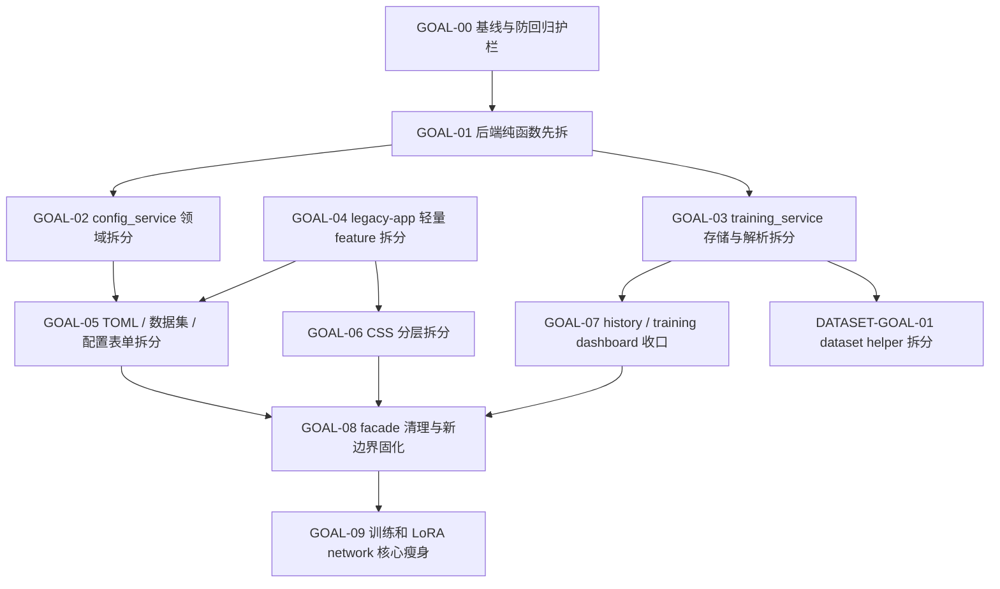

# WebUI 上帝文件治理合并记录

日期：2026-06-07

本文件是 WebUI 上帝文件治理的当前主入口，合并了同日产生的审计、复审、GOAL 拆解、推进报告和 `legacy-app.js` 拆分计划。后续继续推进 WebUI 拆分时优先读这一篇，不再从多个 findings 文档里拼上下文。

## 合并来源

本文件收敛以下旧文档的有效内容：

- `god_files_audit_20260607.md`
- `god_files_audit_refresh_20260607.md`
- `god_files_refactor_goals_20260607.md`
- `god_files_refactor_progress_report_20260607.md`
- `legacy_app_js_split_plan_20260607.md`

这些文件主要是同一轮治理的阶段性记录，主题、日期和执行路线高度重叠。当前已保留本文件作为主记录，旧文件已从 `docs/findings/` 移除。

## 当前结论

最需要治理的是 WebUI 前端过渡层和 Web 后端服务层。优先级如下：

| 优先级 | 文件 | 当前判断 |
|---|---|---|
| P0 | `web/static/js/features/legacy-app.js` | 最大前端债务，仍承载配置表单、TOML、训练控制、WebSocket、历史、队列、设置、预览等大量状态和 DOM 逻辑 |
| P0 | `web/static/style.css` | 全站样式集中在一个文件，选择器空间过大，已经阻碍 feature 拆分 |
| P1 | `web/services/training_service.py` | 已拆出 GPU 和 progress helper，但仍聚合训练进程、预处理、队列、历史、runtime、日志、恢复训练和删除安全 |
| P1 | `web/services/config_service.py` | 已拆出路径 helper，但仍聚合 method、variant、merged config、dataset preset、raw TOML、preflight、sample prompts 和 output runs |
| P1 | `library/datasets/base.py` | 新增中期风险点，数据集读取、bucket、缓存、identity pairs、contrastive negatives、inversion/BYG 等职责过密 |
| P2 | `train.py` | 训练入口和生命周期编排大文件，已有训练子模块承接拆分，暂不抢先处理 |
| P2 | `networks/lora_anima/network.py` | LoRA family 核心对象，复杂度来自真实 adapter 生命周期，后续按 router/state/metrics/io 拆 |

不建议把 `train.py`、`networks/lora_anima/network.py`、`library/anima/models.py`、`library/models/qwen_vae.py` 和 WebUI 债务混在同一轮大拆中处理。

## 已完成进展

GOAL-00 已完成：

- 建立 WebUI 上帝文件治理基线。
- 为 `legacy-app.js` 增加前端防回归护栏。
- 明确 `legacy-app.js` 只能作为过渡胶水，不再作为新增前端业务的默认承载文件。
- 明确 `web/static/app.js` 保持 bootstrap，不承载业务 `fetch`、DOM 查询或事件绑定。

GOAL-01 已推进完成低风险部分：

- 新增 `web/services/training/gpu.py`，承接 GPU 白名单、`CUDA_VISIBLE_DEVICES` 注入和 `nvidia-smi` 解析。
- 新增 `web/services/training/progress_parser.py`，承接 progress JSONL、metric 文本、step rate 和 display step 解析。
- 新增 `web/services/config/paths.py`，承接 config 路径 normalize、safe resolve 和 display path。
- `training_service.py` 与 `config_service.py` 保留兼容 facade，旧导入路径暂不破坏。

验证记录：

```bash
timeout 60 python -m pytest tests/test_training_frontend_state.py
timeout 60 .venv/bin/python -m pytest tests/test_training_gpu_selection.py
timeout 60 .venv/bin/python -m pytest tests/test_web_config_service.py
timeout 60 .venv/bin/python -m pytest tests/test_training_queue.py
timeout 60 .venv/bin/python -m pytest tests/test_training_resume.py
python -m py_compile web/services/training_service.py web/services/config_service.py web/services/training/gpu.py web/services/training/progress_parser.py web/services/config/paths.py
```

裸 `python` 环境缺少部分项目依赖时，后端 pytest 使用 `.venv/bin/python` 复跑。

## 总体路线

治理原则：

- 每个 GOAL 都应能独立执行、验证和回滚。
- 优先做搬家型重构，保持用户可见行为不变。
- 旧 facade 先保留，等新边界稳定后再清理。
- 不改训练历史、队列、输出、模型和数据集内容。
- 前端新增业务不再塞回 `legacy-app.js`。
- 后端新增业务不再塞回 `training_service.py` 或 `config_service.py`。
- 每轮必须跑定向测试；未跑时说明原因和风险。

依赖顺序：



建议当前继续顺序：

1. GOAL-02：拆 `config_service.py` 的 methods、sample prompts、output runs、raw files。
2. GOAL-03：拆 `training_service.py` 的 JSON store、queue store、history store、runtime paths。
3. 提前插入 GOAL-06 第一阶段：`style.css` 原样按 section 搬运，先不改选择器。
4. GOAL-04：拆 `legacy-app.js` 的 theme、GPU picker、standalone warning 等轻量 feature。
5. DATASET-GOAL-01：拆 `library/datasets/base.py` 的 cache、sidecar、sample builder helper。

## GOAL 明细

### GOAL-02：`config_service.py` 第一阶段领域拆分

目标：让 `config_service.py` 从业务集合体逐步变成 facade。

建议新文件：

- `web/services/config/methods.py`
- `web/services/config/sample_prompts.py`
- `web/services/config/output_runs.py`
- `web/services/config/files.py`

禁止事项：

- 不重写 TOML patch 语义。
- 不改变系统预设锁定行为。
- 不改变 sample prompts 分叉路径策略。
- 不强迫 `web/routes/config.py` 同轮迁移。

验收：

```bash
timeout 60 python -m pytest tests/test_web_config_service.py
timeout 60 python -m pytest tests/test_preview_service.py
```

### GOAL-03：`training_service.py` 存储层和解析层拆分

目标：把 queue、history、runtime、JSON/JSONL 工具从训练运行流程中解耦。

建议新文件：

- `web/services/training/json_store.py`
- `web/services/training/queue_store.py`
- `web/services/training/history_store.py`
- `web/services/training/runtime.py`
- `web/services/training/runtime_dataset.py`

注意事项：

- queue/history/runtime 都涉及用户数据和删除安全，必须保留原有路径边界检查。
- 测试应逐步迁移到新模块，旧 facade 只验证兼容导入。

验收：

```bash
timeout 60 python -m pytest tests/test_training_queue.py tests/test_training_resume.py tests/test_training_gpu_selection.py
```

### GOAL-04：`legacy-app.js` 轻量 feature 先拆

目标：先拆边界清楚的小 feature，建立 `createXFeature(ctx, deps)` 模式。

建议先拆：

- `gpu-picker`
- `app-shell` / theme / tab / beginner guide
- `settings`
- preview 兼容代理
- queue 兼容代理

共同规则：

- 行为不变。
- DOM id / class 不变。
- CSS 不同步大改。
- API 路径不变。
- 文案不主动改。
- import cache token 保持一致，除非单独做 cache token bump。
- 已拆出的 feature 不再回填到 `legacy-app.js`。

验收：

```bash
timeout 60 python -m pytest tests/test_training_frontend_state.py
```

### GOAL-05：配置表单、数据集预设、TOML 管理拆分

目标：拆掉 `legacy-app.js` 中最大、最容易互相污染的三个 UI 域。

建议拆分：

- `web/static/js/features/config-form/`
- `web/static/js/features/dataset-presets/`
- `web/static/js/features/toml-manager/`
- `web/static/js/shared/drag-sort.js`

执行方式：

- 先迁移纯状态和 draft。
- 再迁移字段输入、network args、layout render。
- 再迁移 sample prompts editor、choice guide、resource presets、stage resolution。
- 最后迁移数据集编辑器和 TOML manager 的保存、导入、导出、锁定、删除、分组、拖拽。

### GOAL-06：`style.css` 分层拆分

目标：先按 section 原样搬运，不改选择器、不改视觉。

建议结构：

```text
web/static/css/base/tokens.css
web/static/css/base/reset.css
web/static/css/components/buttons.css
web/static/css/components/dialog.css
web/static/css/components/forms.css
web/static/css/components/drag-sort.css
web/static/css/features/config.css
web/static/css/features/datasets.css
web/static/css/features/toml-manager.css
web/static/css/features/training.css
web/static/css/features/history.css
web/static/css/features/preview.css
web/static/css/features/weight-analysis.css
web/static/css/responsive.css
```

`style.css` 暂时作为 `@import` 聚合入口。等 feature 边界稳定后，再考虑更细的加载策略。

### GOAL-07：训练面板、历史列表、队列状态收口

目标：把训练控制、WebSocket、日志、实时 dashboard、status polling、历史集合和拖拽从过渡层拆出。

建议批次：

- training control / preflight
- websocket / log / live dashboard
- status polling / history list
- history collections / drag
- history detail 兼容代理

涉及 preview、queue、history 时补跑相关后端测试。

### GOAL-08：facade 清理与边界固化

目标：主要拆分完成后，收紧旧入口，防止上帝文件反弹。

清理项：

- 删除已迁移状态变量。
- 删除重复 helper。
- 删除已无用 feature ensure。
- 更新 `legacy-app.js` 行数阈值。
- 把测试断言从旧文件迁移到新 feature 模块。

### GOAL-09：训练入口和 LoRA network 核心瘦身

目标：等 WebUI 和 dataset 债务稳定后，再处理训练入口和 adapter 核心大文件。

候选拆分：

- `train.py`：sample preview、parser 剩余大块、router/method adapter glue、constant-token bucket helper。
- `networks/lora_anima/network.py`：`router_state.py`、`router_metrics.py`、`grad_stats.py`、`optimizer_params.py`、`state_io.py`。

验收重点必须覆盖 checkpoint、metadata、router、load/save 和数值兼容。

### DATASET-GOAL-01：`library/datasets/base.py` helper 拆分

目标：先拆 helper，不先拆 `BaseDataset` 继承结构。

候选新模块：

- `library/datasets/cache_readers.py`
- `library/datasets/sidecars.py`
- `library/datasets/sample_builder.py`

验收：

```bash
timeout 60 python -m pytest tests/test_preprocess_dataset.py tests/test_latents_cache_strategy.py tests/test_constant_token_buckets.py
timeout 60 python -m pytest tests/test_identity_pairs.py tests/test_soft_tokens_contrastive.py
```

## `legacy-app.js` 拆分批次

每批固定流程：

1. 定位函数、状态变量、DOM id、事件绑定和测试断言。
2. 写清本批移动边界，暂不顺手拆下一个领域。
3. 新建 feature 目录，优先 `index.js` 聚合。
4. 新模块导出 `createXFeature(ctx, deps)` 或纯函数。
5. `legacy-app.js` 只保留创建 feature、传依赖和调用入口。
6. 把测试断言迁移到新模块，不降低断言强度。
7. 检查模块图可达、cache token、旧实现是否删除。
8. 运行定向验证。

推荐批次：

| 批次 | 目标 |
|---:|---|
| 0 | 建立拆分护栏 |
| 1 | GPU picker |
| 2 | app shell / theme / tab / 教程入口 |
| 3 | 全局设置 |
| 4 | preview 兼容代理 |
| 5 | queue 兼容代理 |
| 6 | training control / preflight |
| 7 | websocket / log / live dashboard |
| 8 | status polling / history list |
| 9 | history collections / drag |
| 10 | history-detail 兼容代理 |
| 11 | config form |
| 12 | dataset presets / editor |
| 13 | TOML manager |
| 14 | event binding / tooltips |
| 15 | legacy cleanup |

新 feature 推荐结构：

```text
web/static/js/features/<feature>/
  index.js
  state.js
  api.js
  render.js
  actions.js
```

小 feature 可以只建 `index.js`。纯工具进入 `web/static/js/shared/`，但必须无业务状态。

`ctx` 只放通用依赖，例如 `api`、`dom`、`download`、`format`、`catalog`、`MetricsChart`。feature 间依赖用 `deps` 显式传入，不要在新模块里反向 import `legacy-app.js`。

## 测试矩阵

后端 config 拆分：

```bash
timeout 60 python -m pytest tests/test_web_config_service.py tests/test_gui_variants.py tests/test_preview_service.py
```

后端 training 拆分：

```bash
timeout 60 python -m pytest tests/test_training_queue.py tests/test_training_resume.py tests/test_training_gpu_selection.py
```

前端 feature / CSS 拆分：

```bash
timeout 60 python -m pytest tests/test_training_frontend_state.py
```

dataset 拆分：

```bash
timeout 60 python -m pytest tests/test_preprocess_dataset.py tests/test_latents_cache_strategy.py tests/test_constant_token_buckets.py tests/test_identity_pairs.py tests/test_soft_tokens_contrastive.py
```

训练/network 核心后续拆分：

```bash
timeout 60 python -m pytest tests/test_training_bootstrap.py tests/test_network_registry.py tests/test_network_cfg.py tests/test_factory_metadata_flow.py
```

纯文档整理验证：

```bash
git diff --check -- docs _archive/docs
```
