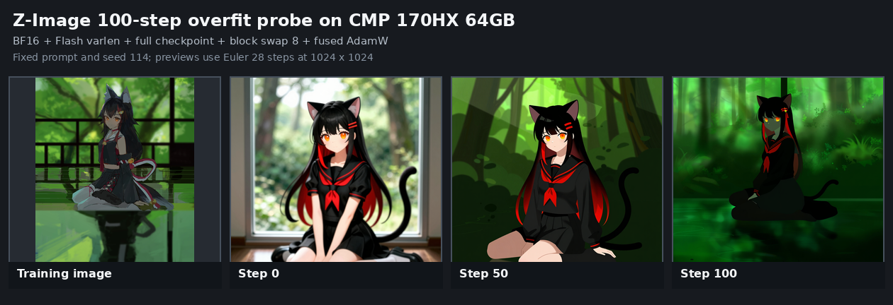

# Z-Image CMP 170HX 100-step Flash + checkpoint + block swap 测试

日期：2026-09-05

状态：训练功能 PASS；单图过拟合质量在 step 100 明显退化

适用版本：当前本地工作树（基础 commit `2e96bd0ce3a7c2803d542e5b0b7dfeac77369d8b`）

## 结论

Z-Image plain LoRA 在 **NVIDIA CMP 170HX 64GB** 上使用以下组合完成 `100/100` 步：

```text
BF16 base/compute
+ Diffusers flash_varlen
+ full gradient checkpointing
+ block swap 8/30
+ fused AdamW
+ 1024 bucket / batch 1
```

训练、step 0/50/100 预览、step 100 checkpoint 保存全部成功；无 CUDA OOM、FlashAttention fallback、checkpoint recompute 或 block-swap 错误。结构化结束事件为 `status="ok"`、`final_step=100`。

但质量结论不同：本次为同一张训练图重复 100 次的过拟合探针，rank 16、alpha 16、定学习率 `1e-4`。step 50 已明显转向训练图的深绿配色和平涂风格；step 100 严重偏暗偏绿，脸部、衣裙和腿部细节大量丢失。因此：

- **运行时组合通过**。
- **不推荐把本单图/学习率协议的 100 步当作质量配置**。
- loss 从 step 50 的平均 `0.6862` 降到 step 100 的 `0.5863`，但预览质量同时退化，证明该 loss 不能代替固定 prompt 视觉检查。

## 能力边界

本轮遵守当前 Z-Image 兼容矩阵：

- 只使用 attention-only plain LoRA。
- Flash 只使用 BF16，公开 `attn_mode="flash"` 映射到 Diffusers `flash_varlen`。
- 只使用 full gradient checkpointing，不使用 selective/CPU/Unsloth activation offload。
- `blocks_to_swap=8`，在 30 个 main layer 的合法范围 `1..28` 内。
- `torch_compile=false`；Z-Image 当前明确不支持 compile。
- 没有使用 NF4；Z-Image 当前只支持 BF16 base compute。

本报告中的 `fused` 指 AdamW `fused=True`，不指 `torch.compile` 或 fused QKV projection。

## 实验协议

| 项目 | 值 |
| --- | --- |
| GPU | NVIDIA CMP 170HX 64GB，63.39 GiB，SM80 |
| 模型 | `z_image_turbo_bf16.safetensors` |
| transformer dtype | BF16 |
| attention | `flash (Diffusers flash_varlen)` |
| checkpoint | full gradient checkpointing |
| block swap | 8/30 main layers，BF16 transfer，slab restore |
| frozen CPU masters | 10.11 GiB |
| adapter | Z-Image attention-only LoRA，rank 16，alpha 16 |
| optimizer | AdamW `fused=True`，lr `1e-4`，constant，no warmup |
| dataset | 1 张 896x1200 图，1024 bucket，100 repeats，batch 1 |
| training sampling | uniform timestep，discrete flow shift 6.0，weighting none |
| preview | step 0/50/100，1024x1024，Euler 28，CFG 4.0，flow shift 3.0，seed 114 |

正式训练前还执行了同配置的 1-step 真模型 preview smoke，成功完成 step 0 采样、forward/backward 和 checkpoint 保存。Z-Image 定向单元测试为 `49 passed`。

## 运行结果

| 指标 | 结果 |
| --- | ---: |
| final step | 100/100 |
| final average loss | 0.58632 |
| step 50 average loss | 0.68615 |
| step 100 current loss | 0.68560 |
| recent training step | 2.006 s/step |
| CUDA peak allocated | 16.943 GiB |
| CUDA peak reserved | 17.119 GiB |
| progress 时钟 | 458.173 s |
| 原始预览 | 3 张，全部 1024x1024 RGB |

progress 时钟包含进程内的采样与保存阶段，但不是纯训练步耗时。控制台 wall time 约 7 分 58 秒，其中含模型加载、step 0/50/100 三次采样和两次保存。

memory probe 和 block-swap profile 记录：

- GPU 为 `NVIDIA CMP 170HX 64GB`。
- `attn_mode="flash"`、`blocks_to_swap=8`、`torch_compile=false`。
- `num_blocks=30`、`transfer_dtype="bf16"`、`restore_mode="slab"`。
- 文件末尾仍是正常 block-swap 事件，没有中途中断迹象。

控制台日志未见 `ERROR`、CUDA OOM 或 attention fallback。唯一 warning 是数据集没有 regularization images，与本次单图过拟合探针设计一致。

## Checkpoint 核验

最终两个同容量文件：

```text
z-image-flash-swap8-step100-step00000100.safetensors  66,901,664 bytes
z-image-flash-swap8-step100.safetensors               66,901,664 bytes
```

逐 tensor 审计结果：

- 408 keys，16,711,816 parameters，全部 finite。
- 136 alpha、136 down、136 up，无 router/MoE 张量。
- metadata：`ss_model_family=z_image`、`ss_steps=100`、`ss_network_spec=lora`、rank/alpha `16/16`。
- target 为 `ZImageTransformerBlock`，text encoder 未训练。

step 50 checkpoint 曾成功写入，但在 step 100 保存后被 retention 清理。根据 `library/training/checkpoints.py::get_remove_step_no()` 和 CLI help，实验配置的 `save_last_n_steps=2` 表示“保留最近 2 个训练步窗口”，不是“保留最近 2 个 checkpoint”。后续若需同时保留 step 50/100，该值应至少为 50。这是实验配置口径问题，不是 Z-Image 保存失败。

## 预览对比



| 步数 | RGB mean | RGB std | 相对 step 0 RMSE | 视觉观察 |
| --- | --- | --- | ---: | --- |
| 0 | 126.766 / 121.777 / 104.566 | 76.011 / 78.133 / 71.917 | 0.00 | 主体清晰完整，背景明亮 |
| 50 | 47.963 / 59.422 / 27.759 | 57.988 / 57.375 / 38.797 | 106.03 | 深绿森林配色、平涂化，手腿细节减少 |
| 100 | 19.930 / 63.010 / 17.358 | 29.599 / 52.371 / 22.622 | 114.77 | 严重偏暗偏绿，人脸、衣裙和腿部细节大量吞没 |

三张图都能正常解码，不是全黑/全白、随机噪声或块状解码失败。step 100 仍能识别猫耳、黑红头发、水手服、坐姿和尾巴，但对比 step 50 可以确认曝光与细节继续退化。

训练图本身就是深绿色、低亮度森林/水面场景，所以绿色漂移一部分是单图过拟合，不能全部归类为数值崩溃。但 step 100 的细节丢失和亮度压缩是明确的质量警告。本轮只有一个 prompt、一个 seed 和一张训练图，不能外推到真实多图数据集的泛化质量。

## 问题和后续门禁

1. 本协议的 step 100 质量明显退化；后续质量实验应优先测试更低学习率、更多训练图以及更密的 10/20/30/40/50 step 预览。
2. 本轮证明当前进程内训练/预览/保存，但没有验证 checkpoint reload、resume 和独立推理。
3. 这是当前未提交工作树的真机证据，其中包括 Z-Image FlashAttention 接线改动；只有基础 commit 无法完整复现。
4. 不应将这一结果外推为 Z-Image 支持 NF4、compile、selective checkpoint 或非 plain-LoRA adapter。

## 验证与原始产物

在当前工作树中执行的定向测试（结果不写入 `output/` 实验日志）：

```text
timeout 120 .venv/bin/python -m pytest -q \
  tests/test_z_image_family.py \
  tests/test_z_image_attention_backend.py \
  tests/test_z_image_block_swap.py \
  tests/test_z_image_training_sample_preview.py

49 passed, 16 warnings in 11.78s
```

覆盖：

```text
tests/test_z_image_family.py
tests/test_z_image_attention_backend.py
tests/test_z_image_block_swap.py
tests/test_z_image_training_sample_preview.py
```

原始产物：

- 运行配置：`output/runs/z-image-100step-20260905/configs/formal.toml`
- dataset 配置：`output/runs/z-image-100step-20260905/configs/dataset.toml`
- 控制台日志：`output/runs/z-image-100step-20260905/formal/console.log`
- progress：`output/runs/z-image-100step-20260905/formal/logs/z-image-flash-swap8-step100.progress.jsonl`
- memory probe：`output/runs/z-image-100step-20260905/formal/logs/z-image-flash-swap8-step100.memory_probe.jsonl`
- block-swap profile：`output/runs/z-image-100step-20260905/formal/logs/z-image-flash-swap8-step100.block_swap_profile.jsonl`
- 结构化汇总：`output/runs/z-image-100step-20260905/formal/summary.json`
- 预览指标：`output/runs/z-image-100step-20260905/formal/preview_metrics.tsv`
- 预览对比：`output/runs/z-image-100step-20260905/formal/contact_sheet.png`
- 最终 checkpoint：`output/runs/z-image-100step-20260905/formal/ckpt/z-image-flash-swap8-step100.safetensors`

`output/` 被 Git 忽略，它是本次实验的原始证据，不应作为普通生成物清理。对比图的文档副本位于 `docs/findings/assets/`。
