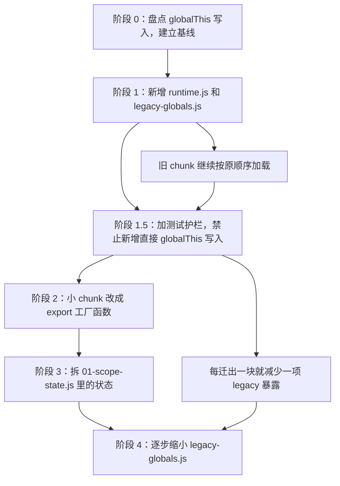

# Anima App Runtime / Context 迁移提案

状态：活跃提案
适用版本：当前 main
入口命令：无，本文是 WebUI 前端重构计划
基线日期：2026-07-06
相关代码：
- `web/static/js/features/anima-app/index.js`
- `web/static/js/features/anima-app/imports.js`
- `web/static/js/features/anima-app/runtime.js`（阶段 1 新增）
- `web/static/js/features/anima-app/legacy-globals.js`（阶段 1 新增）
- `web/static/js/features/anima-app/chunks/01-scope-state.js`
- `tests/test_training_frontend_state.py`

## 核心结论

一句话：先别一口气删 `globalThis`，先把它降级成旧代码兼容层，真实状态逐步改走显式 `runtime` / `context` / `store`。

当前问题不是 `index.js` 里两行全局挂载本身，而是后续几十个 chunk 已经把
`globalThis` 当成隐形模块系统：

```js
globalThis.ctx = ctx;
globalThis.__animaAppContext = ctx;
```

这会让前端变成一个巨大公共桌面：谁都能放东西，谁也不知道谁改了什么。迁移目标不是立刻清零全局变量，而是先开一条新路，让新代码有明确入口、明确状态、明确依赖。

## 实施边界

一句话：这份文档只管 WebUI `anima-app` 运行时迁移，不顺手改训练、队列、模型或用户数据。

本轮迁移允许触碰：

- `web/static/js/features/anima-app/index.js`
- `web/static/js/features/anima-app/imports.js`
- `web/static/js/features/anima-app/runtime.js`
- `web/static/js/features/anima-app/legacy-globals.js`
- `web/static/js/features/anima-app/state/*.js`
- `web/static/js/features/anima-app/chunks/*.js` 中本轮明确点名的单个 chunk
- `tests/test_training_frontend_state.py`
- 本文档和 `docs/proposal/README.md`

本轮迁移禁止顺手触碰：

- `configs/web-training-history/`
- `configs/web-training-queue/`
- `output/`
- `models/`
- 训练启动、训练队列、历史任务数据删除逻辑
- 与 `anima-app` runtime 迁移无关的 UI 重排或视觉改版

## 迁移不变量

一句话：每一步都要保证页面仍按旧顺序启动，只是把新入口慢慢接到 `runtime` 上。

- 旧 chunk 的加载顺序在阶段 1 必须保持不变。
- 新代码不得新增直接 `globalThis.xxx = ...`。
- 新代码读取依赖时优先走 `runtime.ctx`、`runtime.state`、`runtime.features`。
- `legacy-globals.js` 只做旧 API 兼容，不放业务逻辑。
- 每迁出一块，测试 baseline 只能下降，不能上升。
- cache token 变更要和前端 import 一起处理，避免浏览器继续加载旧模块。

## 目标结构

一句话：`index.js` 只负责启动，状态进 `state/`，功能进 `features/`，旧全局变量只留在兼容桥里。

目标目录结构：

```text
anima-app/
  index.js                 # 只启动 app
  runtime.js               # 创建统一运行时对象
  legacy-globals.js        # 临时把新 runtime 映射回 globalThis
  state/
    config-state.js
    training-state.js
    toml-state.js
    dataset-state.js
    history-state.js
  features/
    config/
    toml/
    dataset/
    history/
    training/
```

目标启动形态：

```js
export async function createAnimaApp(ctx) {
    const runtime = createAnimaRuntime(ctx);

    installLegacyGlobals(runtime);

    await startAnimaFeatures(runtime);

    return runtime.app.start();
}
```

第一阶段不追求马上达到这个形态，只先把 `runtime` 和兼容桥放进去，确保旧代码继续跑。

## 当前基线

一句话：现状里 `globalThis` 写入分散在很多 chunk，第一步要先量化，再限制新增债务。

2026-07-06 的只读盘点结果：

| 指标 | 数量 |
| --- | ---: |
| `anima-app` JS 文件 | 43 |
| 总行数 | 20328 |
| `globalThis` 总引用 | 1204 |
| `globalThis.xxx = ...` 直接写入 | 1123 |
| `Object.assign(globalThis, ...)` | 5 |
| `globalThis.ctx` 读取 | 42 |

当前直接写入 `globalThis.xxx = ...` 最多的文件示例：

| 文件 | 当前直接写入数 |
| --- | ---: |
| `web/static/js/features/anima-app/chunks/01-scope-state.js` | 129 |
| `web/static/js/features/anima-app/chunks/26-load-global-settings.js` | 61 |
| `web/static/js/features/anima-app/chunks/32-history-task-collection-label.js` | 46 |
| `web/static/js/features/anima-app/chunks/14-lora-adapter-kind-from-config.js` | 38 |
| `web/static/js/features/anima-app/chunks/13-update-dataset-editor-rows-setting-value.js` | 36 |

另有这些集中写入形式也要纳入基线：

| 形式 | 当前位置 | 处理策略 |
| --- | --- | --- |
| `Object.assign(globalThis, ...)` | `imports.js`、`01-scope-state.js`、`10a-dataset-inline-help.js`、`25-update-progress.js`、`26a-status-polling.js` | 阶段 1.5 进入 baseline，阶段 2 优先减少 |
| `const ctx = globalThis.ctx` | 42 个文件 | 阶段 1 后逐步改成从 `runtime.ctx` 读取 |
| `globalThis.startAnimaApp = ...` | `02-ensure-history-detail-feature.js` | 阶段 1 保留，阶段 2/3 后改为显式 app entry |

基线不是为了美化数字，而是为了防止新代码继续往全局桌面上堆东西。

高风险文件先不作为阶段 2 第一批目标：

| 文件 | 原因 |
| --- | --- |
| `01-scope-state.js` | 全局状态核心，有 129 个直接写入，还包含 `Object.assign(globalThis, ctx.catalog)` |
| `26-load-global-settings.js` | 全局设置读写集中，影响启动和配置保存 |
| `02-ensure-history-detail-feature.js` | 启动入口、配置加载、表单渲染混在一起 |
| `14-lora-adapter-kind-from-config.js` | 配置表单、adapter、optimizer 逻辑交织 |
| `13-update-dataset-editor-rows-setting-value.js` | 数据集编辑状态写入多 |

## 依赖图

一句话：迁移要先建桥、再迁小块、最后拆状态，顺序不能反过来。



## 阶段路线

一句话：每阶段只解决一个明确问题，避免一次性大搬家导致行为漂移。

| 阶段 | 目标 | 做什么 | 暂时不做什么 | 完成标准 |
| --- | --- | --- | --- | --- |
| 阶段 0 | 建立全局写入基线 | 统计 `globalThis.xxx =`、`Object.assign(globalThis, ...)`、`globalThis.ctx` 读取点 | 不改业务代码 | 有可复查的基线和高风险文件清单 |
| 阶段 1 | 建新骨架 | 新增 `runtime.js`、`legacy-globals.js`，`index.js` 先创建 runtime 再加载旧 chunk | 不迁移 chunk 业务逻辑 | WebUI 入口行为不变，模块图仍可达 |
| 阶段 1.5 | 立护栏 | 在 `tests/test_training_frontend_state.py` 加全局写入检测 | 不强行清旧债 | 禁止新增非兼容层的直接全局写入 |
| 阶段 2 | 小块迁移 | 挑边界清楚的小 chunk 改成 `export function createX(runtime)` | 不碰 `01-scope-state.js` 大状态 | 每迁出一块，legacy 暴露减少一块 |
| 阶段 3 | 拆状态 | 把 `01-scope-state.js` 状态按领域迁到 `state/*.js` | 不一次性删除所有 global 代理 | 新代码读写 `runtime.state`，旧代码通过兼容桥读写 |
| 阶段 4 | 缩小桥 | 删除已无调用的 `globalThis` 代理 | 不保留死代理 | `legacy-globals.js` 只剩明确兼容项或清零 |

## 任务卡片

一句话：每个阶段都要有清晰边界、验收标准和写入范围，方便并行推进但不互相踩文件。

| task_id | role | objective | input_scope | output_format | acceptance_criteria | eta | write_scope | sandbox | risk_level |
| --- | --- | --- | --- | --- | --- | --- | --- | --- | --- |
| `F0-baseline` | explorer | 盘点 `anima-app` 下所有 `globalThis` 写入和读取模式 | `web/static/js/features/anima-app/**/*.js` | 基线表、风险排序、建议 allowlist | 数字可用 `rg` 复现，高风险文件列清楚 | 30m | 只读或文档 | read-only | Low |
| `F1-runtime-shell` | worker | 新增 `runtime.js` 与 `legacy-globals.js`，让 `index.js` 通过 runtime 启动旧代码 | `index.js`、新增两个文件 | 小补丁 | 旧 import 顺序不变，`startAnimaApp()` 仍能跑 | 45m | `web/static/js/features/anima-app/` | workspace-write | Medium |
| `F1.5-global-guard` | worker | 给 `globalThis` 直写加测试护栏 | `tests/test_training_frontend_state.py` | pytest 用例 | 非兼容层新增直写会失败，现有旧债不被误杀 | 45m | `tests/test_training_frontend_state.py` | workspace-write | Medium |
| `F2-small-chunks` | worker | 把小 chunk 改成显式 `export` 工厂函数 | 1 个小 chunk + `index.js` 或 feature 启动器 | 单 chunk 小补丁 | 行为测试通过，legacy 暴露减少 | 60m / chunk | 单个 chunk，必要时入口文件 | workspace-write | Medium |
| `F3-state-split` | worker | 拆 `01-scope-state.js` 里的领域状态 | `01-scope-state.js`、`state/*.js`、`legacy-globals.js` | 分阶段补丁 | 新代码使用 `runtime.state.*`，旧代码通过 getter/setter 兼容 | 2h+ | `anima-app/state/` 和兼容桥 | workspace-write | High |
| `F4-legacy-shrink` | reviewer | 删除已迁出的全局代理和死代码 | `legacy-globals.js`、相关测试 | 删除清单和补丁 | 没有未用代理，测试通过 | 60m | 兼容桥和测试 | workspace-write | Medium |

执行原则：

- 能并行的是盘点、测试护栏设计、小 chunk 候选分析。
- 写同一个文件时必须串行合并，尤其是 `index.js`、`legacy-globals.js`、`tests/test_training_frontend_state.py`。
- 每轮先汇总结果，再决定下一轮迁哪个 chunk。

## 阶段 0：基线盘点

一句话：先把旧债摆到桌面上，后面才能判断每次迁移有没有真的变好。

建议统计三类东西：

```bash
rg "globalThis\.[A-Za-z_$][A-Za-z0-9_$]*\s*=" web/static/js/features/anima-app -n --glob '*.js'
rg "Object\.assign\(globalThis" web/static/js/features/anima-app -n --glob '*.js'
rg "globalThis\.ctx|const ctx = globalThis\.ctx" web/static/js/features/anima-app -n --glob '*.js'
```

建议产物：

- 每个文件的直接全局写入数。
- 每个文件的 `Object.assign(globalThis, ...)` 位置。
- 每个文件是否依赖 `globalThis.ctx`。
- 第一批可迁移小 chunk 候选。

阶段 0 的基线表建议落到 `tests/test_training_frontend_state.py` 的常量里，文档只保留摘要。推荐字段：

| 字段 | 含义 | 示例 |
| --- | --- | --- |
| `file` | 相对 `web/static/` 的路径 | `js/features/anima-app/chunks/01-scope-state.js` |
| `direct_global_writes` | `globalThis.xxx = ...` 数量 | `129` |
| `object_assigns` | `Object.assign(globalThis, ...)` 数量 | `1` |
| `ctx_reads` | `globalThis.ctx` 读取数量 | `1` |
| `risk_level` | 迁移风险 | `High` |
| `first_migration_candidate` | 是否适合阶段 2 先迁 | `false` |

测试常量示例：

```python
ANIMA_APP_GLOBAL_THIS_BASELINE = {
    "js/features/anima-app/chunks/01a-image-test-feature.js": {
        "direct_global_writes": 2,
        "object_assigns": 0,
    },
}
```

更新规则：

- 迁移后实际数量小于 baseline 时，必须把 baseline 调低。
- 实际数量大于 baseline 时，测试失败。
- 新文件默认 baseline 为 `0`。
- 只有 `legacy-globals.js` 可以作为显式 allowlist 新增兼容写入。

## 阶段 1：新增 runtime 和兼容桥

一句话：第一刀只建新路，不大搬业务，确保行为完全不变。

新增 `web/static/js/features/anima-app/runtime.js`：

```js
export function createAnimaRuntime(ctx) {
    return {
        ctx,
        app: {},
        state: {
            config: {},
            training: {},
            toml: {},
            dataset: {},
            history: {},
        },
        features: {},
        timers: {},
        dom: {
            byId(id) {
                return document.getElementById(id);
            },
        },
    };
}
```

`runtime` 的职责边界：

| 字段 | 职责 | 不能做什么 |
| --- | --- | --- |
| `runtime.ctx` | 保存后端注入的原始上下文 | 不继续散落到每个 chunk 的 `globalThis.ctx` |
| `runtime.app` | 保存启动、停止、刷新这类 app 级能力 | 不塞具体业务状态 |
| `runtime.state` | 按领域保存可变状态 | 不直接暴露给外部脚本写全局 |
| `runtime.features` | 保存 feature 实例或工厂返回值 | 不把 feature 函数再散落到 `globalThis` |
| `runtime.timers` | 保存轮询、延迟刷新等 timer id | 不让 timer 变量到处飘 |
| `runtime.dom` | 放极薄的 DOM helper | 不复制整套 DOM 操作业务 |

阶段 1 的 `runtime.js` 只建最小骨架，不搬业务状态。状态模块到阶段 3 再拆。

新增 `web/static/js/features/anima-app/legacy-globals.js`：

```js
export function installLegacyGlobals(runtime) {
    globalThis.__animaRuntime = runtime;
    globalThis.ctx = runtime.ctx;
    globalThis.__animaAppContext = runtime.ctx;
}
```

`legacy-globals.js` 的硬规则：

- 可以写 `globalThis.__animaRuntime`、`globalThis.ctx`、`globalThis.__animaAppContext`。
- 可以用 getter/setter 代理已迁移状态。
- 可以短期暴露旧 chunk 仍要调用的函数。
- 不允许实现业务逻辑。
- 不允许成为新的公共工具箱。
- 每新增一个兼容项，都要写清楚对应旧调用点和删除条件。

第一阶段的 `index.js` 只改启动骨架，旧 chunk import 顺序保持原样：

```js
import { installLegacyGlobals } from './legacy-globals.js';
import { createAnimaRuntime } from './runtime.js';

export async function createAnimaApp(ctx) {
    const runtime = createAnimaRuntime(ctx);
    installLegacyGlobals(runtime);

    await import('./imports.js?v=module-bootstrap-20260705-3');
    await import('./chunks/01-scope-state.js?v=module-bootstrap-20260705-3');
    // 其他 chunk 先保持原顺序

    return globalThis.startAnimaApp();
}
```

这个阶段的目的不是减少代码量，而是让后续迁移有一个稳定落点。

阶段 1 验收清单：

- `index.js` 不再直接写 `globalThis.ctx`，改由 `installLegacyGlobals(runtime)` 统一写。
- `imports.js` 和所有 chunk 的加载顺序不变。
- `globalThis.startAnimaApp()` 仍按旧方式返回。
- `runtime.js`、`legacy-globals.js` 从 `app.js` 入口模块图可达。
- 如果修改 import 版本参数，同步所有相关 cache token。

## 阶段 1.5：测试护栏

一句话：旧债可以先保留，但新债不能继续增加。

建议在 `tests/test_training_frontend_state.py` 里新增结构护栏：

- 允许 `web/static/js/features/anima-app/legacy-globals.js` 集中写 `globalThis`。
- 暂时允许已有 chunk 的基线写入数。
- 禁止新增文件直接写 `globalThis.xxx = ...`。
- 禁止新增 `Object.assign(globalThis, ...)`，除非显式加入兼容层 allowlist。

建议检测模式：

```text
globalThis.xxx =
Object.assign(globalThis, ...)
```

推荐正则先保持简单，和现有前端结构测试风格一致，不引入 JS AST：

```python
GLOBAL_THIS_ASSIGN_RE = re.compile(
    r"(?<![\w$])globalThis\.([A-Za-z_$][\w$]*)\s*="
)
GLOBAL_THIS_OBJECT_ASSIGN_RE = re.compile(
    r"Object\.assign\(\s*globalThis\s*,"
)
```

推荐策略：

| 策略 | 说明 | 适用阶段 |
| --- | --- | --- |
| per-file baseline | 每个旧文件保留当前写入数，只允许减少不允许增加 | 阶段 1.5 |
| allowlist path | 只有 `legacy-globals.js` 可新增全局桥接 | 阶段 1.5 到阶段 4 |
| removal counter | 每迁一个 chunk，更新基线让数字下降 | 阶段 2 到阶段 4 |

建议新增测试用例：

| 测试名 | 目的 |
| --- | --- |
| `test_anima_app_global_this_writes_do_not_grow` | 旧 `anima-app` chunk 按 baseline 只减不增 |
| `test_split_frontend_features_do_not_write_global_this` | 新拆出的 `preview/queue/history-detail/image-test/weight-analysis/app-shell/shared` 保持 0 写入 |
| `test_legacy_globals_is_the_only_new_global_bridge` | 新增直接写入只能出现在 `legacy-globals.js` |

失败信息要包含：

- 文件路径。
- 变量名。
- 行号。
- 当前数量和 baseline 数量。

这样后续迁移失败时，工程师能一眼看到是哪一项旧债变多了。

每轮至少跑：

```bash
timeout 60 .venv/bin/python -m pytest tests/test_training_frontend_state.py
git diff --check -- web/static/js/features/anima-app tests/test_training_frontend_state.py docs/proposal
```

## 阶段 2：小 chunk 迁移

一句话：先挑边界小、依赖少的 chunk，把它们从“写全局函数”改成“导出工厂函数”。

优先候选：

| 顺序 | chunk | 当前特点 | 为什么先迁 |
| ---: | --- | --- | --- |
| 1 | `01a-image-test-feature.js` | 22 行，2 个直接写入 | 最小，只暴露 `imageTestFeature` / `ensureImageTestFeature`，适合建立迁移模板 |
| 2 | `10a-dataset-inline-help.js` | 325 行，0 个直接写入，1 个 `Object.assign` | 没有散点写入，适合从统一挂载改成 named exports |
| 3 | `26a-status-polling.js` | 143 行，6 个直接写入，1 个 `Object.assign` | 轮询边界清楚，适合验证 timer/state 迁移方式 |
| 4 | `05a-no-dataset-regularization-mode.js` | 314 行，16 个直接写入 | 领域独立，但表单状态较多，放在模板跑通之后 |
| 5 | `36-setup-event-listeners.js` | 557 行，7 个直接写入 | 写入少但 DOM 事件面广，建议作为第二批 |

迁移前：

```js
globalThis.ensureQueueFeature = function ensureQueueFeature() {
    // ...
};
```

迁移后：

```js
export function createQueueBridge(runtime) {
    return {
        ensureQueueFeature() {
            // ...
        },
    };
}
```

短期仍可通过 `legacy-globals.js` 暴露给旧代码：

```js
export function exposeLegacyFunctions(runtime, bridge) {
    globalThis.ensureQueueFeature = bridge.ensureQueueFeature;
}
```

长期目标是由 `startAnimaFeatures(runtime)` 显式安装 feature，不再让 chunk 自己写全局变量。

单个 chunk 迁移检查表：

1. 改前搜索 `globalThis.<name>` 的读写调用点。
2. 只迁一个 chunk，不顺手改同领域其他大文件。
3. 把 chunk 内部能力改成 `export function createX(runtime)` 或 named exports。
4. 在 `legacy-globals.js` 暂时暴露旧名字。
5. 更新 `index.js` 或 feature 启动器，让新导出从 `runtime` 安装。
6. 跑 `tests/test_training_frontend_state.py`。
7. 确认该 chunk 的 baseline 数字下降。
8. 在提交说明或阶段记录里写明删除了哪些旧全局暴露。

阶段 2 暂缓项：

- 暂缓 `01-scope-state.js`，它是阶段 3 的主任务。
- 暂缓 `26-load-global-settings.js`，需要先确定 global settings state 边界。
- 暂缓 `02-ensure-history-detail-feature.js`，它同时承担启动入口和配置表单逻辑。

## 阶段 3：拆 01-scope-state.js

一句话：真正的大头是把 `01-scope-state.js` 里的状态按领域拆走。

状态拆分建议：

| 当前全局状态 | 目标文件 |
| --- | --- |
| `currentConfig`、`configFormState`、`fieldHelp` | `state/config-state.js` |
| `trainingRuntime`、`trainingViewMode`、`ws`、`lossChart`、训练轮询计数 | `state/training-state.js` |
| `tomlFiles`、`tomlFileGroups`、`currentTomlFile`、TOML 确认计时器 | `state/toml-state.js` |
| `datasetEditorState`、`datasetPresetState`、dataset 拖拽状态 | `state/dataset-state.js` |
| `historyTasks`、`historyDragState`、history collection 设置 | `state/history-state.js` |

状态模块最小 API 草案：

```js
export function createConfigState() {
    return {
        currentConfig: null,
        configFormState: {},
        fieldHelp: {},
    };
}

export function createTrainingState() {
    return {
        trainingRuntime: null,
        trainingViewMode: 'idle',
        ws: null,
        lossChart: null,
        pollTimer: null,
    };
}
```

`runtime.js` 组合状态时保持薄封装：

```js
import { createConfigState } from './state/config-state.js';
import { createTrainingState } from './state/training-state.js';
import { createTomlState } from './state/toml-state.js';
import { createDatasetState } from './state/dataset-state.js';
import { createHistoryState } from './state/history-state.js';

export function createAnimaRuntime(ctx) {
    return {
        ctx,
        state: {
            config: createConfigState(),
            training: createTrainingState(),
            toml: createTomlState(),
            dataset: createDatasetState(),
            history: createHistoryState(),
        },
        features: {},
        timers: {},
        app: {},
    };
}
```

旧代码如果还需要 `globalThis.currentConfig`，由 `legacy-globals.js` 代理：

```js
Object.defineProperty(globalThis, 'currentConfig', {
    configurable: true,
    enumerable: true,
    get: () => runtime.state.config.currentConfig,
    set: (value) => {
        runtime.state.config.currentConfig = value;
    },
});
```

拆状态时要遵守两个规则：

- 新代码只读写 `runtime.state.*`。
- 旧代码只能通过 `legacy-globals.js` 的 getter/setter 过渡。

阶段 3 建议拆分顺序：

| 顺序 | 状态域 | 原因 |
| ---: | --- | --- |
| 1 | `training-state.js` | timer、ws、runtime 状态边界相对清楚 |
| 2 | `toml-state.js` | TOML 文件列表和选择状态可以独立验证 |
| 3 | `dataset-state.js` | 数据集编辑器状态多，但领域边界明确 |
| 4 | `history-state.js` | 拖拽和集合状态复杂，放在后面 |
| 5 | `config-state.js` | 配置表单和其他模块耦合最多，最后拆 |

每拆一个状态域，都要同步做三件事：

- 新状态从 `runtime.state.<domain>` 初始化。
- 旧全局名通过 `legacy-globals.js` getter/setter 代理。
- `01-scope-state.js` 中对应直接写入删除或降为兼容调用。

## 阶段 4：缩小 legacy-globals.js

一句话：兼容桥只是脚手架，不是新家。

每迁出一个 chunk，都要做一次清理：

1. 搜索旧 `globalThis.xxx` 是否还有调用。
2. 没有调用就删除 `legacy-globals.js` 里的代理。
3. 更新测试基线，让允许的全局写入数下降。
4. 跑前端结构测试。

阶段 4 的最终状态：

```text
legacy-globals.js
  -> 只剩少量真正需要给外部脚本兼容的字段
  -> 或完全删除
```

可以长期保留的全局必须满足至少一条：

- 浏览器入口或外部脚本确实需要读取，例如 bootstrap error 标记。
- 第三方库或历史 HTML inline handler 仍要求全局名字。
- 删除会破坏已发布用户脚本，且文档明确承诺兼容。

不能长期保留的全局：

- 只被 `anima-app/chunks/*.js` 内部互相调用的函数。
- 只为了省 import 的 helper。
- 已迁移到 `runtime.state` 的状态别名。
- 无调用点的历史字段。

阶段 4 清理命令模板：

```bash
rg "globalThis\\.<name>\\b|\\b<name>\\b" web/static/js/features/anima-app -g '*.js'
timeout 60 .venv/bin/python -m pytest tests/test_training_frontend_state.py
git diff --check -- web/static/js/features/anima-app tests/test_training_frontend_state.py docs/proposal
```

## 每轮执行检查表

一句话：每一轮迁移都按同一张清单走，避免“改了很多但不知道好没好”。

| 步骤 | 检查项 | 通过标准 |
| ---: | --- | --- |
| 1 | 明确本轮目标 | 只写一个阶段或一个 chunk |
| 2 | 搜索调用点 | 记录 `globalThis.<name>` 读写位置 |
| 3 | 确认写入范围 | 不和其他并行任务写同一文件同一区域 |
| 4 | 修改代码或文档 | 新代码走 `runtime`，旧代码走兼容桥 |
| 5 | 更新 baseline | 数字下降就调低，不能放宽 |
| 6 | 跑测试 | `tests/test_training_frontend_state.py` 通过 |
| 7 | 跑 diff 检查 | `git diff --check` 通过 |
| 8 | 写阶段记录 | 说明减少了哪些全局写入、剩余风险是什么 |

## 并行推进方式

一句话：读和分析可以并行，写同一个入口文件时必须串行合并。

推荐每轮拆成 3 类任务：

| task_id | role | objective | write_scope | risk_level |
| --- | --- | --- | --- | --- |
| `baseline-scan` | explorer | 重新统计当前 globalThis baseline | 只读 | Low |
| `chunk-candidate-review` | reviewer | 判断本轮候选 chunk 的调用关系和风险 | 只读 | Low |
| `single-chunk-worker` | worker | 迁移一个明确 chunk | 单个 chunk + `legacy-globals.js` + 测试 baseline | Medium |

并行规则：

- `baseline-scan` 和 `chunk-candidate-review` 可以并行。
- 多个 worker 不能同时改 `index.js`、`legacy-globals.js`、`tests/test_training_frontend_state.py`。
- 如果需要改同一个入口文件，先让 worker 只产出 patch 方案，再由主代理串行合并。

## 风险和回滚

一句话：最大风险是启动顺序和旧全局代理断掉，所以每步都要小补丁、可回滚。

| 风险 | 表现 | 降低风险的方法 | 回滚路径 |
| --- | --- | --- | --- |
| import 顺序变化 | 页面启动失败、函数未定义 | 阶段 1 保持旧 chunk 顺序 | 回退 `index.js` 到旧导入顺序 |
| getter/setter 代理不完整 | 旧代码读到旧值或空值 | 每迁一个状态就加对应测试或源码断言 | 临时恢复直接全局变量 |
| 测试护栏误杀旧债 | pytest 因已有写入失败 | 先用 per-file baseline，不直接清零 | 调整 baseline，不放宽新写入规则 |
| chunk 迁移过大 | 一个补丁同时影响多个功能 | 一次只迁一个小 chunk | 回退该 chunk，保留 runtime 骨架 |
| 兼容桥长期膨胀 | 新代码继续往桥里塞功能 | 只允许桥接旧 API，不允许放业务逻辑 | 删除新增桥接，改为 feature export |

## 验收标准

一句话：每轮迁移都必须证明行为没变、全局债务没增加。

每轮最小验收：

- `timeout 60 .venv/bin/python -m pytest tests/test_training_frontend_state.py`
- `git diff --check -- web/static/js/features/anima-app tests/test_training_frontend_state.py docs/proposal`
- 新增全局写入只允许出现在 `legacy-globals.js`
- 如果迁出 chunk，对应 legacy 暴露数量必须减少
- 没有修改用户数据目录、训练输出、历史队列或模型文件

完成定义：

- `index.js` 不再直接设置业务状态。
- 新 feature 通过 `runtime` 显式拿依赖。
- 主要领域状态在 `state/*.js`。
- `legacy-globals.js` 的职责只剩旧代码兼容。
- 测试护栏能阻止新增直接全局写入。

## 下一步建议

一句话：下一刀先做阶段 1 和阶段 1.5，因为它们收益高、风险低、能保护后续迁移。

建议顺序：

1. 新增 `runtime.js`。
2. 新增 `legacy-globals.js`。
3. 修改 `index.js` 先创建 runtime，再安装兼容桥。
4. 跑 `tests/test_training_frontend_state.py`。
5. 加全局写入护栏。
6. 选 `01a-image-test-feature.js` 做第一块 chunk 迁移试点。
