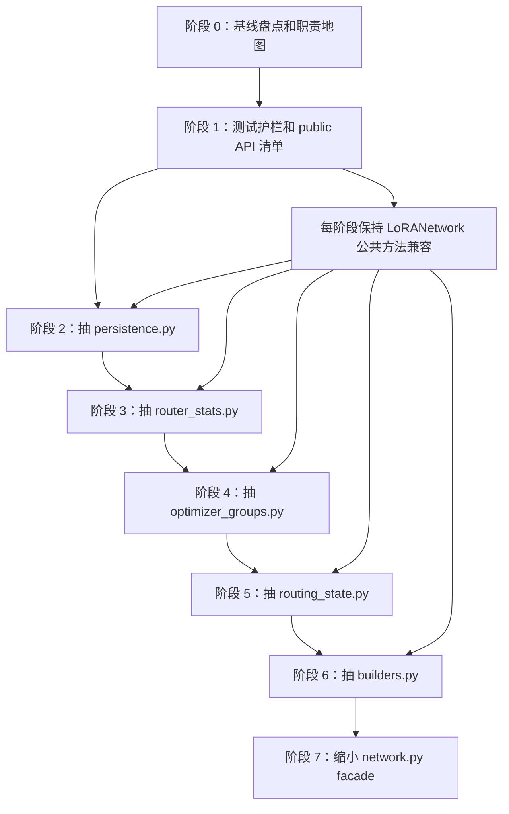

# LoRANetwork 分层拆分迁移提案

状态：活跃提案
适用版本：当前 main
入口命令：无，本文是 `networks/lora_anima/network.py` 的重构计划
基线日期：2026-07-06
相关代码：
- `networks/lora_anima/network.py`
- `networks/lora_anima/config.py`
- `networks/lora_anima/factory.py`
- `networks/lora_anima/loading.py`
- `networks/lora_anima/targeting.py`
- `networks/lora_modules/*`
- `networks/lora_save.py`
- `tests/test_lora_network_construction.py`
- `tests/test_global_router.py`
- `tests/test_hydra_sigma_band.py`
- `tests/test_chimera_router_stats.py`
- `tests/test_lora_register_tokens.py`
- `tests/test_network_registry.py`

## 核心结论

一句话：先把 `LoRANetwork` 降级成 facade，构建、路由状态、统计、持久化和优化器分组逐步搬到小模块。

`networks/lora_anima/network.py` 现在同时承担这些职责：

- 构建 LoRA / Hydra / Chimera / ReFT / register token 模块。
- 维护 timestep、sigma、FEI、global routing、chimera content/freq routing 等运行时状态。
- 汇总 router stats、balance loss、grad stats 和训练 metrics。
- 负责 load、save metadata、merge、optimizer param groups。
- 直接维护训练和推理都依赖的公共 API。

目标不是一口气重写网络层，而是像 `anima-app` runtime 迁移一样：先立边界和护栏，再搬低风险逻辑，最后缩小 `LoRANetwork` 本体。

## 实施边界

一句话：本计划只拆 LoRA family 的 network 层，不顺手改算法行为、训练循环或 checkpoint 格式。

本轮允许触碰：

- `networks/lora_anima/network.py`
- `networks/lora_anima/*.py` 新增小模块
- `tests/test_lora_*`
- `tests/test_global_router.py`
- `tests/test_hydra_sigma_band.py`
- `tests/test_chimera_router_stats.py`
- `tests/test_network_registry.py`
- 本文档和 `docs/proposal/README.md`

本轮默认不触碰：

- `train.py`
- `library/inference/generation.py`
- `library/runtime/harness.py`
- `configs/methods/*.toml`
- `configs/gui-methods/*.toml`
- `custom_nodes/*/_vendor/`
- 任何真实模型、训练输出、队列和历史任务数据

如果某一阶段必须改训练或推理调用点，需要先单独写明：

- 为什么 facade 不能兼容旧调用。
- 影响哪些入口。
- 跑哪些定向测试。
- 如何回滚。

## 迁移不变量

一句话：每一步都要保持外部 API 和 checkpoint 行为不变，只改变代码摆放位置。

- `LoRANetwork` 类名、构造参数和主要公共方法短期保持不变。
- `factory.create_network()` 和 `create_network_from_weights()` 的返回形态保持不变。
- `save_weights()` 写出的 metadata key 不变，除非另有迁移说明和兼容测试。
- `load_weights()` 对旧 checkpoint 的兼容拒绝逻辑不变。
- `set_sigma()`、`set_fei()`、`set_routing_weights()` 的 aliasing 和 autograd 语义不变。
- `compile after apply` 不变量不变：adapter apply/load 后才能 compile。
- `GlobalRouter`、`FreqRouter`、`ContentRouter` 的训练梯度路径不能被 detach 或 copy 破坏。
- 新模块只能拆职责，不能顺手改算法、默认配置或 checkpoint 格式。
- 每迁出一块，`network.py` 行数和对应职责必须下降，不能只换个地方再堆一个新上帝文件。

## 目标结构

一句话：目标是让 `network.py` 只负责组装和对外兼容，重逻辑进入领域模块。

目标目录结构：

```text
networks/lora_anima/
  network.py              # facade：构造入口、公共 API、兼容 shim
  config.py               # 已有：配置解析和 metadata 恢复
  factory.py              # 已有：网络创建入口
  loading.py              # 已有：checkpoint key 兼容和拒绝逻辑
  targeting.py            # 已有：目标模块收集
  builders.py             # 新增：模块构建和 class/kwargs 选择
  routing_state.py        # 新增：sigma/FEI/routing buffer wire/set/clear
  router_stats.py         # 新增：router stats、balance loss、grad stats
  routers.py              # 新增：GlobalRouter / FreqRouter / ContentRouter
  application.py          # 新增：apply_to / set_multiplier / lifecycle helper
  persistence.py          # 新增：metadata stamp、load/save 辅助
  optimizer_groups.py     # 新增：optimizer param groups 和 LR 描述
  merge.py                # 新增：merge_to / fuse / unfuse / pre_calculation
  regularization.py       # 新增：max-norm regularization
```

目标调用形态：

```python
class LoRANetwork(torch.nn.Module):
    def save_weights(self, file, dtype, metadata):
        return persistence.save_lora_network(self, file, dtype, metadata)

    def set_fei(self, fei):
        return routing_state.set_fei(self, fei)

    def prepare_optimizer_params_with_multiple_te_lrs(self, text_encoder_lr, unet_lr, default_lr):
        return optimizer_groups.prepare_lora_optimizer_params(
            self, text_encoder_lr, unet_lr, default_lr
        )
```

第一阶段不追求马上达到完整目录，只先抽低风险模块，保持行为完全一致。

## 当前基线

一句话：当前最大风险不是单纯行数，而是多个变化速度不同的职责挤在一个类里。

2026-07-06 的只读盘点结果：

| 指标 | 数量 / 范围 |
| --- | ---: |
| `network.py` 总行数 | 3278 |
| `LoRANetwork` 起点 | line 468 |
| `LoRANetwork.__init__` 大致范围 | line 489-1227 |
| shared buffer / runtime state 方法 | line 1229-1930 |
| router stats / metrics 方法 | line 1985-2722 |
| load/save/merge/optimizer 方法 | line 2724-3197 |

高风险职责区：

| 区域 | 当前内容 | 风险 |
| --- | --- | --- |
| 构建区 | `__init__` 内部 `create_modules()`、module class 选择、plugin kwargs、router 创建 | 改一处容易影响所有 adapter |
| routing state | sigma/FEI/global/chimera buffer aliasing 和 clear/set 生命周期 | 容易破坏 `torch.compile` 指针稳定或 router 梯度 |
| metrics/stats | balance loss、router stats、grad stats、metrics keys | 容易破坏日志、训练诊断和性能 |
| persistence | metadata stamp、load key cleanup、save pipeline | 容易破坏 checkpoint 兼容 |
| optimizer groups | LoRA+、router scale、chimera scale、register token lr | 容易破坏训练学习率 |
| merge/apply | `apply_to()`、`merge_to()`、fuse/unfuse/pre_calculation | 容易破坏推理和静态 merge |

第一批建议只抽低风险且测试容易覆盖的区域：

| 优先级 | 目标 | 原因 |
| --- | --- | --- |
| 1 | `persistence.py` | 边界清楚，已有 save metadata 测试 |
| 2 | `router_stats.py` | 计算逻辑可纯函数化，已有 stats/metrics 测试 |
| 3 | `optimizer_groups.py` | 可通过 param group 描述测试守住行为 |
| 4 | `routing_state.py` | 收益大，但 aliasing/autograd 风险高，放到护栏更足后 |
| 5 | `builders.py` | 涉及构建主路径，最后拆 |

## 依赖图

一句话：先做基线和护栏，再搬低风险逻辑，最后拆构建主路径。



## 阶段路线

一句话：每个阶段只搬一个职责，不同时改结构和行为。

| 阶段 | 目标 | 做什么 | 暂时不做什么 | 完成标准 |
| --- | --- | --- | --- | --- |
| 阶段 0 | 建基线 | 记录行数、职责区、公共方法、测试覆盖 | 不改代码 | 有职责地图和测试矩阵 |
| 阶段 1 | 立护栏 | 增加 public API、metadata、routing aliasing、optimizer group 的回归测试 | 不抽大模块 | 新增测试能防止关键行为漂移 |
| 阶段 2 | 抽 persistence | 移出 `_stamp_lora_save_metadata()`、strip/load/save 辅助 | 不改 metadata key | save/load 测试通过，`network.py` 只保留 facade |
| 阶段 3 | 抽 router stats | 移出 stats、balance loss、grad stats、metrics 辅助 | 不改 metrics key | stats/metrics 测试通过 |
| 阶段 4 | 抽 optimizer groups | 移出 param group 分组和 LR 描述 | 不改 LR 计算规则 | optimizer params 测试通过 |
| 阶段 5 | 抽 routing state | 移出 shared buffer wire/set/clear | 不改 router 梯度路径 | aliasing/autograd 测试通过 |
| 阶段 6 | 抽 builders | 移出 `create_modules()` 和模块 class 选择 | 不改目标模块集合 | construction/registry 测试通过 |
| 阶段 7 | 缩 facade | 删除死 shim，抽出 router 类，更新文档 | 不做算法重写 | `network.py` 明显变薄，职责稳定 |

## 任务卡片

一句话：任务卡要让后续执行者知道改哪里、交什么、怎么验收。

| task_id | role | objective | input_scope | output_format | acceptance_criteria | eta | write_scope | sandbox | risk_level |
| --- | --- | --- | --- | --- | --- | --- | --- | --- | --- |
| `L0-baseline` | explorer | 盘点 `LoRANetwork` 方法、职责、调用和测试覆盖 | `network.py`、`tests/test_*lora*`、`tests/test_global_router.py` | 职责表和测试矩阵 | 每个迁移阶段都有对应测试入口 | 45m | 文档 | read-only | Low |
| `L1-guards` | worker | 给公共 API、metadata、routing aliasing 和 optimizer groups 加护栏 | tests | pytest 用例 | 行为变动会失败，旧逻辑仍通过 | 90m | tests | workspace-write | Medium |
| `L2-persistence` | worker | 抽 `persistence.py` | `network.py` save/load 区 | 小补丁 | metadata key 不变，save/load 测试通过 | 90m | `network.py`、`persistence.py`、tests | workspace-write | Medium |
| `L3-router-stats` | worker | 抽 `router_stats.py` | balance/stats/metrics 区 | 小补丁 | metrics key 不变，stats 测试通过 | 2h | `network.py`、`router_stats.py`、tests | workspace-write | Medium |
| `L4-optimizer-groups` | worker | 抽 `optimizer_groups.py` | optimizer param group 区 | 小补丁 | LR 和 descriptions 不变 | 2h | `network.py`、`optimizer_groups.py`、tests | workspace-write | Medium |
| `L5-routing-state` | worker | 抽 `routing_state.py` | wire/set/clear routing 区 | 分阶段补丁 | aliasing、autograd、clear 行为不变 | 3h | `network.py`、`routing_state.py`、tests | workspace-write | High |
| `L6-builders` | worker | 抽 `builders.py` | `__init__` 构建区 | 分阶段补丁 | 构建出的 lora/reft/register 集合不变 | 3h+ | `network.py`、`builders.py`、tests | workspace-write | High |
| `L7-facade-cleanup` | reviewer | 删除死 shim 和更新文档 | `network.py`、proposal、networks docs | 清理补丁 | `network.py` 只保留 facade 和兼容入口 | 60m | docs + small code cleanup | workspace-write | Medium |

执行原则：

- 同一轮不要让多个任务同时改 `network.py` 同一区域。
- 可以并行做只读盘点、测试设计和文档更新。
- 写代码时按阶段串行合并，避免 import 循环和大型冲突。
- 每阶段提交前跑对应测试，不能只靠 `node --check` 或静态阅读。

## 阶段 0：基线盘点

一句话：先把 `LoRANetwork` 现在到底管了什么写清楚。

建议统计：

```bash
wc -l networks/lora_anima/network.py
rg -n "^class |^    def |^def " networks/lora_anima/network.py
rg -n "LoRANetwork|create_network|save_weights|prepare_optimizer_params|set_fei|set_sigma" tests networks library scripts
```

建议产物：

- 方法清单。
- 方法到职责的映射表。
- 每个职责对应的测试文件。
- 第一批可搬迁函数清单。

## 阶段 1：测试护栏

一句话：先让危险行为有测试守住，再开始搬家。

建议新增或确认这些测试：

| 行为 | 推荐测试入口 |
| --- | --- |
| metadata stamp 不变 | `tests/test_lora_network_construction.py`、`tests/test_lora_save_pipeline.py` |
| load key 兼容和拒绝逻辑不变 | `tests/test_lora_loading_keys.py`、`tests/test_network_registry.py` |
| `set_sigma()` aliasing 恢复 | `tests/test_hydra_sigma_band.py` |
| `set_fei()` 和 global router 梯度路径 | `tests/test_global_router.py` |
| chimera router stats key 不变 | `tests/test_chimera_router_stats.py` |
| optimizer group LR 和 descriptions 不变 | `tests/test_lora_register_tokens.py` 或新增专测 |
| public API 仍存在 | 新增 lightweight API test |

public API 过渡清单：

```text
apply_to
load_weights
save_weights
merge_to
is_mergeable
prepare_optimizer_params_with_multiple_te_lrs
set_multiplier
set_timestep_mask
clear_timestep_mask
set_sigma
clear_sigma
set_fei
clear_fei
set_routing_weights
clear_routing_weights
set_crossattn_routing
set_content
clear_step_caches
get_balance_loss
get_router_stats
get_chimera_router_stats
metrics
```

## 阶段 2：抽 persistence.py

一句话：第一刀抽保存/加载辅助，因为边界最清楚、行为最好测。

建议移动：

- `_stamp_lora_save_metadata`
- `_strip_orig_mod_keys`
- `load_weights` 的 key cleanup orchestration
- `_reabsorb_baked_inv_scale`
- `save_weights` 的 metadata + `lora_save.save_network_weights` 调用

过渡方式：

- `network.py` 保留同名方法，只转发到 `persistence.py`。
- metadata 写入顺序和 key 名保持不变。
- 不改 `networks/lora_anima/loading.py` 的现有拒绝函数语义。

阶段完成后，`network.py` 不再直接知道大部分 metadata stamp 细节。

## 阶段 3：抽 router_stats.py

一句话：第二刀抽诊断和 metrics，降低 `network.py` 的读写噪音。

建议移动：

- `step_balance_loss_warmup`
- `_switch_balance`
- `get_balance_loss`
- `_get_chimera_balance_loss`
- `get_router_entropy`
- `get_router_stats`
- `get_chimera_router_stats`
- `capture_up_grad_stats`
- `get_up_grad_stats`
- `get_ortho_regularization`
- `metrics`

注意事项：

- metrics key 名必须不变。
- D2H 时机不能变，避免重新引入同步开销。
- cache 生命周期仍由 `clear_step_caches()` 管。

## 阶段 4：抽 optimizer_groups.py

一句话：第三刀抽 optimizer 参数分组，避免 LR 规则继续塞进网络类。

建议移动：

- `set_loraplus_lr_ratio`
- `prepare_optimizer_params_with_multiple_te_lrs`
- param group assemble helper
- global/chimera/register token router LR group 规则

注意事项：

- `lr_descriptions` 文案保持不变。
- `router_lr_scale`、`freq_router_lr_scale`、`content_router_lr_scale` 组合方式保持不变。
- `reg_lrs` 正则匹配语义保持不变。

## 阶段 5：抽 routing_state.py

一句话：第四刀再碰运行时 buffer，因为这是最容易破坏训练正确性的区域。

建议移动：

- `_wire_shared_sigma_buffers`
- `_wire_shared_fei_buffers`
- `_wire_shared_routing_buffers`
- `_wire_shared_content_routing_buffers`
- `_wire_shared_freq_routing_buffers`
- `set_timestep_mask`
- `set_reft_timestep_mask`
- `clear_timestep_mask`
- `set_sigma`
- `clear_sigma`
- `set_fei`
- `clear_fei`
- `set_routing_weights`
- `clear_routing_weights`
- `set_crossattn_routing`
- `set_freq_routing_weights`
- `clear_freq_routing_weights`
- `set_content`
- `set_content_routing_weights`
- `clear_content_routing_weights`
- `clear_step_caches`

硬规则：

- `set_routing_weights()` / `set_freq_routing_weights()` / `set_content_routing_weights()` 不能 detach。
- sigma/FEI clear 继续用 in-place 清理，避免破坏 compile 指针稳定。
- `set_fei()` 必须继续负责 global router firing + broadcast。
- chimera freq router 仍要求同一步里 `set_sigma()` 先于 `set_fei()`。

## 阶段 6：抽 builders.py

一句话：最后再拆构建主路径，因为这里影响所有 adapter 是否被正确挂载。

建议移动：

- `__init__` 内部 `create_modules()`
- module class resolution
- router target regex 命中逻辑
- per-variant constructor kwargs 组装
- RegisterInjector 创建逻辑
- global router / chimera router 创建辅助

过渡方式：

- 先引入 `BuildResult` 或轻量 dataclass，把 `unet_loras`、`text_encoder_loras`、`refts`、router refs、counter 一次性返回。
- `LoRANetwork.__init__` 只接收结果并挂属性。
- 不改现有 `LoRANetworkCfg` 字段语义。

## 验证矩阵

一句话：每阶段只跑相关测试，但必须覆盖直接风险。

| 阶段 | 最小验证 |
| --- | --- |
| persistence | `timeout 60 .venv/bin/python -m pytest tests/test_lora_network_construction.py tests/test_lora_save_pipeline.py tests/test_lora_loading_keys.py` |
| router stats | `timeout 60 .venv/bin/python -m pytest tests/test_chimera_router_stats.py tests/test_global_router.py` |
| optimizer groups | `timeout 60 .venv/bin/python -m pytest tests/test_lora_register_tokens.py tests/test_network_registry.py` |
| routing state | `timeout 60 .venv/bin/python -m pytest tests/test_hydra_sigma_band.py tests/test_global_router.py tests/test_router_compute.py` |
| builders | `timeout 60 .venv/bin/python -m pytest tests/test_lora_network_construction.py tests/test_network_registry.py tests/test_method_network_lifecycle.py` |
| 文档-only | `git diff --check -- docs/proposal docs/archive-index.md _archive/docs/proposal` |

必要时再补：

```bash
timeout 60 .venv/bin/python -m pytest tests/test_inference_adapter_capabilities.py
timeout 60 .venv/bin/python -m pytest tests/test_runtime_harness_cli.py
```

## 回滚策略

一句话：每阶段都应该能单独 revert，不依赖后续阶段才能恢复。

- 每阶段独立提交。
- 新模块先由 facade 调用，旧公共方法保留。
- 出现回归时优先 revert 当前阶段，不回滚已验证的前置阶段。
- 不做跨阶段批量格式化，降低 revert 冲突。
- 不同时修改 config 默认值、checkpoint metadata 和 runtime 行为。

## 完成定义

一句话：不是把文件切碎就算完成，必须让职责真的变清楚。

完成条件：

- `network.py` 中每个大块职责都有明确归属模块。
- `LoRANetwork` 对外仍兼容现有训练、推理、保存、加载、merge 入口。
- metadata、optimizer groups、routing aliasing、metrics key 都有测试覆盖。
- 没有新增超过 1000 行的新上帝文件。
- `networks/CLAUDE.md` 或本计划同步更新新的模块地图。
- 相关定向测试通过。
