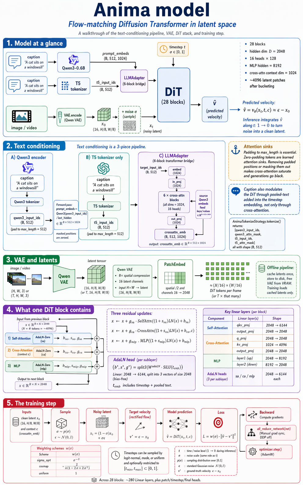

# Anima model

A walkthrough of how the Anima diffusion model is put together — the text-conditioning pipeline, the VAE, the DiT block stack, and how a training step flows through all of it.



---

## 1. The model at a glance

Anima is a **flow-matching DiT** (Diffusion Transformer) operating in latent space:

```
              ┌──────────┐  ┌────┐  ┌────────────┐                      ┌─────────────┐
  caption ──▶ │ Qwen3-.6B│─▶│LLM │─▶│ crossattn_ │─ context (B,512,1024)│             │
              └──────────┘  │Adpt│  │    emb     │                     ▶│             │
              ┌──────────┐  └────┘  └────────────┘                      │   DiT       │── v̂
  caption ──▶ │ T5 tok.  │──────▶   t5_input_ids (target-side embed)    │  (28 blks)  │
              └──────────┘                                               │             │
  image/vid ─▶ VAE.encode ─▶ x₀ ──(+ noise σ)──────────────────────────▶ │             │
                                                                         │             │
  timestep t ─────────────────────────────────────────────────────────▶  └─────────────┘
```

The DiT's output $\hat v$ is the **predicted velocity** at the noisy point $x_t$ — a tensor of the same shape as the latent that, under rectified flow, points from the noise toward the clean data: $\hat v = v_\theta(x_t, t, c) \approx \varepsilon - x_0$. Integrating $\hat v$ along the trajectory $t: 1 \to 0$ at inference time is what turns pure noise into a latent the VAE can decode. Training teaches the DiT to make $\hat v$ match the true velocity; see §5 for the loss.

- **DiT.** `class Anima` in `library/anima/models.py:1227–1816`. 28 `Block`s with hidden dim `D = 2048`, 16 heads × 128 head-dim, MLP expansion ratio 4 → hidden `8192`. Cross-attention `context_dim = 1024`.
- **Token budget.** Bucketing sorts each batch into one of two token-count families (4032 / 4200 patches), each bucket *exactly* filling its count — so by default forwards run at native token counts with no intra-bucket padding.

---

## 2. Text conditioning

Text conditioning in Anima is **not** a single "encode and project" step — it's a small pipeline made of three pieces: a Qwen3 encoder, a T5 tokenizer (tokenizer only, not the encoder), and a learned bridge called the **LLMAdapter**. The output of that pipeline, `crossattn_emb ∈ ℝ^{B×512×1024}`, is what every DiT block sees in cross-attention.

### 2.1 Two tokenizers, one encoder

Bundled under `library/anima/configs/`:

- `qwen3_06b/` — **Qwen2Tokenizer** for Qwen3-0.6B. Vocab 151,936, `hidden_size = 1024`, positional budget 32,768.
- `t5_old/` — **T5TokenizerFast**, sentencepiece-based.

Both tokenize the same caption. Both pad **unconditionally** to `max_length = 512` with `padding="max_length"` (`library/anima/strategy.py:75–76, 86–87`). That padding is load-bearing — see §2.4.

The T5 tokenizer is present even though **T5 itself is never loaded**. Only its token IDs are used, as the *target-side* input to the LLMAdapter (§2.3). This saves the ~11 GB T5-XXL encoder and still gives the adapter a second tokenization to cross-attend against.

`AnimaTokenizeStrategy.tokenize()` (`strategy.py:67–91`) returns four tensors, all shape `(B, 512)`:

```
[qwen3_input_ids, qwen3_attn_mask, t5_input_ids, t5_attn_mask]
```

### 2.2 Qwen3 forward

Qwen3-0.6B is loaded in `library/anima/weights.py:365–453` as the `.model` of the causal LM (no LM head), **bf16** by default. `AnimaTextEncodingStrategy.encode_tokens()` (`strategy.py:104–135`) runs it and takes `last_hidden_state`:

$$
\text{prompt\_embeds} = \text{Qwen3}(\text{qwen3\_input\_ids})_{\text{last\_hidden}}
\ \in \mathbb{R}^{B\times 512\times 1024}
$$

Positions where the attention mask is `False` are zeroed (`strategy.py:133`):

```python
prompt_embeds[~qwen3_attn_mask.bool()] = 0
```

That gives us the source embeddings for the adapter.

### 2.3 LLMAdapter: bridging Qwen3 → DiT context

`LLMAdapter` (`library/anima/models.py:2145–2223`) is a **6-block transformer** that cross-attends between the T5 token embeddings (queries / "target") and the Qwen3 hidden states (keys/values / "source"):

```
target_input_ids  ─▶ embed(.)  ─▶ in_proj(.)  ─▶ ┌──────────────┐
                                                 │  6 × Block   │
source Qwen3 embeds ───────────────────────────▶ │ (cross-attn) │ ─▶ out_proj(.) ─▶ crossattn_emb
                                                 └──────────────┘
```

All three dims (`source_dim`, `target_dim`, `model_dim`) are `1024` (models.py:2145–2183), so the internal `in_proj` is an identity when dims match. 16 heads. Output shape: `(B, 512, 1024)`.

This output — **not** the raw Qwen3 hidden state — is what feeds the DiT cross-attention. The DiT's `cross_attn.kv_proj` projects that `1024 → 4096` (K + V fused), so no external projection is needed between the adapter and the DiT.

Why a bridge at all? The pretrained Anima was distilled against a T5-like condition stream; the adapter learns to synthesize that stream from Qwen3's cheaper-to-run hidden states. The T5 tokenizer's vocabulary seeds the adapter with a structurally different tokenization to cross-attend against.

### 2.4 Max-padded, attention-sink behavior

One non-negotiable invariant: both training and inference must pad to `max_length` and must **NOT** mask out padding via `crossattn_seqlens`.

The pretrained Anima learned to use zero-padding positions as **attention sinks** — the cross-attention softmax relies on them as a low-energy "nowhere to look" target. If you trim `crossattn_emb` down to the actual caption length, or apply an attention mask that removes the padding, the softmax denominator collapses, cross-attention saturates, and generations go **black**.

Practically:

- The tokenizer always pads to 512.
- Zero-masked positions in `prompt_embeds` are kept (they're just exact zeros, which is fine for cross-attention as sink tokens).

### 2.5 A second path: pooled-text modulation

Cross-attention is not the only way the caption reaches the DiT. A max-pooled summary of `crossattn_emb` is also added to the timestep embedding `t_emb` before AdaLN fans it out to every block — so the caption modulates self-attn and MLP gains, not just cross-attn alignment. See `modulation.md` for the full path and why it matters for modulation guidance.

---

## 3. VAE and latents

Anima uses the **Qwen VAE** (from the Qwen-Image family), 8× spatial compression, 16 latent channels. An input image of `H × W` pixels becomes a latent of shape `(16, H/8, W/8)`.

Latent caching (`preprocess/cache_latents.py`) is the second half of the offline pipeline: run the VAE over every training image once, write the latents to disk, free the VAE from VRAM. During training, only cached latents are loaded — the VAE does not need to be resident.

PatchEmbed inside the DiT then divides the latent spatially by 2 and maps channels `16 → 2048`, giving roughly `(H/16) × (W/16)` DiT tokens per frame.

---

## 4. What one DiT block contains

One `Block` (`library/anima/models.py:962–1223`) has three residual sub-layers, each gated by **AdaLN-Zero** modulation:

$$
\begin{aligned}
x &\leftarrow x + g_{\text{sa}} \cdot \text{SelfAttn}\!\big((1+s_{\text{sa}})\,\text{LN}(x) + b_{\text{sa}}\big) \\
x &\leftarrow x + g_{\text{ca}} \cdot \text{CrossAttn}\!\big((1+s_{\text{ca}})\,\text{LN}(x) + b_{\text{ca}},\ c\big) \\
x &\leftarrow x + g_{\text{mlp}} \cdot \text{MLP}\!\big((1+s_{\text{mlp}})\,\text{LN}(x) + b_{\text{mlp}}\big)
\end{aligned}
$$

Each `(shift, scale, gate)` triple is produced per sub-layer by a small head:

$$
(b_\star,\,s_\star,\,g_\star)\ =\ \text{split}_3\!\big(W_\star^{\text{adaLN}}\,\text{SiLU}(t_{\text{emb}})\big),
\quad W_\star^{\text{adaLN}} \in \mathbb{R}^{6D \times D}
$$

i.e. a `Linear(2048 → 6144)` that is then split into three `2048`-vectors.

The concrete Linear layers inside one block:

| Sub-layer   | Module       | Linear                                | Shape (in → out)   |
| ----------- | ------------ | ------------------------------------- | ------------------ |
| self-attn   | `self_attn`  | `qkv_proj` (fused Q,K,V)              | 2048 → 6144        |
|             |              | `output_proj`                         | 2048 → 2048        |
| cross-attn  | `cross_attn` | `q_proj`                              | 2048 → 2048        |
|             |              | `kv_proj` (fused K,V on 1024-dim ctx) | 1024 → 4096        |
|             |              | `output_proj`                         | 2048 → 2048        |
| MLP         | `mlp`        | `layer1`                              | 2048 → 8192        |
|             |              | `layer2`                              | 8192 → 2048        |
| AdaLN heads | `adaln_…[1]` | ×3 per sub-layer                      | 2048 → 6144        |

Across 28 blocks that is ~280 `Linear`s, plus the patch-embed / timestep-embed / final-layer heads outside the stack.

---

## 5. The training step

Flow-matching with the rectified-flow parameterization. For a clean latent $x_0$ and independent Gaussian noise $\varepsilon \sim \mathcal{N}(0, I)$, sample $\sigma \in [0,1]$ and form:

$$
x_t = (1-\sigma)\,x_0 + \sigma\,\varepsilon
$$

(`library/runtime/noise.py:160–164`). The DiT predicts the straight-line **velocity**, and the target is:

$$
v^\star = \varepsilon - x_0,
\qquad
\hat v = v_\theta(x_t,\,t,\,c)
$$

(`train.py:841` — literally `target = noise - latents`). Loss is $\sigma$-weighted MSE:

$$
\mathcal{L}\ =\ \mathbb{E}_{x_0,\varepsilon,\sigma}\!\left[w(\sigma)\cdot \big\|\hat v - v^\star\big\|_2^2\right]
$$

with weighting chosen by `--weighting_scheme` (`library/runtime/noise.py:83–92`):

$$
w(\sigma) =
\begin{cases}
  \sigma^{-2} & \text{sigma\_sqrt} \\[2pt]
  \dfrac{2}{\pi\,(1 - 2\sigma + 2\sigma^2)} & \text{cosmap} \\[2pt]
  1 & \text{uniform}
\end{cases}
$$

Timesteps are sampled via logit-normal / mode / uniform (`compute_density_for_timestep_sampling`) and optionally restricted to a $[t_\text{min}, t_\text{max}]$ window (P-GRAFT style).

The full step:

```
  x_0, c  ──▶ σ ~ p(σ),  ε ~ N(0,I)
            │
            ▼
         x_t = (1-σ)·x_0 + σ·ε
            │
            ▼
         v̂ = DiT(x_t, t, c)
            │
            ▼
         L  = w(σ)·‖v̂ − (ε − x_0)‖²
            │
            ▼        backward
         optimizer.step()
```
