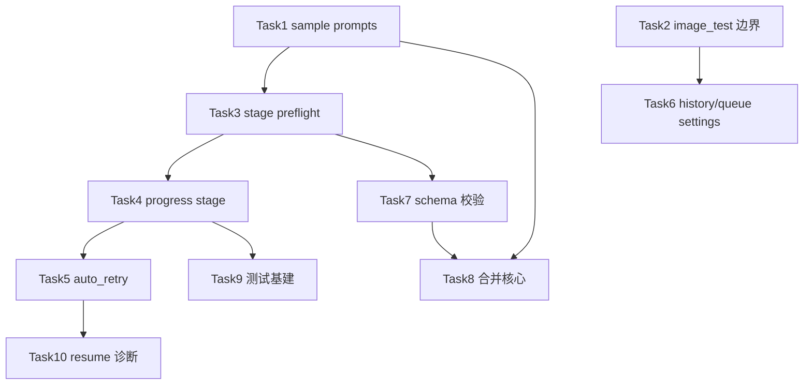

# 后端配置优化与严格 Debug 推进 Implementation Plan

> **For agentic workers:** REQUIRED SUB-SKILL: Use superpowers:subagent-driven-development (recommended) or superpowers:executing-plans to implement this plan task-by-task. Steps use checkbox (`- [ ]`) syntax for tracking.

**Goal:** 在不破坏现有训练主链路的前提下，把后端配置真相、路径安全、stage 可观测、队列策略做成可长期推进且每步可测的优化路线。

**Architecture:** 向 `library/config` / `library/env` / `path_safety` 收敛真相源；Web 服务层只做编排与门禁；每个 Task 严格 TDD + 域级测试包 + 跨域最小回归。

**Tech Stack:** Python 3.13、aiohttp Web 服务、pytest、现有 `web/services/**`、`library/config/**`、`library/training/**`。

**Spec:** `docs/superpowers/specs/2026-07-11-backend-config-optimization-design.md`

## Global Constraints

- 所有用户可见文案用简体中文；代码标识保持现有英文键名。
- 后台测试命令加 `timeout 60`，优先 `.venv/bin/python`。
- 不启动真实长训练、不下载大模型、不删除用户 history/queue/runtime 数据。
- 热点大文件只做小范围接入；新逻辑优先新模块/helper。
- 工作区可能已有无关改动：只提交本计划相关文件，不 revert 他人改动。
- Round 1–3 不主动大拆 `_legacy` shim。
- 每个 Task 结束必须留下：失败测试命令、通过测试命令、变更文件列表。

---

## Auto Iteration

本计划接入五轮自动迭代协议：

- 协议：`docs/superpowers/specs/2026-07-11-five-round-auto-iteration-protocol.md`
- 设计补充：`docs/superpowers/specs/2026-07-11-backend-config-optimization-design.md` §10
- 日志：`docs/superpowers/plans/2026-07-11-fullstack-auto-iteration-log.md`
- 前端计划：`docs/superpowers/plans/2026-07-11-frontend-config-optimization.md`

每轮必须更新：后端评分卡、前端评分卡、本轮焦点、测试门禁、下轮焦点。

**对照实现分支：** `feat/backend-config-optimization` 已落地本计划 Task1–10 代码（sample prompts、image_test、stage 门禁、progress stage、auto_retry、history/queue roots、schema、merge core、http contracts、resume 诊断）。文档分支保留计划真相；合并时以测试绿为准。

## File Map

| 文件 | 职责 |
|---|---|
| `web/services/config/sample_prompts.py` | 外置 configs 下 sample prompts 读写 |
| `web/services/config/merge.py` | Web 合并入口，逐步接 library 真相 |
| `library/config/io.py` / `schema.py` | 训练合并与 schema 校验真相 |
| `web/services/config/raw_files.py` | raw save/patch 校验 |
| `web/services/config/preflight*.py` | 启动前门禁，含 stage/schema |
| `web/services/training/runtime_prepare.py` | runtime 冻结与 stage 校验接入 |
| `library/training/stage_schedule.py` | stage 规范化与校验 |
| `library/training/progress.py` / `loop.py` | progress 事件 stage 字段 |
| `web/services/training/progress_parser.py` / `history_timeline.py` | 消费 stage 字段 |
| `web/services/training/queue_control.py` / `queue_dispatch.py` / `service_state.py` | 队列策略配置 |
| `web/services/image_test_service.py` | 权重搜索边界 |
| `web/services/path_safety.py` | 公共 allowlist |
| `web/services/settings_service.py` / `library/env.py` | history/queue root 与全局设置 |
| `tests/test_web_config_*.py` 等 | 各域契约与回归 |

---

## Debug Gate（每个 Task 强制）

1. **先写/改失败测试**（红）
2. **跑 L1/L2 看红因**
3. **最小实现**
4. **跑域测试包（绿）**
5. **跑跨域最小回归包**
6. **提交本 Task 相关文件**

跨域最小回归：

```bash
timeout 60 .venv/bin/python -m pytest \
  tests/test_training_queue.py \
  tests/test_training_runtime_config_core.py \
  tests/test_training_history_list.py \
  tests/test_preview_service.py \
  tests/test_web_config_preflight.py \
  tests/test_stage_schedule.py -q
```

失败诊断模板：

```text
1. 状态错误 or 路径错误？
2. configs_root / output_root / history / queue / runtime fixture 是否正确？
3. monkeypatch 是否盖住真实入口？
4. 是否只是字符串契约噪音？
5. 是否涉及 queue backup / orphan running / launch lock？
```

---

### Task 1: Sample Prompts 外置 configs 根修复

**Files:**
- Modify: `web/services/config/sample_prompts.py`
- Modify: `tests/test_web_config_sample_prompts.py`
- Test: `tests/test_web_config_sample_prompts.py`

**Interfaces:**
- Consumes: `CONFIGS_DIR = get_configs_root()` / `paths.safe_resolve`
- Produces: sample prompts 读写始终落在当前 configs root，不再写死 `ROOT / "configs"/...`

- [ ] **Step 1: 写失败测试 — 外置 configs_root 下 fork/读写**

在 `tests/test_web_config_sample_prompts.py` 追加：

```python
def test_sample_prompts_fork_uses_external_configs_root(tmp_path: Path, monkeypatch):
    external = tmp_path / "ext-configs"
    (external / "gui-methods").mkdir(parents=True)
    (external / "sample-prompts" / "gui-methods").mkdir(parents=True)
    train_cfg = external / "gui-methods" / "lora.toml"
    train_cfg.write_text("output_name = \"demo\"\n", encoding="utf-8")

    monkeypatch.setattr(sample_prompts_mod, "CONFIGS_DIR", external)
    monkeypatch.setattr(sample_prompts_mod, "ROOT", tmp_path)
    # 视模块同步方式再 sync facade

    result = sample_prompts_mod.save_sample_prompts(
        "a\nb\n",
        training_config_file="gui-methods/lora.toml",
    )
    saved = Path(result["path"] if isinstance(result, dict) else result)
    assert external in saved.parents or str(saved).startswith(str(external))
    assert "sample-prompts" in saved.as_posix()
    assert saved.read_text(encoding="utf-8").splitlines()[0].strip() == "a"
```

> 实现时按现有函数签名微调断言；关键点是**不能写到项目 ROOT/configs**。

- [ ] **Step 2: 跑测试确认失败**

```bash
timeout 60 .venv/bin/python -m pytest tests/test_web_config_sample_prompts.py -k external_configs_root -v
```

Expected: FAIL（当前 `ROOT / normalized` 与 `startswith("configs/")` 逻辑）

- [ ] **Step 3: 最小实现**

修改 `sample_prompts.py`：

1. 所有读写路径用 `CONFIGS_DIR` / `safe_resolve`，禁止 `ROOT / "configs"/...` 硬拼
2. fork 相对路径相对于 **configs root**，不是项目 ROOT
3. 校验“必须在 configs 树内”时，用 `Path.resolve().relative_to(CONFIGS_DIR.resolve())`，不要 `startswith("configs/")`

示意：

```python
def _resolve_prompt_path(rel_or_abs: str) -> Path:
    path = _safe_resolve(rel_or_abs)
    if path is None:
        raise ValueError("无效 sample prompts 路径")
    try:
        path.resolve().relative_to(CONFIGS_DIR.resolve())
    except ValueError as exc:
        raise ValueError("sample prompts 必须位于 configs 根内") from exc
    return path
```

- [ ] **Step 4: 跑域测试**

```bash
timeout 60 .venv/bin/python -m pytest tests/test_web_config_sample_prompts.py tests/test_global_settings_runtime.py -q
```

Expected: PASS

- [ ] **Step 5: 跨域最小回归 + 提交**

```bash
timeout 60 .venv/bin/python -m pytest \
  tests/test_training_queue.py \
  tests/test_training_runtime_config_core.py \
  tests/test_training_history_list.py \
  tests/test_preview_service.py \
  tests/test_web_config_preflight.py \
  tests/test_stage_schedule.py -q
```

```bash
git add web/services/config/sample_prompts.py tests/test_web_config_sample_prompts.py
git commit -m "fix: route sample prompts through external configs root"
```

---

### Task 2: 收紧 image_test 权重搜索边界

**Files:**
- Modify: `web/services/image_test_service.py`
- Modify: `tests/test_image_test_service.py`
- Optional Modify: `web/services/path_safety.py`
- Test: `tests/test_image_test_service.py`

**Interfaces:**
- Consumes: `settings_service.resolve_output_root()`、当前 training output
- Produces: 默认搜索仅限 preferred/output/models；`$HOME` fallback 默认关闭

- [ ] **Step 1: 写失败测试 — 默认不扫 home**

在 `tests/test_image_test_service.py` 调整/新增：

```python
def test_resolve_image_test_weight_path_does_not_search_home_by_default(monkeypatch, tmp_path):
    home = tmp_path / "home"
    home.mkdir()
    target = home / "mystery.safetensors"
    target.write_bytes(b"x")
    monkeypatch.setattr(Path, "home", classmethod(lambda cls: home))
    # 不提供完整路径，只给文件名，且 preferred/output 下不存在
    with pytest.raises(ValueError):
        image_test_service._resolve_image_test_weight_path("mystery.safetensors", app=fake_app)
```

并保留/改写：完整绝对路径仍可解析（若在 allowlist 或显式 absolute 策略下）。

- [ ] **Step 2: 跑红**

```bash
timeout 60 .venv/bin/python -m pytest tests/test_image_test_service.py -k "home or weight_path" -v
```

Expected: 现有 “accepts bare filename from user home” 相关用例需要按新策略改写为失败/需开关。

- [ ] **Step 3: 最小实现**

1. `_fallback_image_test_weight_dirs` 默认返回 `[]`
2. 若保留兼容，读取设置 `image_test_allow_home_search=false`（默认 false）
3. `_search_image_test_weight_dirs` 去掉无边界 `workspace_root = ROOT.parent.parent`
4. 搜索目录收敛：`preferred_dirs + output_root + models + 显式 absolute path`

- [ ] **Step 4: 域测试**

```bash
timeout 60 .venv/bin/python -m pytest \
  tests/test_image_test_service.py \
  tests/test_preview_service.py \
  tests/test_weight_analysis_service.py -q
```

- [ ] **Step 5: 跨域回归 + 提交**

```bash
git add web/services/image_test_service.py tests/test_image_test_service.py web/services/path_safety.py
git commit -m "fix: tighten image_test weight search boundaries"
```

---

### Task 3: stage_schedule 启动门禁（preflight + runtime）

**Files:**
- Modify: `web/services/config/preflight.py` 或 `preflight_dataset_checks.py`
- Modify: `web/services/training/runtime_prepare.py`（仅门禁调用，不塞大逻辑）
- Modify: `tests/test_web_config_preflight.py`
- Modify: `tests/test_stage_schedule.py` 或新增 `tests/test_web_stage_schedule_preflight.py`
- Test: 上述测试

**Interfaces:**
- Consumes: `library.training.stage_schedule.validate_stage_specs` / `normalize_stage_dicts`
- Produces: 非法 stage / 越界 subset /（可选）缺缓存 → preflight error

- [ ] **Step 1: 写失败测试**

```python
def test_preflight_rejects_invalid_stage_schedule_gap(tmp_path, monkeypatch):
    cfg = {
        "stage_schedule_enabled": True,
        "stage_schedule": [
            {"name": "a", "subset_index": 0, "start_pct": 0.0, "end_pct": 0.4},
            {"name": "b", "subset_index": 0, "start_pct": 0.6, "end_pct": 1.0},
        ],
        # ... minimal model/dataset fixtures ...
    }
    result = preflight_training_config(...)
    assert result["ok"] is False
    assert any("stage_schedule" in c.get("key", "") or "stage" in c.get("message", "") for c in result["checks"])
```

再加：

```python
def test_preflight_rejects_stage_subset_out_of_range(...):
    # subset_index >= dataset rows
```

- [ ] **Step 2: 跑红**

```bash
timeout 60 .venv/bin/python -m pytest tests/test_web_config_preflight.py tests/test_stage_schedule.py -k stage_schedule -v
```

- [ ] **Step 3: 实现门禁 helper**

优先新文件（避免热点膨胀），例如：

`web/services/config/preflight_stage_schedule.py`

```python
def check_stage_schedule(cfg: dict, dataset_rows: list[dict], add) -> None:
    if not bool(cfg.get("stage_schedule_enabled")):
        return
    stages = normalize_stage_dicts(cfg.get("stage_schedule"))
    problems = validate_stage_specs(stages, subset_count=len(dataset_rows))
    for msg in problems:
        add("error", "stage_schedule", msg)
```

在 `preflight_training_config` 调用。

runtime 侧：`_prepare_web_runtime_config` 在写盘前同样调用，失败抛 `ValueError`（防止绕过 preflight 直接 enqueue）。

- [ ] **Step 4: 域测试**

```bash
timeout 60 .venv/bin/python -m pytest \
  tests/test_web_config_preflight.py \
  tests/test_stage_schedule.py \
  tests/test_training_runtime_config_core.py -q
```

- [ ] **Step 5: 跨域回归 + 提交**

```bash
git commit -m "fix: validate stage_schedule in preflight and runtime prepare"
```

---

### Task 4: progress 事件写入并消费 stage 信息

**Files:**
- Modify: `library/training/progress.py`（或 step log 事件构造处）
- Modify: `library/training/loop.py`（仅传 stage 字段）
- Modify: `web/services/training/progress_parser.py`
- Modify: `web/services/training/history_timeline.py`（如需）
- Modify: `tests/test_training_progress_metrics.py`
- Optional: `tests/test_training_history_timeline.py`

**Interfaces:**
- Produces: progress step 事件包含 `stage_index` / `stage_name`（可空）
- Consumes: live_monitor / timeline 不因新字段崩溃，并能读取

- [ ] **Step 1: 写失败测试**

```python
def test_progress_parser_reads_stage_fields():
    event = {
        "type": "step",
        "step": 10,
        "loss": 0.1,
        "stage_index": 1,
        "stage_name": "mid",
    }
    parsed = progress_parser.parse_event(event)  # 按真实 API 调整
    assert parsed["stage_index"] == 1
    assert parsed["stage_name"] == "mid"
```

再补一条：旧事件无 stage 字段时保持兼容。

- [ ] **Step 2: 跑红**

```bash
timeout 60 .venv/bin/python -m pytest tests/test_training_progress_metrics.py -k stage -v
```

- [ ] **Step 3: 最小实现**

1. loop 在写 progress 时附带当前 stage
2. parser 透传字段到 metrics snapshot
3. timeline 忽略未知字段但保留 stage

- [ ] **Step 4: 域测试**

```bash
timeout 60 .venv/bin/python -m pytest \
  tests/test_training_progress_metrics.py \
  tests/test_training_history_timeline.py \
  tests/test_stage_schedule.py -q
```

- [ ] **Step 5: 跨域回归 + 提交**

```bash
git commit -m "feat: emit and parse stage fields in training progress events"
```

---

### Task 5: 队列 auto_retry / max_attempts / backoff 配置

**Files:**
- Modify: `web/services/training/service_state.py`
- Modify: `web/services/training/queue_control.py`
- Modify: `web/services/training/queue_dispatch.py`
- Modify: `web/routes/training.py`（settings payload）
- Modify: `tests/test_training_queue.py`

**Interfaces:**
- queue.json 兼容扩展：

```json
{
  "paused": false,
  "failure_policy": "pause",
  "auto_retry": false,
  "max_attempts": 1,
  "retry_backoff_sec": 0
}
```

- 默认值保持旧行为：不自动重试

- [ ] **Step 1: 写失败测试**

```python
async def test_queue_auto_retry_clones_until_max_attempts(tmp_path, monkeypatch):
    service = make_service(...)
    await service.set_queue_settings(auto_retry=True, max_attempts=3, failure_policy="continue")
    # 模拟 running item process error
    # 断言 attempt 递增并重新入队，达到上限后不再入队
```

- [ ] **Step 2: 跑红**

```bash
timeout 60 .venv/bin/python -m pytest tests/test_training_queue.py -k auto_retry -v
```

- [ ] **Step 3: 实现**

1. `_normalize_queue` 填默认字段
2. `set_queue_settings` 接收新字段并校验范围（max_attempts>=1，backoff>=0）
3. 失败处理：若 `auto_retry` 且 `attempt < max_attempts`，调用现有 `_clone_queue_item_for_retry`，写入 `next_run_at`
4. dispatch 跳过 `next_run_at > now` 的项

- [ ] **Step 4: 域测试**

```bash
timeout 60 .venv/bin/python -m pytest tests/test_training_queue.py tests/test_training_queue_resume.py -q
```

- [ ] **Step 5: 跨域回归 + 提交**

```bash
git commit -m "feat: add queue auto_retry max_attempts and backoff settings"
```

---

### Task 6: history/queue root 进入 WebUI 设置

**Files:**
- Modify: `library/env.py`
- Modify: `web/services/settings_service.py`
- Modify: `tests/test_env_config_paths.py`
- Modify: `tests/test_global_settings_runtime.py`
- Optional: 前端设置页字段（若本轮只做后端 API，可先 API-only）

**Interfaces:**
- `.anima-webui-settings.toml [paths]` 增加：

```toml
[paths]
configs_root = "..."
history_root = "..."
queue_root = "..."
```

优先级建议：

1. settings 文件
2. 环境变量 `ANIMA_TRAINING_HISTORY_ROOT` / `ANIMA_TRAINING_QUEUE_ROOT`
3. `configs_root / web-training-history|queue`

- [ ] **Step 1: 写失败测试**

```python
def test_history_and_queue_roots_follow_webui_settings_file(monkeypatch, tmp_path):
    # 写 .anima-webui-settings.toml paths.history_root / queue_root
    # assert get_training_history_root() / get_training_queue_root() 跟随
```

- [ ] **Step 2: 跑红**

```bash
timeout 60 .venv/bin/python -m pytest tests/test_env_config_paths.py tests/test_global_settings_runtime.py -k "history_root or queue_root or training_roots" -v
```

- [ ] **Step 3: 实现**

1. `env.py` 读取 settings paths
2. `settings_service.save_global_settings` 可写并规范化
3. 保存后继续 `reload_runtime_storage_state`

- [ ] **Step 4: 域测试**

```bash
timeout 60 .venv/bin/python -m pytest \
  tests/test_env_config_paths.py \
  tests/test_global_settings_runtime.py \
  tests/test_training_queue.py -q
```

- [ ] **Step 5: 提交**

```bash
git commit -m "feat: allow history and queue roots in webui settings"
```

---

### Task 7: raw/save 与 preflight 接入 schema 校验

**Files:**
- Modify: `web/services/config/raw_files.py`
- Modify: `web/services/config/preflight.py`（或新 helper）
- Modify: `tests/test_web_config_raw_files.py`
- Modify: `tests/test_web_config_preflight.py`
- Depends: schema 已 populate（训练 CLI args / extras）

**Interfaces:**
- raw patch/save 返回：

```json
{
  "ok": false,
  "errors": [{"key": "foo", "message": "unknown key"}]
}
```

或 warnings 模式（默认：unknown key = warning，非法 choices = error；在测试中写死选定策略）

**锁定策略（本计划）：**

- unknown key → `warning`（兼容旧自定义字段）
- choices 不匹配 / 类型无法 coerce → `error`
- strict 开关可后续加，本 Task 不做全局 strict

- [ ] **Step 1: 写失败测试**

```python
def test_patch_raw_file_rejects_invalid_choice(tmp_path, monkeypatch):
    # patch preprocess_precision_preference = "nope"
    ok, msg_or_payload = patch_raw_file_values(...)
    assert ok is False
```

```python
def test_preflight_warns_unknown_config_key(...):
    ...
```

- [ ] **Step 2: 跑红 + 实现 + 域测试**

```bash
timeout 60 .venv/bin/python -m pytest \
  tests/test_web_config_raw_files.py \
  tests/test_web_config_preflight.py \
  tests/test_config.py -q
```

- [ ] **Step 3: 跨域回归 + 提交**

```bash
git commit -m "feat: validate web config patches against schema"
```

---

### Task 8: 统一 Web/训练合并核心（分阶段）

**Files:**
- Modify: `library/config/io.py`（抽 shared pure merge helpers，如需要）
- Modify: `web/services/config/merge.py`
- Modify: `tests/test_web_config_merge.py`
- Modify: `tests/test_config.py`
- Modify: `tests/test_config_provenance.py`

**策略（避免大爆炸）：**

1. 先共享：flatten、alias resolve、schema coerce
2. 再共享：`base_config` 递归
3. 最后：provenance 回传到 `/api/config/merged`

- [ ] **Step 1: 写对比测试**

```python
def test_web_and_library_merge_agree_on_gui_method_defaults(tmp_path, monkeypatch):
    web_cfg = web_merge.load_merged_config("lora", "default", "gui-methods")
    lib_cfg = library_io.load_method_preset(...)  # 按真实 API
    # 对比关键训练键集合与关键默认值（允许 Web UI-only 键差集）
    for key in CORE_KEYS:
        assert web_cfg.get(key) == lib_cfg.get(key)
```

- [ ] **Step 2: 跑红**

```bash
timeout 60 .venv/bin/python -m pytest tests/test_web_config_merge.py tests/test_config.py -k agree_on_gui -v
```

- [ ] **Step 3: 抽 shared helper 并接线**

原则：

- Web 仍可附加 UI 字段
- 训练路径行为不变
- 不在本 Task 删除 legacy shim

- [ ] **Step 4: 域 + 跨域测试**

```bash
timeout 60 .venv/bin/python -m pytest \
  tests/test_web_config_merge.py \
  tests/test_config.py \
  tests/test_config_provenance.py \
  tests/test_web_config_preflight.py \
  tests/test_training_runtime_config_core.py -q
```

- [ ] **Step 5: 提交**

```bash
git commit -m "refactor: share config merge core between web and training"
```

---

### Task 9: 测试基建（HTTP/WS smoke + stage N 贯通）

**Files:**
- Create: `tests/test_web_http_contracts.py`
- Create: `tests/test_web_ws_training.py`（若环境允许）
- Modify: `tests/test_stage_schedule.py`
- Optional Modify: `tasks.py` 增加 web fast 目标（谨慎）

- [ ] **Step 1: HTTP 契约最小集**

覆盖：

- `GET /api/training/status`
- `GET /api/training/queue`
- `POST /api/training/preflight`（假配置）
- `GET /api/settings/global`

用 aiohttp `TestClient` + monkeypatch service。

- [ ] **Step 2: stage N=5 覆盖测试**

```python
def test_validate_five_stage_equal_split():
    stages = [
        {"name": f"s{i}", "subset_index": 0, "start_pct": i/5, "end_pct": (i+1)/5}
        for i in range(5)
    ]
    assert validate_stage_specs(normalize_stage_dicts(stages), subset_count=1) == []
```

- [ ] **Step 3: raw patch 保留 stage_schedule 数组**

在 `test_web_config_raw_files.py` 增加数组 patch 往返。

- [ ] **Step 4: 跑测试包**

```bash
timeout 60 .venv/bin/python -m pytest \
  tests/test_web_http_contracts.py \
  tests/test_stage_schedule.py \
  tests/test_web_config_raw_files.py -q
```

- [ ] **Step 5: 提交**

```bash
git commit -m "test: add backend http contracts and stage schedule coverage"
```

---

### Task 10: resume 与 stage 边界诊断（可选增强轮）

**Files:**
- Modify: `web/services/training/runtime_resume.py`
- Modify: `web/services/training/history_resume.py`
- Modify: `tests/test_training_resume.py` / `test_training_queue_resume.py`

**锁定语义：**

- stage 仍按 `global_step / max_train_steps` 的全局百分比
- resume append steps 会改变总步数，从而改变后续边界
- 必须在 resume 响应中返回：

```json
{
  "stage_before": {"index": 1, "name": "mid", "progress": 0.42},
  "stage_after": {"index": 1, "name": "mid", "progress": 0.35},
  "warning": "追加步数后阶段边界已按新总步数重算"
}
```

- [ ] **Step 1: 测试先锁语义**
- [ ] **Step 2: 实现诊断字段**
- [ ] **Step 3: 域测试 + 提交**

```bash
timeout 60 .venv/bin/python -m pytest tests/test_training_resume.py tests/test_training_queue_resume.py tests/test_stage_schedule.py -q
git commit -m "feat: diagnose stage boundary shifts on resume duration overrides"
```

---

## Round 执行顺序与并行建议



**可并行（写集不重叠）：**

- Task1 ∥ Task2
- Task4 ∥ Task5（progress vs queue）
- Task6 ∥ Task7（settings/env vs raw/preflight）

**必须串行：**

- Task8 依赖 Task1/Task7 稳定后做
- Task10 依赖 Task3/Task4

---

## 总验收清单（DoD）

- [ ] Round1：外置 sample prompts 正确；image_test 默认不扫 home
- [ ] Round2：非法 stage 无法入队/启动；progress 可见 stage
- [ ] Round3：auto_retry 可配；history/queue root 可设置
- [ ] Round4：raw/preflight schema 门禁；合并核心差异收敛
- [ ] 每个 Task 有测试命令与结果
- [ ] 跨域最小回归包绿
- [ ] 无未说明的 High 风险残留

---

## 风险与回滚

| 风险 | 缓解 | 回滚 |
|---|---|---|
| 合并核心对齐导致 Web 默认值变化 | 对比测试 + 分步共享 | 恢复 web merge 旧浅合并 |
| image_test 收紧后用户依赖 home 搜索 | 显式开关 + 文档 | 临时打开 allow_home_search |
| auto_retry 误重跑失败任务 | 默认关闭；上限强制 | failure_policy=pause 且 auto_retry=false |
| schema warning/error 过严 | unknown 仅 warning | 配置开关降级 |

---

## 自检（对照 Spec）

| Spec 项 | 对应 Task |
|---|---|
| C2 sample prompts 外置根 | Task 1 |
| S1 image_test 收紧 | Task 2 |
| T1 stage 门禁 | Task 3 |
| T2 progress stage | Task 4 |
| T3 auto_retry | Task 5 |
| S3 history/queue settings | Task 6 |
| C3/C5 schema | Task 7 |
| C1 合并核心 | Task 8 |
| Q1/Q3 测试基建 | Task 9 |
| T4 resume stage 诊断 | Task 10 |
| 严格 debug 流程 | Debug Gate + 每 Task 步骤 |

无 TBD/TODO 占位；类型与字段在 Task 接口块中固定。
