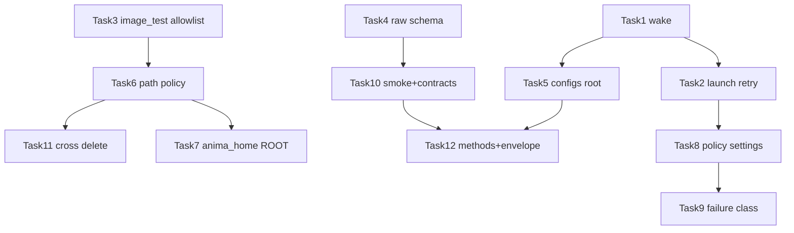

# 后端下一轮优化 Implementation Plan

> **For agentic workers:** REQUIRED SUB-SKILL: Use superpowers:subagent-driven-development (recommended) or superpowers:executing-plans to implement this plan task-by-task. Steps use checkbox (`- [ ]`) syntax for tracking.

**Goal:** 在已完成的 backend-config-optimization 基线上，把下一轮后端优化做成可持久推进、可严格回归的任务序列：先闭环 auto_retry 与路径安全，再统一 ROOT/allowlist，再策略配置化，最后硬化 HTTP/WS 契约与 backend smoke。

**Architecture:** 不新开第三套配置系统。全局偏好进 `settings_service` / `.anima-webui-settings.toml` / `web-ui-settings.toml`；队列实例态留在 `queue.json`；单次 run 仍用 `config.runtime.toml`。路径统一经 `library.env.anima_home` + `path_safety`/`path_policy`。每个 Task 强制 TDD：红测 → 最小实现 → 域包 → 跨域最小回归 → 提交。

**Tech Stack:** Python 3.13、aiohttp WebUI、pytest、现有 `web/services/*`、`library/env.py`、`library/config/*`。

**Spec:** `docs/superpowers/specs/2026-07-11-backend-next-optimization-design.md`

## Global Constraints

- 工作目录固定：`/home/scv/nvme0n1p1/训练器相关/anima_lora/.worktrees/backend-config-optimization`
- Python：`/home/scv/nvme0n1p1/训练器相关/anima_lora/.venv/bin/python`
- 不改 `main` 脏工作区；不 push 除非用户明确要求
- 不启动真实长训练 / 不下载大模型 / 不删用户 history/queue/runtime 数据
- 维持 schema：unknown=warning，invalid choice=error
- 不改 `load_method_preset` 合并顺序
- 不主动大拆 `_legacy` / file_groups / datasets 编辑器
- 新测试禁止继续堆进 2000+ 行大文件；优先新建 `tests/test_*` 文件
- 每 Task 后台测试默认 `timeout 60`（域包可到 180）

### 跨域最小回归（每个 Task 收尾）

```bash
timeout 180 /home/scv/nvme0n1p1/训练器相关/anima_lora/.venv/bin/python -m pytest -q \
  tests/test_training_queue.py \
  tests/test_training_queue_resume.py \
  tests/test_training_history_delete.py \
  tests/test_training_runtime_config_core.py \
  tests/test_preview_service.py \
  tests/test_image_test_service.py \
  tests/test_env_config_paths.py \
  tests/test_global_settings_runtime.py \
  tests/test_web_config_preflight.py \
  tests/test_web_http_contracts.py \
  tests/test_stage_schedule.py
```

### 失败诊断速查

| 现象 | 先看 |
|---|---|
| auto_retry 不跑 | `queue.json` 的 `next_run_at` / `attempt`；`queue_dispatch.py` 是否有 timer wake |
| 路径越权/误拒 | `path_safety` allowlist 与 ROOT 锚点是否一致 |
| 外置 configs 读旧根 | `set_configs_root` 后各模块 `CONFIGS_DIR` 是否同根 |
| HTTP 字段漂 | route handler 是否只有 service 测、缺 contract |
| 设置不生效 | `.anima-webui-settings.toml` vs `web-ui-settings.toml` vs `queue.json` 层级 |

---

## File Map（本计划主要落点）

| 文件 | 职责 |
|---|---|
| `web/services/training/queue_dispatch.py` | 调度、next_run_at 唤醒、启动失败 retry |
| `web/services/training/live_monitor.py` | 进程失败 retry、backoff、监控时序 |
| `web/services/training/service_state.py` | 队列策略 normalize |
| `web/services/training/constants.py` | 容量/时序常量 facade |
| `web/services/image_test_service.py` | 权重 resolve / save root |
| `web/services/continue_lora_service.py` | continue 权重边界 |
| `web/services/path_safety.py` 或新建 `path_policy.py` | 统一 allowlist |
| `web/services/settings_service.py` | 全局偏好字段 |
| `web/services/config/raw_files.py` | save/patch schema |
| `web/services/config_service.py` / `config/common.py` | configs_root 热切换 |
| `library/env.py` | ROOT / anima_home 真相源 |
| `tasks.py` | backend smoke 入口 |
| `tests/test_training_queue.py` 等新测文件 | 红绿锁语义 |

---

### Task 1: next_run_at 定时唤醒调度

**Files:**
- Modify: `web/services/training/queue_dispatch.py`
- Modify: `web/services/training/live_monitor.py`（若 wake 钩子放这里）
- Test: `tests/test_training_queue.py` 或新建 `tests/test_training_queue_retry_wake.py`

**Interfaces:**
- Consumes: queue item `next_run_at: float|None`、`_schedule_queue_dispatch()`
- Produces: 当所有 queued 项都在未来时，注册一次到期唤醒；到期后自动 `_dispatch_queue`

- [ ] **Step 1: 写失败测试**

```python
def test_queue_dispatch_wakes_after_next_run_at(tmp_path, monkeypatch):
    # 构造 auto_retry item，next_run_at = now+0.05
    # patch start 记录调用
    # 推进事件循环/手动触发 wake
    # assert 到期后 start 被调用，且不必人工 enqueue/dispatch
    ...
```

- [ ] **Step 2: 跑红测**

```bash
timeout 60 /home/scv/nvme0n1p1/训练器相关/anima_lora/.venv/bin/python -m pytest \
  tests/test_training_queue_retry_wake.py -q
```

Expected: FAIL（无 wake 或到期不 dispatch）

- [ ] **Step 3: 最小实现**
  - 在 dispatch 末尾计算最近 `next_run_at`
  - `asyncio` 创建/替换 timer task，到期调用 `_schedule_queue_dispatch`
  - 取消旧 timer，避免重复风暴

- [ ] **Step 4: 域测 + 跨域回归**

```bash
timeout 60 /home/scv/nvme0n1p1/训练器相关/anima_lora/.venv/bin/python -m pytest \
  tests/test_training_queue.py tests/test_training_queue_retry_wake.py -q
# 再跑跨域最小回归
```

- [ ] **Step 5: Commit**

```bash
git add web/services/training/queue_dispatch.py tests/test_training_queue_retry_wake.py
git commit -m "fix: wake queue dispatch when retry backoff expires"
```

---

### Task 2: 启动失败统一走 auto_retry

**Files:**
- Modify: `web/services/training/queue_dispatch.py`
- Modify: `web/services/training/live_monitor.py`（抽共用 `_maybe_auto_retry`）
- Test: `tests/test_training_queue_retry_wake.py` 或 `tests/test_training_queue.py`

**Interfaces:**
- Produces: `maybe_auto_retry(item, *, reason: str) -> dict|None`
- 语义：launch fail 与 process fail 共用 `attempt/max_attempts/backoff/next_run_at`

- [ ] **Step 1: 红测**

```python
def test_queue_launch_failure_can_auto_retry(tmp_path, monkeypatch):
    # auto_retry=true, max_attempts=2
    # start 抛异常 / 返回失败
    # assert 产生新 retry item 或 attempt+1，而不是永久卡死且无重试元数据
    ...
```

- [ ] **Step 2: 跑红测确认失败**
- [ ] **Step 3: 实现共用 retry 入口；user_stop 永不重试**
- [ ] **Step 4: 域测 + 跨域回归**
- [ ] **Step 5: Commit**

```bash
git commit -m "fix: auto-retry queue items on launch failures"
```

---

### Task 3: image_test 权重路径 allowlist + 禁 `..`

**Files:**
- Modify: `web/services/image_test_service.py`
- Test: `tests/test_image_test_service.py`（或新建边界测文件）

**Interfaces:**
- Consumes: `path_safety.resolve_display_path` / `is_under_allowed_dirs` / `allowed_weight_dirs`
- Produces: `_resolve_image_test_weight_path` 仅允许 allowlist 内文件

- [ ] **Step 1: 红测**

```python
def test_image_test_rejects_parent_escape_and_outside_absolute(tmp_path, monkeypatch):
    # 1) weight = "../secrets/a.safetensors" => reject
    # 2) absolute outside allowlist => reject
    # 3) under output_root / model allow root => accept
    ...
```

- [ ] **Step 2: 跑红测**
- [ ] **Step 3: 实现 normalize + 禁 `..` + allowlist 校验；bare name 仍只在 allow roots 搜**
- [ ] **Step 4: 域测**

```bash
timeout 60 /home/scv/nvme0n1p1/训练器相关/anima_lora/.venv/bin/python -m pytest \
  tests/test_image_test_service.py tests/test_preview_service.py tests/test_weight_analysis_service.py -q
```

- [ ] **Step 5: 跨域回归 + Commit**

```bash
git commit -m "fix: enforce allowlist on image_test weight resolution"
```

---

### Task 4: save_raw_file 接入 schema_gate 并回传 warnings

**Files:**
- Modify: `web/services/config/raw_files.py`
- Modify: `web/routes/config.py`（若响应 envelope 需带 warnings）
- Test: `tests/test_web_config_raw_files.py`

**Interfaces:**
- Consumes: `schema_gate.validate_config_mapping` / `validate_patch_values`
- Produces: save/patch 时 errors 拒绝；warnings 返回给调用方

- [ ] **Step 1: 红测**

```python
def test_save_raw_file_rejects_invalid_choice(tmp_path, monkeypatch):
    # 写入非法 choices => raises / returns errors
    ...

def test_patch_raw_file_returns_unknown_key_warnings(tmp_path, monkeypatch):
    # unknown key => success + warnings 非空
    ...
```

- [ ] **Step 2: 红测失败**
- [ ] **Step 3: 最小实现（保持 unknown=warning）**
- [ ] **Step 4: 域测**

```bash
timeout 60 /home/scv/nvme0n1p1/训练器相关/anima_lora/.venv/bin/python -m pytest \
  tests/test_web_config_raw_files.py tests/test_web_config_preflight.py -q
```

- [ ] **Step 5: Commit**

```bash
git commit -m "fix: validate raw config saves with schema gate warnings"
```

---

### Task 5: CONFIGS_DIR 热切换单一真相

**Files:**
- Modify: `web/services/config_service.py`
- Modify: `web/services/config/common.py`
- Modify: `web/services/config/preflight_runtime.py`
- Modify: 各模块 `_sync_from_facade` / accessor（尽量收敛到 common accessor）
- Test: `tests/test_env_config_paths.py` / `tests/test_web_config_service.py`

**Interfaces:**
- Produces: `get_configs_dir() -> Path` 单一读取点；`set_configs_root` 后 raw/merge/preflight/sample_prompts 同根

- [ ] **Step 1: 红测：热切换后四模块同根**
- [ ] **Step 2: 跑红**
- [ ] **Step 3: 实现 accessor + 同步；消灭 `ROOT/"configs"` 硬编码 fallback 的静默旧根**
- [ ] **Step 4: 域测 + 跨域回归**
- [ ] **Step 5: Commit**

```bash
git commit -m "fix: keep config modules on one hot-swappable configs root"
```

---

### Task 6: PathAllowlist 统一策略 + continue_lora 接入

**Files:**
- Create/Modify: `web/services/path_safety.py` 或 `web/services/path_policy.py`
- Modify: `web/services/continue_lora_service.py`
- Modify: `web/services/image_test_service.py`（改用 policy）
- Modify: `web/services/preview/**` / `weight_analysis/paths.py`（只接 builder，不改业务语义）
- Test: 新建 `tests/test_path_safety.py`

**Interfaces:**

```python
@dataclass
class PathAllowlist:
    repo_root: Path
    output_root: Path
    model_roots: list[Path]
    preview_dirs: list[Path]
    extra_roots: list[Path]
    allow_home_search: bool = False

def build_weight_allowlist(...) -> list[Path]: ...
def resolve_allowed_file(value: str, *, allowlist: list[Path], root: Path) -> Path: ...
```

- [ ] **Step 1: 红测矩阵**
  - image_test / continue_lora / preview / analysis 对同一 outside path 均拒绝
  - 对同一 inside path 均接受（capability 允许时）
- [ ] **Step 2: 跑红**
- [ ] **Step 3: 抽出 policy，继续兼容旧函数名**
- [ ] **Step 4: 域测**

```bash
timeout 120 /home/scv/nvme0n1p1/训练器相关/anima_lora/.venv/bin/python -m pytest -q \
  tests/test_path_safety.py \
  tests/test_image_test_service.py \
  tests/test_preview_service.py \
  tests/test_weight_analysis_service.py \
  tests/test_training_continue_lora.py
```

- [ ] **Step 5: 跨域回归 + Commit**

```bash
git commit -m "refactor: unify support weight path allowlist policy"
```

---

### Task 7: ROOT 向 anima_home 收敛（facade 先行）

**Files:**
- Modify: `library/env.py`
- Modify: `web/services/settings_service.py`
- Modify: `web/services/config/common.py`
- Modify: `web/services/preview/common.py`
- Modify: `web/services/image_test_service.py`
- Modify: `web/services/weight_analysis/constants.py`
- Test: `tests/test_env_config_paths.py`

**约束：** 先统一 accessor，不在本 Task 改业务行为；测试 monkeypatch 改为 patch 单一入口。

- [ ] **Step 1: 红测 ANIMA_HOME 与 WebUI ROOT 一致**
- [ ] **Step 2: 跑红**
- [ ] **Step 3: `ROOT = anima_home()` 或 `get_web_root()` facade**
- [ ] **Step 4: 域测 env/settings/preview/config paths**
- [ ] **Step 5: Commit**

```bash
git commit -m "refactor: anchor web service roots on anima_home"
```

---

### Task 8: 队列默认策略与容量/时序配置化

**Files:**
- Modify: `web/services/settings_service.py`
- Modify: `web/services/training/constants.py`
- Modify: `web/services/training/service_state.py`
- Modify: `web/services/training/live_monitor.py`
- Modify: `web/routes/settings.py` / training queue settings handler（API-only 可先）
- Test: `tests/test_global_settings_runtime.py`、`tests/test_training_queue.py`

**配置键（建议）：**

```toml
[training_policy]
auto_retry = false
max_attempts = 1
retry_backoff_sec = 0.0
max_queue_items = 200
max_history_items = 100
system_monitor_interval_sec = 2.0
progress_poll_interval_sec = 1.0
stop_grace_sec = 3.0
```

- [ ] **Step 1: 红测 settings 读写 + queue 默认加载**
- [ ] **Step 2: 跑红**
- [ ] **Step 3: 实现 normalize/clamp（max_attempts ≤ 10，backoff ≤ 3600）**
- [ ] **Step 4: 域测 queue/settings + 跨域回归**
- [ ] **Step 5: Commit**

```bash
git commit -m "feat: make queue policy and live limits configurable"
```

---

### Task 9: 错误分类驱动重试

**Files:**
- Modify: `web/services/training/anomalies.py`
- Modify: `web/services/training/live_monitor.py`
- Test: 新建 `tests/test_training_retry_classification.py`

**语义锁定：**

| 类别 | 是否 auto_retry |
|---|---|
| user_stop | 否 |
| checkpoint_missing / state_incomplete | 否 |
| OOM | 是（若全局 auto_retry 开） |
| unknown nonzero rc | 是（默认） |

- [ ] **Step 1: 红测分类矩阵**
- [ ] **Step 2: 跑红**
- [ ] **Step 3: 实现 `classify_training_failure(...) -> str` + retry gate**
- [ ] **Step 4: 域测 + 回归**
- [ ] **Step 5: Commit**

```bash
git commit -m "feat: classify training failures for auto-retry decisions"
```

---

### Task 10: backend smoke 入口 + HTTP/WS 契约硬化

**Files:**
- Modify: `tasks.py`（新增 `test-backend-smoke`）
- Expand: `tests/test_web_http_contracts.py` 或拆 `tests/test_web_http_contracts_*.py`
- Create: `tests/test_training_websocket.py`
- Optional: `tests/test_web_route_registry.py`

**最小契约覆盖：**
- training status/queue/settings
- history delete 409 形状
- image-test delete 越权
- config merged/raw/methods
- `/ws/training` subscribe 后能收到 snapshot/status 类消息（可用 fake service）

- [ ] **Step 1: 红测补齐关键写/删/WS**
- [ ] **Step 2: 跑红**
- [ ] **Step 3: 实现 smoke 命令与缺测**
- [ ] **Step 4: 跑 smoke + 跨域回归**

```bash
timeout 180 /home/scv/nvme0n1p1/训练器相关/anima_lora/.venv/bin/python tasks.py test-backend-smoke
```

- [ ] **Step 5: Commit**

```bash
git commit -m "test: add backend smoke gate and harden http/ws contracts"
```

---

### Task 11: 跨域删除边界组合测

**Files:**
- Create: `tests/test_cross_domain_delete_boundaries.py`

**场景：**
1. queue runtime 删除边界
2. history 被 queue 引用时 409
3. preview/image-test 删图越界拒绝
4. 切换 `output_root` 后边界仍一致

- [ ] **Step 1: 写组合红测**
- [ ] **Step 2: 跑红（若已满足则直接绿，记录基线）**
- [ ] **Step 3: 若有分叉则修 path/policy，不改用户数据语义**
- [ ] **Step 4: 跨域回归**
- [ ] **Step 5: Commit**

```bash
git commit -m "test: lock cross-domain delete boundaries after root switches"
```

---

### Task 12: methods 发现化 + config HTTP envelope（收尾增强）

**Files:**
- Modify: `web/services/config/merge.py`
- Modify: `web/routes/config.py`
- Test: `tests/test_web_config_merge.py`、`tests/test_web_http_contracts_config.py`

- [ ] **Step 1: 红测 list_methods 不硬编码幽灵方法；缺文件不出现**
- [ ] **Step 2: 跑红**
- [ ] **Step 3: 目录/元数据发现；error 路径统一 `ok:false`**
- [ ] **Step 4: 域测 + smoke**
- [ ] **Step 5: Commit**

```bash
git commit -m "feat: discover methods from config dirs and normalize config api errors"
```

---

## Round 执行顺序与并行建议



**可并行：**
- Round1 内：T1/T2 串行；T3 与 T4 可并行
- Round2：T5 与 T6 可并行，T7 依赖 T5/T6 收敛后
- Round4：T10 与 T11 可并行

**必须串行原因：**
- T2 依赖 T1 的 wake 语义，否则 launch retry + backoff 仍不可信
- T7 ROOT 收敛依赖 allowlist/configs root 先稳定，避免一次改太多锚点

---

## 总验收清单（DoD）

- [ ] Round1：backoff 能自动唤醒；launch fail 可按策略重试；image_test 越权路径被拒；save_raw schema 生效
- [ ] Round2：configs 热切换同根；continue/image_test/preview/analysis allowlist 一致；ROOT 单一 accessor
- [ ] Round3：队列默认策略/容量/时序可配置；错误分类驱动 retry
- [ ] Round4：`test-backend-smoke` 可用；HTTP/WS 关键契约存在；跨域删除组合测锁定
- [ ] 每个 Task 有红绿证据与 commit
- [ ] 跨域最小回归包绿
- [ ] 无未说明的 High 风险残留

---

## 风险与回滚

| 风险 | 缓解 | 回滚 |
|---|---|---|
| 路径收紧破坏旧工作流 | extra_roots 可配；默认仍禁 home | 仅加 extra_roots，不重开默认 home 扫描 |
| retry 唤醒误触发 | 单测锁到期语义；默认 auto_retry=false | 关 auto_retry |
| ROOT 收敛踩测试 | 单点 patch accessor | 保留 facade ROOT 兼容 |
| settings 字段前端未接 | API-only 默认旧值 | 去掉新键读取即可 |
| methods 发现隐藏旧文件 | 兼容无 family 的存量规则写清 | 临时回硬编码并加 warning |

---

## 自检（对照 Spec）

| Spec 项 | Task |
|---|---|
| T-N1 wake | Task 1 |
| T-N2 launch retry | Task 2 |
| S-N1 image_test allowlist | Task 3 |
| C-N2 raw schema | Task 4 |
| C-N1 configs root | Task 5 |
| S-N3/S-N4 path policy | Task 6 |
| S-N2 ROOT | Task 7 |
| T-N3/T-N4/T-N5 配置化 | Task 8 |
| T-N6 错误分类 | Task 9 |
| Q-N1/Q-N2/Q-N3 契约与 smoke | Task 10 |
| Q-N4 跨域删除 | Task 11 |
| C-N3/C-N4 methods+envelope | Task 12 |
| L0–L5 debug 流程 | Global + 每 Task 步骤 |

无 TBD 占位；默认值与层级已锁定。
