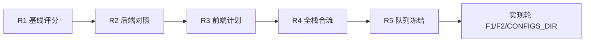

# 全栈五轮自动迭代日志

状态：已完成 5 轮文档迭代（评分 + 审查合流 + 计划冻结）  
分支：`docs/backend-config-optimization`  
对照实现：`feat/backend-config-optimization`（后端 Task 1–10 代码已存在）  
日期：2026-07-11

相关文档：

- `docs/superpowers/specs/2026-07-11-five-round-auto-iteration-protocol.md`
- `docs/superpowers/specs/2026-07-11-backend-config-optimization-design.md`
- `docs/superpowers/plans/2026-07-11-backend-config-optimization.md`
- `docs/superpowers/specs/2026-07-11-frontend-config-optimization-design.md`
- `docs/superpowers/plans/2026-07-11-frontend-config-optimization.md`

---

## 评分口径（固定）

### 后端 100

架构15 + 配置真相20 + 路径安全15 + 队列runtime15 + stage贯通10 + 测试15 + 可运维10

### 前端 100

模块边界15 + 状态纯度15 + 过渡层15 + 测试15 + 热点10 + 性能10 + UX10 + a11y10

等级：A90+ / B80-89 / C70-79 / D<70

---

### Round 1 — 2026-07-11 基线锁定

| 项 | 值 |
|---|---|
| 分支 | docs/backend-config-optimization（auditor 采样曾漂移到 main，已用源码+feat 校正） |
| 后端总分/等级 | **76 / C** |
| 前端总分/等级 | **68 / D** |
| 本轮焦点 | 规范评分结构；并行审后端健康 + 前端状态 |
| 完成项 | 后端评分卡、前端模块地图与风险清单、五轮协议 |
| 新增 High | 配置根热切换不完整；bridge 静默 no-op；chunks 继续增重；基线 sample prompts/image_test（对照 feat 后可关） |
| 下轮焦点 | 后端 High 与优化计划/feat 落地对照 |
| 测试门禁 | 只读审核 |
| 熔断? | 否 |

**后端分项（R1）**

| 分项 | 分 |
|---|---:|
| 架构清晰度 | 11/15 |
| 配置真相一致性 | 13/20 |
| 路径/安全边界 | 12/15 |
| 队列/runtime | 12/15 |
| stage/resume/progress | 8/10 |
| 测试可防御性 | 12/15 |
| 可配置性/可运维 | 8/10 |

**前端分项（R1）**

| 分项 | 分 |
|---|---:|
| 模块边界 | 13/15 |
| 状态纯度 | 9/15 |
| 过渡层 | 7/15 |
| 测试护栏 | 13/15 |
| 热点控制 | 6/10 |
| 性能 | 6/10 |
| UX | 7/10 |
| a11y | 7/10 |

---

### Round 2 — 2026-07-11 后端落地对照

| 项 | 值 |
|---|---|
| 分支 | 对照 `feat/backend-config-optimization` |
| 后端总分/等级 | **84 / B** |
| 前端总分/等级 | **68 / D** |
| 本轮焦点 | 核对后端计划 Task1–10 是否已在 feat 落地 |
| 完成项 | sample prompts 外置、image_test 收紧、stage 门禁、progress stage、auto_retry、history/queue roots、schema gate、merge core、http contracts、resume 诊断均有提交 |
| 关闭 High | sample prompts 外置；image_test home 扫描；stage 无门禁；progress 无 stage；缺 auto_retry；history/queue 仅 env |
| 残留 High/Med | CONFIGS_DIR 热切换快照；legacy facade；HTTP/WS 仅起步 |
| 下轮焦点 | 前端优化配置项成文 |
| 测试门禁 | 建议在 feat 跑后端跨域包（文档轮不强行改工作区） |
| 熔断? | 否 |

**后端上调依据**

- 配置真相 +4；路径安全 +1；队列 +1；stage 贯通 +1；测试 +1；可运维 +0~1 → 约 84

---

### Round 3 — 2026-07-11 前端计划冻结

| 项 | 值 |
|---|---|
| 分支 | docs/backend-config-optimization |
| 后端总分/等级 | 84 / B |
| 前端总分/等级 | 68 / D |
| 本轮焦点 | 前端优化配置项 → 设计 + 实施计划 |
| 完成项 | frontend design/plan；Top5=路径 formatter、token 单源、bridge 收敛、import 并行、history 性能 |
| 新增 High | 无 |
| 下轮焦点 | 全栈合流 |
| 测试门禁 | 前端域最小回归命令写入计划 |
| 熔断? | 否 |

---

### Round 4 — 2026-07-11 全栈合流

| 项 | 值 |
|---|---|
| 分支 | docs/backend-config-optimization |
| 后端总分/等级 | 84 / B |
| 前端总分/等级 | 68 / D |
| 本轮焦点 | 后端残留 + 前端优先项统一排序；debug 门禁固化 |
| 完成项 | 统一执行优先级；协议生效；后端计划加入 Auto Iteration |
| 合流优先级 | 1 协议互链 2 CONFIGS_DIR 热切换 3 路径 formatter 4 token 单源 5 bridge 6 真集成测 7 import/history 性能 |
| 下轮焦点 | 冻结可开工队列 |
| 测试门禁 | 后端跨域包 + 前端域包 |
| 熔断? | 否 |

---

### Round 5 — 2026-07-11 执行队列冻结

| 项 | 值 |
|---|---|
| 分支 | docs/backend-config-optimization |
| 后端总分/等级 | 84 / B |
| 前端总分/等级 | 68 / D（下阶段目标 ≥78） |
| 本轮焦点 | 冻结下阶段可开工任务与验收 |
| 完成项 | Sprint 队列、每项测试命令、完成定义 |
| 新增 High | 无 |
| 下轮焦点 | 实现轮（可并行 F1 与 CONFIGS_DIR） |
| 测试门禁 | 见下 |
| 熔断? | 否 |

#### 冻结执行队列

| 序号 | 任务 | 计划 | 验收 |
|---|---|---|---|
| 1 | 统一路径 formatPathLabel + title | 前端 F1 | 前端域包 |
| 2 | cache token 单源 | 前端 F2 | modules |
| 3 | CONFIGS_DIR 热切换收敛 | 后端残留 P0 | env/global settings + preflight/sample prompts |
| 4 | bridge 装配收敛 | 前端 F3 | modules + history/config_ui |
| 5 | 启动 import 并行 | 前端 F4 | modules |
| 6 | history 列表性能 | 前端 F5 | history |
| 7 | configs_root 真集成测 | 后端测试债 | global settings + web config |
| 8 | 合入 feat 前全回归 | 后端 | 后端跨域 + 前端域包 |

#### 下阶段完成定义

- 前端健康度 ≥ 78
- 后端合并 feat 后保持 ≥ 84，并关闭 CONFIGS_DIR 热切换 High
- 每任务有红绿测试记录
- 不新增 globalThis 业务导出
- 不删除用户 history/queue/runtime

---

## 五轮趋势

| 轮次 | 后端 | 前端 | 关键变化 |
|---|---:|---:|---|
| R1 | 76C | 68D | 基线 |
| R2 | 84B | 68D | 对照 feat 后端 Task 落地 |
| R3 | 84B | 68D | 前端计划冻结 |
| R4 | 84B | 68D | 全栈优先级合流 |
| R5 | 84B | 68D | 执行队列冻结 |

## 子代理登记

| agent | 角色 | 状态 |
|---|---|---|
| Poincare | backend-auditor | 完成 76C |
| Boyle | frontend-auditor | 完成 68 + Top5 |
| Hume | protocol materials | 完成（协议素材） |

## 备注

- 本 5 轮是文档与决策迭代，不是把 feat 代码强行 cherry-pick 进 docs 分支。
- 实现阶段建议：合入 `feat/backend-config-optimization` 后端成果，同时推进前端 F1–F5。
- 若继续自动迭代（R6+），必须带测试命令结果，不再只做评分空转。
