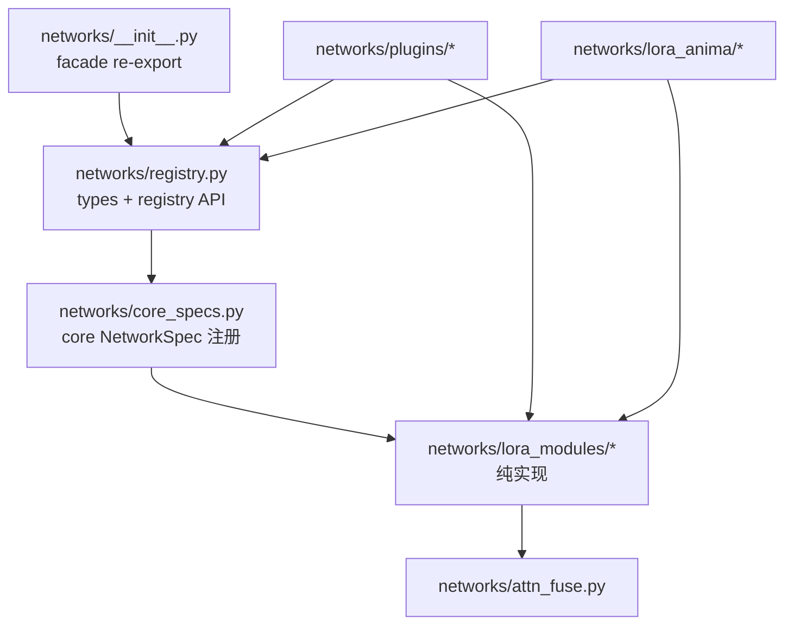

# Networks 环依赖拆除 Implementation Plan

> **For agentic workers:** REQUIRED SUB-SKILL: Use superpowers:subagent-driven-development (recommended) or superpowers:executing-plans to implement this plan task-by-task. Steps use checkbox (`- [ ]`) syntax for tracking.

**Goal:** 拆除 sentrux 报出的唯一 CRITICAL 环依赖 `networks -> registry -> lora_modules -> networks`，且不改变任何 adapter 行为。

**Architecture:** 把“包根 facade / 注册表 / 模块实现”拆成单向依赖。`networks` 只做 re-export；`registry` 继续负责 `NetworkSpec` 与懒加载注册；`lora_modules` 只依赖自己子模块和 `networks.attn_fuse`，禁止再通过绝对路径 `from networks...` 把包根拉回来。核心注册从 `registry` 内联 import 挪到独立 bootstrap 模块，避免 `registry` 在 import 期立刻吃进全部 `lora_modules`。

**Tech Stack:** Python 3.13、`networks/` 包、`pytest`、`uvx --from sentrux sentrux`。

## Global Constraints

- 行为零变化：`resolve_network_spec`、插件注册、save/load、create_network_from_weights 结果必须保持现状。
- 热点文件只做小范围搬家/兼容 shim，不借机重写业务。
- 不改 `custom_nodes/*/_vendor/`；如影响发布节点，最后只提醒 `vendor-sync`。
- 不启动真实训练、不下载模型。
- 后台测试统一 `timeout 60 .venv/bin/python -m pytest ...`。
- 每完成一个 task 后，优先用定向测试 + sentrux 片段验收；最后全量 sentrux `scan` 确认 acyclicity 环消失。

---

## 背景与根因

### 当前环

```text
networks/__init__.py
  -> networks.registry
       -> (module body) ensure_builtin_plugins_loaded()
            -> _register_core_specs()
                 -> from .lora_modules import ...
                      -> networks.lora_modules.*
                           -> from networks.attn_fuse / from networks.lora_modules...
                                -> 重新进入 networks 包根
```

sentrux 压缩后报告为：

```text
networks -> registry -> lora_modules -> networks
```

### 为什么危险

1. `import networks` 时就会强制加载几乎全部 core LoRA 模块和插件。
2. 包根还在初始化中时，`lora_modules` 的绝对导入可能撞上半初始化状态。
3. 后续任何 `networks.*` 子模块拆分都会被这个环放大成 import 时序 bug。

### 目标依赖方向



允许：

- `registry` -> `core_specs` -> `lora_modules`
- `plugins/*` -> `registry` + `lora_modules`
- `lora_modules/*` -> 包内相对导入 / `networks.attn_fuse`

禁止：

- `lora_modules/*` -> `networks` 包根
- `lora_modules/*` -> `networks.registry`
- `registry.py` 模块顶层立刻 import 全部 `lora_modules`

---

## 文件地图

| 文件 | 职责 |
|---|---|
| `networks/__init__.py` | 只 re-export registry 公共 API，保持 `from networks import NETWORK_REGISTRY` |
| `networks/registry.py` | `NetworkSpec`、注册表、resolve/detect API；不再在 import 时内联 import 全部 core modules |
| `networks/core_specs.py`（新建） | 注册 lora/dora/ortho/hydra/ortho_hydra/chimera_hydra/stacked_experts 等 core specs |
| `networks/lora_modules/__init__.py` | 继续 re-export 公共类，但改用相对导入 |
| `networks/lora_modules/*.py` | 内部互相引用改相对导入；`attn_fuse` 可保留 `from networks.attn_fuse ...` |
| `tests/test_network_cycle.py`（新建） | 锁住“无环 + import 顺序安全” |
| `tests/test_network_registry.py` | 既有 registry/save 回归，改完必须全绿 |

---

### Task 1: 先写失败测试，锁住“无环”验收

**Files:**

- Create: `tests/test_network_cycle.py`
- Test: `tests/test_network_cycle.py`

**Interfaces:**

- Consumes: 现有 `networks` 包结构
- Produces: 3 个保护测试
  - `test_lora_modules_do_not_import_networks_package_root`
  - `test_registry_module_body_does_not_import_lora_modules_eagerly`
  - `test_import_networks_then_lora_modules_is_stable`

- [ ] **Step 1: 写失败测试**

```python
from __future__ import annotations

import ast
import importlib
import sys
from pathlib import Path


REPO_ROOT = Path(__file__).resolve().parents[1]
LORA_MODULES_DIR = REPO_ROOT / "networks" / "lora_modules"

def _iter_absolute_imports(path: Path) -> list[str]:
    tree = ast.parse(path.read_text(encoding="utf-8"))
    out: list[str] = []
    for node in ast.walk(tree):
        if isinstance(node, ast.Import):
            out.extend(alias.name for alias in node.names)
        elif isinstance(node, ast.ImportFrom) and node.level == 0 and node.module:
            out.append(node.module)
    return out


def test_lora_modules_do_not_import_networks_package_root():
    """lora_modules 可以依赖 networks.attn_fuse，但不能 import 包根 networks。"""
    offenders: list[str] = []
    for path in sorted(LORA_MODULES_DIR.rglob("*.py")):
        for mod in _iter_absolute_imports(path):
            if mod == "networks" or mod.startswith("networks.registry"):
                offenders.append(f"{path.relative_to(REPO_ROOT)}: {mod}")
            if mod.startswith("networks.lora_modules"):
                offenders.append(f"{path.relative_to(REPO_ROOT)}: {mod}")
    assert offenders == []


def test_registry_module_body_does_not_import_lora_modules_eagerly():
    """registry 顶层模块体不应直接 from .lora_modules import ...。"""
    path = REPO_ROOT / "networks" / "registry.py"
    tree = ast.parse(path.read_text(encoding="utf-8"))
    top_level_imports: list[str] = []
    for node in tree.body:
        if isinstance(node, ast.ImportFrom):
            mod = ("." * node.level) + (node.module or "")
            top_level_imports.append(mod)
        elif isinstance(node, ast.Import):
            top_level_imports.extend(alias.name for alias in node.names)
    assert not any(
        item in {".lora_modules", "networks.lora_modules", "lora_modules"}
        for item in top_level_imports
    )


def test_import_networks_then_lora_modules_is_stable():
    """包根和实现层应可按任意顺序导入，且 registry 可用。"""
    for name in list(sys.modules):
        if name == "networks" or name.startswith("networks."):
            del sys.modules[name]

    networks = importlib.import_module("networks")
    lora_modules = importlib.import_module("networks.lora_modules")
    registry = importlib.import_module("networks.registry")

    assert "lora" in networks.NETWORK_REGISTRY
    assert hasattr(lora_modules, "LoRAModule")
    assert registry.NETWORK_REGISTRY is networks.NETWORK_REGISTRY
```

- [ ] **Step 2: 跑测试，确认当前失败**

Run:

```bash
timeout 60 .venv/bin/python -m pytest tests/test_network_cycle.py -v
```

Expected:

- `test_lora_modules_do_not_import_networks_package_root` FAIL
- 以“至少有 1 个红灯锁住环”为准

- [ ] **Step 3: Commit 测试基线**

```bash
git add tests/test_network_cycle.py
git commit -m "test: lock networks package acyclicity for lora_modules/registry"
```

---

### Task 2: 把 core specs 注册挪出 `registry.py`

**Files:**

- Create: `networks/core_specs.py`
- Modify: `networks/registry.py`
- Test: `tests/test_network_cycle.py`
- Test: `tests/test_network_registry.py`

**Interfaces:**

- Consumes:
  - `register_network_spec(NetworkSpec) -> NetworkSpec`
  - `NetworkSpec(...)`
  - `_post_init_hydra`, `_HYDRA_KWARG_FLAGS`, `_CHIMERA_KWARG_FLAGS`
- Produces:
  - `networks.core_specs.register_core_network_specs() -> None`
  - `ensure_builtin_plugins_loaded()` 调用它，而不是内联 `_register_core_specs()`

- [ ] **Step 1: 新建 `networks/core_specs.py`，只负责 core 注册**

把现有 `networks/registry.py` 里的 `_register_core_specs()`、`_post_init_hydra`、`_HYDRA_KWARG_FLAGS`、`_CHIMERA_KWARG_FLAGS` 原样搬到 `networks/core_specs.py`。

关键骨架：

```python
from networks.registry import NetworkSpec, register_network_spec

def register_core_network_specs() -> None:
    from networks.registry import NETWORK_REGISTRY
    if any(name in NETWORK_REGISTRY for name in ("lora", "dora", "ortho", "hydra", "ortho_hydra", "chimera_hydra", "stacked_experts_global_fei")):
        return
    from networks.lora_modules import (
        ChimeraHydraLoRAModule, DoRALoRAModule, HydraLoRAModule, LoRAModule,
        OrthoHydraLoRAModule, OrthoLoRAModule, StackedExpertsLoRAModule,
    )
    # 然后按现有顺序 register_network_spec(...)
```

实现要求：

- `_post_init_hydra` 与现有逻辑逐行等价
- 不要 `import networks` 包根
- 不要改任何 NetworkSpec 字段或 save_variant 名称

- [ ] **Step 2: 改 `networks/registry.py`**

1. 删除 `_register_core_specs()` 内联函数体
2. `ensure_builtin_plugins_loaded()` 开头改为调用 `register_core_network_specs()`
3. 模块末尾先保留 `ensure_builtin_plugins_loaded()` 自动调用，兼容现有测试

```python
def ensure_builtin_plugins_loaded() -> None:
    global _PLUGINS_LOADED
    from networks.core_specs import register_core_network_specs
    register_core_network_specs()
    if _PLUGINS_LOADED:
        return
    _PLUGINS_LOADED = True
    # 原插件扫描逻辑保持不变
```

- [ ] **Step 3: 跑 registry 回归**

```bash
timeout 60 .venv/bin/python -m pytest tests/test_network_registry.py -q
```

Expected: PASS

- [ ] **Step 4: Commit**

```bash
git add networks/core_specs.py networks/registry.py
git commit -m "refactor: move core NetworkSpec registration out of registry import path"
```

---

### Task 3: 切断 `lora_modules -> networks` 包根回边

**Files:**

- Modify: `networks/lora_modules/__init__.py`
- Modify: `networks/lora_modules/lora.py`
- Modify: `networks/lora_modules/hydra.py`
- Modify: `networks/lora_modules/chimera.py`
- Modify: `networks/lora_modules/stacked_experts.py`
- Modify: `networks/lora_modules/dora.py`
- Modify: `networks/lora_modules/ortho.py`
- Modify: `networks/lora_modules/step_expert.py`
- Modify: 其他 `networks/lora_modules/*.py` 中所有 `from networks.lora_modules...`
- Test: `tests/test_network_cycle.py`

**Interfaces:**

- Consumes: 现有公共类名不变
- Produces: `lora_modules` 内部只使用相对导入；允许 `from networks.attn_fuse import ...`

- [ ] **Step 1: 改 `networks/lora_modules/__init__.py` 为相对导入**

```python
from .base import BaseLoRAModule, _absorb_channel_scale
from .chimera import ChimeraHydraInferenceModule, ChimeraHydraLoRAModule
from .dora import DoRALoRAModule
from .hydra import HydraLoRAModule, _sigma_sinusoidal_features
from .lora import LoRAModule
from .ortho import OrthoHydraLoRAModule, OrthoLoRAModule
from .reft import ReFTModule
from .stacked_experts import StackedExpertsLoRAModule
from .step_expert import StepExpertLoRAModule
```

- [ ] **Step 2: 批量改子模块内部导入**

| 旧写法 | 新写法 |
|---|---|
| `from networks.lora_modules.base import X` | `from .base import X` |
| `from networks.lora_modules.lora import X` | `from .lora import X` |
| `from networks.lora_modules.custom_autograd import X` | `from .custom_autograd import X` |
| `from networks.lora_modules.router_state import X` | `from .router_state import X` |
| `from networks.attn_fuse import X` | 保留，这不是包根 |

检查命令：

```bash
rg -n "from networks\.lora_modules|import networks\.lora_modules|from networks import|import networks$" networks/lora_modules
```

Expected: 0 条命中

- [ ] **Step 3: 跑环依赖测试**

```bash
timeout 60 .venv/bin/python -m pytest tests/test_network_cycle.py -v
```

Expected: PASS

- [ ] **Step 4: Commit**

```bash
git add networks/lora_modules
git commit -m "refactor: make lora_modules imports package-root free"
```

---

### Task 4: 补强 import 时序与公共 API 兼容

**Files:**

- Modify: `tests/test_network_cycle.py`
- Modify: `networks/__init__.py`（仅在需要时）
- Test: `tests/test_network_registry.py`
- Test: `tests/test_factory_metadata_flow.py`

**Interfaces:**

- Consumes: Task 2/3 后的新导入图
- Produces: 兼容断言
  - `from networks import NETWORK_REGISTRY, resolve_network_spec` 仍可用
  - `from networks.registry import ...` 仍可用
  - `from networks.lora_modules import LoRAModule` 仍可用

- [ ] **Step 1: 增加兼容测试**

在 `tests/test_network_cycle.py` 追加：

```python
def test_public_facade_still_exports_registry_api():
    import networks
    for name in (
        "NETWORK_REGISTRY",
        "NetworkSpec",
        "resolve_network_spec",
        "register_network_spec",
        "ensure_builtin_plugins_loaded",
        "ModuleCreationContext",
    ):
        assert hasattr(networks, name)


def test_resolve_network_spec_still_selects_lora_by_default():
    from networks import resolve_network_spec
    spec = resolve_network_spec({})
    assert spec.name == "lora"
```

- [ ] **Step 2: 跑核心回归**

```bash
timeout 60 .venv/bin/python -m pytest \
  tests/test_network_cycle.py \
  tests/test_network_registry.py \
  tests/test_factory_metadata_flow.py \
  -q
```

Expected: PASS

- [ ] **Step 3: Commit**

```bash
git add tests/test_network_cycle.py networks/__init__.py
git commit -m "test: keep networks facade and resolve_network_spec compatibility"
```

---

### Task 5: 用 sentrux 验收环已消失

**Files:**

- None required, unless sentrux 仍报告同类环，再回修 Task 2/3

**Interfaces:**

- Consumes: 改后仓库
- Produces: `/tmp/anima_sentrux_after_cycle.json` 验收产物

- [ ] **Step 1: 扫 sentrux JSON**

```bash
uvx --from sentrux sentrux scan --json . > /tmp/anima_sentrux_after_cycle.json
```

- [ ] **Step 2: 解析 acyclicity / cycles**

```bash
.venv/bin/python - <<'PY'
import json
from pathlib import Path
data = json.loads(Path('/tmp/anima_sentrux_after_cycle.json').read_text())
qs = data['quality_score']
cycles = data['detailed_report'].get('cycles', [])
print('overall', qs['overall_score'])
print('acyclicity', qs['acyclicity'])
print('cycles', cycles)
bad = [
    c for c in cycles
    if c == ['networks', 'registry', 'lora_modules', 'networks']
    or set(c) >= {'networks', 'registry', 'lora_modules'}
]
assert not bad, bad
print('OK: target cycle gone')
PY
```

Expected:

- 目标环消失
- `acyclicity` 不低于改前 `0.8`
- overall 允许小幅波动，但环必须没了

- [ ] **Step 3: 若仍有环，只允许修这两类问题**

1. 还有 `from networks import ...` / `from networks.xxx` 回勾包根
2. `core_specs` / `registry` / `plugins` 形成新的注册环

不要顺手拆 god files。

- [ ] **Step 4: 可选文档补充**

在 `networks/CLAUDE.md` Layout 表补一行 `core_specs.py`。

```bash
git add networks/CLAUDE.md
git commit -m "docs: note core_specs registration boundary in networks layout"
```

---

## 风险与回滚

| 风险 | 表现 | 处理 |
|---|---|---|
| 插件注册时序变化 | `NETWORK_REGISTRY` 缺 loha/lokr/vera | 保留 `ensure_builtin_plugins_loaded()` 自动调用；补测 `EXPECTED_VARIANTS` |
| 相对导入写错 | `ImportError: attempted relative import` | 按文件所在包层级修正 `.` / `..` |
| 半初始化回归 | `LoRAModule` 变成部分初始化对象 | 依赖 Task 1/4 的 import 顺序测试 |
| vendor 分叉 | Comfy 节点仍旧代码 | 本次不改 vendor；需要时另开 `vendor-sync` |

回滚策略：

- 只回滚 `networks/core_specs.py`、`networks/registry.py`、`networks/lora_modules/**`、新增测试
- 不碰用户数据目录

---

## 验收清单 DoD

- [ ] `tests/test_network_cycle.py` 全绿
- [ ] `tests/test_network_registry.py` 全绿
- [ ] `tests/test_factory_metadata_flow.py` 全绿
- [ ] sentrux 不再报告 `networks -> registry -> lora_modules -> networks`
- [ ] 公共 API 兼容：`from networks import NETWORK_REGISTRY, resolve_network_spec`
- [ ] 无行为改动：resolve 优先级、save roundtrip、from-weights 检测保持原样
- [ ] 没有改用户数据 / vendor / 训练产物

---

## 推荐执行顺序


预计耗时：

- Task 1: 15~25 分钟
- Task 2: 30~45 分钟
- Task 3: 20~40 分钟
- Task 4: 15~25 分钟
- Task 5: 10~20 分钟

---

## Self-Review

1. **Spec coverage:** 目标只有一个 CRITICAL 环；计划覆盖根因边、兼容 API、定向测试、sentrux 验收。
2. **Placeholder scan:** 无 TBD；`_post_init_hydra` 要求原样搬迁，不在计划里重写逻辑。
3. **Type consistency:** 继续使用现有 `NetworkSpec` / `register_network_spec` / `NETWORK_REGISTRY` 名称，不发明第二套 registry。

