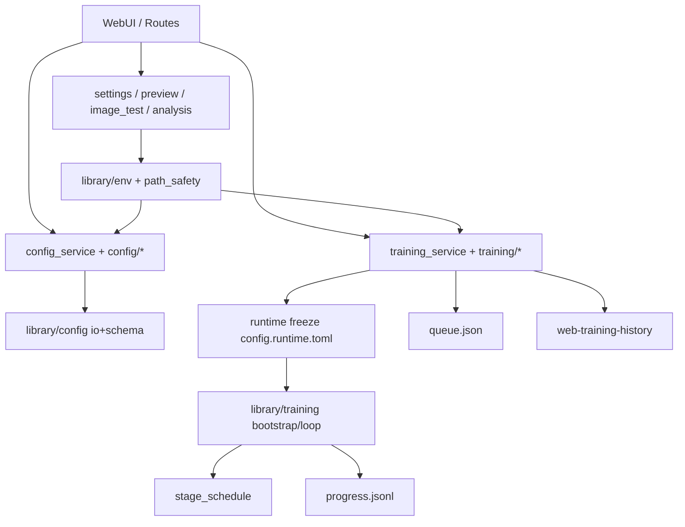
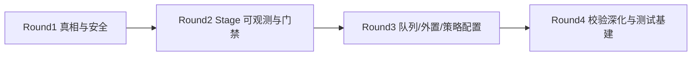

# 后端状态审核与配置优化路线（设计）

状态：草案（子代理并行审核后汇总）  
适用版本：当前 main  
入口命令：`.venv/bin/python tasks.py web --host 127.0.0.1 --port 20102`  
相关代码：

- `web/services/config/**`
- `web/services/training/**`
- `web/services/settings_service.py`
- `web/services/path_safety.py`
- `web/services/preview/**`
- `web/services/image_test_service.py`
- `library/config/**`
- `library/env.py`
- `library/training/stage_schedule.py`
- `library/training/loop.py`
- `library/training/progress.py`

---

## 1. 背景与目标

一句话：后端主链路已经拆开且能跑，下一步不是堆功能，而是把“配置真相、路径边界、队列策略、stage 可观测”做成可长期推进的优化项。

### 1.1 审核范围

| 域 | 覆盖 |
|---|---|
| Config | 合并、raw、dataset、preflight、sample prompts、file groups |
| Training | queue / history / runtime / resume / progress / stage_schedule |
| Support | settings / path_safety / preview / env check / image_test / weight analysis |
| Test | 现有覆盖、缺口、严格 debug 流程 |

### 1.2 目标

- 找出**可持久推进**的后端配置优化项（不是一次性小修）
- 每项都有：价值、成本、依赖、验收测试、失败诊断
- 给出严格分层 debug 测试流程
- 产出可执行计划，支持按轮次串行/并行落地

### 1.3 非目标

- 本轮不写业务实现代码
- 不启动真实训练 / 不下载大模型
- 不先大拆 `_legacy` shim（价值低、测试面爆炸）
- 不把前端 IA 重构并入本计划（已有独立 stage-schedule IA 计划）

---

## 2. 当前后端状态总览

一句话：结构已经“能维护”，真正的债在“双真相源、路径策略分叉、策略不可配置、观测不全”。



### 2.1 已完成的好底座

- Config / Training / Preview / WeightAnalysis 已拆模块，facade 兼容旧 import
- 队列冻结 runtime、失败策略 pause/continue、GPU 白名单、删除边界检查较完整
- preflight / path traversal / external `configs_root` 有厚单测
- `stage_schedule` 内核与 schema 已落地，前端 IA 另有计划推进

### 2.2 核心问题（按严重度）

| 级别 | 问题 | 影响 |
|---|---|---|
| High | Web `load_merged_config` 与训练 `load_method_preset` 双合并链 | Web 看到的配置可能和训练实际不同 |
| High | sample prompts 写盘仍锚定 `ROOT/configs/...` | 外置 `configs_root` 时写错位置或失败 |
| High | `image_test` 权重搜索可落到 workspace / `$HOME` rglob | 慢、误命中、安全面过大 |
| High | stage_schedule 缺 preflight/runtime 门禁与 progress 观测 | 中途炸 / 黑盒 |
| Medium | raw patch 不走 schema | typo/非法 choices 静默入库 |
| Medium | queue/history 策略常量硬编码 | 无人值守与长跑体验受限 |
| Medium | history/queue 外置只靠环境变量 | 外置部署不完整 |
| Medium | 测试偏 service，HTTP/WS 集成薄 | 路由与实时链路静默回归 |
| Low | legacy shim / ROOT parents[N] 分叉 | 维护成本 |

---

## 3. 优化配置项清单（可长期推进）

一句话：按“真相一致 → 安全边界 → 可观测/可批跑 → 体验配置化 → 架构瘦身”推进。

### A. Config 真相与校验

| ID | 项 | 建议落点 |
|---|---|---|
| C1 | 统一 Web/训练合并核心 | `library/config/io.py` + `web/services/config/merge.py` |
| C2 | sample prompts 外置根修复 | `web/services/config/sample_prompts.py` |
| C3 | raw/save 接入 schema 校验 | `raw_files.py` + `library/config/schema.py` |
| C4 | selected config 分层 merge + provenance | merge / routes/config |
| C5 | preflight 增加 schema/stage 检查 | `preflight*.py` |
| C6 | 导入配置迁移报告 | raw put / import |
| C7 | list_methods 目录发现化 | merge.py |

### B. Training 运行与队列策略

| ID | 项 | 建议落点 |
|---|---|---|
| T1 | stage_schedule preflight/runtime 强校验 | preflight + runtime_prepare |
| T2 | progress 事件写 stage_index/name | progress / loop / parser / timeline |
| T3 | 队列 auto_retry + max_attempts + backoff | queue_control/dispatch + queue.json |
| T4 | resume 追加步数与 stage 边界语义/诊断 | runtime_resume / history_resume |
| T5 | max_queue_items / max_history_items / monitor interval 可配置 | constants + settings |
| T6 | probe 全局默认策略 always/auto/off | launcher_job + settings |
| T7 | 队列 priority / not_before | queue_enqueue/dispatch |

### C. Support 路径与设置

| ID | 项 | 建议落点 |
|---|---|---|
| S1 | 收紧 image_test 权重搜索（默认禁 home rglob） | image_test_service |
| S2 | 统一 path allowlist 策略 | path_safety + 各消费者 |
| S3 | history/queue root 进 WebUI 设置 | settings_service + env.py |
| S4 | preview 默认 limit/days/source 配置化 | preview settings |
| S5 | 环境检查 quick/full + 超时缓存 | environment_check_service |
| S6 | ROOT 统一 `anima_home()` | 各 service |
| S7 | continue_lora / analysis unsupported 规则表合并 | constants |

### D. 测试与 Debug 基建

| ID | 项 | 建议落点 |
|---|---|---|
| Q1 | HTTP 路由契约包 | 新 tests |
| Q2 | WebSocket 端到端 | 新 tests |
| Q3 | stage_schedule 可变 N + web/runtime 贯通 | test_stage_schedule + runtime |
| Q4 | Web 后端 fast smoke 子集 | tasks.py / pytest mark |
| Q5 | queue↔history↔preview 删除边界三联 | 组合测试 |

---

## 4. 推荐路线（四轮）

一句话：先堵高风险洞，再做策略配置化，最后才做瘦身。



### Round 1：真相与安全（先做）

1. C2 sample prompts 外置根
2. S1 image_test 搜索收敛
3. C1 合并核心共享（可分两步：先共享 flatten/schema，再 provenance）

### Round 2：Stage 贯通

1. T1 stage preflight/runtime 校验
2. T2 progress stage 字段
3. Q3 可变 N + 贯通测试

### Round 3：无人值守与外置闭环

1. T3 auto_retry
2. S3 history/queue root 设置化
3. T5/T6 上限与 probe 默认策略

### Round 4：校验与可维护性

1. C3/C5 schema 保存与 preflight
2. C4 provenance API
3. Q1/Q2/Q4 测试基建
4. 最后再考虑 C8/S6 架构瘦身

---

## 5. 严格 Debug 测试流程（全局）

一句话：每次只改一个域；L1→L4 递进；失败先定位路径/状态/monkeypatch，再改代码。

### 5.1 分层

| 层 | 时限 | 目标 | 通过标准 |
|---|---|---|---|
| L1 单元 | 15–30s | 纯函数/校验 | 边界断言绿 |
| L2 契约 | 30–60s | service/handler 入参出参 | 状态机与错误形状稳定 |
| L3 集成 | ≤60s | 跨 config/runtime/queue/history/preview | 冻结 runtime 与路径边界一致 |
| L4 回归 | ≤60s/包 | 本域 + 邻域最小包 | 无新增红 |

### 5.2 通用失败诊断清单

1. 失败是状态错误，还是路径/权限错误？
2. fixture 是否正确设置 `configs_root` / `output_root` / history / queue / runtime？
3. monkeypatch 是否盖住了真实入口（`resolve_output_root`、`prepare_web_runtime_config`）？
4. 字符串契约失败是否只是重构噪音？
5. 队列/历史是否涉及 backup、orphan running、launch lock？

### 5.3 跨域最小回归包（任何后端优化收尾必跑）

```bash
timeout 60 .venv/bin/python -m pytest \
  tests/test_training_queue.py \
  tests/test_training_runtime_config_core.py \
  tests/test_training_history_list.py \
  tests/test_preview_service.py \
  tests/test_web_config_preflight.py \
  tests/test_stage_schedule.py -q
```

---

## 6. 域级最小测试命令

### Config

```bash
timeout 60 .venv/bin/python -m pytest \
  tests/test_web_config_merge.py \
  tests/test_web_config_raw_files.py \
  tests/test_web_config_sample_prompts.py \
  tests/test_web_config_preflight.py \
  tests/test_config.py \
  tests/test_config_provenance.py -q
```

### Training / Stage / Resume

```bash
timeout 60 .venv/bin/python -m pytest \
  tests/test_stage_schedule.py \
  tests/test_training_queue.py \
  tests/test_training_runtime_config_core.py \
  tests/test_training_runtime_config_probes.py \
  tests/test_training_history_timeline.py \
  tests/test_training_progress_metrics.py \
  tests/test_training_resume.py -q
```

### Support / Path

```bash
timeout 60 .venv/bin/python -m pytest \
  tests/test_image_test_service.py \
  tests/test_preview_service.py \
  tests/test_weight_analysis_service.py \
  tests/test_env_config_paths.py \
  tests/test_global_settings_runtime.py \
  tests/test_environment_check_service.py -q
```

---

## 7. 决策锁定

| 决策 | 选择 |
|---|---|
| 优化主轴 | 配置真相 + 路径安全 + stage 可观测 + 队列策略 |
| 合并策略 | 向 `library/config` 真相源收敛，不另起第三套 |
| image_test home 扫描 | 默认关闭；若保留必须显式开关 |
| sample prompts | 一律走 `CONFIGS_DIR` / 外置根 |
| stage 语义 | 仍用全局 %（0..1 of max_train_steps）；resume 改总步时要明确诊断 |
| legacy shim | Round 1–3 不主动大拆 |
| 测试纪律 | 每个 Task 必须 TDD：失败测试 → 实现 → 域包 → 跨域最小回归 |
| 危险操作 | 不默认删用户 history/queue/runtime；涉及删除策略先文档后实现 |

---

## 8. 完成定义（本设计）

- [x] 四域并行审核完成
- [x] 优化配置项清单与优先级确定
- [x] 严格 debug 测试流程写清
- [ ] 用户确认设计后按计划书执行
- [ ] 实现阶段每轮有测试证据

---

## 9. 参考

- 既有计划：`docs/superpowers/plans/2026-07-11-dataset-page-stage-schedule-ia.md`
- 既有设计：`docs/superpowers/specs/2026-07-11-dataset-page-stage-schedule-ia-design.md`
- 仓库协议：`AGENTS.md`（外置配置、路径边界、测试 timeout 60、热点文件瘦身）

## 10. 五轮自动迭代协议

一句话：每轮固定做「评分 → 前/后端审查 → 选优化项 → 写计划/测试门禁 → 复盘」，共 5 轮，形成可持久推进节奏。

完整协议正文见：`docs/superpowers/specs/2026-07-11-five-round-auto-iteration-protocol.md`  
迭代日志见：`docs/superpowers/plans/2026-07-11-fullstack-auto-iteration-log.md`  
前端计划见：`docs/superpowers/plans/2026-07-11-frontend-config-optimization.md`

### 10.1 规范评分结构（摘要）

**后端 100：** 架构15 + 配置真相20 + 路径安全15 + 队列runtime15 + stage贯通10 + 测试15 + 可运维10  
**前端 100：** 模块边界15 + 状态纯度15 + 过渡层15 + 测试15 + 热点10 + 性能10 + UX10 + a11y10  
等级：A90+ / B80-89 / C70-79 / D<70

### 10.2 五轮目标

| 轮次 | 目标 |
|---|---|
| R1 | 基线评分 + 锁协议 + 收高风险清单 |
| R2 | 后端真相/安全优先项对照落地 |
| R3 | 前端优化配置项入计划 |
| R4 | 全栈优先级合流 + debug 门禁固化 |
| R5 | 冻结下阶段执行队列 |

### 10.3 子代理分工

| 角色 | 任务 |
|---|---|
| backend-auditor | 后端健康评分卡 |
| frontend-auditor | 前端状态与优化项 |
| planner | 合流、更新计划与日志 |
| test-auditor | 测试门禁有效性 |

### 10.4 严格 Debug 门禁（摘要）

红测 → 最小实现 → 域包 ≤60s → 跨域回归 → 记日志。  
不启真实长训；不删用户 history/queue/runtime。
