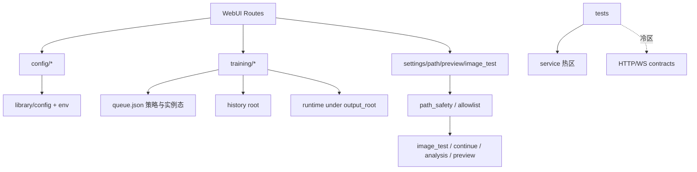

# 后端下一轮优化配置项（设计）

状态：草案（子代理四域并行审核后汇总）  
适用版本：`feat/backend-config-optimization` @ `682c6df7`  
入口命令：`.venv/bin/python tasks.py web --host 127.0.0.1 --port 20102`  
相关代码：

- `web/services/config/**`
- `web/services/training/**`
- `web/services/settings_service.py`
- `web/services/path_safety.py`
- `web/services/preview/**`
- `web/services/image_test_service.py`
- `web/services/continue_lora_service.py`
- `web/services/environment_check_service.py`
- `web/services/weight_analysis/**`
- `library/env.py`
- `library/config/**`
- `web/routes/**`
- `tests/test_web_*` / `tests/test_training_*`

---

## 1. 背景与目标

一句话：上一轮把“配置真相 / stage 门禁 / 外置 root / 基础契约”补齐了；下一轮要做**可持久推进的策略配置化 + 路径边界统一 + 契约门禁硬化**。

### 1.1 审核方式

| 域 | 子代理 | 结论主轴 |
|---|---|---|
| Config | Sagan | 配置根热切换一致性、写路径 schema、methods 发现、HTTP envelope |
| Training | Schrodinger | auto_retry 调度闭环、策略/容量/时序配置化 |
| Support | Huygens | ROOT 真相源、allowlist 统一、image_test/continue 安全边界 |
| Test | Russell | HTTP/WS 冷区、backend smoke、跨域删除组合 |

### 1.2 已完成基线（不要回退）

| 基线 | 状态 |
|---|---|
| sample prompts 走外置 `CONFIGS_DIR` | 已完成 |
| Web merge 共享 `load_method_preset` | 已完成 |
| schema_gate：unknown=warning / 非法 choices=error | 已完成 |
| stage preflight/runtime + progress stage 字段 | 已完成 |
| queue auto_retry / max_attempts / backoff 字段 | 已完成（调度闭环仍缺） |
| history/queue root 设置化 | 已完成 |
| resume stage_before/after 诊断 | 已完成 |
| HTTP contracts 起步（4 测） | 已完成（覆盖仍薄） |
| image_test 默认禁 home rglob | 已完成（路径 allowlist 仍不完整） |

### 1.3 目标

- 产出**下一轮**可配置优化项清单（可多轮推进，不追求一次做完）
- 每项都有：价值、严重度、落点、验收测试、失败诊断
- 给出严格分层 debug 测试流程（L0–L5）
- 明确非目标，防止掀桌式重构

### 1.4 非目标

- 不重写 `_legacy` / file_groups / datasets 大编辑器
- 不启动真实长训练 / 不下载大模型
- 不把前端 IA 大改并入本轮
- 不把 unknown key 改成 hard error
- 不改 `load_method_preset` 合并顺序（base → preset → method）
- 不默认删除用户 history/queue/runtime 数据

---

## 2. 当前后端状态总览

一句话：主链路健康约 **B+ / 78**；剩余债从“能不能跑”变成“策略是否可信、边界是否统一、契约是否够硬”。



### 2.1 健康点

- Config / Training / Preview / WeightAnalysis 模块拆分可用
- 外置 `configs_root/history_root/queue_root/output_root` 已有底座
- stage 与 resume 诊断已贯通
- service 层单测很厚（后端相关约 600+）

### 2.2 核心问题（按严重度）

| 级别 | 问题 | 影响 |
|---|---|---|
| High | auto_retry 的 `next_run_at` 缺少定时唤醒 | 退避重试可能永远挂起 |
| High | 启动失败不走 auto_retry，与进程失败策略不一致 | 夜间队列不可信 |
| High | image_test 权重路径无完整 allowlist，可 `..`/绝对路径越权读 | 安全边界分叉 |
| High | ROOT 真相源分裂（parents[N] / project_root / anima_home / cwd） | 外置部署路径漂移 |
| Medium | CONFIGS_DIR 热切换靠补丁同步 | 外置 configs 后模块读旧根 |
| Medium | 队列策略/容量/监控时序硬编码或只在 queue.json | 策略不可运营 |
| Medium | save_raw 全量写路径 schema 不完整；methods 硬编码 | 配置真相/发现漂移 |
| Medium | HTTP/WS 契约薄；无 backend smoke 入口 | 回归靠感觉 |
| Low | resume stage warning 过噪；超大测试文件继续膨胀 | 噪音与维护成本 |

---

## 3. 优化配置项清单（下一轮可持久推进）

一句话：按“正确性闭环 → 安全边界 → 策略配置化 → 契约门禁 → 可维护瘦身”排序。

### A. Config 真相与 API

| ID | 项 | 严重度 | 建议落点 | 工作量 |
|---|---|---|---|---|
| C-N1 | 配置根单一真相 / 热切换同步 | High | `config_service.set_configs_root`、`common.py`、`preflight_runtime.py` | M |
| C-N2 | `save_raw_file` 接入 schema_gate；patch 回传 warnings | Med | `raw_files.py`、`routes/config.py` | S |
| C-N3 | `/api/config/*` HTTP envelope + 契约测 | Med | `routes/config.py`、`tests/test_web_http_contracts*.py` | M |
| C-N4 | `list_methods` 目录/元数据发现化 | Med | `merge.py` 或 `method_catalog.py` | S-M |
| C-N5 | schema 加载失败可观测（禁止静默 no-op） | Med | `schema_gate.py` | S |
| C-N6 | Web/library choices 语义文档化（Web error / CLI warn） | Low | `schema.py` + docs/tests | S |
| C-N7 | 公开 legacy shim 名单冻结 | Med 债 | `legacy_names.py` + 测试 | M |
| C-N8 | provenance 回传到 `/api/config/merged`（可选增强） | Low-Med | `library/config/io.py` + merge route | M |

### B. Training 运行策略

| ID | 项 | 严重度 | 建议落点 | 工作量 |
|---|---|---|---|---|
| T-N1 | `next_run_at` 定时唤醒调度 | High | `queue_dispatch.py`、`live_monitor.py` | M |
| T-N2 | 启动失败与进程失败统一 auto_retry 入口 | High | `queue_dispatch.py`、`live_monitor.py` | S-M |
| T-N3 | 队列默认策略进入全局 settings（queue.json 只留实例态） | Med | `settings_service.py`、`service_state.py` | M |
| T-N4 | max_attempts 上限 + backoff 模式（fixed/exp/jitter） | Med | `service_state.py`、`live_monitor.py` | S |
| T-N5 | history/queue 容量与 live 时序配置化 | Med | `constants.py` + settings | M |
| T-N6 | 错误分类驱动是否重试（user_stop/OOM/ckpt missing） | Med | `anomalies.py`、`live_monitor.py` | M |
| T-N7 | 每任务 retry override | Med | `queue_enqueue.py`、`queue_state.py` | M |
| T-N8 | compact 保护 error / 可配置保护策略 | Low-Med | `queue_state.py` | S |
| T-N9 | resume stage warning 仅在 stage 变化时发出 | Low | `runtime_resume.py` | S |
| T-N10 | progress_jsonl_seen 窗口化；orphan scan 可关/限流 | Low | `live_monitor.py`、`history_meta.py` | S |

### C. Support 路径与设置

| ID | 项 | 严重度 | 建议落点 | 工作量 |
|---|---|---|---|---|
| S-N1 | image_test 权重 resolve 接 allowlist + 禁 `..` | High | `image_test_service.py` | M |
| S-N2 | ROOT 统一 `anima_home()` | High | `library/env.py` + 各 service ROOT | L |
| S-N3 | continue_lora 接同一 allowlist | Med | `continue_lora_service.py` | S-M |
| S-N4 | PathAllowlist policy 统一对象 | Med | `path_safety.py` 或 `path_policy.py` | M |
| S-N5 | `image_test_allow_home_search` 升一等 settings 字段 | Med | `settings_service.py` | S |
| S-N6 | image_test save 跟随 output_root / 可配 save_root | Med | `image_test_service.py` | S-M |
| S-N7 | weight 搜索 roots/max_depth/超时可配 | Med | image_test + settings | M |
| S-N8 | environment_check 报告 effective roots | Low-Med | `environment_check_service.py` | S |
| S-N9 | analysis 与 image_test model roots 策略对齐 | Low-Med | weight_analysis + policy | S-M |
| S-N10 | continue_lora / analysis unsupported 规则表合并 | Low | constants | S |

### D. 测试与 Debug 基建

| ID | 项 | 严重度 | 建议落点 | 工作量 |
|---|---|---|---|---|
| Q-N1 | 扩展 HTTP contracts（写/删/控制面） | Med | `tests/test_web_http_contracts*.py` | M |
| Q-N2 | `/ws/training` 后端契约 | Med | `tests/test_training_websocket.py` | M |
| Q-N3 | `tasks.py test-backend-smoke` 固定包 | Med | `tasks.py` + docs | S |
| Q-N4 | 跨域删除边界组合测 | Med | `tests/test_cross_domain_delete_boundaries.py` | L |
| Q-N5 | path_safety 统一矩阵测 | Med | `tests/test_path_safety.py` | M |
| Q-N6 | route registry 完整性测 | Low-Med | `tests/test_web_route_registry.py` | M |
| Q-N7 | 新测禁止继续堆 2k+ 大文件 | Low | 规范 + review | 持续 |

---

## 4. 推荐推进路线（四轮）

一句话：先修“看起来有、实际不闭环/不安全”的 High，再做配置化与契约硬化。


### Round 1：正确性闭环与安全止血（先做）

1. T-N1 next_run_at 唤醒
2. T-N2 启动失败统一 retry
3. S-N1 image_test allowlist + 禁 `..`
4. C-N2 save_raw schema 一致

### Round 2：路径与配置根统一

1. C-N1 CONFIGS_DIR 热切换单一真相
2. S-N4 PathAllowlist policy
3. S-N3 continue_lora 接入
4. S-N2 ROOT → `anima_home`（可拆两步：先 facade accessor，再清 parents[N]）

### Round 3：策略与容量配置化

1. T-N3 队列默认策略进 settings
2. T-N4/T-N6 重试上限与错误分类
3. T-N5 容量与 live 时序配置化
4. S-N5/S-N6/S-N7 image_test 配置一等公民化

### Round 4：契约门禁与可维护

1. Q-N3 backend smoke 入口
2. Q-N1/Q-N2 HTTP + WS 契约
3. Q-N4/Q-N5 跨域删除 + path 矩阵
4. C-N3/C-N4 methods 发现 + config envelope
5. 最后再碰 C-N7 shim 冻结 / 超大文件拆分

---

## 5. 严格 Debug 测试流程（全局）

一句话：每次只改一个域；L0→L5 递进；失败先定位路径/状态/monkeypatch，再改代码。

### 5.1 分层

| 层 | 时限 | 目标 | 通过标准 |
|---|---|---|---|
| L0 静态 | ≤60s | diff/compile/import | 无语法与明显导入裂 |
| L1 单测 | 15–60s | 当前改动点 | 新红测先红后绿 |
| L2 域包 | ≤180s | 本域 service 包 | 域内无新增红 |
| L3 跨域 | ≤180s | 路径/删除/root 切换 | 边界一致 |
| L4 契约 | ≤120s | HTTP/WS envelope | 状态码与关键字段稳定 |
| L5 手动 | 按需 | 真 WebUI/进程 | 清单勾完 |

### 5.2 通用失败诊断清单

1. 失败是状态错误，还是路径/权限错误？
2. fixture 是否正确设置 `configs_root` / `output_root` / history / queue / runtime？
3. monkeypatch 是否盖住了真实入口（`resolve_output_root`、`set_configs_root`、`prepare_web_runtime_config`）？
4. auto_retry 失败是“没重试”还是“重试了但没被唤醒”？
5. 路径失败是 allowlist 拒真阳性，还是 ROOT 锚点不一致？
6. 字符串契约失败是否只是重构噪音？

### 5.3 跨域最小回归包（任何后端优化收尾必跑）

```bash
timeout 180 /home/scv/nvme0n1p1/训练器相关/anima_lora/.venv/bin/python -m pytest -q   tests/test_training_queue.py   tests/test_training_queue_resume.py   tests/test_training_history_delete.py   tests/test_training_runtime_config_core.py   tests/test_preview_service.py   tests/test_image_test_service.py   tests/test_env_config_paths.py   tests/test_global_settings_runtime.py   tests/test_web_config_preflight.py   tests/test_web_http_contracts.py   tests/test_stage_schedule.py
```

### 5.4 Python 入口

- worktree 内优先：`/home/scv/nvme0n1p1/训练器相关/anima_lora/.venv/bin/python`
- 或：`../../.venv/bin/python`（相对 backend-config-optimization worktree）

---

## 6. 配置项落库建议（策略面）

一句话：分清“全局偏好 / 队列实例态 / 单次 run”，避免再造第三套真相。

| 层级 | 存哪 | 存什么 |
|---|---|---|
| 全局偏好 | `web-ui-settings.toml` / `.anima-webui-settings.toml` | retry 默认、容量上限、monitor interval、image_test 开关、weight_search_roots |
| 队列实例态 | `queue.json` | paused、items、attempt、next_run_at、item 级 override |
| 单次 run | `config.runtime.toml` | stage_schedule、duration overrides、gpu whitelist、probe 路径 |
| 路径根 | settings paths + env | configs_root / history_root / queue_root / output_root |

默认安全值（锁定）：

- `auto_retry=false`
- `max_attempts` 默认 1，硬上限建议 10
- `retry_backoff_sec` 默认 0，最大建议 3600
- `image_test_allow_home_search=false`
- 相对路径禁止 `..`
- 绝对路径必须落在 allowlist

---

## 7. 决策锁定

| 决策 | 选择 |
|---|---|
| 优化主轴 | 调度闭环 + 路径边界统一 + 策略配置化 + 契约硬化 |
| 安全策略 | 统一 PathAllowlist；写路径严于读路径 |
| ROOT | 向 `anima_home()` 收敛，禁止新增 `parents[N]` |
| 队列策略 | 全局默认进 settings；queue.json 保留实例态 |
| schema | 维持 unknown=warning / invalid choice=error |
| legacy | 冻结公开 shim，不主动大拆 |
| 测试纪律 | 每 Task：红测 → 实现 → 域包 → 跨域最小回归 |
| 危险操作 | 不默认删用户数据；涉及删除策略先测后改 |

---

## 8. 完成定义（本设计）

- [x] 四域并行审核完成
- [x] 下一轮优化配置项清单与优先级确定
- [x] 严格 debug 测试流程写清
- [ ] 实施计划书落盘（见 plans）
- [ ] 用户确认后按 Round 推进实现

---

## 9. 风险与回滚

| 风险 | 缓解 | 回滚 |
|---|---|---|
| 收紧 image_test 路径后老工作流失败 | 明确 allowlist + 可配 extra_roots | 临时加 extra_roots，不重开 home 默认扫描 |
| auto_retry 唤醒误触发 | 单测锁 next_run_at；默认 auto_retry=false | 关 auto_retry / 调大 backoff |
| ROOT 收敛导致测试 monkeypatch 失效 | 统一 accessor；测试改 patch 一处 | 保留 facade ROOT 兼容赋值 |
| settings 新字段前端未接 | 后端先 API-only | 字段默认值保持旧行为 |
| HTTP envelope 变更破前端 | 先加字段不删旧字段 | 兼容双读 |

