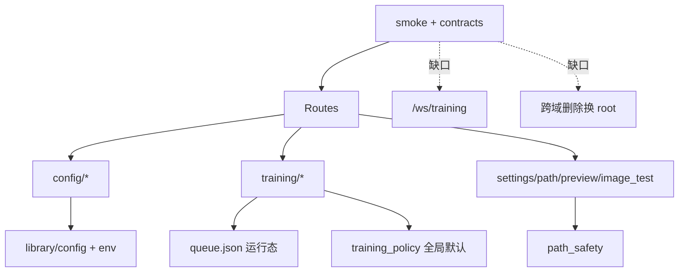

# 后端残留债与下一轮优化配置项（设计）

状态：草案（四域并行审核后汇总，待用户确认）  
适用版本：`feat/backend-config-optimization` @ `ff257245`  
入口命令：`.venv/bin/python tasks.py web --host 127.0.0.1 --port 20102`  
相关代码：`web/services/**`、`web/routes/**`、`library/env.py`、`tests/test_*`

---

## 1. 背景与目标

一句话：上一轮 next-optimization（Task1–12）主体已落地；本轮只啃**残留债**，做成可持久推进、可严格 debug 的下一计划。

### 1.1 审核方式

| 域 | 子代理 | 综合分 | 结论主轴 |
|---|---|---:|---|
| Config | Dalton | 72 | 幽灵 methods、configs_root 广播不全、envelope/warnings 半成品 |
| Training | Zeno | 78 | 策略双层漂移、item 级 retry 缺、WS/集成契约薄 |
| Support | Helmholtz | 78 | resolve 入口未全统一、home_search 假开关、跨域删除矩阵薄 |
| Test/门禁 | 父代理补齐 | 70 | smoke 有了但 HTTP 写删/WS/换 root 端到端仍薄 |

### 1.2 已完成基线（禁止回退）

| 基线 | 状态 |
|---|---|
| next_run_at 定时唤醒 | 已完成 |
| launch fail / process fail 共用 auto_retry | 已完成 |
| failure classification + user_stop/ckpt 默认不重试 | 已完成（缺集成测） |
| training_policy 配置化（无 section 不踩 monkeypatch） | 已完成 |
| path_safety.resolve_allowed_file + image_test/continue 接入 | 已完成 |
| ROOT → anima_home | 已完成 |
| save_raw invalid choice 硬拦 | 已完成（warnings 仍丢） |
| test-backend-smoke 入口 | 已完成（覆盖仍偏服务层） |
| 跨域删除最小 allowlist 烟测 | 已完成（过薄） |

### 1.3 目标

- 给出**残留优化配置项**清单（可多轮推进）
- 每项：价值、严重度、落点、验收测试、失败诊断
- 给出规范**健康度评分结构**与当前实测分
- 给出严格分层 debug/回归流程（L0–L5）
- 明确非目标，避免掀桌

### 1.4 非目标

- 不重写 `_legacy` / file_groups / datasets 大编辑器
- 不启动真实长训练 / 不下载大模型
- 不默认删除用户 history/queue/runtime 数据
- 不把 unknown key 改成 hard error
- 不改 `load_method_preset` 合并顺序
- 不在本轮做前端 IA 大改
- 不默认 push / 不碰主仓 `main` 脏工作区

---

## 2. 后端健康度评分结构（规范）

一句话：先按域打分，再按权重合成总分；分数必须能指到证据（测试/代码）。

### 2.1 维度与权重

| 维度 | 权重 | 含义 | 证据源 |
|---|---:|---|---|
| D1 正确性/调度 | 20% | 队列、retry、resume、merge 是否行为正确 | 域单测 + 集成测 |
| D2 安全边界 | 20% | 路径 allowlist、删除、读权重/图是否越权 | path_safety + 跨域删除 |
| D3 配置真相 | 15% | configs_root/settings/policy 层级是否清晰可热切换 | env/settings/config 测 |
| D4 契约硬度 | 15% | HTTP/WS 字段与 envelope 是否锁死 | http/ws contracts |
| D5 可观测/可诊断 | 10% | 失败分类、warnings、environment roots | anomalies/env check |
| D6 测试门禁 | 10% | smoke 包是否覆盖关键债 | tasks.py smoke + 矩阵 |
| D7 可维护性 | 10% | 入口统一、热点文件、大测试膨胀 | 代码结构审查 |

**总分公式：**

```text
Score = 0.20*D1 + 0.20*D2 + 0.15*D3 + 0.15*D4 + 0.10*D5 + 0.10*D6 + 0.10*D7
等级：A 90+ / B 80–89 / C 70–79 / D 60–69 / F <60
```

### 2.2 当前分支实测（@ ff257245）

| 维度 | 分 | 一句话证据 |
|---|---:|---|
| D1 正确性/调度 | 82 | wake + launch/process retry 有测；pause+auto_retry / stop 集成仍薄 |
| D2 安全边界 | 78 | resolve_allowed_file 有了；preview/analysis 解析分叉；整仓相对路径偏宽 |
| D3 配置真相 | 72 | policy 有了；queue 双层漂移；list_methods 幽灵；广播不全 |
| D4 契约硬度 | 62 | HTTP 5 个浅契约；无真 WS；写删控制面几乎无 |
| D5 可观测 | 74 | failure_class 有；save warnings 丢；env roots 不全 |
| D6 测试门禁 | 76 | smoke 入口存在；跨域 1 例；无换 root 删除矩阵 |
| D7 可维护性 | 78 | 模块拆分好；CONFIGS_DIR 多拷贝 + resolve 多入口 |
| **总分** | **75** | **等级 C+ / 健康可用，下一轮应冲 B** |

### 2.3 分域快照

| 域 | 分 | P0 残留 |
|---|---:|---|
| Config | 72 | C-R1 幽灵 methods；C-R2 热切换广播 |
| Training | 78 | T-R1 策略双层语义；T-R3 clamp 统一 |
| Support | 78 | S-R1 resolve 统一；S-R2 home_search 一等设置 |
| Test | 70 | Q-R1 写删 HTTP；Q-R2 真 WS；Q-R3 换 root 删除 |



---

## 3. 残留优化配置项清单

一句话：按“正确性语义 → 安全统一 → 契约门禁 → 可维护”排序，ID 用 `*-R*` 表示 residual。

### 3.1 Config

| ID | 项 | 严重度 | 落点 | 工作量 |
|---|---|---|---|---|
| C-R1 | `list_methods` 缺文件不再出现（去掉 `or True`） | High | `web/services/config/merge.py` | S |
| C-R2 | `set_configs_root` 广播覆盖 file_groups/datasets/output_runs/dataset_* | High | `config_service.py` + 各模块 | M |
| C-R3 | `save_raw` 结构化返回 schema warnings | Med | `raw_files.py` + `routes/config.py` | S |
| C-R4 | schema nested/dict 边界文档化或专项校验 | Med | `schema_gate.py` + preflight | M |
| C-R5 | schema 加载失败可观测（禁止静默 no-op） | Med | `schema_gate.py` | S |
| C-R6 | config 写接口 HTTP envelope 统一 `ok/error/warnings` | Med | `routes/config.py` + contracts | M |
| C-R7 | method catalog 与磁盘对齐（可选 manifest） | Med | `merge.py` | M |
| C-R8 | `list_variants` 勿把 custom 塞进每个 family | Low | `merge.py` | S |
| C-R9 | patch 结构化 `warnings[]` | Low | `raw_files.py` + routes | S |
| C-R10 | CONFIGS_DIR 收敛 DynamicPath（中期） | Low | 多模块 | L |
| C-R11 | 热切换矩阵测试扩到 file_groups/datasets/output_runs | Low | tests | S |
| C-R12 | raw GET missing vs empty 语义 | Low | raw_files + route | S |

### 3.2 Training

| ID | 项 | 严重度 | 落点 | 工作量 |
|---|---|---|---|---|
| T-R1 | 锁定策略层级：policy 默认 vs queue.json 运行态 | High | settings + queue_state + docs | M |
| T-R2 | item 级 retry override | Med | queue_enqueue/control | M-L |
| T-R3 | queue normalize clamp 对齐 policy（attempts 1–10，backoff 0–3600） | Med | `service_state.py` | S |
| T-R4 | user_stop / checkpoint_missing 集成测 | Med | queue tests | S-M |
| T-R5 | WS `type=queue` 契约测 | Med | 新 `tests/test_training_websocket.py` | S-M |
| T-R6 | pause + auto_retry 行为文档/测试（clone 但不启动） | Med | queue_dispatch + tests | S |
| T-R7 | classify checkpoint 英文表达式加固 | Low | `anomalies.py` | XS |
| T-R8 | `_maybe_auto_retry(stop_requested=...)` 防御 | Low | queue_enqueue | XS |
| T-R9 | 失败原 item 写 `failure_class` | Low | queue_enqueue | XS |
| T-R10 | 手动 retry 语义（强制/标记 manual） | Low | queue_control | S |

### 3.3 Support / Path

| ID | 项 | 严重度 | 落点 | 工作量 |
|---|---|---|---|---|
| S-R1 | preview/analysis 权重解析改调 `resolve_allowed_file` | High | preview/common.py, weight_analysis/paths.py | M |
| S-R2 | `image_test_allow_home_search` 升一等 settings 字段 | High | settings_service + image_test | S |
| S-R3 | image_test 默认整仓 ROOT allow 是否收紧（产品决策） | Med | image_test_service | S-M |
| S-R4 | preview 相对图路径勿整仓可读（产品决策） | Med | preview/common.py | S-M |
| S-R5 | 换 output_root 后删除/下载端到端矩阵 | Med | cross-domain tests | S |
| S-R6 | image_test save 跟随 output_root / 可配 save_root | Med | image_test + settings | S-M |
| S-R7 | path_safety 统一矩阵测扩面 | Med | test_path_safety | M |
| S-R8 | environment_check 报告 effective roots | Low-Med | environment_check_service | S |
| S-R9 | continue_lora project_root 过宽策略对齐 | Low | continue_lora_service | S |
| S-R10 | preview_dir 绝对路径无 task 时不得裸放行 | Low | preview/common.py | S |
| S-R11 | training_policy 是否暴露 settings 路由 | Low | routes/settings | S |
| S-R12 | home rglob depth/timeout 预算 | Low | image_test | M |

### 3.4 Test / 门禁

| ID | 项 | 严重度 | 落点 | 工作量 |
|---|---|---|---|---|
| Q-R1 | HTTP 写/删/控制面契约扩展 | Med | test_web_http_contracts* | M |
| Q-R2 | 真 `/ws/training` 后端契约 | Med | test_training_websocket.py | M |
| Q-R3 | 跨域删除 + 换 output_root 组合 | Med | test_cross_domain_delete_boundaries.py | M |
| Q-R4 | smoke 包纳入 residual 关键测 | Med | scripts/tasks/utilities.py | S |
| Q-R5 | route registry 完整性 | Low-Med | 新 test_web_route_registry.py | M |
| Q-R6 | 新测禁止堆进 2000+ 行大文件 | Low | 规范 | 持续 |

---

## 4. 推荐推进轮次（可持久）

一句话：每轮都能独立合并、独立回归，不追求一次做完。

### Round A — 语义与安全闭环（优先）

1. C-R1 list_methods 文件真相
2. T-R1 策略层级文档化 + seed/不覆盖测
3. T-R3 clamp 统一
4. S-R2 home_search 一等设置
5. S-R1 preview/analysis 走 resolve_allowed_file
6. T-R4 + T-R6 集成测
7. S-R5 + Q-R3 换 root 删除矩阵

### Round B — 契约硬化

1. C-R3/C-R9 warnings 结构化
2. C-R6 写接口 envelope
3. Q-R1 写删 HTTP 契约
4. Q-R2 + T-R5 真 WS 契约
5. Q-R4 smoke 扩包
6. C-R2 + C-R11 热切换广播与矩阵

### Round C — 产品策略与瘦身

1. T-R2 item 级 retry
2. S-R3/S-R4 是否收紧整仓便利（需用户拍板）
3. S-R6 save_root
4. C-R4/C-R5 schema 边界
5. C-R10 DynamicPath 收敛（可拆多 PR）

---

## 5. 严格 debug / 测试流程（L0–L5）

一句话：先锁失败层，再扩面；每层有超时、命令、失败诊断。

### 5.1 分层

| 层 | 目的 | 超时 | 命令骨架 |
|---|---|---:|---|
| L0 静态 | 语法/导入/改动面 | 30s | `git diff --check`；相关文件 `py_compile` |
| L1 红测 | 单行为失败 | 60s | `pytest tests/test_<focus>.py::test_<name> -q` |
| L2 绿测 | 最小实现通过 | 60s | 同上 |
| L3 域包 | 同域回归 | 120s | 域文件列表 pytest |
| L4 跨域最小 | 防牵连 | 180s | 既有跨域包 + residual 新增 |
| L5 smoke | 门禁入口 | 180s | `tasks.py test-backend-smoke` |

### 5.2 跨域最小回归包（本轮）

```bash
cd /home/scv/nvme0n1p1/训练器相关/anima_lora/.worktrees/backend-config-optimization
PY=/home/scv/nvme0n1p1/训练器相关/anima_lora/.venv/bin/python

timeout 180 $PY -m pytest -q \
  tests/test_training_queue.py \
  tests/test_training_queue_resume.py \
  tests/test_training_queue_retry_wake.py \
  tests/test_training_retry_classification.py \
  tests/test_training_history_delete.py \
  tests/test_training_runtime_config_core.py \
  tests/test_preview_service.py \
  tests/test_image_test_service.py \
  tests/test_env_config_paths.py \
  tests/test_global_settings_runtime.py \
  tests/test_web_config_preflight.py \
  tests/test_web_config_raw_files.py \
  tests/test_web_http_contracts.py \
  tests/test_stage_schedule.py \
  tests/test_path_safety.py \
  tests/test_cross_domain_delete_boundaries.py
```

### 5.3 smoke

```bash
timeout 180 $PY tasks.py test-backend-smoke
```

### 5.4 失败诊断表

| 现象 | 先看 |
|---|---|
| auto_retry 不跑 | queue.json `next_run_at/attempt/auto_retry`；wake timer；paused |
| 改了 training_policy 无效 | queue.json 是否已写死三键（T-R1） |
| 路径误拒/越权 | 是否走 `resolve_allowed_file`；ROOT 是否 anima_home |
| home_search 开了仍不扫 | settings 是否真持久化该键（S-R2） |
| 热切换读旧 configs | 模块是否在 broadcast 清单；是否读模块常量 |
| methods 幽灵项 | `list_methods` known + `or True` |
| HTTP 字段漂 | 是否只有 service 测、缺 contract |
| WS 无覆盖 | 是否只有 mock broadcast |

### 5.5 Task 级强制节奏

```text
红测 → 确认 FAIL → 最小实现 → 绿测 → 域包 → 跨域最小 → smoke（若触及门禁）→ commit
```

---

## 6. 配置项落库建议（锁定）

| 层级 | 存哪 | 存什么 |
|---|---|---|
| 全局偏好 | `web-ui-settings.toml` / `.anima-webui-settings.toml` | training_policy、image_test_allow_home_search、roots、save_root |
| 队列运行态 | `queue.json` | paused、failure_policy、运行态 auto_retry 三键、items、attempt/next_run_at |
| 单次 run | `config.runtime.toml` | stage、duration、gpu、probe 路径 |
| 路径根 | settings + env | configs/history/queue/output + anima_home |

默认安全值：

- `auto_retry=false`
- `max_attempts` 1..10
- `retry_backoff_sec` 0..3600
- `image_test_allow_home_search=false`
- 相对路径禁 `..`
- 绝对路径必须落 allowlist

**策略语义锁定（T-R1）：**

1. 启动读 `queue.json`
2. 仅当 queue 缺键时用 `training_policy` seed
3. `set_queue_settings` 只改运行态，不静默回写 policy
4. 若未来要“同步全局到当前队列”，必须显式 API，禁止隐式覆盖

---

## 7. 决策锁定

| 决策 | 选择 |
|---|---|
| 工作目录 | worktree `backend-config-optimization` only |
| methods 发现 | Round A 默认：**文件存在才出现**（C-R1） |
| 整仓相对路径便利 | Round A 不收紧；S-R3/S-R4 等用户拍板 |
| schema | 维持 unknown=warning / invalid=error |
| 测试 | 新测独立文件，禁止堆 2k+ 大文件 |
| 危险操作 | 不删用户数据；不真训 |

---

## 8. 完成定义（本设计）

- [x] 四域并行审核完成
- [x] 残留优化配置项清单与优先级确定
- [x] 健康度评分结构 + 当前分
- [x] 严格 debug 测试流程写清
- [x] 实施计划书落盘（plans）
- [ ] 用户确认后按 Round A 推进实现

---

## 9. 风险与回滚

| 风险 | 缓解 | 回滚 |
|---|---|---|
| list_methods 去掉幽灵项导致 UI 选项变少 | 测 + 文档说明；磁盘有 gui-methods 仍可走 variants | 临时 `include_missing` 开关 |
| resolve 统一后老绝对路径失败 | 明确 allowlist；可配 extra_roots | 临时加 root，不重开 home 默认扫描 |
| clamp 收紧后旧 queue.json 被夹 | normalize 时 clamp 并测 | 放宽上限仅限运维文档 |
| WS 契约测 flaky | 用 aiohttp test client + 可控 fake service | 先锁 snapshot schema，再锁实时流 |
