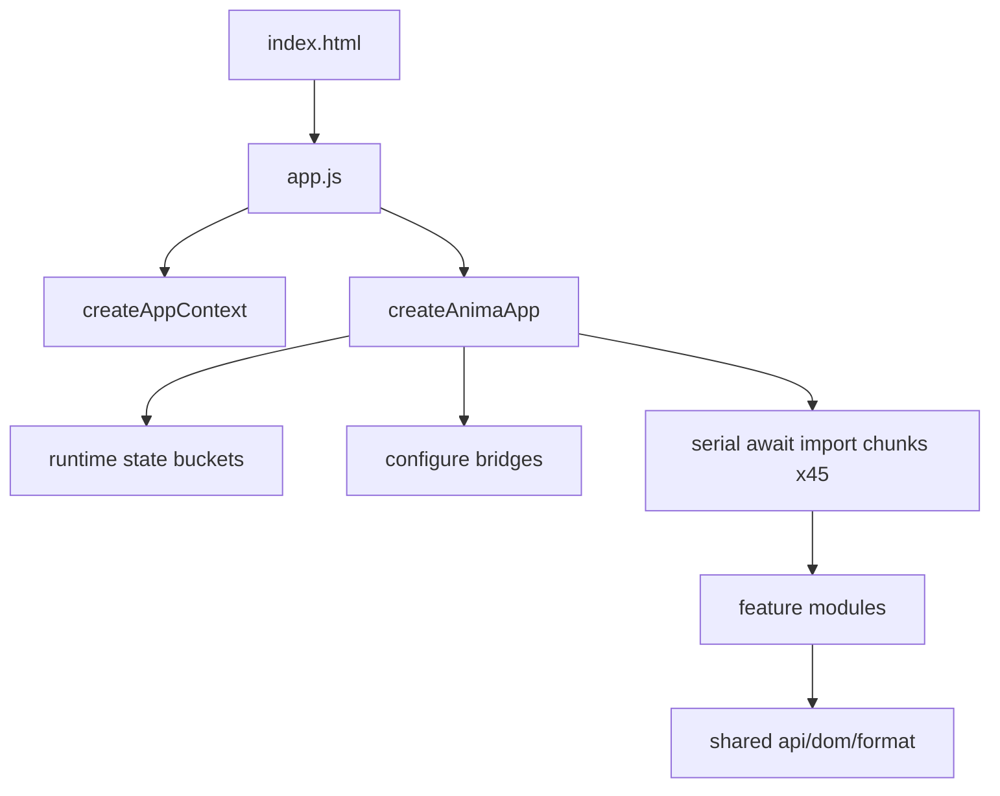

# 前端状态审核与配置优化路线（设计）

状态：草案（子代理并行审核后汇总，纳入五轮自动迭代）  
适用版本：`docs/backend-config-optimization` 基线前端；后端进度对照 `feat/backend-config-optimization`  
相关代码：

- `web/static/app.js`
- `web/static/js/features/**`
- `web/static/js/features/anima-app/chunks/**`
- `web/static/js/shared/**`
- `web/static/index.html`
- `tests/test_training_frontend_*.py`

---

## 1. 背景与目标

一句话：前端已从大单文件拆到 feature + state + bridge，但过渡层仍重；要找可持久推进的优化配置项，并接入五轮自动迭代。

### 1.1 非目标

- 不重写前端框架
- 不一次性删除 45 个 chunks
- 不在本设计阶段改训练后端语义

---

## 2. 模块地图



| 层 | 现状 |
|---|---|
| 入口 | `app.js` 很干净 |
| state | appShell/config/dataset/history/toml/training |
| chunks | 45 个，约 14.3k 行，仍是业务主仓 |
| bridges | 约 37 个，多默认 `legacyRoot=globalThis` |
| features | 19 域（queue/history/preview/image-test 等） |
| 测试 | frontend_* 约 7k 行，module/cache token/globalThis 护栏强 |

---

## 3. 健康度评分（R1 基线）

| 分项 | 满分 | 得分 |
|---|---:|---:|
| 模块边界与入口 | 15 | 13 |
| 状态管理纯度 | 15 | 9 |
| 过渡层控制 | 15 | 7 |
| 测试护栏 | 15 | 13 |
| 热点文件控制 | 10 | 6 |
| 性能 | 10 | 6 |
| UX 一致性 | 10 | 7 |
| a11y/稳健性 | 10 | 7 |
| **总分** | **100** | **68** |

等级：**D（<70）**，可长期推进，目标先抬到 C/B。

---

## 4. High / Medium 风险

| 级别 | 项 |
|---|---|
| High | bridge 未 configure 时落到 `globalThis` 静默 no-op |
| High | chunks 继续承接新业务 |
| Med | cache token 手改漏改 |
| Med | 路径展示双语义（length vs parent/basename） |
| Med | history 全量重渲染 |

---

## 5. 可优化配置项（持久推进）

| ID | 项 | 价值 | 成本 |
|---|---|---|---|
| F1 | 统一 `formatPathLabel(path, mode)` | 高 | 低中 |
| F2 | 截断路径补 `title` 全路径 | 中高 | 低 |
| B1 | cache token 单源 + 校验 | 高 | 低中 |
| A1/A2 | bridge 强制 runtime 注入 / 装配收敛 | 高 | 中 |
| G1 | chunk import 分组并行 | 高 | 中 |
| D1 | history list 虚拟化/分片 | 高 | 中高 |
| C1 | stage 状态模型命名统一 | 高 | 中 |
| E1 | config field render 迁出 chunk | 高 | 中高 |

---

## 6. 推荐推进顺序

1. F1+F2 路径展示统一
2. B1 cache token 单源
3. A2 高频 bridge 装配收敛（history/config/toml）
4. G1 启动 import 并行
5. D1 history 列表性能

---

## 7. 严格 Debug 测试

```bash
timeout 60 .venv/bin/python -m pytest   tests/test_training_frontend_modules.py   tests/test_training_frontend_queue.py   tests/test_training_frontend_history.py   tests/test_training_frontend_config_ui.py   tests/test_training_frontend_dom.py -q
```

失败诊断：

1. 是否 cache token 不一致？
2. 是否 globalThis 新增泄漏？
3. 是否 DOM id 契约被改？
4. 是否 bridge 未 configure？
5. 是否只是字符串契约噪音？

---

## 8. 与五轮迭代关系

- R3 锁定本设计
- R4 与后端计划合流
- R5 冻结 F1–F5 开工顺序
