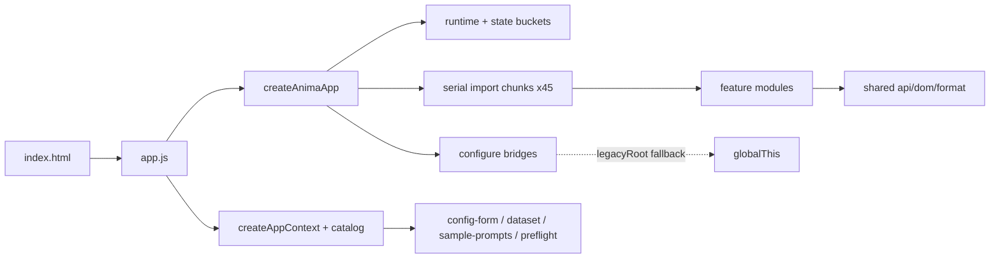
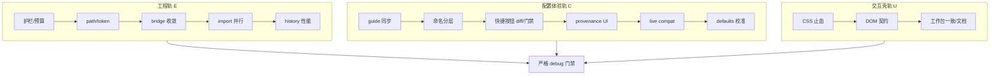

# 前端状态审核与配置优化路线（设计）

状态：草案（待用户确认后冻结）  
适用版本：`docs/backend-config-optimization` 前端基线  
日期：2026-07-11  
评分入口：`docs/features/frontend-health-scorecard.md`  
协议：`docs/superpowers/specs/2026-07-11-five-round-auto-iteration-protocol.md`  
计划：`docs/superpowers/plans/2026-07-11-frontend-config-optimization.md`

相关代码：

- `web/static/app.js`
- `web/static/js/features/**`
- `web/static/js/config/catalog/**`
- `web/static/css/**`
- `web/static/index.html`
- `tests/test_training_frontend_*.py`
- `tests/frontend_test_support.py`

---

## 1. 背景与目标

一句话：前端已经从单体拆到 feature + state + bridge，但仍处在“迁移到一半”；现在要同时还**工程债**和**配置体验债**，并用五轮严格 debug 迭代可持续推进。

### 1.1 用户要的结果

1. 快速审核当前分支前端健康度，给出规范评分结构  
2. 找到接下来可优化的配置项  
3. 产出详细、可持久推进、有严格 debug 测试流程的计划书  
4. 文档补上自动迭代能力，并按协议迭代五轮  

### 1.2 非目标

- 不重写前端框架
- 不一次性删除 45 个 chunks
- 不在本阶段改训练后端语义
- 不碰用户 history / queue / output / models 数据
- 不做自动推荐配置大而全（P2 以后）

---

## 2. 当前模块地图



| 层 | 现状 | 体量 |
|---|---|---|
| 入口 | `app.js` 干净 | 30 行 |
| state | appShell/config/dataset/history/toml/training | 已对象化 |
| chunks | 仍是业务主仓 | 45 文件 / ~14.4k 行 |
| bridges | 多数 `legacyRoot=globalThis` | 37 文件 / ~1.9k 行 |
| features | 19 域，部分已健康 | history-detail / image-test 较好 |
| catalog | help 厚，清单有漂移 | defaults ~122 keys |
| CSS | 有分层，顺序与断头有问题 | ~20k 行 / 22 文件 |
| DOM | 巨型契约 | 449 id / ~531 getElementById |
| 测试 | 架构护栏强，行为弱 | ~7k 行 frontend 测试 |

---

## 3. 健康度基线（R0 / 实现前）

一句话：总分 **61 / D**。能跑，但过渡层和配置可信度不够。

| 域 | 分 | 权重 | 加权 | 关键证据 |
|---|---:|---:|---:|---|
| A 结构与迁移 | 51 | 0.30 | 15.3 | chunks 主业务；feature 反向依赖；legacyRoot |
| B 测试与门禁 | 72 | 0.25 | 18.0 | 模块图/token 强；行为仿真弱；baseline 漂移 |
| C CSS/DOM | 56 | 0.20 | 11.2 | `90-responsive` 顺序；shared-fields 断头；449 id |
| D 配置体验 | 65 | 0.25 | 16.3 | 无 provenance UI；ghost guide；命名三层混 |
| **总分** |  |  | **61** | **D** |

并行审核角色：

| 角色 | 结论摘要 |
|---|---|
| structure-auditor | 51；先立预算，再按域搬家 |
| test-auditor | 72；L2 架构门禁可严格，L3 交互门禁不足 |
| css-ux-auditor | 56；先止血层叠与契约 |
| config-surface-auditor | 65；先做来源/命名/门禁，别继续堆字段 |

---

## 4. 问题分级

### High

1. chunks 继续承接新业务，过渡层永久化  
2. bridge `legacyRoot` 静默 no-op  
3. `FORM_UI_DEFAULTS` 与 merge chain 混层  
4. guide/variant 与 `configs/gui-methods/` 不同步  
5. CSS import 顺序 + `13-shared-fields.css` 断头  
6. 行为级 debug 证据链不足  

### Medium

1. feature 反向 import chunks  
2. history 全量重渲染 / 启动 import 全串行  
3. 快捷按钮无 diff、无方法门禁  
4. preflight 强但表单 live 互斥弱  
5. DOM contract 覆盖窄  
6. `docs/features` 几乎只有 ui-scale  

### Low

1. forge 皮肤重复  
2. UI 缩放过细  
3. 静态断言过细导致重构抖动  

---

## 5. 双轨优化模型

一句话：工程轨保证以后改得动，配置轨保证用户配得明白；两轨共用严格 debug 门禁。



### 5.1 工程轨（E）

| ID | 项 | 价值 | 成本 | 优先 |
|---|---|---|---|---|
| E0 | 结构预算 + 扫描清单 | 高 | 低 | R1 |
| E1 | `formatPathLabel` + title 全路径 | 高 | 低中 | R3 |
| E2 | 高频 bridge 去 legacyRoot / fail-fast | 高 | 中 | R3 |
| E3 | chunk import 分组并行 | 中高 | 中 | R4 |
| E4 | history 列表分片渲染 | 高 | 中高 | R5 |

### 5.2 配置体验轨（C）

| ID | 项 | 价值 | 成本 | 优先 |
|---|---|---|---|---|
| C2 | guide/variant 与 gui-methods 同步 | 高 | 低中 | R1-R2 |
| C3 | 硬件 preset / 方法变体 / 快捷按钮命名分层 | 高 | 低中 | R2 |
| C4 | 快捷按钮 diff 预览 + 方法门禁 | 高 | 中 | R2 |
| C1 | 字段来源徽标 + 保存前 diff | 很高 | 中高 | R3 |
| C5 | 表单 live 兼容提示前移 | 高 | 中 | R4 |
| C6 | `FORM_UI_DEFAULTS` 校准与 ui_only 标记 | 高 | 中 | R3-R4 |

### 5.3 交互壳轨（U/T）

| ID | 项 | 价值 | 成本 | 优先 |
|---|---|---|---|---|
| U0 | CSS import 顺序 + shared-fields 断头修复 | 高 | 低 | R1 |
| T0 | globalThis baseline 同步 + 快速红灯固化 | 高 | 低 | R1 |
| T1 | DOM contract 扩展 + Node harness 起步 | 高 | 中 | R2 |
| U1 | 关键 DOM id 注册表 | 高 | 中 | R4 |
| U2 | docs/features 对齐真实 UI | 中高 | 低中 | R5 |

---

## 6. 关键数据契约（配置轨）

前端字段展示统一目标形态：

```text
FieldPresentation = {
  key: string,
  value: any,
  source: "base" | "preset" | "method" | "runtime" | "user" | "ui_default" | "unknown",
  layer: string,
  isUiDefault: bool,
  isDirty: bool,
  conflicts: [{code, severity, message}],
}
```

规则：

- UI 兜底值必须标 `ui_default`，不得伪装成 merge 结果  
- dirty 判定以“相对当前 loaded merge 快照”为准，不以 FORM_UI_DEFAULTS 为准  
- 兼容 code 优先复用后端 preflight/compat matrix，不另造一套文案真相  

API 边界（R3 再定最终形态，二选一）：

1. load config 时附 provenance map  
2. 独立 `/api/config/explain?keys=...`  

默认推荐 1：改动面更小，保存前 diff 更自然。

---

## 7. 五轮实现路线

| 轮 | 主题 | 任务 | 出口标准 |
|---|---|---|---|
| R1 | 基线 + 止血 | E0, T0, U0, C2 起步 | 评分卡入库；CSS/baseline 不回归；ghost guide 清单产出 |
| R2 | 配置可信 P0 | C2, C3, C4, T1 | guide 同步；命名分层；快捷按钮有 diff/门禁；DOM/Node 护栏增强 |
| R3 | 来源可见 + bridge | C1, C6, E1, E2 | 关键字段有来源；path 统一；history/config/toml 高频 bridge fail-fast |
| R4 | 兼容前移 + 性能 | C5, E3, U1 | live 互斥提示；import 并行不破坏装配顺序；关键 DOM 注册表 |
| R5 | 收口 | E4, U2, Freeze | history 性能改善；docs/features 对齐；健康分目标 ≥78 或明确残留 |

---

## 8. 严格 Debug 与验收

详见协议。每个任务最低要求：

1. 先补/改失败测试  
2. 跑红  
3. 最小实现  
4. 跑绿  
5. 跑所属轮次门禁包  
6. 记入迭代日志  

跨任务回归最小集：

```bash
timeout 60 .venv/bin/python -m pytest \
  tests/test_training_frontend_modules.py \
  tests/test_training_frontend_queue.py \
  tests/test_training_frontend_history.py \
  tests/test_training_frontend_config_ui.py \
  tests/test_training_frontend_dom.py \
  -q
```

---

## 9. 风险与约束

| 风险 | 缓解 |
|---|---|
| 写集挤在 anima-app/index.js | 按域串行合并，先读并行 |
| bridge 顺序敏感 | fail-fast + configure 顺序测试 |
| 改默认值改变保存行为 | C6 先标记 ui_only，不直接改写入语义 |
| 字符串契约过脆 | 新测试优先行为/契约，不锁文案像素 |
| 文档空转 | 无测试结果不得上调健康分 |

---

## 10. 完成定义

- 评分结构成为日常入口（features 索引可达）  
- 双轨计划可按任务开工  
- 五轮协议有硬门禁命令  
- 基线 High 有收敛路径  
- 不引入新的 globalThis 业务总线  
- 不破坏训练语义与用户数据  

---

## 11. 待确认点

1. 是否同意“工程轨 + 配置体验轨 + 交互壳轨”三轨并行、按轮收敛？  
2. provenance 是挂在 load config 响应，还是单独 explain API？  
3. 五轮是立即进入实现，还是先冻结文档再开实现分支？  
