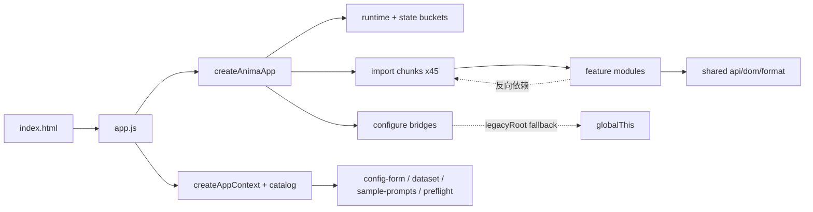
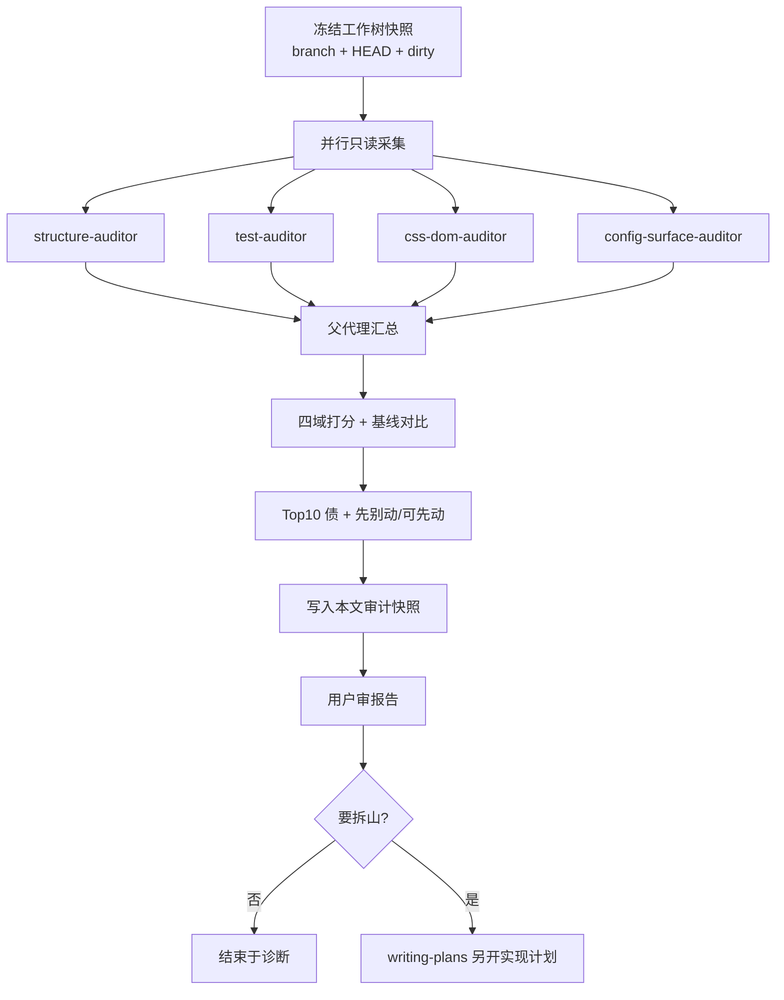

# Web 前端石山体检设计（只读诊断）

状态：审计快照已填写（只读体检完成；当前工作树）  
适用版本：当前工作树（执行时以 `git rev-parse --short HEAD` 与 dirty 摘要为准）  
日期：2026-07-11  
评分入口：`docs/features/frontend-health-scorecard.md`  
相关既有设计：`docs/superpowers/specs/2026-07-11-frontend-config-optimization-design.md`  
协议：`docs/superpowers/specs/2026-07-11-five-round-auto-iteration-protocol.md`

相关代码：

- `web/static/app.js`
- `web/static/js/features/**`
- `web/static/js/config/catalog/**`
- `web/static/css/**`
- `web/static/index.html`
- `tests/test_training_frontend_*.py`
- `tests/frontend_test_support.py`

---

## 1. 背景与目标

一句话：前端已从单体拆到 feature + state + bridge，但仍处在“迁移到一半”；用户感到 Web 前端仍是石山，需要一次**可拍板的全前端健康诊断**，本轮**不改业务代码**。

### 1.1 用户确认的约束

| 项 | 选择 |
|---|---|
| 交付形态 | **A**：诊断报告（健康分 + Top 债 + 基线对比） |
| 检查范围 | **A**：全前端体检（结构 / 测试门禁 / CSS·DOM / 配置体验） |
| 成功标准 | **A**：可拍板分数 + Top10 债；对比 R0 与 IR5 |
| 检查做法 | **方案 2**：评分卡 + 可复现证据包 |

### 1.2 非目标

- 不重写前端框架
- 不一次性删除 chunks / bridges
- 不改训练后端语义
- 不碰用户 history / queue / output / models 数据
- 本轮不写 `web/static/**` 业务修复 patch（审计文档除外）
- 不做自动推荐配置大而全

### 1.3 与既有五轮工作的关系

- 五轮前端配置优化已有设计、计划、评分卡与 IR5 估计分（约 78 / C+）。
- 本设计**不替代**五轮实现史，而是对**当前工作树**做一次独立复评。
- IR5 分数是估计/目标口径；本次以文件扫描 + 护栏测试的**实测**为准。
- 若实测低于 IR5，报告必须写清：回归、工作区脏改动、或当时估计偏乐观。

---

## 2. 交付物

一句话：一份设计冻结文档 + 同文件内的「审计快照」章节（执行诊断后填实）。

| 产物 | 路径 / 形态 | 何时写 |
|---|---|---|
| 本设计 | `docs/superpowers/specs/2026-07-11-web-frontend-boulder-audit-design.md` | 用户批准设计后立即 |
| 审计快照 | 本文 §8 及以后（分数表、Top10、证据摘要） | 执行只读诊断后 |
| 索引 | `docs/superpowers/README.md` 增加本 spec 一行 | 与设计一并 |

不做：

- 不改业务 JS/CSS/HTML（审计过程只读）
- 不强制改 `docs/features/frontend-health-scorecard.md` 的冻结基线段（可选在审计后另开小 PR 更新“最近一次复评”指针）

---

## 3. 当前模块地图（诊断用真相草图）

一句话：入口干净，石山集中在 `anima-app` 过渡层与巨型 CSS/DOM 契约。



| 层 | 现状（设计阶段摸底，执行时复测） | 体量粗数 |
|---|---|---|
| 入口 | `app.js` 只做 bootstrap | ~30 行 |
| state | appShell/config/dataset/history/toml/training | 已对象化 |
| chunks | 真业务 + 兼容 shim 混装 | 45 文件 / ~14.4k 行 |
| bridges / helpers | 大量 `legacyRoot = globalThis` 静默转发 | helpers 约 53；bridge 约 37 |
| features | 19 域；部分已健康 | anima-app 仍 ~17.7k 行最大 |
| CSS | 有分层；仍有多份 1.5k–3k 巨石 | ~22k 行 / 22 文件 |
| DOM | 巨型契约 | ~1950 行 HTML / ~450 id |
| 测试 | 架构护栏相对强，行为仿真偏弱 | 既有 `test_training_frontend_*` |

摸底时已见的典型模式：

- 部分 chunk 已是纯 re-export shim（如 queue-view / event-listeners）。
- 大量 bridge 形如 `legacyRoot.foo?.(...args)`，未 configure 时静默 no-op。
- 多个 feature（config-form、dataset-editor、toml-manager、app-shell 等）**反向 import chunks**。
- chunk 文件名与真实职责常不对齐（机械拆分遗留）。

---

## 4. 证据包（方案 2 必做）

一句话：分数必须可复现；无证据不上调。

### 4.1 规模扫描

- features 目录数
- chunks 数量与总行数；重业务 vs 纯 shim 粗分
- `helpers/*-bridge.js` 数量与行数
- DOM `id="` 数量、`index.html` 行数
- CSS 总行与 Top 文件
- 各 feature 域 JS 总行分布

### 4.2 结构债扫描

- 含 `legacyRoot = globalThis`（或等价）的 bridge 名单与数量
- feature → `anima-app/chunks` 反向 import 边列表
- `globalThis` 写入点（相对护栏 baseline，若测试提供）
- `anima-app/index.js` 装配顺序：串行/并行 import 组是否仍脆

### 4.3 门禁命令

```bash
git status --short --branch
git rev-parse --short HEAD

timeout 60 .venv/bin/python -m pytest \
  tests/test_training_frontend_modules.py::test_frontend_module_graph_follows_production_entrypoint \
  tests/test_training_frontend_modules.py::test_frontend_module_cache_tokens_match_entrypoint \
  tests/test_training_frontend_modules.py::test_frontend_css_import_cache_tokens_match_entrypoint \
  tests/test_training_frontend_modules.py::test_anima_app_global_this_writes_do_not_grow \
  tests/test_training_frontend_modules.py::test_split_frontend_features_do_not_write_global_this \
  tests/test_training_frontend_dom.py \
  -q
```

规则：

- 默认 `timeout 60`、优先 `.venv/bin/python`
- 超时或环境失败：B 域写「证据缺失」并扣分，不假装全绿
- 不默认跑大模型/长训练/全量无关测试

### 4.4 人工必读点

| 优先级 | 路径 | 看什么 |
|---|---|---|
| P0 | `web/static/app.js` | 是否仍只做 bootstrap |
| P0 | `web/static/js/features/anima-app/index.js` | chunk 加载与 bridge 装配 |
| P0 | `web/static/js/features/anima-app/chunks/` | 是否继续堆新业务 |
| P0 | `web/static/js/features/anima-app/helpers/*-bridge.js` | `legacyRoot` / fail-fast |
| P0 | `web/static/js/config/catalog/*` | defaults/guide 可信度抽查 |
| P1 | `web/static/style.css` | import 顺序与响应式兜底 |
| P1 | `web/static/index.html` | DOM id 契约体量 |
| P1 | `docs/features/*` | 文档是否描述真实 UI |

---

## 5. 评分规则

一句话：沿用评分卡 4 域加权，不另发明分制。

### 5.1 公式与等级

| 域 | 权重 | 本轮焦点 |
|---|---:|---|
| A 结构与迁移 | 30% | chunks、bridge/`legacyRoot`、反向依赖、入口厚度 |
| B 测试与门禁 | 25% | 模块图/token/`globalThis` 护栏；行为仿真广度 |
| C CSS / DOM / 交互壳 | 20% | 巨石 CSS、import 顺序、DOM id、文档对齐 |
| D 配置体验表面 | 25% | defaults 混层、provenance/live compat 残留、命名分层 |

```text
总分 = round(A*0.30 + B*0.25 + C*0.20 + D*0.25)
```

| 等级 | 分数 | 含义 |
|---|---:|---|
| A | 90-100 | 可长期演进，过渡层受控 |
| B | 80-89 | 主路径稳，债可控 |
| C | 70-79 | 能用，但每轮必须还债 |
| D | 60-69 | 能跑，迁移/配置可信度不足 |
| F | <60 | 架构或契约风险过高，优先止血 |

### 5.2 取证锚点（防空口分）

| 域 | 必采证据 | 打分锚点（简） |
|---|---|---|
| A | chunks/shim 比、`legacyRoot` 名单、反向 import 边、入口形态 | 入口薄但过渡层厚难上 80；silent bridge + 反向依赖多压在 50–65 档 |
| B | 护栏 pytest 摘要、frontend 测试覆盖面粗扫 | 架构门禁绿可撑 70+；行为弱则约 75–80 封顶 |
| C | CSS Top、style 顺序、DOM id 数 | 单文件 >2k CSS / 450+ id 继续扣；顺序/断头已修可加分 |
| D | 对照五轮已声称能力抽查现状 | 能力仍在则保留分；混层/消息覆盖等残留继续扣 |

### 5.3 基线对比表（执行时填实测列）

| 域 | R0 设计基线 | IR5 估计 | 本次实测 |
|---|---:|---:|---:|
| A 结构与迁移 | 51 | （见 scorecard / 迭代日志） | **62**（见 §8） |
| B 测试与门禁 | 72 | （IR5 估计偏高） | **67**（见 §8） |
| C CSS/DOM | 56 | （IR5 估计） | **73**（见 §8） |
| D 配置体验 | 65 | （IR5 估计） | **75**（见 §8） |
| **总分** | **61 / D** | **~78 / C+** | **69 / D**（见 §8） |

说明：R0 数字来自 `2026-07-11-frontend-config-optimization-design.md`；IR5 来自 `frontend-health-scorecard.md` 冻结段。执行审计时不得只复制 IR5，必须填实测。

### 5.4 约束

- 无证据 → 不得上调该域相对 IR5 的分数叙事
- 护栏红灯 → B 域必须显式扣，并进入 Top 债
- 文档说法服从代码与测试
- 工作区 dirty 时，标题与摘要必须写「当前工作树」，并附 `git status` 摘要

---

## 6. Top 债模型

一句话：按严重度与证据强度排序，不靠感觉排第一。

### 6.1 条目字段

| 字段 | 含义 |
|---|---|
| `id` | 如 `Boulder-A1` |
| `severity` | High / Med / Low |
| `domain` | A / B / C / D |
| `title` | 一句话 |
| `evidence` | 路径 + 扫描数字或测试结果 |
| `impact` | 维护 / 正确性 / 性能 / 体验 |
| `suggested_next` | 建议优先级（仍不实现） |
| `do_not` | 明确禁止的莽法 |

### 6.2 排序规则

1. High 且影响正确性 / 静默失败（如 unconfigured bridge no-op）
2. High 且让迁移永久化（新业务继续进 chunks、反向依赖）
3. Med：体量、性能、契约脆弱
4. Low：皮肤重复、文档缺口
5. 同分：证据更硬、后续写集更清晰者优先

### 6.3 输出形态

- 主报告：**High 尽量列全**，Med 凑满 **Top10**
- Low 仅附录点名
- 每条建议只到「域 + 优先级 + 不做什么」，不写具体 patch

### 6.4 先别动 / 可先动（审计快照必填）

| 类型 | 示例原则 |
|---|---|
| 先别动 | 一次删 45 chunks；大改 DOM id 无契约测试；改默认值写入语义未标 ui_only；碰用户数据目录 |
| 可先动（下一轮 plan） | 只读债清单落地后：按域搬家、高频 bridge fail-fast、CSS 巨石拆分、反向依赖切断——均需另开实现计划 |

---

## 7. 执行流程与并行

一句话：只读并行采集 → 父代理汇总打分 → 写入审计快照。



### 7.1 子任务卡片

| task_id | role | objective | input_scope | output_format | acceptance | write_scope | sandbox | risk |
|---|---|---|---|---|---|---|---|---|
| S1 | structure-auditor | chunks/bridge/反向依赖/globalThis 统计 | `web/static/js/**` | 表 + 边列表 | 数字可复现 | 无 | read-only | Low |
| S2 | test-auditor | 跑护栏用例并摘要 | `tests/test_training_frontend_*.py` | 命令 + 红绿摘要 | 60s 内有结论 | 无 | 测试只读 | Low |
| S3 | css-dom-auditor | CSS Top、import、DOM id | `css/**` `index.html` `style.css` | 表 + 风险点 | 有路径证据 | 无 | read-only | Low |
| S4 | config-surface-auditor | catalog/体验债 vs 五轮声称 | `js/config/catalog/**` 等 | 残留清单 | 不空口 | 无 | read-only | Low |

约束：

- `max_depth=1`，子代理不再 spawn
- 子任务之间不写同一文件；最终文档由父代理串行写入
- 等待有上限；失败/超时记入快照，触发有限重试或父代理接管

### 7.2 报告章节（审计快照）

1. 一句话结论 + 总分/等级  
2. 四域分数表 + R0 / IR5 / 实测  
3. 模块地图（可复用 §3，数字用实测更新）  
4. High/Med Top10 债  
5. 先别动 / 可先动  
6. 门禁与扫描命令输出摘要  
7. 最小下一步（停诊断 or 转 writing-plans）

---

## 8. 审计快照（执行后填写）

状态：**已执行**（当前工作树，含未提交 dirty）

| 项 | 值 |
|---|---|
| 分支 | `docs/web-frontend-boulder-audit` |
| HEAD | `5f99cf33` |
| dirty 摘要 | **45** 项未提交；top：`web` 31 / `docs` 7 / `_archive` 2 / `tests` 2；采集 `2026-07-11T15:59:26+08:00` |
| 总分 / 等级 | **69 / D** |
| 护栏结果 | **13 passed, 1 failed**（`test_frontend_module_cache_tokens_match_entrypoint`：部分模块 token 为 `module-bootstrap-20260711-1`，入口期望 `module-bootstrap-20260707-93`） |

### 8.1 分数表

| 域 | R0 | IR5 估计 | 本次实测 | 证据摘要 |
|---|---:|---:|---:|---|
| A 结构与迁移 | 51 | ~70 档（估计） | **62** | 入口薄（`app.js` 30 行）；`index.js` 已 `Promise.all`；shim-like chunk **16/45**；fail-fast bridge **11**；但仍有 heavy chunk **27**、`legacyRoot` bridge **24**、反向 import **27 边 / 12 文件**；`anima-app` **17736** 行仍为最大域 |
| B 测试与门禁 | 72 | 高 | **67** | frontend 测试 8 文件 / **7551** 行；固定门禁 13 绿 1 红（cache token）；架构护栏仍在，行为面相对 modules/config 偏厚、state 极薄（10 行） |
| C CSS/DOM | 56 | 中高 | **73** | `90-responsive` 在 import **末位**；DOM id **451** 无重复；`docs/features` **10** 篇；CSS 总行 **20218**，Top：`21-history-panels` 3192 / dataset-editor 2270 / training-forge 2174 |
| D 配置体验 | 65 | 高 | **75** | provenance / `ui_default` / liveCompat / dirty / `formatPathLabel` / guides 均在代码中可定位；gui-methods **20** 与 guides 文本粗对齐无缺失；体验逻辑仍大量落在 chunks；status 写点仍多（~27 文件），IR5 提到的消息覆盖风险未排除 |
| **总分** | **61 / D** | **~78 / C+** | **69 / D** | `round(62*0.30+67*0.25+73*0.20+75*0.25)=69` |

**相对 IR5 偏低的原因（实测口径）：**

1. 结构过渡层未退役到 IR5 叙事水平（24 silent legacyRoot + 12 文件反向依赖 + 27 重 chunk）。  
2. 当前工作树 cache token 护栏红灯，B 域不能按“全绿门禁”给分。  
3. IR5 分数本身为估计/目标口径，非本次同尺全表复评。

### 8.2 Top10 债

| id | severity | domain | title | evidence | impact | suggested_next | do_not |
|---|---|---|---|---|---|---|---|
| Boulder-A1 | High | A | 24 个 bridge 仍 `legacyRoot=globalThis` 静默转发 | `helpers/*-bridge.js` 扫描：legacy_only 24（如 `history-collections-bridge.js`、`toml-*-bridge.js`）；failfast_only 11 | 正确性：未 configure 时 no-op，难排查 | P0：按调用频率把 history/toml/config 类 bridge 改为 fail-fast 或显式 handler | 一次删光全部 bridge |
| Boulder-A2 | High | A | feature → chunks 反向依赖仍在 | 27 边 / 12 文件，如 `config-form/index.js`、`dataset-editor/row.js`、`toml-manager/*`、`app-shell/*` | 维护：依赖方向反，搬家必环 | P0：按域切断，真相迁入 feature 再让 chunk 变 shim | 只改 import 路径不搬实现 |
| Boulder-A3 | High | A | chunks 仍是业务主仓 | heavy≥200：**27**；chunks 总行 **14447**；shim-like 仅 16 | 迁移永久化 | P1：禁止新业务进 chunks；按 history/config/dataset 分批搬家 | 一次性删除 45 chunks |
| Boulder-B1 | High | B | 模块 cache token 与入口不一致（护栏红） | pytest：`test_frontend_module_cache_tokens_match_entrypoint` failed；`module-bootstrap-20260711-1` vs `…20260707-93` | 缓存一致性/可回归 | P0：在改前端的同一写集对齐 token（本审计不修业务） | 为消红灯关测试 |
| Boulder-A4 | Med | A | `anima-app` 体量仍碾压其它域 | domain lines：anima-app 17736 ≫ history-detail 4438 | 维护成本 | P1：持续把 chunk/helpers 职责外迁 | 在 anima-app 继续堆新大函数 |
| Boulder-C1 | Med | C | 巨型 CSS 文件 | `21-history-panels.css` 3192；dataset-editor 2270；training-forge 2174；总 20218 | 可维护性/冲突面 | P2：按面板拆分，不动视觉语义 | 全局格式化重排无关 CSS |
| Boulder-C2 | Med | C | DOM id 契约过大 | `index.html` ~1947 行；id **451**（无重复） | 改 UI 脆、测试成本高 | P2：关键 id 注册表 + 契约测试扩展 | 无测试批量改 id |
| Boulder-D1 | Med | D | 配置体验实现仍穿透 chunks | provenance/liveCompat/dirty 命中多在 `chunks/14-…`、`18-…` 等 | 体验与结构债耦合 | P1：随 A2 搬家把体验逻辑收进 `config-form` | 在 chunk 里继续加 provenance 分支 |
| Boulder-D2 | Med | D | status 写点分散，消息互盖风险残留 | ~27 文件触及 status/setTomlStatus 等；IR5 亦提示 C5 覆盖 | 体验：提示被冲掉 | P2：统一 status owner / 优先级 | 再加平行 setStatus 通道 |
| Boulder-B2 | Med | B | 行为级测试不均 | `config_ui` 3101 行 vs `state` 10 行；history/queue 有、交互仿真仍偏契约 | 重构回归盲区 | P2：补关键状态机/桥接顺序测试 | 只加字符串快照锁死文案 |

**Low（附录）**

- forge 皮肤 CSS 重复（多份 `*-forge.css`）  
- chunk 文件名与职责不对齐（机械拆分遗留）  
- `docs/features` 已有 10 篇，但仍缺 image-test / weight-analysis 等独立说明  

### 8.3 先别动 / 可先动

**先别动**

- 一次删除全部 45 chunks 或 37 bridges  
- 无 DOM 契约测试下批量改 `index.html` id  
- 未标 `ui_only` 就改保存写入默认值语义  
- 为了本审计去改/提交无关的 45 项 dirty 业务改动  
- 碰 `history` / `queue` / `output` / `models` 用户数据  

**可先动（需另开实现 plan，不在本审计）**

1. 对齐 cache token 护栏（若继续在脏前端上开发）  
2. 高频 bridge fail-fast（history/toml/config）  
3. 切断 `config-form` / `dataset-editor` / `toml-manager` → chunks 反向边  
4. 选 1 个 heavy chunk 域做搬家样板  
5. 拆 `21-history-panels.css` 或补 image-test 文档  

**最小下一步**

- 诊断任务到此可结束。  
- 若要拆山：对 **Boulder-A1+A2** 或 **B1 token** 另开 `writing-plans` 实现计划。  
- 本分支仅保留审计文档提交；不要把工作区其它 `web/static` dirty 混进审计 commit。

### 8.4 命令与扫描摘要

```text
branch: docs/web-frontend-boulder-audit
HEAD: 5f99cf33
dirty_count: 45 (web:31, docs:7, tests:2, ...)
features: 19
chunks: 45 / lines 14447 (shim_like 16, heavy_ge_200 27)
bridges: 37 / lines 1837 (legacyRoot 24, failfast-style 11, neither 2)
reverse_import_edges: 27 (unique files 12)
app.js: 30 lines; anima-app/index.js: 106 lines; Promise.all: true
css_files: 22 / total_lines 20218; 90-responsive: last import
dom_id_count: 451 unique; duplicate_ids: 0
docs/features: 10
gui-methods: 20; guides.js text covers stems: yes
pytest gate: 13 passed, 1 failed (cache tokens) in 7.17s; exit_code=1
score: A62 B67 C73 D75 => 69/D
```

证据落盘（git-ignore 工作区，可不提交）：

- `.superpowers/sdd/boulder-audit-evidence/task1-meta.md`
- `.superpowers/sdd/boulder-audit-evidence/task2-structure.md`
- `.superpowers/sdd/boulder-audit-evidence/task3-tests.md`
- `.superpowers/sdd/boulder-audit-evidence/task4-css-dom.md`
- `.superpowers/sdd/boulder-audit-evidence/task5-config-surface.md`

## 9. 风险

| 风险 | 缓解 |
|---|---|
| IR5 非全表人工复评 | 标明估计口径；本次以实测为准 |
| 工作区有无关 dirty | 快照注明；分数描述当前工作树 |
| 护栏失败拖垮节奏 | 记失败摘要，B 域如实扣分 |
| 诊断膨胀成半份重构方案 | YAGNI：建议止于域与优先级 |
| 误触用户数据 / 长训练 | 本轮零触碰 |
| 文档与代码不一致 | 代码与测试优先 |

---

## 10. 完成定义（DoD）

全部满足才算本诊断任务完成：

- [x] 四域分数 + 总分/等级已给出，且每域有证据
- [x] 与 R0、IR5 有对比表
- [x] High/Med Top10 债字段完整
- [x] 写明先别动 / 可先动
- [x] 未改业务代码与用户数据
- [x] 本 design + 审计快照已落盘，用户可审
- [x] 给出最小下一步（停诊断 or 转 writing-plans）

设计阶段 DoD（本文首次落盘）：

- [x] 用户确认交付形态 / 范围 / 成功标准 / 方案 2
- [x] 第 1–3 节设计已口头确认
- [x] 本文件写入 `docs/superpowers/specs/`
- [x] 索引可达（`docs/superpowers/README.md`）
- [x] 用户审阅本 spec 后，再执行 §7 审计并填 §8

---

## 11. 后续闸门

1. **用户审阅本 spec**（可改文字，不直接开工拆山）  
2. 用户确认后：按 §7 执行只读诊断，填写 §8  
3. 若要拆山：调用 `writing-plans`，对象是实现计划，不是再开空设计  
4. writing-plans 在「仅执行审计」场景下，也可只产出「审计执行 plan」；**禁止**在未批准实现范围时直接改 chunks 业务

---

## 12. Spec 自检记录

| 检查项 | 结果 |
|---|---|
| Placeholder | §8 明确为「执行后填写」，非含糊 TBD 需求 |
| 内部一致性 | 交付 A / 范围 A / 成功 A / 方案 2 与评分卡一致 |
| 范围 | 单次只读诊断 + 报告，可单 plan 执行 |
| 歧义 | 实测 vs IR5 估计已写明优先实测 |
| 与仓库约定 | 中文文档；命令用 timeout + `.venv`；不碰用户数据 |
